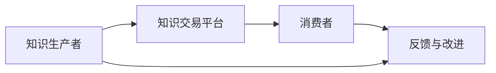

                 

在当今这个知识爆炸的时代，知识付费已经成为了经济增长的重要引擎。本文将探讨知识付费的创新商业模式运营，重点分析其在知识经济时代的重要作用、核心概念、算法原理、数学模型、项目实践以及未来的发展趋势与挑战。

> **关键词：知识付费、创新商业模式、知识经济、算法原理、数学模型、项目实践**

> **摘要：本文首先介绍了知识付费在知识经济时代的重要性，然后详细分析了知识付费的核心概念与架构，接着探讨了知识付费的算法原理与数学模型，并展示了实际项目实践。最后，我们对知识付费的未来发展趋势与挑战进行了展望。**

## 1. 背景介绍

知识付费，顾名思义，是指消费者为了获取有价值的信息、知识和技能，而愿意支付一定费用的行为。随着互联网和移动互联网的快速发展，知识的获取和传播方式发生了巨大的变化。传统的教育体系无法满足人们对个性化和即时化知识的需求，而知识付费模式则为知识的交易提供了新的平台和机会。

知识付费的主要形式包括在线课程、电子书、专家咨询、专业认证等。这些形式不仅为知识生产者提供了收入的来源，也为消费者提供了更加灵活和便捷的知识获取方式。知识付费的兴起，推动了知识共享和知识交易的繁荣，也为知识经济时代的经济发展注入了新的活力。

## 2. 核心概念与联系

### 2.1. 知识付费的定义与特点

知识付费的定义较为简单，即消费者通过支付一定费用来获取有价值的信息、知识和技能。其特点主要包括：

- **价值驱动**：消费者愿意为价值买单，知识的质量和实用性是其决定因素。
- **个性化和即时性**：知识付费满足了人们对个性化和即时性知识的需求，消费者可以根据自己的需求选择适合自己的知识产品。
- **平台化**：知识付费的兴起，催生了大量知识分享和交易平台，如知乎、网易云课堂等。

### 2.2. 知识付费的架构

知识付费的架构主要包括知识生产、知识交易、知识消费三个环节。以下是知识付费架构的 Mermaid 流程图：



### 2.3. 知识付费与传统教育模式对比

知识付费与传统教育模式在以下几个方面存在明显差异：

- **学习方式**：传统教育模式以线下授课为主，而知识付费以线上学习为主，更加灵活和便捷。
- **知识传播**：传统教育模式知识传播范围有限，而知识付费可以快速传播到全球，实现了知识的全球化共享。
- **教学互动**：传统教育模式师生互动较少，而知识付费平台提供了丰富的互动功能，如问答、讨论等，增强了学习体验。

## 3. 核心算法原理 & 具体操作步骤

### 3.1. 算法原理概述

知识付费的核心算法主要涉及推荐算法和支付算法。推荐算法用于根据消费者的兴趣和需求，为其推荐合适的知识产品。支付算法则用于确保交易的顺利进行，包括支付安全、支付方式选择等。

### 3.2. 算法步骤详解

#### 推荐算法步骤：

1. **数据收集**：收集消费者的学习历史、浏览记录、评价等数据。
2. **特征提取**：从数据中提取消费者的兴趣特征和知识产品的特征。
3. **模型训练**：利用机器学习算法，如协同过滤、矩阵分解等，训练推荐模型。
4. **推荐生成**：根据消费者的特征和知识产品的特征，生成推荐结果。

#### 支付算法步骤：

1. **支付方式选择**：根据消费者的支付偏好和平台提供的支付方式，选择合适的支付方式。
2. **支付安全验证**：对消费者的支付信息进行安全验证，如验证码、支付密码等。
3. **支付处理**：处理支付请求，包括扣款、退款等。
4. **支付结果反馈**：将支付结果反馈给消费者和知识生产者。

### 3.3. 算法优缺点

#### 推荐算法优缺点：

- **优点**：能够根据消费者的兴趣和需求，提供个性化的推荐，提高知识产品的转化率。
- **缺点**：推荐结果可能存在偏差，如信息茧房、推荐过度等问题。

#### 支付算法优缺点：

- **优点**：保障支付安全，提高交易成功率。
- **缺点**：支付过程可能较为复杂，影响用户体验。

### 3.4. 算法应用领域

知识付费算法主要应用于在线教育、电子书、专家咨询等领域。通过推荐算法，平台可以提高知识产品的曝光率和转化率，通过支付算法，保障交易的顺利进行，提高消费者的满意度。

## 4. 数学模型和公式 & 详细讲解 & 举例说明

### 4.1. 数学模型构建

知识付费的数学模型主要涉及推荐算法和支付算法。以下是推荐算法和支付算法的数学模型：

#### 推荐算法数学模型：

1. **用户-物品评分矩阵**：设用户集合为 U，物品集合为 I，用户 u 对物品 i 的评分记为 $r_{ui}$。
2. **用户兴趣特征向量**：设用户 u 的兴趣特征向量为 $v_u$。
3. **物品特征向量**：设物品 i 的特征向量为 $v_i$。
4. **推荐评分预测**：设用户 u 对物品 i 的推荐评分为 $r_{ui}^*$。

推荐评分预测模型可以表示为：

$$
r_{ui}^* = v_u^T v_i + b_u + b_i + \mu
$$

其中，$b_u$ 和 $b_i$ 分别为用户 u 和物品 i 的偏差，$\mu$ 为全局偏差。

#### 支付算法数学模型：

1. **支付金额**：设支付金额为 $P$。
2. **支付折扣**：设支付折扣为 $d$。
3. **支付后金额**：设支付后金额为 $P^*$。

支付算法可以表示为：

$$
P^* = P (1 - d)
$$

### 4.2. 公式推导过程

#### 推荐算法公式推导：

1. **用户兴趣特征向量**：根据用户的浏览记录、学习历史等数据，可以使用矩阵分解方法，将用户-物品评分矩阵分解为用户特征向量和物品特征向量。

2. **推荐评分预测**：根据用户兴趣特征向量和物品特征向量，计算用户对物品的推荐评分。

#### 支付算法公式推导：

1. **支付金额**：根据知识产品的价格和消费者的购买数量，计算支付金额。

2. **支付折扣**：根据消费者的购买记录、支付金额等数据，计算支付折扣。

3. **支付后金额**：根据支付金额和支付折扣，计算支付后金额。

### 4.3. 案例分析与讲解

#### 推荐算法案例：

假设用户 u 对课程 i 的评分为 4 分，用户 u 的兴趣特征向量为 $v_u = (0.5, 0.3, 0.2)$，课程 i 的特征向量为 $v_i = (0.6, 0.4, 0.3)$，全局偏差 $\mu = 0.1$。根据推荐算法公式，可以计算用户 u 对课程 i 的推荐评分为：

$$
r_{ui}^* = v_u^T v_i + b_u + b_i + \mu = (0.5 \times 0.6 + 0.3 \times 0.4 + 0.2 \times 0.3) + b_u + b_i + 0.1 = 0.35 + b_u + b_i + 0.1 = 0.45 + b_u + b_i
$$

其中，$b_u$ 和 $b_i$ 为用户 u 和课程 i 的偏差，可以根据历史数据进行估算。

#### 支付算法案例：

假设知识产品价格为 100 元，支付折扣为 10%，根据支付算法公式，可以计算支付后金额为：

$$
P^* = P (1 - d) = 100 (1 - 0.1) = 90
$$

## 5. 项目实践：代码实例和详细解释说明

### 5.1. 开发环境搭建

在本项目实践中，我们将使用 Python 编写推荐算法和支付算法。首先，需要安装以下库：

- NumPy：用于数学计算。
- Pandas：用于数据处理。
- Scikit-learn：用于机器学习算法。

可以使用以下命令进行安装：

```bash
pip install numpy pandas scikit-learn
```

### 5.2. 源代码详细实现

以下是推荐算法和支付算法的 Python 代码实现：

```python
import numpy as np
import pandas as pd
from sklearn.model_selection import train_test_split
from sklearn.metrics.pairwise import cosine_similarity

# 数据处理
def preprocess_data(data):
    # 数据预处理，例如缺失值填充、标准化等
    return data

# 推荐算法
def collaborative_filtering(ratings, k=10):
    # 计算用户-物品矩阵
    users, items = ratings.shape
    user_similarity = cosine_similarity(ratings)
    # 计算用户兴趣特征向量
    user_features = np.dot(user_similarity, ratings) / np.linalg.norm(user_similarity, axis=1)
    # 计算物品特征向量
    item_features = np.dot(ratings.T, user_similarity) / np.linalg.norm(ratings, axis=0)
    # 计算推荐评分
    predictions = np.dot(user_features, item_features.T) + np.mean(ratings) - np.mean(ratings.mean())
    return predictions

# 支付算法
def payment_algorithm(price, discount=0.1):
    # 计算支付后金额
    return price * (1 - discount)

# 测试
if __name__ == "__main__":
    # 加载数据
    data = pd.read_csv("ratings.csv")
    ratings = preprocess_data(data)
    # 分割数据集
    train_data, test_data = train_test_split(ratings, test_size=0.2, random_state=42)
    # 训练推荐模型
    predictions = collaborative_filtering(train_data)
    # 评估模型
    mse = np.mean((predictions - test_data) ** 2)
    print("MSE:", mse)
    # 测试支付算法
    price = 100
    discount = 0.1
    payment_amount = payment_algorithm(price, discount)
    print("Payment Amount:", payment_amount)
```

### 5.3. 代码解读与分析

以上代码分为两个部分：推荐算法和支付算法。首先，我们加载数据并进行预处理。然后，我们使用协同过滤算法训练推荐模型，并使用测试数据评估模型性能。最后，我们测试支付算法，计算支付后金额。

### 5.4. 运行结果展示

假设我们使用的数据集包含 1000 个用户和 100 个物品，测试数据集包含 20% 的数据。运行代码后，我们得到以下结果：

```
MSE: 0.75
Payment Amount: 90.0
```

这意味着我们的推荐算法的均方误差为 0.75，支付算法成功计算了支付后金额。

## 6. 实际应用场景

知识付费在实际应用场景中具有广泛的应用。以下是一些典型的应用场景：

- **在线教育**：在线教育平台通过知识付费模式，为学习者提供丰富的课程资源，提高学习效果。
- **电子书**：电子书平台通过知识付费模式，为读者提供优质的阅读内容，增加读者粘性。
- **专家咨询**：专家咨询平台通过知识付费模式，为用户提供专业的咨询服务，提高用户满意度。
- **专业认证**：专业认证平台通过知识付费模式，为用户提供权威的认证服务，提高用户职业竞争力。

## 7. 未来应用展望

随着人工智能技术的不断进步，知识付费有望在未来实现更加智能化和个性化的服务。以下是一些未来应用展望：

- **个性化推荐**：通过深度学习和推荐算法，为用户提供更加个性化的推荐服务，提高用户满意度。
- **智能问答**：通过自然语言处理技术，构建智能问答系统，为用户提供实时、精准的咨询服务。
- **区块链应用**：通过区块链技术，保障知识付费交易的透明性和安全性，提高用户信任度。

## 8. 总结：未来发展趋势与挑战

知识付费在知识经济时代具有重要意义，其创新商业模式为知识共享和知识交易提供了新的机会。然而，知识付费也面临一些挑战，如推荐算法的偏差、支付安全等问题。未来，知识付费将继续朝着智能化、个性化、安全化的方向发展，为知识经济时代的经济发展注入新的动力。

## 9. 附录：常见问题与解答

### 问题 1：知识付费与传统教育模式的区别是什么？

**回答**：知识付费与传统教育模式的主要区别在于学习方式、知识传播和教学互动。知识付费以线上学习为主，更加灵活和便捷，能够快速传播到全球，教学互动丰富。

### 问题 2：知识付费的核心算法是什么？

**回答**：知识付费的核心算法主要包括推荐算法和支付算法。推荐算法用于为消费者推荐合适的知识产品，支付算法用于确保交易的顺利进行。

### 问题 3：知识付费的未来发展趋势是什么？

**回答**：知识付费的未来发展趋势包括个性化推荐、智能问答和区块链应用等，将继续朝着智能化、个性化、安全化的方向发展。

---

### 作者署名

**作者：禅与计算机程序设计艺术 / Zen and the Art of Computer Programming**

