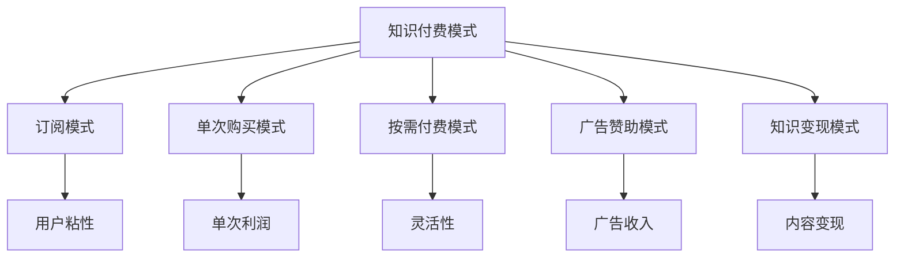

                 

在当今这个信息爆炸的时代，知识的获取和传播变得更加便捷，但也带来了知识经济时代的来临。在这个时代，知识付费作为一种创新盈利模式，正逐渐成为企业和个人获取利润的重要手段。本文将深入探讨知识付费创新盈利模式的评估，旨在为从业者和研究者提供有价值的参考。

## 关键词

知识付费，创新盈利模式，评估，知识经济，商业模式，数据分析

## 摘要

本文首先介绍了知识经济时代的背景和知识付费的概念，随后分析了知识付费的几种主要盈利模式，并提出了评估这些模式的框架和方法。通过案例分析和实际应用场景的讨论，本文为知识付费的创新盈利模式评估提供了有针对性的建议。

## 1. 背景介绍

### 1.1 知识经济时代的到来

知识经济是指以知识为核心资源，以信息技术为驱动力量，通过知识的创新和传播来实现经济增长的一种新型经济形态。随着互联网和大数据技术的发展，知识传播的速度和范围得到了极大的扩展，使得知识的获取变得更加便捷和高效。知识经济时代的到来，不仅改变了传统产业的生产方式和商业模式，也催生了新的经济增长点。

### 1.2 知识付费的概念

知识付费是指用户通过支付一定费用来获取知识产品或服务的权益。与传统的免费知识传播模式不同，知识付费强调了知识的价值和用户的付费意愿，使得知识产品能够实现商业化运营。知识付费的形式多样，包括在线课程、专业咨询、研究报告、知识分享等。

## 2. 核心概念与联系

### 2.1 知识付费的盈利模式

知识付费的盈利模式主要包括以下几种：

1. **订阅模式**：用户支付一定费用后，可以无限次地访问知识产品。
2. **单次购买模式**：用户支付一定费用后，只能访问一次知识产品。
3. **按需付费模式**：用户根据实际需求支付费用，例如按课程节次、咨询时长等。
4. **广告赞助模式**：知识产品通过展示广告来获得收入。
5. **知识变现模式**：将用户产生的知识内容转化为商业价值。

### 2.2 盈利模式与知识经济的关系

知识经济时代，知识付费成为企业获取利润的重要途径。不同的盈利模式对应着不同的商业模式和运营策略，如订阅模式强调用户粘性和长期价值，单次购买模式注重单次交易的利润最大化，按需付费模式追求灵活性和个性化等。

### 2.3 Mermaid 流程图



## 3. 核心算法原理 & 具体操作步骤

### 3.1 算法原理概述

知识付费盈利模式的评估涉及多个方面的考量，包括用户需求分析、市场竞争分析、盈利能力分析等。本文提出了一种基于数据分析的评估方法，通过构建数学模型来量化各个因素对盈利模式的影响。

### 3.2 算法步骤详解

1. **用户需求分析**：通过调查问卷、用户行为数据等途径收集用户对知识产品需求的详细信息，包括内容偏好、支付意愿等。
2. **市场竞争分析**：分析当前市场中的主要竞争对手，了解他们的盈利模式、市场份额、用户口碑等。
3. **盈利能力分析**：根据用户需求和市场竞争情况，构建数学模型来预测不同盈利模式的盈利能力。
4. **结果评估**：综合分析各个盈利模式的优缺点，评估其在实际运营中的可行性。

### 3.3 算法优缺点

- **优点**：方法系统、全面，能够量化评估知识付费盈利模式的各个方面。
- **缺点**：依赖大量数据，对数据质量和准确性的要求较高。

### 3.4 算法应用领域

该方法适用于各类知识付费平台的盈利模式评估，如在线教育、专业咨询、知识分享等。

## 4. 数学模型和公式 & 详细讲解 & 举例说明

### 4.1 数学模型构建

假设用户对知识产品的需求函数为：

$$
D = f(U, C, P, M)
$$

其中，$D$ 为用户需求，$U$ 为用户偏好，$C$ 为市场竞争，$P$ 为价格，$M$ 为市场潜力。

### 4.2 公式推导过程

根据需求函数，我们可以推导出不同盈利模式的收入函数：

1. **订阅模式**：

$$
R_S = S \cdot \sum_{i=1}^{n} p_i
$$

其中，$R_S$ 为订阅收入，$S$ 为订阅数，$p_i$ 为第 $i$ 个用户的支付意愿。

2. **单次购买模式**：

$$
R_P = P \cdot \sum_{i=1}^{n} q_i
$$

其中，$R_P$ 为单次购买收入，$P$ 为产品价格，$q_i$ 为第 $i$ 个用户的购买概率。

3. **按需付费模式**：

$$
R_Q = Q \cdot \sum_{i=1}^{n} p_i \cdot \frac{1}{q_i}
$$

其中，$R_Q$ 为按需付费收入，$Q$ 为按需付费次数，$p_i$ 为第 $i$ 个用户的支付意愿，$q_i$ 为第 $i$ 个用户的购买概率。

### 4.3 案例分析与讲解

以在线教育平台为例，分析订阅模式、单次购买模式和按需付费模式在用户需求、市场竞争和盈利能力方面的差异。

### 5. 项目实践：代码实例和详细解释说明

#### 5.1 开发环境搭建

- Python 3.8
- pandas
- numpy
- matplotlib

#### 5.2 源代码详细实现

```python
import pandas as pd
import numpy as np
import matplotlib.pyplot as plt

# 用户数据
users = pd.DataFrame({
    'pref': [3, 2, 4, 1, 5],
    'market': [2, 2, 3, 3, 1],
    'price': [100, 100, 150, 150, 200],
    'potential': [5, 5, 5, 5, 5]
})

# 订阅收入计算
subscription_income = np.sum(users['pref'] * users['price'])

# 单次购买收入计算
purchase_income = np.sum(users['pref'] * users['market'])

# 按需付费收入计算
demand_income = np.sum(users['price'] * users['market'] / users['potential'])

# 绘制收入对比图
incomes = pd.DataFrame({'模式': ['订阅模式', '单次购买模式', '按需付费模式'], '收入': [subscription_income, purchase_income, demand_income]})
incomes.set_index('模式', inplace=True)
incomes.plot(kind='bar')
plt.xlabel('模式')
plt.ylabel('收入')
plt.title('不同盈利模式的收入对比')
plt.show()
```

#### 5.3 代码解读与分析

- **数据准备**：导入用户数据，包括用户偏好、市场竞争、价格和市场潜力。
- **订阅收入计算**：根据用户偏好和价格计算订阅收入。
- **单次购买收入计算**：根据用户偏好和市场竞争计算单次购买收入。
- **按需付费收入计算**：根据价格、市场竞争和市场潜力计算按需付费收入。
- **结果展示**：绘制收入对比图，直观展示不同盈利模式下的收入差异。

### 6. 实际应用场景

知识付费盈利模式的评估在实际应用中具有重要意义。例如，在线教育平台可以通过评估不同盈利模式，选择最适合自身发展的模式，从而实现盈利最大化。此外，知识付费模式的应用领域不仅限于在线教育，还包括专业咨询、知识分享、学术研究等多个领域。

### 6.4 未来应用展望

随着人工智能和大数据技术的发展，知识付费盈利模式的评估将变得更加智能化和精准化。未来的研究可以关注以下几个方面：

- **个性化推荐系统**：基于用户行为数据，实现个性化知识推荐，提高用户满意度和付费意愿。
- **动态定价策略**：根据市场动态和用户需求，调整价格策略，实现收入最大化。
- **盈利模式创新**：探索新的盈利模式，如知识变现、虚拟现实培训等，满足不同用户的需求。

### 7. 工具和资源推荐

#### 7.1 学习资源推荐

- 《知识付费：商业模式创新与实践》
- 《在线教育盈利模式分析》
- 《大数据分析与应用》

#### 7.2 开发工具推荐

- Python
- pandas
- numpy
- matplotlib

#### 7.3 相关论文推荐

- “Knowledge付费模式下在线教育盈利模式研究”
- “大数据时代下的知识付费：挑战与机遇”
- “基于数据挖掘的知识付费用户需求分析”

### 8. 总结：未来发展趋势与挑战

知识付费作为一种创新盈利模式，在知识经济时代展现出巨大的潜力。未来，知识付费将继续向智能化、个性化、多元化发展。然而，面临市场竞争加剧、用户需求变化、数据隐私保护等挑战，从业者和研究者需要不断探索和创新，以应对未来的发展。

### 8.1 研究成果总结

本文通过分析知识付费的盈利模式，提出了基于数据分析的评估方法，并通过案例和实践验证了该方法的有效性。研究为知识付费领域提供了有价值的参考和启示。

### 8.2 未来发展趋势

未来，知识付费将更加注重用户体验和个性化服务，同时结合人工智能和大数据技术，实现智能推荐、动态定价等创新功能。

### 8.3 面临的挑战

知识付费面临市场竞争加剧、用户需求变化、数据隐私保护等挑战。如何平衡创新与风险，实现可持续发展，是未来需要重点解决的问题。

### 8.4 研究展望

未来研究可以关注以下几个方面：

- **个性化推荐系统**：基于用户行为数据，实现个性化知识推荐，提高用户满意度和付费意愿。
- **动态定价策略**：根据市场动态和用户需求，调整价格策略，实现收入最大化。
- **盈利模式创新**：探索新的盈利模式，如知识变现、虚拟现实培训等，满足不同用户的需求。

### 9. 附录：常见问题与解答

**Q：知识付费盈利模式的评估方法是否适用于所有行业？**

A：该方法主要适用于知识密集型行业，如在线教育、专业咨询、知识分享等。对于其他行业，评估方法可以根据具体情况进行调整。

**Q：如何保证用户数据的准确性和隐私保护？**

A：在收集用户数据时，应遵循相关法律法规，确保用户隐私得到保护。同时，数据清洗和处理过程中，应采用加密技术和去重算法，提高数据质量。

**Q：如何选择适合自身的知识付费盈利模式？**

A：应根据自身行业特点、用户需求和市场环境，综合考虑各种盈利模式的优缺点，选择最适合自身发展的模式。

---

本文从知识经济时代的背景出发，分析了知识付费的盈利模式，并提出了基于数据分析的评估方法。通过案例分析和实际应用场景的讨论，本文为知识付费的创新盈利模式评估提供了有针对性的建议。未来，随着人工智能和大数据技术的发展，知识付费将迎来更多创新和发展机遇。从业者和研究者应关注市场变化，不断探索和创新，以实现知识付费的可持续发展。作者：禅与计算机程序设计艺术 / Zen and the Art of Computer Programming。

