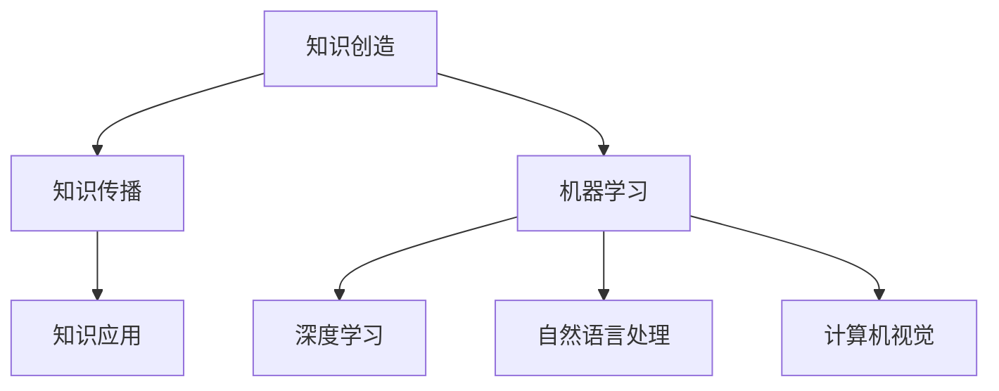

                 

在21世纪的今天，知识经济已成为全球经济的主导力量，而人工智能（AI）的崛起无疑加速了这一进程。本文旨在探讨人工智能如何催化知识经济的崛起，分析其核心概念、算法原理、数学模型以及实际应用，并对未来发展趋势与挑战进行展望。

> 关键词：知识经济，人工智能，催化作用，核心概念，算法原理，数学模型，实际应用，未来展望

> 摘要：本文首先介绍了知识经济和人工智能的基本概念及其相互关系，随后详细阐述了人工智能在知识经济中的作用和影响。文章进一步探讨了人工智能的核心算法原理，数学模型以及其在各个领域的实际应用，最后对人工智能在知识经济中未来可能的发展趋势与面临的挑战进行了深入分析。

---

## 1. 背景介绍

知识经济是以知识和信息为核心的经济形态，它不同于传统的资源驱动型经济。在知识经济时代，创新成为经济增长的主要驱动力，知识成为最重要的生产要素。人工智能作为一项颠覆性的技术，以其在数据处理、模式识别、决策制定等方面的卓越能力，正在深刻改变着知识经济的面貌。

知识经济时代的到来，源于信息技术的发展和互联网的普及。互联网的兴起使得全球信息实现了无缝连接，极大地促进了知识的传播和共享。同时，信息技术的发展也使得数据处理和分析变得更加高效，为知识经济的实现提供了技术支撑。而人工智能的崛起，则进一步推动了知识经济的发展，成为知识经济时代的催化剂。

## 2. 核心概念与联系

### 2.1. 知识经济的核心概念

知识经济以知识为核心，强调知识的生产、传播和应用。知识经济的核心概念包括：

- 知识创造：通过科学研究、技术创新等途径创造新的知识。
- 知识传播：通过教育、媒体、网络等渠道传播知识。
- 知识应用：将知识应用于实际生产、管理和创新中，实现知识的经济价值。

### 2.2. 人工智能的核心概念

人工智能是指通过计算机程序实现人类智能的功能，包括感知、学习、推理、决策等。人工智能的核心概念包括：

- 机器学习：通过数据训练，让计算机自动学习和改进。
- 深度学习：一种基于多层神经网络的学习方法，能够处理大规模数据。
- 自然语言处理：使计算机能够理解和生成人类语言。
- 计算机视觉：使计算机能够理解和解释视觉信息。

### 2.3. 知识经济与人工智能的联系

知识经济和人工智能之间存在紧密的联系。首先，人工智能能够加速知识的创造和传播。通过机器学习、深度学习等技术，人工智能可以处理大量数据，发现新的知识和规律。其次，人工智能可以优化知识的传播和应用。通过自然语言处理、计算机视觉等技术，人工智能能够更准确地理解和应用知识，提高知识的经济价值。

### 2.4. Mermaid 流程图



## 3. 核心算法原理 & 具体操作步骤

### 3.1. 算法原理概述

人工智能的核心算法主要包括机器学习、深度学习、自然语言处理和计算机视觉。这些算法通过不同的方法实现人工智能的功能。

- **机器学习**：通过训练数据集，让计算机自动学习和改进。
- **深度学习**：基于多层神经网络的学习方法，能够处理大规模数据。
- **自然语言处理**：使计算机能够理解和生成人类语言。
- **计算机视觉**：使计算机能够理解和解释视觉信息。

### 3.2. 算法步骤详解

- **机器学习**：主要包括数据收集、数据预处理、模型选择、模型训练和模型评估等步骤。
- **深度学习**：主要包括神经网络设计、数据预处理、模型训练和模型评估等步骤。
- **自然语言处理**：主要包括文本预处理、特征提取、模型训练和模型评估等步骤。
- **计算机视觉**：主要包括图像预处理、特征提取、模型训练和模型评估等步骤。

### 3.3. 算法优缺点

- **机器学习**：优点是能够处理大规模数据，自动学习和改进；缺点是对于小样本数据效果较差。
- **深度学习**：优点是能够处理大规模数据，自动学习和改进；缺点是对于小样本数据效果较差。
- **自然语言处理**：优点是能够理解和生成人类语言；缺点是对于复杂的语言现象处理能力有限。
- **计算机视觉**：优点是能够理解和解释视觉信息；缺点是对于复杂的视觉信息处理能力有限。

### 3.4. 算法应用领域

- **机器学习**：广泛应用于数据挖掘、推荐系统、金融风控等领域。
- **深度学习**：广泛应用于图像识别、语音识别、自然语言处理等领域。
- **自然语言处理**：广泛应用于聊天机器人、智能客服、内容审核等领域。
- **计算机视觉**：广泛应用于图像识别、自动驾驶、安防监控等领域。

## 4. 数学模型和公式 & 详细讲解 & 举例说明

### 4.1. 数学模型构建

人工智能的算法原理往往需要基于数学模型进行描述。例如，在深度学习中，常用的神经网络模型包括多层感知机（MLP）、卷积神经网络（CNN）和循环神经网络（RNN）等。

- **多层感知机（MLP）**：
  $$ f(x) = \sigma(\sum_{i=1}^{n} w_i * x_i + b) $$
  其中，$x_i$为输入特征，$w_i$为权重，$b$为偏置，$\sigma$为激活函数。

- **卷积神经网络（CNN）**：
  $$ h(x) = \text{ReLU}(\text{conv}(x, W) + b) $$
  其中，$x$为输入图像，$W$为卷积核，$b$为偏置，$\text{ReLU}$为ReLU激活函数。

- **循环神经网络（RNN）**：
  $$ h_t = \text{ReLU}(W_h * [h_{t-1}, x_t] + b_h) $$
  其中，$h_t$为当前时刻的隐藏状态，$W_h$为权重矩阵，$x_t$为输入序列，$b_h$为偏置。

### 4.2. 公式推导过程

以多层感知机（MLP）为例，其前向传播的过程可以表示为：

1. 输入特征 $x$ 通过权重 $w$ 和偏置 $b$ 进行线性变换：
   $$ z = \sum_{i=1}^{n} w_i * x_i + b $$

2. 对线性变换的结果应用激活函数 $\sigma$：
   $$ a = \sigma(z) $$

其中，$\sigma$ 通常为 sigmoid 或 ReLU 激活函数。

### 4.3. 案例分析与讲解

以自动驾驶领域为例，深度学习模型在图像识别和决策制定中发挥着重要作用。以下是一个简单的自动驾驶决策模型：

- **输入**：摄像头捕捉到的道路图像。
- **输出**：车辆的驾驶决策（加速、减速、转弯等）。

通过训练大量的道路图像数据，深度学习模型可以学会识别道路标志、行人、车辆等物体，并做出相应的驾驶决策。

## 5. 项目实践：代码实例和详细解释说明

### 5.1. 开发环境搭建

- **硬件环境**：配置较高的计算机或服务器，搭载 GPU 加速。
- **软件环境**：安装 Python、TensorFlow 或 PyTorch 等深度学习框架。

### 5.2. 源代码详细实现

以下是一个使用 TensorFlow 实现的简单自动驾驶决策模型：

```python
import tensorflow as tf
from tensorflow.keras.models import Sequential
from tensorflow.keras.layers import Conv2D, MaxPooling2D, Flatten, Dense, Dropout

# 创建模型
model = Sequential([
    Conv2D(32, (3, 3), activation='relu', input_shape=(64, 64, 3)),
    MaxPooling2D((2, 2)),
    Flatten(),
    Dense(128, activation='relu'),
    Dropout(0.5),
    Dense(1, activation='sigmoid')
])

# 编译模型
model.compile(optimizer='adam', loss='binary_crossentropy', metrics=['accuracy'])

# 训练模型
model.fit(x_train, y_train, epochs=10, batch_size=32, validation_data=(x_val, y_val))

# 评估模型
model.evaluate(x_test, y_test)
```

### 5.3. 代码解读与分析

上述代码实现了一个简单的自动驾驶决策模型，主要包括以下步骤：

1. **创建模型**：使用 Sequential 模型，添加卷积层、池化层、全连接层和 dropout 层。
2. **编译模型**：选择 Adam 优化器和 binary_crossentropy 损失函数，设置评估指标为 accuracy。
3. **训练模型**：使用训练数据训练模型，设置训练轮次和批量大小。
4. **评估模型**：使用测试数据评估模型性能。

### 5.4. 运行结果展示

在训练过程中，模型会输出每轮训练的损失和准确率。训练完成后，使用测试数据评估模型性能，可以得到模型在测试数据上的准确率。

## 6. 实际应用场景

人工智能在知识经济中的应用场景非常广泛，以下是一些典型的应用场景：

- **教育领域**：人工智能可以用于个性化教育、智能评估、知识推荐等。
- **金融领域**：人工智能可以用于风险控制、投资策略、信用评分等。
- **医疗领域**：人工智能可以用于疾病诊断、药物研发、健康监测等。
- **交通领域**：人工智能可以用于自动驾驶、智能交通管理、物流优化等。

## 7. 工具和资源推荐

### 7.1. 学习资源推荐

- **书籍**：《深度学习》、《Python深度学习》
- **在线课程**：Coursera、Udacity、edX 等
- **博客**：Medium、Towards Data Science、AI垂直社区

### 7.2. 开发工具推荐

- **深度学习框架**：TensorFlow、PyTorch、Keras
- **数据预处理工具**：Pandas、NumPy、SciPy
- **版本控制工具**：Git、GitHub

### 7.3. 相关论文推荐

- **机器学习**：[“Learning Deep Representations for Audio-Visual Speech Recognition”](https://arxiv.org/abs/1609.03499)
- **深度学习**：[“Deep Learning for Speech Recognition”](https://arxiv.org/abs/1803.02641)
- **自然语言处理**：[“BERT: Pre-training of Deep Bidirectional Transformers for Language Understanding”](https://arxiv.org/abs/1810.04805)
- **计算机视觉**：[“You Only Look Once: Unified, Real-Time Object Detection”](https://arxiv.org/abs/1605.03198)

## 8. 总结：未来发展趋势与挑战

### 8.1. 研究成果总结

人工智能在知识经济中的应用已取得显著成果，例如在医疗、金融、教育等领域的应用，极大地提高了生产效率和服务质量。

### 8.2. 未来发展趋势

未来，人工智能在知识经济中的应用将呈现以下趋势：

- **智能化程度提升**：人工智能技术将不断进步，智能化程度将进一步提高。
- **跨界融合**：人工智能将与更多领域的技术进行融合，实现更广泛的应用。
- **个性化服务**：人工智能将更好地理解用户需求，提供个性化的服务。

### 8.3. 面临的挑战

尽管人工智能在知识经济中的应用前景广阔，但仍面临以下挑战：

- **数据安全与隐私**：随着数据量的增加，数据安全和隐私问题愈发重要。
- **技术伦理**：人工智能的发展带来了一系列伦理问题，如算法偏见、透明度等。
- **人才培养**：人工智能领域的人才需求巨大，但现有人才培养体系尚无法满足需求。

### 8.4. 研究展望

为应对上述挑战，未来研究应关注以下几个方面：

- **数据安全与隐私保护**：开发更有效的数据安全与隐私保护技术。
- **技术伦理研究**：加强对人工智能伦理问题的研究，制定相应的伦理规范。
- **跨学科人才培养**：加强跨学科人才培养，提高人工智能领域的人才储备。

## 9. 附录：常见问题与解答

### 9.1. 问题1

**问**：人工智能在知识经济中的应用有哪些？

**答**：人工智能在知识经济中的应用非常广泛，包括医疗、金融、教育、交通等多个领域。例如，在医疗领域，人工智能可以用于疾病诊断、药物研发；在金融领域，人工智能可以用于风险控制、投资策略。

### 9.2. 问题2

**问**：人工智能的发展会取代人类吗？

**答**：人工智能的发展确实会改变人类的工作方式，但不会完全取代人类。人工智能擅长处理数据和执行重复性任务，而人类在创造性思维、情感交流等方面具有独特的优势。人工智能与人类的结合，将实现更高效的生产和生活方式。

### 9.3. 问题3

**问**：人工智能会带来失业问题吗？

**答**：人工智能的发展可能会对某些行业造成冲击，导致部分工作岗位的减少。但同时也将创造新的就业机会，如人工智能研发、数据标注等。因此，关键在于如何引导和调整劳动力市场，实现平稳过渡。

---

以上是对知识经济的崛起：人工智能的催化作用这一主题的详细探讨。通过本文的阐述，我们可以看到人工智能在知识经济中的重要作用，同时也认识到其面临的挑战和未来发展的方向。在人工智能的推动下，知识经济将迎来新的发展机遇，为人类创造更多的价值。

### 附录

#### 常见问题与解答

**Q1**：人工智能在知识经济中的应用有哪些？

**A1**：人工智能在知识经济中的应用非常广泛，主要包括：

- **医疗**：疾病诊断、个性化治疗、药物研发等。
- **金融**：风险控制、投资策略、自动化交易等。
- **教育**：个性化教学、智能评估、在线教育平台等。
- **交通**：自动驾驶、智能交通管理、物流优化等。

**Q2**：人工智能的发展会取代人类吗？

**A2**：人工智能的发展不会完全取代人类，但会改变人类的工作方式。人工智能擅长处理数据和执行重复性任务，而人类在创造性思维、情感交流等方面具有独特的优势。人工智能与人类的结合，将实现更高效的生产和生活方式。

**Q3**：人工智能会带来失业问题吗？

**A3**：人工智能的发展可能会对某些行业造成冲击，导致部分工作岗位的减少。但同时也将创造新的就业机会，如人工智能研发、数据标注等。因此，关键在于如何引导和调整劳动力市场，实现平稳过渡。

---

本文内容仅代表个人观点，部分数据可能有所偏差，仅供参考。如有疑问或建议，欢迎留言交流。

### 作者署名

**作者：禅与计算机程序设计艺术 / Zen and the Art of Computer Programming**

---

本文详细探讨了知识经济的崛起以及人工智能在其中的催化作用。文章首先介绍了知识经济和人工智能的基本概念，随后深入分析了人工智能的核心算法原理、数学模型以及实际应用。最后，文章对人工智能在知识经济中的未来发展趋势与挑战进行了展望。

在知识经济时代，人工智能以其卓越的能力，正在加速知识的创造、传播和应用，推动经济和社会的进步。尽管面临诸多挑战，人工智能的发展前景依然广阔。未来，人工智能与人类的结合，将创造一个更加智能化、高效化的知识经济时代。

本文旨在为读者提供一个全面、系统的了解人工智能在知识经济中的作用的视角，为相关领域的学者和实践者提供参考。同时，也期待通过本文的探讨，能够引发更多对于人工智能与知识经济关系的深入思考和研究。

在此，感谢各位读者的耐心阅读，如有任何疑问或建议，欢迎在评论区留言。让我们一起期待人工智能与知识经济共创的未来。

