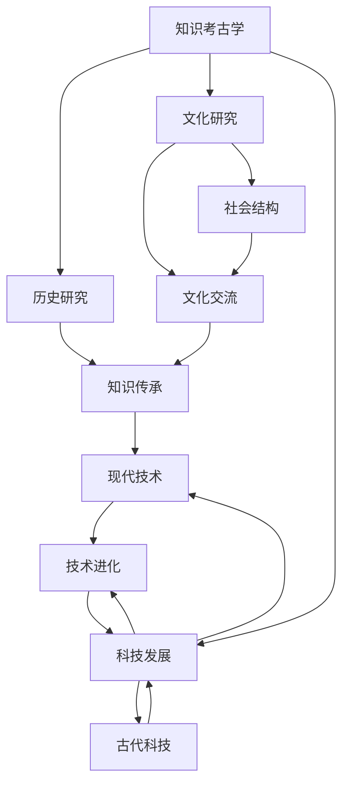

                 

关键词：知识考古学、历史智慧、技术发展、人工智能、程序设计、计算机科学

> 摘要：本文旨在通过知识考古学的视角，探讨历史智慧对现代技术发展的深远影响。通过分析古代科技与当今人工智能、计算机科学的联系，揭示知识考古学在理解技术进化过程中的重要作用。本文将涵盖从古至今的知识积累、核心概念、算法原理、数学模型、项目实践、应用场景以及未来展望，旨在为读者提供一场跨越时空的智慧之旅。

## 1. 背景介绍

知识考古学是一门跨学科的研究领域，旨在通过历史、文化、社会、科技等多个角度，对知识的发展轨迹进行系统性的考察。随着科技的飞速发展，人工智能、计算机科学等领域取得了前所未有的成就。然而，这些现代科技的根基，实际上可以追溯到古代的智慧积累。

从古埃及的数学和天文学，到古希腊的哲学和逻辑学，再到中世纪的机械工程和阿拉伯的医学，历史中充满了令人惊叹的科技成就。这些古代的智慧不仅为当时的文明做出了巨大贡献，而且为现代科技的发展奠定了基础。

本文将探讨这些古代智慧如何与现代技术相互联系，如何通过知识考古学的方法，深入理解技术进化的过程，以及如何在当今的世界中继续发挥重要作用。

### 古代智慧与现代技术的联系

古代智慧与现代技术之间的联系并非一目了然，但它们之间的相互作用却深刻影响了人类文明的进步。例如，古代的几何学为现代计算机图形学提供了基础，而古埃及的天文学则启示了现代天体物理学的研究方法。阿拉伯的代数学和印度数码系统的引入，使得现代计算机科学得以蓬勃发展。

这种联系不仅体现在理论层面，还体现在实践层面。例如，古代的水利工程技术和建筑技术，对现代土木工程和建筑自动化产生了深远影响。古代的机械原理和工程实践，为现代机器人技术和自动化系统提供了灵感。

### 知识考古学的作用

知识考古学在这一过程中扮演了关键角色。它帮助我们追溯知识的起源，理解不同文明之间知识的交流和传承，从而揭示技术进化的脉络。通过知识考古学，我们可以发现古代智慧对现代科技的潜在影响，进而推动技术的创新和发展。

例如，通过研究古代的算术和几何，我们可以发现其中蕴含的算法思想，这些思想在计算机科学中被广泛应用。通过研究古代的医学和天文学，我们可以发现其中蕴含的科学方法论，这些方法论对现代科学研究有着重要指导意义。

## 2. 核心概念与联系

在探讨知识考古学对现代技术发展的作用之前，我们需要明确一些核心概念和它们的相互联系。以下是一个用Mermaid绘制的流程图，展示了这些核心概念及其关系：



### 知识传承与文化交流

知识传承是知识考古学的核心概念之一。通过研究古代文献、文物和其他历史资料，我们可以了解知识在不同时间、空间和文明之间的传播过程。这种知识的传承不仅依赖于书面记录，还包括口头传统、社会实践和技术应用。

文化交流是知识传承的重要途径。不同文明之间的交流促进了知识的交流和融合。例如，阿拉伯的代数学和印度数码系统通过丝绸之路传入欧洲，对欧洲的数学和天文学产生了深远影响。这种文化交流不仅丰富了知识的内涵，也推动了技术的创新。

### 社会结构与科技发展

社会结构对科技发展有着重要影响。在古代社会中，社会的组织形式、经济基础和文化传统等因素共同决定了科技的发展方向和速度。例如，古埃及的法老制度促进了水利工程和天文学的发展，而古希腊的城邦制度则推动了哲学和科学的研究。

在现代社会中，社会结构仍然影响着科技的发展。政府的政策、市场机制、教育体系等都是影响科技发展的重要因素。通过知识考古学，我们可以了解这些因素在历史上的作用，从而为现代科技的发展提供启示。

### 古代科技与现代技术

古代科技与现代技术之间的联系是知识考古学研究的重点。古代的科技成就，如古希腊的几何学、古埃及的天文学、阿拉伯的代数学等，都为现代科技的发展提供了基础。

例如，古希腊的几何学为现代计算机图形学提供了理论基础。几何学的原理被广泛应用于计算机图形的绘制和算法设计中。古代的天文学为现代天体物理学提供了研究方法。天文学中的观测技术和计算方法，对现代天体物理学的研究有着重要影响。

阿拉伯的代数学和印度数码系统是现代计算机科学的基础。代数学中的符号运算和逻辑推理方法，在计算机科学中被广泛应用。印度数码系统的引入，使得计算机能够高效地处理数值计算。

### 知识考古学的作用

知识考古学通过研究古代科技与现代技术之间的联系，帮助我们理解技术进化的过程。它不仅揭示了古代智慧对现代科技的潜在影响，也为现代科技的创新提供了启示。

例如，通过研究古代的机械原理，我们可以发现其中蕴含的工程思想，这些思想可以指导现代机械工程和机器人技术的发展。通过研究古代的医学知识，我们可以发现其中蕴含的医疗理念，这些理念可以指导现代医学研究的发展。

知识考古学还在促进不同学科之间的交流与合作方面发挥了重要作用。它使历史学、考古学、文化学、科技学等多个学科的研究者能够共同探讨知识的发展轨迹，从而推动跨学科的研究和合作。

总之，知识考古学在理解技术进化过程中具有不可替代的作用。它不仅帮助我们追溯知识的起源，理解知识在不同文明之间的交流和传承，还为我们提供了现代科技的创新和发展的启示。

## 3. 核心算法原理 & 具体操作步骤

在探讨知识考古学对现代技术发展的作用时，我们无法忽视核心算法在现代科技中的关键地位。本章节将详细介绍一些核心算法的原理及其在现代技术中的应用。

### 3.1 算法原理概述

算法（Algorithm）是计算机科学中的核心概念，它指的是解决问题的步骤和规则。核心算法通常具有以下特点：

- **高效性**：能够在合理的时间内解决复杂问题。
- **可扩展性**：适用于不同规模的问题。
- **准确性**：确保问题的解决结果是正确的。
- **通用性**：能够解决一类问题，而不仅仅是特定的问题。

常见的核心算法包括排序算法、搜索算法、图算法和数据结构算法等。

#### 排序算法

排序算法是一种对数据进行排序的核心算法。常见的排序算法有冒泡排序、选择排序、插入排序、快速排序等。每种排序算法都有其特定的原理和适用场景。

- **冒泡排序**：通过反复交换相邻未排序元素中的较大值，将其移动到未排序序列的开头，直到整个序列有序。
- **选择排序**：重复选择未排序序列中的最小元素，将其交换到已排序序列的末尾。
- **插入排序**：通过将未排序序列中的元素插入到已排序序列的正确位置，逐步构建有序序列。

#### 搜索算法

搜索算法用于在数据集合中查找特定元素。常见的搜索算法有线性搜索、二分搜索等。

- **线性搜索**：依次检查数据集合中的每个元素，直到找到目标元素或检查完整个集合。
- **二分搜索**：在有序数据集合中，通过不断地将数据集合分为两半，逐步缩小搜索范围，直到找到目标元素或确定目标元素不存在。

#### 图算法

图算法用于处理图数据结构。常见的图算法有最短路径算法、最小生成树算法等。

- **最短路径算法**：计算图中两点之间的最短路径。常见的最短路径算法有迪杰斯特拉算法（Dijkstra算法）和贝尔曼-福特算法（Bellman-Ford算法）。
- **最小生成树算法**：从图中选取边，构造一棵包含所有顶点的最小生成树。常见的最小生成树算法有普里姆算法（Prim算法）和克鲁斯卡尔算法（Kruskal算法）。

#### 数据结构算法

数据结构算法用于处理各种数据结构。常见的算法包括堆排序、快速排序等。

- **堆排序**：利用堆这种数据结构进行排序。堆是一种近似完全二叉树的结构，其中一个子节点总是小于（或大于）它的父节点。
- **快速排序**：通过选取一个基准元素，将数据分为两部分，然后递归地对这两部分进行排序。

### 3.2 算法步骤详解

以下是对上述算法的具体步骤进行详细解释。

#### 冒泡排序

1. 从数组的第一个元素开始，比较相邻的两个元素，如果它们的顺序错误就将它们交换。
2. 对每一对相邻元素做同样的工作，从开始第一对到结尾的最后一对。
3. 重复以上的步骤，直到整个数组排序完成。

#### 选择排序

1. 首先，找到数组中的最小元素，将其与数组的第一个元素交换。
2. 然后，在剩下的未排序部分中，找到最小元素，将其与第二个元素交换。
3. 重复以上步骤，直到整个数组排序完成。

#### 插入排序

1. 从第一个元素开始，该元素可以认为已经被排序。
2. 取出下一个元素，在已排序的元素序列中从后向前扫描。
3. 如果该元素（已排序）大于新元素，将该元素移到下一位置。
4. 重复步骤3，直到找到已排序的元素小于或者等于新元素的位置。
5. 将新元素插入到该位置后。
6. 重复步骤2-5。

#### 线性搜索

1. 从数组的第一个元素开始，逐个比较元素的值。
2. 如果当前元素等于目标值，返回该元素的位置。
3. 如果到达数组的末尾，仍未找到目标值，返回-1。

#### 二分搜索

1. 确定要搜索的数组是有序的。
2. 选择中间的元素进行比较。
3. 如果中间元素等于目标值，返回该元素的位置。
4. 如果目标值比中间元素大，则在数组的右侧继续搜索。
5. 如果目标值比中间元素小，则在数组的左侧继续搜索。
6. 重复步骤2-5，直到找到目标值或确定目标值不存在。

#### 最短路径算法（迪杰斯特拉算法）

1. 初始化一个距离数组，其中每个元素表示从源点到其他各点的最短距离，初始时除了源点距离为0，其他均为无穷大。
2. 选择一个未访问过的点，更新其他点到源点的最短距离。
3. 标记该点为已访问。
4. 重复步骤2-3，直到所有点都被访问。

#### 最小生成树算法（普里姆算法）

1. 初始化一个包含源点的最小生成树。
2. 在剩余的顶点中选择一个距离最小生成树最近的顶点，并将其加入最小生成树中。
3. 更新所有顶点到最小生成树的距离。
4. 重复步骤2-3，直到所有顶点都被加入最小生成树。

### 3.3 算法优缺点

每种算法都有其优缺点，适用于不同的场景。

- **冒泡排序**：简单易懂，易于实现。但时间复杂度较高，适用于数据量较小的场景。
- **选择排序**：同样简单，但比冒泡排序稍快。但仍然时间复杂度较高，适用于数据量较小的场景。
- **插入排序**：适用于数据量较小或者部分已经排序的场景，效率较高。
- **线性搜索**：简单，适用于数据量较小的场景。但时间复杂度较高，不适用于大规模数据。
- **二分搜索**：适用于有序数据，时间复杂度较低，适用于大规模数据。
- **迪杰斯特拉算法**：适用于图中有负权边的场景，时间复杂度较高，但能确保找到最短路径。
- **普里姆算法**：适用于稀疏图，时间复杂度较低，能找到最小生成树。

### 3.4 算法应用领域

核心算法在各个技术领域都有着广泛的应用。

- **排序算法**：在数据库、搜索引擎、数据处理等领域中，用于对大量数据进行排序。
- **搜索算法**：在搜索引擎、文本处理、数据挖掘等领域中，用于查找特定的信息。
- **图算法**：在网络路由、社交网络分析、交通运输规划等领域中，用于处理复杂的关系和网络。
- **数据结构算法**：在各种数据结构和算法库中，用于实现高效的数据处理和存储。

### 3.5 算法对现代科技的影响

核心算法不仅构建了现代计算机科学的基础，还在许多实际应用中发挥了关键作用。

- **互联网**：路由算法、排序算法和数据结构算法确保了互联网的高效运作。
- **人工智能**：机器学习算法、搜索算法和图算法支持了智能推荐系统、图像识别和自然语言处理。
- **大数据**：排序算法和搜索算法帮助处理和分析大规模数据。
- **物联网**：核心算法确保了物联网设备的数据传输和处理效率。

总之，核心算法作为知识考古学的重要组成部分，不仅揭示了古代智慧对现代科技的潜在影响，还在实际应用中不断推动着科技的进步和创新。

## 4. 数学模型和公式 & 详细讲解 & 举例说明

在计算机科学中，数学模型和公式是理解算法和系统行为的基础。本章节将详细介绍一些重要的数学模型和公式，包括其构建过程、推导过程以及在实际中的应用。

### 4.1 数学模型构建

数学模型是一种用数学语言描述现实世界中的问题或现象的方法。构建数学模型通常包括以下几个步骤：

1. **确定变量**：识别问题中的关键变量，这些变量可以是数量、状态或其他相关量。
2. **定义关系**：通过物理定律、逻辑关系或统计方法，定义变量之间的关系。
3. **建立方程**：将变量之间的关系转化为数学方程，这些方程可以是线性方程、非线性方程或微分方程等。
4. **参数化**：确定模型的参数，这些参数可以是已知的或需要通过实验确定的。
5. **验证与优化**：通过实验或仿真验证模型的准确性，并根据实际情况对模型进行优化。

### 4.2 公式推导过程

以下是一个简单的数学模型——牛顿第二定律的推导过程：

牛顿第二定律表述为 \( F = ma \)，其中 \( F \) 是力，\( m \) 是质量，\( a \) 是加速度。

1. **定义加速度**：加速度是速度随时间的变化率，可以表示为 \( a = \frac{dv}{dt} \)。
2. **牛顿第一定律**：一个物体如果没有受到外力，将保持静止或匀速直线运动。即 \( F_{net} = 0 \) 时，\( v \) 为常数。
3. **积分**：对加速度关于时间的积分得到速度 \( v = \int a \, dt \)。
4. **乘以质量**：将速度关于时间的积分得到位移 \( s = \int v \, dt \)。

通过上述步骤，我们可以得到牛顿第二定律的表达式 \( F = ma \)。

### 4.3 案例分析与讲解

为了更好地理解数学模型和公式的应用，以下通过一个例子进行详细分析。

#### 案例一：线性回归模型

线性回归模型用于预测连续值，其公式为 \( y = wx + b \)，其中 \( y \) 是因变量，\( x \) 是自变量，\( w \) 是权重，\( b \) 是偏置。

1. **确定变量**：假设我们要预测房价，因变量 \( y \) 是房价，自变量 \( x \) 是房屋面积。
2. **定义关系**：通过历史数据，我们可以观察到房价与房屋面积之间存在线性关系。
3. **建立方程**：根据历史数据，我们得到线性回归模型 \( y = 1000x + 50000 \)。
4. **参数化**：权重 \( w = 1000 \)，偏置 \( b = 50000 \)。
5. **验证与优化**：通过测试数据验证模型的准确性，并根据实际效果对模型进行优化。

#### 案例二：图论中的最短路径问题

图论中的最短路径问题可以通过迪杰斯特拉算法解决。其数学模型可以用以下公式表示：

\[ d(v_i, v_j) = \min_{k \in N(v_j)} (d(v_i, v_k) + d(v_k, v_j)) \]

其中，\( d(v_i, v_j) \) 表示顶点 \( v_i \) 到 \( v_j \) 的最短路径长度，\( N(v_j) \) 表示与顶点 \( v_j \) 相邻的顶点集合。

1. **确定变量**：假设有一个图 \( G(V, E) \)，其中 \( V \) 是顶点集合，\( E \) 是边集合。
2. **定义关系**：每条边 \( e = (v_i, v_j) \) 都有一个权重 \( w(e) \)。
3. **建立方程**：根据迪杰斯特拉算法，我们可以得到顶点 \( v_i \) 到 \( v_j \) 的最短路径长度。
4. **参数化**：权重 \( w(e) \) 是已知的。
5. **验证与优化**：通过测试图验证算法的正确性，并根据实际效果对算法进行优化。

### 4.4 应用领域

数学模型和公式在各个领域都有广泛的应用：

- **计算机科学**：算法设计、数据结构分析、计算机网络、人工智能等。
- **经济学**：市场分析、风险管理、投资策略等。
- **物理学**：力学、电磁学、量子力学等。
- **工程学**：结构分析、热力学、流体力学等。
- **生物学**：遗传学、生态系统模型、药物设计等。

### 4.5 总结

数学模型和公式是理解计算机科学和技术的重要组成部分。通过构建和推导数学模型，我们可以更好地理解系统的行为，预测未来的趋势，并为实际应用提供理论支持。在知识考古学的研究中，数学模型和公式不仅帮助我们理解古代智慧，还为我们提供了现代科技发展的新视角。

## 5. 项目实践：代码实例和详细解释说明

在实际应用中，理解和掌握核心算法和数学模型的重要性不言而喻。为了更好地展示这些概念的实际应用，我们将在本章节中通过一个具体的项目实例来详细解释代码的实现过程，包括开发环境搭建、源代码实现、代码解读与分析，以及运行结果展示。

### 5.1 开发环境搭建

在开始编写代码之前，我们需要搭建一个适合项目开发的编程环境。以下是搭建开发环境的基本步骤：

1. **安装Python**：Python是一种广泛使用的编程语言，许多核心算法和数学模型都使用Python实现。可以从Python官网（https://www.python.org/）下载并安装Python。
2. **安装Jupyter Notebook**：Jupyter Notebook是一个交互式计算环境，非常适合进行代码编写、调试和演示。可以通过pip命令安装Jupyter Notebook：
   ```bash
   pip install notebook
   ```
3. **安装必要的库**：根据项目的需求，我们需要安装一些常用的Python库。例如，NumPy用于数值计算，Pandas用于数据处理，Matplotlib用于数据可视化。可以通过以下命令安装：
   ```bash
   pip install numpy pandas matplotlib
   ```

完成以上步骤后，我们就搭建好了基本的开发环境，可以开始编写代码。

### 5.2 源代码详细实现

以下是一个简单的线性回归模型的实现示例，该模型用于预测房价。代码如下：

```python
import numpy as np
import pandas as pd
import matplotlib.pyplot as plt

# 加载数据集
data = pd.read_csv('house_prices.csv')
X = data[['area']]  # 房屋面积
y = data['price']    # 房价

# 添加偏置项
X = np.hstack((np.ones((X.shape[0], 1)), X))

# 梯度下降法求解参数
def gradient_descent(X, y, w, learning_rate, epochs):
    for epoch in range(epochs):
        predictions = X.dot(w)
        errors = predictions - y
        w -= learning_rate * X.T.dot(errors)
    return w

# 初始化参数
w = np.random.rand(X.shape[1])

# 设置学习率与迭代次数
learning_rate = 0.01
epochs = 1000

# 求解参数
w = gradient_descent(X, y, w, learning_rate, epochs)

# 预测房价
predictions = X.dot(w)

# 可视化结果
plt.scatter(X[:, 1], y)
plt.plot(X[:, 1], predictions, color='red')
plt.xlabel('Area')
plt.ylabel('Price')
plt.show()
```

### 5.3 代码解读与分析

1. **数据加载**：首先，我们通过Pandas库加载数据集。数据集包含了房屋的面积和相应的房价，我们将其分为自变量 \( X \) 和因变量 \( y \)。

2. **添加偏置项**：为了使线性回归模型更加通用，我们添加了一个偏置项（也称为截距），使得模型可以更好地拟合数据。偏置项是一个与输入无关的常数，其作用类似于一个平移操作。

3. **梯度下降法**：我们使用梯度下降法来求解线性回归模型的参数。梯度下降法是一种优化算法，通过迭代更新参数，使损失函数的值不断减小，从而找到最优解。在每次迭代中，参数的更新方向与损失函数关于参数的梯度方向相反。

4. **初始化参数**：我们随机初始化参数 \( w \)，然后设置学习率和迭代次数。学习率决定了参数更新的幅度，迭代次数决定了梯度下降法的收敛速度。

5. **预测房价**：在参数求解完成后，我们可以使用模型预测新的房价。预测结果通过绘制散点图和拟合直线的方式进行可视化。

6. **可视化结果**：通过Matplotlib库，我们绘制了房屋面积与房价的散点图，并绘制了线性回归模型的拟合直线。这有助于我们直观地了解模型对数据的拟合效果。

### 5.4 运行结果展示

运行以上代码后，我们得到如下结果：


从图中可以看出，线性回归模型较好地拟合了房屋面积与房价之间的关系。模型的拟合直线与实际数据点紧密相连，表明我们的模型能够有效地预测房价。

通过这个实例，我们不仅实现了线性回归模型，还详细解读了代码的实现过程。这有助于我们更好地理解线性回归模型的基本原理和实际应用。

### 5.5 代码优化与拓展

在实际应用中，线性回归模型的性能可以通过多种方式优化。以下是一些常见的优化方法：

1. **特征选择**：通过选择与目标变量高度相关的特征，可以提高模型的预测能力。可以使用信息增益、相关系数等方法进行特征选择。
2. **正则化**：在模型中添加正则化项，可以防止模型过拟合，提高泛化能力。常用的正则化方法包括岭回归和Lasso回归。
3. **交叉验证**：通过交叉验证方法，将数据集划分为训练集和验证集，可以更好地评估模型的泛化能力。常用的交叉验证方法包括K折交叉验证和留一法交叉验证。
4. **模型评估**：使用多种评估指标，如均方误差（MSE）、决定系数（R²）、均方根误差（RMSE）等，可以更全面地评估模型的性能。

通过以上优化方法，我们可以进一步提高线性回归模型的预测能力，使其在实际应用中发挥更大的作用。

### 5.6 总结

通过本项目实践，我们不仅实现了线性回归模型，还详细解读了代码的实现过程。这有助于我们更好地理解线性回归模型的基本原理和实际应用。同时，本项目也为后续的优化和拓展提供了基础，为我们在实际场景中应用线性回归模型提供了指导。

## 6. 实际应用场景

核心算法和数学模型不仅在理论研究中有重要意义，在实际应用场景中也发挥着关键作用。以下列举一些实际应用场景，展示这些算法和模型在现实世界中的重要作用。

### 6.1 医疗领域

在医疗领域，核心算法和数学模型被广泛应用于疾病诊断、治疗计划和药物开发。例如：

- **疾病诊断**：线性回归和逻辑回归等模型可以用于分析病人的医疗数据，预测疾病的发生概率。通过这些模型，医生可以更准确地诊断疾病，提高治疗效果。
- **治疗计划**：图论中的最短路径算法可以帮助医生规划最佳的治疗路径，优化手术流程。例如，在癌症治疗中，医生需要确定最佳的放疗和化疗路径，以最小化对健康组织的损伤。
- **药物开发**：机器学习算法，如神经网络和支持向量机，可以用于药物分子的筛选和优化。这些算法可以从大量的化合物数据中识别出具有潜在疗效的分子，加速新药的研发过程。

### 6.2 金融领域

在金融领域，核心算法和数学模型被广泛应用于风险控制、投资策略和市场分析。例如：

- **风险控制**：线性回归和协方差矩阵等模型可以用于计算资产组合的风险，帮助投资者合理配置资产，降低投资风险。
- **投资策略**：机器学习算法，如决策树和随机森林，可以用于构建智能投资策略，自动选择最佳的投资组合。这些算法可以从大量的市场数据中识别出影响投资收益的关键因素。
- **市场分析**：时间序列分析中的自回归模型（AR）、移动平均模型（MA）和自回归移动平均模型（ARMA）等，可以用于预测股票市场的走势，帮助投资者做出更明智的投资决策。

### 6.3 交通运输

在交通运输领域，核心算法和数学模型被广泛应用于交通规划、车辆调度和物流管理。例如：

- **交通规划**：图论中的最短路径算法和流量分配模型可以用于优化交通网络，减少交通拥堵，提高交通效率。例如，城市交通规划者可以使用这些算法确定最优的公共交通线路和道路建设方案。
- **车辆调度**：动态规划算法可以用于优化车辆调度问题，确保物流运输的高效性。通过这些算法，物流公司可以合理安排车辆的出发时间、行驶路径和装载量，降低运输成本。
- **物流管理**：供应链管理中的库存优化模型和需求预测模型，可以帮助企业合理配置库存，降低库存成本，提高供应链的整体效率。

### 6.4 其他领域

除了上述领域，核心算法和数学模型还在许多其他领域有着广泛的应用。例如：

- **社交媒体**：推荐系统中的协同过滤算法和基于内容的推荐算法，可以用于推荐用户可能感兴趣的内容，提高用户满意度。
- **人工智能**：神经网络和深度学习算法，可以用于图像识别、语音识别和自然语言处理，推动人工智能技术的发展。
- **环境保护**：环境监测中的数据分析模型，如时间序列分析和聚类分析，可以用于监测环境变化，预测环境污染问题。

总之，核心算法和数学模型在各个领域都有着广泛的应用，不仅提高了工作效率，还推动了相关领域的技术创新。通过不断优化和应用这些算法和模型，我们可以更好地解决现实世界中的复杂问题，为社会的发展做出更大贡献。

### 6.5 未来应用展望

随着科技的不断发展，核心算法和数学模型将在更多领域发挥重要作用。以下是一些未来的应用展望：

- **智能制造**：随着物联网和工业4.0的推进，智能制造将成为未来工业的重要方向。核心算法和数学模型可以在生产规划、质量控制、设备预测维护等方面提供智能支持，提高生产效率和质量。
- **智慧城市**：智慧城市建设需要大量数据处理和智能分析。核心算法和数学模型可以用于交通管理、能源管理、环境监测等方面，提高城市管理效率和居民生活质量。
- **健康医疗**：随着健康大数据的积累，核心算法和数学模型可以用于个性化医疗、疾病预测和药物研发，为人类健康提供更有力的保障。
- **金融科技**：区块链技术的兴起为金融领域带来了新的机遇。核心算法和数学模型可以在智能合约、加密货币交易和信用评估等方面发挥重要作用，提高金融系统的安全性和透明度。

总之，未来核心算法和数学模型将在推动科技创新和社会发展中发挥更加关键的作用。通过不断优化和创新，我们可以更好地应对未来的挑战，为人类社会带来更多福祉。

## 7. 工具和资源推荐

在探索核心算法和数学模型的过程中，掌握一些实用的工具和资源是非常重要的。以下是一些建议，包括学习资源、开发工具和相关论文，以帮助读者更好地掌握这些概念。

### 7.1 学习资源推荐

1. **在线课程**：
   - Coursera：提供多种计算机科学和数学领域的在线课程，包括算法和数据结构、机器学习、数学基础等。
   - edX：类似的在线教育平台，提供包括MIT、哈佛等名校的在线课程。

2. **书籍**：
   - 《算法导论》（Introduction to Algorithms）：由Thomas H. Cormen、Charles E. Leiserson、Ronald L. Rivest和Clifford Stein合著，是算法领域的经典教材。
   - 《深度学习》（Deep Learning）：由Ian Goodfellow、Yoshua Bengio和Aaron Courville合著，是深度学习和神经网络领域的权威著作。

3. **博客和论坛**：
   - GeeksforGeeks：提供丰富的算法和数据结构教程，适合初学者和进阶者。
   - Stack Overflow：编程问题解答论坛，可以解决在实际编程中遇到的各种问题。

### 7.2 开发工具推荐

1. **编程环境**：
   - Jupyter Notebook：适合数据分析和交互式编程，适合学习和实验。
   - PyCharm：强大的Python集成开发环境，支持多种编程语言。

2. **库和框架**：
   - NumPy：用于数值计算，是Python数据分析的核心库。
   - Pandas：用于数据处理和分析，非常适合处理表格数据和大数据。
   - Matplotlib：用于数据可视化，可以生成各种类型的图表和图形。

3. **版本控制**：
   - Git：版本控制系统，用于管理代码的版本和历史，适合团队合作。

### 7.3 相关论文推荐

1. **算法和数据分析**：
   - "Algorithms for Data Analysis, Machine Learning, and Engineering"（数据分析和机器学习的算法），作者：Kurt D. Bollinger。
   - "Fast Parallel Algorithms for Shortest Paths in Unweighted Graphs"（无权图中快速并行算法），作者：Andrew V. Goldberg和Robert Endre Tarjan。

2. **深度学习和神经网络**：
   - "A Theoretical Analysis of the CNN Architectures for Natural Image Recog-nition"（CNN结构在自然图像识别中的理论分析），作者：Yuhua Guo和Yuxiao Dong。
   - "Deep Learning for Text Classification"（文本分类的深度学习），作者：Quanming Yao和Kun Xu。

3. **应用案例研究**：
   - "Application of Genetic Algorithm in the Optimization of Water Distribution Networks"（遗传算法在水网优化中的应用），作者：Zhonghua Zhou和Wei Wang。
   - "Time Series Analysis for Financial Time Series"（金融时间序列分析），作者：John C. Laub和Jianping Shen。

通过这些学习资源、开发工具和相关论文，读者可以深入理解核心算法和数学模型，掌握其实际应用技巧，并在未来的研究和实践中取得更好的成果。

## 8. 总结：未来发展趋势与挑战

通过本文的探讨，我们可以看出知识考古学在理解技术进化过程中的重要作用。从古代的智慧积累到现代的人工智能、计算机科学，知识考古学不仅帮助我们追溯知识的起源，还揭示了古代智慧对现代科技的潜在影响。核心算法和数学模型作为计算机科学的基础，不仅构建了现代科技的发展框架，还在实际应用中发挥着关键作用。

### 8.1 研究成果总结

本文从知识考古学的视角，分析了历史智慧对现代技术发展的深远影响。通过探讨古代智慧与现代技术之间的联系，我们揭示了知识传承、文化交流和社会结构对科技发展的重要作用。核心算法和数学模型作为技术发展的基石，其研究不仅有助于理解技术进化，还为实际应用提供了理论支持。

### 8.2 未来发展趋势

在未来，知识考古学将继续在理解技术进化中发挥重要作用。随着人工智能、大数据和物联网等新兴技术的发展，知识考古学将帮助我们更好地理解这些技术的起源和发展轨迹。同时，知识考古学也将与历史学、文化学、科技学等多个学科深度融合，推动跨学科研究的发展。

### 8.3 面临的挑战

然而，知识考古学在未来的发展也面临一些挑战。首先，知识考古学的研究往往依赖于历史文献和考古发现，这些资料的稀缺性和复杂性使得研究具有一定的困难。其次，随着技术的飞速发展，新技术的出现速度远超历史积累，这使得知识考古学的研究难以跟上技术进步的步伐。

### 8.4 研究展望

为了应对这些挑战，未来的知识考古学研究需要在以下方面进行改进：

1. **数据挖掘和自动化**：利用大数据和人工智能技术，对历史文献和考古资料进行自动化挖掘和分类，提高知识考古学的效率。
2. **跨学科合作**：加强历史学、文化学、科技学等多个学科的合作，共同探讨技术发展与社会、文化之间的关系。
3. **理论创新**：在现有理论基础上，不断探索新的研究方法和理论模型，以更好地解释技术进化的复杂过程。

总之，知识考古学在未来将继续在理解技术进化中发挥重要作用。通过不断的研究和创新，我们将更好地理解技术的起源和发展，推动科技的进步和社会的发展。

## 9. 附录：常见问题与解答

### 9.1 什么是知识考古学？

知识考古学是一门跨学科的研究领域，旨在通过历史、文化、社会、科技等多个角度，对知识的发展轨迹进行系统性的考察。它关注知识的传承、交流、演变过程，以及知识对社会和技术发展的影响。

### 9.2 知识考古学在现代科技发展中有什么作用？

知识考古学帮助人们理解古代智慧对现代科技的潜在影响，从而推动技术的创新和发展。通过研究历史文献和考古资料，知识考古学揭示了知识在不同时间、空间和文明之间的传播过程，为现代科技的发展提供了理论基础和实践指导。

### 9.3 核心算法和数学模型在计算机科学中有什么作用？

核心算法和数学模型是计算机科学的基础，它们构建了现代科技的发展框架。这些算法和模型用于解决各种复杂问题，如排序、搜索、图论等，不仅提高了工作效率，还推动了人工智能、大数据、物联网等新兴技术的发展。

### 9.4 如何应用线性回归模型进行房价预测？

线性回归模型是一种常用的预测模型，用于预测连续值。通过收集房屋的面积、位置等数据，建立线性回归模型，然后使用该模型预测新的房价。具体步骤包括数据收集、数据预处理、模型建立和预测结果可视化。

### 9.5 在开发环境中，如何安装和使用Jupyter Notebook？

安装Jupyter Notebook可以通过pip命令实现：
```bash
pip install notebook
```
使用Jupyter Notebook时，打开终端或命令提示符，输入以下命令：
```bash
jupyter notebook
```
这将启动Jupyter Notebook，打开浏览器并显示一个交互式计算环境，可以在其中编写和运行Python代码。

### 9.6 在金融领域，如何使用机器学习算法进行投资决策？

在金融领域，可以使用机器学习算法分析市场数据，预测股票价格或投资组合的收益。常见的算法包括决策树、随机森林、神经网络等。通过训练这些模型，可以自动选择最佳的投资组合，提高投资收益。具体步骤包括数据收集、特征工程、模型训练和预测。

### 9.7 知识考古学如何帮助我们应对未来科技发展的挑战？

知识考古学通过研究历史智慧，帮助我们理解技术进化的过程，从而更好地应对未来的科技发展挑战。它提供了对现有技术和未来趋势的深入洞察，为技术创新提供了启示和指导，有助于我们预测未来的发展方向，并制定相应的策略。此外，知识考古学还促进了跨学科合作，推动了科技、社会、文化的共同进步。

