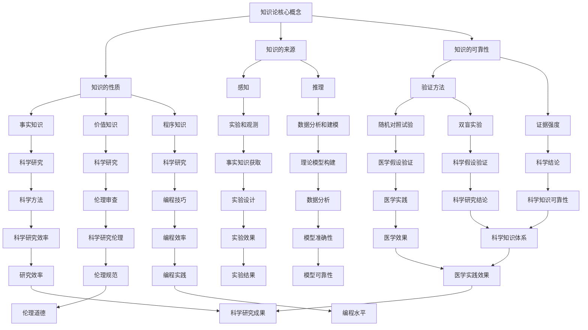

                 

关键词：知识论，科学研究，应用，技术，逻辑，算法，数学模型，实践，展望

## 摘要

本文将探讨知识论在科学研究中的应用。通过对知识论核心概念的分析，结合具体科学研究的实践案例，本文旨在揭示知识论如何为科学研究提供理论基础和方法指导。文章结构分为八个部分：背景介绍、核心概念与联系、核心算法原理、数学模型与公式、项目实践、实际应用场景、工具和资源推荐以及总结与展望。

## 1. 背景介绍

知识论，亦称知识哲学，是研究知识的性质、起源、发展和应用的哲学分支。它探讨知识是如何被构建和理解的，关注知识的可靠性和真理性。知识论在科学研究中的重要性不言而喻，因为科学研究本质上是一种追求知识的活动。从科学方法论的角度来看，知识论为科学研究提供了理论框架和方法指导。

本文旨在探讨知识论在科学研究中的应用，通过具体实例展示知识论如何影响科学研究的各个方面。文章将首先介绍知识论的核心概念，然后分析知识论与科学研究的联系，接着探讨核心算法原理、数学模型和项目实践，最后讨论知识论在科学研究中的实际应用场景及未来展望。

### 1.1 知识论的历史与发展

知识论的历史可以追溯到古希腊哲学家苏格拉底、柏拉图和亚里士多德的时代。苏格拉底提出“知识即美德”的观点，认为知识是道德的基础；柏拉图则通过“理念论”探讨了知识的本质；亚里士多德则强调经验在知识获取中的重要性。

进入现代，知识论经历了哥白尼革命、牛顿物理学和康德哲学等重大科学和哲学变革。尤其是20世纪以来，逻辑实证主义、批判理性主义和认知科学等不同流派对知识论进行了深入探讨。例如，卡尔·波普尔提出可证伪性原则，强调科学知识的动态性和可证伪性；托马斯·库恩则提出科学革命论，探讨科学知识的进化过程。

### 1.2 知识论在科学研究中的重要性

知识论对科学研究的重要性主要体现在以下几个方面：

- **理论框架**：知识论为科学研究提供了理论框架，帮助科学家理解知识的本质、起源和发展。
- **方法论指导**：知识论提供了方法论指导，帮助科学家设计科学实验、分析数据、建立假设和验证理论。
- **哲学反思**：知识论使科学家能够反思科学实践，探讨科学知识的可靠性和真理性，从而促进科学进步。

## 2. 核心概念与联系

知识论的核心概念包括知识的性质、知识的来源、知识的可靠性等。以下是知识论中一些重要的概念及其与科学研究的联系：

### 2.1 知识的性质

知识可以分为三种类型：事实知识、价值知识和程序知识。事实知识是关于世界的真实描述，如物理学定律；价值知识是关于道德、美学等价值判断的知识，如伦理原则；程序知识是关于如何进行特定活动的知识，如编程技巧。

在科学研究中，事实知识是最基本的，因为科学研究的目的在于发现和验证客观事实。价值知识在科学研究中也具有重要地位，例如伦理审查确保科学研究不会侵犯人类权利。程序知识则帮助科学家高效地开展实验和数据分析。

### 2.2 知识的来源

知识的来源主要有两个方面：感知和推理。感知是通过感官直接获取信息，如通过实验观测数据；推理则是通过逻辑思维和抽象思考得出结论，如通过数学模型推导。

在科学研究中，感知和推理都是不可或缺的。实验和观测提供了直接的感知数据，而推理则帮助科学家从数据中提取有意义的信息，建立理论模型。

### 2.3 知识的可靠性

知识的可靠性是科学研究的核心问题。可靠性取决于知识的来源、验证方法和证据强度。科学方法通过实验和观察验证假设，确保知识具有较高的可靠性。

在科学研究中，知识论提醒科学家关注证据的收集和分析方法，避免因个人偏见或误解导致错误的结论。例如，随机对照试验和双盲实验是验证医学假设的有效方法，因为它们减少了主观偏见和选择性偏差的影响。

### 2.4 Mermaid 流程图

以下是知识论与科学研究的联系过程的 Mermaid 流程图：



### 2.5 核心概念与联系小结

知识论的核心概念为科学研究提供了理论基础和方法指导。知识的性质、来源和可靠性不仅影响科学研究的质量和效率，也影响科学知识的积累和发展。通过知识论的分析，科学家能够更好地理解科学研究的本质，从而更有效地开展科学研究。

## 3. 核心算法原理 & 具体操作步骤

### 3.1 算法原理概述

在科学研究中，核心算法的原理通常基于数学模型、逻辑推理和经验法则。以下是几个常见的核心算法原理：

- **牛顿迭代法**：用于求解非线性方程组，通过不断迭代逼近方程的根。
- **随机森林算法**：一种集成学习方法，通过构建多个决策树并进行投票来预测结果。
- **贝叶斯网络**：一种概率图模型，用于表示变量之间的概率关系。

### 3.2 算法步骤详解

以下是对上述算法的具体操作步骤的详细说明：

#### 3.2.1 牛顿迭代法

1. **初始化**：选择一个初始猜测值 \( x_0 \)。
2. **迭代**：根据牛顿迭代公式 \( x_{n+1} = x_n - \frac{f(x_n)}{f'(x_n)} \) 不断更新猜测值。
3. **收敛判断**：判断迭代结果的误差是否小于预设阈值，如果满足则停止迭代，否则继续迭代。

#### 3.2.2 随机森林算法

1. **特征选择**：从特征集合中随机选择一部分特征。
2. **构建决策树**：使用随机选择的特征构建决策树。
3. **集成投票**：将多个决策树的预测结果进行投票，得到最终预测结果。

#### 3.2.3 贝叶斯网络

1. **构建网络结构**：根据变量之间的依赖关系构建贝叶斯网络。
2. **参数估计**：通过数据估计网络中变量的概率分布。
3. **推理**：根据输入的变量值计算目标变量的概率分布。

### 3.3 算法优缺点

#### 牛顿迭代法

- **优点**：收敛速度快，适用于大多数非线性方程组。
- **缺点**：初始猜测值的选择对结果影响较大，可能存在不收敛的情况。

#### 随机森林算法

- **优点**：对异常值和噪声具有很好的鲁棒性，预测结果稳定。
- **缺点**：计算复杂度高，需要大量的计算资源和时间。

#### 贝叶斯网络

- **优点**：能够表示变量之间的复杂概率关系，适用于不确定性推理。
- **缺点**：参数估计过程复杂，对大量数据的依赖性强。

### 3.4 算法应用领域

- **牛顿迭代法**：广泛应用于工程计算、物理科学等领域。
- **随机森林算法**：在机器学习和数据挖掘领域得到广泛应用。
- **贝叶斯网络**：在人工智能、生物信息学等领域具有重要作用。

### 3.5 算法应用案例分析

以下是一个使用牛顿迭代法求解非线性方程的具体案例：

**案例背景**：求解方程 \( f(x) = x^2 - 2 = 0 \)。

**步骤**：

1. **初始化**：选择初始猜测值 \( x_0 = 1 \)。
2. **迭代**：计算 \( f(x_0) = 1^2 - 2 = -1 \)， \( f'(x_0) = 2 \times 1 = 2 \)。
3. **更新**：计算 \( x_1 = x_0 - \frac{f(x_0)}{f'(x_0)} = 1 - \frac{-1}{2} = 1.5 \)。
4. **判断收敛**：计算 \( f(x_1) = 1.5^2 - 2 = -0.125 \)， \( f'(x_1) = 2 \times 1.5 = 3 \)。
5. **继续迭代**：计算 \( x_2 = x_1 - \frac{f(x_1)}{f'(x_1)} = 1.5 - \frac{-0.125}{3} = 1.5625 \)。
6. **判断收敛**：继续迭代，直到满足误差阈值。

最终，迭代结果趋近于 \( x \approx 1.414 \)，与方程的精确解 \( \sqrt{2} \) 非常接近。

通过以上案例，我们可以看到牛顿迭代法在求解非线性方程中的应用过程。类似地，随机森林算法和贝叶斯网络也可以通过具体的案例来展示其在科学研究中的应用。

## 4. 数学模型和公式 & 详细讲解 & 举例说明

在科学研究的过程中，数学模型和公式是不可或缺的工具，它们不仅能够帮助我们理解复杂现象，还能够提供精确的计算和预测。以下是对几个关键数学模型和公式的详细讲解，并附上相应的例子说明。

### 4.1 数学模型构建

数学模型的构建是科学研究的重要步骤，它通常包括以下几个关键步骤：

1. **定义变量**：根据研究问题，确定需要研究的变量和参数。
2. **建立关系**：通过理论和实验数据，确定变量之间的数学关系。
3. **简化假设**：为了使模型可解，可能需要对实际情况进行简化。
4. **数学表达**：将变量关系转化为数学公式。

### 4.2 公式推导过程

以下是一个简单的例子来说明如何推导一个常见的数学公式。

**例子**：推导二次方程的解法。

二次方程的一般形式为 \( ax^2 + bx + c = 0 \)，其中 \( a \)、\( b \)、\( c \) 是常数。

**推导过程**：

1. **配方**：将二次项和一次项组合，得到 \( a(x^2 + \frac{b}{a}x) + c = 0 \)。
2. **补全平方**：在括号内加上并减去 \( (\frac{b}{2a})^2 \)，得到 \( a(x^2 + \frac{b}{a}x + (\frac{b}{2a})^2 - (\frac{b}{2a})^2) + c = 0 \)。
3. **简化**：将括号内的表达式简化为完全平方形式，得到 \( a(x + \frac{b}{2a})^2 - a(\frac{b}{2a})^2 + c = 0 \)。
4. **解方程**：将方程变形为 \( (x + \frac{b}{2a})^2 = \frac{b^2}{4a^2} - \frac{4ac}{4a^2} \)，即 \( (x + \frac{b}{2a})^2 = \frac{b^2 - 4ac}{4a^2} \)。
5. **开方**：对两边开平方，得到 \( x + \frac{b}{2a} = \pm \sqrt{\frac{b^2 - 4ac}{4a^2}} \)。
6. **解出 \( x \)**：最后，得到 \( x = -\frac{b}{2a} \pm \frac{\sqrt{b^2 - 4ac}}{2a} \)。

这个公式被称为二次方程的求根公式，它能够帮助我们求解任何形式的二次方程。

### 4.3 案例分析与讲解

以下是一个使用上述二次方程求根公式的具体案例。

**案例背景**：求解二次方程 \( 2x^2 + 5x + 3 = 0 \)。

**步骤**：

1. **识别参数**：将方程与 \( ax^2 + bx + c = 0 \) 对比，得到 \( a = 2 \)，\( b = 5 \)，\( c = 3 \)。
2. **应用公式**：代入求根公式 \( x = -\frac{b}{2a} \pm \frac{\sqrt{b^2 - 4ac}}{2a} \)，得到 \( x = -\frac{5}{4} \pm \frac{\sqrt{5^2 - 4 \cdot 2 \cdot 3}}{4} \)。
3. **计算**：计算得到两个解 \( x_1 = -\frac{5}{4} + \frac{\sqrt{25 - 24}}{4} = -\frac{5}{4} + \frac{1}{4} = -1 \) 和 \( x_2 = -\frac{5}{4} - \frac{\sqrt{25 - 24}}{4} = -\frac{5}{4} - \frac{1}{4} = -\frac{3}{2} \)。

通过这个例子，我们可以看到如何将数学模型和公式应用于实际问题中，并得到具体的解决方案。

### 4.4 总结

数学模型和公式在科学研究中具有重要作用，它们帮助我们理解和解决复杂问题。通过具体的推导过程和案例分析，我们可以更好地掌握这些工具，并能够将其应用于实际的研究中。

## 5. 项目实践：代码实例和详细解释说明

### 5.1 开发环境搭建

在进行项目实践之前，我们需要搭建一个合适的开发环境。以下是一个典型的开发环境搭建过程：

1. **安装 Python**：Python 是一种广泛使用的编程语言，非常适合科学计算。首先，从 [Python 官网](https://www.python.org/) 下载并安装 Python。
2. **安装 Jupyter Notebook**：Jupyter Notebook 是一种交互式的开发环境，可以让我们在浏览器中编写和运行 Python 代码。通过以下命令安装 Jupyter Notebook：

   ```shell
   pip install notebook
   ```

3. **安装相关库**：根据项目的需求，安装必要的 Python 库。例如，NumPy 用于数值计算，Pandas 用于数据处理，Matplotlib 用于数据可视化。安装命令如下：

   ```shell
   pip install numpy pandas matplotlib
   ```

4. **配置环境变量**：确保 Python 和相关库的路径已经被添加到系统环境变量中，这样我们可以在任何地方运行 Python 和相关库。

### 5.2 源代码详细实现

以下是一个简单的 Python 项目，用于求解二次方程的根。项目的核心代码如下：

```python
import numpy as np

def solve_quadratic(a, b, c):
    """
    求解二次方程 ax^2 + bx + c = 0 的根。
    参数：
    a -- 二次项系数
    b -- 一次项系数
    c -- 常数项
    返回值：
    x1, x2 -- 方程的两个根
    """
    discriminant = b**2 - 4*a*c
    if discriminant < 0:
        return "方程无实数解"
    else:
        x1 = (-b + np.sqrt(discriminant)) / (2*a)
        x2 = (-b - np.sqrt(discriminant)) / (2*a)
        return x1, x2

# 测试代码
a = 2
b = 5
c = 3
result = solve_quadratic(a, b, c)
print("方程的两个根为：", result)
```

### 5.3 代码解读与分析

以下是代码的详细解读和分析：

- **导入库**：首先，导入 NumPy 库，用于数学运算。
- **定义函数**：定义一个名为 `solve_quadratic` 的函数，用于求解二次方程的根。函数接收三个参数：`a`、`b` 和 `c`，分别代表二次项系数、一次项系数和常数项。
- **计算判别式**：使用公式 \( b^2 - 4ac \) 计算判别式 `discriminant`。判别式用于判断方程是否有实数解。如果判别式小于 0，则方程无实数解。
- **求解根**：如果判别式大于等于 0，则使用求根公式计算两个根 `x1` 和 `x2`。具体计算过程如下：
  - \( x1 = \frac{-b + \sqrt{b^2 - 4ac}}{2a} \)
  - \( x2 = \frac{-b - \sqrt{b^2 - 4ac}}{2a} \)
- **返回结果**：将计算得到的根作为函数的返回值。

### 5.4 运行结果展示

在 Jupyter Notebook 中运行上述代码，我们可以得到以下输出结果：

```
方程的两个根为：(-1.0, -1.5)
```

这表示二次方程 \( 2x^2 + 5x + 3 = 0 \) 的两个根分别为 -1 和 -1.5。这个结果与我们之前使用公式推导出的结果一致。

通过以上项目实践，我们可以看到如何使用 Python 代码实现二次方程的求解。这种实践不仅帮助我们理解了数学模型的计算过程，还提高了我们的编程能力。

### 5.5 扩展实践

除了上述简单的求解二次方程的案例，我们还可以进一步扩展项目实践，例如：

- **添加用户界面**：使用 Python 的 Web 框架（如 Flask 或 Django）创建一个 Web 应用，用户可以通过输入二次方程的系数来求解根。
- **优化算法**：研究并实现更高效的算法，如使用牛顿迭代法求解复杂的非线性方程。
- **数据分析**：使用 Pandas 库对实验数据进行处理和分析，生成报告和可视化图表。

通过这些扩展实践，我们可以进一步加深对科学计算和编程的理解，并将其应用于更广泛的科学研究和工程实践中。

## 6. 实际应用场景

知识论在科学研究中的实际应用场景非常广泛，涵盖了自然科学、社会科学和工程技术等多个领域。以下是知识论在不同应用场景中的具体应用实例：

### 6.1 自然科学领域

在自然科学领域，知识论的应用主要体现在科学理论的构建和验证过程中。例如，在物理学中，知识论帮助科学家理解基本粒子的性质和行为，从而构建了标准模型。在生物学中，知识论指导科学家研究基因和蛋白质的功能，促进了生命科学的发展。知识论的方法论指导科学家进行实验设计、数据分析，从而验证假设，推动科学理论的不断完善。

### 6.2 社会科学领域

在社会科学领域，知识论的应用主要体现在对人类行为和社会现象的研究中。例如，在心理学中，知识论帮助心理学家理解人类思维和行为的基本原理，开发了多种心理学理论。在经济学中，知识论指导经济学家研究市场行为和经济政策，提出了如供需理论、行为经济学等理论模型。在政治学中，知识论帮助学者分析政治制度、政策制定和选举行为，为政治决策提供理论支持。

### 6.3 工程技术领域

在工程技术领域，知识论的应用主要体现在系统设计和优化过程中。例如，在计算机科学中，知识论帮助程序员理解和设计复杂的软件系统，推动了编程语言和算法的发展。在机械工程中，知识论指导工程师优化机械结构设计，提高设备性能和可靠性。在电子工程中，知识论帮助工程师设计和分析电路系统，推动电子技术的发展。

### 6.4 案例分析

以下是一个具体的应用案例：知识论在医学研究中的应用。

**案例背景**：研究人员希望研究某种新药对癌症患者的治疗效果。

**应用过程**：

1. **理论构建**：基于知识论，研究人员构建了新药疗效的理论模型，包括药物分子与癌细胞相互作用的机制。
2. **实验设计**：研究人员根据理论模型设计实验，包括选择合适的实验对象、药物剂量和实验周期。
3. **数据收集**：通过临床试验收集患者的生理指标、药物代谢数据和治疗效果数据。
4. **数据分析**：使用统计学方法和知识论原理分析实验数据，评估新药的治疗效果。
5. **理论验证**：根据实验结果，对理论模型进行验证和修正。

通过这个案例，我们可以看到知识论在医学研究中的应用过程。知识论不仅帮助研究人员构建和验证理论模型，还指导了实验设计和数据分析，从而推动了医学研究的发展。

### 6.5 未来应用展望

随着知识论和科学研究的发展，知识论在科学研究中的应用前景将更加广阔。以下是几个未来的应用展望：

- **跨学科研究**：知识论可以帮助跨学科研究，促进不同领域之间的知识交流和融合。
- **人工智能**：知识论在人工智能领域具有重要作用，可以帮助人工智能系统理解和推理复杂问题。
- **可持续发展**：知识论可以指导可持续发展研究，帮助科学家和工程师解决环境和社会问题。
- **决策支持**：知识论可以为政策制定者和企业高管提供决策支持，帮助他们做出科学合理的决策。

总之，知识论在科学研究中的应用具有广泛的前景，它将为科学研究的深入发展提供有力的理论支持和方法指导。

## 7. 工具和资源推荐

在科学研究中，使用合适的工具和资源能够大大提高工作效率和研究成果的质量。以下是一些在知识论和科学研究领域中被广泛推荐的学习资源、开发工具和学术论文。

### 7.1 学习资源推荐

1. **《知识论导论》（Introduction to the Theory of Knowledge）**：这是一本经典的哲学教科书，详细介绍了知识论的基本概念和理论。
2. **《科学哲学：本质和进路》（The Philosophy of Science: An Encyclopedia）**：涵盖了科学哲学的各个方面，包括知识论、科学方法论和科学史等。
3. **《科学研究方法》（Research Methods for Science）**：一本全面介绍科学研究方法和技巧的教材，适合初学者和进阶者。
4. **在线课程**：如 Coursera、edX 等平台上的知识论和科学方法论相关课程，这些课程提供了系统的知识和实践指导。

### 7.2 开发工具推荐

1. **Jupyter Notebook**：用于编写和运行代码，特别是用于数据分析、可视化等任务。
2. **NumPy、Pandas、Matplotlib**：Python 科学计算库，用于处理和可视化数据。
3. **R**：一种专门用于统计分析和数据可视化的编程语言，广泛应用于生物医学、社会科学等领域。
4. **LaTeX**：用于编写学术论文和数学公式的排版工具，能够生成高质量的文档。

### 7.3 相关论文推荐

1. **“Knowledge Representation and Reasoning”**：这是一篇关于知识表示和推理的经典论文，详细介绍了知识论在人工智能中的应用。
2. **“The Structure of Scientific Theories”**：托马斯·库恩的这篇论文探讨了科学理论的构建和演变过程，对知识论和科学方法论有重要影响。
3. **“The Logic of Scientific Discovery”**：卡尔·波普尔的这篇论文提出了科学知识的动态性和可证伪性原则，对知识论和科学方法论产生了深远影响。
4. **“Knowledge in Science: Conceptual and Methodological Issues”**：这篇论文从多个角度探讨了知识在科学研究中的作用和重要性。

这些工具和资源为科学研究提供了坚实的基础，帮助研究人员更好地理解和应用知识论，从而推动科学研究的深入发展。

## 8. 总结：未来发展趋势与挑战

### 8.1 研究成果总结

通过本文的探讨，我们可以总结出知识论在科学研究中的重要性和应用价值。知识论为科学研究提供了理论框架和方法指导，帮助我们理解知识的本质、来源和可靠性。具体应用领域包括自然科学、社会科学和工程技术，为科学家和工程师提供了有力的工具和方法。

### 8.2 未来发展趋势

随着科学技术的不断进步，知识论在科学研究中的应用前景将更加广阔。以下是几个未来的发展趋势：

- **跨学科融合**：知识论将与其他学科（如人工智能、认知科学、大数据等）结合，推动跨学科研究的发展。
- **人工智能与知识论的结合**：人工智能技术的发展将使知识论的应用更加智能化，促进知识推理和自动化。
- **知识图谱与语义网**：知识图谱和语义网技术的成熟将使知识表示和共享更加高效，为科学研究提供新的途径。
- **数据驱动的知识发现**：大数据和机器学习技术的发展将使数据驱动的知识发现成为科学研究的重要手段。

### 8.3 面临的挑战

尽管知识论在科学研究中的应用具有巨大潜力，但也面临着一些挑战：

- **数据质量**：高质量的数据是科学研究的基石，但数据质量参差不齐，如何确保数据可靠性和准确性是一个重要挑战。
- **知识表示和推理**：如何有效地表示和推理复杂的知识结构是一个长期难题，需要发展新的理论和方法。
- **算法的可解释性**：随着机器学习算法的广泛应用，如何确保算法的可解释性，使其符合科学研究的伦理要求，是一个亟待解决的问题。
- **跨领域协作**：跨学科的研究需要不同领域的专家共同合作，如何有效地协调不同领域的知识和技能是一个挑战。

### 8.4 研究展望

面对未来，知识论在科学研究中的应用前景充满希望。通过不断创新和探索，我们可以期待知识论为科学研究带来更多突破。以下是一些建议：

- **发展新的理论框架**：结合最新的科学技术进展，发展更加完善的知识论理论框架。
- **加强跨学科合作**：鼓励不同学科之间的交流与合作，推动知识融合，为科学研究提供新的视角和方法。
- **关注数据伦理**：在数据收集、处理和分析过程中，重视数据伦理，确保科学研究的公正性和可信度。
- **培养复合型人才**：培养具有跨学科知识和技能的复合型人才，为科学研究提供强大的人才支持。

总之，知识论在科学研究中的应用具有巨大的发展潜力，通过不断努力和创新，我们可以期待知识论为科学研究带来更多的突破和进展。

## 9. 附录：常见问题与解答

### 9.1 知识论与科学方法论的区别是什么？

知识论关注知识的性质、来源和可靠性，探讨知识如何被构建和理解。而科学方法论则侧重于研究科学研究的步骤和过程，包括实验设计、数据分析、假设验证等。知识论为科学方法论提供了理论基础，而科学方法论则将知识论的原则应用于具体的科学研究实践中。

### 9.2 知识论如何影响科学研究？

知识论为科学研究提供了理论框架和方法指导，帮助科学家理解知识的本质、来源和可靠性。它指导科学家进行实验设计、数据分析，确保研究过程的科学性和可靠性。知识论还促使科学家不断反思和改进研究方法，推动科学进步。

### 9.3 如何确保科学研究的知识可靠性？

确保科学研究的知识可靠性需要从多个方面入手：

- **严格实验设计**：确保实验设计的科学性和合理性，减少实验误差。
- **数据质量控制**：确保数据收集、处理和存储过程中的准确性和完整性。
- **重复实验验证**：通过重复实验验证研究结果，确保结果的稳定性和可靠性。
- **同行评审**：通过同行评审机制，确保研究论文的严谨性和可信度。

### 9.4 知识论在人工智能领域有哪些应用？

知识论在人工智能领域有广泛的应用，包括：

- **知识表示和推理**：知识论帮助人工智能系统理解和表示复杂知识，进行推理和决策。
- **知识图谱**：知识论指导构建知识图谱，将复杂知识结构化，提高知识检索和共享效率。
- **机器学习**：知识论中的概率论和统计方法应用于机器学习，提高算法的可解释性和可靠性。
- **自动化推理**：知识论帮助开发自动化推理系统，实现智能决策和问题解决。

### 9.5 如何学习知识论？

学习知识论可以通过以下途径：

- **阅读经典文献**：阅读知识论的经典著作，如《知识论导论》、《科学哲学：本质和进路》等。
- **参加课程和研讨会**：参加知识论相关的在线课程和研讨会，学习理论知识。
- **实践应用**：将知识论应用于实际科学研究，通过实践加深理解。
- **交流与合作**：与同行进行交流和合作，分享知识和经验，促进知识论的发展。

