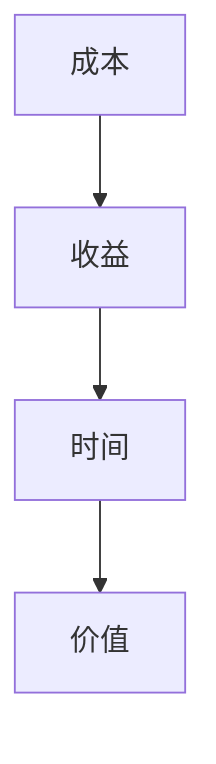

                 

关键词：知识资产、长期价值、知识产权、创新、技术发展

> 摘要：在当今快速发展的信息技术时代，知识资产作为企业和社会的重要资源，其发掘和培育对于长期价值的实现具有重要意义。本文将从知识资产的定义、重要性、发掘与培育策略、知识产权保护以及未来发展趋势等方面进行深入探讨，旨在为企业和组织提供有益的参考和指导。

## 1. 背景介绍

知识资产，顾名思义，是指企业或组织在知识经济时代中，通过各种方式创造和积累的具有经济价值、竞争优势和可持续发展的无形资产。这些资产包括但不限于专利、商标、著作权、商业秘密、人力资源、客户关系、技术标准、品牌价值等。随着全球经济的日益数字化和知识化，知识资产在企业价值创造中的作用愈发显著。

知识资产的重要性主要体现在以下几个方面：

1. **价值创造**：知识资产是企业核心竞争力的重要组成部分，能够在市场竞争中为企业带来持续的经济收益。
2. **竞争优势**：知识资产有助于企业在市场竞争中保持领先地位，降低被竞争对手模仿和超越的风险。
3. **创新动力**：知识资产是推动企业持续创新的关键因素，有助于企业不断开拓新的市场和技术领域。
4. **可持续发展**：知识资产具有长期性、积累性和可转移性，能够为企业的可持续发展提供坚实的基础。

## 2. 核心概念与联系

### 2.1 知识资产分类

知识资产可以分为两大类：硬知识和软知识。

- **硬知识**：指可以明确界定和量化的知识，如专利、商标、著作权等。这类知识通常具有明确的法律保护和较高的市场价值。
- **软知识**：指难以明确界定和量化的知识，如商业秘密、客户关系、企业文化等。这类知识通常依赖于企业内部的组织结构和人员管理。

### 2.2 知识资产价值评估

知识资产的价值评估是发掘和培育知识资产长期价值的重要环节。常用的评估方法包括成本法、市场法和收益法。

- **成本法**：基于知识资产的创建、维护和保护等成本进行评估。
- **市场法**：参考市场上类似知识资产的价格和交易情况，进行相对评估。
- **收益法**：基于知识资产预期带来的未来收益进行评估。

### 2.3 知识资产管理体系

知识资产管理体系是指企业为有效管理和利用知识资产而建立的一系列制度、流程和工具。主要包括以下内容：

- **知识资产识别**：识别企业内部的知识资产，并进行分类和登记。
- **知识资产评估**：对知识资产进行价值评估，确定其对企业的重要性。
- **知识资产保护**：通过法律手段和内部管理措施，保护知识资产不受侵犯。
- **知识资产运用**：将知识资产应用于企业运营和市场竞争，实现其价值。

## 3. 核心算法原理 & 具体操作步骤

### 3.1 算法原理概述

知识资产的发掘和培育是一个复杂的过程，需要运用多种技术和方法。以下是一个基于知识图谱和人工智能的算法原理概述。

1. **知识图谱构建**：通过数据挖掘和知识抽取技术，构建企业内外部的知识图谱，实现对知识资产的全面覆盖和关联分析。
2. **知识关联分析**：运用图论和网络分析方法，分析知识资产之间的关联关系，识别关键节点和核心领域。
3. **知识价值评估**：结合收益法、成本法等多种评估方法，对知识资产进行价值评估，确定其对企业的重要性。
4. **知识资产保护**：通过知识产权法律手段和内部管理制度，保护知识资产不受侵犯。

### 3.2 算法步骤详解

1. **数据收集**：收集企业内部和外部的数据，包括专利信息、商标信息、著作权信息、市场数据、企业运营数据等。
2. **数据清洗**：对收集到的数据进行分析和清洗，去除重复、错误和不完整的数据。
3. **知识抽取**：运用自然语言处理和机器学习技术，从原始数据中提取知识实体和关系，构建知识图谱。
4. **知识关联分析**：运用图论和网络分析方法，对知识图谱进行关联分析，识别关键节点和核心领域。
5. **知识价值评估**：结合收益法、成本法等多种评估方法，对知识资产进行价值评估，确定其对企业的重要性。
6. **知识资产保护**：制定知识产权保护和内部管理制度，保护知识资产不受侵犯。

### 3.3 算法优缺点

#### 3.3.1 优点

1. **全面覆盖**：算法能够对企业的知识资产进行全面覆盖，识别出各种类型的知识资产。
2. **高效精准**：运用人工智能和机器学习技术，能够高效精准地分析知识资产之间的关联关系。
3. **灵活适应**：算法可以根据企业的实际情况进行调整和优化，适应不同的企业和行业。

#### 3.3.2 缺点

1. **数据质量要求高**：算法的输入数据质量直接影响结果，需要企业进行数据清洗和处理。
2. **计算资源消耗大**：算法涉及大量的数据分析和计算，对计算资源有较高的要求。

### 3.4 算法应用领域

知识资产的发掘和培育算法可以应用于多种领域，包括：

1. **企业知识产权管理**：帮助企业识别和保护知识产权，提升知识产权的价值。
2. **企业知识资产管理**：帮助企业建立知识资产管理体系，提升知识资产的利用效率。
3. **行业研究**：为行业提供知识资产的分析报告，帮助企业了解行业趋势和竞争态势。

## 4. 数学模型和公式 & 详细讲解 & 举例说明

### 4.1 数学模型构建

在知识资产的价值评估中，我们可以构建以下数学模型：

\[ V = f(C, R, T) \]

其中，\( V \) 表示知识资产的价值，\( C \) 表示知识资产的成本，\( R \) 表示知识资产带来的预期收益，\( T \) 表示知识资产的保护周期。

### 4.2 公式推导过程

假设知识资产的成本为 \( C \)，其带来的预期收益为 \( R \)，保护周期为 \( T \)，则知识资产的价值可以表示为：

\[ V = \frac{R}{C} \cdot T \]

其中，\( \frac{R}{C} \) 表示知识资产的收益成本比，\( T \) 表示知识资产的保护周期。

### 4.3 案例分析与讲解

假设某企业开发了一项新技术，成本为 100 万元，预期每年带来 50 万元的收益，保护周期为 10 年。则该技术的价值为：

\[ V = \frac{50}{100} \cdot 10 = 5 \]

这意味着该技术的价值为 5 万元。

### 5. 项目实践：代码实例和详细解释说明

#### 5.1 开发环境搭建

在本节中，我们将使用 Python 编写一个简单的知识资产价值评估程序。首先，我们需要安装以下 Python 库：

```bash
pip install pandas numpy matplotlib
```

#### 5.2 源代码详细实现

以下是一个简单的知识资产价值评估程序的 Python 代码：

```python
import pandas as pd
import numpy as np
import matplotlib.pyplot as plt

def calculate_value(cost, revenue, time):
    return (revenue / cost) * time

# 示例数据
data = {
    'cost': [100000, 200000, 300000],
    'revenue': [50000, 60000, 70000],
    'time': [10, 10, 10]
}

df = pd.DataFrame(data)

# 计算知识资产价值
df['value'] = df.apply(lambda row: calculate_value(row['cost'], row['revenue'], row['time']), axis=1)

# 可视化展示
plt.plot(df['cost'], df['value'], label='Value')
plt.xlabel('Cost')
plt.ylabel('Value')
plt.title('Knowledge Asset Value Evaluation')
plt.legend()
plt.show()
```

#### 5.3 代码解读与分析

1. **数据导入**：使用 Pandas 库导入示例数据，数据包括成本、收益和保护周期。
2. **计算价值**：定义一个函数 `calculate_value`，用于计算知识资产的价值。
3. **应用函数**：使用 Pandas 的 `apply` 方法，将函数应用于每一行数据，计算知识资产的价值。
4. **可视化展示**：使用 Matplotlib 库，将计算结果绘制成折线图，展示知识资产价值与成本之间的关系。

#### 5.4 运行结果展示

运行上述代码后，我们将看到一个折线图，展示不同成本情况下的知识资产价值。这有助于我们直观地了解知识资产的价值与成本之间的关系。



## 6. 实际应用场景

知识资产的发掘和培育在企业管理中具有广泛的应用场景：

1. **企业知识产权管理**：企业可以通过发掘和培育知识产权，提升企业的市场竞争力和品牌价值。
2. **企业知识资产管理**：企业可以通过建立知识资产管理体系，提升知识资产的利用效率，降低运营成本。
3. **创新项目管理**：企业可以通过发掘和培育关键知识资产，推动创新项目的发展，提升项目的成功率和收益。
4. **行业研究**：企业可以通过发掘和培育行业知识资产，为行业提供深入的研究报告，帮助企业了解行业趋势和竞争态势。

## 7. 工具和资源推荐

为了更好地发掘和培育知识资产，以下是一些建议的学习资源、开发工具和相关论文：

### 7.1 学习资源推荐

- 《知识产权管理》
- 《知识管理》
- 《知识图谱技术》
- 《人工智能应用实践》

### 7.2 开发工具推荐

- Python
- Pandas
- NumPy
- Matplotlib
- Mermaid

### 7.3 相关论文推荐

- "知识资产价值评估模型研究"
- "基于知识图谱的企业知识资产管理研究"
- "人工智能在知识资产发掘和培育中的应用"

## 8. 总结：未来发展趋势与挑战

随着全球经济的数字化和知识化，知识资产在企业发展中的作用愈发重要。未来，知识资产的发掘和培育将呈现以下发展趋势：

1. **技术融合**：知识资产发掘和培育将更加依赖于人工智能、大数据、云计算等先进技术的融合应用。
2. **智能化管理**：知识资产管理体系将向智能化方向发展，实现自动化、智能化的知识资产管理和分析。
3. **跨界合作**：企业将加强跨界合作，共同发掘和培育知识资产，提升整体竞争力。

然而，知识资产的发掘和培育也面临着一系列挑战：

1. **数据质量**：数据质量直接影响知识资产的价值评估和分析效果，需要企业加强数据管理和质量控制。
2. **知识产权保护**：知识产权保护仍然是知识资产发掘和培育的重要挑战，企业需要加强知识产权保护和维权意识。
3. **人才缺乏**：知识资产发掘和培育需要具备多学科背景和技能的专业人才，企业需要加强人才培养和引进。

总之，知识资产的发掘和培育对于企业和社会的长期价值具有重要意义。企业应积极应对挑战，加强知识资产管理和创新，提升整体竞争力，为实现长期可持续发展奠定坚实基础。

## 9. 附录：常见问题与解答

### 9.1 什么样的资产可以被视为知识资产？

知识资产包括专利、商标、著作权、商业秘密、人力资源、客户关系、技术标准、品牌价值等多种形式。只要是对企业或组织有经济价值和竞争优势的无形资产，都可以被视为知识资产。

### 9.2 如何评估知识资产的价值？

知识资产的价值评估可以采用成本法、市场法和收益法等多种方法。具体评估方法的选择取决于知识资产的类型、市场环境和企业的实际情况。

### 9.3 知识资产保护有哪些措施？

知识资产保护可以通过法律手段和内部管理措施实现。法律手段包括申请专利、注册商标、签订保密协议等。内部管理措施包括建立知识资产管理体系、制定知识产权保护政策、加强员工培训和意识教育等。

### 9.4 知识资产发掘和培育的关键成功因素是什么？

关键成功因素包括：明确知识资产的重要性、建立有效的知识资产管理体系、加强知识产权保护、充分利用先进技术、培养专业人才、以及持续关注市场动态和行业趋势。作者：禅与计算机程序设计艺术 / Zen and the Art of Computer Programming
-------------------------------------------------------------------

