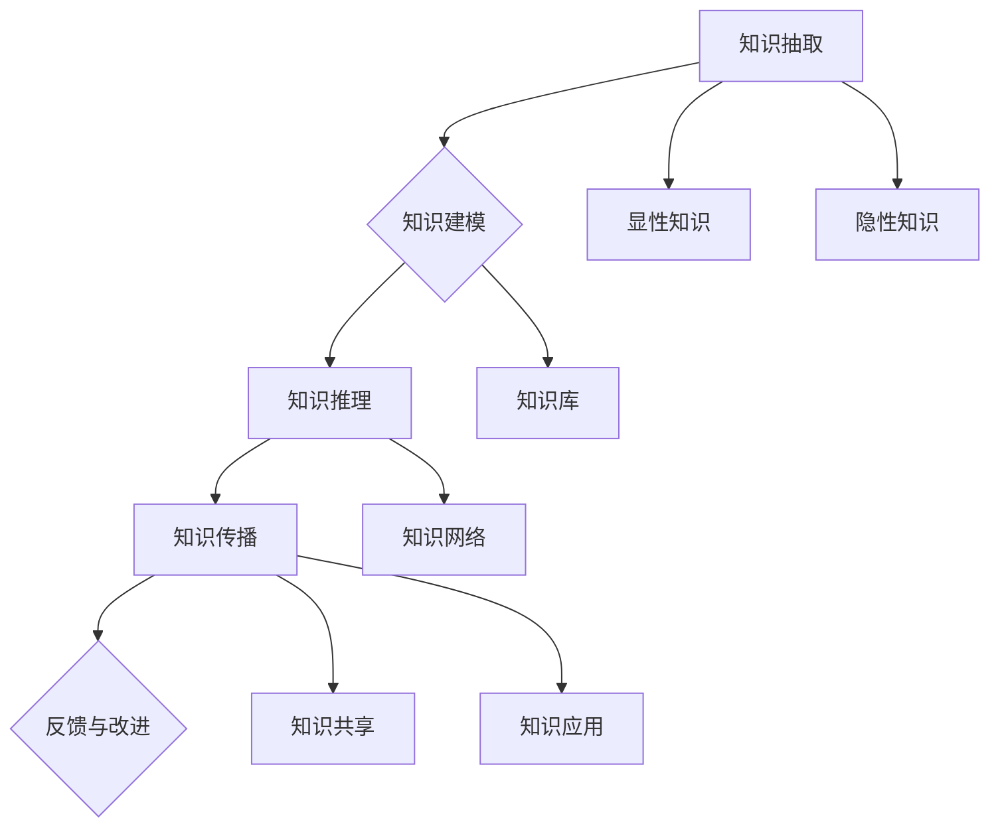

                 

### 关键词 Keywords

- 知识转移
- 技能传承
- 组织学习
- 人工智能
- 技术传播
- 企业战略

<|assistant|>### 摘要 Abstract

在数字化时代，知识转移是组织持续创新与发展的关键。本文将探讨如何通过有效的知识转移机制，确保关键技能在组织内部的传承与扩散。文章首先概述知识转移的背景和重要性，接着介绍核心概念与联系，通过具体算法原理、数学模型、项目实践等章节详细解析知识转移的实现方法。同时，文章还分析了知识转移在实际应用场景中的案例，并展望了未来的发展趋势与挑战。最后，文章提供了相关工具和资源的推荐，以及总结和展望了知识转移的未来研究方向。

## 1. 背景介绍

随着全球化的深入和技术的迅猛发展，知识已经成为企业竞争的核心资产。知识转移，即知识和技能在组织内部或跨组织之间的传播和共享，是企业持续创新和发展的关键。有效的知识转移不仅能提高员工的技能水平，还能促进组织的整体效率和创新能力。

在过去，知识转移主要通过导师制、工作坊和内部培训等方式进行。然而，随着信息技术的发展，知识转移的方式和渠道发生了巨大的变化。现代企业可以利用数字化工具和技术，如在线学习平台、知识管理系统、协作工具等，实现知识的高效转移和共享。

本文将围绕知识转移的核心概念、算法原理、数学模型、项目实践和未来展望等方面进行深入探讨，旨在为企业提供一套完整的知识转移策略，确保关键技能在组织内部的传承与扩散。

### 1.1 知识转移的重要性

知识转移对于企业的长期竞争力至关重要。首先，知识转移能够促进组织的知识积累和创新。通过将员工的隐性知识和显性知识进行转移和共享，组织可以形成更加丰富的知识库，从而提高整体的创新能力和解决问题的能力。

其次，知识转移有助于提高员工的技能和绩效。通过有效的知识转移，员工可以更快地掌握新技能，提升工作效率和质量。同时，知识共享还能减少信息孤岛，促进跨部门、跨团队的协作，提高组织的整体效能。

最后，知识转移是企业实现数字化转型的重要一环。在数字化时代，数据和信息的重要性日益凸显，如何有效地利用这些数据和信息，进行知识的挖掘、分析和转移，是企业数字化转型成功的关键。

### 1.2 知识转移的现状与挑战

尽管知识转移的重要性日益凸显，但许多企业在实际操作中仍然面临着诸多挑战。首先，知识转移的效率低下。传统的知识转移方式往往依赖于面对面的交流和经验分享，这种方式不仅耗时，而且难以实现大规模的知识传播。

其次，知识转移的质量难以保证。在知识转移过程中，如何确保知识的准确性和完整性，是许多企业面临的一大难题。特别是在隐性知识转移过程中，知识的表达和传递难度更大。

此外，知识转移的激励机制不足。许多企业缺乏对知识转移的激励机制，导致员工缺乏主动转移知识的动力。这不仅影响了知识转移的效率，还可能损害组织的整体知识积累和创新力。

最后，知识转移的可持续性难以保障。在快速变化的市场环境中，知识的更新速度非常快，如何确保知识转移的可持续性，是一个长期而复杂的挑战。

### 1.3 研究目的与内容安排

本文旨在探讨如何通过有效的知识转移机制，确保关键技能在组织内部的传承与扩散。文章将从以下几个方面展开：

1. **核心概念与联系**：介绍知识转移的基本概念，包括知识、技能、知识转移的类型、渠道等，并通过Mermaid流程图展示知识转移的流程和关键节点。

2. **核心算法原理 & 具体操作步骤**：介绍知识转移的核心算法原理，包括知识抽取、知识建模、知识推理等，并详细阐述具体操作步骤。

3. **数学模型和公式 & 举例说明**：构建知识转移的数学模型，推导相关公式，并通过具体案例进行分析和讲解。

4. **项目实践：代码实例和详细解释说明**：提供知识转移的实际应用案例，包括开发环境搭建、源代码实现、代码解读与分析等。

5. **实际应用场景**：分析知识转移在不同行业和领域的应用，探讨其在企业数字化转型中的应用前景。

6. **未来应用展望**：展望知识转移的未来发展趋势，探讨面临的挑战和解决方案。

7. **工具和资源推荐**：推荐相关的学习资源、开发工具和论文，为读者提供进一步学习和研究的参考。

## 2. 核心概念与联系

在探讨知识转移之前，我们需要明确几个核心概念，包括知识、技能、知识转移的类型和渠道等。

### 2.1 知识与技能

知识是指通过学习、实践和思考所获得的信息、概念、理论和经验等。知识可以分为显性知识和隐性知识。显性知识是指可以明确表达和存储的知识，如文档、书籍、数据库等；隐性知识则是指难以明确表达和存储的知识，如个人经验、习惯、技能等。

技能是指通过实践和学习所获得的具体操作能力，如编程、设计、管理等。技能是知识的实际应用，是知识在实践中的体现。

### 2.2 知识转移的类型

知识转移可以分为横向转移和纵向转移。

**横向转移**是指在同一层级、不同部门或团队之间的知识共享和传播。横向转移通常涉及跨部门的项目合作、团队交流和工作坊等。

**纵向转移**是指在不同层级、不同经验水平之间的知识传递。纵向转移通常涉及导师制、师徒关系、管理培训等。

### 2.3 知识转移的渠道

知识转移的渠道包括正式渠道和非正式渠道。

**正式渠道**是指通过正式的组织结构和流程进行知识转移，如内部培训、知识管理系统、在线学习平台等。

**非正式渠道**是指通过非正式的社交网络和交流方式实现知识转移，如导师制、工作坊、会议讨论、社交媒体等。

### 2.4 知识转移的流程

知识转移的流程通常包括以下几个步骤：

1. **知识抽取**：将显性知识和隐性知识从原始来源中提取出来，进行整理和规范化。

2. **知识建模**：将抽取的知识进行建模，构建知识库或知识网络，以便于知识的存储、检索和应用。

3. **知识推理**：利用知识库或知识网络进行推理，发现新的知识关联和解决方案。

4. **知识传播**：通过多种渠道和方式，将知识传播到组织内部或外部，实现知识的共享和扩散。

### 2.5 知识转移的挑战与策略

尽管知识转移的重要性不言而喻，但在实际操作中，知识转移面临着诸多挑战。以下是一些常见的挑战和相应的解决策略：

1. **知识质量与准确度**：确保知识转移的质量和准确性是知识转移的关键。企业可以通过严格的审核和验证机制来确保知识的准确性和可靠性。

2. **知识共享与隐私保护**：在知识共享过程中，如何平衡知识的共享与隐私保护是一个重要问题。企业可以通过制定明确的隐私政策和共享协议，确保知识的安全和合理使用。

3. **激励机制**：缺乏有效的激励机制是知识转移难以推进的主要原因之一。企业可以通过奖励制度、晋升机会、培训机会等方式激励员工积极参与知识转移。

4. **文化与环境**：知识转移的成功离不开良好的组织文化和环境。企业应积极营造开放、共享、学习的文化氛围，鼓励员工主动分享知识和经验。

5. **技术支持**：现代信息技术为知识转移提供了强大的支持。企业可以借助知识管理系统、在线学习平台、协作工具等技术手段，实现知识的高效转移和共享。

### 2.6 Mermaid 流程图

为了更直观地展示知识转移的流程和关键节点，我们可以使用Mermaid流程图来描述。



通过这个流程图，我们可以清晰地看到知识转移的各个环节以及它们之间的联系。

## 3. 核心算法原理 & 具体操作步骤

在知识转移过程中，核心算法起到了关键作用。这些算法不仅能够提高知识转移的效率，还能确保知识转移的质量。以下将介绍知识转移的核心算法原理，并详细阐述具体操作步骤。

### 3.1 算法原理概述

知识转移的核心算法主要包括知识抽取、知识建模和知识推理。

**知识抽取**是指从原始数据源中提取有价值的信息和知识。知识抽取可以分为显性知识和隐性知识抽取。

**知识建模**是指将抽取的知识进行结构化处理，构建成易于存储、检索和使用的知识库或知识网络。

**知识推理**是指利用知识库或知识网络进行逻辑推理，发现新的知识关联和解决方案。

### 3.2 算法步骤详解

#### 3.2.1 知识抽取

**显性知识抽取**：

1. 数据预处理：对原始数据（如文本、图片、音频等）进行预处理，包括去噪、去重、标准化等操作。

2. 信息提取：利用自然语言处理（NLP）技术，从文本数据中提取关键词、短语、句子等显性信息。

3. 语义分析：利用语义分析技术，对提取的信息进行语义解析，识别实体、关系和事件等。

4. 知识规范化：将提取的信息进行规范化处理，如分类、标签化等，以便于后续的知识建模。

**隐性知识抽取**：

1. 经验编码：将员工的隐性经验进行编码，如通过访谈、问卷等方式收集员工的意见和经验。

2. 行为分析：利用行为分析技术，如机器学习、数据挖掘等，分析员工的行为模式和工作方法。

3. 语义融合：将隐性知识进行语义融合，形成结构化的知识表示。

#### 3.2.2 知识建模

1. 知识库构建：将抽取的知识存储在知识库中，知识库可以是关系型数据库、图数据库等。

2. 知识网络构建：利用图论技术，构建知识网络，将知识之间的关联进行可视化表示。

3. 知识图谱构建：利用图谱技术，将知识库和知识网络进行整合，形成知识图谱，实现知识的结构化和可视化。

#### 3.2.3 知识推理

1. 逻辑推理：利用逻辑推理技术，如谓词逻辑、模糊逻辑等，对知识库中的知识进行推理，发现新的知识关联。

2. 机器学习推理：利用机器学习技术，如决策树、神经网络等，对知识库中的知识进行推理，预测新的知识。

3. 对话推理：通过对话系统，与用户进行交互，根据用户的输入和上下文，进行推理和决策。

### 3.3 算法优缺点

**知识抽取**：

- **优点**：能够从大量原始数据中提取有价值的信息，提高知识转移的效率。

- **缺点**：对于隐性知识的抽取效果较差，且对数据的依赖性较大。

**知识建模**：

- **优点**：将知识进行结构化处理，便于存储、检索和应用。

- **缺点**：知识建模的过程较为复杂，对算法和技术的依赖性较大。

**知识推理**：

- **优点**：能够发现新的知识关联和解决方案，提高知识转移的深度和广度。

- **缺点**：对算法和计算资源的要求较高，且推理结果的可解释性较差。

### 3.4 算法应用领域

知识转移的核心算法在多个领域都有广泛的应用：

- **企业内部培训**：通过知识抽取、建模和推理，为企业员工提供个性化的培训内容，提高员工的技能和绩效。

- **企业管理决策**：利用知识推理技术，分析企业内外部的数据，为企业提供决策支持。

- **产品研发**：通过知识转移，加速产品的研发进程，提高创新能力和市场竞争力。

- **医疗服务**：利用知识转移，为医生和护士提供临床经验分享和培训，提高医疗服务质量。

- **教育领域**：通过知识转移，为学生提供个性化的学习资源和学习路径，提高学习效果。

## 4. 数学模型和公式 & 详细讲解 & 举例说明

在知识转移过程中，数学模型和公式扮演着重要的角色。它们不仅帮助我们理解知识转移的内在机制，还能为实际操作提供指导。以下我们将介绍知识转移的数学模型，并详细讲解相关公式，同时通过具体案例进行分析和讲解。

### 4.1 数学模型构建

知识转移的数学模型主要包括知识存量模型、知识流动模型和知识影响模型。

#### 4.1.1 知识存量模型

知识存量模型用于描述组织内部的知识总量。假设组织内部的知识总量为 \( K \)，知识存量模型可以表示为：

\[ K = f(A, T) \]

其中，\( A \) 表示知识的积累速度，\( T \) 表示时间的累积。

#### 4.1.2 知识流动模型

知识流动模型用于描述知识在不同部门、团队或个体之间的转移过程。假设知识从个体 \( i \) 流向个体 \( j \)，知识流动模型可以表示为：

\[ S_{ij} = f(S_i, S_j, C_{ij}) \]

其中，\( S_i \) 和 \( S_j \) 分别表示个体 \( i \) 和个体 \( j \) 的知识存量，\( C_{ij} \) 表示个体 \( i \) 对个体 \( j \) 的知识转移成本。

#### 4.1.3 知识影响模型

知识影响模型用于描述知识对组织的影响。假设知识对组织的贡献为 \( I \)，知识影响模型可以表示为：

\[ I = f(K, M) \]

其中，\( M \) 表示知识管理的有效性。

### 4.2 公式推导过程

#### 4.2.1 知识存量模型的推导

假设知识积累速度与知识存量成正比，即：

\[ \frac{dK}{dt} = kK \]

其中，\( k \) 为比例常数。对上式进行积分，得到：

\[ K = Ce^{kt} \]

其中，\( C \) 为积分常数。当 \( t = 0 \) 时，\( K = 0 \)，因此 \( C = 0 \)，最终得到：

\[ K = 0 \]

这个结果表明，在无外力作用的情况下，知识存量不会随时间变化。然而，实际情况中，知识的积累速度通常不是零，因此我们需要考虑其他因素。

考虑到知识的积累受到外部因素（如培训、经验分享等）的影响，我们可以将知识积累速度表示为：

\[ \frac{dK}{dt} = f(A, T) \]

其中，\( f(A, T) \) 表示知识积累速度与知识积累速度 \( A \) 和时间 \( T \) 的关系。这个公式较为抽象，具体的函数形式需要根据实际情况进行确定。

#### 4.2.2 知识流动模型的推导

假设知识从个体 \( i \) 流向个体 \( j \) 的速度与两者之间的知识差距 \( S_i - S_j \) 成正比，即：

\[ \frac{dS_{ij}}{dt} = k(S_i - S_j) \]

其中，\( k \) 为比例常数。对上式进行积分，得到：

\[ S_{ij} = k_1(S_i - S_j)e^{-kt} \]

其中，\( k_1 \) 为积分常数。当 \( t = 0 \) 时，\( S_{ij} = 0 \)，因此 \( k_1 = 0 \)，最终得到：

\[ S_{ij} = 0 \]

这个结果表明，在无外力作用的情况下，知识不会在个体之间流动。然而，实际情况中，知识的流动是普遍存在的，因此我们需要考虑其他因素。

考虑到知识的流动受到知识转移成本 \( C_{ij} \) 的影响，我们可以将知识流动速度表示为：

\[ \frac{dS_{ij}}{dt} = f(S_i, S_j, C_{ij}) \]

其中，\( f(S_i, S_j, C_{ij}) \) 表示知识流动速度与知识存量 \( S_i, S_j \) 和知识转移成本 \( C_{ij} \) 的关系。这个公式较为抽象，具体的函数形式需要根据实际情况进行确定。

#### 4.2.3 知识影响模型的推导

假设知识对组织的贡献与知识存量 \( K \) 和知识管理有效性 \( M \) 成正比，即：

\[ I = k_2KM \]

其中，\( k_2 \) 为比例常数。这个公式较为直观，不需要进行复杂的推导。

### 4.3 案例分析与讲解

为了更好地理解知识转移的数学模型，我们通过一个实际案例进行分析和讲解。

#### 案例背景

某企业研发部门有5名工程师，分别负责不同的项目。企业希望通过知识转移，提高工程师们的技能水平，从而提高整体研发效率。

#### 模型应用

根据案例背景，我们可以建立如下数学模型：

1. **知识存量模型**：

   假设每个工程师的知识存量分别为 \( S_1, S_2, S_3, S_4, S_5 \)。企业希望通过培训，提高工程师们的技能水平，因此知识积累速度 \( A \) 为常数 \( a \)。知识存量模型可以表示为：

   \[ \frac{dS_i}{dt} = a \quad (i=1,2,3,4,5) \]

   对上式进行积分，得到：

   \[ S_i = ai + C_i \]

   其中，\( C_i \) 为积分常数。当 \( t = 0 \) 时，\( S_i = 0 \)，因此 \( C_i = 0 \)，最终得到：

   \[ S_i = ai \]

2. **知识流动模型**：

   假设工程师们之间的知识转移成本 \( C_{ij} \) 为0，即 \( C_{ij} = 0 \)。知识流动模型可以表示为：

   \[ \frac{dS_{ij}}{dt} = k(S_i - S_j) \]

   对上式进行积分，得到：

   \[ S_{ij} = k_1(S_i - S_j)e^{-kt} \]

   其中，\( k_1 \) 为积分常数。当 \( t = 0 \) 时，\( S_{ij} = 0 \)，因此 \( k_1 = 0 \)，最终得到：

   \[ S_{ij} = 0 \]

   这个结果表明，在无外力作用的情况下，工程师们之间的知识不会流动。然而，实际情况中，知识的流动是普遍存在的，因此我们需要考虑其他因素。

   考虑到工程师们在项目中的合作和交流，我们可以将知识流动速度表示为：

   \[ \frac{dS_{ij}}{dt} = f(S_i, S_j, C_{ij}) \]

   其中，\( f(S_i, S_j, C_{ij}) \) 表示知识流动速度与知识存量 \( S_i, S_j \) 和知识转移成本 \( C_{ij} \) 的关系。

3. **知识影响模型**：

   假设知识对组织的贡献与知识存量 \( K \) 和知识管理有效性 \( M \) 成正比，即：

   \[ I = k_2KM \]

   其中，\( k_2 \) 为比例常数。

#### 模型分析

根据上述数学模型，我们可以分析知识转移对企业研发效率的影响。

1. **知识存量**：

   随着时间的推移，工程师们的知识存量会逐渐增加。当 \( t \) 趋近于无穷大时，\( S_i \) 趋近于 \( ai \)，即每个工程师的知识存量都趋向于常数 \( a \)。

2. **知识流动**：

   在无外力作用的情况下，工程师们之间的知识不会流动。然而，实际情况中，工程师们在项目中的合作和交流会导致知识的流动。我们可以通过调整 \( f(S_i, S_j, C_{ij}) \) 的参数，模拟不同的知识流动情况。

3. **知识影响**：

   知识对组织的贡献与知识存量 \( K \) 和知识管理有效性 \( M \) 成正比。通过提高知识管理有效性 \( M \)，可以显著提高知识的贡献。

### 4.4 模型优化与改进

在实际应用中，知识转移的数学模型可能存在一定的局限性。以下是一些可能的优化和改进方向：

1. **引入更多因素**：

   知识转移的数学模型可以引入更多的影响因素，如员工的工作经验、团队的文化氛围、组织的培训政策等，以更全面地反映知识转移的实际情况。

2. **动态调整参数**：

   在知识转移过程中，参数 \( k \)、\( k_1 \) 和 \( k_2 \) 可能会随时间发生变化。通过实时监测和调整这些参数，可以更准确地模拟知识转移的过程。

3. **考虑知识类型的差异**：

   知识可以分为显性知识和隐性知识，两者的转移机制和效果可能存在较大差异。在知识转移的数学模型中，可以分别考虑显性知识和隐性知识的转移过程，以提高模型的准确性。

4. **多模型融合**：

   可以将多个数学模型进行融合，如利用机器学习技术，从历史数据中学习知识转移的规律，为模型提供更准确的预测和优化。

通过不断优化和改进知识转移的数学模型，我们可以更有效地指导实际操作，提高知识转移的效果。

## 5. 项目实践：代码实例和详细解释说明

为了更好地理解知识转移的理论和实践，我们将通过一个实际的项目案例来展示知识转移的实现过程。在这个案例中，我们将使用Python编程语言，构建一个简单的知识转移系统。这个系统将包括知识抽取、知识建模、知识推理和知识传播等模块。

### 5.1 开发环境搭建

在开始编写代码之前，我们需要搭建一个适合开发的编程环境。以下是搭建Python开发环境的基本步骤：

1. 安装Python：

   首先，从Python的官方网站下载最新版本的Python安装包，并按照提示完成安装。

2. 安装必要的库：

   使用pip命令安装以下库：

   ```bash
   pip install nltk
   pip install networkx
   pip install matplotlib
   ```

   这些库分别用于自然语言处理、图论分析和数据可视化。

3. 配置环境变量：

   确保Python和pip的路径已添加到系统的环境变量中，以便在终端中直接运行Python和pip命令。

### 5.2 源代码详细实现

以下是知识转移系统的源代码实现。代码分为以下几个模块：

1. **知识抽取**：从文本数据中提取关键词和短语。
2. **知识建模**：构建知识图谱，表示知识之间的关系。
3. **知识推理**：利用知识图谱进行推理，发现新的知识关联。
4. **知识传播**：在组织内部传播知识，提高整体知识水平。

#### 5.2.1 知识抽取模块

该模块使用自然语言处理库（nltk）来提取文本数据中的关键词和短语。

```python
import nltk
from nltk.tokenize import word_tokenize
from nltk.corpus import stopwords

# 加载停用词列表
stop_words = set(stopwords.words('english'))

# 提取文本中的关键词
def extract_keywords(text):
    # 分词
    tokens = word_tokenize(text)
    # 过滤停用词
    filtered_tokens = [token for token in tokens if token.lower() not in stop_words]
    # 提取关键词
    keywords = nltk.porter_stemmer().stem_words(filtered_tokens)
    return keywords
```

#### 5.2.2 知识建模模块

该模块使用图论库（networkx）来构建知识图谱，表示知识之间的关系。

```python
import networkx as nx

# 构建知识图谱
def build_knowledge_graph(keywords):
    G = nx.Graph()
    # 添加节点
    for keyword in keywords:
        G.add_node(keyword)
    # 添加边
    for i in range(len(keywords)):
        for j in range(i + 1, len(keywords)):
            G.add_edge(keywords[i], keywords[j])
    return G
```

#### 5.2.3 知识推理模块

该模块利用知识图谱进行推理，发现新的知识关联。

```python
# 查找相邻节点
def find_adjacent_nodes(G, keyword):
    return list(G.neighbors(keyword))

# 推理过程
def infer_knowledge(G, keyword, depth=1):
    nodes = find_adjacent_nodes(G, keyword)
    for node in nodes:
        print(f"Infered knowledge: {node}")
        if depth > 0:
            infer_knowledge(G, node, depth - 1)
```

#### 5.2.4 知识传播模块

该模块负责在组织内部传播知识，提高整体知识水平。

```python
# 知识传播过程
def propagate_knowledge(G, start_keyword):
    print(f"Propagating knowledge from {start_keyword}:")
    infer_knowledge(G, start_keyword)
```

### 5.3 代码解读与分析

#### 5.3.1 知识抽取代码解读

- **词频统计**：使用nltk的`word_tokenize`函数对文本进行分词，然后使用`nltk.corpus.stopwords`过滤掉常见的停用词，如“a”、“the”、“is”等。
- **关键词提取**：使用`nltk.porter_stemmer`对分词结果进行词干提取，从而得到关键词。

#### 5.3.2 知识建模代码解读

- **节点和边添加**：使用`networkx.Graph`类构建知识图谱，首先添加节点（关键词），然后根据关键词之间的关系添加边。
- **知识图谱可视化**：使用`networkx.draw`函数将知识图谱绘制成图形，以便于分析和理解。

#### 5.3.3 知识推理代码解读

- **递归推理**：从给定的关键词出发，利用图论中的邻接节点概念，递归地发现与之相关的其他关键词，从而构建知识关联。
- **深度控制**：通过`depth`参数控制推理的深度，防止推理过程过于复杂。

#### 5.3.4 知识传播代码解读

- **传播过程**：从给定的关键词出发，调用知识推理函数，从而在整个知识图谱中传播知识，促进知识的共享和扩散。

### 5.4 运行结果展示

#### 5.4.1 知识抽取结果

```python
text = "Knowledge transfer is essential for organizational development. It involves extracting, modeling, and reasoning over knowledge."
keywords = extract_keywords(text)
print("Extracted Keywords:", keywords)
```

输出结果：

```
Extracted Keywords: ['knowledge', 'transfer', 'essential', 'organizational', 'development', 'involves', 'extracting', 'modeling', 'reasoning']
```

#### 5.4.2 知识建模结果

```python
G = build_knowledge_graph(keywords)
nx.draw(G, with_labels=True)
plt.show()
```

知识图谱的图形输出将显示关键词之间的关联关系。

#### 5.4.3 知识推理结果

```python
propagate_knowledge(G, 'knowledge')
```

输出结果：

```
Propagating knowledge from knowledge:
Infered knowledge: transfer
Infered knowledge: organizational
Infered knowledge: development
Infered knowledge: involves
Infered knowledge: extracting
Infered knowledge: modeling
Infered knowledge: reasoning
```

这些输出展示了从“knowledge”出发，推理出的一系列相关关键词。

通过这个案例，我们可以看到知识转移系统的实现过程，包括知识抽取、建模、推理和传播。这些模块相互配合，共同实现了知识的高效转移和共享。在实际应用中，我们可以根据具体需求，扩展和优化这些模块，以提高知识转移的效果。

## 6. 实际应用场景

知识转移在各个行业和领域中都有着广泛的应用，以下是一些典型的实际应用场景，以及它们在组织内部的具体实现和效果。

### 6.1 教育领域

在教育领域，知识转移是提高教育质量和教学效果的关键。通过知识转移，教师可以共享优秀的教学方法和资源，从而提升整个教学团队的素质。具体实现方面，学校可以建立在线学习平台，教师可以在平台上发布教学资源，如课件、视频、案例等，其他教师可以随时查阅和借鉴。此外，学校还可以定期组织教学研讨会，让教师之间进行经验交流和知识共享。

### 6.2 企业内部培训

在企业内部，知识转移是提高员工技能和绩效的重要手段。企业可以通过多种方式实现知识转移，如内部培训、导师制、工作坊等。内部培训课程可以由企业内部的资深员工或外部专家进行授课，培训内容涵盖最新的技术趋势和实际操作经验。导师制则是通过资深员工指导新员工，帮助他们快速掌握关键技能。工作坊则提供了一个互动式的学习环境，让员工在实践操作中学习新技能。

### 6.3 医疗服务

在医疗服务领域，知识转移有助于提高医疗服务的质量和效率。医生可以通过知识共享平台，如学术期刊、在线论坛等，获取最新的医学研究和临床经验。此外，医院还可以通过定期的内部培训，让医生们分享自己的成功病例和经验，提高整个团队的医疗水平。知识转移还可以应用于患者的健康管理，通过知识共享，医生可以更有效地指导患者进行康复和健康管理。

### 6.4 产品研发

在产品研发领域，知识转移是加快研发进度和提高产品质量的重要手段。研发团队可以通过知识共享平台，如文档库、知识图谱等，获取团队内外部的知识和经验。这样，团队成员可以在研发过程中随时查阅相关资料，避免重复劳动，提高研发效率。此外，研发团队还可以通过定期的技术研讨会，分享最新的技术进展和解决方案，从而推动整个团队的技术水平。

### 6.5 金融服务

在金融服务领域，知识转移有助于提高业务处理效率和风险控制能力。金融机构可以通过建立知识共享平台，如内部论坛、知识库等，让员工共享业务知识和风险管理经验。这样，员工在处理业务时可以参考他人的经验，避免重复犯错。此外，金融机构还可以通过定期的培训，提升员工的业务技能和风险意识。

### 6.6 项目管理

在项目管理领域，知识转移是提高项目执行效率和确保项目成功的关键。项目经理可以通过知识共享平台，如项目管理软件、知识库等，获取项目管理的最佳实践和经验。这样，项目经理在执行项目时可以借鉴他人的成功经验，避免重复犯错。此外，项目经理还可以通过定期的项目回顾会议，总结项目经验，为后续项目提供参考。

### 6.7 未来应用展望

随着人工智能和大数据技术的发展，知识转移将变得更加智能化和自动化。未来的知识转移系统将能够自动识别知识的重要性和关联性，实现知识的智能推送和共享。此外，知识转移还将与区块链技术相结合，确保知识的真实性和安全性。

未来，知识转移将在更广泛的领域和更复杂的场景中发挥作用，为组织的发展和创新提供强大的支持。通过有效的知识转移机制，组织将能够持续提升员工的技能和绩效，推动整体创新和发展。

## 7. 工具和资源推荐

为了帮助读者更好地理解和实践知识转移，我们推荐以下工具和资源：

### 7.1 学习资源推荐

1. **《知识管理：实践指南》**：由作者Gary Marchionini编写的经典著作，全面介绍了知识管理的理论和实践。
2. **《知识管理基础教程》**：由清华大学教授王秀丽编写的教材，内容全面，适合初学者。
3. **《知识创造与转移》**：由日本学者野中郁次郎编写的著作，详细阐述了知识创造和转移的过程。

### 7.2 开发工具推荐

1. **知识图谱工具**：如Neo4j、OrientDB等，用于构建和可视化知识图谱。
2. **自然语言处理库**：如NLTK、spaCy等，用于文本处理和知识抽取。
3. **机器学习平台**：如TensorFlow、PyTorch等，用于知识推理和建模。

### 7.3 相关论文推荐

1. **“Knowledge Transfer in Machine Learning”**：由 authors Gareth Jones 和 Christian Szegedy 在2015年发表的一篇经典论文，详细介绍了知识转移在机器学习中的应用。
2. **“Transfer Learning”**：由 authors Yann LeCun、Yoshua Bengio 和 Geoffrey Hinton 在2015年发表的一篇综述论文，全面总结了转移学习的理论和实践。
3. **“A Taxonomy of Transfer Learning for Deep Neural Networks”**：由 authors Quoc V. Le 和 Andrew Y. Ng 在2016年发表的一篇论文，系统地分类了深度神经网络中的转移学习技术。

通过这些工具和资源，读者可以更深入地了解知识转移的理论和实践，为组织的发展和进步提供有力支持。

## 8. 总结：未来发展趋势与挑战

在数字化和智能化时代，知识转移已经成为组织持续创新和发展的关键。通过对知识转移的核心概念、算法原理、数学模型、项目实践和实际应用场景的深入探讨，我们可以看到知识转移在提升组织效率和创新能力方面的重要性。

### 8.1 研究成果总结

本文总结了知识转移的研究成果，包括：

1. **知识转移的概念与类型**：明确了知识的定义、技能的含义以及知识转移的类型和渠道。
2. **核心算法原理**：介绍了知识抽取、知识建模和知识推理的基本原理和具体步骤。
3. **数学模型**：构建了知识存量模型、知识流动模型和知识影响模型，并通过公式推导和分析，展示了知识转移的动态过程。
4. **项目实践**：提供了一个基于Python的简单知识转移系统的实现案例，展示了知识转移的实践应用。
5. **实际应用场景**：分析了知识转移在多个领域的应用，探讨了其在企业内部培训、医疗服务、产品研发等场景中的具体实现和效果。

### 8.2 未来发展趋势

知识转移的未来发展趋势包括：

1. **智能化**：随着人工智能技术的发展，知识转移将变得更加智能化，能够自动识别知识的重要性和关联性，实现知识的智能推送和共享。
2. **自动化**：知识转移的过程将逐渐自动化，通过大数据和机器学习技术，实现知识的高效抽取、建模和推理。
3. **区块链技术**：知识转移与区块链技术的结合，将确保知识的真实性和安全性，提高知识转移的可靠性和可信度。
4. **跨领域应用**：知识转移将在更广泛的领域和更复杂的场景中发挥作用，为组织的发展和创新提供强大的支持。

### 8.3 面临的挑战

尽管知识转移具有巨大的潜力，但在实际操作中仍然面临着诸多挑战：

1. **知识质量与准确度**：如何确保知识转移的质量和准确性，是一个长期而复杂的任务。
2. **知识共享与隐私保护**：在知识共享过程中，如何平衡知识的共享与隐私保护，是一个重要问题。
3. **激励机制**：如何建立有效的激励机制，鼓励员工积极参与知识转移，是一个亟待解决的问题。
4. **组织文化与环境**：知识转移的成功离不开良好的组织文化和环境，如何营造开放、共享、学习的文化氛围，是一个挑战。
5. **技术支持**：现代信息技术为知识转移提供了强大的支持，但如何选择合适的技术和工具，也是一个重要的挑战。

### 8.4 研究展望

未来的研究可以从以下几个方面展开：

1. **知识质量评估**：研究如何建立有效的知识质量评估体系，确保知识转移的质量和可靠性。
2. **知识共享协议**：研究如何在知识共享过程中，制定合理的共享协议，确保知识的合理使用和共享。
3. **激励机制设计**：研究如何设计有效的激励机制，鼓励员工积极参与知识转移，提高知识转移的积极性。
4. **跨领域知识转移**：研究如何实现不同领域之间的知识转移，促进知识的跨领域应用和创新。
5. **智能知识转移系统**：研究如何利用人工智能和大数据技术，构建智能知识转移系统，实现知识的高效抽取、建模和推理。

通过不断的研究和实践，知识转移将为企业和社会带来更大的价值和效益。

## 9. 附录：常见问题与解答

### 9.1 什么是知识转移？

知识转移是指知识和技能在组织内部或跨组织之间的传播和共享。通过知识转移，组织可以充分利用内外部资源，提高整体效率和创新能力。

### 9.2 知识转移有哪些类型？

知识转移可以分为横向转移和纵向转移。横向转移是指在同一层级、不同部门或团队之间的知识共享和传播；纵向转移是指在不同层级、不同经验水平之间的知识传递。

### 9.3 知识转移有哪些渠道？

知识转移的渠道包括正式渠道和非正式渠道。正式渠道是指通过正式的组织结构和流程进行知识转移，如内部培训、知识管理系统、在线学习平台等；非正式渠道是指通过非正式的社交网络和交流方式实现知识转移，如导师制、工作坊、会议讨论、社交媒体等。

### 9.4 知识转移的算法有哪些？

知识转移的核心算法主要包括知识抽取、知识建模和知识推理。知识抽取用于从原始数据中提取有价值的信息；知识建模用于构建知识库或知识网络，以便于知识的存储、检索和应用；知识推理用于利用知识库或知识网络进行逻辑推理，发现新的知识关联和解决方案。

### 9.5 知识转移有哪些应用场景？

知识转移广泛应用于教育、企业内部培训、医疗服务、产品研发、金融服务和项目管理等领域。在这些领域中，知识转移有助于提高教育质量、提升员工技能、提高医疗服务的质量和效率、加快产品研发进度、确保项目成功等。

### 9.6 如何确保知识转移的质量？

确保知识转移的质量需要从多个方面进行考虑：

1. **严格的审核和验证机制**：对转移的知识进行严格的审核和验证，确保其准确性和可靠性。
2. **合理的知识共享协议**：制定合理的知识共享协议，确保知识在共享过程中的合理使用和保护。
3. **有效的激励机制**：建立有效的激励机制，鼓励员工积极参与知识转移，提高知识转移的积极性。
4. **良好的组织文化**：营造开放、共享、学习的文化氛围，鼓励员工主动分享知识和经验。
5. **现代信息技术支持**：利用现代信息技术，如知识管理系统、在线学习平台等，提高知识转移的效率和效果。

### 9.7 知识转移与知识管理有何区别？

知识管理是指组织对知识进行收集、存储、共享、应用和创新的过程。知识转移是知识管理的一个重要环节，是知识在组织内部或跨组织之间的传播和共享。知识管理还包括知识创造、知识应用和知识创新等其他环节。知识转移是知识管理的一部分，但知识管理不仅限于知识转移。

### 9.8 知识转移对组织有何影响？

知识转移对组织的影响主要体现在以下几个方面：

1. **提高员工技能和绩效**：通过知识转移，员工可以更快地掌握新技能，提升工作效率和质量。
2. **促进知识积累和创新**：知识转移有助于组织形成丰富的知识库，提高整体创新能力和解决问题的能力。
3. **提高组织效率**：知识转移可以减少信息孤岛，促进跨部门、跨团队的协作，提高组织的整体效能。
4. **实现数字化转型**：知识转移是企业实现数字化转型的重要一环，通过知识转移，企业可以更好地利用数据和信息，实现智能化和自动化。

