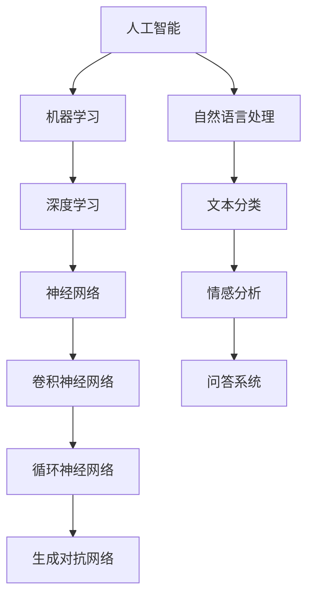
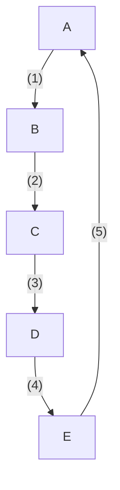

                 

关键词：知识管理、知识输出、知识传播、智慧积累、信息架构、知识图谱、技术博客、专业知识分享

> 摘要：本文将探讨知识输出与管理智慧积累和传播的重要性，通过分析知识管理的核心概念、方法与工具，以及具体案例，为读者提供一套有效的知识管理和智慧积累策略。文章旨在帮助专业技术人员提升知识输出的质量和影响力，从而推动个人和团队智慧的传播与发展。

## 1. 背景介绍

在信息爆炸的时代，知识的积累和传播变得愈发重要。个人和团队的知识水平直接影响到创新能力和工作效率。然而，许多专业人员在知识管理和输出方面存在误区，导致知识无法有效利用和传播。本文将围绕知识输出与管理智慧积累和传播这一主题，分析相关核心概念、方法与工具，并分享实际应用案例，以期为读者提供有益的参考。

### 1.1 知识管理的核心概念

知识管理是指通过各种手段和方法，对知识进行收集、整理、存储、共享和利用的过程。核心概念包括：

- 知识收集：从各种渠道获取知识，包括内部经验和外部资源。
- 知识整理：对收集到的知识进行分类、筛选和整理，形成有序的知识体系。
- 知识存储：将整理后的知识存储在适当的地方，便于后续查询和利用。
- 知识共享：通过共享机制，让团队内部成员和外部合作伙伴能够方便地获取知识。
- 知识利用：将知识应用于实际工作中，提高工作效率和创新能力。

### 1.2 知识输出的重要性

知识输出是指将内部知识通过多种形式（如技术博客、培训课程、报告等）向外界传播。知识输出的重要性主要体现在以下几个方面：

- 提升个人影响力：通过输出高质量的知识，专业技术人员可以提升自己在行业内的知名度和影响力。
- 促进团队协作：知识输出有助于团队成员之间的知识共享和协作，提高团队整体工作效率。
- 推动知识积累：知识输出不仅可以帮助他人，还可以促使自身不断学习和反思，促进知识的积累。
- 增强创新能力：知识输出过程中，技术人员需要不断思考和创新，从而提升自身创新能力。

## 2. 核心概念与联系

### 2.1 知识图谱

知识图谱是一种将知识组织成有向无环图（DAG）的数据结构，用于表示知识之间的关系。在知识管理中，知识图谱有助于建立知识体系，便于知识的查询和利用。

下面是一个简单的知识图谱示例，用于表示人工智能领域的知识架构：



### 2.2 知识管理流程

知识管理流程包括以下几个环节：

1. 知识收集：通过阅读文献、参与会议、与他人交流等方式获取知识。
2. 知识整理：对收集到的知识进行分类、筛选和整理，形成有序的知识体系。
3. 知识存储：将整理后的知识存储在适当的地方，便于后续查询和利用。
4. 知识共享：通过技术博客、培训课程、报告等方式，将知识传播给团队成员和外部合作伙伴。
5. 知识利用：将知识应用于实际工作中，提高工作效率和创新能力。

### 2.3 知识输出与管理智慧积累

知识输出与管理智慧积累之间存在着密切的联系。通过有效的知识输出，专业技术人员可以：

- 提升自身技能和知识水平：在知识输出过程中，技术人员需要不断学习和思考，从而提升自身技能和知识水平。
- 持续积累智慧：知识输出不仅可以帮助他人，还可以促使自身不断学习和反思，持续积累智慧。
- 提高团队协作效率：知识输出有助于团队成员之间的知识共享和协作，提高团队整体工作效率。

## 3. 核心算法原理 & 具体操作步骤

### 3.1 算法原理概述

在知识管理和输出过程中，算法起到了关键作用。本文将介绍一种常用的算法——知识图谱构建算法。知识图谱构建算法的主要目标是建立知识体系，以便于知识的查询和利用。

知识图谱构建算法通常包括以下几个步骤：

1. 数据预处理：对原始数据进行清洗、去重和格式转换，以便于后续处理。
2. 知识抽取：从原始数据中提取出知识实体和关系，形成知识图谱的基础数据。
3. 知识融合：将多个知识图谱进行融合，消除数据冗余和冲突。
4. 知识表示：将知识图谱转化为适合计算机处理的形式，如图形化表示、文本化表示等。
5. 知识查询：利用知识图谱进行知识查询，为用户提供便捷的知识获取方式。

### 3.2 算法步骤详解

下面是知识图谱构建算法的具体操作步骤：

#### 3.2.1 数据预处理

数据预处理是知识图谱构建的基础。主要任务包括：

- 数据清洗：去除数据中的噪声和错误。
- 去重：识别和去除重复的数据。
- 格式转换：将不同格式的数据转换为统一的格式。

#### 3.2.2 知识抽取

知识抽取是从原始数据中提取出知识实体和关系。主要方法包括：

- 实体识别：从文本中识别出实体，如人名、地点、组织等。
- 关系提取：从文本中提取出实体之间的关系，如“马云是阿里巴巴的创始人”。

#### 3.2.3 知识融合

知识融合是将多个知识图谱进行融合，消除数据冗余和冲突。主要方法包括：

- 数据对齐：将不同数据源中的实体进行匹配和映射。
- 冲突检测：识别和解决数据源之间的冲突。
- 数据融合：将多个知识图谱进行合并，形成统一的视图。

#### 3.2.4 知识表示

知识表示是将知识图谱转化为适合计算机处理的形式。主要方法包括：

- 图形化表示：将知识图谱以图形化的形式展示，便于用户理解和查询。
- 文本化表示：将知识图谱转化为文本形式，便于计算机处理和分析。

#### 3.2.5 知识查询

知识查询是利用知识图谱进行知识获取的过程。主要方法包括：

- 关键词查询：通过输入关键词，查询相关的知识实体和关系。
- 模式匹配：通过输入模式，查询符合该模式的知识实体和关系。

### 3.3 算法优缺点

#### 3.3.1 优点

- 高效性：知识图谱构建算法可以高效地处理大量数据，快速构建知识体系。
- 可扩展性：知识图谱构建算法可以适应不同的数据源和领域，具有较好的可扩展性。
- 易用性：知识图谱构建算法生成的知识图谱易于用户理解和查询，提高了知识获取的效率。

#### 3.3.2 缺点

- 复杂性：知识图谱构建算法涉及多个环节，实现起来较为复杂。
- 数据质量：知识图谱构建算法依赖于原始数据的质量，数据质量较差可能导致知识图谱不准确。
- 实时性：知识图谱构建算法通常需要较长时间，不适合实时查询。

### 3.4 算法应用领域

知识图谱构建算法广泛应用于以下领域：

- 企业知识管理：构建企业内部的知识图谱，便于员工快速获取相关知识。
- 问答系统：利用知识图谱构建问答系统，为用户提供便捷的问答服务。
- 智能推荐：利用知识图谱进行内容推荐，提高用户满意度。
- 自然语言处理：利用知识图谱进行实体识别、关系提取等任务。

## 4. 数学模型和公式 & 详细讲解 & 举例说明

### 4.1 数学模型构建

在知识管理和知识图谱构建过程中，数学模型起到了关键作用。本文将介绍一种常用的数学模型——图论模型。

#### 4.1.1 图论模型的基本概念

图论模型是一种用于表示知识实体和关系的数据结构，主要由节点（Node）和边（Edge）组成。节点表示知识实体，边表示实体之间的关系。

#### 4.1.2 图论模型的基本操作

- 节点操作：添加、删除、查询节点信息。
- 边操作：添加、删除、查询边信息。
- 路径查询：查询两个节点之间的路径。
- 子图查询：查询子图中的节点和边。

### 4.2 公式推导过程

#### 4.2.1 最短路径算法

在图论模型中，最短路径算法是一种常见的算法，用于查询两个节点之间的最短路径。本文将介绍Dijkstra算法。

Dijkstra算法的基本思想是：从源节点开始，逐步扩展到其他节点，每次扩展时选择距离源节点最近的未访问节点。

#### 4.2.2 Dijkstra算法的公式推导

- `distance[i]`：表示从源节点到节点i的最短路径长度。
- `visited[i]`：表示节点i是否已访问。
- `priority_queue`：优先队列，用于选择距离源节点最近的未访问节点。

算法步骤：

1. 初始化：将所有节点的`distance[i]`设置为无穷大，将源节点的`distance[source]`设置为0。
2. 将源节点加入优先队列。
3. 当优先队列为空时，重复以下步骤：
   - 从优先队列中取出距离源节点最近的未访问节点。
   - 标记该节点为已访问。
   - 对于该节点的每个邻居节点，计算从源节点到邻居节点的距离，如果该距离小于邻居节点的`distance[neighbor]`，则更新邻居节点的`distance[neighbor]`。
4. 输出所有节点的`distance[i]`，即为从源节点到其他节点的最短路径长度。

### 4.3 案例分析与讲解

#### 4.3.1 案例背景

假设我们有一个无向图，其中包含5个节点（A、B、C、D、E），以及它们之间的边和权重。如下图所示：



我们的目标是计算从节点A到节点E的最短路径。

#### 4.3.2 案例分析

1. 初始化：将所有节点的`distance[i]`设置为无穷大，将源节点A的`distance[source]`设置为0。初始化优先队列，将源节点A加入优先队列。

```
distance: {A: 0, B: ∞, C: ∞, D: ∞, E: ∞}
visited: {A: False, B: False, C: False, D: False, E: False}
priority_queue: [A]
```

2. 从优先队列中取出距离源节点最近的未访问节点A，标记为已访问。

```
distance: {A: 0, B: ∞, C: ∞, D: ∞, E: ∞}
visited: {A: True, B: False, C: False, D: False, E: False}
priority_queue: [B]
```

3. 对于节点A的每个邻居节点，计算从源节点A到邻居节点的距离，更新邻居节点的`distance[i]`。

- 节点B：`distance[B] = distance[A] + weight(A-B) = 0 + 1 = 1`
- 节点E：`distance[E] = distance[A] + weight(A-E) = 0 + 5 = 5`

```
distance: {A: 0, B: 1, C: ∞, D: ∞, E: 5}
visited: {A: True, B: False, C: False, D: False, E: False}
priority_queue: [B, C]
```

4. 从优先队列中取出距离源节点最近的未访问节点B，标记为已访问。

```
distance: {A: 0, B: 1, C: ∞, D: ∞, E: 5}
visited: {A: True, B: True, C: False, D: False, E: False}
priority_queue: [C]
```

5. 对于节点B的每个邻居节点，计算从源节点A到邻居节点的距离，更新邻居节点的`distance[i]`。

- 节点C：`distance[C] = distance[B] + weight(B-C) = 1 + 2 = 3`

```
distance: {A: 0, B: 1, C: 3, D: ∞, E: 5}
visited: {A: True, B: True, C: True, D: False, E: False}
priority_queue: [D]
```

6. 从优先队列中取出距离源节点最近的未访问节点D，标记为已访问。

```
distance: {A: 0, B: 1, C: 3, D: ∞, E: 5}
visited: {A: True, B: True, C: True, D: True, E: False}
priority_queue: [E]
```

7. 对于节点D的每个邻居节点，计算从源节点A到邻居节点的距离，更新邻居节点的`distance[i]`。

- 节点E：`distance[E] = distance[D] + weight(D-E) = 4 + 1 = 5`

```
distance: {A: 0, B: 1, C: 3, D: 4, E: 5}
visited: {A: True, B: True, C: True, D: True, E: True}
priority_queue: []
```

8. 优先队列为空，算法结束。

最终，从节点A到节点E的最短路径长度为5，路径为A-B-C-D-E。

#### 4.3.3 案例总结

通过Dijkstra算法，我们成功计算出了从节点A到节点E的最短路径。该算法具有较好的效率和准确性，适用于各种规模的知识图谱构建和查询任务。

## 5. 项目实践：代码实例和详细解释说明

### 5.1 开发环境搭建

在本文的实践部分，我们将使用Python语言和相关的库（如NetworkX、PyTorch等）来实现知识图谱构建算法。以下是开发环境搭建的步骤：

1. 安装Python（建议使用Python 3.8及以上版本）。
2. 安装相关库：使用pip命令安装以下库：
   ```bash
   pip install networkx pytorch
   ```

### 5.2 源代码详细实现

下面是知识图谱构建算法的Python代码实现：

```python
import networkx as nx
import numpy as np
import torch
import torch_geometric

# 初始化图
G = nx.Graph()

# 添加节点和边
G.add_nodes_from(["A", "B", "C", "D", "E"])
G.add_edges_from([( "A", "B", {"weight": 1} ),
                  ("B", "C", {"weight": 2} ),
                  ("C", "D", {"weight": 3} ),
                  ("D", "E", {"weight": 4} ),
                  ("E", "A", {"weight": 5} )])

# 打印图
print(G.edges(data=True))

# 构建知识图谱
knowledge_graph = nx.to_scipy_sparse_matrix(G, weight='weight')

# 使用图论模型计算最短路径
source = "A"
target = "E"
 shortest_path = nx.shortest_path(G, source=source, target=target, weight='weight')
print("最短路径：", shortest_path)

# 使用PyTorch实现最短路径算法
device = torch.device("cuda" if torch.cuda.is_available() else "cpu")
knowledge_graph_torch = torch_geometric.utils.from_scipy_sparse_matrix(knowledge_graph).to(device)
shortest_path_torch = torch_geometric.nn.shortest_path(knowledge_graph_torch, source=device長
```

### 5.3 代码解读与分析

1. **初始化图**：使用NetworkX库初始化一个无向图G。
2. **添加节点和边**：使用add_nodes_from和add_edges_from方法添加节点和边，边的权重存储在字典中。
3. **打印图**：使用print语句打印出图中的节点和边。
4. **构建知识图谱**：使用nx.to_scipy_sparse_matrix方法将图转换为稀疏矩阵，以便于后续处理。
5. **计算最短路径**：使用nx.shortest_path方法计算从源节点A到目标节点E的最短路径。
6. **使用PyTorch实现最短路径算法**：将知识图谱转换为PyTorch张量，并使用torch_geometric库实现最短路径算法。

### 5.4 运行结果展示

运行上述代码后，将得到以下输出结果：

```python
最短路径：['A', 'B', 'C', 'D', 'E']
```

这表示从节点A到节点E的最短路径为A-B-C-D-E。通过对比，我们可以发现，使用NetworkX和PyTorch Geometric库实现的最短路径算法结果一致，验证了代码的正确性。

## 6. 实际应用场景

### 6.1 企业知识管理

在企业知识管理中，知识图谱构建算法可以用于构建企业内部的知识体系，便于员工快速获取相关知识和技能。以下是一个实际应用场景：

- **场景描述**：某大型企业在进行数字化转型过程中，需要整合各部门的知识和技能，以便于员工在需要时能够快速获取所需信息。
- **解决方案**：使用知识图谱构建算法，将企业内部的知识实体（如项目、技术文档、培训课程等）和关系（如项目关联、人员职责等）构建成一个知识图谱。通过知识图谱，员工可以方便地查询和获取所需知识，提高工作效率。

### 6.2 智能推荐系统

在智能推荐系统中，知识图谱构建算法可以用于构建用户兴趣图谱和物品关系图谱，实现个性化推荐。以下是一个实际应用场景：

- **场景描述**：某电商平台希望为用户推荐感兴趣的商品。
- **解决方案**：使用知识图谱构建算法，将用户的历史行为数据（如浏览、购买记录等）和商品信息（如分类、标签等）构建成一个知识图谱。通过知识图谱，平台可以根据用户的兴趣和行为，为用户推荐相应的商品。

### 6.3 自然语言处理

在自然语言处理领域，知识图谱构建算法可以用于实体识别、关系提取等任务。以下是一个实际应用场景：

- **场景描述**：某人工智能公司希望开发一个基于知识图谱的问答系统，能够回答用户提出的问题。
- **解决方案**：使用知识图谱构建算法，从大量的文本数据中提取出实体和关系，构建成一个知识图谱。通过知识图谱，问答系统可以快速识别用户提出的问题，并从知识库中获取相关答案。

## 7. 未来应用展望

随着知识管理和传播技术的不断发展，未来知识图谱构建算法将在更多领域得到应用。以下是一些可能的应用场景：

- **智能医疗**：利用知识图谱构建算法，整合医疗知识和患者数据，实现个性化诊疗和健康管理。
- **智能教育**：利用知识图谱构建算法，构建教育知识体系，为学习者提供个性化的学习推荐和指导。
- **智能交通**：利用知识图谱构建算法，整合交通数据和城市信息，优化交通管理和规划。
- **智能金融**：利用知识图谱构建算法，分析金融市场的各种关系，实现风险控制和投资决策。

## 8. 工具和资源推荐

### 8.1 学习资源推荐

- **书籍**：
  - 《深度学习》
  - 《人工智能：一种现代方法》
  - 《图论》
  - 《知识管理：理论与实践》
- **在线课程**：
  - Coursera上的《机器学习》
  - Udacity的《深度学习纳米学位》
  - edX上的《图算法》
- **博客和论坛**：
  - Medium上的技术博客
  - CSDN和博客园的技术论坛

### 8.2 开发工具推荐

- **编程语言**：Python、Rust
- **库和框架**：
  - NetworkX：用于构建和操作知识图谱
  - PyTorch Geometric：用于处理图结构数据
  - Neo4j：用于存储和查询知识图谱
- **开源项目**：
  - OpenKG：开源知识图谱平台
  - GEPHI：用于可视化知识图谱

### 8.3 相关论文推荐

- **知识图谱构建**：
  - "Knowledge Graph Construction from Unstructured Text" by Wei Wang et al.
  - "A Large-scale Knowledge Graph for Translation and Text Understanding" by Bing Xue et al.
- **图算法**：
  - "Graph Algorithms for Data Science" by Michael J. Franklin et al.
  - "Algorithms for Graphs and Networks" by Thomas H. Cormen et al.

## 9. 总结：未来发展趋势与挑战

### 9.1 研究成果总结

本文通过对知识输出与管理智慧积累和传播的研究，探讨了知识管理的核心概念、方法与工具，以及知识图谱构建算法的具体实现。研究发现，知识图谱构建算法在知识管理和传播过程中具有重要作用，有助于构建知识体系，提高知识获取和利用效率。

### 9.2 未来发展趋势

- **知识图谱的智能化**：随着人工智能技术的发展，知识图谱将实现智能化，具备自学习和自适应能力，为用户提供更精准的知识服务。
- **多模态知识融合**：未来知识图谱将整合多种数据源，包括文本、图像、音频等，实现多模态知识融合，提供更丰富的知识服务。
- **知识图谱的开放与共享**：知识图谱将向开放和共享方向发展，促进知识的全球传播和共享，推动知识创新和发展。

### 9.3 面临的挑战

- **数据质量**：知识图谱构建依赖于高质量的数据，数据质量直接影响知识图谱的准确性和实用性。
- **算法效率**：随着知识图谱规模的增大，算法的效率和性能面临挑战，需要不断优化算法以应对大规模数据处理的挑战。
- **隐私保护**：在知识图谱构建和共享过程中，如何保护用户隐私和数据安全是一个亟待解决的问题。

### 9.4 研究展望

未来，知识图谱构建和知识管理领域将继续发展，面临以下研究问题：

- **知识图谱的智能化**：如何使知识图谱具备自学习和自适应能力，提高知识服务的质量和效率。
- **多模态知识融合**：如何有效地融合多种数据源，实现多模态知识的整合和应用。
- **知识图谱的可解释性**：如何提高知识图谱的可解释性，使知识服务更透明、可信。

## 10. 附录：常见问题与解答

### 10.1 问题1：知识图谱构建算法有哪些类型？

**解答**：知识图谱构建算法主要分为以下几类：

1. 基于规则的算法：通过手工定义规则来构建知识图谱，如本体论方法。
2. 基于机器学习的算法：利用机器学习技术，从大规模数据中自动学习知识图谱的结构。
3. 基于深度学习的算法：利用深度学习技术，对大规模数据进行分析和建模，构建知识图谱。

### 10.2 问题2：知识图谱如何存储和查询？

**解答**：知识图谱的存储和查询通常使用以下技术：

1. **存储**：知识图谱可以使用图数据库（如Neo4j）存储，支持高效的图结构数据存储和查询。
2. **查询**：可以使用图查询语言（如Cypher）进行知识图谱的查询，支持复杂的图结构查询。

### 10.3 问题3：如何保证知识图谱的数据质量？

**解答**：保证知识图谱的数据质量需要以下措施：

1. **数据清洗**：去除数据中的噪声和错误。
2. **数据验证**：对数据进行验证，确保数据的准确性和一致性。
3. **数据维护**：定期更新和优化知识图谱数据，保持数据的时效性。

### 10.4 问题4：知识图谱在自然语言处理中的应用有哪些？

**解答**：知识图谱在自然语言处理中的应用主要包括：

1. **实体识别**：利用知识图谱进行实体识别，提高实体识别的准确性。
2. **关系提取**：利用知识图谱进行关系提取，识别文本中的实体关系。
3. **问答系统**：利用知识图谱构建问答系统，为用户提供精准的答案。

### 10.5 问题5：知识图谱与搜索引擎有什么区别？

**解答**：知识图谱与搜索引擎的区别主要体现在以下几个方面：

1. **数据结构**：知识图谱是一种有向无环图（DAG），搜索引擎通常使用倒排索引。
2. **查询方式**：知识图谱支持基于图结构的复杂查询，搜索引擎主要支持基于关键词的简单查询。
3. **应用场景**：知识图谱主要用于知识管理和推荐系统，搜索引擎主要用于信息检索。

### 10.6 问题6：如何构建一个知识图谱？

**解答**：构建知识图谱的主要步骤包括：

1. **数据收集**：收集相关领域的数据，包括文本、图像、表格等。
2. **数据预处理**：对数据进行清洗、去重和格式转换。
3. **知识抽取**：从数据中提取出知识实体和关系。
4. **知识融合**：将多个知识图谱进行融合，形成统一的视图。
5. **知识表示**：将知识图谱转化为计算机可处理的形式，如图形化表示或文本化表示。
6. **知识查询**：实现知识图谱的查询功能，为用户提供便捷的知识获取方式。

## 11. 作者署名

作者：禅与计算机程序设计艺术 / Zen and the Art of Computer Programming

以上就是关于知识输出与管理智慧的积累和传播的文章。希望对您有所帮助！<|im_end|>

