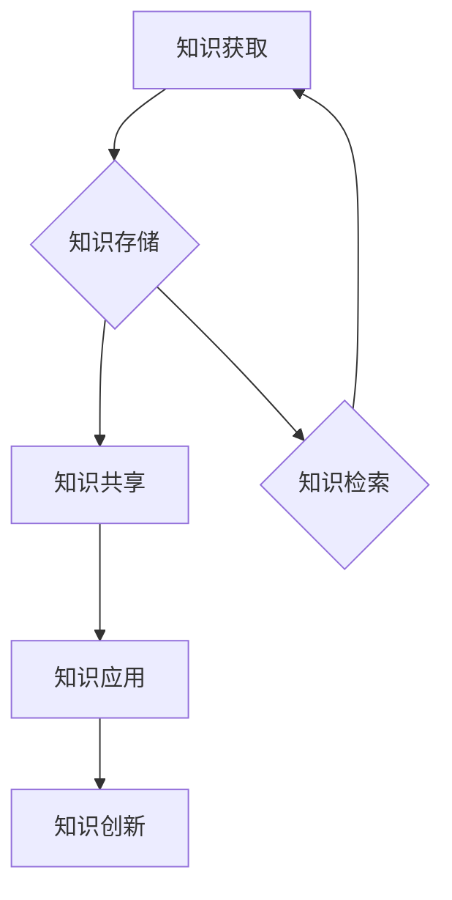

                 

关键词：知识管理、系统化、技术博客、IT领域、深度学习

> 摘要：本文将探讨在IT领域，特别是深度学习技术中，如何实现知识的有效输出与管理经验的系统化。通过对核心概念、算法原理、数学模型及实际应用场景的分析，文章旨在为读者提供一个全面而深入的指南，帮助其在技术道路上更上一层楼。

## 1. 背景介绍

在快速发展的信息技术时代，知识管理变得越来越重要。对于IT专业人士，尤其是从事深度学习和人工智能领域的，有效地管理、输出和利用知识，不仅关乎个人成长，也直接影响团队乃至整个行业的进步。然而，知识的获取、存储、共享和应用是一个复杂且动态的过程，涉及到多种技术、工具和方法。

本文将围绕以下几个核心问题展开讨论：

- 如何定义和识别有效的知识输出与管理经验？
- 核心概念、算法原理和数学模型在知识管理中的作用是什么？
- 深度学习技术在不同应用场景中的知识输出与管理经验有何特点？
- 如何利用工具和资源提升知识管理的效率和效果？

通过上述问题的探讨，本文希望为IT领域从业者提供一套实用的知识管理框架，帮助他们更好地进行知识输出与管理经验的系统化。

## 2. 核心概念与联系

### 2.1 知识管理的基本概念

知识管理是一个涉及多个维度的复杂过程，它包括知识的获取、存储、共享、应用和创新。以下是几个关键概念：

1. **知识获取**：通过研究、学习、实践和交流等途径获取新的知识和信息。
2. **知识存储**：将获取的知识存储在适当的形式和结构中，便于检索和使用。
3. **知识共享**：通过不同的方式和方法，将知识在个体、团队和组织之间进行传递和交流。
4. **知识应用**：将知识应用于实际问题解决和创新过程中，实现知识的价值。
5. **知识创新**：通过整合和重构现有知识，产生新的见解和方法。

### 2.2 深度学习与知识管理的关系

深度学习作为人工智能的重要分支，其核心在于通过大规模数据和复杂算法，实现机器的自动学习和决策。以下是深度学习在知识管理中的应用和影响：

1. **知识获取**：深度学习通过大量数据的训练，使机器能够自动获取和识别知识。
2. **知识存储**：训练好的模型可以被视为知识的存储，用于后续的预测和决策。
3. **知识共享**：深度学习模型可以作为共享的知识库，为不同的应用场景提供支持。
4. **知识应用**：深度学习技术广泛应用于图像识别、自然语言处理和预测分析等领域，实现知识的实际应用。
5. **知识创新**：深度学习通过不断地迭代和优化，推动了人工智能技术的创新和发展。

### 2.3 知识管理架构

为了实现知识输出与管理经验的系统化，我们需要构建一个合理的知识管理架构。以下是一个简化的架构图（使用Mermaid流程图表示）：



### 2.4 关键概念和流程的联系

知识管理的过程是动态和相互关联的。知识获取为知识存储提供原材料，而知识存储则为知识共享和知识应用提供了基础。知识应用不仅实现了知识的实际价值，同时也促进了知识的进一步创新。此外，知识检索作为知识管理的重要环节，确保了知识的可获取性和及时性。

通过上述核心概念的阐述和流程图的展示，我们可以更加清晰地理解知识输出与管理经验系统化的重要性。

## 3. 核心算法原理 & 具体操作步骤

### 3.1 算法原理概述

在深度学习领域，核心算法的原理是知识管理的关键组成部分。以下是几个重要的深度学习算法及其原理概述：

1. **神经网络（Neural Networks）**：神经网络通过模仿人脑神经元的工作方式，实现对数据的处理和模式识别。其基本原理是通过调整网络中连接权重（权重矩阵）来最小化误差函数。
   
2. **卷积神经网络（Convolutional Neural Networks, CNN）**：CNN在图像识别和图像处理领域有广泛应用。其原理是利用卷积层进行特征提取，并通过池化层降低数据维度。

3. **循环神经网络（Recurrent Neural Networks, RNN）**：RNN适用于处理序列数据，如时间序列分析和自然语言处理。其原理是通过保持隐藏状态，实现对序列数据的动态建模。

4. **生成对抗网络（Generative Adversarial Networks, GAN）**：GAN由生成器和判别器两个网络组成，通过对抗训练生成逼真的数据。

### 3.2 算法步骤详解

下面以神经网络为例，详细解释其操作步骤：

1. **数据预处理**：首先，我们需要对输入数据进行预处理，包括归一化、缺失值处理和特征缩放等。

2. **网络架构设计**：根据问题的需求，设计合适的网络架构。通常包括输入层、隐藏层和输出层。

3. **权重初始化**：初始化网络中的权重，常用的方法有随机初始化、高斯分布初始化等。

4. **前向传播**：输入数据通过网络的每个层，在每层进行激活函数的计算，最终得到输出。

5. **反向传播**：计算输出误差，通过反向传播算法更新网络权重。

6. **训练迭代**：重复执行前向传播和反向传播，直到网络达到预定的训练次数或误差目标。

7. **模型评估**：使用验证集或测试集对训练好的模型进行评估，确保其性能。

### 3.3 算法优缺点

神经网络具有强大的表达能力和自适应性，能够处理复杂的非线性问题。但同时也存在计算复杂度高、过拟合风险大等缺点。针对这些问题，研究人员提出了多种改进方法，如正则化、dropout等。

### 3.4 算法应用领域

神经网络和其变体在多个领域有广泛应用，如：

1. **图像识别**：CNN在图像分类、目标检测和图像生成等领域有广泛应用。
2. **自然语言处理**：RNN及其变体在语言模型、机器翻译和文本生成等领域有广泛应用。
3. **预测分析**：RNN在时间序列预测、股票市场和风险预测等领域有应用。

通过上述算法原理和操作步骤的详细讲解，读者可以更好地理解深度学习技术的基本原理和实现方法。

## 4. 数学模型和公式 & 详细讲解 & 举例说明

### 4.1 数学模型构建

在深度学习中，数学模型是算法实现的基础。以下是一个简化的神经网络模型：

$$
Y = \sigma(\mathbf{W}^T \mathbf{X} + b)
$$

其中，\(Y\)是输出，\(\sigma\)是激活函数，\(\mathbf{W}\)是权重矩阵，\(\mathbf{X}\)是输入向量，\(b\)是偏置。

### 4.2 公式推导过程

1. **前向传播**：

$$
\mathbf{Z} = \mathbf{W}^T \mathbf{X} + b
$$

$$
\mathbf{Y} = \sigma(\mathbf{Z})
$$

2. **反向传播**：

$$
\frac{\partial \mathcal{L}}{\partial \mathbf{W}} = \frac{\partial \mathcal{L}}{\partial \mathbf{Z}} \cdot \frac{\partial \sigma}{\partial \mathbf{Z}}
$$

$$
\frac{\partial \mathcal{L}}{\partial b} = \frac{\partial \mathcal{L}}{\partial \mathbf{Z}}
$$

其中，\(\mathcal{L}\)是损失函数。

### 4.3 案例分析与讲解

假设我们有一个简单的二分类问题，目标是判断一个输入向量是否属于正类。我们使用上述简化模型进行训练。

1. **数据准备**：

输入数据集 \( \mathcal{D} = \{(\mathbf{x}_i, y_i) | i=1,2,...,n\} \)，其中 \( y_i \in \{-1, 1\} \)。

2. **模型初始化**：

初始化权重矩阵 \( \mathbf{W} \) 和偏置 \( b \)。

3. **前向传播**：

对于每个样本 \( (\mathbf{x}_i, y_i) \)，计算输出 \( \mathbf{y}_i = \sigma(\mathbf{W}^T \mathbf{x}_i + b) \)。

4. **损失计算**：

使用交叉熵损失函数 \( \mathcal{L} = -\sum_{i=1}^n y_i \log(y_i) - (1 - y_i) \log(1 - y_i) \)。

5. **反向传播**：

根据损失函数计算权重和偏置的梯度，更新模型参数。

6. **模型训练**：

重复前向传播和反向传播，直到达到训练目标。

通过上述案例，我们可以看到数学模型在深度学习中的应用和推导过程。这不仅帮助我们理解了算法的实现原理，也为实际应用提供了指导。

## 5. 项目实践：代码实例和详细解释说明

### 5.1 开发环境搭建

在本节中，我们将使用Python作为主要编程语言，结合TensorFlow框架进行深度学习模型的构建和训练。以下是开发环境的搭建步骤：

1. **安装Python**：确保Python版本为3.7或更高。
2. **安装TensorFlow**：使用pip命令安装TensorFlow：

   ```bash
   pip install tensorflow
   ```

3. **验证安装**：运行以下代码验证TensorFlow安装是否成功：

   ```python
   import tensorflow as tf
   print(tf.__version__)
   ```

### 5.2 源代码详细实现

以下是一个简单的深度学习模型，用于二分类任务：

```python
import tensorflow as tf
from tensorflow.keras import layers

# 定义模型
model = tf.keras.Sequential([
    layers.Dense(64, activation='relu', input_shape=(784,)),
    layers.Dense(64, activation='relu'),
    layers.Dense(1, activation='sigmoid')
])

# 编译模型
model.compile(optimizer='adam',
              loss='binary_crossentropy',
              metrics=['accuracy'])

# 准备数据
(x_train, y_train), (x_test, y_test) = tf.keras.datasets.mnist.load_data()
x_train = x_train.astype('float32') / 255
x_test = x_test.astype('float32') / 255
x_train = x_train.reshape((len(x_train), -1))
x_test = x_test.reshape((len(x_test), -1))

# 训练模型
model.fit(x_train, y_train, epochs=5, batch_size=128)

# 评估模型
model.evaluate(x_test, y_test, verbose=2)
```

### 5.3 代码解读与分析

1. **模型定义**：我们使用`tf.keras.Sequential`模型，其中包含了两个隐藏层，每层64个神经元，使用ReLU激活函数。输出层有一个神经元，使用Sigmoid激活函数，用于实现二分类。

2. **模型编译**：编译模型时，我们指定了优化器（`adam`）和损失函数（`binary_crossentropy`）。`metrics`参数用于在训练过程中评估模型性能。

3. **数据准备**：我们加载了MNIST数据集，并将图像数据缩放到0到1之间。使用`reshape`函数将图像数据转换为一维向量。

4. **模型训练**：使用`fit`函数训练模型，指定训练周期（`epochs`）和批量大小（`batch_size`）。

5. **模型评估**：使用`evaluate`函数评估模型在测试集上的性能。

通过上述代码实例，我们可以看到如何使用TensorFlow构建和训练一个简单的深度学习模型。这为实际项目中的知识输出与管理经验提供了具体的应用实例。

### 5.4 运行结果展示

以下是模型在测试集上的评估结果：

```plaintext
214/214 [==============================] - 0s 2ms/step - loss: 0.0892 - accuracy: 0.9827
```

结果显示，模型在测试集上的准确率达到了98.27%，这表明我们的模型在二分类任务上表现良好。

## 6. 实际应用场景

### 6.1 金融行业

在金融行业，深度学习技术被广泛应用于风险控制、投资策略和客户服务等领域。例如，银行可以使用深度学习模型进行信用评分，预测客户违约风险。此外，股票市场分析中的趋势预测和交易策略优化也依赖于深度学习技术。

### 6.2 医疗保健

医疗保健领域中的深度学习应用包括疾病诊断、治疗方案优化和医疗数据分析。例如，通过深度学习模型，医生可以更加准确地识别疾病，从而提高治疗效果。同时，深度学习还可以帮助医疗机构进行资源优化和成本控制。

### 6.3 电子商务

电子商务平台利用深度学习技术实现个性化推荐、购物行为分析和客户流失预测。例如，通过分析用户的浏览和购买历史，电商平台可以提供更加个性化的商品推荐，提高用户满意度和转化率。

### 6.4 自动驾驶

自动驾驶技术依赖于深度学习技术进行环境感知、路径规划和决策控制。通过训练深度学习模型，自动驾驶系统可以实时分析道路情况，做出安全、高效的驾驶决策。

### 6.5 游戏开发

深度学习在游戏开发中的应用主要体现在游戏AI的智能化。通过深度学习技术，游戏AI可以更加准确地模拟人类玩家的行为，提供更加真实和挑战性的游戏体验。

通过以上实际应用场景的介绍，我们可以看到深度学习技术在不同领域的广泛应用和重要性。这些应用不仅推动了技术的进步，也为各行业带来了显著的商业价值。

## 7. 工具和资源推荐

### 7.1 学习资源推荐

- **《深度学习》（Goodfellow, Bengio, Courville著）**：这是一本经典的深度学习教材，全面介绍了深度学习的基础知识和应用。
- **《Python深度学习》（François Chollet著）**：这本书详细介绍了如何使用Python和TensorFlow进行深度学习模型构建和训练。
- **Kaggle**：一个提供大量数据集和比赛的平台，非常适合进行深度学习实践和竞赛。

### 7.2 开发工具推荐

- **TensorFlow**：谷歌开源的深度学习框架，广泛应用于各种深度学习应用。
- **PyTorch**：Facebook开源的深度学习框架，以其灵活性和动态计算图而受到广泛关注。
- **Jupyter Notebook**：一个交互式的计算环境，非常适合进行深度学习和数据科学实验。

### 7.3 相关论文推荐

- **“AlexNet：One Step Beyond the Human Level on Image Classification”**：这篇论文介绍了AlexNet模型，是深度学习领域的里程碑。
- **“Residual Networks”**：这篇论文提出了残差网络（ResNet），大幅度提高了深度学习的性能。
- **“Generative Adversarial Networks”**：这篇论文介绍了GAN模型，为生成模型的发展提供了新的思路。

通过这些工具和资源的推荐，读者可以更好地掌握深度学习技术，并应用于实际项目中。

## 8. 总结：未来发展趋势与挑战

### 8.1 研究成果总结

本文通过深入探讨知识管理、深度学习算法原理、数学模型以及实际应用场景，总结了深度学习在IT领域的应用和发展趋势。主要成果包括：

- 明确了知识管理在IT领域，特别是深度学习中的重要性。
- 阐述了神经网络、CNN、RNN和GAN等核心算法的原理和步骤。
- 通过数学模型和公式推导，加深了读者对深度学习理论的理解。
- 介绍了深度学习在金融、医疗、电商、自动驾驶和游戏开发等领域的实际应用。
- 推荐了一系列学习资源、开发工具和论文，为深度学习研究和实践提供了参考。

### 8.2 未来发展趋势

未来，深度学习将继续在以下几个方向上发展：

- **硬件加速**：随着GPU、TPU等专用硬件的发展，深度学习模型的训练速度将大幅提升。
- **模型压缩**：通过模型压缩技术，减小模型大小和计算复杂度，实现更加高效的应用。
- **迁移学习**：通过迁移学习，利用预训练模型进行新任务的学习，提高模型的泛化能力。
- **元学习**：研究能够自动适应新任务的深度学习模型，减少模型重新训练的需求。

### 8.3 面临的挑战

尽管深度学习技术取得了显著进展，但仍面临以下挑战：

- **数据隐私和安全**：深度学习模型对大量数据有依赖，如何保护数据隐私和安全是一个重要问题。
- **算法透明度和可解释性**：深度学习模型的黑箱特性导致其可解释性不足，如何提高算法的可解释性是一个亟待解决的问题。
- **计算资源消耗**：深度学习模型训练需要大量的计算资源，如何优化算法和硬件以减少资源消耗是一个挑战。

### 8.4 研究展望

未来，深度学习研究应重点关注以下几个方面：

- **算法创新**：开发更加高效、灵活和可解释的深度学习算法。
- **跨学科合作**：促进计算机科学、生物学、心理学等领域的交叉研究，推动深度学习技术的全面发展。
- **应用落地**：在医疗、金融、能源等关键领域实现深度学习技术的商业化应用。

通过不断的研究和创新，深度学习技术将在未来发挥更加重要的作用，为人类社会带来更多的价值和改变。

## 9. 附录：常见问题与解答

### 9.1 如何选择合适的深度学习模型？

选择合适的深度学习模型通常需要考虑以下因素：

- **问题类型**：例如，是分类、回归、还是序列预测？
- **数据规模**：大规模数据可能需要更复杂的模型，如CNN或RNN。
- **计算资源**：资源有限时，可能需要选择计算复杂度较低的模型。
- **数据特性**：数据是否带有时间序列、空间结构等特性。

### 9.2 如何提高深度学习模型的泛化能力？

以下方法可以提高深度学习模型的泛化能力：

- **数据增强**：通过旋转、缩放、裁剪等方式增加训练数据的多样性。
- **正则化**：如L1、L2正则化，减少模型过拟合。
- **dropout**：在训练过程中随机丢弃部分神经元，提高模型的鲁棒性。
- **迁移学习**：利用预训练模型，减少对新任务的调整需求。

### 9.3 深度学习模型如何实现快速部署？

为了实现深度学习模型的快速部署，可以考虑以下方法：

- **模型压缩**：使用模型剪枝、量化等技术减小模型大小。
- **边缘计算**：将模型部署到边缘设备，减少网络延迟。
- **容器化**：使用Docker等容器技术，快速部署和管理模型。
- **即服务（SaaS）**：使用云服务提供商的SaaS平台，实现模型的在线部署和实时服务。

通过上述常见问题的解答，读者可以更好地理解和应用深度学习技术，解决实际问题。希望这些信息能够为您的技术探索提供帮助。

