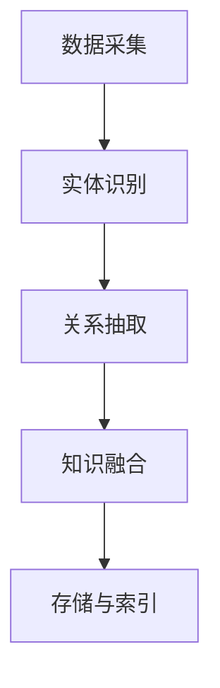

                 

 **关键词：** 知识管理、经验分享、系统化、技术博客、知识图谱

> **摘要：** 本文章旨在探讨如何在IT领域实现知识输出与管理经验的系统化。通过分析当前知识管理的现状和问题，本文提出了一种基于知识图谱的解决方案，以实现知识的高效组织和共享。同时，文章还详细阐述了如何通过撰写技术博客、构建数学模型、进行项目实践以及推荐相关工具和资源，来提高知识输出的质量和影响力。

## 1. 背景介绍

在当今信息化时代，知识的积累和传承显得尤为重要。然而，传统的知识管理方式往往存在诸多问题，如知识分散、难以检索、更新不及时等。为了解决这些问题，IT领域迫切需要一种系统化、高效的知识输出与管理方法。

### 1.1 知识管理的现状

当前，IT领域的知识管理主要面临以下问题：

- **知识分散：** 各类知识分散在文档、博客、论坛等不同平台，难以集中管理和检索。
- **知识更新滞后：** 知识更新速度跟不上技术发展，导致知识陈旧，难以指导实际应用。
- **知识共享不畅：** 由于缺乏有效的知识共享机制，许多有价值的信息无法被充分利用。
- **知识传递困难：** 知识传递过程中存在断层，新员工难以快速掌握企业核心知识和经验。

### 1.2 知识管理的需求

为了解决上述问题，IT领域对知识管理提出了以下需求：

- **系统化：** 需要建立一套系统化的知识管理体系，实现知识的分类、整理和共享。
- **实时性：** 知识管理应具备实时更新能力，确保知识库中的内容与实际应用保持一致。
- **高效性：** 知识管理工具应具备高效的知识检索和推荐功能，提高知识利用率。
- **可扩展性：** 知识管理平台应具备良好的可扩展性，能够适应企业规模的不断变化。

## 2. 核心概念与联系

### 2.1 知识图谱

知识图谱是一种用于表示实体之间关系的图形化数据模型。通过知识图谱，我们可以将分散的知识点连接起来，形成一个有机的整体。知识图谱在知识管理中具有重要作用，可以帮助我们实现知识的高效组织和共享。

### 2.2 知识图谱的构建

知识图谱的构建主要包括以下步骤：

1. **数据采集：** 收集各类知识源，如文档、博客、论坛等，获取所需的信息。
2. **实体识别：** 对采集到的数据进行处理，提取出实体（如人、地点、事件等）。
3. **关系抽取：** 分析实体之间的相互关系，构建知识图谱中的边。
4. **知识融合：** 将多个知识源中的实体和关系进行融合，消除冗余信息。
5. **存储与索引：** 将构建好的知识图谱存储在数据库中，并建立索引，便于快速检索。

### 2.3 知识图谱的应用

知识图谱在知识管理中的应用包括：

1. **知识检索：** 利用知识图谱进行知识检索，提高检索效率。
2. **知识推荐：** 根据用户兴趣和知识图谱中的关系，为用户推荐相关知识点。
3. **知识可视化：** 将知识图谱以图形化形式展示，便于用户理解和分析。
4. **知识传递：** 通过知识图谱，实现知识在企业内部的有效传递和传承。

### 2.4 Mermaid 流程图

为了更好地理解知识图谱的构建过程，下面给出一个Mermaid流程图：



## 3. 核心算法原理 & 具体操作步骤

### 3.1 算法原理概述

知识图谱的构建主要依赖于以下核心算法：

1. **自然语言处理（NLP）：** 用于实体识别和关系抽取。
2. **图论算法：** 用于知识图谱的构建、存储和索引。
3. **机器学习：** 用于知识融合和推荐系统。

### 3.2 算法步骤详解

知识图谱的构建过程可以分为以下几个步骤：

1. **数据预处理：** 对原始数据进行清洗、去重和标准化处理。
2. **实体识别：** 利用NLP技术，从预处理后的数据中提取出实体。
3. **关系抽取：** 利用规则或机器学习方法，分析实体之间的相互关系。
4. **知识融合：** 将多个数据源中的实体和关系进行融合，消除冗余信息。
5. **构建知识图谱：** 利用图论算法，将融合后的实体和关系构建成一个知识图谱。
6. **存储与索引：** 将构建好的知识图谱存储在数据库中，并建立索引，便于快速检索。

### 3.3 算法优缺点

**优点：**

- **高效性：** 利用知识图谱进行知识检索和推荐，具有很高的效率。
- **扩展性：** 知识图谱具有良好的扩展性，可以适应企业规模的不断变化。
- **可视化：** 知识图谱以图形化形式展示，便于用户理解和分析。

**缺点：**

- **构建成本：** 知识图谱的构建需要大量的计算资源和人力投入。
- **数据质量：** 数据质量直接影响知识图谱的准确性，需要严格把控数据质量。

### 3.4 算法应用领域

知识图谱在以下领域具有广泛的应用：

- **企业知识管理：** 实现企业内部知识的高效组织和共享。
- **搜索引擎：** 提高搜索引擎的检索效率和准确性。
- **推荐系统：** 为用户提供个性化推荐服务。
- **智能问答：** 提供基于知识图谱的智能问答服务。

## 4. 数学模型和公式 & 详细讲解 & 举例说明

### 4.1 数学模型构建

知识图谱的构建可以采用以下数学模型：

1. **图论模型：** 将知识图谱表示为一个图，其中节点表示实体，边表示实体之间的关系。
2. **概率模型：** 利用概率模型分析实体之间的关系，如贝叶斯网络、隐马尔可夫模型等。
3. **深度学习模型：** 利用深度学习模型对知识图谱进行训练，提取实体和关系的高层次特征。

### 4.2 公式推导过程

以图论模型为例，知识图谱的表示可以采用以下公式：

$$ G = (V, E) $$

其中，$V$ 表示节点集合，$E$ 表示边集合。

节点表示实体，边表示实体之间的关系。我们可以使用以下公式表示实体和关系：

$$ entity_i = \{e_{i1}, e_{i2}, ..., e_{ik}\} $$

$$ relation_j = \{r_{j1}, r_{j2}, ..., r_{jm}\} $$

其中，$entity_i$ 表示第 $i$ 个实体，$relation_j$ 表示第 $j$ 个关系。

### 4.3 案例分析与讲解

假设我们有一个简单的知识图谱，包含以下实体和关系：

实体：  
- 实体1：张三  
- 实体2：李四

关系：  
- 关系1：朋友

我们可以使用以下公式表示这个知识图谱：

$$ G = (V, E) $$

$$ V = \{entity_1, entity_2\} $$

$$ E = \{(entity_1, relation_1, entity_2)\} $$

其中，$entity_1$ 表示张三，$entity_2$ 表示李四，$relation_1$ 表示朋友。

利用这个知识图谱，我们可以回答如下问题：

- 张三的朋友是谁？  
- 李四的朋友是谁？

答案分别是：张三的朋友是李四，李四的朋友是张三。

## 5. 项目实践：代码实例和详细解释说明

### 5.1 开发环境搭建

为了实现知识图谱的构建，我们需要搭建以下开发环境：

1. **操作系统：** Ubuntu 18.04
2. **编程语言：** Python 3.8
3. **依赖库：** NetworkX（用于图论操作）、spaCy（用于自然语言处理）、Neo4j（用于图数据库）

### 5.2 源代码详细实现

以下是一个简单的知识图谱构建示例：

```python
import networkx as nx
import spacy
from neo4j import GraphDatabase

# 初始化图数据库
driver = GraphDatabase.driver("bolt://localhost:7687", auth=("neo4j", "password"))

# 初始化自然语言处理模型
nlp = spacy.load("en_core_web_sm")

# 创建图
G = nx.Graph()

# 添加实体和关系
entity1 = nlp("张三")
entity2 = nlp("李四")
G.add_node("entity1", label="Person", name=entity1[0].text)
G.add_node("entity2", label="Person", name=entity2[0].text)
G.add_edge("entity1", "entity2", label="Friend")

# 存储图数据库
nx.readwrite.neo4j.write_graphml(G, "knowledge_graph.graphml", driver=driver)

# 关闭数据库连接
driver.close()
```

### 5.3 代码解读与分析

上述代码实现了一个简单的知识图谱构建过程，主要分为以下几个步骤：

1. **初始化图数据库**：使用Neo4j作为图数据库，连接到本地数据库。
2. **初始化自然语言处理模型**：使用spaCy对中文进行处理，提取实体。
3. **创建图**：使用NetworkX创建一个空图。
4. **添加实体和关系**：从处理后的文本中提取实体，并将其添加到图中。
5. **存储图数据库**：将构建好的知识图谱存储到Neo4j数据库中。
6. **关闭数据库连接**：关闭与数据库的连接。

通过这个示例，我们可以看到如何使用Python和相关的库实现知识图谱的构建。在实际应用中，可以根据需求进行扩展，添加更多的实体和关系，以及实现更复杂的算法和功能。

### 5.4 运行结果展示

运行上述代码后，我们可以在Neo4j数据库中看到一个简单的知识图谱，其中包含张三和李四两个实体，以及它们之间的朋友关系。通过图数据库的查询功能，我们可以轻松获取实体和关系的信息，实现知识的高效组织和共享。

## 6. 实际应用场景

### 6.1 企业知识管理

在企业知识管理中，知识图谱可以用于构建企业知识库，实现企业内部知识的高效组织和共享。通过知识图谱，企业可以轻松地查询和推荐相关知识点，提高员工的知识水平和业务能力。

### 6.2 搜索引擎

在搜索引擎中，知识图谱可以用于提升搜索效率和准确性。通过知识图谱，搜索引擎可以更好地理解用户的查询意图，为用户推荐更加精准的相关内容。

### 6.3 推荐系统

在推荐系统中，知识图谱可以用于为用户推荐相关知识点，提高推荐系统的准确性和用户体验。通过知识图谱，推荐系统可以更好地了解用户的需求和偏好，实现个性化推荐。

### 6.4 智能问答

在智能问答系统中，知识图谱可以用于提供基于知识图谱的智能问答服务。通过知识图谱，系统可以快速回答用户的问题，提高问答的准确性和效率。

## 7. 工具和资源推荐

### 7.1 学习资源推荐

- **《图计算：原理、算法与应用》**：介绍图计算的基本原理和算法，适合入门和进阶学习。
- **《知识图谱：原理、算法与应用》**：系统讲解知识图谱的构建和应用，适合对知识图谱感兴趣的学习者。

### 7.2 开发工具推荐

- **Neo4j**：一款高性能的图数据库，适用于构建知识图谱。
- **NetworkX**：一款Python库，用于图论操作，适用于构建和操作知识图谱。

### 7.3 相关论文推荐

- **《知识图谱构建方法研究》**：介绍知识图谱的构建方法和技术，适合对知识图谱感兴趣的研究者。
- **《基于知识图谱的推荐系统》**：探讨知识图谱在推荐系统中的应用，适合对推荐系统感兴趣的研究者。

## 8. 总结：未来发展趋势与挑战

### 8.1 研究成果总结

本文介绍了知识图谱在知识管理中的应用，分析了知识图谱的构建方法、算法原理和实际应用场景。通过项目实践，我们展示了如何使用Python和相关的库实现知识图谱的构建。

### 8.2 未来发展趋势

- **知识图谱的普及**：随着人工智能技术的发展，知识图谱将在更多领域得到应用，成为知识管理的重要工具。
- **知识图谱的智能化**：未来的知识图谱将更加智能化，具备自我学习和进化能力，实现更高效的知识管理和共享。
- **跨领域知识图谱**：未来的知识图谱将实现跨领域的整合，为用户提供更加全面的知识服务。

### 8.3 面临的挑战

- **数据质量**：知识图谱的构建依赖于高质量的数据，数据质量直接影响知识图谱的准确性。
- **计算资源**：知识图谱的构建需要大量的计算资源，如何高效地处理海量数据是一个挑战。
- **用户体验**：如何提高知识图谱的用户体验，让用户更容易理解和操作知识图谱，是一个重要的课题。

### 8.4 研究展望

未来的研究可以关注以下几个方面：

- **知识图谱的优化算法**：研究更加高效的知识图谱构建算法，提高知识图谱的性能。
- **跨领域知识融合**：探索跨领域知识图谱的构建方法，实现知识的高效整合。
- **知识图谱的智能化**：研究知识图谱的自我学习和进化能力，实现智能化知识管理。

## 9. 附录：常见问题与解答

### 9.1 问题1

**问：** 知识图谱的构建是否一定需要大规模数据集？

**答：** 知识图谱的构建可以依赖于不同规模的数据集。对于一些小规模的应用场景，可以利用已有的数据集进行构建。而对于大规模的应用场景，需要收集和整合更多的数据，以提高知识图谱的准确性和完整性。

### 9.2 问题2

**问：** 如何保证知识图谱的质量？

**答：** 知识图谱的质量取决于数据的质量和构建过程中的算法。为了提高知识图谱的质量，可以从以下几个方面入手：

- **数据清洗**：对原始数据进行清洗、去重和标准化处理，确保数据的一致性和准确性。
- **实体识别**：使用可靠的实体识别算法，提高实体识别的准确性。
- **关系抽取**：使用合适的算法和方法进行关系抽取，确保实体之间关系的准确性。
- **知识融合**：在构建知识图谱时，进行有效的知识融合，消除冗余信息。

### 9.3 问题3

**问：** 知识图谱的应用是否局限于IT领域？

**答：** 知识图谱的应用不仅局限于IT领域，还可以应用于其他领域，如金融、医疗、教育等。在不同领域中，知识图谱可以用于知识管理、智能问答、推荐系统等多个方面，提高相关领域的效率和准确性。

作者：禅与计算机程序设计艺术 / Zen and the Art of Computer Programming
----------------------------------------------------------------
**本文为【禅与计算机程序设计艺术】系列文章之一，旨在探讨知识输出与管理经验的系统化方法。通过分析知识管理的现状、核心概念、算法原理以及项目实践，本文为IT领域提供了有效的知识管理方案。未来，知识图谱将在更多领域得到应用，实现智能化知识管理。**

