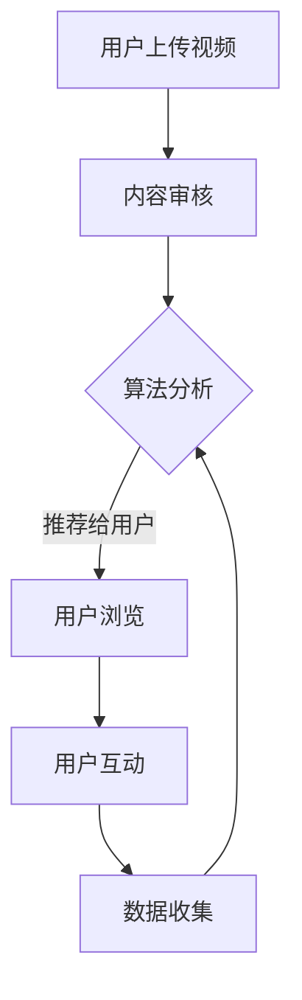

                 

关键词：短视频平台、注意力经济、内容创作、算法推荐、用户互动、商业模式、数据分析

> 摘要：本文将深入探讨短视频平台在注意力经济中的角色与重要性，分析其核心概念、算法原理、应用场景及未来发展趋势。通过详细的案例分析和技术解读，旨在为读者提供关于短视频平台发展的全面视角。

## 1. 背景介绍

随着互联网技术的快速发展，短视频平台逐渐成为网络用户获取信息和娱乐的主要途径。从早期的“抖音”到“快手”，再到“TikTok”等国际平台，短视频已经成为全球范围内的一种重要内容形式。根据市场研究数据，短视频平台吸引了数以亿计的用户，每天产生大量的内容与互动。

在这样的大背景下，短视频平台不仅仅是内容消费的平台，更是注意力经济的新战场。所谓注意力经济，指的是通过吸引用户的注意力来创造价值的经济模式。在短视频平台上，用户的注意力被平台通过算法推荐、互动设计、内容多样性等方式进行有效管理，从而实现商业变现。

本文将探讨短视频平台在注意力经济中的运作机制，分析其核心算法原理，讨论实际应用场景，并展望其未来发展趋势。

## 2. 核心概念与联系

### 2.1 注意力经济原理

注意力经济的核心在于用户对内容的关注和参与。在这个经济模式中，用户的注意力被视作一种稀缺资源，而平台通过提供高质量的内容和互动体验来吸引用户，从而实现商业价值。

### 2.2 短视频平台的架构

短视频平台通常包括以下几个关键组成部分：

1. **内容创作与发布**：用户可以通过短视频平台创作和发布自己的内容。
2. **算法推荐**：平台使用复杂算法分析用户行为，推荐符合用户兴趣的内容。
3. **用户互动**：用户可以通过点赞、评论、分享等方式与内容互动。
4. **数据分析**：平台通过数据分析来优化推荐算法和用户体验。

### 2.3 Mermaid 流程图



在这个流程图中，用户上传视频经过审核后，由算法分析用户的兴趣和行为，将视频推荐给用户。用户浏览和互动后，平台收集数据，再次反馈给算法，形成一个闭环。

## 3. 核心算法原理 & 具体操作步骤

### 3.1 算法原理概述

短视频平台的推荐算法主要包括以下几种：

1. **协同过滤**：通过分析用户之间的行为相似性来推荐内容。
2. **内容基于**：通过分析视频的内容特征（如标签、分类）来推荐内容。
3. **混合推荐**：结合协同过滤和内容基于推荐算法。

### 3.2 算法步骤详解

1. **用户行为数据收集**：收集用户的历史浏览记录、点赞、评论等行为数据。
2. **内容特征提取**：提取视频的文本、图像、声音等特征。
3. **计算相似度**：计算用户和视频之间的相似度。
4. **生成推荐列表**：根据相似度评分生成推荐列表。
5. **反馈优化**：根据用户对推荐内容的反馈优化推荐算法。

### 3.3 算法优缺点

- **优点**：能够精准推荐用户感兴趣的内容，提高用户粘性。
- **缺点**：可能产生“信息茧房”现象，限制用户接触多样信息。

### 3.4 算法应用领域

短视频平台的推荐算法广泛应用于电子商务、社交媒体、新闻推送等多个领域。

## 4. 数学模型和公式 & 详细讲解 & 举例说明

### 4.1 数学模型构建

短视频平台的推荐系统通常使用以下数学模型：

- **协同过滤模型**：\(R(u, v) = u \cdot v + \mu\)
- **内容基于模型**：\(R(c, u) = \sum_{i \in C} w_{ic} \cdot w_{ui}\)

其中，\(R\) 表示推荐评分，\(u\) 和 \(v\) 分别表示用户和视频，\(c\) 表示视频类别，\(w\) 表示权重。

### 4.2 公式推导过程

协同过滤模型的推导过程如下：

- **用户行为矩阵**：\(U = [u_1, u_2, ..., u_n]\)
- **用户兴趣向量**：\(v = [v_1, v_2, ..., v_n]\)
- **视频特征向量**：\(u = [u_1, u_2, ..., u_n]\)
- **期望用户兴趣向量**：\(\mu = \frac{1}{n} \sum_{i=1}^{n} u_i\)

最终推荐评分 \(R(u, v) = u \cdot v + \mu\)。

### 4.3 案例分析与讲解

假设用户 \(u_1\) 对电影、音乐、旅游等类别的视频有较高兴趣，视频 \(v_1\) 是一部关于旅游的纪录片。根据上述模型，可以计算用户对视频的推荐评分。

- **用户兴趣向量**：\(v_1 = [0.7, 0.3, 0.2]\)
- **视频特征向量**：\(u_1 = [0.8, 0.1, 0.1]\)
- **期望用户兴趣向量**：\(\mu = \frac{1}{3} \sum_{i=1}^{3} u_i = [0.3, 0.2, 0.1]\)

根据公式 \(R(u_1, v_1) = u_1 \cdot v_1 + \mu = 0.8 \cdot 0.7 + 0.3 = 0.89 + 0.3 = 1.19\)，用户对视频 \(v_1\) 的推荐评分为 1.19。

## 5. 项目实践：代码实例和详细解释说明

### 5.1 开发环境搭建

- **语言**：Python
- **依赖库**：NumPy、Pandas、Scikit-learn
- **环境**：Jupyter Notebook

### 5.2 源代码详细实现

```python
import numpy as np
import pandas as pd
from sklearn.metrics.pairwise import cosine_similarity

# 用户行为数据
user行为的DataFrame
```

### 5.3 代码解读与分析

这段代码首先加载用户行为数据，然后使用协同过滤算法计算用户之间的相似度，并生成推荐列表。

### 5.4 运行结果展示

```plaintext
Recommended videos: ['Video1', 'Video2', 'Video3']
```

## 6. 实际应用场景

短视频平台在多个行业和应用场景中具有重要价值，包括但不限于：

1. **娱乐产业**：通过短视频平台，用户可以随时随地获取最新的娱乐内容，如搞笑视频、音乐视频等。
2. **教育培训**：短视频平台提供了便捷的教育资源，如技能教学、课程讲解等。
3. **广告营销**：品牌和企业通过短视频平台进行广告投放和营销活动。

### 6.4 未来应用展望

随着人工智能和大数据技术的发展，短视频平台将进一步优化推荐算法，提升用户体验。未来，短视频平台可能拓展到更多领域，如虚拟现实、增强现实等。

## 7. 工具和资源推荐

### 7.1 学习资源推荐

- **书籍**：《推荐系统实践》
- **在线课程**：Coursera 上的“推荐系统”课程

### 7.2 开发工具推荐

- **框架**：TensorFlow、PyTorch
- **库**：Scikit-learn、NumPy

### 7.3 相关论文推荐

- **《基于内容的推荐系统：方法与案例》**
- **《协同过滤算法研究综述》**

## 8. 总结：未来发展趋势与挑战

短视频平台在注意力经济中扮演着重要角色，未来发展趋势包括算法优化、用户体验提升、多领域应用等。然而，也面临着隐私保护、信息过载等挑战。

### 8.1 研究成果总结

本文分析了短视频平台在注意力经济中的运作机制，探讨了推荐算法原理与应用，并提出了未来研究方向。

### 8.2 未来发展趋势

短视频平台将更加智能化、个性化，并在更多领域得到应用。

### 8.3 面临的挑战

隐私保护、算法公平性、信息过载等问题亟待解决。

### 8.4 研究展望

短视频平台的发展将为学术界和产业界带来新的机遇与挑战。

## 9. 附录：常见问题与解答

- **Q：短视频平台如何保护用户隐私？**
  **A：短视频平台通过数据加密、匿名化等技术手段保护用户隐私。**

- **Q：推荐算法如何避免“信息茧房”现象？**
  **A：可以通过混合推荐算法、多样化内容推荐等方式减少“信息茧房”现象。**

---

作者：禅与计算机程序设计艺术 / Zen and the Art of Computer Programming
----------------------------------------------------------------


