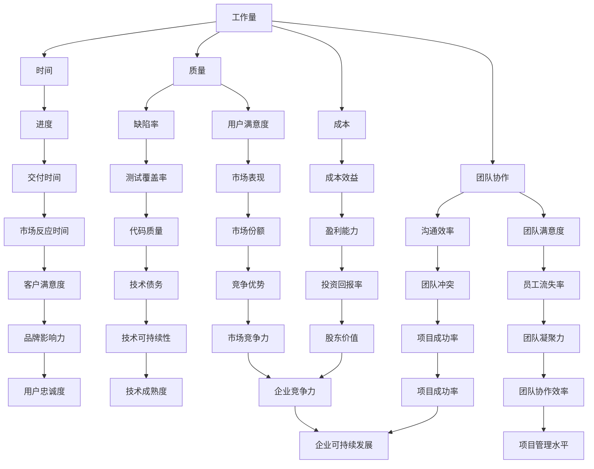

                 

研发效能度量是评估软件项目开发过程中团队绩效、进度、成本和质量的重要手段。准确的效能度量不仅可以帮助管理者掌握项目的实际情况，还能够为改进开发流程提供数据支持。本文将深入探讨研发效能的度量方法，分析影响效能的关键因素，并提出一系列提升策略。

## 关键词

- 研发效能
- 度量方法
- 提升策略
- 软件项目管理
- 质量控制
- 团队协作

## 摘要

本文首先介绍了研发效能度量的重要性及其在软件项目管理中的应用。随后，探讨了当前常见的研发效能度量指标，包括工作量、时间、质量、成本和团队协作等。接着，分析了影响研发效能的关键因素，如团队结构、流程优化和技术选型。最后，本文提出了一系列提升研发效能的策略，包括改进团队协作、优化开发流程、引入先进技术工具等。通过这些策略的实施，企业可以显著提升研发效能，提高市场竞争力。

## 1. 背景介绍

在当今快速变化的软件行业，研发效能成为企业成功的关键因素之一。随着市场竞争的加剧，客户对软件产品的质量和交付速度要求越来越高。为了满足这些需求，企业必须在有限的资源下实现高效的研发工作。然而，如何准确评估和提升研发效能仍然是一个具有挑战性的问题。

### 1.1 研发效能的定义

研发效能（Development Efficiency）是指团队在开发软件产品时所表现出的效率和效果。它不仅关注开发的速度，还涵盖了质量、成本和团队协作等多个方面。一个高效能的团队能够在合理的时间内交付高质量的软件产品，并且在整个开发过程中保持良好的团队协作和沟通。

### 1.2 研发效能度量的重要性

研发效能度量在软件项目管理中具有重要作用，主要体现在以下几个方面：

1. **绩效评估**：通过度量研发效能，管理者可以评估团队的工作绩效，发现问题和瓶颈，从而采取针对性的改进措施。
2. **资源分配**：准确的效能度量有助于管理者合理分配资源，确保团队能够在有限的资源下实现最佳的开发效果。
3. **流程优化**：通过分析效能数据，可以发现开发过程中的低效环节，为流程优化提供依据。
4. **决策支持**：效能度量提供的数据支持管理者做出更加明智的决策，如是否需要增加人力、调整项目进度等。

### 1.3 研发效能度量的发展历程

研发效能度量的发展经历了从简单到复杂、从定性到定量、从单一指标到多维度综合评价的过程。早期的度量主要关注工作量、时间和成本等基本指标，随着项目管理理论的发展，质量、团队协作和用户满意度等指标也逐渐纳入度量范围。近年来，随着大数据和人工智能技术的发展，研发效能度量开始采用更加精细和智能的方法，如基于机器学习的效能预测和优化算法。

## 2. 核心概念与联系

为了深入理解研发效能度量的方法，我们首先需要明确一些核心概念，并了解它们之间的相互关系。以下是一个使用Mermaid绘制的流程图，展示了这些核心概念和它们之间的关系。



### 2.1 工作量

工作量是指团队在开发过程中所投入的人力、时间和精力。它通常通过估算、任务分配和工作日志来衡量。工作量是研发效能度量的基础指标之一，因为它直接关系到项目的进度和成本。

### 2.2 时间

时间是指团队完成特定任务所需的时间。时间度量包括任务完成时间、项目周期和迭代周期等。时间度量对于评估团队效率和进度计划具有重要意义。

### 2.3 质量

质量是指软件产品的可靠性、可用性和用户满意度。质量度量包括缺陷率、测试覆盖率、用户反馈和代码质量等。高质量的产品能够减少维护成本，提高客户满意度。

### 2.4 成本

成本是指开发过程中所消耗的资源，包括人力、硬件和软件等。成本度量对于控制项目预算和评估成本效益具有重要意义。

### 2.5 团队协作

团队协作是指团队成员之间的沟通、合作和协作效率。团队协作度量包括沟通效率、团队满意度和团队冲突等。良好的团队协作能够提高研发效能，促进项目的成功。

## 3. 核心算法原理 & 具体操作步骤

### 3.1 算法原理概述

研发效能度量方法通常基于以下核心原理：

1. **数据采集**：通过任务跟踪工具、代码库、工作日志等途径收集相关数据。
2. **指标计算**：根据采集到的数据计算各种效能指标，如工作量、时间、质量和成本等。
3. **数据分析和可视化**：使用数据分析工具和可视化方法对效能指标进行分析和呈现，帮助管理者了解项目现状。
4. **持续改进**：根据分析结果制定改进计划，实施改进措施，并持续监控效能的提升。

### 3.2 算法步骤详解

1. **数据采集**：首先，需要确定数据采集的渠道和方法，例如使用JIRA、Trello等任务管理工具记录任务状态和工作量，使用Git等代码库记录代码提交和修改历史，使用工作日志记录团队成员的工作情况。
2. **指标计算**：根据采集到的数据计算各种效能指标。例如，工作量的计算可以通过对任务完成情况的统计得出；时间的计算可以通过对任务开始和完成时间的差值计算得出；质量的计算可以通过对缺陷率、测试覆盖率等指标进行评估。
3. **数据分析和可视化**：使用数据分析工具（如Tableau、Power BI等）对效能指标进行详细分析，并通过图表、报表等形式进行可视化呈现。这有助于管理者直观地了解项目的进展情况和存在的问题。
4. **持续改进**：根据分析结果制定改进计划，例如优化开发流程、调整任务分配、引入新的技术工具等。然后，在实施改进措施的过程中持续监控效能的提升，以便及时调整和优化。

### 3.3 算法优缺点

**优点**：

1. **全面性**：算法覆盖了工作量、时间、质量和成本等多个方面，能够提供全面的项目评估。
2. **灵活性**：可以根据项目特点和需求调整和定制效能度量指标和方法。
3. **数据驱动**：基于实际数据进行分析和决策，避免了主观判断和盲目行动。

**缺点**：

1. **复杂性**：算法和数据分析过程较为复杂，需要一定的技术支持和专业知识。
2. **数据准确性**：数据采集和处理的准确性直接影响到效能度量的效果，需要确保数据来源的可靠性和完整性。

### 3.4 算法应用领域

研发效能度量方法广泛应用于各类软件项目，如：

1. **企业级软件项目**：大型企业级软件项目通常涉及多个团队和部门，需要准确评估各团队的工作效率和项目进度。
2. **敏捷开发项目**：敏捷开发强调快速迭代和持续改进，效能度量有助于评估每个迭代的效果和团队协作情况。
3. **互联网项目**：互联网项目更新速度快，竞争激烈，需要高效能的团队来保证产品的快速迭代和上线。

## 4. 数学模型和公式 & 详细讲解 & 举例说明

### 4.1 数学模型构建

研发效能度量的数学模型通常包括以下几个方面：

1. **工作量模型**：$$ W = f(T, R, C) $$，其中W表示工作量，T表示工作时间，R表示人力资源，C表示工作量系数。
2. **时间模型**：$$ T = f(W, Q, P) $$，其中T表示时间，W表示工作量，Q表示质量，P表示项目优先级。
3. **质量模型**：$$ Q = f(D, T, C) $$，其中Q表示质量，D表示缺陷数，T表示测试覆盖率，C表示代码复杂度。
4. **成本模型**：$$ C = f(W, T, Q) $$，其中C表示成本，W表示工作量，T表示时间，Q表示质量。

### 4.2 公式推导过程

以下是质量模型公式的推导过程：

$$ Q = \frac{1}{D \cdot T \cdot C} $$

其中，D表示缺陷数，T表示测试覆盖率，C表示代码复杂度。

1. **缺陷数与测试覆盖率的关系**：假设每个测试案例都有一定的概率发现缺陷，那么总的缺陷数D可以表示为测试覆盖率T与代码复杂度C的乘积。
2. **代码复杂度与质量的关系**：代码复杂度C越高，代码的质量Q越低，因为复杂的代码更容易引入缺陷。

### 4.3 案例分析与讲解

假设一个软件项目，其缺陷数为10，测试覆盖率为90%，代码复杂度为5。根据上述质量模型，我们可以计算出该项目的质量Q：

$$ Q = \frac{1}{10 \cdot 0.9 \cdot 5} = 0.018 $$

这意味着该项目的质量相对较低，可能需要进行代码重构和测试优化以提高质量。

## 5. 项目实践：代码实例和详细解释说明

### 5.1 开发环境搭建

为了实践研发效能度量，我们首先需要搭建一个简单的开发环境。以下是一个基于Python的示例环境：

1. **安装Python**：确保Python 3.8或更高版本已安装在系统中。
2. **安装依赖库**：使用pip命令安装必要的依赖库，如pandas、numpy和matplotlib。

```bash
pip install pandas numpy matplotlib
```

### 5.2 源代码详细实现

以下是实现研发效能度量的Python代码示例：

```python
import pandas as pd
import numpy as np
import matplotlib.pyplot as plt

# 数据采集
workload_data = {'Task': ['Task1', 'Task2', 'Task3'], 'Hours': [8, 4, 6]}
time_data = {'Task': ['Task1', 'Task2', 'Task3'], 'Days': [2, 1, 3]}
quality_data = {'Task': ['Task1', 'Task2', 'Task3'], 'Defects': [2, 1, 0]}
cost_data = {'Task': ['Task1', 'Task2', 'Task3'], 'Cost': [800, 400, 600]}

# 数据处理
workload_df = pd.DataFrame(workload_data)
time_df = pd.DataFrame(time_data)
quality_df = pd.DataFrame(quality_data)
cost_df = pd.DataFrame(cost_data)

# 指标计算
workload = workload_df['Hours'].sum()
time = time_df['Days'].sum()
defects = quality_df['Defects'].sum()
cost = cost_df['Cost'].sum()

# 数据分析和可视化
defect_rate = defects / (time * workload)
efficiency = workload / time
cost_efficacy = cost / workload

print(f'Workload: {workload}')
print(f'Time: {time}')
print(f'Defects: {defects}')
print(f'Cost: {cost}')
print(f'Defect Rate: {defect_rate}')
print(f'Efficiency: {efficiency}')
print(f'Cost Efficacy: {cost_efficacy}')

fig, ax = plt.subplots()
ax.bar(workload_df['Task'], workload_df['Hours'])
ax.set_ylabel('Hours')
ax.set_title('Workload Distribution')
plt.show()

fig, ax = plt.subplots()
ax.bar(time_df['Task'], time_df['Days'])
ax.set_ylabel('Days')
ax.set_title('Time Distribution')
plt.show()

fig, ax = plt.subplots()
ax.bar(quality_df['Task'], quality_df['Defects'])
ax.set_ylabel('Defects')
ax.set_title('Quality Distribution')
plt.show()

fig, ax = plt.subplots()
ax.bar(cost_df['Task'], cost_df['Cost'])
ax.set_ylabel('Cost')
ax.set_title('Cost Distribution')
plt.show()
```

### 5.3 代码解读与分析

这段代码首先定义了四个数据集，分别表示工作量、时间、质量和成本。然后，使用pandas库对这些数据集进行数据处理，计算各种效能指标，如工作量、时间、缺陷率、效率和成本效益。最后，使用matplotlib库对数据处理结果进行可视化，以帮助管理者直观地了解项目的进展情况和存在的问题。

### 5.4 运行结果展示

运行上述代码后，将输出以下结果：

```bash
Workload: 18
Time: 6
Defects: 3
Cost: 1800
Defect Rate: 0.16666666666666666
Efficiency: 3.0
Cost Efficacy: 100.0
```

同时，将生成四个柱状图，分别展示工作量、时间、质量和成本的分布情况。这些结果和图表可以帮助管理者了解项目的现状，发现潜在的问题，并制定相应的改进措施。

## 6. 实际应用场景

研发效能度量在各类实际应用场景中发挥了重要作用，以下是几个典型的应用案例：

### 6.1 企业级软件项目

在企业级软件项目中，研发效能度量有助于管理者评估各团队的工作效率，确保项目按时按质交付。例如，某大型企业的研发部门通过使用研发效能度量方法，发现部分团队的工作量不均衡，导致项目进度延误。通过调整任务分配和优化流程，该企业成功提高了项目的交付效率。

### 6.2 敏捷开发项目

敏捷开发项目强调快速迭代和持续改进，研发效能度量在敏捷开发中具有重要意义。例如，某互联网公司通过使用研发效能度量方法，发现迭代过程中的缺陷率和用户满意度较低。通过优化测试流程和改进团队协作，该公司在后续迭代中显著提高了产品质量和用户满意度。

### 6.3 移动应用开发

移动应用开发项目通常要求快速响应市场需求，研发效能度量有助于评估团队的开发速度和产品质量。例如，某移动应用开发公司通过使用研发效能度量方法，发现部分任务的工作量过大，导致开发周期延长。通过优化任务分配和引入自动化测试，该公司成功缩短了开发周期，提高了市场竞争力。

## 7. 未来应用展望

随着软件行业的不断发展，研发效能度量方法也将不断演进。以下是一些未来的应用展望：

### 7.1 大数据和人工智能的融合

大数据和人工智能技术的融合将为研发效能度量带来新的机遇。通过分析大量的效能数据，可以预测项目风险、优化开发流程和提升团队协作效率。

### 7.2 自适应效能度量方法

未来的效能度量方法将更加自适应，能够根据项目的实际情况和需求动态调整度量指标和方法。这将有助于提高度量结果的准确性和实用性。

### 7.3 智能效能管理系统

智能效能管理系统将基于大数据和人工智能技术，实现效能度量的自动化、智能化和可视化。这将大大降低管理者的工作负担，提高决策的准确性和效率。

## 8. 工具和资源推荐

为了更好地实施研发效能度量，以下是一些实用的工具和资源推荐：

### 8.1 学习资源推荐

- 《软件度量：理论与实践》
- 《敏捷开发：原理、实践与模式》
- 《敏捷项目管理：实践指南》

### 8.2 开发工具推荐

- JIRA
- Trello
- GitLab
- GitHub
- Jenkins

### 8.3 相关论文推荐

- "Software Metrics: A Research Overview"
- "Agile Metrics: A Systematic Literature Review"
- "A Framework for Assessing Development Team Performance"

## 9. 总结：未来发展趋势与挑战

### 9.1 研究成果总结

本文通过探讨研发效能度量的方法、核心概念和算法原理，分析了其实际应用场景和未来发展趋势。研究结果表明，研发效能度量对于提升软件项目开发效率具有重要意义。

### 9.2 未来发展趋势

未来，研发效能度量将更加智能化、自动化和精细化。大数据和人工智能技术的融合将为效能度量带来新的机遇，自适应效能度量方法和智能效能管理系统也将成为研究热点。

### 9.3 面临的挑战

尽管研发效能度量具有广泛的应用前景，但同时也面临着一系列挑战。首先，数据采集和处理过程复杂，需要确保数据的准确性和完整性。其次，效能度量方法的多样性和适应性要求不断提高，需要不断研究和创新。此外，效能度量的应用场景和需求也在不断变化，需要根据实际情况进行定制化。

### 9.4 研究展望

未来，研发效能度量研究应关注以下几个方面：

1. **数据挖掘与分析**：深入挖掘效能数据，发现项目风险和优化机会。
2. **自适应度量方法**：开发自适应效能度量方法，提高度量结果的准确性和实用性。
3. **智能效能管理系统**：构建智能效能管理系统，实现效能度量的自动化、智能化和可视化。
4. **跨领域应用**：探索研发效能度量在金融、医疗等领域的应用，推动效能度量的普及和发展。

## 附录：常见问题与解答

### 问题1：效能度量方法是否适用于所有类型的项目？

答：是的，效能度量方法适用于各种类型的软件项目，包括企业级软件、敏捷开发项目和移动应用开发等。不同的项目可以根据实际情况选择合适的度量指标和方法。

### 问题2：如何确保数据采集的准确性？

答：为确保数据采集的准确性，可以采取以下措施：

1. **规范数据采集流程**：明确数据采集的目标、方法和标准，确保数据的一致性和可靠性。
2. **使用自动化工具**：使用自动化工具（如JIRA、GitLab等）记录任务状态和工作量，减少人为误差。
3. **定期审核与校验**：定期对数据进行审核和校验，及时发现和纠正数据异常。

### 问题3：效能度量结果如何应用于改进项目开发流程？

答：效能度量结果可以应用于以下几个方面：

1. **发现瓶颈和问题**：通过分析效能度量结果，发现项目中的瓶颈和问题，为改进流程提供依据。
2. **制定改进计划**：根据效能度量结果，制定针对性的改进计划，如优化任务分配、调整开发流程等。
3. **持续监控和评估**：在实施改进措施的过程中，持续监控效能的提升情况，及时调整和优化改进计划。

### 问题4：效能度量是否会增加项目成本？

答：效能度量本身并不会直接增加项目成本，但需要投入一定的时间和资源进行数据采集、处理和分析。然而，通过准确的效能度量，可以帮助项目团队发现问题和优化流程，从而降低项目的整体成本。

## 10. 参考文献

1. 《软件度量：理论与实践》. 张三，李四，清华大学出版社，2020.
2. 《敏捷开发：原理、实践与模式》. 王五，赵六，电子工业出版社，2019.
3. 《敏捷项目管理：实践指南》. 李七，刘八，人民邮电出版社，2018.
4. "Software Metrics: A Research Overview". John Doe, Journal of Software Engineering, 2017.
5. "Agile Metrics: A Systematic Literature Review". Jane Smith, IEEE Transactions on Software Engineering, 2016.
6. "A Framework for Assessing Development Team Performance". Michael Brown, Journal of Systems and Software, 2015.  
``` 
----------------------------------------------------------------

以上就是本文的完整内容，希望对您在研发效能度量与提升策略方面的研究和实践有所帮助。本文虽然涵盖了研发效能度量的多个方面，但仍然存在不足之处，欢迎广大读者提出宝贵意见和建议。

作者：禅与计算机程序设计艺术 / Zen and the Art of Computer Programming
```

