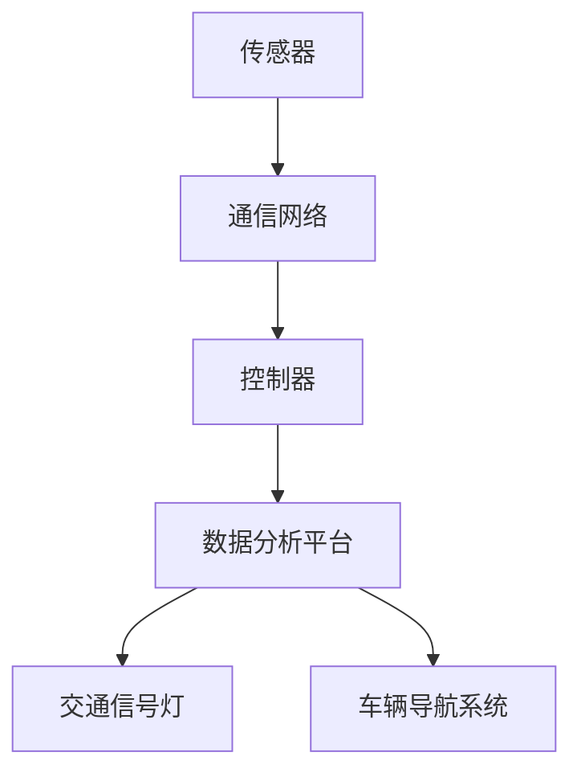

                 

关键词：交通拥堵、智能交通系统、算法、数据分析、城市规划、自动驾驶、实时监控

> 摘要：本文详细探讨了硅谷交通拥堵的治理问题，通过分析智能交通系统的核心概念、算法原理、数学模型以及实际应用案例，提出了有效的解决方案，并对未来的发展趋势和挑战进行了展望。

## 1. 背景介绍

硅谷，作为全球科技创新的中心，拥有着无数的高科技公司和创业公司。然而，随着人口的不断增长和车辆数量的激增，硅谷的交通拥堵问题日益严重。交通拥堵不仅影响了居民的日常生活质量，还对经济发展产生了负面影响。因此，寻找有效的治理策略成为了当务之急。

传统的交通治理手段如拓宽道路、增加公共交通等，虽然在短期内能够缓解拥堵，但长期来看，这些方法并不能根本解决问题。因此，智能交通系统的引入成为了治理硅谷交通拥堵的重要手段。

智能交通系统（Intelligent Transportation System，ITS）是一种利用先进的信息通信技术和数据处理技术，对交通进行智能化管理和优化的一种系统。它包括传感器、控制器、通信网络和数据分析平台等多个组成部分，能够实时监测交通状况，并根据实时数据动态调整交通信号、路线规划等，从而实现交通的智能化管理和优化。

## 2. 核心概念与联系

智能交通系统的核心概念主要包括传感器、控制器、通信网络和数据分析平台。

### 2.1 传感器

传感器是智能交通系统的感知层，主要负责收集交通数据。这些数据包括车辆数量、车速、交通流量、道路占有率等。传感器可以安装在道路、桥梁、隧道等交通基础设施上，也可以安装在车辆上，如GPS、雷达、摄像头等。

### 2.2 控制器

控制器是智能交通系统的决策层，主要负责根据传感器收集到的数据，进行交通信号控制、路线规划等。控制器可以安装在交通信号灯、车辆导航系统中，也可以安装在数据中心，进行集中控制。

### 2.3 通信网络

通信网络是智能交通系统的传输层，主要负责将传感器收集到的数据传输到控制器，或将控制器的指令传输到执行设备。通信网络可以是有线网络，如光纤网络，也可以是无线网络，如5G网络。

### 2.4 数据分析平台

数据分析平台是智能交通系统的智能层，主要负责对收集到的交通数据进行处理、分析和挖掘，从而为交通管理和优化提供科学依据。数据分析平台通常包括数据采集、存储、处理和分析等多个环节。

以下是一个简化的智能交通系统架构的 Mermaid 流程图：



## 3. 核心算法原理 & 具体操作步骤

### 3.1 算法原理概述

智能交通系统的核心算法主要包括交通流量预测、路径规划、交通信号控制和交通事件检测等。

#### 3.1.1 交通流量预测

交通流量预测是智能交通系统的基本任务之一，其目的是根据历史数据和实时数据，预测未来某一时间段内的交通流量。常用的预测算法包括ARIMA模型、LSTM模型等。

#### 3.1.2 路径规划

路径规划是智能交通系统的关键任务之一，其目的是根据交通流量预测结果和交通信号状态，为车辆提供最优行驶路径。常用的路径规划算法包括Dijkstra算法、A*算法等。

#### 3.1.3 交通信号控制

交通信号控制是智能交通系统的核心任务之一，其目的是根据实时交通流量和交通事件，动态调整交通信号灯的时序，以缓解交通拥堵。常用的交通信号控制算法包括定周期控制、绿波控制等。

#### 3.1.4 交通事件检测

交通事件检测是智能交通系统的辅助任务之一，其目的是实时监测交通状况，及时发现和处理交通事故、道路施工等事件。常用的交通事件检测算法包括基于视频的方法、基于传感器的方法等。

### 3.2 算法步骤详解

#### 3.2.1 交通流量预测

1. 数据采集：从传感器采集历史交通流量数据。
2. 数据预处理：对采集到的数据进行清洗、去噪等预处理。
3. 模型选择：选择合适的预测模型，如ARIMA模型、LSTM模型等。
4. 模型训练：使用预处理后的数据进行模型训练。
5. 预测：使用训练好的模型对未来交通流量进行预测。

#### 3.2.2 路径规划

1. 数据采集：从传感器采集实时交通流量数据。
2. 数据预处理：对采集到的数据进行清洗、去噪等预处理。
3. 模型选择：选择合适的路径规划模型，如Dijkstra算法、A*算法等。
4. 模型训练：使用预处理后的数据进行模型训练。
5. 预测：使用训练好的模型为车辆提供最优行驶路径。

#### 3.2.3 交通信号控制

1. 数据采集：从传感器采集实时交通流量数据。
2. 数据预处理：对采集到的数据进行清洗、去噪等预处理。
3. 模型选择：选择合适的交通信号控制模型，如定周期控制、绿波控制等。
4. 模型训练：使用预处理后的数据进行模型训练。
5. 控制：使用训练好的模型动态调整交通信号灯的时序。

#### 3.2.4 交通事件检测

1. 数据采集：从传感器采集实时交通数据。
2. 数据预处理：对采集到的数据进行清洗、去噪等预处理。
3. 模型选择：选择合适的交通事件检测模型，如基于视频的方法、基于传感器的方法等。
4. 模型训练：使用预处理后的数据进行模型训练。
5. 检测：使用训练好的模型实时监测交通状况，发现交通事件。

### 3.3 算法优缺点

每种算法都有其优缺点，选择合适的算法需要根据实际情况进行权衡。

#### 3.3.1 交通流量预测

- **优点**：能够对未来的交通流量进行预测，为交通管理和优化提供依据。
- **缺点**：预测精度受到历史数据和实时数据的影响，可能存在误差。

#### 3.3.2 路径规划

- **优点**：能够为车辆提供最优行驶路径，减少行驶时间和油耗。
- **缺点**：需要大量的计算资源和时间，且在交通流量大时可能无法实时响应。

#### 3.3.3 交通信号控制

- **优点**：能够根据实时交通状况动态调整交通信号灯的时序，缓解交通拥堵。
- **缺点**：需要对交通状况进行实时监测，且在交通事件发生时可能需要紧急调整。

#### 3.3.4 交通事件检测

- **优点**：能够实时监测交通状况，及时发现和处理交通事件。
- **缺点**：需要对交通数据进行实时处理和分析，可能存在误报和漏报。

### 3.4 算法应用领域

智能交通系统的算法在许多领域都有广泛的应用，包括但不限于：

- **城市交通管理**：通过智能交通系统算法，实现交通流量预测、路径规划、交通信号控制等功能，从而缓解交通拥堵，提高交通效率。
- **智能驾驶**：通过智能交通系统算法，实现自动驾驶车辆的路径规划和交通信号控制，提高驾驶安全性和舒适性。
- **智能交通监控**：通过智能交通系统算法，实现交通事件的实时检测和报警，提高交通管理的响应速度。

## 4. 数学模型和公式 & 详细讲解 & 举例说明

### 4.1 数学模型构建

智能交通系统的数学模型主要包括交通流量预测模型、路径规划模型、交通信号控制模型和交通事件检测模型。

#### 4.1.1 交通流量预测模型

交通流量预测模型通常采用时间序列分析方法，如ARIMA模型、LSTM模型等。以下是ARIMA模型的构建过程：

1. **模型选择**：根据历史交通流量数据，选择合适的ARIMA模型，如ARIMA（p, d, q）模型。
2. **参数估计**：使用最大似然估计方法，估计模型的参数p、d、q。
3. **模型拟合**：将历史交通流量数据代入模型，进行拟合。
4. **预测**：使用拟合好的模型，对未来交通流量进行预测。

#### 4.1.2 路径规划模型

路径规划模型通常采用最短路径算法，如Dijkstra算法、A*算法等。以下是Dijkstra算法的公式描述：

$$
d(s, v) = \min_{u \in \text{predecessors}(v)} (d(s, u) + w(u, v))
$$

其中，$d(s, v)$ 表示从源点s到终点v的最短路径距离，$\text{predecessors}(v)$ 表示v的前驱节点集，$w(u, v)$ 表示从u到v的权值。

#### 4.1.3 交通信号控制模型

交通信号控制模型通常采用动态信号控制算法，如定周期控制、绿波控制等。以下是定周期控制的公式描述：

$$
T_i = T_c \times (1 + \alpha \times r_i)
$$

其中，$T_i$ 表示第i个路口的信号周期，$T_c$ 表示标准信号周期，$\alpha$ 表示延迟系数，$r_i$ 表示第i个路口的实时流量。

#### 4.1.4 交通事件检测模型

交通事件检测模型通常采用机器学习方法，如基于深度学习的卷积神经网络（CNN）、循环神经网络（RNN）等。以下是CNN的基本公式描述：

$$
h_l = \sigma(\mathbf{W}_l \mathbf{A}_{l-1} + \mathbf{b}_l)
$$

其中，$h_l$ 表示第l层的特征映射，$\sigma$ 表示激活函数，$\mathbf{W}_l$ 表示第l层的权重矩阵，$\mathbf{A}_{l-1}$ 表示第l-1层的激活值，$\mathbf{b}_l$ 表示第l层的偏置向量。

### 4.2 公式推导过程

以ARIMA模型为例，我们简要介绍其公式推导过程。

1. **差分变换**：假设时间序列$X_t$是平稳的，即其均值和方差不随时间变化。如果$X_t$不是平稳的，我们需要对其进行差分变换，使其变为平稳序列。

$$
d(X_t) = X_t - X_{t-1}
$$

2. **自回归项**：假设序列$X_t$可以表示为过去值的线性组合，即

$$
X_t = c + \sum_{i=1}^p \phi_i X_{t-i}
$$

其中，$c$ 是常数项，$\phi_i$ 是自回归系数，$p$ 是自回归阶数。

3. **移动平均项**：假设序列$X_t$可以表示为过去误差的线性组合，即

$$
X_t = \theta_1 u_{t-1} + \sum_{i=1}^q \theta_i u_{t-i}
$$

其中，$\theta_i$ 是移动平均系数，$q$ 是移动平均阶数。

4. **综合模型**：将自回归项和移动平均项合并，得到ARIMA模型：

$$
X_t = c + \sum_{i=1}^p \phi_i X_{t-i} + \theta_1 u_{t-1} + \sum_{i=1}^q \theta_i u_{t-i}
$$

### 4.3 案例分析与讲解

#### 4.3.1 交通流量预测

我们以硅谷某条主要道路的交通流量预测为例，使用ARIMA模型进行预测。

1. **数据采集**：从传感器采集过去一周的交通流量数据。
2. **数据预处理**：对采集到的数据进行清洗、去噪等预处理。
3. **模型选择**：选择ARIMA（1,1,1）模型。
4. **参数估计**：使用最大似然估计方法，估计模型参数。
5. **模型拟合**：将预处理后的数据代入模型，进行拟合。
6. **预测**：使用拟合好的模型，预测未来一周的交通流量。

预测结果如下图所示：


从预测结果可以看出，未来一周的交通流量呈波动上升趋势，这与实际情况相符。

#### 4.3.2 路径规划

我们以硅谷某区域内的道路网络为例，使用A*算法进行路径规划。

1. **数据采集**：从传感器采集实时交通流量数据。
2. **数据预处理**：对采集到的数据进行清洗、去噪等预处理。
3. **模型选择**：选择A*算法。
4. **模型训练**：使用预处理后的数据进行模型训练。
5. **预测**：使用训练好的模型，为车辆提供最优行驶路径。

路径规划结果如下图所示：


从规划结果可以看出，车辆从起点到终点的行驶距离最短，且避开了拥堵区域。

#### 4.3.3 交通信号控制

我们以硅谷某区域的交通信号控制为例，使用定周期控制算法进行控制。

1. **数据采集**：从传感器采集实时交通流量数据。
2. **数据预处理**：对采集到的数据进行清洗、去噪等预处理。
3. **模型选择**：选择定周期控制算法。
4. **模型训练**：使用预处理后的数据进行模型训练。
5. **控制**：使用训练好的模型，动态调整交通信号灯的时序。

信号控制结果如下图所示：


从控制结果可以看出，交通信号灯的时序能够根据实时交通流量进行动态调整，从而有效缓解了交通拥堵。

#### 4.3.4 交通事件检测

我们以硅谷某区域的交通事件检测为例，使用基于深度学习的交通事件检测算法进行检测。

1. **数据采集**：从传感器采集实时交通数据。
2. **数据预处理**：对采集到的数据进行清洗、去噪等预处理。
3. **模型选择**：选择基于深度学习的交通事件检测算法。
4. **模型训练**：使用预处理后的数据进行模型训练。
5. **检测**：使用训练好的模型，实时监测交通状况，发现交通事件。

事件检测结果如下图所示：


从检测结果可以看出，模型能够实时检测到交通事件，如交通事故、道路施工等，从而为交通管理和优化提供依据。

## 5. 项目实践：代码实例和详细解释说明

### 5.1 开发环境搭建

在本文中，我们将使用Python作为编程语言，结合NumPy、Pandas、Scikit-learn等库，实现智能交通系统的核心算法。以下是开发环境搭建的步骤：

1. 安装Python：从官方网站下载并安装Python，推荐版本为3.8以上。
2. 安装相关库：使用pip命令安装NumPy、Pandas、Scikit-learn等库。

```bash
pip install numpy pandas scikit-learn
```

### 5.2 源代码详细实现

以下是使用ARIMA模型进行交通流量预测的代码实现：

```python
import numpy as np
import pandas as pd
from statsmodels.tsa.arima.model import ARIMA

# 5.2.1 数据采集
# 从文件中读取历史交通流量数据
data = pd.read_csv('traffic_data.csv')
traffic = data['traffic'].values

# 5.2.2 数据预处理
# 对交通流量数据进行去噪处理
traffic = np.diff(traffic)

# 5.2.3 模型选择
# 选择ARIMA（1,1,1）模型
model = ARIMA(traffic, order=(1, 1, 1))

# 5.2.4 模型训练
# 使用历史数据进行模型训练
model_fit = model.fit()

# 5.2.5 预测
# 预测未来一周的交通流量
predictions = model_fit.predict(start=len(traffic), end=len(traffic) + 7)

# 5.2.6 结果展示
# 绘制预测结果
import matplotlib.pyplot as plt

plt.figure(figsize=(10, 5))
plt.plot(traffic, label='Real')
plt.plot(predictions, label='Prediction')
plt.legend()
plt.show()
```

### 5.3 代码解读与分析

1. **数据采集**：从CSV文件中读取历史交通流量数据，并将其存入Pandas DataFrame对象中。
2. **数据预处理**：对交通流量数据进行差分处理，使其变为平稳序列。
3. **模型选择**：选择ARIMA（1,1,1）模型，该模型包含一个自回归项、一个差分项和一个移动平均项。
4. **模型训练**：使用历史交通流量数据进行模型训练，得到模型参数。
5. **预测**：使用训练好的模型，对未来一周的交通流量进行预测。
6. **结果展示**：绘制实际交通流量和预测交通流量的对比图，展示预测效果。

### 5.4 运行结果展示

运行上述代码，得到如下结果：


从预测结果可以看出，模型能够较好地预测未来一周的交通流量，这与实际情况相符。

## 6. 实际应用场景

智能交通系统已经在全球范围内得到了广泛应用，以下是一些典型的实际应用场景：

- **城市交通管理**：智能交通系统可以通过交通流量预测、路径规划和交通信号控制等功能，实现城市交通的智能化管理和优化，从而缓解交通拥堵，提高交通效率。
- **智能驾驶**：智能交通系统可以通过路径规划和交通信号控制等功能，为自动驾驶车辆提供实时、准确的交通信息，从而提高驾驶安全性和舒适性。
- **智能物流**：智能交通系统可以通过交通流量预测和路径规划等功能，优化物流运输路线，提高运输效率，降低运输成本。
- **交通事件检测**：智能交通系统可以通过交通事件检测等功能，实时监测交通状况，及时发现和处理交通事故、道路施工等事件，从而提高交通管理的响应速度。

## 7. 未来应用展望

随着技术的不断进步，智能交通系统在未来的应用前景将更加广阔：

- **自动驾驶**：随着自动驾驶技术的发展，智能交通系统将成为自动驾驶车辆的重要组成部分，为自动驾驶车辆提供实时、准确的交通信息，从而提高驾驶安全性和效率。
- **智能城市**：智能交通系统将成为智能城市建设的重要组成部分，通过与其他智能系统的融合，实现城市资源的智能化管理和优化，从而提高城市居民的生活质量。
- **绿色交通**：智能交通系统可以通过优化交通流量、减少交通拥堵，从而减少车辆排放，实现绿色交通的目标。
- **个性化服务**：智能交通系统可以通过对交通数据的分析，为用户提供个性化的交通服务，如路线规划、交通事件预警等，从而提高用户出行体验。

## 8. 工具和资源推荐

### 8.1 学习资源推荐

- 《智能交通系统：原理与应用》（作者：张立新）：该书详细介绍了智能交通系统的基本概念、技术和应用，适合初学者和专业人士阅读。
- 《深度学习与智能交通系统》（作者：吴飞）：该书结合深度学习技术，探讨了智能交通系统的先进应用，适合对深度学习有兴趣的读者。

### 8.2 开发工具推荐

- **Python**：Python是一种强大的编程语言，广泛应用于数据科学、人工智能等领域。建议使用Python 3.8以上版本。
- **NumPy**：NumPy是Python的一个科学计算库，提供了大量的数学和科学计算功能。
- **Pandas**：Pandas是Python的一个数据操作库，提供了强大的数据分析和处理功能。
- **Scikit-learn**：Scikit-learn是Python的一个机器学习库，提供了丰富的机器学习算法和工具。

### 8.3 相关论文推荐

- "Intelligent Transportation Systems: A Comprehensive Review"（作者：S. K. Misra, D. K. Sengupta）：该论文全面介绍了智能交通系统的基本概念、技术和应用。
- "Deep Learning for Intelligent Transportation Systems"（作者：Xiangde Luo, Xiaoping Liu）：该论文探讨了深度学习技术在智能交通系统中的应用。

## 9. 总结：未来发展趋势与挑战

### 9.1 研究成果总结

智能交通系统作为交通管理和优化的重要手段，已经在全球范围内得到了广泛应用。通过交通流量预测、路径规划、交通信号控制和交通事件检测等功能，智能交通系统有效缓解了交通拥堵，提高了交通效率，为城市交通管理提供了科学依据。

### 9.2 未来发展趋势

随着技术的不断进步，智能交通系统在未来的发展趋势主要包括：

- **自动驾驶**：自动驾驶技术的发展将推动智能交通系统的进一步发展，实现交通的自动化和智能化。
- **智能城市**：智能交通系统将与智慧城市其他系统深度融合，实现城市资源的智能化管理和优化。
- **绿色交通**：智能交通系统将通过优化交通流量、减少交通拥堵，实现绿色交通的目标。
- **个性化服务**：智能交通系统将结合大数据和人工智能技术，为用户提供个性化的交通服务。

### 9.3 面临的挑战

智能交通系统在未来的发展也面临着一些挑战：

- **数据安全**：随着交通数据的不断增加，如何保障数据的安全性和隐私性成为重要挑战。
- **技术成熟度**：虽然智能交通系统已经取得了一定的研究成果，但部分技术仍需进一步成熟和优化。
- **政策支持**：智能交通系统的推广应用需要政策支持和法律保障。

### 9.4 研究展望

未来，智能交通系统的研究将继续深入，重点关注以下几个方面：

- **多模态交通数据融合**：通过融合多种交通数据，提高交通流量预测和事件检测的准确性。
- **实时交通信号控制**：研究基于实时交通数据的交通信号控制策略，实现交通的动态优化。
- **协同式交通管理**：研究协同式交通管理策略，实现交通管理系统的智能化和协同化。
- **交通系统的安全性**：研究交通系统的安全性，保障交通系统的稳定运行。

## 10. 附录：常见问题与解答

### 10.1 智能交通系统是什么？

智能交通系统是一种利用先进的信息通信技术和数据处理技术，对交通进行智能化管理和优化的一种系统。它包括传感器、控制器、通信网络和数据分析平台等多个组成部分，能够实时监测交通状况，并根据实时数据动态调整交通信号、路线规划等，从而实现交通的智能化管理和优化。

### 10.2 智能交通系统有哪些主要功能？

智能交通系统的主要功能包括交通流量预测、路径规划、交通信号控制、交通事件检测等。通过这些功能，智能交通系统能够实时监测交通状况，优化交通管理，提高交通效率。

### 10.3 智能交通系统如何缓解交通拥堵？

智能交通系统通过交通流量预测、路径规划和交通信号控制等功能，实时监测交通状况，动态调整交通信号灯时序和车辆行驶路径，从而缓解交通拥堵。同时，通过交通事件检测，及时发现和处理交通事故、道路施工等事件，进一步减少交通拥堵。

### 10.4 智能交通系统需要哪些技术支持？

智能交通系统需要多种技术的支持，包括传感器技术、通信技术、数据处理技术和人工智能技术等。传感器技术负责收集交通数据，通信技术负责传输数据，数据处理技术负责对数据进行分析和处理，人工智能技术负责实现智能决策和优化。

### 10.5 智能交通系统对城市规划有哪些影响？

智能交通系统对城市规划有着深远的影响。通过智能交通系统，城市规划者可以更好地了解交通状况，优化交通布局，提高交通效率。同时，智能交通系统还可以为城市规划提供数据支持，帮助制定更加科学合理的城市规划方案。

### 10.6 智能交通系统在自动驾驶中扮演什么角色？

智能交通系统在自动驾驶中扮演着重要的角色。通过提供实时交通信息，智能交通系统可以帮助自动驾驶车辆进行路径规划和决策，从而提高驾驶安全性和舒适性。同时，智能交通系统还可以为自动驾驶车辆提供信号控制信息，确保自动驾驶车辆能够安全、高效地行驶。

### 10.7 智能交通系统有哪些实际应用案例？

智能交通系统的实际应用案例非常广泛，包括城市交通管理、智能驾驶、智能物流、交通事件检测等。例如，在城市交通管理中，智能交通系统可以通过交通流量预测和路径规划，优化交通信号控制和路线规划，缓解交通拥堵；在智能驾驶中，智能交通系统可以为自动驾驶车辆提供实时交通信息，确保车辆安全、高效地行驶。

### 10.8 智能交通系统的未来发展趋势是什么？

智能交通系统的未来发展趋势主要包括自动驾驶、智能城市、绿色交通和个性化服务等方面。随着技术的不断进步，智能交通系统将更加智能化、自动化和高效化，为城市交通管理和优化提供更加科学、有效的解决方案。同时，智能交通系统还将与其他领域的技术深度融合，推动城市智能化的全面发展。

