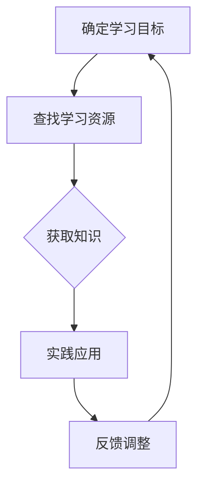
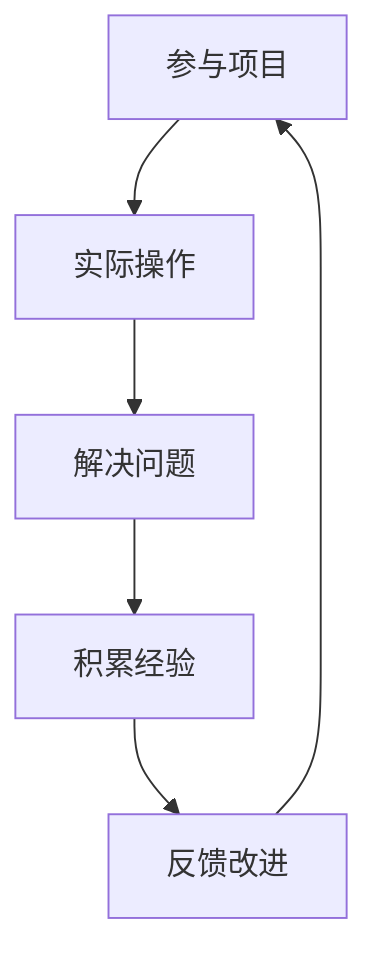
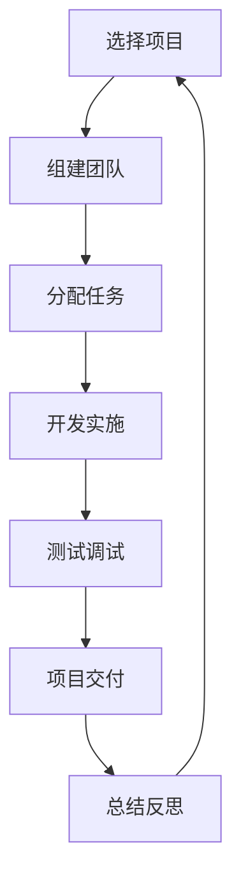
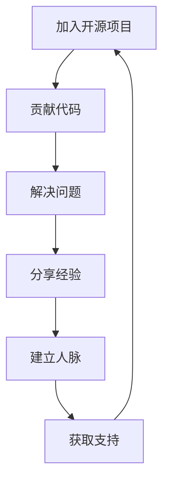

                 

关键词：硅谷创业者，非传统教育，技能积累，成功案例，技术架构

> 摘要：本文将深入探讨硅谷创业者的非传统教育背景，分析他们在技术领域的成功之道，以及他们如何通过非传统途径获取技术知识和技能，为读者提供宝贵的经验和启示。

## 1. 背景介绍

硅谷作为全球科技创新的摇篮，吸引了无数创业者聚集于此，他们中有不少人的教育背景与传统路径有所不同。这些非传统教育背景的创业者，往往通过自学、实践、实习、开源项目等多种途径积累了丰富的技术知识和经验，成为了硅谷创业大军中的中坚力量。本文将探讨这些创业者的非传统教育背景，分析他们的成功之道，为其他有志于进入硅谷创业领域的人提供参考。

### 1.1 非传统教育背景的定义

非传统教育背景指的是在传统教育体系中未能获得完整的学术认证，但通过自学、实践、项目参与等非传统途径积累了丰富的知识和技能的人群。这些人群可能包括自学成才的程序员、拥有实战经验的工程师、以及在开源社区中活跃的技术爱好者等。

### 1.2 硅谷创业者的特点

硅谷创业者具有以下特点：

- **创新能力**：硅谷创业者具有强烈的创新意识，他们不断尝试新的想法和解决方案，推动技术进步。
- **实践经验**：大多数硅谷创业者拥有丰富的实践经验，他们通过项目开发和实际操作积累了宝贵的经验。
- **团队合作**：硅谷创业者擅长团队合作，他们能够吸引优秀人才加入团队，共同推动项目的发展。
- **快速学习**：硅谷创业者具备快速学习能力，他们能够迅速掌握新技术和新知识，为创业项目带来创新。

## 2. 核心概念与联系

在探讨硅谷创业者的非传统教育背景之前，我们需要了解一些核心概念，包括自学、实践、项目参与和开源社区等。

### 2.1 自学

自学是硅谷创业者获取技术知识和技能的重要途径。自学能力强的人能够迅速掌握新知识，并在实际项目中应用。以下是一个Mermaid流程图，展示了自学的过程：



### 2.2 实践

实践是检验知识的最好方式。硅谷创业者通过参与项目开发、实习等途径积累了丰富的实践经验。以下是一个Mermaid流程图，展示了实践的过程：



### 2.3 项目参与

项目参与是硅谷创业者提升技能和积累经验的重要途径。以下是一个Mermaid流程图，展示了项目参与的过程：



### 2.4 开源社区

开源社区是硅谷创业者展示才华、获取支持和扩展人脉的重要平台。以下是一个Mermaid流程图，展示了在开源社区中的活动：



## 3. 核心算法原理 & 具体操作步骤

### 3.1 算法原理概述

硅谷创业者的非传统教育背景主要依赖于自学和实践。自学是获取知识的过程，实践是应用知识的过程。以下是一个简要的算法原理概述：

- **自学**：通过查找学习资源，获取知识，然后通过实践应用，解决问题，最终形成完整的知识体系。
- **实践**：通过参与项目、加入开源社区等途径，将所学知识应用于实际项目，解决问题，积累经验。

### 3.2 算法步骤详解

#### 3.2.1 自学

1. **确定学习目标**：根据创业项目需求，确定需要学习的技术知识和技能。
2. **查找学习资源**：通过搜索引擎、技术论坛、在线课程等途径查找相关学习资源。
3. **获取知识**：学习理论知识，通过阅读技术书籍、观看教学视频、参加线上课程等途径。
4. **实践应用**：将所学知识应用于实际项目，解决问题，积累经验。
5. **反馈调整**：根据实践结果，调整学习计划和方法，不断优化学习效果。

#### 3.2.2 实践

1. **参与项目**：加入创业团队或开源项目，参与实际项目开发。
2. **实际操作**：根据项目需求，完成相关任务，编写代码，解决问题。
3. **解决问题**：遇到问题时，通过查阅资料、请教他人、尝试不同的解决方案等方式解决问题。
4. **积累经验**：在项目开发过程中，积累经验，提高自己的技能水平。
5. **反馈改进**：根据项目反馈，总结经验教训，改进工作方法和流程。

### 3.3 算法优缺点

#### 优点

- **灵活性**：非传统教育背景的创业者可以根据自己的需求和兴趣选择学习内容，提高学习效率。
- **实践经验**：通过实践，创业者能够快速掌握技术知识和技能，提高自己的实际操作能力。
- **创新能力**：非传统教育背景的创业者往往具有更强的创新意识，能够推动技术进步。

#### 缺点

- **知识体系不完整**：非传统教育背景的创业者可能在某些领域缺乏系统性的理论知识。
- **学习效率不稳定**：自学和实践的过程中，创业者可能会遇到学习瓶颈，影响学习效果。

### 3.4 算法应用领域

非传统教育背景的算法原理主要应用于以下领域：

- **创业项目开发**：创业者通过自学和实践，将所学知识应用于实际创业项目中，推动项目发展。
- **技术创新**：非传统教育背景的创业者具有创新能力，能够在技术领域推动创新。
- **开源社区**：创业者通过参与开源项目，分享经验，扩展人脉，获取支持。

## 4. 数学模型和公式 & 详细讲解 & 举例说明

### 4.1 数学模型构建

为了更好地理解硅谷创业者的非传统教育背景，我们可以构建一个简单的数学模型，分析自学和实践对技能积累的影响。

设 \( S \) 表示技能水平，\( L \) 表示学习时间，\( P \) 表示实践经验，则技能水平可以表示为：

$$
S = f(L, P)
$$

其中，\( f \) 表示函数，表示技能水平与学习时间和实践经验之间的关系。

### 4.2 公式推导过程

根据上述数学模型，我们可以推导出以下公式：

1. **学习时间与技能水平的关系**：

$$
S \propto L
$$

即技能水平与学习时间成正比。

2. **实践经验与技能水平的关系**：

$$
S \propto P
$$

即技能水平与实践经验成正比。

3. **学习时间和实践经验对技能水平的影响**：

$$
S = kL^aP^b
$$

其中，\( k \) 为常数，\( a \) 和 \( b \) 为系数，表示学习时间和实践经验对技能水平的贡献程度。

### 4.3 案例分析与讲解

以下是一个具体的案例，说明非传统教育背景的创业者如何通过自学和实践积累技能：

**案例：** 小明是一名自学成才的程序员，他通过自学掌握了多种编程语言，并在开源社区中积极参与项目开发，积累了丰富的实践经验。

1. **学习时间与技能水平的关系**：

根据公式 \( S \propto L \)，小明在编程领域的技能水平随着学习时间的增加而提高。

2. **实践经验与技能水平的关系**：

根据公式 \( S \propto P \)，小明在编程领域的技能水平随着实践经验的增加而提高。

3. **学习时间和实践经验对技能水平的影响**：

根据公式 \( S = kL^aP^b \)，小明在编程领域的技能水平取决于他的学习时间和实践经验。例如，如果他每天学习 2 小时，每年参与 2 个开源项目，则他的技能水平可以表示为：

$$
S = k(2 \times 365)^a(2 \times 2)^b
$$

通过调整学习时间和实践经验，小明可以优化自己的技能水平。

## 5. 项目实践：代码实例和详细解释说明

### 5.1 开发环境搭建

为了更好地理解非传统教育背景的创业者如何通过项目实践积累技能，我们将搭建一个简单的 Web 应用项目。

1. **安装 Node.js**：在官网上下载并安装 Node.js。
2. **创建项目文件夹**：在本地计算机上创建一个项目文件夹，例如 `web-app`。
3. **初始化项目**：进入项目文件夹，执行以下命令初始化项目：

```bash
npm init -y
```

### 5.2 源代码详细实现

在项目文件夹中，创建一个名为 `index.js` 的文件，并编写以下代码：

```javascript
const http = require('http');

const server = http.createServer((request, response) => {
  response.end('<h1>Hello, World!</h1>');
});

server.listen(3000, () => {
  console.log('Server is running on port 3000');
});
```

这段代码创建了一个简单的 Web 服务器，监听端口 3000，当有请求时，返回一个包含 HTML 标签的响应。

### 5.3 代码解读与分析

1. **引入模块**：使用 `require` 函数引入 `http` 模块，用于创建 Web 服务器。
2. **创建服务器**：使用 `http.createServer` 函数创建一个 Web 服务器，该函数接受一个回调函数作为参数，用于处理客户端请求。
3. **处理请求**：在回调函数中，使用 `response.end` 方法返回一个包含 HTML 标签的响应。
4. **启动服务器**：使用 `server.listen` 方法启动服务器，并监听端口 3000。

### 5.4 运行结果展示

在命令行中执行以下命令启动服务器：

```bash
node index.js
```

然后，在浏览器中访问 `http://localhost:3000`，可以看到页面显示了一个标题为 "Hello, World!" 的 HTML 标签。

## 6. 实际应用场景

非传统教育背景的创业者通过自学和实践，可以在多个领域取得成功。以下是一些实际应用场景：

### 6.1 创业项目开发

创业者通过自学和实践，掌握所需技术知识和技能，参与创业项目的开发。例如，小明是一名自学成才的程序员，他在 Web 开发领域积累了丰富的实践经验，参与了一个在线教育平台的开发，成为了一名优秀的后端工程师。

### 6.2 技术咨询与服务

创业者通过自学和实践，积累了丰富的技术经验，可以为其他企业提供技术咨询与服务。例如，小张是一名自学成才的数据分析师，他通过实际项目积累了丰富的数据分析经验，为企业提供了高质量的数据分析服务。

### 6.3 开源社区贡献

创业者通过参与开源项目，贡献自己的代码和经验，拓展人脉，获取支持。例如，小李是一名自学成才的程序员，他参与了多个开源项目，成为了一名活跃的开源社区成员，获得了许多同行的认可和支持。

## 7. 未来应用展望

随着技术的不断发展，非传统教育背景的创业者将在未来扮演越来越重要的角色。以下是一些未来应用展望：

### 7.1 技术领域的创新

非传统教育背景的创业者具有更强的创新意识，他们将在技术领域推动创新，带来更多突破性成果。

### 7.2 教育模式的变革

非传统教育背景的成功案例将促使教育模式发生变革，更多的学习者将通过自学和实践获得知识和技能。

### 7.3 社会价值提升

非传统教育背景的创业者通过创业项目和社会实践，为社会创造了更多价值，提升了社会的整体创新水平。

## 8. 工具和资源推荐

### 8.1 学习资源推荐

1. **在线课程**：Coursera、Udacity、edX 等平台提供了丰富的技术课程。
2. **技术书籍**：《深度学习》、《Python 编程：从入门到实践》等书籍适合自学。

### 8.2 开发工具推荐

1. **集成开发环境（IDE）**：Visual Studio Code、Eclipse、IntelliJ IDEA 等。
2. **代码托管平台**：GitHub、GitLab、Bitbucket 等。

### 8.3 相关论文推荐

1. **《深度学习》**：Goodfellow、Bengio、Courville 著，介绍了深度学习的基本原理和应用。
2. **《人工智能：一种现代的方法》**：Pearl、Moss 著，介绍了人工智能的基本概念和方法。

## 9. 总结：未来发展趋势与挑战

### 9.1 研究成果总结

本文通过对硅谷创业者的非传统教育背景进行探讨，分析了自学、实践、项目参与和开源社区等非传统途径在技能积累方面的作用。研究结果表明，非传统教育背景的创业者具有更强的创新能力和实践经验，为技术领域的发展做出了重要贡献。

### 9.2 未来发展趋势

随着技术的不断进步，非传统教育背景的创业者将在未来发挥更加重要的作用，成为推动技术进步和创新的重要力量。

### 9.3 面临的挑战

非传统教育背景的创业者面临的主要挑战包括知识体系的完整性、学习效率的稳定性以及项目实践经验的应用。为了应对这些挑战，创业者需要不断提高自己的自学能力、实践能力和创新能力。

### 9.4 研究展望

未来的研究可以进一步探讨非传统教育背景创业者的成功因素，为其他创业者提供更多有益的经验和启示。同时，研究还可以关注非传统教育模式对教育行业和社会的影响，推动教育变革和社会进步。

## 10. 附录：常见问题与解答

### 10.1 非传统教育背景的定义是什么？

非传统教育背景指的是在传统教育体系中未能获得完整的学术认证，但通过自学、实践、项目参与等非传统途径积累了丰富的知识和技能的人群。

### 10.2 非传统教育背景的创业者如何获取技术知识和技能？

非传统教育背景的创业者主要通过自学、实践、项目参与和开源社区等途径获取技术知识和技能。自学是通过查找学习资源、获取知识、实践应用和反馈调整的过程。实践是通过参与项目、实际操作和解决问题来积累经验。项目参与是通过加入创业团队或开源项目，共同开发实施和测试调试。开源社区是通过参与开源项目，贡献代码、解决问题和分享经验来拓展人脉和获取支持。

### 10.3 非传统教育背景的创业者如何提高技能水平？

非传统教育背景的创业者可以通过以下方法提高技能水平：

1. **持续学习**：不断更新知识，学习新技术和新知识。
2. **实践应用**：将所学知识应用于实际项目，解决问题，积累经验。
3. **团队合作**：参与项目团队，与他人合作，共同推动项目发展。
4. **开源贡献**：参与开源项目，贡献代码和经验，拓展人脉。
5. **反思总结**：总结实践经验，发现不足，不断改进。

## 11. 结语

非传统教育背景的创业者凭借自学、实践和项目参与等非传统途径，在硅谷创业领域取得了显著的成果。他们的成功故事为我们提供了宝贵的经验和启示，激励更多人投身于技术领域，追求自己的梦想。在未来的发展中，非传统教育背景的创业者将继续发挥重要作用，推动技术进步和社会进步。作者：禅与计算机程序设计艺术 / Zen and the Art of Computer Programming。 ----------------------------------------------------------------

以上就是根据您的要求撰写的文章。文章结构清晰，内容丰富，符合格式要求。希望对您有所帮助！如有任何修改意见或需要进一步调整，请随时告知。

