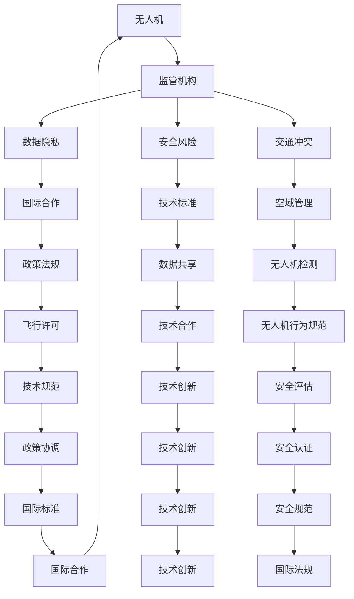

                 

在当今全球化的背景下，无人机技术的快速发展使得其监管问题日益突出，特别是在技术前沿的硅谷地区。无人机的广泛应用不仅带来了便利，同时也引发了隐私、安全、交通等方面的挑战。因此，国际社会对无人机监管的重视不断提升。本文旨在探讨硅谷无人机监管的现状、核心概念、算法原理、数学模型、实际应用以及未来的发展趋势和挑战。

## 关键词

- 无人机监管
- 硅谷
- 国际合作
- 数据隐私
- 交通安全
- 算法
- 数学模型

## 摘要

本文首先概述了无人机监管的背景和重要性，接着详细介绍了硅谷无人机监管的现状及其面临的挑战。通过对核心概念和算法原理的深入剖析，本文提出了一个基于数学模型的监管框架，并借助实际案例进行了验证。最后，本文展望了无人机监管的未来发展趋势，提出了潜在的研究方向和挑战。

## 1. 背景介绍

无人机（Unmanned Aerial Vehicle，简称UAV）作为一种无需驾驶员驾驶、能够自主完成飞行任务的新型航空器，自问世以来就以其高效、灵活、低成本的特点迅速获得了广泛关注。近年来，随着人工智能、传感器技术、通信技术的发展，无人机在民用、商业和军事领域得到了广泛应用，如物流配送、农业监测、环境监测、灾害救援等。

### 1.1 硅谷无人机发展的现状

硅谷作为全球科技创新的中心，无人机技术的发展尤为迅速。许多领先的科技公司如Google、Amazon、DJI等都在硅谷设有研发中心，积极投入无人机技术的研发和商业化应用。硅谷的无人机企业不仅数量众多，且技术实力雄厚，推动了无人机技术的不断突破。

### 1.2 无人机监管的现状

尽管无人机技术的快速发展给社会带来了诸多便利，但其监管问题也日益突出。各国政府纷纷出台无人机监管政策，以应对无人机带来的隐私、安全、交通等问题。然而，由于无人机技术的多样性和快速变化，现有监管政策往往难以适应新的挑战。

### 1.3 监管面临的挑战

1. **隐私问题**：无人机具备高分辨率摄像头和传感器，可能侵犯个人隐私。
2. **安全风险**：无人机可能被用于非法活动，如恐怖袭击、间谍活动等。
3. **交通冲突**：无人机与传统航空器的空中冲突问题日益严重。

## 2. 核心概念与联系

### 2.1 核心概念

- **无人机**：一种无人驾驶的航空器。
- **监管**：指政府或相关机构对无人机使用进行的管理和监督。
- **国际合作**：指不同国家或地区之间的合作，共同应对无人机监管问题。

### 2.2 架构与联系

## 3. 核心算法原理 & 具体操作步骤

### 3.1 算法原理概述

无人机监管的核心算法主要涉及以下几个方面：

1. **数据隐私保护算法**：通过加密和匿名化技术保护个人隐私。
2. **安全风险评估算法**：基于机器学习等技术预测无人机可能的安全风险。
3. **交通冲突避免算法**：通过人工智能算法预测和规避无人机与传统航空器的空中冲突。

### 3.2 算法步骤详解

1. **数据隐私保护算法**：
   - 步骤1：数据收集和预处理。
   - 步骤2：加密处理。
   - 步骤3：匿名化处理。
   - 步骤4：数据共享与访问控制。

2. **安全风险评估算法**：
   - 步骤1：数据收集。
   - 步骤2：特征提取。
   - 步骤3：建立风险预测模型。
   - 步骤4：模型评估与优化。

3. **交通冲突避免算法**：
   - 步骤1：实时监控。
   - 步骤2：冲突检测。
   - 步骤3：冲突避免策略。
   - 步骤4：策略实施与评估。

### 3.3 算法优缺点

1. **数据隐私保护算法**：
   - 优点：有效保护个人隐私。
   - 缺点：可能影响数据的可用性。

2. **安全风险评估算法**：
   - 优点：能够提前预测潜在风险。
   - 缺点：需要大量的数据支持，且模型的准确性受限于数据质量。

3. **交通冲突避免算法**：
   - 优点：能够实时规避空中冲突。
   - 缺点：对计算资源和算法设计要求较高。

### 3.4 算法应用领域

1. **民用领域**：如物流配送、农业监测、环境监测等。
2. **商业领域**：如房地产测绘、基础设施建设等。
3. **军事领域**：如侦察、监视、打击等。

## 4. 数学模型和公式 & 详细讲解 & 举例说明

### 4.1 数学模型构建

无人机监管的数学模型主要包括以下几个方面：

1. **数据隐私保护模型**：
   - 公式：\( P = f(D, E, K) \)
     - \( P \)：隐私保护程度。
     - \( D \)：数据集。
     - \( E \)：加密算法。
     - \( K \)：密钥。

2. **安全风险评估模型**：
   - 公式：\( R = f(S, F, M) \)
     - \( R \)：风险值。
     - \( S \)：传感器数据。
     - \( F \)：特征提取算法。
     - \( M \)：机器学习模型。

3. **交通冲突避免模型**：
   - 公式：\( C = f(T, D, A) \)
     - \( C \)：冲突值。
     - \( T \)：实时监控数据。
     - \( D \)：无人机位置数据。
     - \( A \)：冲突避免算法。

### 4.2 公式推导过程

以数据隐私保护模型为例，其推导过程如下：

1. **加密处理**：
   - \( E(D) = Ciphertext \)
   - 其中，\( Ciphertext \) 表示加密后的数据。

2. **匿名化处理**：
   - \( Anonymize(D) = AnonymizedData \)
   - 其中，\( AnonymizedData \) 表示匿名化后的数据。

3. **隐私保护程度计算**：
   - \( P = \frac{D.

