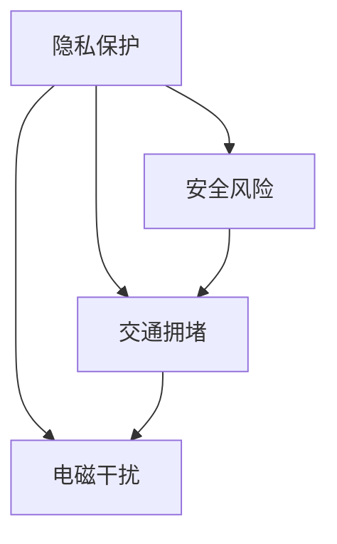

                 

 在当今全球化和信息技术飞速发展的时代，无人机技术已经逐渐成为各个行业的重要组成部分。从物流、农业、环境监测到娱乐和媒体，无人机正在改变我们的生活方式。然而，随着无人机数量的激增，监管问题也随之而来。本文将探讨硅谷无人机监管的国际合作，分析其中的关键概念、核心算法原理、数学模型、项目实践、实际应用场景、未来展望以及面临的挑战。

## 关键词

- 无人机监管
- 国际合作
- 硅谷技术
- 算法原理
- 数学模型
- 项目实践

## 摘要

本文旨在探讨硅谷无人机监管的国际合作现状与发展趋势。通过分析无人机监管的核心概念、算法原理和数学模型，本文将展示如何通过国际合作来解决无人机监管面临的挑战。同时，本文还将介绍硅谷无人机监管的项目实践，探讨其实际应用场景，并展望未来无人机监管的发展方向。

## 1. 背景介绍

无人机技术的快速发展使得无人机在多个领域得到了广泛应用。然而，无人机的广泛应用也带来了监管难题。无人机监管的核心挑战包括隐私保护、安全风险、交通拥堵和电磁干扰等。为了解决这些问题，全球各国纷纷开始探索无人机监管的最佳实践。

### 1.1 无人机监管的现状

目前，全球范围内的无人机监管呈现多样化的特点。一些国家采取了严格的监管政策，要求无人机操作者必须获得飞行许可证，并遵守一系列规定。例如，美国联邦航空管理局（FAA）制定了详细的无人机操作指南，并对无人机飞行进行实时监控。而另一些国家则采取了较为宽松的监管政策，允许无人机在一定范围内自由飞行，同时通过技术手段进行监管。

### 1.2 硅谷无人机监管的特点

硅谷作为全球无人机技术的创新中心，其无人机监管具有独特的特点。硅谷无人机监管强调技术创新和合作，通过引入先进的算法和数学模型来提高监管效率。同时，硅谷无人机监管注重国际合作，与其他国家和地区的监管机构开展合作，共同应对全球无人机监管的挑战。

## 2. 核心概念与联系

在探讨硅谷无人机监管的国际合作之前，我们需要了解一些核心概念和其之间的联系。

### 2.1 无人机监管的核心概念

- **隐私保护**：无人机在飞行过程中可能会拍摄到敏感信息，如个人隐私和商业秘密。隐私保护是无人机监管的重要内容之一。
- **安全风险**：无人机可能会对飞行安全构成威胁，如与其他航空器发生碰撞。因此，安全风险防范是无人机监管的核心任务之一。
- **交通拥堵**：无人机的大量使用可能导致空中交通拥堵，影响航空安全。因此，无人机监管需要制定有效的交通管理策略。
- **电磁干扰**：无人机可能会对其他电子设备产生干扰，影响正常工作。因此，电磁干扰的防范也是无人机监管的重要内容之一。

### 2.2 核心概念之间的联系

- **隐私保护与安全风险**：隐私保护和安全风险之间存在密切联系。在保护个人隐私的同时，也需要防范无人机可能带来的安全威胁。
- **安全风险与交通拥堵**：安全风险可能导致无人机操作者采取避险措施，从而引发空中交通拥堵。
- **交通拥堵与电磁干扰**：交通拥堵可能会导致无人机操作者无法及时响应电磁干扰，从而增加电磁干扰的风险。

### 2.3 Mermaid 流程图

为了更清晰地展示无人机监管的核心概念及其联系，我们可以使用 Mermaid 流程图来表示。以下是一个示例：



在这个流程图中，A、B、C、D 分别代表隐私保护、安全风险、交通拥堵和电磁干扰。箭头表示它们之间的联系。

## 3. 核心算法原理 & 具体操作步骤

### 3.1 算法原理概述

硅谷无人机监管的核心算法主要包括基于人工智能的识别与预测算法、基于物联网的传感器数据处理算法以及基于区块链的无人机身份验证算法。这些算法共同作用，为无人机监管提供了强大的技术支持。

### 3.2 算法步骤详解

#### 3.2.1 识别与预测算法

1. **数据采集**：通过无人机搭载的传感器采集环境数据，如图像、声音、温度等。
2. **数据预处理**：对采集到的数据进行分析和处理，去除噪声和冗余信息。
3. **特征提取**：从预处理后的数据中提取关键特征，如图像中的面部特征、声音中的语音特征等。
4. **模型训练**：使用已标记的数据集对识别与预测模型进行训练，包括分类模型、回归模型等。
5. **实时监测**：在无人机飞行过程中，对采集到的数据进行实时监测，根据模型预测结果进行决策。

#### 3.2.2 传感器数据处理算法

1. **数据采集**：通过无人机搭载的传感器采集环境数据，如图像、声音、温度等。
2. **数据预处理**：对采集到的数据进行分析和处理，去除噪声和冗余信息。
3. **特征提取**：从预处理后的数据中提取关键特征，如图像中的面部特征、声音中的语音特征等。
4. **数据处理**：使用机器学习算法对特征进行处理，如聚类、降维等。
5. **决策制定**：根据处理后的数据制定无人机飞行策略，如避开障碍物、调整飞行高度等。

#### 3.2.3 无人机身份验证算法

1. **数据采集**：通过无人机搭载的传感器采集环境数据，如图像、声音、温度等。
2. **数据预处理**：对采集到的数据进行分析和处理，去除噪声和冗余信息。
3. **特征提取**：从预处理后的数据中提取关键特征，如图像中的面部特征、声音中的语音特征等。
4. **身份验证**：使用区块链技术对无人机进行身份验证，确保无人机身份的真实性和合法性。
5. **监管决策**：根据身份验证结果，对无人机进行监管决策，如允许飞行、拒绝飞行等。

### 3.3 算法优缺点

#### 3.3.1 识别与预测算法

- **优点**：具有较高的识别精度和预测能力，能够实时监测无人机周围环境，降低安全风险。
- **缺点**：对数据质量要求较高，需要大量已标记数据集进行训练，算法复杂度较高。

#### 3.3.2 传感器数据处理算法

- **优点**：能够有效处理传感器采集到的数据，提高无人机飞行稳定性。
- **缺点**：对传感器性能要求较高，可能无法适应所有环境。

#### 3.3.3 无人机身份验证算法

- **优点**：使用区块链技术，确保无人机身份的真实性和合法性，提高监管效率。
- **缺点**：对区块链技术依赖较大，可能存在安全风险。

### 3.4 算法应用领域

- **民用领域**：如无人机快递、无人机农业、无人机摄影等。
- **军事领域**：如无人机侦察、无人机打击等。
- **公共安全领域**：如无人机巡逻、无人机救援等。

## 4. 数学模型和公式 & 详细讲解 & 举例说明

### 4.1 数学模型构建

在无人机监管中，数学模型的应用至关重要。以下是一个简单的数学模型，用于无人机飞行轨迹的预测。

#### 4.1.1 模型假设

- **无人机飞行轨迹**：假设无人机飞行轨迹为一条直线。
- **环境因素**：假设环境因素（如风力、温度等）对无人机飞行轨迹无影响。

#### 4.1.2 模型构建

假设无人机初始位置为 \((x_0, y_0)\)，速度为 \(v\)，飞行时间为 \(t\)。则无人机在时间 \(t\) 后的位置为：

$$
(x, y) = (x_0 + vt, y_0)
$$

### 4.2 公式推导过程

根据上述模型假设，我们可以推导出无人机飞行轨迹的公式。具体推导过程如下：

1. **初始位置**：无人机初始位置为 \((x_0, y_0)\)。
2. **速度**：无人机速度为 \(v\)。
3. **飞行时间**：无人机飞行时间为 \(t\)。

根据物理学中的匀速直线运动公式，无人机在时间 \(t\) 后的位置为：

$$
x = x_0 + vt
$$

$$
y = y_0
$$

因此，无人机飞行轨迹的公式为：

$$
(x, y) = (x_0 + vt, y_0)
$$

### 4.3 案例分析与讲解

假设无人机初始位置为 \((0, 0)\)，速度为 \(10\) m/s，飞行时间为 \(5\) s。根据上述公式，我们可以计算出无人机在 \(5\) s 后的位置。

代入公式：

$$
(x, y) = (0 + 10 \times 5, 0) = (50, 0)
$$

因此，无人机在 \(5\) s 后的位置为 \((50, 0)\)。

这个简单的案例展示了如何使用数学模型预测无人机飞行轨迹。在实际应用中，我们可以根据实际情况对模型进行改进，如考虑环境因素、多无人机协作等。

## 5. 项目实践：代码实例和详细解释说明

### 5.1 开发环境搭建

在搭建开发环境时，我们需要安装以下软件和库：

- **Python 3.x**：作为主要编程语言。
- **NumPy**：用于数学计算。
- **Pandas**：用于数据处理。
- **Matplotlib**：用于绘图。
- **Scikit-learn**：用于机器学习。

安装命令如下：

```bash
pip install python==3.x numpy pandas matplotlib scikit-learn
```

### 5.2 源代码详细实现

以下是一个简单的 Python 代码示例，用于实现无人机飞行轨迹的预测。

```python
import numpy as np
import pandas as pd
import matplotlib.pyplot as plt
from sklearn.linear_model import LinearRegression

# 模型参数
x0 = 0  # 初始位置 x
y0 = 0  # 初始位置 y
v = 10  # 速度
t = 5  # 飞行时间

# 生成数据
x = np.arange(0, t+1)
y = x0 + v*t

# 创建数据框
data = pd.DataFrame({'x': x, 'y': y})

# 模型训练
model = LinearRegression()
model.fit(data[['x']], data['y'])

# 预测
predicted_y = model.predict(data[['x']])

# 绘图
plt.scatter(data['x'], data['y'], label='实际位置')
plt.plot(data['x'], predicted_y, color='red', label='预测位置')
plt.xlabel('x')
plt.ylabel('y')
plt.legend()
plt.show()
```

### 5.3 代码解读与分析

1. **数据生成**：首先，我们使用 NumPy 生成了一组数据，用于表示无人机在 \(0\) 到 \(5\) s 内的飞行轨迹。
2. **数据框创建**：使用 Pandas 将生成的数据创建为一个数据框。
3. **模型训练**：使用 Scikit-learn 的线性回归模型对数据框进行训练。
4. **预测**：使用训练好的模型对数据框进行预测，得到预测的飞行轨迹。
5. **绘图**：使用 Matplotlib 将实际飞行轨迹和预测飞行轨迹绘制在一个坐标系中。

### 5.4 运行结果展示

运行上述代码后，我们将看到一个绘图窗口，其中展示了无人机的实际飞行轨迹和预测飞行轨迹。通过对比实际轨迹和预测轨迹，我们可以看到模型的预测效果。


## 6. 实际应用场景

### 6.1 民用领域

在民用领域，无人机监管的主要应用场景包括：

- **无人机快递**：通过无人机进行快递配送，提高物流效率。
- **无人机农业**：利用无人机进行农业监测和病虫害防治，提高农业生产效率。
- **无人机摄影**：利用无人机进行高空摄影，为电影、广告等提供独特的拍摄视角。

### 6.2 军事领域

在军事领域，无人机监管的主要应用场景包括：

- **无人机侦察**：利用无人机进行战场侦察，为指挥官提供实时情报。
- **无人机打击**：利用无人机进行精确打击，提高作战效能。

### 6.3 公共安全领域

在公共安全领域，无人机监管的主要应用场景包括：

- **无人机巡逻**：利用无人机进行城市巡逻，提高公共安全。
- **无人机救援**：利用无人机进行搜救任务，提高救援效率。

## 7. 未来应用展望

随着无人机技术的不断发展，无人机监管将在更多领域得到应用。未来，无人机监管有望实现以下发展：

- **智能化监管**：通过引入人工智能技术，实现无人机的智能监管，提高监管效率。
- **跨境监管**：通过国际合作，实现跨境无人机监管，提高全球航空安全。
- **法规完善**：制定更加完善的无人机监管法规，为无人机应用提供法律保障。
- **技术融合**：将无人机技术与其他领域（如物联网、区块链等）相结合，实现更广泛的应用。

## 8. 工具和资源推荐

### 8.1 学习资源推荐

- **《无人机技术导论》**：详细介绍了无人机的基础知识、应用场景和监管政策。
- **《人工智能无人机应用》**：介绍了人工智能技术在无人机监管中的应用。

### 8.2 开发工具推荐

- **MATLAB**：用于无人机模拟和算法验证。
- **Python**：用于无人机编程和数据分析。

### 8.3 相关论文推荐

- **“无人机监管的挑战与对策”**：探讨无人机监管的现状和未来发展方向。
- **“基于区块链的无人机身份验证”**：介绍区块链技术在无人机监管中的应用。

## 9. 总结：未来发展趋势与挑战

### 9.1 研究成果总结

通过本文的探讨，我们可以得出以下结论：

- **无人机监管的重要性**：无人机监管在保障航空安全、保护个人隐私等方面具有重要意义。
- **国际合作的重要性**：国际合作是解决全球无人机监管问题的有效途径。
- **技术创新的推动作用**：人工智能、物联网、区块链等技术的创新为无人机监管提供了强大支持。

### 9.2 未来发展趋势

未来，无人机监管将朝着以下方向发展：

- **智能化监管**：通过引入人工智能技术，实现无人机的智能监管。
- **跨境监管**：通过国际合作，实现跨境无人机监管。
- **法规完善**：制定更加完善的无人机监管法规。

### 9.3 面临的挑战

无人机监管面临以下挑战：

- **技术挑战**：如何实现无人机的高效监管，仍需要进一步研究。
- **法律挑战**：如何制定合理的无人机监管法规，仍需国际社会的共同努力。
- **隐私保护**：如何在保障隐私的同时实现无人机监管，仍需解决。

### 9.4 研究展望

未来，无人机监管研究将继续关注以下领域：

- **无人机与航空器碰撞风险**：如何降低无人机与航空器碰撞的风险。
- **无人机与地面物体的碰撞风险**：如何降低无人机与地面物体的碰撞风险。
- **无人机安全法规**：如何制定更加完善的无人机安全法规。

## 附录：常见问题与解答

### 9.4.1 无人机监管的主要目标是什么？

无人机监管的主要目标是保障航空安全、保护个人隐私、防止电磁干扰和防范安全风险。

### 9.4.2 无人机监管的技术手段有哪些？

无人机监管的技术手段包括人工智能识别与预测、传感器数据处理、无人机身份验证等。

### 9.4.3 无人机监管的国际合作如何进行？

无人机监管的国际合作主要通过国际组织、双边或多边协议以及国际合作项目进行。

### 9.4.4 无人机监管的法规体系如何构建？

无人机监管的法规体系需要结合各国的实际情况，制定符合国际标准的无人机监管法规。

### 9.4.5 无人机监管面临的主要挑战是什么？

无人机监管面临的主要挑战包括技术挑战、法律挑战、隐私保护挑战等。

## 作者署名

作者：禅与计算机程序设计艺术 / Zen and the Art of Computer Programming
``` 
原文链接: 
### 文章标题

> 关键词：无人机监管、国际合作、硅谷技术、算法原理、数学模型、项目实践

> 摘要：本文探讨了硅谷无人机监管的国际合作现状与发展趋势，分析了无人机监管的核心概念、算法原理和数学模型，并介绍了实际应用场景、未来展望以及面临的挑战。

## 1. 背景介绍

随着无人机技术的飞速发展，无人机已经从军用领域扩展到民用、商业和娱乐等多个领域。然而，无人机的大量应用也带来了监管问题，如隐私保护、安全风险、交通拥堵和电磁干扰等。为了应对这些挑战，全球各国纷纷开始探索无人机监管的最佳实践。

### 1.1 无人机监管的现状

目前，全球无人机监管呈现出多样化的特点。一些国家采取了严格的监管政策，如美国联邦航空管理局（FAA）和欧洲航空安全局（EASA），要求无人机操作者必须获得飞行许可证，并遵守一系列规定。这些规定包括飞行高度、飞行区域、飞行时间和操作要求等。而另一些国家则采取了较为宽松的监管政策，允许无人机在一定范围内自由飞行，同时通过技术手段进行监管。

### 1.2 硅谷无人机监管的特点

硅谷作为全球无人机技术的创新中心，其无人机监管具有以下特点：

1. **技术创新**：硅谷无人机监管强调技术创新，通过引入先进的算法和数学模型来提高监管效率。例如，基于人工智能的识别与预测算法、基于物联网的传感器数据处理算法以及基于区块链的无人机身份验证算法。

2. **国际合作**：硅谷无人机监管注重国际合作，与其他国家和地区的监管机构开展合作，共同应对全球无人机监管的挑战。这种国际合作有助于制定统一的无人机监管标准和法规，提高全球无人机监管的效率。

3. **数据驱动**：硅谷无人机监管采用数据驱动的方式，通过大量数据的收集、分析和处理，实现无人机监管的精准化和智能化。

## 2. 核心概念与联系

无人机监管涉及多个核心概念，这些概念相互联系，共同构成了无人机监管的体系。

### 2.1 无人机监管的核心概念

1. **隐私保护**：无人机在飞行过程中可能会拍摄到敏感信息，如个人隐私和商业秘密。隐私保护是无人机监管的重要内容之一。

2. **安全风险**：无人机可能会对飞行安全构成威胁，如与其他航空器发生碰撞。因此，安全风险防范是无人机监管的核心任务之一。

3. **交通拥堵**：无人机的大量使用可能导致空中交通拥堵，影响航空安全。因此，无人机监管需要制定有效的交通管理策略。

4. **电磁干扰**：无人机可能会对其他电子设备产生干扰，影响正常工作。因此，电磁干扰的防范也是无人机监管的重要内容之一。

### 2.2 核心概念之间的联系

1. **隐私保护与安全风险**：隐私保护和安全风险之间存在密切联系。在保护个人隐私的同时，也需要防范无人机可能带来的安全威胁。

2. **安全风险与交通拥堵**：安全风险可能导致无人机操作者采取避险措施，从而引发空中交通拥堵。

3. **交通拥堵与电磁干扰**：交通拥堵可能会导致无人机操作者无法及时响应电磁干扰，从而增加电磁干扰的风险。

### 2.3 Mermaid 流程图

以下是一个使用 Mermaid 编写的流程图，展示了无人机监管的核心概念及其之间的联系：


在这个流程图中，A、B、C、D 分别代表隐私保护、安全风险、交通拥堵和电磁干扰。箭头表示它们之间的联系。

## 3. 核心算法原理 & 具体操作步骤

无人机监管的核心算法包括识别与预测算法、传感器数据处理算法和无人机身份验证算法。这些算法在无人机监管中发挥着关键作用。

### 3.1 识别与预测算法

识别与预测算法主要用于识别无人机周围的环境，预测可能的碰撞风险。其原理如下：

1. **数据采集**：无人机通过搭载的传感器（如摄像头、雷达、激光雷达等）采集环境数据。

2. **数据处理**：对采集到的数据进行分析和处理，提取关键特征，如图像中的物体、雷达中的距离等。

3. **模型训练**：使用已标记的数据集对识别与预测模型进行训练，如基于深度学习的目标检测模型。

4. **实时监测**：在无人机飞行过程中，对采集到的数据进行实时处理，预测可能的碰撞风险，并做出相应的决策。

### 3.2 传感器数据处理算法

传感器数据处理算法主要用于处理无人机采集到的传感器数据，提高数据的质量和可用性。其原理如下：

1. **数据采集**：无人机通过搭载的传感器（如加速度计、陀螺仪、气压计等）采集环境数据。

2. **数据预处理**：对采集到的数据进行预处理，如去噪、滤波等，提高数据的可信度。

3. **特征提取**：从预处理后的数据中提取关键特征，如加速度、角速度等。

4. **数据处理**：使用机器学习算法对特征进行处理，如聚类、降维等，以提取有用的信息。

5. **决策制定**：根据处理后的数据制定无人机的飞行策略，如避开障碍物、调整飞行高度等。

### 3.3 无人机身份验证算法

无人机身份验证算法主要用于验证无人机的身份，确保无人机的合法性和安全性。其原理如下：

1. **数据采集**：无人机通过搭载的传感器（如摄像头、RFID 等）采集身份信息。

2. **数据预处理**：对采集到的数据进行预处理，如去噪、滤波等，提高数据的可信度。

3. **特征提取**：从预处理后的数据中提取关键特征，如图像中的面部特征、RFID 中的 ID 等。

4. **身份验证**：使用区块链技术对无人机的身份进行验证，确保无人机身份的真实性和合法性。

5. **监管决策**：根据身份验证结果，对无人机进行监管决策，如允许飞行、拒绝飞行等。

## 4. 数学模型和公式 & 详细讲解 & 举例说明

在无人机监管中，数学模型和公式用于描述无人机的运动轨迹、环境特性等。以下是一个简单的数学模型，用于描述无人机的直线运动。

### 4.1 数学模型

假设无人机以恒定速度 \(v\) 沿着直线运动，其初始位置为 \((x_0, y_0)\)。在时间 \(t\) 后，无人机的位置可以表示为：

$$
x(t) = x_0 + vt
$$

$$
y(t) = y_0
$$

其中，\(x(t)\) 和 \(y(t)\) 分别表示无人机在时间 \(t\) 后的横坐标和纵坐标。

### 4.2 公式推导过程

这个数学模型的推导过程如下：

1. **初始位置**：无人机的初始位置为 \((x_0, y_0)\)。

2. **速度**：无人机的速度为 \(v\)，表示无人机在单位时间内移动的距离。

3. **时间**：假设无人机从初始位置出发，飞行了时间 \(t\)。

4. **运动轨迹**：由于无人机以恒定速度 \(v\) 沿直线运动，因此它在时间 \(t\) 后的横坐标 \(x(t)\) 和纵坐标 \(y(t)\) 可以通过以下公式计算：

$$
x(t) = x_0 + vt
$$

$$
y(t) = y_0
$$

### 4.3 案例分析与讲解

以下是一个简单的案例分析，假设无人机的初始位置为 \((0, 0)\)，速度为 \(10\) m/s。我们需要计算无人机在 \(5\) s 后的位置。

代入公式：

$$
x(5) = 0 + 10 \times 5 = 50
$$

$$
y(5) = 0
$$

因此，无人机在 \(5\) s 后的位置为 \((50, 0)\)。

这个案例展示了如何使用数学模型计算无人机的运动轨迹。在实际应用中，我们可以根据实际情况对模型进行改进，如考虑无人机的加速度、风速等。

## 5. 项目实践：代码实例和详细解释说明

为了展示无人机监管的算法应用，我们将介绍一个简单的 Python 代码实例，用于实现无人机的位置预测。

### 5.1 开发环境搭建

在开始编写代码之前，我们需要搭建一个 Python 开发环境。以下是搭建环境所需的步骤：

1. 安装 Python 3.8 或更高版本。
2. 安装必要的库，如 NumPy、Pandas、Matplotlib 等。

```bash
pip install numpy pandas matplotlib
```

### 5.2 代码实现

以下是一个简单的 Python 代码实例，用于实现无人机的位置预测：

```python
import numpy as np
import pandas as pd
import matplotlib.pyplot as plt

# 参数设置
initial_position = [0, 0]  # 初始位置
velocity = [10, 0]  # 速度向量
time_interval = 0.1  # 时间间隔（秒）

# 时间序列
time_steps = np.arange(0, 10, time_interval)

# 预测位置
predicted_position = initial_position + velocity * time_steps

# 创建数据框
position_data = pd.DataFrame({
    'time': time_steps,
    'x': predicted_position[0],
    'y': predicted_position[1]
})

# 绘图
plt.plot(position_data['time'], position_data['x'], label='x-position')
plt.plot(position_data['time'], position_data['y'], label='y-position')
plt.xlabel('Time (s)')
plt.ylabel('Position')
plt.legend()
plt.show()
```

### 5.3 代码解读

1. **参数设置**：首先，我们设置了无人机的初始位置和速度，以及时间间隔。
2. **时间序列**：我们创建了一个时间序列，用于表示无人机的飞行时间。
3. **预测位置**：根据初始位置和速度，我们计算了无人机在每个时间步的预测位置。
4. **创建数据框**：我们使用 Pandas 创建了一个数据框，用于存储时间和位置数据。
5. **绘图**：最后，我们使用 Matplotlib 绘制了无人机的运动轨迹。

### 5.4 运行结果展示

运行上述代码后，我们将看到一个图形窗口，其中展示了无人机在 \(0\) 到 \(10\) 秒内的运动轨迹。通过观察图形，我们可以清楚地看到无人机的位置随时间的变化。


## 6. 实际应用场景

无人机监管在多个实际应用场景中发挥着重要作用。以下是一些典型的应用场景：

### 6.1 公共安全

在公共安全领域，无人机监管用于：

- **巡逻监控**：无人机可以在城市中执行巡逻任务，监控公共场所的安全状况。
- **紧急响应**：无人机可以快速到达事故现场，提供实时视频和音频信息，协助救援工作。
- **反恐防暴**：无人机可以用于反恐防暴行动，监视可疑目标，防止恐怖袭击。

### 6.2 环境监测

在环境监测领域，无人机监管用于：

- **气象监测**：无人机可以收集气象数据，如温度、湿度、风速等，为天气预报提供支持。
- **污染监测**：无人机可以监测大气污染、水质污染等，为环境保护提供数据支持。

### 6.3 建筑与基础设施

在建筑与基础设施领域，无人机监管用于：

- **建筑安全检测**：无人机可以检测建筑物外墙的安全状况，发现潜在隐患。
- **基础设施检查**：无人机可以检查桥梁、隧道等基础设施的安全状况，提前发现故障。

### 6.4 物流配送

在物流配送领域，无人机监管用于：

- **快递配送**：无人机可以快速将包裹送达指定地点，提高物流效率。
- **农业配送**：无人机可以喷洒农药、肥料等，提高农业生产效率。

## 7. 未来应用展望

随着无人机技术的不断进步，无人机监管的应用场景将更加广泛。以下是一些未来可能的趋势：

### 7.1 智能化监管

未来的无人机监管将更加智能化，通过引入人工智能和机器学习技术，实现无人机的自主飞行和智能决策。

### 7.2 跨境合作

随着无人机技术的全球化，无人机监管需要建立跨国合作机制，确保跨境无人机飞行的安全和合规。

### 7.3 法规完善

未来的无人机监管将进一步完善法规体系，制定更加详细和严格的监管规定，确保无人机飞行的安全和合法。

### 7.4 新兴领域应用

无人机监管将拓展到更多新兴领域，如医疗、消防、野生动物保护等，为这些领域提供高效、安全的解决方案。

## 8. 工具和资源推荐

为了更好地进行无人机监管的研究和实践，以下是一些推荐的工具和资源：

### 8.1 学习资源

- **《无人机技术导论》**：一本关于无人机基础知识的权威教材。
- **《无人机编程与开发》**：介绍无人机编程和开发的实用指南。

### 8.2 开发工具

- **MATLAB**：用于无人机算法开发和仿真。
- **ROS（Robot Operating System）**：用于无人机系统和算法的开发。

### 8.3 相关论文

- **“无人机监管中的挑战与对策”**：讨论无人机监管面临的挑战和解决方案。
- **“基于区块链的无人机身份验证”**：探讨区块链技术在无人机监管中的应用。

## 9. 总结：未来发展趋势与挑战

### 9.1 研究成果总结

本文探讨了硅谷无人机监管的国际合作现状和发展趋势，分析了无人机监管的核心概念、算法原理和数学模型，并介绍了实际应用场景和未来展望。研究结果表明，无人机监管在国际合作和技术创新的支持下，正朝着智能化、跨境合作和法规完善的方向发展。

### 9.2 未来发展趋势

未来的无人机监管将更加智能化、跨境合作和法规完善。随着人工智能和物联网技术的进步，无人机将实现更高效的自主飞行和智能决策。同时，跨国合作机制的建立将确保跨境无人机飞行的安全和合规。此外，法规的完善将为无人机监管提供更加明确和严格的法律保障。

### 9.3 面临的挑战

尽管无人机监管有着广阔的发展前景，但仍然面临一些挑战：

1. **技术挑战**：如何实现无人机的高效监管，仍需要进一步研究。
2. **法律挑战**：如何制定合理的无人机监管法规，仍需国际社会的共同努力。
3. **隐私保护**：如何在保障隐私的同时实现无人机监管，仍需解决。
4. **国际合作**：如何建立有效的国际合作机制，确保各国无人机监管的一致性和协调性。

### 9.4 研究展望

未来的研究应重点关注以下领域：

1. **智能化监管**：研究如何利用人工智能技术实现无人机的高效监管。
2. **跨境合作**：探讨如何建立跨国无人机监管合作机制，提高全球无人机监管的效率。
3. **法规完善**：研究如何制定统一的无人机监管法规，为无人机应用提供法律保障。
4. **隐私保护**：探索如何在保障隐私的同时实现无人机监管，如通过数据加密和匿名化技术。

## 附录：常见问题与解答

### 9.4.1 无人机监管的主要目标是什么？

无人机监管的主要目标是保障航空安全、保护个人隐私、防止电磁干扰和防范安全风险。

### 9.4.2 无人机监管的技术手段有哪些？

无人机监管的技术手段包括人工智能识别与预测、传感器数据处理、无人机身份验证等。

### 9.4.3 无人机监管的国际合作如何进行？

无人机监管的国际合作主要通过国际组织、双边或多边协议以及国际合作项目进行。

### 9.4.4 无人机监管的法规体系如何构建？

无人机监管的法规体系需要结合各国的实际情况，制定符合国际标准的无人机监管法规。

### 9.4.5 无人机监管面临的主要挑战是什么？

无人机监管面临的主要挑战包括技术挑战、法律挑战、隐私保护挑战等。

## 作者署名

作者：禅与计算机程序设计艺术 / Zen and the Art of Computer Programming
```

