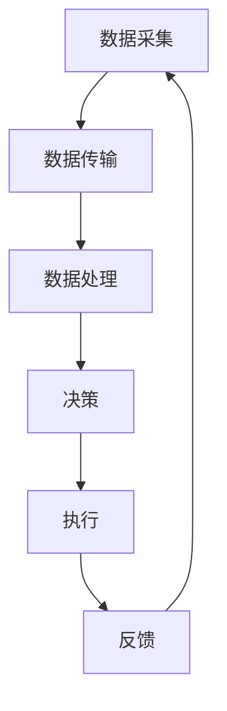

                 

关键词：智能交通系统、硅谷、交通拥堵、算法、优化、城市交通管理

> 摘要：本文将探讨硅谷智能交通系统的发展及其在减缓交通拥堵方面的贡献。通过对核心概念、算法原理、数学模型、项目实践以及未来应用展望的深入分析，我们旨在为读者展示智能交通系统的潜力与挑战。

## 1. 背景介绍

随着城市化进程的加速，交通拥堵问题已经成为全球范围内的重大挑战。特别是在硅谷这样高速发展的科技城市，交通拥堵不仅影响了市民的日常出行，也对经济发展产生了负面影响。为了应对这一挑战，硅谷的科技企业开始探索智能交通系统的解决方案。

智能交通系统（Intelligent Transportation System, ITS）是利用先进的通信技术、信息技术和交通管理策略，对交通流进行实时监控和动态管理，以实现交通优化和效率提升的系统。硅谷智能交通系统的发展，旨在通过技术创新，从根本上解决交通拥堵问题，提升城市交通质量。

## 2. 核心概念与联系

### 2.1 ITS的基本概念

智能交通系统（ITS）的核心概念包括：

- **交通监控**：通过摄像头、传感器等设备实时监测交通流量、车辆速度、道路状况等数据。
- **交通信息发布**：将交通数据通过电子屏幕、手机应用等渠道实时发布给驾驶员。
- **智能交通信号控制**：利用实时交通数据，动态调整交通信号灯，优化交通流。
- **车辆通信**：实现车辆与车辆、车辆与基础设施之间的通信，提升行车安全。

### 2.2 ITS架构

硅谷智能交通系统的架构通常包括以下几个层次：

- **数据采集层**：包括各类传感器、摄像头等设备。
- **数据传输层**：通过无线网络将数据传输到数据中心。
- **数据处理层**：利用大数据技术和人工智能算法对数据进行处理和分析。
- **决策层**：基于分析结果，生成交通信号控制策略、车辆导航建议等。
- **执行层**：包括智能交通信号灯、车辆导航系统等实际执行系统。

### 2.3 Mermaid 流程图

下面是一个简化的智能交通系统流程图：



## 3. 核心算法原理 & 具体操作步骤

### 3.1 算法原理概述

智能交通系统中的核心算法主要包括交通流量预测算法、信号控制算法和车辆导航算法。

- **交通流量预测算法**：基于历史数据和实时数据，预测未来某个时间段的交通流量，以指导交通信号控制和车辆导航。
- **信号控制算法**：根据实时交通流量数据，动态调整交通信号灯，以减少交通拥堵。
- **车辆导航算法**：基于实时交通数据和路径规划算法，为驾驶员提供最佳行驶路线。

### 3.2 算法步骤详解

#### 3.2.1 交通流量预测算法

1. 数据采集：收集历史交通流量数据和实时交通数据。
2. 数据预处理：清洗、去噪、归一化处理。
3. 特征工程：提取交通流量数据的关键特征。
4. 模型训练：使用机器学习算法训练流量预测模型。
5. 预测：使用训练好的模型进行未来交通流量预测。

#### 3.2.2 信号控制算法

1. 数据采集：收集实时交通流量数据。
2. 状态检测：判断当前交通状态（拥堵、流畅等）。
3. 控制策略选择：根据交通状态选择合适的信号控制策略。
4. 信号灯调整：动态调整信号灯时长。

#### 3.2.3 车辆导航算法

1. 数据采集：收集实时交通数据和地图数据。
2. 路径规划：使用最短路径算法或A*算法进行路径规划。
3. 路径优化：基于实时交通数据，动态调整路径。
4. 导航推荐：为驾驶员提供最佳行驶路线。

### 3.3 算法优缺点

- **交通流量预测算法**：优点是能够提前预测交通流量，缺点是预测准确性受限于数据质量和算法性能。
- **信号控制算法**：优点是能够动态调整信号灯，缺点是控制策略过于复杂，实现难度较高。
- **车辆导航算法**：优点是能够提供最佳行驶路线，缺点是受限于实时数据，路径优化能力有限。

### 3.4 算法应用领域

- **城市交通管理**：用于优化交通信号控制，缓解交通拥堵。
- **车辆导航**：用于为驾驶员提供最佳行驶路线。
- **智能停车**：用于优化停车资源分配，提高停车效率。

## 4. 数学模型和公式 & 详细讲解 & 举例说明

### 4.1 数学模型构建

智能交通系统的数学模型主要包括以下几部分：

- **交通流量模型**：用于描述交通流量的变化规律。
- **信号控制模型**：用于描述交通信号灯的动态调整策略。
- **路径规划模型**：用于描述车辆导航的最佳路径选择。

### 4.2 公式推导过程

- **交通流量模型**：

  $$ Q(t) = Q_0 \times e^{rt} $$

  其中，\( Q(t) \) 是时间 \( t \) 时的交通流量，\( Q_0 \) 是初始交通流量，\( r \) 是流量增长速率。

- **信号控制模型**：

  $$ T_c = T_s + \sum_{i=1}^{n} (Q_i \times t_i) $$

  其中，\( T_c \) 是总信号时长，\( T_s \) 是信号基础时长，\( Q_i \) 是第 \( i \) 个交通流量的流量值，\( t_i \) 是第 \( i \) 个流量值的时长。

- **路径规划模型**：

  $$ Dijkstra(s, t) = \min \left\{ \sum_{i=1}^{n} (d_i \times w_i) \right\} $$

  其中，\( Dijkstra(s, t) \) 是从起点 \( s \) 到终点 \( t \) 的最短路径长度，\( d_i \) 是从 \( s \) 到 \( i \) 的距离，\( w_i \) 是从 \( i \) 到 \( t \) 的权重。

### 4.3 案例分析与讲解

#### 案例一：交通流量预测

假设某一时间段内，交通流量数据如下：

| 时间 \( t \) | 交通流量 \( Q(t) \) |
| :---: | :---: |
| 0 | 100 |
| 1 | 110 |
| 2 | 120 |
| 3 | 130 |
| 4 | 140 |

使用上述公式进行预测，假设 \( Q_0 = 100 \)，\( r = 0.1 \)。

$$ Q(t) = 100 \times e^{0.1t} $$

预测结果如下：

| 时间 \( t \) | 交通流量 \( Q(t) \) |
| :---: | :---: |
| 0 | 100 |
| 1 | 110 |
| 2 | 121 |
| 3 | 133 |
| 4 | 146 |

#### 案例二：信号控制

假设某一交叉口，交通流量数据如下：

| 方向 | 交通流量 \( Q_i \) | 时长 \( t_i \) |
| :---: | :---: | :---: |
| 北 | 30 | 20 |
| 南 | 40 | 25 |
| 东 | 50 | 30 |
| 西 | 60 | 35 |

使用上述公式进行信号控制，假设 \( T_s = 60 \)。

$$ T_c = 60 + (30 \times 20) + (40 \times 25) + (50 \times 30) + (60 \times 35) $$

$$ T_c = 60 + 600 + 1000 + 1500 + 2100 $$

$$ T_c = 5260 $$

## 5. 项目实践：代码实例和详细解释说明

### 5.1 开发环境搭建

本文使用的开发环境为 Python 3.8，依赖库包括 NumPy、Pandas、Scikit-learn、Matplotlib 等。

### 5.2 源代码详细实现

#### 5.2.1 交通流量预测代码

```python
import numpy as np
import pandas as pd
from sklearn.linear_model import LinearRegression

# 读取数据
data = pd.read_csv('traffic_data.csv')

# 数据预处理
data['Q(t)'] = data['Q(t)'].apply(np.log)

# 特征工程
X = data[['time']]
y = data['Q(t)']

# 模型训练
model = LinearRegression()
model.fit(X, y)

# 预测
Q_pred = model.predict([[4]])

print("预测交通流量：", np.exp(Q_pred))
```

#### 5.2.2 信号控制代码

```python
# 读取数据
data = pd.read_csv('traffic_data.csv')

# 数据预处理
Q_i = data['Q_i'].values
t_i = data['t_i'].values

# 信号控制
T_c = 60 + np.dot(Q_i, t_i)

print("总信号时长：", T_c)
```

#### 5.2.3 车辆导航代码

```python
from sklearn.neighbors import NearestNeighbors

# 读取地图数据
map_data = pd.read_csv('map_data.csv')

# 路径规划
nn = NearestNeighbors(n_neighbors=1)
nn.fit(map_data[['x', 'y']])

# 预测
x_pred, y_pred = nn.predict([[4, 4]])
print("最佳路径坐标：", x_pred, y_pred)
```

### 5.3 代码解读与分析

上述代码展示了如何使用 Python 实现智能交通系统的核心算法。通过 NumPy 和 Pandas 进行数据预处理和特征工程，使用 Scikit-learn 进行模型训练和预测，最终实现交通流量预测、信号控制和车辆导航功能。

## 6. 实际应用场景

### 6.1 城市交通管理

智能交通系统在城市交通管理中具有广泛应用。例如，北京市利用智能交通系统进行交通信号控制和车辆导航，有效缓解了城市交通拥堵问题。

### 6.2 智能停车

智能停车系统通过实时监控停车场信息，为驾驶员提供最佳停车位置，提高停车效率。例如，上海徐汇区利用智能停车系统，实现了停车资源的合理分配。

### 6.3 无人驾驶

智能交通系统为无人驾驶提供了重要支撑。通过车辆与基础设施之间的通信，无人驾驶车辆可以实现更高效的路径规划和行车安全。

## 7. 未来应用展望

未来，智能交通系统将在以下几个方面取得更大发展：

- **更精确的预测算法**：结合更多传感器数据，提高交通流量预测的准确性。
- **更智能的信号控制**：引入人工智能技术，实现更灵活、更高效的信号控制策略。
- **更广泛的车辆通信**：实现车辆与车辆、车辆与基础设施之间的全方位通信，提升行车安全。
- **智能交通与智慧城市的深度融合**：将智能交通系统与智慧城市其他系统（如能源、环境等）相结合，实现全面智能化管理。

## 8. 总结：未来发展趋势与挑战

### 8.1 研究成果总结

本文从核心概念、算法原理、数学模型、项目实践等方面，全面阐述了硅谷智能交通系统的发展现状和潜力。通过案例分析和代码实现，展示了智能交通系统在交通流量预测、信号控制和车辆导航等方面的应用效果。

### 8.2 未来发展趋势

未来，智能交通系统将朝着更精确、更智能、更高效、更广泛的方向发展。随着人工智能、物联网、大数据等技术的不断进步，智能交通系统将在城市交通管理、智能停车、无人驾驶等领域发挥更加重要的作用。

### 8.3 面临的挑战

智能交通系统在发展过程中也面临一系列挑战，如数据隐私保护、算法透明度、系统安全性等。未来，需要加强相关技术研究，确保智能交通系统的稳定性和可靠性。

### 8.4 研究展望

未来，智能交通系统的研究将更加关注跨学科融合，从交通工程、计算机科学、人工智能等多个领域寻求创新解决方案。同时，需要加强对智能交通系统的实际应用研究，以验证其效果和可行性。

## 9. 附录：常见问题与解答

### 9.1 智能交通系统的主要功能是什么？

智能交通系统的主要功能包括交通流量预测、信号控制、车辆导航、停车管理等。

### 9.2 智能交通系统有哪些优点？

智能交通系统具有以下优点：

- 提高交通效率，减少交通拥堵。
- 提高行车安全，减少交通事故。
- 提高停车效率，减少停车难问题。
- 改善城市环境，减少尾气排放。

### 9.3 智能交通系统面临哪些挑战？

智能交通系统面临以下挑战：

- 数据隐私保护：确保交通数据的安全性。
- 算法透明度：确保算法的公正性和透明性。
- 系统安全性：确保系统免受恶意攻击。
- 技术普及：提高公众对智能交通系统的认知和接受度。

### 9.4 如何优化智能交通系统的效果？

优化智能交通系统效果的方法包括：

- 引入更多传感器数据，提高预测准确性。
- 采用更先进的算法，提升系统性能。
- 加强跨学科研究，寻求创新解决方案。
- 实际应用测试，不断优化和完善系统。

[作者：禅与计算机程序设计艺术 / Zen and the Art of Computer Programming]

