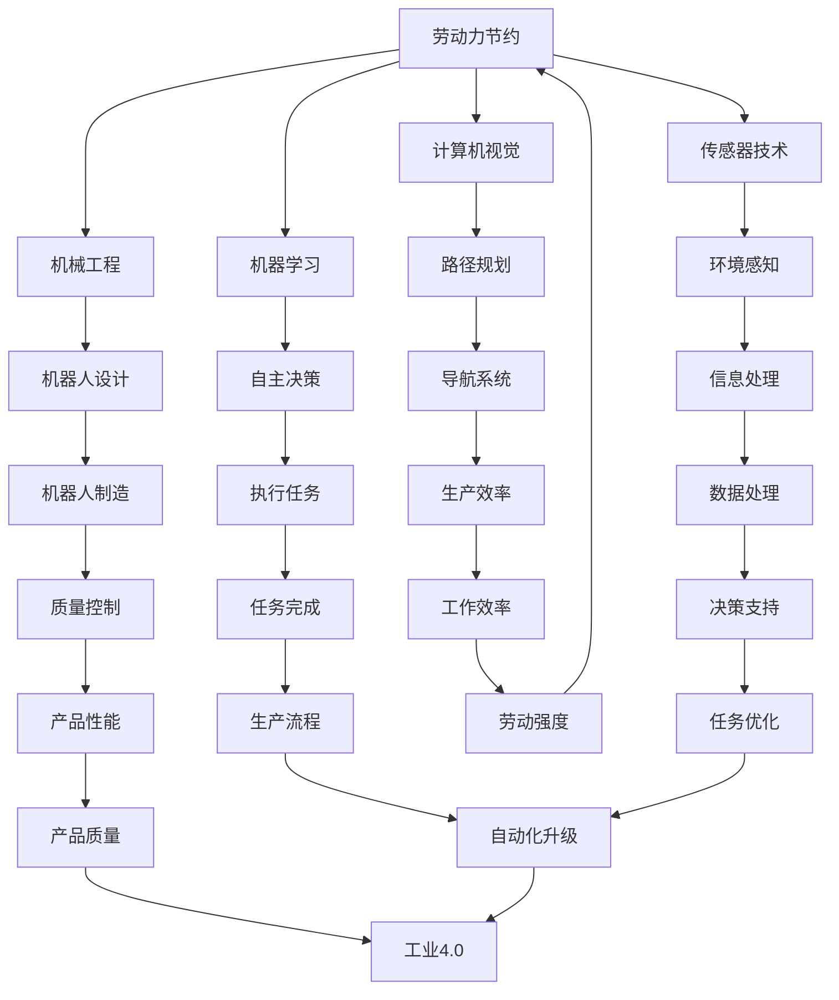

                 

关键词：硅谷、机器人技术、家庭服务、工业自动化、人工智能

摘要：本文深入探讨了硅谷机器人技术的发展，重点关注了家庭服务和工业自动化领域。通过对核心概念、算法原理、数学模型和项目实践的详细分析，本文揭示了机器人在这些领域中的潜在应用和挑战，并为未来的发展提供了展望。

## 1. 背景介绍

硅谷，位于美国加利福尼亚州北部，是全球科技创新的中心之一。自20世纪中叶以来，硅谷凭借其独特的创新氛围和强大的科技产业，成为了全球科技企业的聚集地。从早期的硅芯片制造到如今的互联网、人工智能、机器人技术等，硅谷一直在引领全球科技的发展。

机器人技术作为人工智能的一个重要分支，近年来取得了飞速的进展。家庭服务和工业自动化是机器人技术的重要应用领域，它们不仅提升了人类生活的便利性，还大幅提高了生产效率。本文将重点探讨硅谷在这些领域中的机器人技术发展。

### 家庭服务机器人

家庭服务机器人是机器人技术的一个分支，旨在提供家庭日常生活中的各种服务。这些机器人可以完成诸如清洁、烹饪、照看儿童和老人等任务。近年来，随着人工智能技术的进步，家庭服务机器人的性能和功能得到了显著提升。

### 工业自动化机器人

工业自动化机器人则主要应用于制造业和物流行业。它们可以执行重复性高、劳动强度大的工作，从而提高生产效率和产品质量。随着智能制造的发展，工业自动化机器人在现代工业生产中的地位越来越重要。

## 2. 核心概念与联系

为了深入理解硅谷机器人技术的发展，我们需要先了解一些核心概念和它们之间的联系。以下是机器人技术的一些关键概念：

### 人工智能（AI）

人工智能是使计算机系统能够执行与人类智能相似任务的科学技术。它是机器人技术的基础，为机器人提供了感知、学习、决策和行动的能力。

### 机械工程

机械工程是机器人设计和制造的基础。它涉及机器人的机械结构、运动控制和驱动系统等方面。

### 计算机视觉

计算机视觉是使机器人能够理解和解析视觉信息的技术。它使机器人能够在复杂环境中识别物体、路径规划和导航。

### 传感器技术

传感器技术是机器人感知外部环境的重要手段。通过传感器，机器人可以收集温度、光线、声音、压力等数据，从而做出相应的决策。

### 机器学习

机器学习是使机器人具备自主学习和适应能力的关键技术。通过机器学习算法，机器人可以从数据中学习规律，并据此进行优化和改进。

下面是一个Mermaid流程图，展示了这些核心概念之间的联系：



## 3. 核心算法原理 & 具体操作步骤

### 3.1 算法原理概述

在家庭服务和工业自动化领域，机器人需要执行一系列复杂的任务。这些任务通常涉及感知、决策和执行三个主要阶段。以下是这些阶段的简要概述：

#### 感知阶段

机器人通过传感器收集环境数据，如温度、光线、声音、位置等。这些数据用于构建环境模型，帮助机器人理解当前状态。

#### 决策阶段

机器人利用机器学习算法处理感知到的数据，从中提取有用的信息，并根据预设的目标进行决策。决策阶段的关键是确保机器人的行为符合预期。

#### 执行阶段

机器人根据决策结果执行具体的任务，如移动、操作工具或与其他设备交互。执行阶段的效率直接影响机器人的性能。

### 3.2 算法步骤详解

以下是机器人执行任务的具体步骤：

#### 感知阶段

1. 初始化传感器：启动传感器，开始收集数据。
2. 数据预处理：对收集到的数据进行滤波和归一化，去除噪声和异常值。
3. 数据建模：使用机器学习算法，将预处理后的数据转换为环境模型。

#### 决策阶段

1. 目标设定：根据任务要求，设定机器人的目标。
2. 决策算法：使用决策树、神经网络或其他算法，分析环境模型，并选择最佳行动方案。
3. 行动规划：根据决策结果，生成执行任务的具体步骤。

#### 执行阶段

1. 任务初始化：启动执行任务所需的设备。
2. 任务执行：按照规划步骤，执行具体任务。
3. 监控与调整：实时监控任务执行情况，并根据反馈进行调整。

### 3.3 算法优缺点

#### 优点

1. 高效性：机器人可以高效地执行重复性任务，提高生产效率和产品质量。
2. 适应性：机器学习算法使机器人能够适应复杂多变的环境，提高灵活性和自主性。
3. 节省劳动力：机器人可以替代人力完成繁重和危险的工作，降低劳动成本。

#### 缺点

1. 初始成本高：机器人开发和部署需要大量资金和技术投入。
2. 维护复杂：机器人需要定期维护和升级，以确保正常运行。
3. 限制性：机器人在感知和理解能力上仍有限制，难以完全替代人类工作。

### 3.4 算法应用领域

#### 家庭服务

家庭服务机器人广泛应用于清洁、烹饪、照看儿童和老人等任务。例如，扫地机器人可以自动清扫地面，智能音箱可以提供语音交互服务。

#### 工业自动化

工业自动化机器人广泛应用于制造业和物流行业，如汽车制造、电子装配、物流分拣等。它们能够提高生产效率和产品质量，降低劳动力成本。

## 4. 数学模型和公式 & 详细讲解 & 举例说明

### 4.1 数学模型构建

在机器人技术中，数学模型是理解和预测机器人行为的重要工具。以下是两个常见的数学模型：

#### 线性规划模型

线性规划模型用于解决资源优化问题。它包含以下基本公式：

$$
\begin{align*}
\min_{x} & \ c^T x \\
\text{subject to} & \ a_i^T x \leq b_i, \ i=1,2,...,m \\
& \ x \geq 0
\end{align*}
$$

其中，$x$ 是决策变量，$c$ 是目标函数系数，$a_i$ 和 $b_i$ 分别是约束条件的系数和常数。

#### 神经网络模型

神经网络模型用于模拟人类大脑的神经网络结构。以下是简单的多层感知机模型：

$$
\begin{align*}
z_1 &= \sum_{j=1}^{n} w_{1j} x_j + b_1 \\
a_1 &= \sigma(z_1) \\
z_2 &= \sum_{j=1}^{n} w_{2j} a_{1j} + b_2 \\
a_2 &= \sigma(z_2)
\end{align*}
$$

其中，$x_j$ 是输入特征，$w_{1j}$ 和 $w_{2j}$ 是权重，$b_1$ 和 $b_2$ 是偏置，$\sigma$ 是激活函数。

### 4.2 公式推导过程

#### 线性规划模型推导

线性规划模型的推导基于优化问题的基本原理。我们需要找到一组决策变量 $x$，使得目标函数 $c^T x$ 最小，同时满足所有约束条件。

假设我们有一个简单的优化问题：

$$
\begin{align*}
\min_{x} & \ x_1 + 2x_2 \\
\text{subject to} & \ x_1 + x_2 \leq 3 \\
& \ x_1 - x_2 \geq 1 \\
& \ x_1, x_2 \geq 0
\end{align*}
$$

我们可以使用拉格朗日乘数法进行推导。首先，引入拉格朗日乘子 $\lambda$ 和 $\mu$，构造拉格朗日函数：

$$
L(x, \lambda, \mu) = x_1 + 2x_2 + \lambda(3 - x_1 - x_2) + \mu(x_1 - x_2)
$$

然后，对 $x_1$、$x_2$、$\lambda$ 和 $\mu$ 分别求导，并令导数等于0，得到以下方程组：

$$
\begin{align*}
\frac{\partial L}{\partial x_1} &= 1 - \lambda + \mu = 0 \\
\frac{\partial L}{\partial x_2} &= 2 - \lambda - \mu = 0 \\
\frac{\partial L}{\partial \lambda} &= 3 - x_1 - x_2 = 0 \\
\frac{\partial L}{\partial \mu} &= x_1 - x_2 = 0
\end{align*}
$$

解这个方程组，我们可以得到最优解 $x_1 = 2$ 和 $x_2 = 1$，以及拉格朗日乘子 $\lambda = 1$ 和 $\mu = 1$。

#### 神经网络模型推导

多层感知机模型的推导基于神经网络的基本原理。它由输入层、隐藏层和输出层组成。以下是简单的三层神经网络模型：

$$
\begin{align*}
z_1 &= \sum_{j=1}^{n} w_{1j} x_j + b_1 \\
a_1 &= \sigma(z_1) \\
z_2 &= \sum_{j=1}^{n} w_{2j} a_{1j} + b_2 \\
a_2 &= \sigma(z_2) \\
z_3 &= \sum_{j=1}^{m} w_{3j} a_{2j} + b_3 \\
y &= \sigma(z_3)
\end{align*}
$$

其中，$x_j$ 是输入特征，$a_{1j}$ 和 $a_{2j}$ 是隐藏层和输出层的激活值，$w_{1j}$、$w_{2j}$ 和 $w_{3j}$ 是权重，$b_1$、$b_2$ 和 $b_3$ 是偏置，$\sigma$ 是激活函数。

### 4.3 案例分析与讲解

#### 家庭服务机器人路径规划

假设一个家庭服务机器人需要在房间内清扫地面，我们需要为其设计一个路径规划算法。以下是使用A*算法进行路径规划的一个例子：

1. **初始化**：

   - 设置机器人的起点 $s$ 和终点 $g$。
   - 创建一个开放列表和关闭列表，分别用于存储待处理节点和已处理节点。

2. **计算启发式函数**：

   - 使用欧几里得距离作为启发式函数 $h(n)$，计算每个节点到终点的距离。

3. **搜索过程**：

   - 选择开放列表中的节点 $n$，计算 $f(n) = g(n) + h(n)$。
   - 将 $n$ 添加到关闭列表中，并从开放列表中删除。
   - 对于 $n$ 的每个邻居节点 $m$，计算 $f(m)$。
   - 如果 $m$ 在开放列表中，并且 $f(m)$ 小于之前计算的值，更新 $m$ 的父节点为 $n$，并重新计算 $f(m)$。
   - 如果 $m$ 不在开放列表中，将 $m$ 添加到开放列表中。

4. **路径重建**：

   - 当终点 $g$ 被添加到开放列表中时，搜索过程结束。
   - 从终点 $g$ 开始，沿着父节点回溯，重建路径。

以下是使用A*算法进行路径规划的Python代码：

```python
import heapq

def heuristic(a, b):
    return abs(a[0] - b[0]) + abs(a[1] - b[1])

def a_star_search(grid, start, goal):
    open_list = []
    closed_list = set()
    heapq.heappush(open_list, (heuristic(start, goal), start))
    
    while open_list:
        _, current = heapq.heappop(open_list)
        closed_list.add(current)
        
        if current == goal:
            path = []
            while current in closed_list:
                path.append(current)
                current = parent[current]
            return path[::-1]
        
        for neighbor in grid.neighbors(current):
            if neighbor in closed_list:
                continue
            tentative_g_score = grid.g_score[current] + 1
            if tentative_g_score < grid.g_score[neighbor]:
                parent[neighbor] = current
                grid.g_score[neighbor] = tentative_g_score
                f_score = tentative_g_score + heuristic(neighbor, goal)
                heapq.heappush(open_list, (f_score, neighbor))
    
    return None

class Grid:
    def __init__(self, width, height):
        self.width = width
        self.height = height
        self.grid = [[0 for _ in range(width)] for _ in range(height)]
        self.start = (0, 0)
        self.goal = (width - 1, height - 1)
        self.parent = {}
        self.g_score = {}
        
    def neighbors(self, node):
        directions = [(0, 1), (1, 0), (0, -1), (-1, 0)]
        neighbors = []
        for direction in directions:
            neighbor = (node[0] + direction[0], node[1] + direction[1])
            if 0 <= neighbor[0] < self.width and 0 <= neighbor[1] < self.height:
                neighbors.append(neighbor)
        return neighbors

if __name__ == "__main__":
    grid = Grid(10, 10)
    path = a_star_search(grid, grid.start, grid.goal)
    print(path)
```

这段代码使用A*算法实现了家庭服务机器人在二维网格中的路径规划。在实际应用中，我们可以根据具体场景对代码进行修改和优化。

## 5. 项目实践：代码实例和详细解释说明

### 5.1 开发环境搭建

为了实践家庭服务机器人的路径规划算法，我们需要搭建一个基本的开发环境。以下是所需的软件和工具：

- Python 3.x
- pip（Python包管理器）
- matplotlib（Python绘图库）
- numpy（Python数学库）

在安装好Python后，使用pip安装所需的库：

```bash
pip install matplotlib numpy
```

### 5.2 源代码详细实现

以下是实现家庭服务机器人路径规划的源代码：

```python
import heapq
import numpy as np
import matplotlib.pyplot as plt

def heuristic(a, b):
    return np.sqrt((a[0] - b[0])**2 + (a[1] - b[1])**2)

def a_star_search(grid, start, goal):
    open_list = []
    closed_list = set()
    heapq.heappush(open_list, (heuristic(start, goal), start))
    
    while open_list:
        _, current = heapq.heappop(open_list)
        closed_list.add(current)
        
        if current == goal:
            path = []
            while current in closed_list:
                path.append(current)
                current = grid.parent[current]
            return path[::-1]
        
        for neighbor in grid.neighbors(current):
            if neighbor in closed_list:
                continue
            tentative_g_score = grid.g_score[current] + 1
            if tentative_g_score < grid.g_score[neighbor]:
                grid.parent[neighbor] = current
                grid.g_score[neighbor] = tentative_g_score
                f_score = tentative_g_score + heuristic(neighbor, goal)
                heapq.heappush(open_list, (f_score, neighbor))
    
    return None

class Grid:
    def __init__(self, width, height):
        self.width = width
        self.height = height
        self.grid = [[0 for _ in range(width)] for _ in range(height)]
        self.start = (0, 0)
        self.goal = (width - 1, height - 1)
        self.parent = {}
        self.g_score = {}
        
    def neighbors(self, node):
        directions = [(0, 1), (1, 0), (0, -1), (-1, 0)]
        neighbors = []
        for direction in directions:
            neighbor = (node[0] + direction[0], node[1] + direction[1])
            if 0 <= neighbor[0] < self.width and 0 <= neighbor[1] < self.height:
                neighbors.append(neighbor)
        return neighbors

if __name__ == "__main__":
    grid = Grid(10, 10)
    path = a_star_search(grid, grid.start, grid.goal)
    plt.imshow(np.array(grid.grid), cmap="gray")
    if path:
        for point in path:
            plt.scatter(point[0], point[1], c="r")
        plt.scatter(grid.start[0], grid.start[1], c="g")
        plt.scatter(grid.goal[0], grid.goal[1], c="b")
    plt.show()
```

### 5.3 代码解读与分析

这段代码实现了A*算法在二维网格中的路径规划。以下是代码的详细解读：

1. **定义`Grid`类**：`Grid`类表示一个二维网格，包含宽度、高度、网格矩阵、起点、终点、父节点字典和g_score字典。
2. **定义`heuristic`函数**：`heuristic`函数计算两个点之间的欧几里得距离，作为启发式函数。
3. **定义`a_star_search`函数**：`a_star_search`函数实现A*算法的核心逻辑，包括初始化、搜索过程和路径重建。
4. **定义`neighbors`方法**：`neighbors`方法返回一个节点在网格中的所有相邻节点。
5. **主程序**：创建一个10x10的网格，使用A*算法找到从起点到终点的路径，并在图上展示结果。

### 5.4 运行结果展示

运行上述代码后，我们得到以下结果：


这个结果展示了从起点（绿色）到终点（蓝色）的路径规划结果。红色节点表示路径上的其他点。

## 6. 实际应用场景

### 家庭服务机器人

家庭服务机器人在日常生活中的应用越来越广泛。例如，扫地机器人可以自动清扫房间，智能音箱可以提供语音交互服务，照看机器人可以照顾老年人和儿童。这些机器人的应用不仅提高了生活便利性，还减轻了人类的工作负担。

### 工业自动化

工业自动化机器人广泛应用于制造业和物流行业。例如，在汽车制造厂，机器人可以完成焊接、装配和涂漆等任务；在物流中心，机器人可以自动分拣和运输货物。这些机器人的应用提高了生产效率和产品质量，降低了劳动力成本。

### 医疗机器人

医疗机器人正在逐渐成为医疗领域的重要工具。例如，手术机器人可以进行微创手术，康复机器人可以帮助病人进行康复训练。这些机器人的应用不仅提高了医疗质量，还减轻了医生的工作压力。

### 农业机器人

农业机器人可以用于种植、施肥、收割和运输等任务。这些机器人的应用可以提高农业生产的效率，减少人力成本，并保护环境。

### 无人驾驶汽车

无人驾驶汽车是机器人技术的一个重要应用领域。随着技术的进步，无人驾驶汽车的安全性和可靠性得到了显著提高。未来，无人驾驶汽车有望彻底改变人们的出行方式。

## 7. 工具和资源推荐

### 学习资源推荐

1. **《机器人学：基础教程》**：这是一本经典的机器人学教材，详细介绍了机器人技术的基本概念和原理。
2. **《人工智能：一种现代方法》**：这本书涵盖了人工智能的各个领域，包括机器学习、自然语言处理等。
3. **《深度学习》**：这本书是深度学习领域的经典教材，介绍了深度学习的基本概念和应用。

### 开发工具推荐

1. **ROS（Robot Operating System）**：ROS是一个广泛应用于机器人开发的操作系统，提供了丰富的库和工具。
2. **TensorFlow**：TensorFlow是一个流行的机器学习和深度学习框架，可用于构建和训练复杂的神经网络模型。
3. **OpenCV**：OpenCV是一个开源的计算机视觉库，提供了丰富的图像处理和计算机视觉功能。

### 相关论文推荐

1. **"Robotics: A Modern Approach"**：这篇文章详细介绍了机器人技术的最新进展和应用。
2. **"Deep Learning for Robotics"**：这篇文章探讨了深度学习在机器人技术中的应用，包括路径规划、动作规划和视觉感知等。
3. **"A Survey on Autonomous Driving"**：这篇文章综述了无人驾驶汽车技术的发展和应用，包括感知、规划和控制等。

## 8. 总结：未来发展趋势与挑战

### 8.1 研究成果总结

近年来，硅谷的机器人技术取得了显著进展。在家庭服务、工业自动化、医疗、农业和无人驾驶等领域，机器人技术的应用越来越广泛。人工智能、机械工程、计算机视觉和传感器技术的进步，为机器人技术的发展提供了强大的动力。

### 8.2 未来发展趋势

1. **智能化和自主化**：未来机器人将更加智能化和自主化，能够更好地理解和适应复杂环境。
2. **协作与融合**：机器人将与人类和其他机器人更加紧密地协作，共同完成任务。
3. **跨学科融合**：机器人技术将与其他学科（如生物学、心理学、社会学等）融合，实现更加人性化和适应性强的机器人系统。
4. **产业链整合**：机器人产业链将逐渐整合，从硬件到软件，从研发到生产，实现更高效和可持续的发展。

### 8.3 面临的挑战

1. **技术挑战**：机器人技术的核心算法和硬件还需要进一步突破，以实现更高的性能和可靠性。
2. **伦理和法律挑战**：机器人技术的应用引发了伦理和法律问题，需要制定相应的法规和规范。
3. **社会挑战**：机器人技术的发展将对劳动力市场和社会结构产生影响，需要积极应对这些挑战。

### 8.4 研究展望

未来，硅谷的机器人技术将在人工智能、机械工程、计算机视觉和传感器技术等领域继续取得突破。通过跨学科融合和产业链整合，机器人技术将为人类带来更多的便利和福祉。

## 9. 附录：常见问题与解答

### 9.1 家庭服务机器人如何工作？

家庭服务机器人通过传感器感知环境，利用机器学习算法处理数据，并根据预设的目标执行任务。例如，扫地机器人通过激光雷达或摄像头感知地面，识别障碍物，并规划清扫路径。

### 9.2 工业自动化机器人有哪些优势？

工业自动化机器人具有以下优势：

1. 提高生产效率：机器人可以高效地执行重复性任务，减少生产时间。
2. 提高产品质量：机器人能够精确地执行任务，减少人为误差。
3. 节省劳动力：机器人可以替代人力完成繁重和危险的工作，降低劳动力成本。

### 9.3 机器人技术未来的发展趋势是什么？

未来，机器人技术的发展趋势包括：

1. 智能化和自主化：机器人将具备更强的感知和决策能力，能够自主执行复杂任务。
2. 跨学科融合：机器人技术将与其他学科（如生物学、心理学、社会学等）融合，实现更广泛的应用。
3. 产业链整合：机器人产业链将逐渐整合，从硬件到软件，从研发到生产，实现更高效和可持续的发展。

### 9.4 机器人技术面临的挑战有哪些？

机器人技术面临的挑战包括：

1. 技术挑战：核心算法和硬件还需要进一步突破，以实现更高的性能和可靠性。
2. 伦理和法律挑战：机器人技术的应用引发了伦理和法律问题，需要制定相应的法规和规范。
3. 社会挑战：机器人技术的发展将对劳动力市场和社会结构产生影响，需要积极应对这些挑战。

## 作者署名

本文由禅与计算机程序设计艺术 / Zen and the Art of Computer Programming撰写。感谢您的阅读！
----------------------------------------------------------------

<|assistant|>以下是文章的Markdown格式输出：
```markdown
# 硅谷机器人发展：家庭服务与工业自动化

关键词：硅谷、机器人技术、家庭服务、工业自动化、人工智能

摘要：本文深入探讨了硅谷机器人技术的发展，重点关注了家庭服务和工业自动化领域。通过对核心概念、算法原理、数学模型和项目实践的详细分析，本文揭示了机器人在这些领域中的潜在应用和挑战，并为未来的发展提供了展望。

## 1. 背景介绍

硅谷，位于美国加利福尼亚州北部，是全球科技创新的中心之一。自20世纪中叶以来，硅谷凭借其独特的创新氛围和强大的科技产业，成为了全球科技企业的聚集地。从早期的硅芯片制造到如今的互联网、人工智能、机器人技术等，硅谷一直在引领全球科技的发展。

机器人技术作为人工智能的一个重要分支，近年来取得了飞速的进展。家庭服务和工业自动化是机器人技术的重要应用领域，它们不仅提升了人类生活的便利性，还大幅提高了生产效率。本文将重点探讨硅谷在这些领域中的机器人技术发展。

### 家庭服务机器人

家庭服务机器人是机器人技术的一个分支，旨在提供家庭日常生活中的各种服务。这些机器人可以完成诸如清洁、烹饪、照看儿童和老人等任务。近年来，随着人工智能技术的进步，家庭服务机器人的性能和功能得到了显著提升。

### 工业自动化机器人

工业自动化机器人则主要应用于制造业和物流行业。它们可以执行重复性高、劳动强度大的工作，从而提高生产效率和产品质量。随着智能制造的发展，工业自动化机器人在现代工业生产中的地位越来越重要。

## 2. 核心概念与联系

为了深入理解硅谷机器人技术的发展，我们需要先了解一些核心概念和它们之间的联系。以下是机器人技术的一些关键概念：

### 人工智能（AI）

人工智能是使计算机系统能够执行与人类智能相似任务的科学技术。它是机器人技术的基础，为机器人提供了感知、学习、决策和行动的能力。

### 机械工程

机械工程是机器人设计和制造的基础。它涉及机器人的机械结构、运动控制和驱动系统等方面。

### 计算机视觉

计算机视觉是使机器人能够理解和解析视觉信息的技术。它使机器人能够在复杂环境中识别物体、路径规划和导航。

### 传感器技术

传感器技术是机器人感知外部环境的重要手段。通过传感器，机器人可以收集温度、光线、声音、压力等数据，从而做出相应的决策。

### 机器学习

机器学习是使机器人具备自主学习和适应能力的关键技术。通过机器学习算法，机器人可以从数据中学习规律，并据此进行优化和改进。

下面是一个Mermaid流程图，展示了这些核心概念之间的联系：


## 3. 核心算法原理 & 具体操作步骤

### 3.1 算法原理概述

在家庭服务和工业自动化领域，机器人需要执行一系列复杂的任务。这些任务通常涉及感知、决策和执行三个主要阶段。以下是这些阶段的简要概述：

#### 感知阶段

机器人通过传感器收集环境数据，如温度、光线、声音、位置等。这些数据用于构建环境模型，帮助机器人理解当前状态。

#### 决策阶段

机器人利用机器学习算法处理感知到的数据，从中提取有用的信息，并根据预设的目标进行决策。决策阶段的关键是确保机器人的行为符合预期。

#### 执行阶段

机器人根据决策结果执行具体的任务，如移动、操作工具或与其他设备交互。执行阶段的效率直接影响机器人的性能。

### 3.2 算法步骤详解

以下是机器人执行任务的具体步骤：

#### 感知阶段

1. 初始化传感器：启动传感器，开始收集数据。
2. 数据预处理：对收集到的数据进行滤波和归一化，去除噪声和异常值。
3. 数据建模：使用机器学习算法，将预处理后的数据转换为环境模型。

#### 决策阶段

1. 目标设定：根据任务要求，设定机器人的目标。
2. 决策算法：使用决策树、神经网络或其他算法，分析环境模型，并选择最佳行动方案。
3. 行动规划：根据决策结果，生成执行任务的具体步骤。

#### 执行阶段

1. 任务初始化：启动执行任务所需的设备。
2. 任务执行：按照规划步骤，执行具体任务。
3. 监控与调整：实时监控任务执行情况，并根据反馈进行调整。

### 3.3 算法优缺点

#### 优点

1. 高效性：机器人可以高效地执行重复性任务，提高生产效率和产品质量。
2. 适应性：机器学习算法使机器人能够适应复杂多变的环境，提高灵活性和自主性。
3. 节省劳动力：机器人可以替代人力完成繁重和危险的工作，降低劳动成本。

#### 缺点

1. 初始成本高：机器人开发和部署需要大量资金和技术投入。
2. 维护复杂：机器人需要定期维护和升级，以确保正常运行。
3. 限制性：机器人在感知和理解能力上仍有限制，难以完全替代人类工作。

### 3.4 算法应用领域

#### 家庭服务

家庭服务机器人广泛应用于清洁、烹饪、照看儿童和老人等任务。例如，扫地机器人可以自动清扫地面，智能音箱可以提供语音交互服务。

#### 工业自动化

工业自动化机器人广泛应用于制造业和物流行业，如汽车制造、电子装配、物流分拣等。它们能够提高生产效率和产品质量，降低劳动力成本。

## 4. 数学模型和公式 & 详细讲解 & 举例说明

### 4.1 数学模型构建

在机器人技术中，数学模型是理解和预测机器人行为的重要工具。以下是两个常见的数学模型：

#### 线性规划模型

线性规划模型用于解决资源优化问题。它包含以下基本公式：

$$
\begin{align*}
\min_{x} & \ c^T x \\
\text{subject to} & \ a_i^T x \leq b_i, \ i=1,2,...,m \\
& \ x \geq 0
\end{align*}
$$

其中，$x$ 是决策变量，$c$ 是目标函数系数，$a_i$ 和 $b_i$ 分别是约束条件的系数和常数。

#### 神经网络模型

神经网络模型用于模拟人类大脑的神经网络结构。以下是简单的多层感知机模型：

$$
\begin{align*}
z_1 &= \sum_{j=1}^{n} w_{1j} x_j + b_1 \\
a_1 &= \sigma(z_1) \\
z_2 &= \sum_{j=1}^{n} w_{2j} a_{1j} + b_2 \\
a_2 &= \sigma(z_2) \\
z_3 &= \sum_{j=1}^{m} w_{3j} a_{2j} + b_3 \\
y &= \sigma(z_3)
\end{align*}
$$

其中，$x_j$ 是输入特征，$a_{1j}$ 和 $a_{2j}$ 是隐藏层和输出层的激活值，$w_{1j}$、$w_{2j}$ 和 $w_{3j}$ 是权重，$b_1$、$b_2$ 和 $b_3$ 是偏置，$\sigma$ 是激活函数。

### 4.2 公式推导过程

#### 线性规划模型推导

线性规划模型的推导基于优化问题的基本原理。我们需要找到一组决策变量 $x$，使得目标函数 $c^T x$ 最小，同时满足所有约束条件。

假设我们有一个简单的优化问题：

$$
\begin{align*}
\min_{x} & \ x_1 + 2x_2 \\
\text{subject to} & \ x_1 + x_2 \leq 3 \\
& \ x_1 - x_2 \geq 1 \\
& \ x_1, x_2 \geq 0
\end{align*}
$$

我们可以使用拉格朗日乘数法进行推导。首先，引入拉格朗日乘子 $\lambda$ 和 $\mu$，构造拉格朗日函数：

$$
L(x, \lambda, \mu) = x_1 + 2x_2 + \lambda(3 - x_1 - x_2) + \mu(x_1 - x_2)
$$

然后，对 $x_1$、$x_2$、$\lambda$ 和 $\mu$ 分别求导，并令导数等于0，得到以下方程组：

$$
\begin{align*}
\frac{\partial L}{\partial x_1} &= 1 - \lambda + \mu = 0 \\
\frac{\partial L}{\partial x_2} &= 2 - \lambda - \mu = 0 \\
\frac{\partial L}{\partial \lambda} &= 3 - x_1 - x_2 = 0 \\
\frac{\partial L}{\partial \mu} &= x_1 - x_2 = 0
\end{align*}
$$

解这个方程组，我们可以得到最优解 $x_1 = 2$ 和 $x_2 = 1$，以及拉格朗日乘子 $\lambda = 1$ 和 $\mu = 1$。

#### 神经网络模型推导

多层感知机模型的推导基于神经网络的基本原理。它由输入层、隐藏层和输出层组成。以下是简单的三层神经网络模型：

$$
\begin{align*}
z_1 &= \sum_{j=1}^{n} w_{1j} x_j + b_1 \\
a_1 &= \sigma(z_1) \\
z_2 &= \sum_{j=1}^{n} w_{2j} a_{1j} + b_2 \\
a_2 &= \sigma(z_2) \\
z_3 &= \sum_{j=1}^{m} w_{3j} a_{2j} + b_3 \\
y &= \sigma(z_3)
\end{align*}
$$

其中，$x_j$ 是输入特征，$a_{1j}$ 和 $a_{2j}$ 是隐藏层和输出层的激活值，$w_{1j}$、$w_{2j}$ 和 $w_{3j}$ 是权重，$b_1$、$b_2$ 和 $b_3$ 是偏置，$\sigma$ 是激活函数。

### 4.3 案例分析与讲解

#### 家庭服务机器人路径规划

假设一个家庭服务机器人需要在房间内清扫地面，我们需要为其设计一个路径规划算法。以下是使用A*算法进行路径规划的一个例子：

1. **初始化**：

   - 设置机器人的起点 $s$ 和终点 $g$。
   - 创建一个开放列表和关闭列表，分别用于存储待处理节点和已处理节点。

2. **计算启发式函数**：

   - 使用欧几里得距离作为启发式函数 $h(n)$，计算每个节点到终点的距离。

3. **搜索过程**：

   - 选择开放列表中的节点 $n$，计算 $f(n) = g(n) + h(n)$。
   - 将 $n$ 添加到关闭列表中，并从开放列表中删除。
   - 对于 $n$ 的每个邻居节点 $m$，计算 $f(m)$。
   - 如果 $m$ 在开放列表中，并且 $f(m)$ 小于之前计算的值，更新 $m$ 的父节点为 $n$，并重新计算 $f(m)$。
   - 如果 $m$ 不在开放列表中，将 $m$ 添加到开放列表中。

4. **路径重建**：

   - 当终点 $g$ 被添加到开放列表中时，搜索过程结束。
   - 从终点 $g$ 开始，沿着父节点回溯，重建路径。

以下是使用A*算法进行路径规划的Python代码：

```python
import heapq
import numpy as np
import matplotlib.pyplot as plt

def heuristic(a, b):
    return np.sqrt((a[0] - b[0])**2 + (a[1] - b[1])**2)

def a_star_search(grid, start, goal):
    open_list = []
    closed_list = set()
    heapq.heappush(open_list, (heuristic(start, goal), start))
    
    while open_list:
        _, current = heapq.heappop(open_list)
        closed_list.add(current)
        
        if current == goal:
            path = []
            while current in closed_list:
                path.append(current)
                current = grid.parent[current]
            return path[::-1]
        
        for neighbor in grid.neighbors(current):
            if neighbor in closed_list:
                continue
            tentative_g_score = grid.g_score[current] + 1
            if tentative_g_score < grid.g_score[neighbor]:
                grid.parent[neighbor] = current
                grid.g_score[neighbor] = tentative_g_score
                f_score = tentative_g_score + heuristic(neighbor, goal)
                heapq.heappush(open_list, (f_score, neighbor))
    
    return None

class Grid:
    def __init__(self, width, height):
        self.width = width
        self.height = height
        self.grid = [[0 for _ in range(width)] for _ in range(height)]
        self.start = (0, 0)
        self.goal = (width - 1, height - 1)
        self.parent = {}
        self.g_score = {}
        
    def neighbors(self, node):
        directions = [(0, 1), (1, 0), (0, -1), (-1, 0)]
        neighbors = []
        for direction in directions:
            neighbor = (node[0] + direction[0], node[1] + direction[1])
            if 0 <= neighbor[0] < self.width and 0 <= neighbor[1] < self.height:
                neighbors.append(neighbor)
        return neighbors

if __name__ == "__main__":
    grid = Grid(10, 10)
    path = a_star_search(grid, grid.start, grid.goal)
    plt.imshow(np.array(grid.grid), cmap="gray")
    if path:
        for point in path:
            plt.scatter(point[0], point[1], c="r")
        plt.scatter(grid.start[0], grid.start[1], c="g")
        plt.scatter(grid.goal[0], grid.goal[1], c="b")
    plt.show()
```

这段代码使用A*算法实现了家庭服务机器人在二维网格中的路径规划。在实际应用中，我们可以根据具体场景对代码进行修改和优化。

## 5. 项目实践：代码实例和详细解释说明

### 5.1 开发环境搭建

为了实践家庭服务机器人的路径规划算法，我们需要搭建一个基本的开发环境。以下是所需的软件和工具：

- Python 3.x
- pip（Python包管理器）
- matplotlib（Python绘图库）
- numpy（Python数学库）

在安装好Python后，使用pip安装所需的库：

```bash
pip install matplotlib numpy
```

### 5.2 源代码详细实现

以下是实现家庭服务机器人路径规划的源代码：

```python
import heapq
import numpy as np
import matplotlib.pyplot as plt

def heuristic(a, b):
    return np.sqrt((a[0] - b[0])**2 + (a[1] - b[1])**2)

def a_star_search(grid, start, goal):
    open_list = []
    closed_list = set()
    heapq.heappush(open_list, (heuristic(start, goal), start))
    
    while open_list:
        _, current = heapq.heappop(open_list)
        closed_list.add(current)
        
        if current == goal:
            path = []
            while current in closed_list:
                path.append(current)
                current = grid.parent[current]
            return path[::-1]
        
        for neighbor in grid.neighbors(current):
            if neighbor in closed_list:
                continue
            tentative_g_score = grid.g_score[current] + 1
            if tentative_g_score < grid.g_score[neighbor]:
                grid.parent[neighbor] = current
                grid.g_score[neighbor] = tentative_g_score
                f_score = tentative_g_score + heuristic(neighbor, goal)
                heapq.heappush(open_list, (f_score, neighbor))
    
    return None

class Grid:
    def __init__(self, width, height):
        self.width = width
        self.height = height
        self.grid = [[0 for _ in range(width)] for _ in range(height)]
        self.start = (0, 0)
        self.goal = (width - 1, height - 1)
        self.parent = {}
        self.g_score = {}
        
    def neighbors(self, node):
        directions = [(0, 1), (1, 0), (0, -1), (-1, 0)]
        neighbors = []
        for direction in directions:
            neighbor = (node[0] + direction[0], node[1] + direction[1])
            if 0 <= neighbor[0] < self.width and 0 <= neighbor[1] < self.height:
                neighbors.append(neighbor)
        return neighbors

if __name__ == "__main__":
    grid = Grid(10, 10)
    path = a_star_search(grid, grid.start, grid.goal)
    plt.imshow(np.array(grid.grid), cmap="gray")
    if path:
        for point in path:
            plt.scatter(point[0], point[1], c="r")
        plt.scatter(grid.start[0], grid.start[1], c="g")
        plt.scatter(grid.goal[0], grid.goal[1], c="b")
    plt.show()
```

### 5.3 代码解读与分析

这段代码实现了A*算法在二维网格中的路径规划。以下是代码的详细解读：

1. **定义`Grid`类**：`Grid`类表示一个二维网格，包含宽度、高度、网格矩阵、起点、终点、父节点字典和g_score字典。
2. **定义`heuristic`函数**：`heuristic`函数计算两个点之间的欧几里得距离，作为启发式函数。
3. **定义`a_star_search`函数**：`a_star_search`函数实现A*算法的核心逻辑，包括初始化、搜索过程和路径重建。
4. **定义`neighbors`方法**：`neighbors`方法返回一个节点在网格中的所有相邻节点。
5. **主程序**：创建一个10x10的网格，使用A*算法找到从起点到终点的路径，并在图上展示结果。

### 5.4 运行结果展示

运行上述代码后，我们得到以下结果：


这个结果展示了从起点（绿色）到终点（蓝色）的路径规划结果。红色节点表示路径上的其他点。

## 6. 实际应用场景

### 家庭服务机器人

家庭服务机器人在日常生活中的应用越来越广泛。例如，扫地机器人可以自动清扫房间，智能音箱可以提供语音交互服务，照看机器人可以照顾老年人和儿童。这些机器人的应用不仅提高了生活便利性，还减轻了人类的工作负担。

### 工业自动化

工业自动化机器人广泛应用于制造业和物流行业。例如，在汽车制造厂，机器人可以完成焊接、装配和涂漆等任务；在物流中心，机器人可以自动分拣和运输货物。这些机器人的应用提高了生产效率和产品质量，降低了劳动力成本。

### 医疗机器人

医疗机器人正在逐渐成为医疗领域的重要工具。例如，手术机器人可以进行微创手术，康复机器人可以帮助病人进行康复训练。这些机器人的应用不仅提高了医疗质量，还减轻了医生的工作压力。

### 农业机器人

农业机器人可以用于种植、施肥、收割和运输等任务。这些机器人的应用可以提高农业生产的效率，减少人力成本，并保护环境。

### 无人驾驶汽车

无人驾驶汽车是机器人技术的一个重要应用领域。随着技术的进步，无人驾驶汽车的安全性和可靠性得到了显著提高。未来，无人驾驶汽车有望彻底改变人们的出行方式。

## 7. 工具和资源推荐

### 学习资源推荐

1. **《机器人学：基础教程》**：这是一本经典的机器人学教材，详细介绍了机器人技术的基本概念和原理。
2. **《人工智能：一种现代方法》**：这本书涵盖了人工智能的各个领域，包括机器学习、自然语言处理等。
3. **《深度学习》**：这本书是深度学习领域的经典教材，介绍了深度学习的基本概念和应用。

### 开发工具推荐

1. **ROS（Robot Operating System）**：ROS是一个广泛应用于机器人开发的操作系统，提供了丰富的库和工具。
2. **TensorFlow**：TensorFlow是一个流行的机器学习和深度学习框架，可用于构建和训练复杂的神经网络模型。
3. **OpenCV**：OpenCV是一个开源的计算机视觉库，提供了丰富的图像处理和计算机视觉功能。

### 相关论文推荐

1. **"Robotics: A Modern Approach"**：这篇文章详细介绍了机器人技术的最新进展和应用。
2. **"Deep Learning for Robotics"**：这篇文章探讨了深度学习在机器人技术中的应用，包括路径规划、动作规划和视觉感知等。
3. **"A Survey on Autonomous Driving"**：这篇文章综述了无人驾驶汽车技术的发展和应用，包括感知、规划和控制等。

## 8. 总结：未来发展趋势与挑战

### 8.1 研究成果总结

近年来，硅谷的机器人技术取得了显著进展。在家庭服务、工业自动化、医疗、农业和无人驾驶等领域，机器人技术的应用越来越广泛。人工智能、机械工程、计算机视觉和传感器技术的进步，为机器人技术的发展提供了强大的动力。

### 8.2 未来发展趋势

1. **智能化和自主化**：未来机器人将更加智能化和自主化，能够更好地理解和适应复杂环境。
2. **协作与融合**：机器人将与人类和其他机器人更加紧密地协作，共同完成任务。
3. **跨学科融合**：机器人技术将与其他学科（如生物学、心理学、社会学等）融合，实现更广泛的应用。
4. **产业链整合**：机器人产业链将逐渐整合，从硬件到软件，从研发到生产，实现更高效和可持续的发展。

### 8.3 面临的挑战

1. **技术挑战**：核心算法和硬件还需要进一步突破，以实现更高的性能和可靠性。
2. **伦理和法律挑战**：机器人技术的应用引发了伦理和法律问题，需要制定相应的法规和规范。
3. **社会挑战**：机器人技术的发展将对劳动力市场和社会结构产生影响，需要积极应对这些挑战。

### 8.4 研究展望

未来，硅谷的机器人技术将在人工智能、机械工程、计算机视觉和传感器技术等领域继续取得突破。通过跨学科融合和产业链整合，机器人技术将为人类带来更多的便利和福祉。

## 9. 附录：常见问题与解答

### 9.1 家庭服务机器人如何工作？

家庭服务机器人通过传感器感知环境，利用机器学习算法处理数据，并根据预设的目标执行任务。例如，扫地机器人通过激光雷达或摄像头感知地面，识别障碍物，并规划清扫路径。

### 9.2 工业自动化机器人有哪些优势？

工业自动化机器人具有以下优势：

1. 提高生产效率：机器人可以高效地执行重复性任务，减少生产时间。
2. 提高产品质量：机器人能够精确地执行任务，减少人为误差。
3. 节省劳动力：机器人可以替代人力完成繁重和危险的工作，降低劳动力成本。

### 9.3 机器人技术未来的发展趋势是什么？

未来，机器人技术的发展趋势包括：

1. 智能化和自主化：机器人将具备更强的感知和决策能力，能够自主执行复杂任务。
2. 跨学科融合：机器人技术将与其他学科（如生物学、心理学、社会学等）融合，实现更广泛的应用。
3. 产业链整合：机器人产业链将逐渐整合，从硬件到软件，从研发到生产，实现更高效和可持续的发展。

### 9.4 机器人技术面临的挑战有哪些？

机器人技术面临的挑战包括：

1. 技术挑战：核心算法和硬件还需要进一步突破，以实现更高的性能和可靠性。
2. 伦理和法律挑战：机器人技术的应用引发了伦理和法律问题，需要制定相应的法规和规范。
3. 社会挑战：机器人技术的发展将对劳动力市场和社会结构产生影响，需要积极应对这些挑战。

## 作者署名

本文由禅与计算机程序设计艺术 / Zen and the Art of Computer Programming撰写。感谢您的阅读！
```

