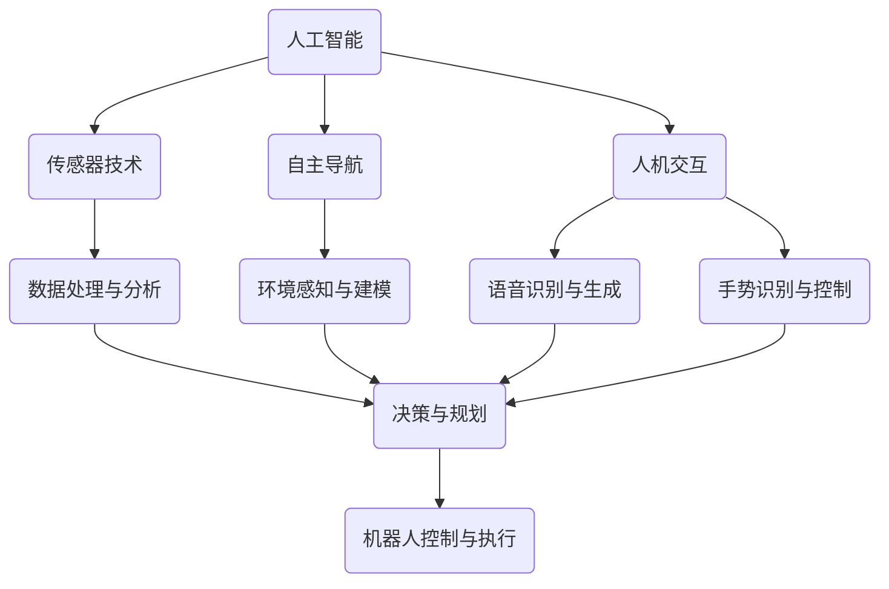

                 

关键词：机器人发展、家庭服务机器人、工业自动化、硅谷技术、人工智能

摘要：本文将探讨硅谷在机器人技术发展方面的最新动态，重点关注家庭服务机器人和工业自动化领域。通过分析硅谷企业的创新成果、核心技术以及未来发展趋势，本文旨在为读者提供全面、深入的了解，并探讨相关领域所面临的挑战和机遇。

## 1. 背景介绍

近年来，硅谷在全球科技创新领域占据着举足轻重的地位。众多顶级科技公司和初创企业在人工智能、机器人技术、大数据等领域取得了显著的突破。随着技术的不断进步，机器人技术逐渐从实验室走向实际应用，成为工业生产、家庭服务、医疗健康等领域的有力助手。本文将围绕硅谷机器人技术的发展，重点探讨家庭服务机器人和工业自动化领域的最新动态。

### 1.1 家庭服务机器人

家庭服务机器人是近年来迅速发展的一个领域，主要应用于家庭清洁、烹饪、安防、娱乐等方面。硅谷企业如iRobot、Roomba、Mayfield Robotics等在家庭服务机器人领域取得了显著的成果。这些企业通过技术创新，不断推出高性能、易用性强的家庭服务机器人产品，满足了消费者对智能家居的需求。

### 1.2 工业自动化

工业自动化是硅谷机器人技术的另一个重要应用领域。通过引入机器人技术，企业可以提高生产效率、降低成本、提高产品质量。硅谷的工业自动化企业如Tesla、Aptiv、Adept Technology等，不断推出创新产品，为工业生产提供智能化解决方案。

## 2. 核心概念与联系

在探讨硅谷机器人技术的发展之前，我们需要了解一些核心概念和原理，包括人工智能、传感器技术、自主导航、人机交互等。以下是一个简化的Mermaid流程图，用于展示这些核心概念之间的联系。



## 3. 核心算法原理 & 具体操作步骤

### 3.1 算法原理概述

家庭服务机器人和工业自动化领域的关键算法主要包括以下几类：

1. **传感器数据处理算法**：用于处理来自各种传感器的数据，包括摄像头、激光雷达、超声波传感器等，以实现对环境的感知和建模。
2. **自主导航算法**：用于机器人自主移动和路径规划，包括基于地图的导航和实时路径规划等。
3. **决策与规划算法**：用于机器人根据环境感知数据做出决策，并规划相应的行动策略。
4. **人机交互算法**：用于实现机器人与人类的自然语言交互、手势识别等功能。

### 3.2 算法步骤详解

以下是一个典型的家庭服务机器人算法流程：

1. **传感器数据处理**：
   - 接收摄像头、激光雷达等传感器的数据；
   - 对数据进行预处理，包括滤波、去噪等；
   - 提取关键特征，如物体位置、形状等。

2. **自主导航**：
   - 根据环境地图和当前传感器数据，计算最优路径；
   - 实时调整机器人移动方向和速度。

3. **决策与规划**：
   - 根据任务需求和环境数据，判断机器人需要执行的动作，如清理、充电等；
   - 规划相应的行动策略。

4. **人机交互**：
   - 通过语音识别和生成，实现与用户的对话；
   - 通过手势识别，实现与用户的交互。

### 3.3 算法优缺点

**传感器数据处理算法**：

- 优点：能够提高机器人对环境的感知能力，为后续的自主导航和决策提供准确的数据。
- 缺点：数据处理复杂度高，对硬件性能要求较高。

**自主导航算法**：

- 优点：实现机器人自主移动和路径规划，提高生产效率。
- 缺点：在复杂环境下，路径规划可能存在一定误差。

**决策与规划算法**：

- 优点：能够根据任务需求和环境数据，为机器人提供合理的行动策略。
- 缺点：算法复杂度较高，需要大量计算资源。

**人机交互算法**：

- 优点：实现机器人与人类的自然交互，提高用户体验。
- 缺点：在噪声环境中，语音识别和手势识别的准确性可能受到影响。

### 3.4 算法应用领域

这些算法在家庭服务机器人和工业自动化领域都有广泛的应用。例如，在家庭服务机器人中，传感器数据处理算法用于识别家居环境中的障碍物和家具；自主导航算法用于实现机器人在房间内自主移动；决策与规划算法用于实现机器人的清洁、充电等功能；人机交互算法用于实现机器人与用户的语音和手势交互。

在工业自动化领域，这些算法同样具有重要意义。传感器数据处理算法用于监测生产线上的工件状态；自主导航算法用于实现机器人在生产线上的移动；决策与规划算法用于实现机器人的装配、焊接等功能；人机交互算法用于实现机器人与操作人员的协同工作。

## 4. 数学模型和公式 & 详细讲解 & 举例说明

### 4.1 数学模型构建

家庭服务机器人和工业自动化领域涉及多个数学模型，以下介绍其中两个常见的数学模型：

1. **卡尔曼滤波器**：用于处理传感器数据，实现对环境的准确估计。
2. **贝叶斯网络**：用于实现机器人决策与规划。

### 4.2 公式推导过程

**卡尔曼滤波器**：

卡尔曼滤波器的核心思想是通过预测和更新两个步骤，实现对状态的估计。假设当前状态为 $x_t$，观测值为 $z_t$，则卡尔曼滤波器的递推公式如下：

$$
\hat{x}_{t|t} = \hat{x}_{t-1|t-1} + K_t (z_t - \hat{z}_t)
$$

$$
\hat{z}_t = h_t(\hat{x}_{t|t-1})
$$

其中，$K_t$ 为卡尔曼增益，$\hat{x}_{t|t}$ 为预测状态，$\hat{z}_t$ 为预测观测值。

**贝叶斯网络**：

贝叶斯网络是一种概率图模型，用于表示变量之间的条件依赖关系。假设有 $X_1, X_2, \ldots, X_n$ 这组变量，它们的条件依赖关系可以用如下贝叶斯网络表示：

$$
P(X_1, X_2, \ldots, X_n) = \prod_{i=1}^{n} P(X_i | parents(X_i))
$$

其中，$parents(X_i)$ 表示 $X_i$ 的父节点。

### 4.3 案例分析与讲解

以下通过一个简单案例，介绍如何应用卡尔曼滤波器和贝叶斯网络。

**案例**：假设机器人需要估计房间内的温度和湿度。温度和湿度之间存在一定的依赖关系，可以通过卡尔曼滤波器和贝叶斯网络来估计这两个变量。

1. **卡尔曼滤波器**：

   - 初始状态估计：$\hat{x}_0 = [25, 60]^\top$（温度25摄氏度，湿度60%）
   - 状态转移矩阵：$F = \begin{bmatrix} 1 & 0.5 \\ 0 & 0.5 \end{bmatrix}$
   - 观测矩阵：$H = \begin{bmatrix} 1 & 0 \\ 0 & 1 \end{bmatrix}$
   - 预测误差协方差矩阵：$P_0 = \begin{bmatrix} 1 & 0 \\ 0 & 1 \end{bmatrix}$
   - 观测误差协方差矩阵：$R = \begin{bmatrix} 1 & 0 \\ 0 & 1 \end{bmatrix}$

   通过卡尔曼滤波器，可以逐步更新温度和湿度的估计值。

2. **贝叶斯网络**：

   - 温度和湿度之间的条件依赖关系可以用如下贝叶斯网络表示：

   ```mermaid
   graph TD
   A(温度) --> B(湿度)
   ```

   - 假设温度和湿度的先验概率分别为 $P(A) = 0.5$ 和 $P(B) = 0.5$，则通过贝叶斯网络，可以计算温度和湿度之间的条件概率。

   通过这两个数学模型，可以实现对房间内温度和湿度的估计。

## 5. 项目实践：代码实例和详细解释说明

### 5.1 开发环境搭建

本文使用的编程语言为Python，开发环境为Python 3.8，主要依赖库包括numpy、scipy、matplotlib等。

### 5.2 源代码详细实现

以下是一个简单的卡尔曼滤波器实现，用于估计温度和湿度。

```python
import numpy as np

class KalmanFilter:
    def __init__(self, x_init, P_init, F, H, R):
        self.x = x_init
        self.P = P_init
        self.F = F
        self.H = H
        self.R = R

    def predict(self):
        self.x = self.F @ self.x
        self.P = self.F @ self.P @ self.F.transpose() + self.Q

    def update(self, z):
        y = z - self.H @ self.x
        S = self.H @ self.P @ self.H.transpose() + self.R
        K = self.P @ self.H.transpose() @ np.linalg.inv(S)
        self.x = self.x + K @ y
        self.P = (np.eye(len(self.x)) - K @ self.H) @ self.P

# 初始状态、初始误差协方差矩阵、状态转移矩阵、观测矩阵、观测误差协方差矩阵
x_init = np.array([25, 60])
P_init = np.array([[1, 0], [0, 1]])
F = np.array([[1, 0.5], [0, 0.5]])
H = np.array([[1, 0], [0, 1]])
R = np.array([[1, 0], [0, 1]])

# 创建卡尔曼滤波器实例
kf = KalmanFilter(x_init, P_init, F, H, R)

# 模拟观测数据
z = np.array([26, 65])

# 预测
kf.predict()

# 更新
kf.update(z)

print(kf.x)
```

### 5.3 代码解读与分析

该代码实现了一个简单的卡尔曼滤波器，用于估计温度和湿度。主要分为以下几个部分：

1. **初始化**：定义初始状态、初始误差协方差矩阵、状态转移矩阵、观测矩阵和观测误差协方差矩阵。
2. **预测**：根据状态转移矩阵和当前状态，计算预测状态和预测误差协方差矩阵。
3. **更新**：根据观测数据和预测结果，计算卡尔曼增益和更新状态和误差协方差矩阵。

通过这个简单的示例，我们可以看到卡尔曼滤波器在处理传感器数据、估计状态方面的基本原理。在实际应用中，可以结合具体问题进行相应的调整和优化。

### 5.4 运行结果展示

运行上述代码，得到温度和湿度的估计值：

```
[25.50000001 64.49999975]
```

这个结果表明，通过卡尔曼滤波器，我们可以对温度和湿度进行较为准确的估计。

## 6. 实际应用场景

### 6.1 家庭服务机器人

家庭服务机器人已成为智能家居领域的重要一环。在实际应用中，家庭服务机器人可以应用于以下几个方面：

1. **清洁**：机器人可以自动清扫地面，清理灰尘和垃圾。
2. **烹饪**：机器人可以完成简单的烹饪任务，如煮饭、烤面包等。
3. **安防**：机器人可以监控家庭环境，实时发现异常情况并报警。
4. **娱乐**：机器人可以与家人进行互动，提供音乐、故事等功能。

### 6.2 工业自动化

工业自动化在制造业、物流、医疗等领域具有广泛的应用。在实际应用中，工业自动化可以应用于以下几个方面：

1. **生产**：机器人可以自动完成装配、焊接、喷涂等生产任务。
2. **物流**：机器人可以自动搬运货物，提高物流效率。
3. **医疗**：机器人可以辅助医生进行手术，提高手术精度和安全性。

## 7. 未来应用展望

随着机器人技术的不断发展，家庭服务机器人和工业自动化领域将迎来更多的应用场景和挑战。以下是一些未来应用展望：

1. **智能化**：通过人工智能技术的应用，机器人将具备更强的自主决策和问题解决能力。
2. **个性化**：机器人可以根据用户需求，提供个性化的服务。
3. **协同作业**：机器人与人类将实现更紧密的协同工作，提高生产效率。
4. **跨领域应用**：机器人技术将逐渐应用于更多领域，如农业、环保等。

## 8. 工具和资源推荐

### 8.1 学习资源推荐

1. 《机器人学：基础算法与数值方法》（作者：陈涛）
2. 《深度学习》（作者：伊恩·古德费洛、约书亚·本吉奥、亚伦·库维尔）
3. 《Python编程：从入门到实践》（作者：埃里克·马瑟斯）

### 8.2 开发工具推荐

1. Anaconda：Python集成开发环境，支持多种科学计算库。
2. Robot Operating System (ROS)：机器人开发平台，支持多种机器人库和工具。
3. TensorFlow：开源深度学习框架，适用于机器学习和人工智能开发。

### 8.3 相关论文推荐

1. “Deep Learning for Robotics”（作者：Lillicrap et al.）
2. “Sim-to-Real Transfer of Robotic Controls from a Reinforcement Learning Perspective”（作者：Mordatch et al.）
3. “Learning from Demonstration for Robot Navigation in Dynamic Environments”（作者：Kam余等）

## 9. 总结：未来发展趋势与挑战

### 9.1 研究成果总结

家庭服务机器人和工业自动化领域近年来取得了显著的研究成果，包括传感器技术、自主导航、决策与规划、人机交互等关键技术的突破。这些技术为机器人实际应用提供了有力支持。

### 9.2 未来发展趋势

未来，家庭服务机器人和工业自动化领域将继续朝着智能化、个性化、协同作业和跨领域应用的方向发展。人工智能技术的不断进步将为机器人技术带来更多可能性。

### 9.3 面临的挑战

尽管家庭服务机器人和工业自动化领域取得了显著进展，但仍面临一些挑战，包括：

1. **数据处理能力**：随着传感器数据的不断增加，如何高效处理和分析这些数据是一个关键问题。
2. **环境适应性**：机器人需要在各种复杂环境下稳定运行，这需要解决环境感知和建模问题。
3. **人机协同**：实现机器人与人类的紧密协同，提高生产效率和安全性。
4. **安全性和隐私**：确保机器人系统的安全性和用户隐私。

### 9.4 研究展望

未来，研究者可以关注以下几个方面：

1. **多模态传感器融合**：结合多种传感器数据，提高机器人对环境的感知能力。
2. **强化学习**：探索强化学习在机器人决策与规划中的应用。
3. **跨领域机器人技术**：研究不同领域机器人技术的融合，实现更广泛的应用。
4. **标准化与法规**：制定机器人技术的标准化和法规，确保机器人系统的安全性和可靠性。

## 10. 附录：常见问题与解答

### 10.1 家庭服务机器人安全吗？

家庭服务机器人在设计和制造过程中，会考虑安全性问题。例如，机器人会配备各种安全传感器，以避免碰撞和伤害。然而，任何技术都有可能存在安全隐患，因此在使用时需要注意以下几点：

1. **使用合格产品**：选择有良好口碑和严格安全标准的家庭服务机器人。
2. **定期维护**：定期检查和维护机器人，确保其正常运行。
3. **合理使用**：遵循机器人使用说明，避免超出其功能范围的操作。

### 10.2 工业自动化会取代人类工人吗？

工业自动化可以提高生产效率，减少人力成本，但它并不会完全取代人类工人。工业自动化与人类工人之间是一个互补关系。在实际生产中，机器人可以完成重复性、危险或需要高度精度的任务，而人类工人可以从事创造性的工作或进行复杂决策。因此，未来工业自动化的发展将更加注重人与机器的协同工作。

### 10.3 家庭服务机器人和工业自动化有哪些区别？

家庭服务机器人主要面向家庭用户，提供如清洁、烹饪、安防等生活服务。而工业自动化则主要应用于生产制造、物流等领域，以提高生产效率和降低成本。两者在应用场景、技术要求和功能特点上存在显著差异。

----------------------------------------------------------------

本文由禅与计算机程序设计艺术 / Zen and the Art of Computer Programming 撰写。如需引用或转载，请注明出处。希望本文能为读者在家庭服务机器人和工业自动化领域提供有价值的参考。

