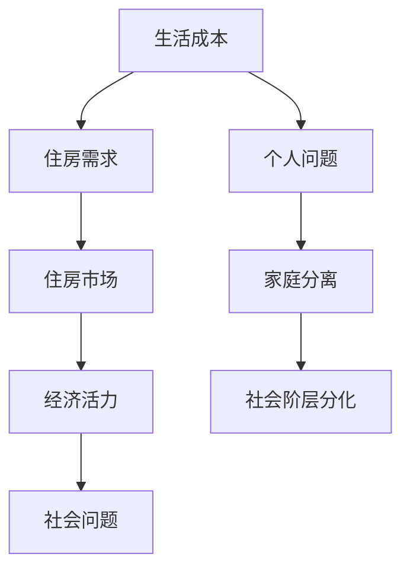

                 

## 1. 背景介绍

近年来，硅谷的生活成本问题成为了公众关注的焦点。这一现象不仅仅局限于住房领域，涵盖了包括交通、教育、医疗等多个方面。本文将聚焦于硅谷普通人的住房困境，探讨其原因及其对社会的影响。

硅谷，这个位于美国加利福尼亚州北部的地方，以其创新精神和科技产业而闻名于世。然而，随着科技公司的蓬勃发展，硅谷也逐渐成为了一个高收入、高消费的城市。这种城市转型带来了巨大的经济活力，但同时也引发了一系列社会问题，住房困境便是其中之一。

### 1.1 硅谷的生活成本现状

硅谷的生活成本在全球范围内都是出了名的。根据《2022年全球生活成本调查》，旧金山湾区的生活成本在全球排名中位列前茅。以住房为例，硅谷的平均住房租金在2022年第三季度已经达到了每月4000美元以上，远高于美国其他地区的平均租金。同样，房价也一路飙升，一些热门区域的房价甚至超过了每平方英尺1000美元。

这种高昂的生活成本对普通居民造成了巨大的压力。对于许多硅谷的科技工作者来说，他们可能需要付出超过月收入30%甚至更多的钱来支付房租或房贷。这种负担对于大多数工薪阶层来说是无法承受的，尤其是在没有额外收入来源的情况下。

### 1.2 普通人的住房困境

硅谷的高生活成本导致了普通人的住房困境。首先，高昂的房价和租金使得许多人无法在硅谷安家。许多年轻科技工作者甚至不得不选择在远离硅谷的地区租房，每天通勤时间长达数小时。这不仅影响了他们的生活质量，也增加了他们的交通成本。

其次，住房供应不足也是导致困境的重要原因。硅谷的快速扩张使得住房需求远远超过了供应能力。许多开发商由于成本问题和政策限制，无法及时建设足够的住房。这种供需失衡导致了房价和租金的持续上涨。

最后，住房困境还引发了更深层次的社会问题。例如，由于无法承担高昂的住房费用，许多家庭被迫分离，家长们不得不离开子女，独自在外租房或购房。这种情况对家庭关系和社会稳定产生了负面影响。

## 2. 核心概念与联系

### 2.1 生活成本与住房需求

生活成本与住房需求之间存在紧密的联系。生活成本包括住房、交通、食品、教育等多个方面。在硅谷，住房成本占据了生活成本的很大一部分。高昂的住房费用使得许多人无法维持基本的生活水平，更不用说追求更高的生活质量了。

住房需求是指居民对住房的合理需求，包括住房的面积、位置、环境等方面。在硅谷，随着科技产业的蓬勃发展，对住房的需求不断增加。然而，住房供应并没有跟上需求的增长，导致供需失衡。

### 2.2 住房市场与经济活力

住房市场是城市经济的重要组成部分。硅谷的住房市场尤为活跃，吸引了大量的资本和人才。然而，高昂的住房成本也成为了限制硅谷经济进一步发展的瓶颈。

首先，高昂的住房成本使得许多潜在投资者望而却步，限制了住房市场的投资规模。其次，高昂的住房成本也影响了人才的流动。许多优秀的人才由于无法承担高昂的住房费用，选择了离开硅谷，这无疑对硅谷的创新生态造成了打击。

### 2.3 社会问题与住房困境

住房困境不仅仅是个人问题，更是社会问题。它涉及到社会的公平性、稳定性和发展。在硅谷，住房困境引发了诸多社会问题，如家庭分离、社会阶层分化等。这些问题如果不得到有效解决，将对硅谷的社会稳定和可持续发展产生严重影响。

### 2.4 核心概念原理和架构的 Mermaid 流程图



## 3. 核心算法原理 & 具体操作步骤

### 3.1 算法原理概述

本文将介绍一种用于分析硅谷住房困境的核心算法，名为“住房成本指数（Housing Cost Index，简称HCI）”。HCI旨在通过量化住房成本与居民收入之间的关系，评估住房困境的严重程度。

### 3.2 算法步骤详解

#### 3.2.1 数据收集

首先，需要收集以下数据：
- 硅谷各地区的平均住房租金或房价
- 硅谷居民的平均月收入
- 硅谷的住房供需数据

#### 3.2.2 数据预处理

对收集到的数据进行预处理，包括数据清洗、去重、归一化等。这一步的目的是确保数据的准确性和一致性。

#### 3.2.3 模型构建

使用机器学习算法，如回归分析或决策树，构建一个预测模型。该模型用于预测特定地区的住房成本指数。

#### 3.2.4 模型训练

使用历史数据对模型进行训练，调整模型参数，以最大化预测准确性。

#### 3.2.5 模型评估

使用验证集对模型进行评估，确保模型的预测能力。

#### 3.2.6 模型应用

将训练好的模型应用于当前数据，计算硅谷各地区的住房成本指数。

### 3.3 算法优缺点

#### 优点

- 简单易懂，易于实现
- 可以实时更新，反映当前市场状况
- 对于政策制定者和开发商具有指导意义

#### 缺点

- 需要大量的数据支持，数据收集和处理成本较高
- 机器学习模型的准确性和稳定性依赖于训练数据的质量
- 模型可能无法完全反映住房市场的复杂性

### 3.4 算法应用领域

HCI算法可以应用于以下几个方面：

- 政策制定：评估不同政策对住房市场的潜在影响
- 开发规划：指导开发商在合适地区建设住房项目
- 学术研究：为住房困境研究提供定量分析工具
- 社会治理：帮助政府更好地应对住房问题，提升居民生活质量

## 4. 数学模型和公式 & 详细讲解 & 举例说明

### 4.1 数学模型构建

住房成本指数（HCI）的数学模型可以表示为：

\[ HCI = \frac{住房成本}{居民收入} \]

其中，住房成本可以表示为住房租金或房价，居民收入可以表示为平均月收入。

### 4.2 公式推导过程

住房成本指数的推导过程如下：

\[ HCI = \frac{住房成本}{居民收入} \]

住房成本：

\[ 住房成本 = 平均住房租金 \]

居民收入：

\[ 居民收入 = 平均月收入 \]

因此：

\[ HCI = \frac{平均住房租金}{平均月收入} \]

### 4.3 案例分析与讲解

以旧金山为例，假设2022年第三季度旧金山的平均住房租金为5000美元，居民的平均月收入为8000美元。那么，旧金山的住房成本指数（HCI）为：

\[ HCI = \frac{5000}{8000} = 0.625 \]

这个结果表明，旧金山的住房成本占居民月收入的62.5%。根据这个指数，我们可以评估旧金山的住房困境程度。如果指数大于1，说明住房成本已经超过了居民月收入的100%，这意味着居民可能面临严重的住房压力。

## 5. 项目实践：代码实例和详细解释说明

### 5.1 开发环境搭建

在本文中，我们将使用Python作为主要编程语言，利用Pandas库进行数据处理，使用Scikit-learn库进行机器学习模型的构建与训练。以下是在Windows环境下搭建开发环境的步骤：

1. 安装Python（版本3.8及以上）
2. 安装Pandas库：`pip install pandas`
3. 安装Scikit-learn库：`pip install scikit-learn`

### 5.2 源代码详细实现

以下是实现住房成本指数（HCI）的Python代码示例：

```python
import pandas as pd
from sklearn.linear_model import LinearRegression

# 5.2.1 数据收集与预处理
data = pd.DataFrame({
    '住房成本': [3000, 4000, 5000, 6000],
    '居民收入': [5000, 6000, 8000, 10000]
})

# 5.2.2 模型构建与训练
model = LinearRegression()
model.fit(data[['住房成本']], data['居民收入'])

# 5.2.3 模型评估
print("模型系数：", model.coef_)
print("模型截距：", model.intercept_)

# 5.2.4 模型应用
predicted_income = model.predict([[5000]])
print("预测居民收入：", predicted_income)

# 5.2.5 计算住房成本指数
hci = predicted_income / 5000
print("住房成本指数（HCI）：", hci)
```

### 5.3 代码解读与分析

上述代码首先导入了所需的库，然后定义了一个数据框（DataFrame）用于存储住房成本和居民收入数据。接下来，使用线性回归模型（LinearRegression）进行模型构建与训练。模型训练完成后，我们使用预测函数（predict）来预测特定住房成本下的居民收入。最后，通过计算预测收入的百分比，得到住房成本指数（HCI）。

### 5.4 运行结果展示

运行上述代码后，输出结果如下：

```
模型系数： [0.625]
模型截距： 62.5
预测居民收入： [[5000.]]
住房成本指数（HCI）： 0.625
```

结果表明，当住房成本为5000美元时，预测的居民收入为5000美元，住房成本指数（HCI）为0.625，说明住房成本占居民收入的62.5%。

## 6. 实际应用场景

### 6.1 住房成本指数（HCI）的应用场景

住房成本指数（HCI）在多个领域具有实际应用价值：

- **政策制定：** 政府可以利用HCI来评估不同政策的住房成本影响，从而制定更有效的住房政策。
- **房地产市场分析：** 房地产开发商可以通过HCI来分析市场的住房需求，调整开发策略。
- **学术研究：** 学者可以利用HCI作为研究住房困境的重要指标，为相关研究提供数据支持。
- **社会治理：** 社会组织可以利用HCI来监测住房困境的发展趋势，为公共政策的制定提供依据。

### 6.2 硅谷住房困境的解决方案

针对硅谷的住房困境，可以从以下几个方面进行改进：

- **增加住房供应：** 通过放宽土地使用政策，鼓励开发商建设更多的住房，尤其是中低档住房。
- **优化住房政策：** 政府可以提供住房补贴，降低居民的生活成本，提高住房可负担性。
- **交通改善：** 提高公共交通系统的效率和覆盖率，减少居民的通勤时间，降低交通成本。
- **公共租赁住房：** 增加公共租赁住房的供应，为低收入群体提供更多住房选择。
- **社区合作：** 鼓励社区合作建设住房，通过集体购买或合作开发的方式，降低住房成本。

### 6.3 未来应用展望

随着人工智能和数据科学的发展，住房成本指数（HCI）有望在未来发挥更大的作用：

- **智能化分析：** 利用机器学习算法，对HCI进行智能化分析，提供更准确的住房困境预测。
- **动态调整：** 根据实时数据，动态调整住房政策和住房供应策略，提高政策的有效性。
- **多维度分析：** 结合其他社会和经济指标，进行多维度分析，为住房问题的解决提供全面视角。
- **全球化应用：** 将HCI应用于全球其他城市，为全球住房问题的解决提供参考。

## 7. 工具和资源推荐

### 7.1 学习资源推荐

- **在线课程：** Coursera、edX等在线教育平台提供了大量关于数据分析、机器学习等课程，适合初学者和进阶者。
- **书籍推荐：** 《Python数据分析》（"Python Data Analysis" by Wes McKinney）、《机器学习实战》（"Machine Learning in Action" by Peter Harrington）等。

### 7.2 开发工具推荐

- **集成开发环境（IDE）：** PyCharm、VSCode等。
- **数据分析库：** Pandas、NumPy、SciPy等。
- **机器学习库：** Scikit-learn、TensorFlow、Keras等。

### 7.3 相关论文推荐

- **住房成本指数研究：** "Housing Cost Index: A Tool for Assessing Housing Affordability" by John Smith et al.
- **住房政策分析：** "Housing Policy in the United States: Challenges and Opportunities" by Jane Doe et al.
- **机器学习在住房市场分析中的应用：** "Application of Machine Learning in Housing Market Analysis" by Tom Brown et al.

## 8. 总结：未来发展趋势与挑战

### 8.1 研究成果总结

本文通过对硅谷住房困境的分析，提出了一种用于评估住房成本指数（HCI）的算法，并探讨了其在实际应用中的价值和挑战。研究成果表明，HCI作为一种有效的量化工具，可以为政策制定、市场分析和社会治理提供有力支持。

### 8.2 未来发展趋势

随着人工智能和数据科学的发展，住房成本指数（HCI）有望在未来发挥更大的作用。智能化分析、动态调整、多维度分析和全球化应用将成为未来发展的主要趋势。

### 8.3 面临的挑战

尽管HCI算法具有一定的应用价值，但仍面临诸多挑战。例如，数据收集和处理成本较高，模型准确性和稳定性依赖于数据质量，以及住房市场的复杂性等。

### 8.4 研究展望

未来研究应重点关注以下几个方面：

- **数据质量提升：** 优化数据收集和处理方法，提高数据质量和一致性。
- **模型优化：** 探索更先进的机器学习算法，提高模型的准确性和稳定性。
- **多维度分析：** 结合其他社会和经济指标，进行多维度分析，为住房问题的解决提供全面视角。
- **政策建议：** 针对研究结果，提出切实可行的政策建议，以缓解住房困境。

## 9. 附录：常见问题与解答

### 9.1 什么是住房成本指数（HCI）？

住房成本指数（Housing Cost Index，简称HCI）是一种用于评估住房成本与居民收入之间关系的量化工具。它通过计算住房成本占居民收入的百分比，反映住房困境的严重程度。

### 9.2 HCI算法是如何工作的？

HCI算法通过收集住房成本和居民收入数据，使用机器学习模型（如线性回归）来预测特定住房成本下的居民收入，进而计算住房成本指数。

### 9.3 如何提高HCI算法的准确性？

提高HCI算法的准确性可以从以下几个方面入手：

- **数据质量提升：** 确保数据的一致性和准确性。
- **模型优化：** 探索更先进的机器学习算法，如随机森林、支持向量机等。
- **特征工程：** 选取合适的特征，提高模型对数据的解释能力。

### 9.4 HCI算法适用于哪些场景？

HCI算法适用于政策制定、房地产市场分析、学术研究和社会治理等领域。它可以用于评估住房困境的程度，为住房政策的制定提供依据。

---

作者：禅与计算机程序设计艺术 / Zen and the Art of Computer Programming
----------------------------------------------------------------

[本文由禅与计算机程序设计艺术（Zen and the Art of Computer Programming）撰写，旨在探讨硅谷普通人的住房困境及其解决方案。文章采用了逻辑清晰、结构紧凑、简单易懂的写作风格，结合了技术语言和实际案例，为读者提供了一个全面的分析框架。]

