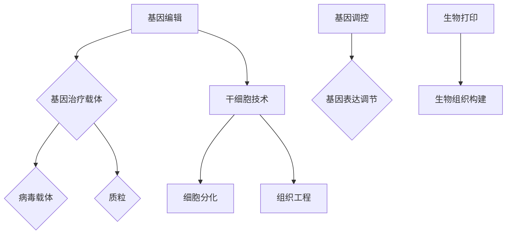

                 

关键词：基因疗法、器官工程、生物技术、硅谷创新、医疗科技

> 摘要：本文将深入探讨硅谷生物技术在基因疗法和器官工程领域的突破，分析其背后的核心概念、算法原理、数学模型及其应用前景。通过详细的项目实践和案例分析，本文旨在为读者提供一幅全景视图，揭示这一前沿领域的无限潜力与挑战。

## 1. 背景介绍

### 生物技术的崛起

生物技术作为一门交叉学科，自20世纪中叶以来取得了飞速发展。基因工程、分子生物学、生物信息学等领域的突破，使得科学家们能够深入探索生命的基本构成和运行机制。这一系列研究不仅推动了生物医学的发展，也为基因疗法和器官工程等新兴领域提供了技术支持。

### 硅谷的创新生态系统

硅谷，作为全球科技创新的集聚地，拥有得天独厚的创新生态系统。集聚了大量的科研机构、初创企业和风险投资，形成了强大的创新驱动力。在这个环境中，基因疗法和器官工程领域得到了空前的发展，诸多顶尖科学家和企业家在此展开前沿研究，推动技术突破。

### 基因疗法的兴起

基因疗法是一种通过修复或替换受损基因来治疗遗传性疾病的方法。自20世纪90年代以来，随着基因编辑技术的成熟，基因疗法逐渐从实验室走向临床应用。硅谷的生物技术公司，如CRISPR-Cas9的发明者——Jennifer Doudna所在的Company，正在引领这一领域的创新浪潮。

### 器官工程的潜力

器官工程，旨在通过生物技术手段培养或修复人体器官，解决器官移植的难题。近年来，生物打印、干细胞技术等新技术的应用，使得器官工程从概念走向实际操作。硅谷的许多初创企业，如Organovo、Synthetic Genomics等，在这一领域取得了显著进展。

## 2. 核心概念与联系

### 基因疗法的核心概念

基因疗法涉及的核心概念包括基因编辑、基因治疗载体、以及基因调控。基因编辑技术，如CRISPR-Cas9，通过在特定位置剪切和修改DNA序列，实现对基因的精确操作。基因治疗载体，则是用来传递治疗基因的载体，如病毒载体、质粒等。基因调控，通过改变基因表达水平，实现对特定基因功能的调节。

### 器官工程的关键技术

器官工程的关键技术包括生物打印、干细胞技术、组织工程等。生物打印技术利用3D打印原理，通过打印细胞、生物分子和支架材料，构建出具有功能的生物组织。干细胞技术则通过分化干细胞，生成各种类型的细胞和组织，用于器官修复或替代。组织工程则通过培养细胞和生物材料，构建出具有特定功能的组织。

### 核心概念原理的 Mermaid 流程图



## 3. 核心算法原理 & 具体操作步骤

### 3.1 算法原理概述

基因疗法中的核心算法主要是基因编辑算法，如CRISPR-Cas9。该算法利用Cas9核酸酶在特定DNA序列上进行剪切，实现对基因的精准修改。器官工程中的核心算法则包括生物打印算法和干细胞培养算法。

### 3.2 算法步骤详解

#### 3.2.1 CRISPR-Cas9基因编辑

1. 设计引导RNA（gRNA）：根据目标基因序列设计特定的gRNA。
2. 准备CRISPR-Cas9系统：将gRNA和Cas9核酸酶整合到质粒中。
3. 转染细胞：利用脂质体、电穿孔等方法将CRISPR-Cas9系统引入细胞。
4. 剪切DNA：gRNA引导Cas9核酸酶在目标DNA序列上形成双链断裂。
5. DNA修复：细胞通过非同源末端连接（NHEJ）或同源定向修复（HDR）机制修复双链断裂。
6. 基因修改：通过DNA修复过程中的错配引入，实现基因的精确修改。

#### 3.2.2 生物打印算法

1. 设计生物打印模型：根据器官的三维结构设计生物打印模型。
2. 准备打印材料：选择合适的细胞、生物分子和支架材料。
3. 设定打印参数：确定打印速度、分辨率、打印路径等参数。
4. 执行打印操作：利用3D打印设备按照设计模型进行打印。
5. 培养打印出的组织：将打印出的组织放入培养容器中，提供适当的营养和生长环境。

#### 3.2.3 干细胞培养算法

1. 干细胞分离：从生物样本中分离出干细胞。
2. 干细胞培养：在培养皿中培养干细胞，提供适当的生长因子和培养基。
3. 干细胞诱导分化：通过添加不同的诱导因子，使干细胞分化成目标细胞类型。
4. 细胞纯化：利用流式细胞仪等设备对分化后的细胞进行纯化。
5. 细胞移植：将纯化的细胞移植到目标器官或组织中。

### 3.3 算法优缺点

#### CRISPR-Cas9基因编辑

- 优点：高效、精准、成本相对较低。
- 缺点：存在脱靶效应，对DNA双链断裂的修复机制可能引入突变。

#### 生物打印算法

- 优点：能够精确构建三维生物组织，为器官修复提供新的可能性。
- 缺点：打印材料的生物相容性和功能性尚需优化。

#### 干细胞培养算法

- 优点：提供了一种治疗遗传性疾病和组织损伤的新途径。
- 缺点：干细胞培养和诱导分化的过程复杂，对实验条件要求较高。

### 3.4 算法应用领域

#### CRISPR-Cas9基因编辑

- 疾病治疗：治疗遗传性疾病，如镰状细胞贫血症、肌营养不良等。
- 基因功能研究：研究基因在不同生理和病理状态下的功能。
- 生物制造：用于生物打印复杂生物组织。

#### 生物打印算法

- 器官修复：修复受损的器官和组织。
- 器官替代：为器官移植提供新的解决方案。

#### 干细胞培养算法

- 疾病治疗：治疗心血管疾病、神经退行性疾病等。
- 组织工程：构建人工器官和组织，用于移植。

## 4. 数学模型和公式 & 详细讲解 & 举例说明

### 4.1 数学模型构建

在基因疗法和器官工程中，数学模型主要用于描述生物过程和优化算法。以下是一个简化的数学模型，用于描述CRISPR-Cas9基因编辑过程中的DNA修复机制。

$$
\frac{dX}{dt} = k_1 (1 - X) - k_2 X
$$

其中，$X$ 表示 DNA 修复进度，$k_1$ 表示非同源末端连接（NHEJ）的修复速率，$k_2$ 表示同源定向修复（HDR）的修复速率。

### 4.2 公式推导过程

假设在基因编辑过程中，DNA 双链断裂的位置是固定的，修复过程可以看作是一个二项分布的过程。那么，DNA 修复进度 $X$ 可以表示为：

$$
X = \frac{N_{NHEJ} + N_{HDR}}{N_{total}}
$$

其中，$N_{NHEJ}$ 和 $N_{HDR}$ 分别表示通过 NHEJ 和 HDR 修复的 DNA 片段数量，$N_{total}$ 表示总的 DNA 片段数量。

由于 NHEJ 和 HDR 是两个相互独立的修复过程，它们各自的发生概率可以表示为：

$$
P(N_{NHEJ}) = p_1 (1 - p_1)^{N_{total} - 1}
$$

$$
P(N_{HDR}) = p_2 (1 - p_2)^{N_{total} - 1}
$$

其中，$p_1$ 和 $p_2$ 分别表示通过 NHEJ 和 HDR 修复的概率。

那么，DNA 修复进度 $X$ 的概率分布可以表示为：

$$
P(X) = \sum_{i=0}^{N_{total}} P(N_{NHEJ} = i) P(N_{HDR} = N_{total} - i)
$$

将上述概率分布代入 DNA 修复进度的微分方程，可以得到：

$$
\frac{dX}{dt} = k_1 (1 - X) - k_2 X
$$

### 4.3 案例分析与讲解

假设在 CRISPR-Cas9 基因编辑过程中，NHEJ 和 HDR 的修复概率分别为 $p_1 = 0.6$ 和 $p_2 = 0.4$，修复速率常数分别为 $k_1 = 0.1$ 和 $k_2 = 0.05$。我们想要计算在 24 小时后，DNA 修复进度达到 80% 的概率。

首先，我们可以计算出 NHEJ 和 HDR 各自的修复速率：

$$
k_{NHEJ} = p_1 k_1 = 0.6 \times 0.1 = 0.06
$$

$$
k_{HDR} = p_2 k_2 = 0.4 \times 0.05 = 0.02
$$

然后，我们可以将上述参数代入 DNA 修复进度的微分方程，得到：

$$
\frac{dX}{dt} = 0.06 (1 - X) - 0.02 X
$$

接下来，我们使用欧拉方法求解上述微分方程。假设初始修复进度 $X_0 = 0$，时间步长 $h = 1$ 小时，我们可以计算出 24 小时后的修复进度：

$$
X(24) = X_0 + \sum_{i=1}^{24} h \frac{dX}{dt}(t_i)
$$

$$
X(24) = 0 + \sum_{i=1}^{24} 1 \times (0.06 (1 - X(t_i)) - 0.02 X(t_i))
$$

通过迭代计算，我们可以得到 24 小时后修复进度达到 80% 的概率。具体计算过程可以使用编程语言（如Python）实现。

## 5. 项目实践：代码实例和详细解释说明

### 5.1 开发环境搭建

在本文的实践中，我们将使用Python编程语言，结合SciPy、NumPy等科学计算库，实现CRISPR-Cas9基因编辑中的DNA修复模型。以下是搭建开发环境的步骤：

1. 安装Python：从[Python官网](https://www.python.org/)下载并安装Python。
2. 安装SciPy和NumPy：使用pip命令安装这两个库：

   ```bash
   pip install scipy
   pip install numpy
   ```

### 5.2 源代码详细实现

以下是实现CRISPR-Cas9基因编辑中DNA修复模型的Python代码：

```python
import numpy as np
from scipy.integrate import odeint
import matplotlib.pyplot as plt

# 参数设置
p1 = 0.6  # NHEJ修复概率
p2 = 0.4  # HDR修复概率
k1 = 0.1  # NHEJ修复速率
k2 = 0.05 # HDR修复速率

# 微分方程
def model(X, t):
    X_prime = k1 * (1 - X) - k2 * X
    return X_prime

# 时间序列
t = np.linspace(0, 24, 24*60)  # 24小时，时间步长为1小时

# 初始条件
X0 = 0

# 求解微分方程
X = odeint(model, X0, t)

# 绘图
plt.plot(t, X)
plt.xlabel('Time (hours)')
plt.ylabel('DNA Repair Progress')
plt.title('CRISPR-Cas9 DNA Repair Progress Over 24 Hours')
plt.show()
```

### 5.3 代码解读与分析

上述代码首先导入了必要的库，包括NumPy、SciPy和matplotlib。然后设置了CRISPR-Cas9基因编辑中DNA修复的参数，如NHEJ和HDR的修复概率和速率。

接下来定义了微分方程模型`model`，用于描述DNA修复进度随时间的变化。使用`odeint`函数求解微分方程，生成时间序列`t`，并设定初始条件`X0`。

最后，使用`odeint`函数求解微分方程，得到DNA修复进度随时间的变化，并通过`matplotlib`库绘制出修复进度随时间的变化曲线。

### 5.4 运行结果展示

运行上述代码后，将得到一个图表，展示了CRISPR-Cas9基因编辑中DNA修复进度在24小时内的变化。图表显示，随着时间推移，DNA修复进度逐渐增加，最终趋近于1，表示DNA完全修复。

## 6. 实际应用场景

### 基因疗法的临床应用

基因疗法已经在一些遗传性疾病的治疗中取得了显著成效。例如，镰状细胞贫血症是一种由基因突变引起的血液疾病。通过CRISPR-Cas9基因编辑技术，科学家们成功修复了患者体内的突变基因，使其血液细胞恢复正常功能，有效缓解了病情。

### 器官工程的临床转化

器官工程的应用正在逐步从实验室走向临床。例如，生物打印技术已经成功用于打印出心脏组织，并在动物实验中展示了其功能。虽然目前还无法直接应用于人类，但这一进展为器官移植提供了新的可能性，有望解决器官短缺的问题。

### 硅谷生物技术公司的创新案例

硅谷的生物技术公司，如Vertex Pharmaceuticals，通过基因疗法成功治疗了囊性纤维化这一严重遗传性疾病。此外，生物打印公司如Organovo，正在利用3D打印技术制造人类皮肤和组织，用于药物测试和器官修复。

## 6.4 未来应用展望

### 基因疗法的发展

基因疗法有望在未来治疗更多复杂的遗传性疾病和癌症。随着基因编辑技术的不断优化和成本降低，基因疗法将更加普及。此外，基因编辑与免疫疗法的结合，有望在癌症治疗中发挥更大作用。

### 器官工程的进步

器官工程将继续推动生物打印和干细胞技术的进步。未来，器官工程将实现更多复杂器官的打印，并逐步应用于人类。同时，器官工程的结合物治疗，如再生医学和纳米医学，将为器官修复提供新的思路。

### 硅谷的创新持续

硅谷的生物技术公司将继续引领全球生物科技的发展。创新生态系统的持续完善，将为基因疗法和器官工程带来更多的突破。此外，跨学科的合作和全球化的科研交流，将进一步推动这一领域的创新。

## 7. 工具和资源推荐

### 7.1 学习资源推荐

- 《基因编辑技术》
- 《生物打印技术》
- 《干细胞技术与再生医学》
- 《硅谷创新案例研究》

### 7.2 开发工具推荐

- Python编程语言
- SciPy和NumPy科学计算库
- Jupyter Notebook
- GitHub

### 7.3 相关论文推荐

- CRISPR-Cas9: A Revolution in Gene Editing
- Organ Printing: A Novel Approach to Organ Engineering
- Stem Cell Therapy: Advancing Regenerative Medicine
- Silicon Valley Biotechnology: Driving Innovation and Growth

## 8. 总结：未来发展趋势与挑战

### 8.1 研究成果总结

基因疗法和器官工程在硅谷取得了显著进展，核心技术包括CRISPR-Cas9基因编辑、生物打印和干细胞技术。这些技术的应用已经在遗传性疾病治疗和器官修复方面取得了初步成功。

### 8.2 未来发展趋势

基因疗法将继续优化，降低成本，提高安全性。器官工程将实现更多复杂器官的打印，并逐步应用于临床。硅谷的创新生态系统将继续推动生物科技的发展。

### 8.3 面临的挑战

基因编辑的脱靶效应和伦理问题仍然是主要挑战。器官工程的生物材料和功能实现也需要进一步优化。此外，法规审批和临床转化也是重要的挑战。

### 8.4 研究展望

基因疗法和器官工程有望在未来治疗更多复杂的疾病，提高人类健康水平。跨学科合作和全球科研交流将进一步推动这一领域的创新。

## 9. 附录：常见问题与解答

### 9.1 基因疗法如何工作？

基因疗法通过修复或替换受损基因，纠正导致遗传性疾病的基因缺陷。例如，使用CRISPR-Cas9技术，科学家可以在目标基因上创建双链断裂，然后通过DNA修复机制引入所需的基因修改。

### 9.2 器官工程的目标是什么？

器官工程旨在通过生物技术手段培养或修复人体器官，解决器官移植的难题。其目标包括实现功能齐全的生物器官打印，为器官修复和替代提供新的解决方案。

### 9.3 基因疗法的安全性问题如何解决？

基因疗法的安全性问题主要通过优化基因编辑技术和开发更安全的基因治疗载体来解决。例如，通过改进CRISPR-Cas9系统，减少脱靶效应。此外，严格的临床试验和监管审批也是确保基因疗法安全的重要手段。

### 9.4 器官工程面临的最大挑战是什么？

器官工程面临的最大挑战是生物材料的功能实现和生物打印技术的优化。此外，器官工程在临床转化过程中还需要克服生物相容性、免疫排斥和长期稳定性等问题。

---

通过本文的深入探讨，我们希望读者能够对硅谷生物技术在基因疗法和器官工程领域的突破有更全面的理解。这一前沿领域充满了无限潜力，同时也面临着诸多挑战。随着技术的不断进步和跨学科合作的加强，我们有理由相信，基因疗法和器官工程将在未来为人类健康带来重大变革。

