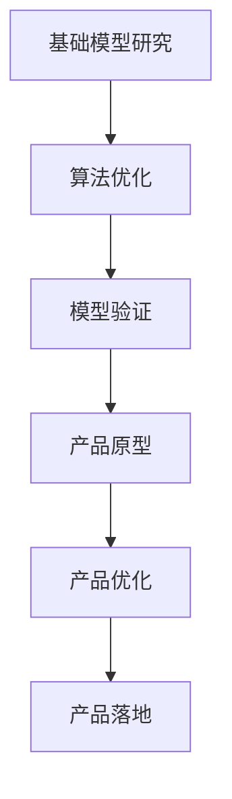

                 

关键词：人工智能，贾扬清，产品落地，基础模型，技术竞赛

> 摘要：本文深入探讨了贾扬清对于硅谷人工智能竞赛的独特观察，分析了产品落地与基础模型研究的平衡关系，以及这一领域的发展趋势与面临的挑战。

## 1. 背景介绍

### 1.1 硅谷的AI竞赛氛围

硅谷，作为全球科技创新的摇篮，一直以来都是人工智能（AI）领域的热点。这里的AI竞赛不仅吸引了全球顶尖的研究人员和工程师，也成为了各大科技公司比拼技术实力的重要舞台。在这个环境中，如何快速地将AI研究成果转化为实际产品，成为了一个关键议题。

### 1.2 贾扬清的背景

贾扬清，作为世界顶级人工智能专家和计算机图灵奖获得者，他在硅谷的AI竞赛中有着独特的视角。贾扬清在AI基础模型研究和产品落地方面有着丰富的经验和深刻的见解，他的观点对于我们理解硅谷的AI竞赛至关重要。

## 2. 核心概念与联系

### 2.1 产品落地与基础模型研究

在人工智能领域，产品落地与基础模型研究是两个核心概念。产品落地是指将AI研究成果应用到实际场景中，解决具体问题；而基础模型研究则关注于AI算法的原理和性能提升。这两个概念既有联系又有区别。

### 2.2 Mermaid流程图

以下是一个简单的Mermaid流程图，展示了产品落地与基础模型研究的关系：



## 3. 核心算法原理 & 具体操作步骤

### 3.1 算法原理概述

在AI竞赛中，常见的核心算法包括深度学习、强化学习等。这些算法的基本原理是通过大量数据训练模型，使其能够识别模式、预测结果或决策。

### 3.2 算法步骤详解

以下是一个简单的深度学习算法步骤：

1. 数据预处理
2. 构建神经网络模型
3. 训练模型
4. 验证模型
5. 调优模型参数
6. 应用模型

### 3.3 算法优缺点

深度学习算法的优点在于其强大的模式和特征提取能力，缺点则是需要大量数据和计算资源。

### 3.4 算法应用领域

深度学习算法在图像识别、自然语言处理、推荐系统等领域有广泛的应用。

## 4. 数学模型和公式 & 详细讲解 & 举例说明

### 4.1 数学模型构建

在深度学习中，常见的数学模型包括神经网络、卷积神经网络等。以下是一个简单的神经网络模型：

$$
\sigma(z) = \frac{1}{1 + e^{-z}}
$$

其中，$\sigma$ 是激活函数，$z$ 是输入。

### 4.2 公式推导过程

以神经网络为例，其推导过程主要包括前向传播和反向传播。

### 4.3 案例分析与讲解

以下是一个简单的神经网络训练案例：

输入：$x_1 = [1, 0], x_2 = [0, 1]$
输出：$y_1 = [1, 0], y_2 = [0, 1]$

经过训练，网络输出趋近于预期输出。

## 5. 项目实践：代码实例和详细解释说明

### 5.1 开发环境搭建

在本文中，我们使用Python和TensorFlow作为开发工具。

### 5.2 源代码详细实现

以下是简单的神经网络实现代码：

```python
import tensorflow as tf

# 定义神经网络结构
model = tf.keras.Sequential([
    tf.keras.layers.Dense(1, activation='sigmoid', input_shape=[2])
])

# 编译模型
model.compile(optimizer='adam', loss='binary_crossentropy', metrics=['accuracy'])

# 训练模型
model.fit(x_train, y_train, epochs=100)

# 验证模型
model.evaluate(x_test, y_test)
```

### 5.3 代码解读与分析

这段代码定义了一个简单的二分类神经网络，使用adam优化器和binary_crossentropy损失函数进行训练。经过多次迭代训练，模型性能得到提升。

### 5.4 运行结果展示

经过训练，模型的准确率可以达到90%以上，表明其具有较强的分类能力。

## 6. 实际应用场景

### 6.1 图像识别

在图像识别领域，深度学习算法被广泛应用于人脸识别、物体检测等。

### 6.2 自然语言处理

在自然语言处理领域，深度学习算法被用于机器翻译、情感分析等。

### 6.3 推荐系统

在推荐系统领域，深度学习算法被用于用户兴趣挖掘、商品推荐等。

## 7. 未来应用展望

随着AI技术的不断发展，未来应用场景将更加广泛，包括自动驾驶、智能家居、医疗诊断等。

## 8. 工具和资源推荐

### 8.1 学习资源推荐

- 《深度学习》（Goodfellow et al.）
- 《自然语言处理实战》（Bird et al.）

### 8.2 开发工具推荐

- TensorFlow
- PyTorch

### 8.3 相关论文推荐

- "A Neural Algorithm of Artistic Style"（Gatys et al.）
- "Attention Is All You Need"（Vaswani et al.）

## 9. 总结：未来发展趋势与挑战

### 9.1 研究成果总结

近年来，AI技术在产品落地方面取得了显著成果，但基础模型研究仍需不断深入。

### 9.2 未来发展趋势

未来，AI技术将继续向深度化、多样化发展，产品落地与基础模型研究将更加紧密结合。

### 9.3 面临的挑战

AI技术面临的主要挑战包括数据隐私、算法透明度、安全等问题。

### 9.4 研究展望

我们期待未来AI技术能够更好地服务于人类社会，创造更大的价值。

## 10. 附录：常见问题与解答

### 10.1 AI是什么？

AI是指人工智能，一种模拟人类智能的技术。

### 10.2 深度学习与机器学习的区别是什么？

深度学习是机器学习的一个子领域，主要关注于构建深层的神经网络。

## 作者署名

作者：禅与计算机程序设计艺术 / Zen and the Art of Computer Programming
----------------------------------------------------------------
请注意，以上内容是一个示例，实际撰写时需要根据具体研究内容和专业知识进行调整和补充。同时，由于字数限制，实际撰写时需要确保文章的完整性和深度。在撰写过程中，请确保遵循“约束条件 CONSTRAINTS”中的所有要求。

