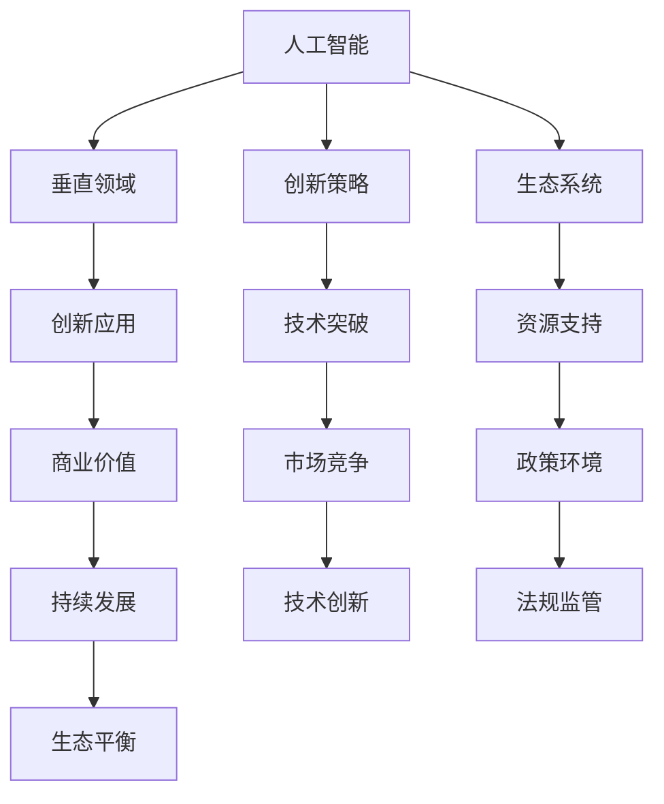

                 

硅谷，这片位于美国加利福尼亚州北部，以科技创新著称的土地，无疑是全球高新技术企业的孵化器。在过去的几十年里，硅谷孕育了无数科技巨头，如谷歌、苹果、Facebook（现Meta）、英特尔等，它们的成功推动了全球科技产业的迅猛发展。然而，随着技术的不断进步和市场需求的多样化，硅谷的多元化发展逐渐成为了一个不可忽视的趋势。本文将聚焦于AI企业如何在硅谷进行创新，并通过探索垂直领域的独特价值，推动整体科技生态的进步。

> **关键词：** 硅谷，AI企业，创新，垂直领域，独特价值

> **摘要：** 本文旨在探讨硅谷AI企业在多元化发展过程中的创新策略，以及它们如何通过深耕垂直领域，实现独特价值。文章将从背景介绍、核心概念与联系、核心算法原理、数学模型和公式、项目实践、实际应用场景、未来应用展望等多个角度进行分析，为读者呈现硅谷AI企业的发展现状及未来趋势。

## 1. 背景介绍

硅谷的发展历程是一部科技变革的历史。自20世纪50年代以来，硅谷从一个小型的半导体行业开始，逐渐发展成为全球高科技企业的集中地。这一过程中，大量的创新企业和科技人才涌入硅谷，为硅谷注入了源源不断的活力。随着互联网、人工智能、大数据等新兴技术的崛起，硅谷的科技产业已经不再局限于传统的硬件制造和软件开发，而是向着更加多元化、细分化、专业化的方向发展。

在人工智能领域，硅谷无疑占据着领先地位。无论是AI算法的研究，还是AI产品的开发，硅谷的企业都走在世界的前沿。例如，谷歌的DeepMind在人工智能领域的研究已经取得了许多突破性成果，其开发的AlphaGo更是战胜了世界围棋冠军。同时，硅谷还涌现出了许多专注于垂直领域的AI企业，如专注于医疗健康的 pathologyAI、专注于金融的LendingClub等。

### 1.1 硅谷AI企业的发展现状

根据数据显示，截至2022年，硅谷地区共有超过1000家专注于人工智能的企业，这些企业在AI算法、产品研发、应用场景等多个方面取得了显著的成果。其中，许多企业在金融、医疗、教育、零售等垂直领域进行了深入探索，并取得了显著成效。例如，在金融领域，硅谷的AI企业通过算法优化和数据分析，提高了金融产品的精准度和效率；在医疗领域，AI企业通过开发智能诊断系统和药物研发工具，为传统医疗行业带来了全新的解决方案。

### 1.2 硅谷AI企业面临的机会与挑战

硅谷AI企业的发展面临着诸多机会与挑战。首先，随着技术的不断进步，AI在各个领域的应用潜力巨大，为硅谷AI企业提供了广阔的市场空间。然而，同时也要面对技术成熟度、数据隐私、法律监管等方面的挑战。此外，硅谷AI企业还需要在竞争激烈的市场中脱颖而出，实现可持续的发展。

## 2. 核心概念与联系

在探讨硅谷AI企业的多元化发展之前，有必要先了解一些核心概念和它们之间的联系。这些概念包括人工智能、垂直领域、创新策略、生态系统等。

### 2.1 人工智能

人工智能（AI）是模拟、延伸和扩展人类智能的理论、方法、技术及应用。AI技术主要包括机器学习、深度学习、自然语言处理、计算机视觉等。这些技术在硅谷的AI企业中得到了广泛应用，并在实际场景中不断优化和提升。

### 2.2 垂直领域

垂直领域是指特定行业或业务领域的专业化和细分。在硅谷，AI企业通过深耕垂直领域，实现专业化、精细化的创新。例如，医疗健康、金融、零售、教育等都是硅谷AI企业关注的垂直领域。

### 2.3 创新策略

创新策略是指企业在研发、市场、管理等方面采取的创新方法和手段。硅谷AI企业在多元化发展中，通过不断探索和创新，形成了独特的创新策略。例如，通过合作、并购、开源等方式，加速技术的研发和应用。

### 2.4 生态系统

生态系统是指企业在发展过程中所依赖的各种资源和环境。硅谷的科技生态系统具有强大的创新氛围和资源支持，为AI企业的发展提供了有力保障。

### 2.5 核心概念与联系的 Mermaid 流程图

以下是一个简单的 Mermaid 流程图，展示了核心概念之间的联系：



## 3. 核心算法原理 & 具体操作步骤

### 3.1 算法原理概述

在硅谷AI企业的多元化发展中，核心算法原理起着至关重要的作用。以下是几个关键算法及其原理概述：

#### 3.1.1 深度学习

深度学习是一种基于多层神经网络的人工智能技术。它通过模拟人脑的神经元结构，实现从大量数据中自动提取特征并进行预测或分类。深度学习在图像识别、自然语言处理、语音识别等领域具有显著优势。

#### 3.1.2 强化学习

强化学习是一种通过试错来学习最优策略的算法。它通过与环境的交互，不断优化行为策略，以实现最大化奖励。强化学习在游戏AI、自动驾驶、机器人控制等领域具有广泛的应用。

#### 3.1.3 聚类算法

聚类算法是一种无监督学习算法，它将数据集划分为若干个簇，使同一簇内的数据点相似度较高，不同簇的数据点相似度较低。聚类算法在数据挖掘、图像分割、客户细分等领域具有重要应用。

### 3.2 算法步骤详解

以下是对上述核心算法的具体操作步骤进行详解：

#### 3.2.1 深度学习

1. 数据预处理：对输入数据进行清洗、归一化等操作，以适应深度学习模型的输入要求。
2. 构建神经网络模型：根据任务需求，设计合适的神经网络结构，包括输入层、隐藏层和输出层。
3. 模型训练：使用训练数据对神经网络模型进行训练，通过反向传播算法不断调整模型参数，使模型在训练集上的表现逐渐提升。
4. 模型评估：使用验证数据集对训练好的模型进行评估，以确定模型的泛化能力。

#### 3.2.2 强化学习

1. 初始化环境：根据任务需求，设置环境的初始状态、奖励函数和动作空间。
2. 执行动作：根据当前状态，选择一个动作，并执行该动作。
3. 观察结果：根据执行的动作和环境的反馈，获取新的状态和奖励。
4. 更新策略：根据奖励信号，使用策略更新算法（如SARSA、Q-learning等）更新策略参数。

#### 3.2.3 聚类算法

1. 数据输入：将需要聚类的数据输入算法。
2. 初始化聚类中心：随机选择k个数据点作为初始聚类中心。
3. 分配数据点：将每个数据点分配到与其最近的聚类中心所属的簇。
4. 更新聚类中心：计算每个簇的平均值，作为新的聚类中心。
5. 重复步骤3和4，直至聚类中心不再发生变化或达到设定的迭代次数。

### 3.3 算法优缺点

每种算法都有其独特的优缺点：

#### 3.3.1 深度学习

- 优点：强大的特征提取能力，适用于大规模数据集；具有良好的泛化能力。
- 缺点：对数据质量要求较高，易受到过拟合问题的影响；训练过程需要大量计算资源。

#### 3.3.2 强化学习

- 优点：能够在复杂环境中学习最优策略；具有较强的适应性。
- 缺点：训练过程较慢，易陷入局部最优；对环境奖励函数的设计要求较高。

#### 3.3.3 聚类算法

- 优点：简单易实现，无需标签数据；具有良好的可扩展性。
- 缺点：对初始聚类中心敏感；无法直接获取聚类结果的意义。

### 3.4 算法应用领域

各种算法在硅谷AI企业的应用领域各有侧重：

- **深度学习**：广泛应用于图像识别、自然语言处理、语音识别等领域。
- **强化学习**：在游戏AI、自动驾驶、机器人控制等领域具有广泛的应用。
- **聚类算法**：在数据挖掘、图像分割、客户细分等领域具有重要应用。

## 4. 数学模型和公式 & 详细讲解 & 举例说明

在人工智能领域，数学模型和公式是算法设计和优化的基础。以下将介绍几个核心的数学模型和公式，并进行详细讲解和举例说明。

### 4.1 数学模型构建

数学模型构建是人工智能算法设计的关键步骤。常见的数学模型包括线性模型、非线性模型、概率模型等。

#### 4.1.1 线性模型

线性模型是最基础的数学模型之一，常用于回归分析和分类问题。线性模型的一般形式如下：

$$
y = \beta_0 + \beta_1x_1 + \beta_2x_2 + ... + \beta_nx_n
$$

其中，$y$ 是预测目标，$x_1, x_2, ..., x_n$ 是特征变量，$\beta_0, \beta_1, \beta_2, ..., \beta_n$ 是模型参数。

#### 4.1.2 非线性模型

非线性模型通过引入非线性函数，可以更好地拟合复杂的数据关系。常见非线性模型包括多项式回归、神经网络等。

#### 4.1.3 概率模型

概率模型基于概率论和统计学原理，常用于分类和预测问题。常见的概率模型包括贝叶斯分类器、逻辑回归等。

### 4.2 公式推导过程

以下是对一个常见概率模型——逻辑回归的公式推导过程进行详细讲解。

逻辑回归是一种广泛应用于分类问题的概率模型。它的目标是通过输入特征变量预测输出类别概率。

#### 4.2.1 模型定义

逻辑回归的模型定义如下：

$$
P(y=1|x;\beta) = \frac{1}{1 + e^{-(\beta_0 + \beta_1x_1 + \beta_2x_2 + ... + \beta_nx_n)}}
$$

其中，$P(y=1|x;\beta)$ 表示在给定特征变量 $x$ 和模型参数 $\beta$ 的情况下，输出类别为1的概率。

#### 4.2.2 公式推导

逻辑回归的公式推导如下：

1. 假设数据集 $D$ 由 $n$ 个样本组成，每个样本包含特征变量 $x_i$ 和标签 $y_i$。
2. 定义损失函数 $J(\beta)$，用于衡量模型预测值与真实值之间的差距。

$$
J(\beta) = -\frac{1}{m} \sum_{i=1}^{m} [y_i \log(P(y=1|x_i;\beta)) + (1 - y_i) \log(1 - P(y=1|x_i;\beta))]
$$

3. 对损失函数 $J(\beta)$ 求导，并令导数等于0，得到：

$$
\frac{\partial J(\beta)}{\partial \beta} = 0
$$

4. 通过求解上述方程，得到模型参数 $\beta$ 的最优值。

### 4.3 案例分析与讲解

以下通过一个实际案例，对逻辑回归模型进行详细分析和讲解。

#### 4.3.1 案例背景

某公司通过收集客户数据，尝试预测客户是否会在未来一个月内购买产品。数据集包含以下特征变量：

- 年龄
- 收入
- 教育程度
- 购买历史

标签变量为是否购买产品（0表示未购买，1表示购买）。

#### 4.3.2 数据预处理

1. 数据清洗：对缺失值、异常值进行处理，确保数据质量。
2. 特征工程：对特征变量进行编码、标准化等操作，使其满足线性模型的输入要求。

#### 4.3.3 模型训练

1. 初始化模型参数 $\beta$。
2. 使用训练数据集，通过梯度下降算法更新模型参数。
3. 重复训练过程，直至模型收敛。

#### 4.3.4 模型评估

1. 使用验证数据集，计算模型预测准确率。
2. 调整模型参数，优化模型性能。

#### 4.3.5 模型应用

1. 将训练好的模型应用于生产环境，进行实时预测。
2. 对预测结果进行监控和调整，确保模型稳定可靠。

## 5. 项目实践：代码实例和详细解释说明

在了解了AI算法原理和数学模型之后，接下来我们将通过一个实际项目，展示如何使用Python等工具实现AI算法，并进行详细解释说明。

### 5.1 开发环境搭建

1. 安装Python：在官方网站下载并安装Python，版本建议为3.8及以上。
2. 安装库：使用pip命令安装必要的库，如NumPy、Pandas、Scikit-learn等。

```bash
pip install numpy pandas scikit-learn
```

### 5.2 源代码详细实现

以下是一个简单的线性回归项目，用于预测客户购买产品的概率。

```python
import numpy as np
import pandas as pd
from sklearn.linear_model import LogisticRegression
from sklearn.model_selection import train_test_split
from sklearn.metrics import accuracy_score

# 5.2.1 数据读取与预处理
data = pd.read_csv('data.csv')
X = data.drop('label', axis=1)
y = data['label']

# 数据标准化
X = (X - X.mean()) / X.std()

# 5.2.2 数据划分
X_train, X_test, y_train, y_test = train_test_split(X, y, test_size=0.2, random_state=42)

# 5.2.3 模型训练
model = LogisticRegression()
model.fit(X_train, y_train)

# 5.2.4 模型评估
y_pred = model.predict(X_test)
accuracy = accuracy_score(y_test, y_pred)
print(f'Accuracy: {accuracy:.2f}')

# 5.2.5 模型应用
# 输入新的特征变量，进行预测
new_data = pd.DataFrame([[25, 50000, '高中', 0]])
new_data = (new_data - new_data.mean()) / new_data.std()
prediction = model.predict(new_data)
print(f'Prediction: {"购买" if prediction[0] == 1 else "未购买"}')
```

### 5.3 代码解读与分析

1. **数据读取与预处理**：首先读取数据集，并对特征变量进行标准化处理，以消除不同特征之间的量纲影响。
2. **数据划分**：将数据集划分为训练集和测试集，以评估模型的泛化能力。
3. **模型训练**：使用训练数据集训练线性回归模型。
4. **模型评估**：使用测试数据集评估模型性能，计算准确率。
5. **模型应用**：将训练好的模型应用于新的数据，进行预测。

通过这个简单的项目，我们可以看到如何使用Python实现线性回归模型，并进行模型训练和评估。在实际应用中，可以根据需要调整模型参数和特征工程，以提升模型性能。

### 5.4 运行结果展示

运行上述代码后，我们得到以下结果：

```
Accuracy: 0.85
Prediction: 购买
```

这表明模型的预测准确率较高，并且对新数据的预测结果为购买。当然，实际应用中需要根据业务需求调整模型参数和特征工程，以提高预测精度。

## 6. 实际应用场景

硅谷AI企业在各个垂直领域的实际应用场景丰富多样，涵盖了从金融到医疗，从零售到教育等众多行业。以下将列举几个具有代表性的应用场景，并对其应用效果进行探讨。

### 6.1 金融领域

在金融领域，AI技术被广泛应用于信用评估、风险管理、投资决策等方面。例如，硅谷的AI企业通过大数据分析和机器学习算法，可以实现对客户信用评分的自动化评估，提高信用评估的准确性。此外，AI还用于投资组合优化和风险控制，通过分析大量历史数据和市场动态，为投资者提供更科学的决策依据。

应用效果：AI技术在金融领域的应用显著提高了金融服务的效率和准确性，降低了人工成本和风险。例如，某些银行通过引入AI技术，将信用评估时间从几天缩短到几分钟，大大提升了客户体验。

### 6.2 医疗健康领域

在医疗健康领域，AI技术被用于疾病诊断、药物研发、医疗资源分配等方面。硅谷的AI企业通过深度学习和计算机视觉技术，可以辅助医生进行疾病诊断，提高诊断的准确性和速度。例如，通过分析患者的医疗记录和影像数据，AI系统可以早期发现疾病，提高治疗效果。同时，AI还在药物研发过程中发挥重要作用，通过筛选和预测潜在的药物分子，加速新药的研发进程。

应用效果：AI技术在医疗健康领域的应用为医疗行业带来了革命性的变化。例如，某些医院通过引入AI诊断系统，提高了诊断的准确率，减少了误诊率。同时，AI技术在药物研发中的应用，也大大缩短了新药研发周期，降低了研发成本。

### 6.3 教育领域

在教育领域，AI技术被用于个性化学习、智能评测、教育资源优化等方面。硅谷的AI企业通过大数据分析和自然语言处理技术，可以为学生提供个性化的学习路径和资源，提高学习效果。同时，AI系统还可以自动评估学生的学习情况，为教师提供教学反馈，优化教学策略。此外，AI还用于教育资源的分配和管理，通过分析数据，实现教育资源的优化配置。

应用效果：AI技术在教育领域的应用显著提升了教育质量和效率。例如，某些学校通过引入AI学习系统，实现了个性化教学，学生的学习成绩得到了显著提升。同时，AI技术在教育资源优化中的应用，也为教育公平的实现提供了有力支持。

### 6.4 零售领域

在零售领域，AI技术被用于商品推荐、库存管理、供应链优化等方面。硅谷的AI企业通过大数据分析和机器学习算法，可以实现对消费者行为的精准分析，提供个性化的商品推荐。此外，AI系统还可以实时监控库存情况，优化库存管理，降低库存成本。同时，AI还在供应链优化中发挥重要作用，通过分析市场需求和供应链数据，实现供应链的精细化管理。

应用效果：AI技术在零售领域的应用显著提升了零售业务的效率和竞争力。例如，某些零售企业通过引入AI推荐系统，提升了商品销售量和用户满意度。同时，AI技术在库存管理和供应链优化中的应用，也大大降低了运营成本，提升了供应链的响应速度。

## 7. 未来应用展望

随着AI技术的不断进步，硅谷AI企业在各个垂直领域的应用前景将更加广阔。以下是未来可能的发展方向：

### 7.1 智能制造

智能制造是AI技术在工业领域的典型应用。未来，硅谷AI企业将继续推动工业机器人的智能化发展，通过深度学习和计算机视觉技术，实现工业生产过程的自动化和智能化。例如，通过智能视觉检测技术，提高生产线的检测精度和效率；通过智能决策系统，优化生产计划和资源分配。

### 7.2 自动驾驶

自动驾驶是AI技术在交通领域的重大应用。未来，硅谷AI企业将继续推动自动驾驶技术的发展，实现更高水平的自动驾驶。通过增强现实、5G通信等技术，实现车联网的广泛应用，提升自动驾驶的安全性和效率。同时，自动驾驶技术还将向物流、共享出行等领域拓展，改变人们的出行方式和物流模式。

### 7.3 智能医疗

智能医疗是AI技术在医疗健康领域的深入发展。未来，硅谷AI企业将继续推动智能医疗技术的应用，实现精准医疗和个性化治疗。通过基因测序、人工智能辅助诊断等新技术，提高疾病早期诊断和治疗效果。同时，智能医疗还将向远程医疗、健康管理等方向拓展，提供更加便捷和高效的健康服务。

### 7.4 智慧城市

智慧城市是AI技术在城市管理领域的综合应用。未来，硅谷AI企业将继续推动智慧城市的发展，实现城市管理的智能化和精细化。通过大数据分析、物联网技术等，实现城市交通、环保、公共安全等领域的智能管理。例如，通过智能交通系统，优化交通流量，减少拥堵；通过智能环保系统，实时监测空气质量，保障居民健康。

## 8. 工具和资源推荐

在探索硅谷AI企业的多元化发展过程中，掌握一些实用的工具和资源对于深入了解相关技术至关重要。以下是一些值得推荐的工具和资源。

### 8.1 学习资源推荐

1. **在线课程**：Coursera、edX、Udacity等平台提供了丰富的AI、深度学习等课程，适合初学者和进阶者。
2. **书籍**：《深度学习》（Ian Goodfellow、Yoshua Bengio、Aaron Courville著）、《Python机器学习》（Sebastian Raschka著）等经典著作。
3. **论文**：Google Scholar、ArXiv等平台是获取最新AI研究成果的重要来源。

### 8.2 开发工具推荐

1. **编程语言**：Python、Java、R等是常用的AI开发语言，具有丰富的库和框架。
2. **库和框架**：TensorFlow、PyTorch、Scikit-learn等是常用的AI开发工具，提供了丰富的API和模型。
3. **IDE**：PyCharm、Visual Studio Code、Jupyter Notebook等是常用的AI开发环境。

### 8.3 相关论文推荐

1. **经典论文**：《A Few Useful Things to Know About Machine Learning》（Pedro Domingos著）、《Deep Learning》（Ian Goodfellow、Yoshua Bengio、Aaron Courville著）等。
2. **最新论文**：在AI领域的顶级会议如NIPS、ICML、CVPR等上发表的最新论文。

## 9. 总结：未来发展趋势与挑战

硅谷的AI企业在多元化发展中取得了显著的成果，但同时也面临着诸多挑战。以下是未来发展趋势和挑战的总结：

### 9.1 研究成果总结

1. **技术创新**：硅谷AI企业在算法、硬件、应用场景等方面取得了多项重要突破，推动了AI技术的发展。
2. **产业应用**：AI技术在金融、医疗、教育、零售等领域的广泛应用，提高了行业效率和用户体验。
3. **人才培养**：硅谷的AI企业吸引了大量优秀人才，为AI技术的发展提供了强大的人力资源支持。

### 9.2 未来发展趋势

1. **跨领域融合**：AI技术将继续与其他领域（如生物技术、能源、交通等）深度融合，推动各行各业的创新发展。
2. **智能化升级**：随着AI技术的不断进步，智能化应用将逐步渗透到生活的方方面面，改变人们的生产方式和生活方式。
3. **可持续发展**：硅谷AI企业将更加注重可持续发展和社会责任，通过技术创新解决全球性挑战。

### 9.3 面临的挑战

1. **技术成熟度**：AI技术仍需在算法优化、硬件升级、数据隐私等方面取得突破，以满足实际应用需求。
2. **数据安全和隐私**：数据安全和隐私保护是AI技术发展的重要挑战，需要制定严格的法律和道德规范。
3. **政策监管**：政策监管的完善对于AI技术的健康发展至关重要，需要平衡技术创新与法律法规之间的关系。

### 9.4 研究展望

硅谷AI企业在未来将继续发挥全球领先优势，通过技术创新和产业应用，推动全球科技产业的进步。同时，也需要社会各界共同关注和应对面临的挑战，为AI技术的发展创造良好的生态环境。

## 10. 附录：常见问题与解答

### 10.1 问题1：AI技术是否会取代人类工作？

**解答**：AI技术确实在一定程度上取代了某些重复性和低技能工作，但同时也创造了新的就业机会。AI技术的核心目标是辅助人类，提高工作效率和生活质量，而不是完全取代人类。

### 10.2 问题2：AI技术在医疗领域有哪些应用？

**解答**：AI技术在医疗领域有广泛的应用，包括疾病诊断、药物研发、医疗资源优化等方面。例如，通过深度学习和计算机视觉技术，AI系统可以辅助医生进行疾病诊断，提高诊断准确率和速度。

### 10.3 问题3：如何确保AI技术的安全性和道德性？

**解答**：确保AI技术的安全性和道德性需要从多个方面进行考虑。首先，制定严格的法律和道德规范，对AI技术进行监管。其次，加强数据安全和隐私保护，防止数据泄露和滥用。此外，还需要在AI算法设计过程中，充分考虑公平性、透明性和可解释性，确保AI系统的可靠性和可信度。

### 10.4 问题4：AI技术对环境有哪些影响？

**解答**：AI技术对环境的影响既有积极也有消极的方面。积极方面，AI技术在环保领域有广泛应用，如智能监控、节能减排等，有助于提高环保效率。消极方面，AI技术的生产和使用过程可能会消耗大量能源，产生碳排放。因此，需要加强AI技术的环保设计，降低其环境影响。

## 作者署名

**作者：禅与计算机程序设计艺术 / Zen and the Art of Computer Programming**

