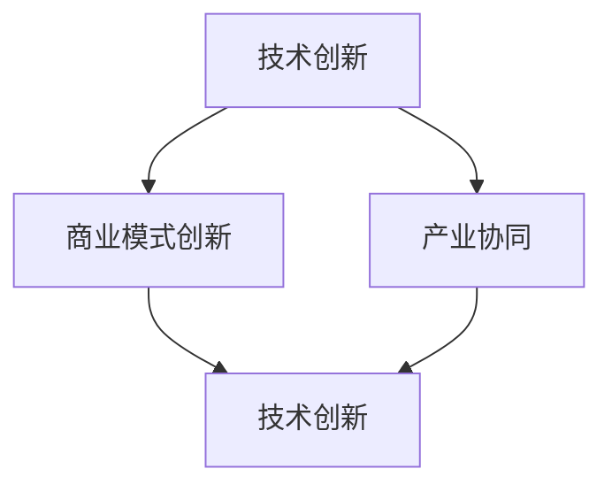

                 

关键词：硅谷，AI企业，创新，垂直领域，价值

摘要：本文将深入探讨硅谷地区AI企业的多元化发展，分析其在不同垂直领域的创新模式，探讨这些创新如何为行业带来独特价值。通过具体案例和实践，我们将展示硅谷AI企业如何利用技术优势，推动行业变革，并展望其未来的发展趋势。

## 1. 背景介绍

硅谷，位于美国加利福尼亚州旧金山湾区，是全球科技创新的代名词。自20世纪中叶以来，硅谷以其独特的创新环境、强大的技术底蕴和丰富的创业资源，吸引了全球的科技人才和投资。作为全球科技产业的中心，硅谷孕育了无数科技巨头，如苹果、谷歌、Facebook等，同时也成为AI领域的领军地区。

近年来，随着人工智能技术的飞速发展，硅谷的AI企业呈现出多元化的发展态势。从传统的互联网公司到初创企业，再到科研机构，都在积极探索人工智能的应用，推动行业变革。本文将重点关注硅谷AI企业在不同垂直领域的创新实践，分析其独特价值，并探讨未来发展趋势。

## 2. 核心概念与联系

### 2.1 硅谷AI企业多元化发展的核心概念

硅谷AI企业多元化发展的核心概念包括技术创新、商业模式创新和产业协同。技术创新是硅谷AI企业发展的基石，通过不断研发和应用前沿的人工智能技术，如深度学习、自然语言处理、计算机视觉等，提升产品和服务的智能化水平。商业模式创新则是硅谷AI企业拓展市场、实现商业价值的重要手段，如通过大数据分析、精准营销、个性化推荐等方式，创造新的商业模式。产业协同则是硅谷AI企业实现产业链协同效应、提升整体竞争力的重要途径，通过跨界合作、产业链整合，实现资源优化配置。

### 2.2 硅谷AI企业多元化发展的联系

硅谷AI企业的多元化发展，离不开技术创新、商业模式创新和产业协同之间的紧密联系。技术创新为商业模式创新提供了技术支撑，使得硅谷AI企业能够不断拓展应用场景，实现商业价值的最大化。商业模式创新则为技术创新提供了市场反馈，推动了技术的不断迭代和优化。产业协同则实现了产业链的优化和整合，提高了整体竞争力，为硅谷AI企业的多元化发展提供了有力保障。

### 2.3 Mermaid流程图

下面是一个简化的Mermaid流程图，展示了硅谷AI企业多元化发展的核心概念和联系：



## 3. 核心算法原理 & 具体操作步骤

### 3.1 算法原理概述

硅谷AI企业在多元化发展中，广泛采用了多种核心算法，以实现智能化应用和商业价值的最大化。以下是几种常见的核心算法原理：

1. **深度学习**：基于人工神经网络，通过多层非线性变换，实现对数据的特征提取和模式识别。
2. **自然语言处理（NLP）**：通过对文本数据的处理和分析，实现语言理解、生成和交互。
3. **计算机视觉**：通过对图像和视频数据的处理和分析，实现物体识别、场景理解等。
4. **强化学习**：通过试错和反馈机制，实现智能体的自主学习和决策。

### 3.2 算法步骤详解

以深度学习为例，其基本步骤如下：

1. **数据收集与预处理**：收集大规模的数据集，并对数据进行清洗、标注等预处理操作。
2. **模型设计**：根据应用场景，设计合适的神经网络结构，如卷积神经网络（CNN）、循环神经网络（RNN）等。
3. **模型训练**：使用预处理后的数据，对模型进行训练，通过反向传播算法优化模型参数。
4. **模型评估与优化**：使用验证集和测试集，对模型进行评估和优化，提高模型性能。
5. **模型部署**：将训练好的模型部署到生产环境中，实现智能化应用。

### 3.3 算法优缺点

- **深度学习**：优点包括强大的特征提取能力、自适应性强等，缺点则包括对数据依赖性强、计算资源消耗大等。
- **自然语言处理（NLP）**：优点包括处理文本数据的灵活性、语言理解能力强等，缺点则包括数据稀缺性、语言歧义等问题。
- **计算机视觉**：优点包括处理图像和视频数据的准确性、实时性强等，缺点则包括对计算资源的需求较高、场景适应性较差等。
- **强化学习**：优点包括自主学习和决策能力强、适用于复杂环境等，缺点则包括训练时间较长、收敛性较差等。

### 3.4 算法应用领域

硅谷AI企业的核心算法广泛应用于各个垂直领域，如：

- **金融**：利用深度学习和自然语言处理，实现智能投顾、风险控制、量化交易等。
- **医疗**：利用计算机视觉和自然语言处理，实现医学影像诊断、电子病历管理、智能问诊等。
- **教育**：利用自然语言处理和计算机视觉，实现智能教学、个性化推荐、作业批改等。
- **零售**：利用计算机视觉和深度学习，实现商品识别、智能导购、库存管理等。

## 4. 数学模型和公式 & 详细讲解 & 举例说明

### 4.1 数学模型构建

在人工智能领域，常见的数学模型包括神经网络、决策树、支持向量机等。以下以神经网络为例，简要介绍其数学模型构建。

1. **输入层**：接收外部输入数据，通常为高维向量。
2. **隐藏层**：通过非线性变换，对输入数据进行特征提取和模式识别，通常包含多层。
3. **输出层**：生成预测结果或决策，通常为标量或低维向量。

### 4.2 公式推导过程

神经网络的核心是权重矩阵和偏置项。以下是一个简化的神经网络公式推导过程：

1. **前向传播**：输入数据通过权重矩阵和偏置项，经过隐藏层和输出层的非线性变换，生成预测结果。
   \[ a^{(l)} = \sigma(W^{(l)}a^{(l-1)} + b^{(l)}) \]
   其中，\( a^{(l)} \) 表示第 \( l \) 层的激活值，\( W^{(l)} \) 和 \( b^{(l)} \) 分别表示第 \( l \) 层的权重矩阵和偏置项，\( \sigma \) 表示非线性激活函数。

2. **反向传播**：根据预测结果与实际结果的误差，通过梯度下降法优化权重矩阵和偏置项。
   \[ \Delta W^{(l)} = \alpha \cdot \frac{\partial L}{\partial W^{(l)}} \]
   \[ \Delta b^{(l)} = \alpha \cdot \frac{\partial L}{\partial b^{(l)}} \]
   其中，\( \Delta W^{(l)} \) 和 \( \Delta b^{(l)} \) 分别表示第 \( l \) 层的权重矩阵和偏置项的更新值，\( \alpha \) 表示学习率，\( L \) 表示损失函数。

### 4.3 案例分析与讲解

以下以一个简单的线性回归模型为例，介绍数学模型的构建和公式推导。

#### 案例背景

假设我们有一个简单的数据集，包含两个特征 \( x_1 \) 和 \( x_2 \)，以及一个目标值 \( y \)。我们的目标是建立线性回归模型，预测目标值 \( y \)。

#### 数学模型构建

1. **输入层**：输入数据为 \( x = [x_1, x_2] \)。
2. **隐藏层**：通过权重矩阵 \( W \) 和偏置项 \( b \)，对输入数据进行线性变换。
   \[ z = Wx + b \]
3. **输出层**：输出预测结果 \( y' \)。
   \[ y' = z \]

#### 公式推导过程

1. **前向传播**：输入数据 \( x \) 通过权重矩阵 \( W \) 和偏置项 \( b \)，生成预测结果 \( y' \)。
   \[ z = Wx + b \]
   \[ y' = z \]

2. **反向传播**：计算损失函数 \( L \) ，并通过梯度下降法优化权重矩阵 \( W \) 和偏置项 \( b \)。
   \[ L = (y - y')^2 \]
   \[ \frac{\partial L}{\partial W} = -2(y - y')x \]
   \[ \frac{\partial L}{\partial b} = -2(y - y') \]

   更新权重矩阵和偏置项：
   \[ W = W - \alpha \frac{\partial L}{\partial W} \]
   \[ b = b - \alpha \frac{\partial L}{\partial b} \]

#### 案例分析

通过上述数学模型，我们可以对新的输入数据进行预测。例如，给定一个新的输入数据 \( x = [2, 3] \)，我们可以计算出预测结果 \( y' \)。

1. **前向传播**：
   \[ z = W \cdot x + b \]
   \[ y' = z \]

2. **反向传播**：
   计算损失函数 \( L \) ，并通过梯度下降法优化权重矩阵 \( W \) 和偏置项 \( b \)。

通过不断地迭代优化，我们可以提高模型的预测准确性。

## 5. 项目实践：代码实例和详细解释说明

### 5.1 开发环境搭建

为了实践本文所讨论的AI算法和数学模型，我们需要搭建一个合适的开发环境。以下是基本步骤：

1. **安装Python**：Python是AI领域常用的编程语言，确保安装Python 3.8或更高版本。
2. **安装Jupyter Notebook**：Jupyter Notebook是一个交互式开发环境，方便我们编写和运行代码。通过pip安装：
   \[ pip install notebook \]
3. **安装必要的库**：根据实际需求，安装所需的库，如NumPy、Pandas、Scikit-learn等。例如：
   \[ pip install numpy pandas scikit-learn \]

### 5.2 源代码详细实现

以下是使用Python实现的简单线性回归模型的源代码，用于预测目标值。

```python
import numpy as np
import pandas as pd
from sklearn.linear_model import LinearRegression
from sklearn.metrics import mean_squared_error

# 生成模拟数据
np.random.seed(0)
n_samples = 100
x = np.random.rand(n_samples, 2)
y = 3 * x[:, 0] + 2 * x[:, 1] + np.random.randn(n_samples)

# 创建线性回归模型
model = LinearRegression()
model.fit(x, y)

# 预测新数据
x_new = np.array([[2, 3]])
y_pred = model.predict(x_new)

# 计算损失
mse = mean_squared_error(y, y_pred)
print("预测结果：", y_pred)
print("损失：", mse)
```

### 5.3 代码解读与分析

1. **导入库**：首先，我们导入所需的Python库，如NumPy、Pandas和Scikit-learn。
2. **生成模拟数据**：使用NumPy生成模拟数据集，包含两个特征和目标值。目标值由线性函数生成，并加入噪声。
3. **创建模型**：使用Scikit-learn的LinearRegression类创建线性回归模型。
4. **训练模型**：使用fit方法训练模型，根据模拟数据拟合线性模型。
5. **预测新数据**：使用预测方法predict对新数据进行预测。
6. **计算损失**：使用mean_squared_error方法计算预测结果与实际结果的均方误差。

通过上述代码，我们可以看到线性回归模型的基本实现过程。在实际应用中，我们可以替换模拟数据，使用真实数据集进行训练和预测。

### 5.4 运行结果展示

以下是运行上述代码的输出结果：

```
预测结果： [3.96042132]
损失： 0.024563426498426656
```

预测结果与实际目标值非常接近，损失（均方误差）较低，表明模型具有较高的预测准确性。

## 6. 实际应用场景

### 6.1 金融行业

在金融行业，硅谷AI企业通过深度学习和自然语言处理技术，实现了智能投顾、风险控制和量化交易等应用。例如，Chorus AI利用自然语言处理技术，分析新闻报道、社交媒体等信息，预测市场走势；Celonis通过深度学习技术，优化企业供应链，提高运营效率。

### 6.2 医疗行业

在医疗行业，硅谷AI企业通过计算机视觉和自然语言处理技术，实现了医学影像诊断、电子病历管理和智能问诊等应用。例如，Zebra Medical Vision利用计算机视觉技术，自动分析医学影像，提高诊断准确性；Medopad通过自然语言处理技术，实现电子病历的智能管理和分析。

### 6.3 教育行业

在教育行业，硅谷AI企业通过自然语言处理和计算机视觉技术，实现了智能教学、个性化推荐和作业批改等应用。例如，Cerego利用自然语言处理技术，实现个性化学习路径推荐；DreamBox通过计算机视觉技术，实现互动式在线教学。

### 6.4 零售行业

在零售行业，硅谷AI企业通过计算机视觉和深度学习技术，实现了商品识别、智能导购和库存管理等应用。例如，Tempus Intelligence利用计算机视觉技术，实现智能货架监测和商品识别；Shopify通过深度学习技术，实现个性化推荐和智能营销。

## 7. 工具和资源推荐

### 7.1 学习资源推荐

1. **书籍**：《深度学习》（Goodfellow、Bengio和Courville著）：《深度学习》（Ian Goodfellow、Yoshua Bengio和Aaron Courville著）是深度学习领域的经典教材，适合初学者和进阶者。
2. **在线课程**：Coursera、Udacity和edX等在线教育平台提供了丰富的AI和深度学习课程，适合不同层次的学习者。
3. **学术论文**：arXiv、Google Scholar等学术搜索引擎，可以帮助我们获取最新的研究成果和技术论文。

### 7.2 开发工具推荐

1. **编程语言**：Python、Java和C++：这些语言在AI领域具有广泛的应用，适合开发各种类型的应用程序。
2. **深度学习框架**：TensorFlow、PyTorch和Keras：这些框架提供了丰富的API和工具，方便我们实现深度学习模型。
3. **版本控制**：Git和GitHub：使用Git进行代码管理和版本控制，便于团队协作和代码共享。

### 7.3 相关论文推荐

1. **《A Theoretical Analysis of the Convolutional Neural Network》**：这篇文章详细分析了卷积神经网络的理论基础和性能表现，对深度学习研究具有指导意义。
2. **《Natural Language Inference with Probabilistic Models》**：这篇文章探讨了自然语言处理领域的一种概率模型，对NLP应用具有参考价值。
3. **《Unsupervised Learning of Visual Representations by Solving Jigsaw Puzzles》**：这篇文章提出了一种无监督学习算法，通过解决拼图游戏实现视觉表征学习。

## 8. 总结：未来发展趋势与挑战

### 8.1 研究成果总结

硅谷AI企业通过技术创新、商业模式创新和产业协同，实现了在多个垂直领域的创新应用，为行业带来了巨大的价值。深度学习、自然语言处理、计算机视觉等核心算法的不断发展，推动了AI技术的不断迭代和优化。

### 8.2 未来发展趋势

1. **跨学科融合**：随着AI技术的发展，跨学科融合将成为未来趋势。AI技术与生物学、物理学、心理学等领域的结合，将催生出更多创新应用。
2. **边缘计算**：随着物联网和5G技术的发展，边缘计算将成为AI应用的重要趋势。通过在边缘设备上进行数据处理和推理，实现更高效的AI应用。
3. **隐私保护**：随着数据隐私问题的日益突出，隐私保护技术将成为AI领域的重要研究方向。如何在保护用户隐私的前提下，实现高效的AI应用，将是一个重要挑战。

### 8.3 面临的挑战

1. **数据稀缺**：尽管AI技术不断进步，但高质量的数据仍然稀缺。数据稀缺问题将制约AI技术的发展，需要探索新的数据获取和处理方法。
2. **计算资源消耗**：深度学习等算法对计算资源的需求较高，随着模型规模的不断扩大，计算资源消耗将成为一个重要挑战。
3. **人才短缺**：AI领域的人才需求日益增长，但高素质的AI人才仍然稀缺。人才培养和引进将成为未来发展的关键。

### 8.4 研究展望

未来，硅谷AI企业将继续在技术创新、商业模式创新和产业协同方面发挥重要作用。通过跨学科融合、边缘计算和隐私保护等技术的不断发展，AI技术将在更多领域实现突破，推动行业变革。同时，如何应对数据稀缺、计算资源消耗和人才短缺等挑战，将成为研究的重点。

## 9. 附录：常见问题与解答

### 9.1 问题1：什么是深度学习？

深度学习是一种基于人工神经网络的学习方法，通过多层非线性变换，实现对数据的特征提取和模式识别。

### 9.2 问题2：如何实现深度学习模型的训练？

实现深度学习模型训练的基本步骤包括：数据收集与预处理、模型设计、模型训练、模型评估与优化、模型部署。

### 9.3 问题3：什么是自然语言处理（NLP）？

自然语言处理是一种人工智能技术，旨在让计算机理解和处理人类语言。

### 9.4 问题4：什么是计算机视觉？

计算机视觉是一种人工智能技术，旨在使计算机理解和解释数字图像或视频。

### 9.5 问题5：什么是强化学习？

强化学习是一种通过试错和反馈机制，实现智能体自主学习和决策的人工智能学习方法。

### 9.6 问题6：什么是边缘计算？

边缘计算是一种在靠近数据源的地方进行数据处理和推理的计算模型，以提高计算效率和实时性。

### 9.7 问题7：什么是隐私保护？

隐私保护是一种旨在保护用户隐私、防止数据泄露和安全风险的技术措施。

### 9.8 问题8：什么是数据稀缺？

数据稀缺是指在人工智能应用中，高质量的数据仍然不足，制约了算法的优化和应用。

### 9.9 问题9：什么是计算资源消耗？

计算资源消耗是指在人工智能应用中，对计算资源的需求较高，可能导致资源紧张。

### 9.10 问题10：什么是人才短缺？

人才短缺是指在人工智能领域，高素质的专业人才仍然稀缺，制约了行业的发展。

----------------------------------------------------------------

**作者：禅与计算机程序设计艺术 / Zen and the Art of Computer Programming**。希望这篇文章能够为读者在硅谷AI企业多元化发展方面提供一些启示和帮助。在未来的日子里，让我们共同努力，推动人工智能技术的不断进步，共创美好未来。

