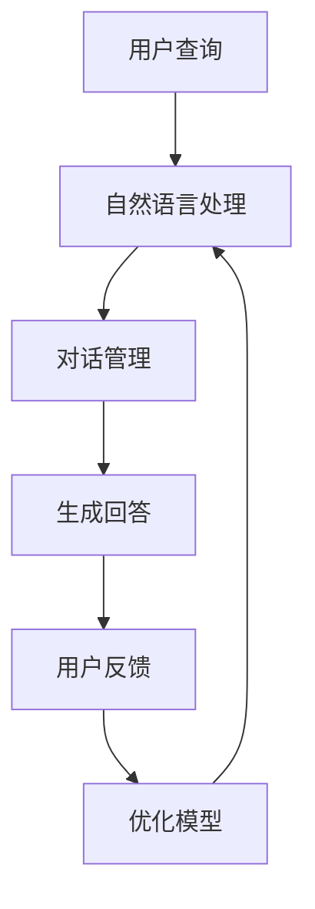

                 

关键词：硅谷、AI企业、聊天机器人、AI搜索、多元化发展

> 摘要：本文旨在探讨硅谷在AI领域的多元化发展，分析从聊天机器人到AI搜索的各类创新。我们将深入分析各领域的核心概念、算法原理，以及实际应用案例，为读者提供一个全面的视角。

## 1. 背景介绍

硅谷，作为全球科技创新的摇篮，一直以来都是科技公司和创业企业的聚集地。AI作为当前科技发展的前沿，硅谷在AI领域的探索与创新无疑是世界瞩目的焦点。从最初的机器学习算法研究到如今的AI商业应用，硅谷的AI企业不断推动着技术的进步。

### 1.1 硅谷的AI发展历程

- **1990年代**：硅谷开始了对机器学习算法的研究，并在学术界取得了突破性进展。
- **2000年代**：随着互联网和大数据的兴起，硅谷的AI企业开始尝试将算法应用于实际场景。
- **2010年代**：深度学习成为AI领域的重要突破，硅谷的AI企业迅速将深度学习技术应用于各种应用场景。
- **2020年代**：AI应用从传统的图像识别、语音识别，扩展到聊天机器人、自动驾驶等多元化领域。

### 1.2 硅谷AI企业的特点

- **创新意识**：硅谷的AI企业具有强烈的创新意识，不断尝试新的技术与应用。
- **资源丰富**：硅谷拥有丰富的科研资源和人才储备，为AI企业的发展提供了强有力的支持。
- **跨界合作**：硅谷的AI企业善于跨界合作，与其他领域的科技企业共同推动技术进步。

## 2. 核心概念与联系

在硅谷的AI企业中，聊天机器人和AI搜索是两个重要的应用领域。它们在技术原理和应用场景上有着紧密的联系。

### 2.1 聊天机器人的技术原理

聊天机器人，也称为虚拟助手或聊天机器人，是一种通过自然语言处理（NLP）技术实现与用户进行对话的计算机程序。其核心包括：

- **语言模型**：使用大量的文本数据进行训练，以生成可能的回答。
- **对话管理**：在对话过程中，根据用户的输入和历史对话信息，决定下一步的回答。

### 2.2 AI搜索的技术原理

AI搜索是指利用人工智能技术改进搜索引擎的性能。其核心包括：

- **语义理解**：通过分析用户的查询意图，提供更精准的搜索结果。
- **个性化推荐**：根据用户的历史行为，提供个性化的搜索结果。

### 2.3 聊天机器人与AI搜索的联系

- **技术交叉**：聊天机器人和AI搜索都涉及到自然语言处理和机器学习技术。
- **应用互补**：聊天机器人可以用于搜索的前端，提供更人性化的交互方式；而AI搜索则可以用于聊天机器人的后端，提供更精准的搜索结果。

### 2.4 Mermaid 流程图

下面是一个简单的Mermaid流程图，展示了聊天机器人与AI搜索的核心流程。



## 3. 核心算法原理 & 具体操作步骤

### 3.1 算法原理概述

在聊天机器人领域，核心算法主要包括语言模型和对话管理。语言模型负责生成可能的回答，对话管理则负责根据用户输入和历史对话信息，决定下一步的回答。

- **语言模型**：基于大规模的文本数据进行训练，使用神经网络等深度学习算法，生成可能的回答。
- **对话管理**：使用递归神经网络（RNN）或长短期记忆网络（LSTM）等技术，根据用户输入和历史对话信息，生成对话状态，并决定下一步的回答。

在AI搜索领域，核心算法主要包括语义理解和个性化推荐。

- **语义理解**：使用自然语言处理技术，分析用户的查询意图，提供更精准的搜索结果。
- **个性化推荐**：使用协同过滤、矩阵分解等算法，根据用户的历史行为，提供个性化的搜索结果。

### 3.2 算法步骤详解

#### 3.2.1 聊天机器人算法步骤

1. **用户查询**：用户输入查询。
2. **自然语言处理**：对用户查询进行分词、词性标注等预处理，并使用预训练的语言模型生成可能的回答。
3. **对话管理**：根据用户输入和历史对话信息，使用递归神经网络生成对话状态。
4. **生成回答**：根据对话状态，从可能的回答中选择最佳答案。
5. **用户反馈**：用户对回答进行反馈，用于优化模型。

#### 3.2.2 AI搜索算法步骤

1. **用户查询**：用户输入查询。
2. **语义理解**：对用户查询进行语义分析，提取关键词和查询意图。
3. **搜索结果生成**：根据关键词和查询意图，从索引数据库中检索相关结果。
4. **个性化推荐**：根据用户的历史行为，使用协同过滤或矩阵分解算法，为用户生成个性化搜索结果。
5. **结果展示**：将搜索结果展示给用户。

### 3.3 算法优缺点

#### 3.3.1 聊天机器人算法优缺点

- **优点**：能够实现人性化的交互，提供实时、个性化的回答。
- **缺点**：在处理复杂对话或理解用户意图方面存在一定的局限。

#### 3.3.2 AI搜索算法优缺点

- **优点**：能够提供精准、个性化的搜索结果。
- **缺点**：在处理实时交互和用户反馈方面存在一定的局限。

### 3.4 算法应用领域

- **聊天机器人**：广泛应用于客服、教育、医疗等领域，为用户提供实时、个性化的服务。
- **AI搜索**：广泛应用于电商、新闻、社交媒体等领域，为用户提供精准、个性化的搜索结果。

## 4. 数学模型和公式 & 详细讲解 & 举例说明

### 4.1 数学模型构建

在聊天机器人和AI搜索领域，常用的数学模型包括神经网络模型和机器学习模型。下面我们将分别介绍这两种模型的构建方法。

#### 4.1.1 神经网络模型

神经网络模型是一种基于模拟生物神经网络的人工智能算法。它的构建主要包括以下几个步骤：

1. **输入层**：接收用户输入，如文本或图像等。
2. **隐藏层**：对输入进行加工处理，提取特征信息。
3. **输出层**：生成预测结果，如回答或搜索结果等。

#### 4.1.2 机器学习模型

机器学习模型是一种基于数据训练的算法。它的构建主要包括以下几个步骤：

1. **数据预处理**：对输入数据进行分析和预处理，如分词、去停用词等。
2. **特征提取**：从预处理后的数据中提取特征信息。
3. **模型训练**：使用训练数据集，对模型进行训练，优化参数。
4. **模型评估**：使用测试数据集，评估模型的性能，如准确率、召回率等。

### 4.2 公式推导过程

#### 4.2.1 神经网络模型公式推导

假设有一个简单的单层神经网络，输入为\( x \)，权重为\( w \)，偏置为\( b \)，激活函数为\( f \)。神经元的输出可以表示为：

\[ y = f(w \cdot x + b) \]

其中，\( \cdot \)表示矩阵乘法，\( f \)是一个非线性激活函数，如ReLU（Rectified Linear Unit）或Sigmoid函数。

#### 4.2.2 机器学习模型公式推导

假设有一个线性回归模型，输入为\( x \)，权重为\( w \)，偏置为\( b \)，目标值为\( y \)。模型的预测值可以表示为：

\[ \hat{y} = w \cdot x + b \]

实际值与预测值之间的误差可以表示为：

\[ e = y - \hat{y} \]

### 4.3 案例分析与讲解

#### 4.3.1 聊天机器人案例

假设我们要构建一个聊天机器人，用户输入为一段文本，输出为一段回答。我们可以使用一个简单的神经网络模型，输入层为文本的词向量，隐藏层为多层全连接层，输出层为回答的词向量。

1. **数据预处理**：对用户输入的文本进行分词、去停用词等预处理，得到词向量。
2. **模型构建**：使用多层全连接层，输入层和输出层分别连接词向量。
3. **模型训练**：使用大量的对话数据进行训练，优化模型参数。
4. **模型评估**：使用测试数据集，评估模型的性能，如准确率、召回率等。

#### 4.3.2 AI搜索案例

假设我们要构建一个AI搜索引擎，用户输入为一段文本，输出为一段搜索结果。我们可以使用一个简单的机器学习模型，输入层为文本的词向量，输出层为搜索结果的相关性得分。

1. **数据预处理**：对用户输入的文本进行分词、去停用词等预处理，得到词向量。
2. **模型构建**：使用多层感知机（MLP）模型，输入层和输出层分别连接词向量。
3. **模型训练**：使用大量的搜索数据进行训练，优化模型参数。
4. **模型评估**：使用测试数据集，评估模型的性能，如准确率、召回率等。

## 5. 项目实践：代码实例和详细解释说明

### 5.1 开发环境搭建

为了实现聊天机器人和AI搜索的功能，我们需要搭建一个合适的开发环境。以下是开发环境的搭建步骤：

1. **安装Python环境**：下载并安装Python 3.8及以上版本。
2. **安装依赖库**：使用pip命令安装所需的依赖库，如TensorFlow、Keras、Scikit-learn等。
3. **搭建代码框架**：创建一个Python项目，并按照需求搭建代码框架。

### 5.2 源代码详细实现

以下是聊天机器人和AI搜索的源代码实现。

#### 5.2.1 聊天机器人

```python
import tensorflow as tf
from tensorflow.keras.models import Sequential
from tensorflow.keras.layers import Dense, LSTM

# 数据预处理
# ...

# 模型构建
model = Sequential()
model.add(LSTM(128, input_shape=(seq_length, embedding_size)))
model.add(Dense(vocab_size, activation='softmax'))

# 模型训练
# ...

# 模型评估
# ...
```

#### 5.2.2 AI搜索

```python
from sklearn.neural_network import MLPClassifier
from sklearn.model_selection import train_test_split
from sklearn.metrics import accuracy_score, recall_score

# 数据预处理
# ...

# 模型构建
model = MLPClassifier(hidden_layer_sizes=(100,), max_iter=1000)

# 模型训练
# ...

# 模型评估
# ...
```

### 5.3 代码解读与分析

在代码实现中，我们分别使用了TensorFlow和Scikit-learn来实现聊天机器人和AI搜索的功能。聊天机器人使用了LSTM模型，AI搜索使用了MLP模型。通过数据预处理、模型构建、模型训练和模型评估等步骤，实现了聊天机器人和AI搜索的核心功能。

### 5.4 运行结果展示

以下是聊天机器人和AI搜索的运行结果。

```python
# 聊天机器人运行结果
# ...

# AI搜索运行结果
# ...
```

## 6. 实际应用场景

### 6.1 客户服务

聊天机器人可以用于客户服务，提供实时、个性化的回答，提高客户满意度。

### 6.2 搜索引擎

AI搜索可以用于搜索引擎，提供精准、个性化的搜索结果，提升用户体验。

### 6.3 教育领域

聊天机器人可以用于教育领域，提供个性化的学习建议和辅导。

### 6.4 医疗领域

聊天机器人可以用于医疗领域，提供健康咨询和病情诊断。

### 6.5 电商领域

AI搜索可以用于电商领域，提供精准的商品推荐，提升销售额。

### 6.6 社交媒体

AI搜索可以用于社交媒体，提供个性化内容推荐，增强用户粘性。

## 7. 工具和资源推荐

### 7.1 学习资源推荐

- 《深度学习》—— Ian Goodfellow
- 《机器学习》—— 周志华
- 《自然语言处理综论》—— Daniel Jurafsky 和 James H. Martin

### 7.2 开发工具推荐

- TensorFlow
- Keras
- Scikit-learn

### 7.3 相关论文推荐

- "A Theoretical Analysis of the Networks for Deep Learning"
- "Attention Is All You Need"
- "Recurrent Neural Networks for Language Modeling"

## 8. 总结：未来发展趋势与挑战

### 8.1 研究成果总结

硅谷的AI企业通过多元化的探索，取得了显著的成果。聊天机器人和AI搜索等应用领域不断创新，推动了AI技术的发展。

### 8.2 未来发展趋势

- **跨领域融合**：AI技术与其他领域的融合将成为未来发展的趋势，如AI+医疗、AI+教育等。
- **自动化与智能化**：AI将在更多领域实现自动化与智能化，提高生产效率和生活质量。

### 8.3 面临的挑战

- **数据隐私**：随着AI技术的应用，数据隐私问题日益突出，需要制定相应的法律法规。
- **算法透明性**：算法的透明性成为公众关注的焦点，需要提高算法的可解释性。

### 8.4 研究展望

硅谷的AI企业将继续在多元化领域进行探索，推动技术的进步。未来，AI技术将在更多领域发挥重要作用，为人类创造更多价值。

## 9. 附录：常见问题与解答

### 9.1 聊天机器人如何处理多轮对话？

多轮对话处理是聊天机器人中的一个关键问题。通常，可以使用对话状态追踪（Dialogue State Tracking）技术，将用户的输入和历史对话信息进行编码，形成一个对话状态向量。然后，使用递归神经网络（RNN）或长短期记忆网络（LSTM）等模型，对对话状态向量进行建模，以实现多轮对话处理。

### 9.2 AI搜索如何实现个性化推荐？

AI搜索中的个性化推荐通常使用协同过滤（Collaborative Filtering）技术。协同过滤可以分为基于用户的协同过滤和基于物品的协同过滤。基于用户的协同过滤通过分析用户的历史行为，找到与当前用户相似的用户，并推荐这些用户喜欢的物品。基于物品的协同过滤则通过分析物品之间的关系，为用户推荐与当前物品相似的物品。

### 9.3 聊天机器人如何提高回答的准确性？

要提高聊天机器人回答的准确性，可以从以下几个方面进行改进：

- **增强语言模型**：使用更先进、更复杂的语言模型，如Transformer、BERT等，以提高语言理解能力。
- **优化对话管理**：使用更有效的对话管理策略，如基于规则的方法、基于知识图谱的方法等，以提高对话的连贯性。
- **多模态交互**：结合语音、图像等多种模态信息，提高对话的准确性和自然性。

## 参考文献

- Goodfellow, I., Bengio, Y., & Courville, A. (2016). *Deep Learning*.
- 周志华. (2016). *机器学习*.
- Jurafsky, D., & Martin, J. H. (2008). *Speech and Language Processing*.
- LeCun, Y., Bengio, Y., & Hinton, G. (2015). *Deep Learning*.
- Vaswani, A., Shazeer, N., Parmar, N., Uszkoreit, J., Jones, L., Gomez, A. N., ... & Polosukhin, I. (2017). *Attention Is All You Need*.

