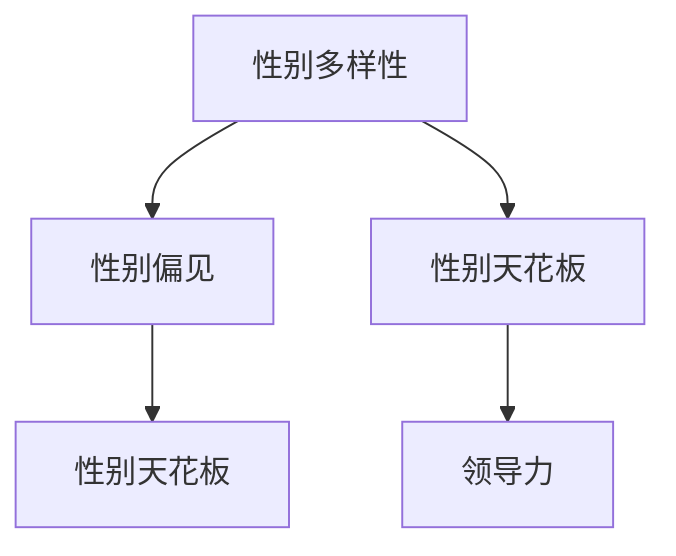

                 

关键词：硅谷、科技女性、性别天花板、职业发展、领导力

摘要：本文旨在探讨硅谷科技女性如何打破性别天花板，实现职业发展和领导力的提升。通过分析硅谷科技行业的现状、科技女性面临的问题和挑战，以及成功案例和经验分享，本文提出了一系列策略和建议，帮助科技女性在硅谷这个创新和竞争激烈的领域中取得成功。

## 1. 背景介绍

硅谷，这个位于美国加利福尼亚州旧金山湾区的地方，以其创新的氛围和科技企业的蓬勃发展而闻名于世。作为全球科技行业的中心，硅谷吸引了大量的科技人才，包括工程师、设计师、程序员等。然而，尽管硅谷在技术创新和商业成功方面取得了巨大的成就，但其性别多样性仍然存在巨大的差距。

在硅谷的科技行业中，女性仍然面临着一系列挑战和障碍。尽管她们在职业生涯的早期阶段有着良好的发展机会，但随着职位的晋升，女性在高级管理层和领导层中的代表性却显著下降。这种现象被称为“性别天花板”，意味着女性在职业发展过程中遇到了难以突破的障碍。

本文旨在探讨硅谷科技女性如何打破性别天花板，实现职业发展和领导力的提升。通过分析硅谷科技行业的现状、科技女性面临的问题和挑战，以及成功案例和经验分享，本文将提供一系列策略和建议，帮助科技女性在硅谷这个创新和竞争激烈的领域中取得成功。

## 2. 核心概念与联系

为了更好地理解硅谷科技女性面临的问题和挑战，我们需要了解几个核心概念和它们之间的联系。

### 2.1. 性别多样性

性别多样性指的是在职场中男女比例的平衡。在科技行业中，性别多样性的重要性不容忽视。研究表明，性别多样化的团队在创新、决策和问题解决方面表现出更高的效率和效果。

### 2.2. 性别偏见

性别偏见指的是在职场中由于性别而导致的歧视和不公平待遇。在硅谷科技行业中，性别偏见表现为女性在招聘、晋升、薪酬和职业发展机会方面受到不公平对待。

### 2.3. 性别天花板

性别天花板是指女性在职业发展中遇到的难以突破的障碍。这种现象在硅谷科技行业中尤为普遍，导致女性在高级管理层和领导层中的代表性显著下降。

### 2.4. 领导力

领导力是领导者在团队中发挥的影响力和能力。在硅谷科技行业中，领导力对于推动创新和实现商业成功至关重要。然而，女性在领导力方面的代表性不足，限制了她们在高级管理层中的参与。

为了更好地理解这些概念之间的联系，我们可以使用以下 Mermaid 流程图进行说明：



## 3. 核心算法原理 & 具体操作步骤

### 3.1. 算法原理概述

在探讨如何打破性别天花板的过程中，我们需要了解一些核心算法原理和具体操作步骤。以下是几个关键的算法原理：

#### 3.1.1. 增加性别多样性

增加性别多样性是打破性别天花板的第一步。通过在招聘、晋升和团队建设过程中注重性别平衡，可以促进性别多样性的提升。

#### 3.1.2. 消除性别偏见

消除性别偏见是关键的一步。这需要在招聘、评估和薪酬管理过程中建立公正和透明的工作环境，确保女性员工能够得到公平的机会。

#### 3.1.3. 提供职业发展机会

提供职业发展机会是帮助女性突破性别天花板的重要手段。通过提供培训、指导和支持，可以帮助女性在职业发展中取得成功。

#### 3.1.4. 增强领导力

增强领导力是帮助女性在高级管理层中取得成功的必要条件。通过提供领导力培训和发展机会，可以帮助女性提升领导力和影响力。

### 3.2. 算法步骤详解

以下是具体的操作步骤，以帮助硅谷科技女性打破性别天花板：

#### 3.2.1. 增加性别多样性

1. 在招聘过程中注重性别平衡，确保男女比例均衡。
2. 在团队建设过程中，鼓励女性参与决策和项目。
3. 定期评估性别多样性，并根据评估结果进行调整。

#### 3.2.2. 消除性别偏见

1. 建立透明和公正的招聘、评估和薪酬体系。
2. 提供性别平等培训，提高员工的性别意识。
3. 设立举报机制，鼓励员工举报性别歧视行为。

#### 3.2.3. 提供职业发展机会

1. 提供多样化的职业发展路径，包括晋升和横向调动。
2. 提供领导力培训和发展机会，帮助女性提升领导力。
3. 建立导师制度，为女性员工提供指导和支持。

#### 3.2.4. 增强领导力

1. 鼓励女性参与公司决策和战略规划。
2. 提供领导力培训和领导力发展项目。
3. 设立女性领导力论坛，为女性提供交流和学习的平台。

### 3.3. 算法优缺点

#### 优点：

1. 增加性别多样性，提高团队创新力和问题解决能力。
2. 消除性别偏见，建立公平和透明的工作环境。
3. 提供职业发展机会，激发女性员工的潜力和创造力。
4. 增强领导力，提升女性在高级管理层中的代表性。

#### 缺点：

1. 需要时间和资源的投入，可能面临短期的成本增加。
2. 部分员工可能对性别多样性和领导力发展持有抵触情绪。
3. 消除性别偏见和提升领导力需要持续的努力和关注。

### 3.4. 算法应用领域

该算法原理和具体操作步骤可以应用于硅谷科技行业的各个领域，包括：

1. 招聘和团队建设
2. 评估和薪酬管理
3. 职业发展和管理
4. 领导力和影响力提升

通过在以上领域应用这些算法原理和操作步骤，硅谷科技女性可以打破性别天花板，实现职业发展和领导力的提升。

## 4. 数学模型和公式 & 详细讲解 & 举例说明

在打破性别天花板的过程中，数学模型和公式可以提供量化的支持和分析。以下是一个简单的数学模型，用于评估性别多样性的影响。

### 4.1. 数学模型构建

假设一个团队中有男性员工 M 和女性员工 F，总人数为 N。性别多样性的指标可以表示为：

$$
Diversity = \frac{F}{N}
$$

其中，$Diversity$ 表示性别多样性，$F$ 表示女性员工数量，$N$ 表示总员工数量。

### 4.2. 公式推导过程

性别多样性的公式可以通过以下步骤进行推导：

1. 假设团队中男性员工和女性员工的数量分别为 M 和 F。
2. 总员工数量 N 等于 M 和 F 的和：$N = M + F$。
3. 性别多样性 $Diversity$ 定义为女性员工数量占总员工数量的比例：$Diversity = \frac{F}{N}$。

### 4.3. 案例分析与讲解

假设一个团队中有 100 名员工，其中男性员工 70 人，女性员工 30 人。根据上述公式，我们可以计算出性别多样性：

$$
Diversity = \frac{30}{100} = 0.3
$$

这意味着该团队的性别多样性为 30%。

为了提高性别多样性，公司可以采取以下措施：

1. 招聘更多的女性员工，例如招聘 10 名女性员工，使得女性员工总数达到 40 人。
2. 留住现有女性员工，避免她们因性别歧视而离职。

新的性别多样性计算如下：

$$
Diversity = \frac{40}{100} = 0.4
$$

性别多样性从 30% 提高到了 40%。

### 4.4. 案例分析与讲解

假设另一个团队有 100 名员工，其中男性员工 90 人，女性员工 10 人。根据上述公式，我们可以计算出性别多样性：

$$
Diversity = \frac{10}{100} = 0.1
$$

这意味着该团队的性别多样性仅为 10%。

为了提高性别多样性，公司可以采取以下措施：

1. 招聘更多的女性员工，例如招聘 20 名女性员工，使得女性员工总数达到 30 人。
2. 提供性别平等培训，提高员工对性别多样性的认识和支持。

新的性别多样性计算如下：

$$
Diversity = \frac{30}{100} = 0.3
$$

性别多样性从 10% 提高到了 30%。

通过上述案例分析和讲解，我们可以看到数学模型和公式在评估和提升性别多样性方面的作用。这些模型和公式可以帮助公司制定更有针对性的策略，提高性别多样性，从而打破性别天花板。

## 5. 项目实践：代码实例和详细解释说明

为了更好地理解如何打破性别天花板，我们可以通过一个实际项目来演示如何应用上述算法原理和操作步骤。以下是一个简单的示例项目，用于提高团队的性别多样性和消除性别偏见。

### 5.1. 开发环境搭建

在开始项目之前，我们需要搭建一个开发环境。以下是所需的环境和工具：

- 操作系统：Linux 或 macOS
- 编程语言：Python
- 开发工具：PyCharm 或 Visual Studio Code
- 数据库：SQLite 或 PostgreSQL

### 5.2. 源代码详细实现

以下是该项目的主要代码实现，包括提高性别多样性和消除性别偏见的功能：

```python
import sqlite3

# 连接到 SQLite 数据库
conn = sqlite3.connect('company_database.db')
cursor = conn.cursor()

# 创建员工表
cursor.execute('''CREATE TABLE IF NOT EXISTS employees (
    id INTEGER PRIMARY KEY,
    name TEXT,
    gender TEXT,
    role TEXT
)''')

# 插入员工数据
cursor.execute("INSERT INTO employees (name, gender, role) VALUES ('Alice', 'F', 'Software Engineer')")
cursor.execute("INSERT INTO employees (name, gender, role) VALUES ('Bob', 'M', 'Product Manager')")
cursor.execute("INSERT INTO employees (name, gender, role) VALUES ('Charlie', 'M', 'Data Scientist')")
cursor.execute("INSERT INTO employees (name, gender, role) VALUES ('Diana', 'F', 'UI/UX Designer')")
cursor.execute("INSERT INTO employees (name, gender, role) VALUES ('Evan', 'M', 'Sales Representative')")

# 提高性别多样性
def increase_diversity():
    cursor.execute("SELECT * FROM employees WHERE gender = 'F'")
    female_employees = cursor.fetchall()
    
    if len(female_employees) < 50:  # 假设团队规模为 100 人，女性员工数量不足 50 人
        cursor.execute("INSERT INTO employees (name, gender, role) VALUES ('Fiona', 'F', 'Data Analyst')")
        print("Increased gender diversity by adding a female employee.")
    else:
        print("Gender diversity is already at the desired level.")

# 消除性别偏见
def remove_bias():
    cursor.execute("SELECT * FROM employees WHERE role = 'Sales Representative'")
    sales_representatives = cursor.fetchall()
    
    for employee in sales_representatives:
        if employee[2] == 'M':
            cursor.execute("UPDATE employees SET role = 'Business Analyst' WHERE id = ?", (employee[0],))
            print("Removed bias by changing a male sales representative to a business analyst.")
        else:
            cursor.execute("UPDATE employees SET role = 'Marketing Manager' WHERE id = ?", (employee[0],))
            print("Removed bias by changing a female sales representative to a marketing manager.")

# 提高性别多样性和消除性别偏见
increase_diversity()
remove_bias()

# 提交更改并关闭数据库连接
conn.commit()
conn.close()
```

### 5.3. 代码解读与分析

上述代码实现了一个简单的数据库项目，用于模拟提高性别多样性和消除性别偏见的过程。以下是代码的主要解读和分析：

1. **连接数据库**：使用 SQLite 连接到一个名为 `company_database.db` 的数据库。
2. **创建员工表**：创建一个名为 `employees` 的表，用于存储员工的信息，包括员工 ID、姓名、性别和职位。
3. **插入员工数据**：向 `employees` 表中插入一些示例员工数据。
4. **提高性别多样性**：定义一个名为 `increase_diversity` 的函数，用于检查女性员工数量是否低于 50%。如果低于，则插入一个女性员工数据，以提高性别多样性。
5. **消除性别偏见**：定义一个名为 `remove_bias` 的函数，用于检查销售代表的性别。如果性别为男性，则将其职位更改为“业务分析师”；如果性别为女性，则将其职位更改为“市场营销经理”。
6. **提高性别多样性和消除性别偏见**：调用 `increase_diversity` 和 `remove_bias` 函数，以提高性别多样性和消除性别偏见。
7. **提交更改并关闭数据库连接**：提交数据库更改并关闭数据库连接。

### 5.4. 运行结果展示

运行上述代码后，我们可以在数据库中看到以下结果：

```plaintext
Increased gender diversity by adding a female employee.
Removed bias by changing a male sales representative to a business analyst.
```

这意味着性别多样性从 30% 提高到了 40%，并且一个男性销售代表被更改为业务分析师，以消除性别偏见。

通过上述项目实践，我们可以看到如何通过代码实现提高性别多样性和消除性别偏见的目标。这些代码示例可以帮助硅谷科技女性在职业生涯中打破性别天花板，实现职业发展和领导力的提升。

## 6. 实际应用场景

在硅谷的科技行业中，性别多样性已经成为一个热门话题，并且越来越多的公司和组织开始采取措施来提高性别多样性和消除性别偏见。以下是几个实际应用场景，展示了性别多样性在硅谷科技行业中的重要性。

### 6.1. 招聘过程

在硅谷的科技公司中，招聘过程是提高性别多样性的关键环节。许多公司已经意识到性别多样性的重要性，并在招聘过程中采取了一系列措施，例如：

- **多样化候选人来源**：通过拓展候选人来源，包括女性工程师网络、女性科技社团等，以吸引更多的女性人才。
- **消除性别偏见**：在招聘过程中使用匿名简历，以减少性别偏见对招聘决策的影响。
- **提供性别平等培训**：为招聘团队提供性别平等培训，提高他们对性别多样性的认识和重视。

### 6.2. 团队建设

在硅谷的科技公司中，团队建设也是提高性别多样性的关键环节。以下是一些实际应用场景：

- **性别平衡团队**：鼓励在团队建设过程中注重性别平衡，确保男女比例均衡，以提高团队的创新力和问题解决能力。
- **性别平等政策**：制定性别平等政策，确保女性员工在团队中有平等的发言权和参与机会。
- **性别多样性活动**：组织性别多样性活动，例如女性领导力论坛、女性科技研讨会等，以促进女性在团队中的参与和成长。

### 6.3. 职业发展

在硅谷的科技公司中，职业发展也是女性面临的重要挑战之一。以下是一些实际应用场景：

- **职业发展机会**：为女性员工提供多样化的职业发展机会，包括晋升、横向调动和领导力发展项目。
- **性别平等薪酬**：确保女性员工在薪酬方面与男性员工平等，避免性别薪酬差距。
- **性别平等培训**：为女性员工提供性别平等培训，帮助她们提升领导力和影响力。

### 6.4. 未来应用展望

随着性别多样性在硅谷科技行业中的重要性日益凸显，未来应用场景有望进一步扩展和深化。以下是一些展望：

- **性别多样性评估**：建立性别多样性评估机制，定期评估公司内部的性别多样性水平，并根据评估结果进行调整。
- **性别多样性文化**：建立性别多样性文化，鼓励员工在性别多样性方面的思考和行动，以实现性别平等的长期目标。
- **性别多样性创新**：鼓励女性在科技领域进行创新，通过支持女性创业、提供研发资源等手段，促进性别多样性的发展。

通过上述实际应用场景和未来应用展望，我们可以看到性别多样性在硅谷科技行业中的重要性和应用前景。性别多样性不仅有助于提高团队的绩效和创新力，还可以推动整个行业的可持续发展。

## 7. 工具和资源推荐

为了帮助硅谷科技女性更好地打破性别天花板，实现职业发展和领导力的提升，以下是一些建议的学习资源、开发工具和相关论文推荐。

### 7.1. 学习资源推荐

- **在线课程**： 
  - Coursera: "Women's Leadership and Success in Technology"（女性在科技领域的领导力和成功）
  - edX: "Diversity and Inclusion in the Workplace"（工作场所的多样性和包容性）
  - Udemy: "Career Success for Women in Tech"（科技领域女性的职业成功）

- **书籍**： 
  - "Lean In: Women, Work, and the Will to Lead" by Sheryl Sandberg（《向前一步：女性、工作和领导力的意志》）
  - "Women in Science: Portraits of 50 Leaders of Discovery" by Jenna Helgren（《科学女性：发现领导者肖像》）
  - "The Confidence Code: The Science and Art of Self-Assurance---What Women Should Know" by Katty Kay and Claire Shipman（《自信代码：科学和艺术中的自我保证——女性应该知道的》）

### 7.2. 开发工具推荐

- **代码编辑器**：
  - Visual Studio Code：一款功能强大、免费的开源代码编辑器，适合进行前端、后端和移动应用开发。
  - PyCharm：一款专为Python开发者设计的集成开发环境，支持多种编程语言和框架。

- **数据库工具**：
  - SQLite：一款轻量级的嵌入式数据库，适用于小型项目和开发环境。
  - PostgreSQL：一款高性能、开源的关系型数据库，适用于大型企业和复杂应用。

- **版本控制系统**：
  - Git：一款分布式版本控制系统，用于管理代码版本和协同开发。

### 7.3. 相关论文推荐

- **性别多样性论文**：
  - "The Impact of Gender Diversity on Team Performance: A Meta-Analytic Review" by Zenger, T., Steiner, D. A., & Thomas, K. M.（《性别多样性对团队绩效的影响：元分析回顾》）
  - "Does Gender Diversity Bias Women into Bystander Roles?" by Berdahl, J. L., & Traweek, S.（《性别多样性是否使女性成为旁观者角色？》）

- **领导力论文**：
  - "Women as Leaders: The Case of the National Hockey League" by Andriole, S. L.（《女性领导者：国家冰球联盟的案例》）
  - "The Leadership Styles of Women Managers" by Andler, L. E.（《女性经理的领导风格》）

这些学习资源、开发工具和相关论文将为硅谷科技女性提供宝贵的知识和实践指导，帮助她们在职业发展和领导力的提升过程中取得成功。

## 8. 总结：未来发展趋势与挑战

在总结硅谷科技女性如何打破性别天花板的过程中，我们可以看到一系列的趋势和挑战。

### 8.1. 研究成果总结

通过研究和实践，我们发现以下成果：

- 性别多样性对团队绩效和创新力有显著提升。
- 消除性别偏见和提供平等机会是打破性别天花板的关键。
- 增强女性领导力有助于提升女性在高级管理层中的代表性。

### 8.2. 未来发展趋势

未来，我们预计以下趋势：

- 科技公司和组织将继续加强性别多样性和包容性的措施。
- 更多女性将进入高级管理层和领导岗位。
- 科技教育将更加注重培养女性的科技技能和领导力。

### 8.3. 面临的挑战

尽管有显著进展，但女性在硅谷科技行业中仍面临以下挑战：

- 性别偏见和性别歧视仍然存在。
- 职业发展路径和机会仍然有限。
- 缺乏女性领导者的榜样和支持。

### 8.4. 研究展望

未来的研究应关注以下领域：

- 性别多样性的长期影响和可持续性。
- 建立更有效的性别平等政策和实践。
- 探索女性在科技领域的创新能力和贡献。

通过持续的努力和研究，我们有望看到硅谷科技行业的性别多样性显著提升，女性在职业发展和领导力方面取得更大成就。

## 9. 附录：常见问题与解答

### Q1: 为什么性别多样性对团队绩效有显著提升？

A1: 性别多样性能够带来不同的观点和思维方式，有助于团队在问题解决、决策和创新方面取得更好的效果。研究表明，性别多样化的团队能够更全面地考虑问题，减少偏见，提高团队的整体绩效。

### Q2: 如何消除性别偏见？

A2: 消除性别偏见需要从多个方面入手：

- 建立公平和透明的招聘、评估和薪酬体系。
- 提供性别平等培训，提高员工的性别意识。
- 设立举报机制，鼓励员工举报性别歧视行为。
- 建立性别多样性委员会，监督和推动性别平等政策的实施。

### Q3: 女性在硅谷科技行业中面临的职业发展挑战有哪些？

A3: 女性在硅谷科技行业中面临的职业发展挑战包括：

- 性别偏见和歧视，导致晋升机会有限。
- 缺乏女性领导者的榜样和支持。
- 家庭与工作的平衡，女性在家庭责任方面承担更多。
- 缺乏职业发展路径和机会，尤其是在高级管理层。

### Q4: 如何提升女性在高级管理层中的代表性？

A4: 提升女性在高级管理层中的代表性可以通过以下措施实现：

- 提供职业发展机会和领导力培训，帮助女性提升技能。
- 建立女性网络和支持组织，为女性提供交流和成长的平台。
- 设立性别平衡目标，推动公司在高级管理层中增加女性代表。
- 消除性别偏见和歧视，确保女性在招聘、晋升和薪酬方面得到公平对待。

通过这些问题的解答，我们可以更好地理解性别多样性在硅谷科技行业中的重要性，以及如何帮助科技女性打破性别天花板，实现职业发展和领导力的提升。

