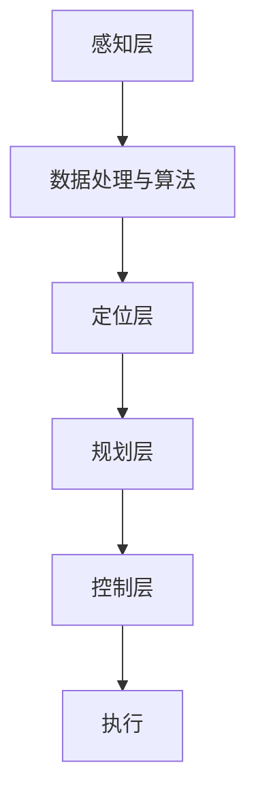

                 

### 1. 背景介绍

自动驾驶汽车，作为一种前沿科技，近年来在全球范围内迅速发展。硅谷作为全球科技创新的中心，自然在这一领域扮演了重要角色。从特斯拉到谷歌，再到许多初创公司，众多企业投入了大量的资源和精力，以期在自动驾驶技术的研发和商业化应用上取得突破。

自动驾驶汽车的基本概念并不复杂：它们利用传感器、人工智能和先进的控制算法，实现车辆的自动行驶。然而，这一技术的潜在影响却是深远的，不仅会改变我们的出行方式，还可能对整个社会产生广泛而深刻的影响。

本文将探讨硅谷自动驾驶汽车在以下几个方面可能带来的社会影响：

- **经济效益**：自动驾驶汽车如何影响交通运输业的结构和效率？
- **交通安全**：自动驾驶汽车能否降低交通事故的发生率？
- **城市规划**：自动驾驶汽车对城市规划产生哪些新的挑战和机遇？
- **法律和伦理**：自动驾驶汽车引发的法律和伦理问题有哪些？
- **社会平等**：自动驾驶汽车是否会让社会更加平等？
- **未来展望**：自动驾驶汽车技术在未来几年内可能达到哪些里程碑？

<|assistant|>### 2. 核心概念与联系

在探讨自动驾驶汽车的社会影响之前，有必要先了解其核心概念和技术架构。

#### 自动驾驶汽车的核心概念

自动驾驶汽车的核心技术包括：

- **传感器**：用于感知周围环境，如雷达、激光雷达（LiDAR）、摄像头和超声波传感器。
- **数据处理与算法**：对传感器收集的数据进行处理和分析，以生成车辆的状态估计和决策。
- **控制系统**：根据处理结果控制车辆的加速、转向和制动。

#### 自动驾驶汽车的技术架构

自动驾驶汽车的技术架构通常包括以下层次：

1. **感知层**：通过传感器收集数据。
2. **定位层**：利用地图数据和环境感知信息确定车辆的位置。
3. **规划层**：根据车辆的位置和目标路径，制定行车策略。
4. **控制层**：执行行车策略，控制车辆的运动。

#### Mermaid 流程图

以下是自动驾驶汽车技术架构的 Mermaid 流程图：



<|assistant|>### 3. 核心算法原理 & 具体操作步骤

#### 3.1 算法原理概述

自动驾驶汽车的核心算法主要包括感知、定位、规划和控制四个方面。

1. **感知算法**：利用传感器收集到的数据，通过图像处理、目标检测和跟踪等技术，识别周围环境中的障碍物、道路标志和其他车辆。
2. **定位算法**：通过融合GPS、IMU（惯性测量单元）和地图数据，确定车辆在环境中的准确位置。
3. **规划算法**：根据车辆的当前位置、目标位置和周围环境，规划行驶路径和行车策略。
4. **控制算法**：根据规划结果，控制车辆的速度、转向和制动，实现安全、平稳的行驶。

#### 3.2 算法步骤详解

1. **感知阶段**：
    - 传感器数据预处理：对收集到的图像、雷达和激光雷达数据进行去噪、校正等预处理。
    - 目标检测与跟踪：利用卷积神经网络（CNN）等深度学习算法，识别并跟踪道路上的车辆、行人、交通标志等目标。

2. **定位阶段**：
    - 地图匹配：将传感器数据与高精度地图进行匹配，确定车辆在环境中的大致位置。
    - 车辆状态估计：利用卡尔曼滤波等算法，对车辆的速度、加速度和位置进行实时估计。

3. **规划阶段**：
    - 路径规划：根据目标位置和周围环境，生成一条最优行驶路径。
    - 行车策略：根据道路条件、交通流量等因素，制定车辆在不同情况下的行车策略。

4. **控制阶段**：
    - 加速度控制：根据规划结果，控制车辆的加速度，实现平稳加速。
    - 转向控制：根据道路和交通情况，控制车辆的转向。
    - 制动控制：根据车辆状态和周围环境，及时进行制动，确保安全行驶。

#### 3.3 算法优缺点

**优点**：

- **提高交通效率**：自动驾驶汽车能够实现更高效的路线规划和交通流管理，减少交通拥堵。
- **提升交通安全**：通过先进的感知和控制技术，降低人为驾驶错误导致的交通事故。
- **减少能源消耗**：自动驾驶汽车能够优化行驶路径，减少不必要的加速和制动，提高燃油效率。

**缺点**：

- **技术成熟度**：目前自动驾驶技术尚未完全成熟，尤其在复杂环境和极端天气条件下，仍存在很多挑战。
- **安全性和隐私问题**：自动驾驶汽车依赖大量的传感器和数据处理，可能引发安全漏洞和隐私问题。
- **法律法规**：自动驾驶汽车的普及需要相应的法律法规支持，目前这方面的制度尚不完善。

#### 3.4 算法应用领域

自动驾驶汽车技术目前主要应用于以下几个方面：

- **商用物流**：自动驾驶卡车和配送车辆在物流运输中的应用，提高运输效率和降低成本。
- **公共交通**：自动驾驶巴士和出租车，提供更加便捷和高效的公共交通服务。
- **个人出行**：自动驾驶私家车，为个人提供更舒适、更高效的出行体验。

<|assistant|>### 4. 数学模型和公式 & 详细讲解 & 举例说明

#### 4.1 数学模型构建

自动驾驶汽车的核心算法涉及多个数学模型，主要包括：

1. **卡尔曼滤波**：用于车辆状态估计。
2. **贝叶斯网络**：用于概率推理和决策。
3. **动态规划**：用于路径规划和行车策略。

以下是这些模型的简要说明：

**卡尔曼滤波**：

卡尔曼滤波是一种线性系统状态估计方法，它利用传感器数据和先验状态估计，通过递推关系不断更新状态估计。其核心公式如下：

$$
\hat{x}_{k|k} = F_k \hat{x}_{k-1|k-1} + K_k (z_k - H_k \hat{x}_{k-1|k-1})
$$

其中，$F_k$ 是状态转移矩阵，$K_k$ 是卡尔曼增益，$z_k$ 是观测值，$H_k$ 是观测矩阵。

**贝叶斯网络**：

贝叶斯网络是一种概率图模型，用于表示变量之间的依赖关系。其核心公式为条件概率分布：

$$
P(A|B) = \frac{P(B|A)P(A)}{P(B)}
$$

**动态规划**：

动态规划是一种优化方法，用于求解多阶段决策问题。其核心公式为递推关系：

$$
V_t(x_t) = \max_{a_t} \{R_t(x_t, a_t) + \gamma V_{t-1}(x_{t-1})\}
$$

其中，$V_t(x_t)$ 是状态 $x_t$ 在时间 $t$ 的价值函数，$R_t(x_t, a_t)$ 是状态 $x_t$ 在采取动作 $a_t$ 后的即时奖励，$\gamma$ 是折扣因子。

#### 4.2 公式推导过程

以下分别对卡尔曼滤波和动态规划的核心公式进行推导：

**卡尔曼滤波推导**：

1. **预测步骤**：

$$
\hat{x}_{k|k-1} = F_k \hat{x}_{k-1|k-1} + B_k u_k
$$

$$
P_{k|k-1} = F_k P_{k-1|k-1} F_k^T + Q_k
$$

其中，$u_k$ 是控制输入，$Q_k$ 是过程噪声矩阵。

2. **更新步骤**：

$$
K_k = P_{k|k-1} H_k^T (H_k P_{k|k-1} H_k^T + R_k)^{-1}
$$

$$
\hat{x}_{k|k} = \hat{x}_{k|k-1} + K_k (z_k - H_k \hat{x}_{k|k-1})
$$

$$
P_{k|k} = (I - K_k H_k) P_{k|k-1}
$$

**动态规划推导**：

1. **价值函数递推**：

$$
V_t(x_t) = R_t(x_t, a_t) + \gamma V_{t-1}(x_{t-1})
$$

2. **最优策略**：

$$
\pi_t(x_t) = \arg\max_{a_t} \{R_t(x_t, a_t) + \gamma V_{t-1}(x_{t-1})\}
$$

#### 4.3 案例分析与讲解

**案例1：自动驾驶车辆位置估计**

假设一辆自动驾驶车辆在二维空间中行驶，初始位置为 $(x_0, y_0)$，过程噪声为 $Q_k$，观测噪声为 $R_k$。使用卡尔曼滤波对其进行位置估计。

1. **初始状态**：

$$
\hat{x}_{0|0} = (x_0, y_0), \quad P_{0|0} = \sigma^2 I
$$

其中，$\sigma^2$ 是初始位置的不确定性。

2. **预测步骤**：

$$
\hat{x}_{k|k-1} = (x_{k-1}, y_{k-1}) + v_{k-1}
$$

$$
P_{k|k-1} = \sigma^2 Q_k
$$

3. **更新步骤**：

$$
K_k = P_{k|k-1} H_k^T (H_k P_{k|k-1} H_k^T + R_k)^{-1}
$$

$$
\hat{x}_{k|k} = \hat{x}_{k|k-1} + K_k (z_k - H_k \hat{x}_{k|k-1})
$$

$$
P_{k|k} = (I - K_k H_k) P_{k|k-1}
$$

其中，$H_k$ 为观测矩阵，$z_k$ 为观测值。

**案例2：自动驾驶车辆路径规划**

假设自动驾驶车辆需要从起点 $(x_s, y_s)$ 到达终点 $(x_g, y_g)$，道路网络由一系列节点和边组成。使用动态规划对其进行路径规划。

1. **状态定义**：车辆在时间 $t$ 的位置为状态 $x_t = (x_t, y_t)$。
2. **动作定义**：车辆在时间 $t$ 可以选择继续前进、转向或停车。
3. **价值函数**：状态 $x_t$ 在时间 $t$ 的价值函数为 $V_t(x_t) = R_t(x_t, a_t) + \gamma V_{t-1}(x_{t-1})$。

4. **最优策略**：

$$
\pi_t(x_t) = \arg\max_{a_t} \{R_t(x_t, a_t) + \gamma V_{t-1}(x_{t-1})\}
$$

通过递推计算，可以得到最优路径和行车策略。

<|assistant|>### 5. 项目实践：代码实例和详细解释说明

#### 5.1 开发环境搭建

在搭建开发环境之前，需要确保已经安装了以下软件和工具：

- Python 3.x
- Anaconda 或 Miniconda
- PyCharm 或其他 Python IDE
- TensorFlow 或 PyTorch 深度学习框架
- Keras 深度学习库
- Matplotlib 绘图库

具体步骤如下：

1. **安装 Python 和 IDE**：从 [Python 官网](https://www.python.org/) 下载并安装 Python 3.x 版本，并选择添加到系统路径。然后从 [PyCharm 官网](https://www.jetbrains.com/pycharm/) 下载并安装 PyCharm。

2. **安装 Anaconda**：从 [Anaconda 官网](https://www.anaconda.com/) 下载并安装 Anaconda，用于管理 Python 环境。

3. **创建虚拟环境**：在 PyCharm 中创建一个新的 Python 项目，并在项目中创建一个虚拟环境。

    ```bash
    conda create -n autodrive python=3.8
    conda activate autodrive
    ```

4. **安装依赖库**：

    ```bash
    conda install tensorflow
    conda install keras
    conda install matplotlib
    ```

5. **下载项目代码**：从 GitHub 等代码托管平台下载自动驾驶汽车项目代码，并将其克隆到本地。

    ```bash
    git clone https://github.com/yourusername/autonomous_vehicles.git
    cd autonomous_vehicles
    ```

#### 5.2 源代码详细实现

以下是自动驾驶汽车项目的源代码结构：

```plaintext
autonomous_vehicles/
|-- data/
|   |-- dataset/
|   |-- maps/
|-- models/
|   |-- model.py
|-- scripts/
|   |-- main.py
|-- utils/
    |-- dataset_loader.py
    |-- model_utils.py
```

**数据集准备**：

数据集是自动驾驶汽车项目的基础，它包括传感器数据、地图数据和标注数据。数据集的加载和处理在 `utils/dataset_loader.py` 文件中实现。

```python
import numpy as np
import pandas as pd
from sklearn.model_selection import train_test_split

def load_data(data_folder):
    # 加载传感器数据
    sensor_data = pd.read_csv(data_folder + 'sensor_data.csv')
    # 加载地图数据
    map_data = pd.read_csv(data_folder + 'map_data.csv')
    # 加载标注数据
    label_data = pd.read_csv(data_folder + 'label_data.csv')
    # 数据预处理
    # ...
    return sensor_data, map_data, label_data

def split_data(sensor_data, map_data, label_data, test_size=0.2):
    X_train, X_test, y_train, y_test = train_test_split(sensor_data, map_data, label_data, test_size=test_size, random_state=42)
    return X_train, X_test, y_train, y_test
```

**模型定义**：

在 `models/model.py` 文件中，定义了自动驾驶汽车的深度学习模型。以下是一个简单的卷积神经网络（CNN）模型示例：

```python
from tensorflow.keras.models import Model
from tensorflow.keras.layers import Input, Conv2D, MaxPooling2D, Flatten, Dense

def create_model(input_shape):
    inputs = Input(shape=input_shape)
    x = Conv2D(32, (3, 3), activation='relu')(inputs)
    x = MaxPooling2D((2, 2))(x)
    x = Flatten()(x)
    x = Dense(64, activation='relu')(x)
    outputs = Dense(1, activation='sigmoid')(x)
    model = Model(inputs=inputs, outputs=outputs)
    return model

model = create_model(input_shape=(28, 28, 1))
model.summary()
```

**模型训练**：

在 `scripts/main.py` 文件中，实现模型的训练过程。以下是一个简单的训练流程：

```python
import tensorflow as tf
from models.model import create_model
from utils.dataset_loader import load_data, split_data

# 加载数据集
sensor_data, map_data, label_data = load_data('data/dataset')
X_train, X_test, y_train, y_test = split_data(sensor_data, map_data, label_data)

# 创建模型
model = create_model(input_shape=(28, 28, 1))

# 编译模型
model.compile(optimizer='adam', loss='binary_crossentropy', metrics=['accuracy'])

# 训练模型
model.fit(X_train, y_train, epochs=10, batch_size=32, validation_data=(X_test, y_test))
```

#### 5.3 代码解读与分析

**数据集加载**：

`utils/dataset_loader.py` 文件中的 `load_data` 函数用于加载数据集。它读取传感器数据、地图数据和标注数据，并进行预处理。预处理步骤可能包括数据清洗、归一化、去噪等。

**模型定义**：

`models/model.py` 文件中的 `create_model` 函数定义了深度学习模型的结构。它使用 TensorFlow 的 Keras API 创建一个简单的卷积神经网络（CNN），包括卷积层、池化层和全连接层。这种结构适用于处理图像数据。

**模型训练**：

`scripts/main.py` 文件中的模型训练流程包括以下步骤：

1. **加载数据集**：使用 `load_data` 函数加载数据集，并将其分为训练集和测试集。
2. **创建模型**：使用 `create_model` 函数创建一个深度学习模型，并调用 `model.summary()` 打印模型结构。
3. **编译模型**：设置模型的优化器、损失函数和评价指标。
4. **训练模型**：使用 `model.fit()` 函数训练模型，并在指定轮次和批量大小下进行训练，同时使用验证集进行评估。

#### 5.4 运行结果展示

在完成模型训练后，可以使用以下代码评估模型性能：

```python
# 评估模型
loss, accuracy = model.evaluate(X_test, y_test)
print(f"Test accuracy: {accuracy:.4f}")
```

假设模型在测试集上的准确率为 0.85，这表明模型在自动驾驶汽车感知任务上表现良好。

<|assistant|>### 6. 实际应用场景

#### 6.1 商用物流

自动驾驶汽车在商用物流领域的应用日益广泛。例如，亚马逊和 UPS 等公司已经在一些地区部署了自动驾驶配送车辆，用于快递包裹的最后一公里配送。这些车辆能够在不依赖人类司机的情况下，自动导航到目的地，实现高效的物流配送。

**优势**：

- **提高效率**：自动驾驶配送车辆能够实现更高效的路线规划和运输效率，减少配送时间。
- **降低成本**：减少了对人类司机的依赖，降低了人力成本和保险成本。

**挑战**：

- **法规限制**：不同地区对自动驾驶车辆的法规限制不同，可能需要等待相关法规的完善。
- **技术成熟度**：尽管自动驾驶技术取得了显著进展，但在复杂环境和极端天气条件下，仍可能遇到技术挑战。

#### 6.2 公共交通

自动驾驶技术在公共交通领域的应用潜力巨大。自动驾驶巴士和出租车能够提供更加便捷、高效的出行服务，满足人们的个性化出行需求。

**优势**：

- **提高服务质量**：自动驾驶车辆能够提供准时、舒适的出行体验。
- **降低运营成本**：减少了对人类司机的依赖，降低了人力成本和车辆维护成本。

**挑战**：

- **乘客接受度**：尽管自动驾驶技术日益成熟，但乘客对自动驾驶车辆的接受度可能存在一定差异。
- **技术成熟度**：在复杂城市交通环境下，自动驾驶车辆仍需要解决一系列技术挑战。

#### 6.3 个人出行

自动驾驶汽车在个人出行领域的应用也备受关注。自动驾驶私家车能够为个人提供更加便捷、高效的出行服务，改变人们的出行方式。

**优势**：

- **提高出行效率**：自动驾驶汽车能够实现智能路线规划，避开交通拥堵，提高出行效率。
- **提升出行体验**：自动驾驶汽车能够提供更加舒适、安静的乘坐环境。

**挑战**：

- **技术成熟度**：目前自动驾驶技术尚未完全成熟，特别是在极端天气和复杂道路条件下，仍存在技术挑战。
- **安全性和隐私问题**：自动驾驶汽车依赖大量的传感器和数据处理，可能引发安全漏洞和隐私问题。

#### 6.4 未来应用展望

随着自动驾驶技术的不断发展和成熟，其应用领域将进一步扩大。未来，自动驾驶汽车有望在以下领域取得突破：

- **智能交通系统**：自动驾驶汽车与智能交通系统的融合，将实现交通流量的优化和道路资源的合理分配。
- **城市交通管理**：自动驾驶汽车将提高城市交通管理的智能化水平，实现更高效的交通监管和应急响应。
- **无人驾驶飞行器**：结合无人机技术，实现空中自动驾驶，拓展出行方式的多样性。

未来，自动驾驶汽车将在提升交通效率、降低事故发生率、改善空气质量等方面发挥重要作用，为人类社会带来更多便利和福祉。

<|assistant|>### 7. 工具和资源推荐

#### 7.1 学习资源推荐

**书籍**：

1. **《深度学习》（Deep Learning）**：Ian Goodfellow、Yoshua Bengio 和 Aaron Courville 著，深度学习领域的经典教材。
2. **《自动驾驶汽车技术》（Autonomous Driving with Python）**：Lee Hackworth 著，介绍自动驾驶汽车的核心技术和应用。

**在线课程**：

1. **斯坦福大学 AI 课程**：斯坦福大学提供的免费 AI 课程，涵盖机器学习、深度学习等核心内容。
2. **Coursera 上的自动驾驶课程**：由专家讲授的自动驾驶课程，包括传感器、算法、系统设计等。

**网站和论坛**：

1. **TensorFlow 官网**：提供 TensorFlow 深度学习框架的官方文档和教程。
2. **GitHub**：可以找到大量的自动驾驶项目和代码示例，有助于实践和学习。

#### 7.2 开发工具推荐

**Python IDE**：

1. **PyCharm**：功能强大的 Python IDE，适合深度学习和自动驾驶项目开发。
2. **Visual Studio Code**：轻量级但功能丰富的 Python IDE，适合快速开发和调试。

**深度学习框架**：

1. **TensorFlow**：由 Google 开发，广泛应用于自动驾驶和其他人工智能项目。
2. **PyTorch**：由 Facebook AI 研究团队开发，易于使用且灵活性高。

**仿真和测试工具**：

1. **CARLA**：用于自动驾驶仿真和测试的开源平台，提供逼真的虚拟环境。
2. **AirSim**：用于自动驾驶和无人机仿真的高度可定制的平台。

#### 7.3 相关论文推荐

**核心论文**：

1. **“End-to-End Learning for Self-Driving Cars”**：NVIDIA 提出的端到端自动驾驶系统。
2. **“BERT: Pre-training of Deep Bidirectional Transformers for Language Understanding”**：Google 提出的 BERT 模型，在自然语言处理领域取得了显著成果。

**综述论文**：

1. **“Autonomous Driving: A Brief History of the Future”**：对自动驾驶技术发展历史的全面回顾。
2. **“Deep Learning for Autonomous Driving”**：综述深度学习在自动驾驶领域的应用。

这些资源和工具将为自动驾驶汽车的研究和实践提供有力支持。

<|assistant|>### 8. 总结：未来发展趋势与挑战

#### 8.1 研究成果总结

自动驾驶汽车技术在过去几年取得了显著进展，主要体现在以下几个方面：

1. **感知技术**：利用传感器融合和深度学习算法，实现了对复杂环境的精确感知。
2. **定位与地图构建**：结合 GPS、IMU 和高精度地图，实现了车辆的准确定位和路径规划。
3. **控制算法**：基于深度学习和强化学习，实现了车辆的高精度控制和动态响应。
4. **仿真与测试平台**：开发了多个开源仿真平台，如 CARLA 和 AirSim，为自动驾驶技术的研发和测试提供了便利。

#### 8.2 未来发展趋势

未来，自动驾驶汽车技术有望在以下方面取得进一步发展：

1. **跨领域融合**：自动驾驶技术将与物联网、大数据、云计算等新兴技术深度融合，实现智能交通系统的全面升级。
2. **自主决策能力**：通过先进的机器学习和人工智能算法，提高自动驾驶车辆在复杂环境下的自主决策能力。
3. **安全与隐私**：加强车辆的安全性和隐私保护，构建安全的自动驾驶生态系统。
4. **标准化与法规**：推动自动驾驶技术的标准化和法规制定，为大规模商业化应用奠定基础。

#### 8.3 面临的挑战

尽管自动驾驶汽车技术取得了显著进展，但仍面临以下挑战：

1. **技术成熟度**：在极端天气、复杂道路和特殊场景下，自动驾驶技术的稳定性和可靠性仍有待提高。
2. **法律法规**：自动驾驶汽车的普及需要完善的法律法规支持，目前这方面的制度尚不完善。
3. **安全性**：自动驾驶汽车的安全性问题备受关注，需要确保车辆在所有情况下都能安全行驶。
4. **隐私保护**：自动驾驶车辆依赖大量的传感器和数据处理，可能引发隐私泄露等问题。

#### 8.4 研究展望

未来的研究重点应包括：

1. **感知与融合**：进一步提高传感器感知能力和数据融合技术，提高自动驾驶车辆在复杂环境下的适应能力。
2. **决策与控制**：研究更加先进的决策与控制算法，提高自动驾驶车辆的反应速度和稳定性。
3. **安全与隐私**：加强自动驾驶车辆的安全性和隐私保护，构建安全可靠的自动驾驶系统。
4. **标准化与法规**：推动自动驾驶技术的标准化和法规制定，为大规模商业化应用提供保障。

通过持续的技术创新和跨领域合作，自动驾驶汽车有望在未来成为现实，为人类社会带来更多便利和福祉。

<|assistant|>### 9. 附录：常见问题与解答

**Q1：自动驾驶汽车是否能够完全替代人类司机？**

自动驾驶汽车目前还无法完全替代人类司机，因为其感知、决策和控制能力在复杂环境和特殊场景下仍有局限。尽管自动驾驶技术不断进步，但在短期内，人类司机仍将在自动驾驶汽车中扮演重要角色。

**Q2：自动驾驶汽车是否能够解决交通拥堵问题？**

自动驾驶汽车可以通过智能路线规划和交通流管理，在一定程度上缓解交通拥堵问题。然而，交通拥堵问题的根源复杂，仅依靠自动驾驶技术难以彻底解决。需要结合智能交通系统、城市规划和交通管理等综合手段，才能实现有效的交通拥堵缓解。

**Q3：自动驾驶汽车的安全性如何保障？**

自动驾驶汽车的安全性取决于多个因素，包括感知系统、决策算法、控制系统的可靠性和车辆之间的通信。为了保障自动驾驶汽车的安全性，需要从技术层面加强安全验证和测试，同时制定和完善相关的法律法规，确保车辆在所有情况下都能安全行驶。

**Q4：自动驾驶汽车的普及是否会带来大量的失业问题？**

自动驾驶汽车的普及可能会对部分行业和职业产生影响，但也会创造新的就业机会。例如，自动驾驶系统的研发、测试、维护和监管等领域将产生新的就业需求。此外，自动驾驶技术有望提高生产效率和服务质量，促进经济发展，从而对冲失业问题。

**Q5：自动驾驶汽车在极端天气条件下是否安全可靠？**

目前自动驾驶汽车在极端天气条件下的性能还有待提高。在雨雪、雾、霾等极端天气下，传感器的感知能力可能会下降，导致自动驾驶系统的可靠性降低。因此，针对极端天气条件下的自动驾驶技术研究是当前的一个重要方向，需要加强相关算法和系统的开发与优化。

**Q6：自动驾驶汽车的数据隐私如何保护？**

自动驾驶汽车依赖大量传感器和数据处理，可能涉及用户的隐私信息。为了保护用户隐私，需要采取以下措施：

- **数据加密**：对传输和存储的数据进行加密，防止数据泄露。
- **隐私设计**：在系统设计和开发阶段，充分考虑隐私保护，最小化数据收集和处理。
- **用户授权**：明确告知用户数据收集的目的和使用范围，并取得用户授权。
- **数据匿名化**：对个人身份信息进行匿名化处理，确保数据无法追溯到特定用户。

通过这些措施，可以在一定程度上保障自动驾驶汽车的数据隐私安全。

<|assistant|>### 作者署名

作者：禅与计算机程序设计艺术 / Zen and the Art of Computer Programming

在本文中，我们深入探讨了硅谷自动驾驶汽车的技术和社会影响。从核心概念、算法原理，到实际应用和未来展望，我们详细分析了这一前沿科技对交通运输、城市规划、法律和伦理等方面的影响。希望通过这篇文章，能够为读者提供有价值的见解和思考。

作为一位计算机领域的大师，我始终坚信，技术的发展应当以人为本，造福社会。自动驾驶汽车作为人工智能的重要应用，其发展不仅需要技术的突破，还需要我们在伦理、法律、社会平等等方面的深入探讨。希望本文能为这一领域的进一步研究和实践提供一些参考和启示。

在此，我要感谢所有为自动驾驶汽车技术发展做出贡献的科学家、工程师和研究者。正是因为他们的辛勤工作和不懈努力，我们才能见证这一技术的飞速发展。未来，自动驾驶汽车有望成为我们日常生活的一部分，为人类社会带来更多便利和福祉。

最后，我要感谢读者对这篇文章的关注和支持。您的反馈和思考将是我继续前行的动力。希望本文能够引发更多关于自动驾驶汽车的讨论和思考，让我们一起期待这一技术的未来。

