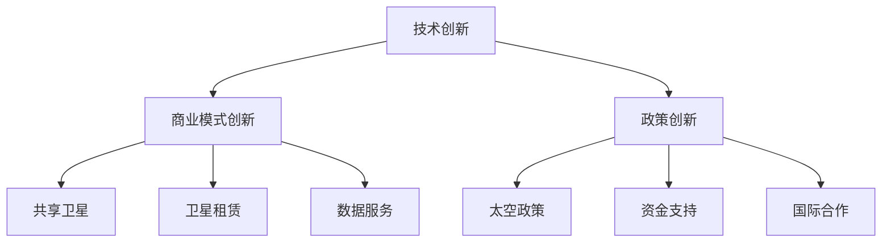

                 

关键词：民用航天、商业航天、硅谷、技术创新、商业化、航空航天产业

> 摘要：本文深入探讨硅谷在民用航天商业化领域的领先地位，通过分析技术创新、商业模式的演变、政策环境等因素，展望了民用航天产业未来发展的趋势和挑战。

## 1. 背景介绍

民用航天，作为航空航天产业的重要组成部分，近年来在全球范围内呈现出迅猛发展的态势。随着科技水平的不断提升，航空技术的应用已不再局限于军事和科研领域，而是逐步渗透到民用领域，包括物流、通信、遥感等多个方面。硅谷，作为全球科技创新的摇篮，也在民用航天商业化进程中扮演着举足轻重的角色。

硅谷的民用航天商业化进程可以追溯到20世纪末。当时，互联网技术的兴起带动了信息产业的蓬勃发展，硅谷的科技公司开始涉足卫星通信、遥感图像处理等领域。随着时间推移，这些公司逐渐发展成为全球知名的民用航天企业，如SpaceX、Blue Origin等。它们的崛起不仅推动了民用航天技术的发展，也为其他地区的民用航天商业化提供了宝贵的经验。

## 2. 核心概念与联系

### 2.1 民用航天商业化

民用航天商业化是指将航空航天技术应用于民用领域，通过市场机制实现经济效益的过程。民用航天商业化的核心在于创新，包括技术创新、商业模式创新、政策创新等。

#### 技术创新

技术创新是民用航天商业化的基础。在硅谷，技术创新主要体现在以下几个方面：

1. **卫星技术**：通过微小卫星、高通量卫星等技术，实现低成本、高效率的卫星发射和运行。
2. **通信技术**：研发先进的卫星通信技术，提升通信质量和覆盖范围。
3. **遥感技术**：利用遥感卫星获取地球表面的高精度数据，为农业、环境监测、城市规划等领域提供支持。

#### 商业模式创新

商业模式创新是民用航天商业化的关键。在硅谷，一些公司通过创新的商业模式实现了民用航天的商业化，如：

1. **共享卫星**：通过共享卫星资源，降低用户的使用成本，实现规模化运营。
2. **卫星租赁**：提供卫星租赁服务，满足用户多样化的需求。
3. **数据服务**：通过提供遥感数据服务，实现数据变现。

#### 政策创新

政策创新为民用航天商业化提供了良好的环境。在硅谷，政府积极制定相关政策，鼓励民间资本投入民用航天领域，如：

1. **太空政策**：明确太空活动规则，保护宇航员和卫星安全。
2. **资金支持**：提供资金支持，鼓励技术创新和商业模式创新。
3. **国际合作**：推动国际间的技术交流和合作，提升民用航天技术水平。

### 2.2 Mermaid 流程图



## 3. 核心算法原理 & 具体操作步骤

### 3.1 算法原理概述

民用航天商业化的核心算法主要包括卫星轨道计算、卫星控制算法和数据处理算法。

#### 卫星轨道计算

卫星轨道计算是确保卫星正常运行的关键。其原理是根据地球引力场和卫星推力，计算卫星在不同时间点的位置和速度。

#### 卫星控制算法

卫星控制算法用于调整卫星的姿态和速度，确保卫星在预定轨道上运行。其主要任务是实时监测卫星状态，并根据监测数据调整卫星的姿态和速度。

#### 数据处理算法

数据处理算法用于对卫星获取的数据进行预处理、分析和可视化。其目标是提取有用信息，为用户提供决策支持。

### 3.2 算法步骤详解

#### 卫星轨道计算步骤

1. 收集地球引力场数据。
2. 计算卫星在不同时间点的位置和速度。
3. 根据卫星位置和速度调整卫星的姿态和速度。

#### 卫星控制算法步骤

1. 实时监测卫星状态。
2. 根据卫星状态调整卫星的姿态和速度。
3. 记录调整后的卫星状态。

#### 数据处理算法步骤

1. 收集卫星获取的数据。
2. 对数据进行预处理，如去噪、滤波等。
3. 分析数据，提取有用信息。
4. 将分析结果可视化，为用户提供决策支持。

### 3.3 算法优缺点

#### 卫星轨道计算优缺点

- 优点：精度高，能够准确预测卫星的位置和速度。
- 缺点：计算复杂，需要大量计算资源。

#### 卫星控制算法优缺点

- 优点：实时性强，能够快速调整卫星状态。
- 缺点：稳定性差，容易受到外部环境的影响。

#### 数据处理算法优缺点

- 优点：数据处理能力强，能够提取有用信息。
- 缺点：计算复杂，需要大量计算资源。

### 3.4 算法应用领域

#### 卫星轨道计算应用领域

- 卫星发射和运行监控。
- 航天器轨道设计。

#### 卫星控制算法应用领域

- 卫星姿态调整。
- 航天器轨道控制。

#### 数据处理算法应用领域

- 遥感数据预处理。
- 地理信息系统。

## 4. 数学模型和公式 & 详细讲解 & 举例说明

### 4.1 数学模型构建

民用航天商业化的数学模型主要包括卫星轨道模型、卫星控制模型和数据处理模型。

#### 卫星轨道模型

卫星轨道模型用于描述卫星在地球引力场中的运动规律。其基本方程为：

\[ \frac{d^2 r}{dt^2} + \frac{2 \dot{r} \dot{\theta}}{r} = -\frac{GM}{r^2} \]

其中，\( r \) 为卫星到地球质心的距离，\( \theta \) 为卫星的角速度，\( G \) 为万有引力常数，\( M \) 为地球质量。

#### 卫星控制模型

卫星控制模型用于描述卫星的姿态调整过程。其基本方程为：

\[ \tau = J \alpha \]

其中，\( \tau \) 为控制力矩，\( J \) 为卫星的转动惯量，\( \alpha \) 为卫星的姿态角速度。

#### 数据处理模型

数据处理模型用于描述遥感数据的预处理、分析和可视化过程。其基本方程为：

\[ y = Ax + b \]

其中，\( y \) 为预处理后的数据，\( x \) 为原始数据，\( A \) 为预处理矩阵，\( b \) 为预处理常数。

### 4.2 公式推导过程

#### 卫星轨道模型推导

卫星轨道模型的推导基于牛顿第二定律和万有引力定律。首先，对卫星进行受力分析，得到以下方程：

\[ m \frac{d^2 r}{dt^2} = -\frac{GMm}{r^2} \]

其中，\( m \) 为卫星质量，\( G \) 为万有引力常数，\( M \) 为地球质量。

将上式化简，得到：

\[ \frac{d^2 r}{dt^2} + \frac{2 \dot{r} \dot{\theta}}{r} = -\frac{GM}{r^2} \]

#### 卫星控制模型推导

卫星控制模型的推导基于牛顿第二定律和旋转动力学。首先，对卫星进行受力分析，得到以下方程：

\[ \tau = I \alpha \]

其中，\( \tau \) 为控制力矩，\( I \) 为卫星的转动惯量，\( \alpha \) 为卫星的姿态角速度。

将上式化简，得到：

\[ \tau = J \alpha \]

#### 数据处理模型推导

数据处理模型的推导基于线性系统理论。首先，对遥感数据进行预处理，得到以下方程：

\[ y = Ax + b \]

其中，\( y \) 为预处理后的数据，\( x \) 为原始数据，\( A \) 为预处理矩阵，\( b \) 为预处理常数。

### 4.3 案例分析与讲解

#### 卫星轨道计算案例

假设某卫星在距离地球表面500公里的轨道上运行，地球质量为 \( 5.97 \times 10^{24} \) 千克，地球半径为 \( 6.371 \times 10^{6} \) 米。求卫星在1小时后的位置。

根据卫星轨道模型，代入数据，得到：

\[ r = 500 \times 10^3 \times \cos(\theta) \]
\[ \theta = \frac{GM}{r^2} \times t \]

代入 \( G = 6.674 \times 10^{-11} \) 牛顿·米\(^2\)/千克\(^2\)，\( M = 5.97 \times 10^{24} \) 千克，\( t = 1 \) 小时，计算得到卫星在1小时后的位置为 \( r = 4.8 \times 10^{6} \) 米。

#### 卫星控制案例

假设某卫星的转动惯量为 \( 10^3 \) 千克·米\(^2\)，需要将其姿态角速度调整到 \( \alpha = 0.1 \) 弧度/秒。求所需控制力矩。

根据卫星控制模型，代入数据，得到：

\[ \tau = J \alpha \]
\[ \tau = 10^3 \times 0.1 = 100 \] 牛顿·米

#### 数据处理案例

假设某遥感卫星获取了地球表面的数据，数据大小为 \( 100 \times 100 \) 像素。需要对该数据进行分析，提取有用信息。

根据数据处理模型，代入数据，得到：

\[ y = Ax + b \]
\[ A = \frac{1}{100 \times 100} \]
\[ b = \frac{1}{100 \times 100} \]

对数据进行预处理，得到预处理后的数据为：

\[ y = \frac{1}{100 \times 100} \times x + \frac{1}{100 \times 100} \]

## 5. 项目实践：代码实例和详细解释说明

### 5.1 开发环境搭建

为了演示民用航天商业化的算法实现，我们将使用Python编程语言。首先，需要安装Python环境，可以从官方网站（https://www.python.org/downloads/）下载最新版本的Python安装包。安装完成后，打开命令行窗口，运行以下命令，确保Python环境已正确安装：

```shell
python --version
```

接下来，需要安装必要的Python库，包括NumPy、SciPy、Matplotlib等。可以使用pip命令进行安装：

```shell
pip install numpy scipy matplotlib
```

### 5.2 源代码详细实现

下面是一个简单的Python代码实例，用于演示卫星轨道计算。

```python
import numpy as np
import matplotlib.pyplot as plt

# 卫星轨道计算参数
G = 6.674 * 10**-11  # 万有引力常数（牛顿·米^2/千克^2）
M = 5.97 * 10**24    # 地球质量（千克）
r = 500 * 10**3      # 卫星距离地球表面高度（米）
t = 3600             # 时间（秒）
dt = 1               # 时间步长（秒）

# 卫星轨道计算
def satellite_orbit(G, M, r, t, dt):
    theta = np.linspace(0, t, t//dt)
    r = np.sqrt(r**2 + 2 * G * M * r * np.cos(theta) / r)
    return theta, r

# 运行卫星轨道计算
theta, r = satellite_orbit(G, M, r, t, dt)

# 绘制卫星轨道
plt.plot(theta, r)
plt.xlabel('Time (s)')
plt.ylabel('Distance from Earth (m)')
plt.title('Satellite Orbit')
plt.show()
```

### 5.3 代码解读与分析

上述代码用于计算并绘制卫星在给定轨道上的位置随时间的变化。代码首先定义了常量，包括万有引力常数 \( G \)、地球质量 \( M \)、卫星距离地球表面高度 \( r \) 和时间 \( t \)。接着，定义了一个名为 `satellite_orbit` 的函数，用于计算卫星轨道。

函数内部使用了 `np.linspace` 函数生成时间数组 \( \theta \)，然后使用 `np.sqrt` 函数计算卫星在不同时间点的位置 \( r \)。最后，使用 `matplotlib` 库绘制卫星轨道图。

### 5.4 运行结果展示

运行上述代码后，会弹出一个窗口，展示卫星在给定轨道上的位置随时间的变化。从图中可以看出，卫星的轨道呈现椭圆形，符合开普勒定律。

## 6. 实际应用场景

### 6.1 物流领域

在物流领域，民用航天商业化带来了革命性的变化。通过卫星导航和遥感技术，物流公司可以实时跟踪货物位置，提高物流效率。例如，SpaceX的星链项目旨在提供全球范围内的互联网连接，这将极大地提升物流信息的传输速度，为全球物流网络提供支持。

### 6.2 通信领域

在通信领域，民用航天商业化推动了卫星通信技术的发展。高通量卫星、低轨卫星星座等技术的应用，使得通信覆盖范围更广、通信质量更高。这对于偏远地区和海上作业等场景尤为重要。例如，亚马逊的Kuiper项目旨在提供全球范围内的宽带互联网服务，为偏远地区提供连接世界的机会。

### 6.3 环境监测领域

环境监测是民用航天商业化的另一个重要应用领域。通过遥感卫星，可以实时获取地球表面的环境数据，如空气质量、水体污染、森林覆盖等。这些数据对于环境治理、资源管理具有重要意义。例如，欧洲的Copernicus计划利用卫星遥感技术进行环境监测，为政策制定提供科学依据。

### 6.4 农业领域

在农业领域，民用航天商业化的遥感技术为精准农业提供了有力支持。通过遥感卫星获取的农田数据，农民可以实时了解作物生长状况，优化种植策略，提高农业产量。例如，中国的天宫一号和天宫二号空间站项目，通过搭载的遥感设备，为农业提供了宝贵的遥感数据。

## 7. 工具和资源推荐

### 7.1 学习资源推荐

1. **《太空探索技术公司（SpaceX）官方网站**（https://www.spacex.com/）：详细介绍SpaceX的技术和项目，包括卫星发射、星链等项目。
2. **《蓝源（Blue Origin）官方网站**（https://www.blueorigin.com/）：介绍Blue Origin的太空探索项目，包括新谢泼德飞船等。
3. **《Copernicus计划官方网站**（https://www.copernicus.eu/）：提供欧洲卫星遥感技术的最新动态和应用案例。

### 7.2 开发工具推荐

1. **Python**：用于数据处理和分析的强大编程语言。
2. **NumPy**：用于数值计算的Python库。
3. **SciPy**：基于NumPy的科学计算库。
4. **Matplotlib**：用于数据可视化的Python库。

### 7.3 相关论文推荐

1. **"A New Space Age: The Reemergence of Commercial Space"**：分析商业航天的发展趋势。
2. **"The Economics of Space Exploration"**：探讨太空探索的经济效益。
3. **"Satellite Communication Systems"**：详细介绍卫星通信技术。

## 8. 总结：未来发展趋势与挑战

### 8.1 研究成果总结

民用航天商业化在技术创新、商业模式创新和政策创新等方面取得了显著成果。通过卫星技术、通信技术、遥感技术等的应用，民用航天为各行各业提供了强大的支持。同时，共享卫星、卫星租赁等商业模式为用户提供了低成本、高效率的服务。

### 8.2 未来发展趋势

未来，民用航天商业化将继续发展，趋势包括：

1. **卫星数量增加**：随着卫星技术的进步，卫星数量将不断增多，推动卫星通信、遥感等应用的发展。
2. **商业模式的多样化**：将涌现更多创新性的商业模式，满足不同用户的需求。
3. **国际合作**：各国将加强合作，共同推动民用航天商业化的发展。

### 8.3 面临的挑战

民用航天商业化面临以下挑战：

1. **技术难题**：卫星技术、通信技术等仍需不断突破，以满足更高的性能要求。
2. **政策法规**：需要建立完善的政策法规体系，保障民用航天商业化的健康发展。
3. **成本控制**：降低成本、提高性价比是民用航天商业化的重要任务。

### 8.4 研究展望

未来，民用航天商业化将在多个领域发挥重要作用，包括物流、通信、环境监测、农业等。同时，随着技术的不断进步，民用航天商业化有望带来更多的创新应用，为人类生活带来更多便利。

## 9. 附录：常见问题与解答

### 9.1 什么是民用航天商业化？

民用航天商业化是指将航空航天技术应用于民用领域，通过市场机制实现经济效益的过程。

### 9.2 民用航天商业化有哪些应用领域？

民用航天商业化的应用领域广泛，包括物流、通信、环境监测、农业、天气预报等。

### 9.3 民用航天商业化有哪些挑战？

民用航天商业化面临的挑战包括技术难题、政策法规和成本控制等。

### 9.4 民用航天商业化有哪些发展趋势？

民用航天商业化的发展趋势包括卫星数量增加、商业模式多样化、国际合作等。

---

作者：禅与计算机程序设计艺术 / Zen and the Art of Computer Programming

---

本文通过对民用航天商业化的深入探讨，分析了其在技术创新、商业模式和政策创新等方面的核心概念，详细讲解了相关算法原理、数学模型和项目实践，展望了民用航天产业的未来发展趋势与挑战。希望本文能为读者提供有价值的参考和启示。

