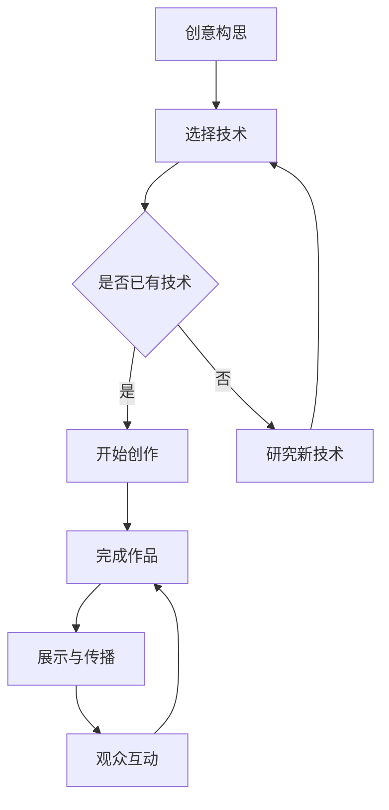

                 

关键词：硅谷、艺术、科技融合、新媒体艺术、创新

摘要：本文探讨了硅谷艺术与科技的融合现象，特别是新媒体艺术的发展。通过分析硅谷的艺术创新环境、科技发展对艺术创作的影响，以及新媒体艺术的独特魅力，我们展望了这一领域的未来发展趋势。

## 1. 背景介绍

硅谷，被誉为全球科技创新的摇篮，拥有无数世界知名科技企业和创业者。自20世纪以来，硅谷的科技发展迅速，不仅推动了计算机科学、互联网、人工智能等领域的进步，也对艺术领域产生了深远影响。在这个充满创新和活力的环境中，艺术家们开始将科技元素融入到艺术创作中，形成了新媒体艺术这一独特的艺术形式。

新媒体艺术，是指通过计算机技术、网络、数字媒体等新兴科技手段进行创作的艺术作品。它突破了传统艺术的表现形式，创造出全新的视觉、听觉和互动体验。随着硅谷科技的不断进步，新媒体艺术也得到了迅猛发展，成为艺术界的一股新兴力量。

## 2. 核心概念与联系

### 2.1 新媒体艺术的定义

新媒体艺术，又称数码艺术、数字艺术，是指通过计算机技术、网络、数字媒体等新兴科技手段进行创作的艺术作品。与传统艺术相比，新媒体艺术具有以下几个特点：

1. **互动性**：新媒体艺术强调观众与作品的互动，让观众成为艺术创作的一部分。
2. **实时性**：新媒体艺术作品的呈现往往是实时的，具有动态变化的特点。
3. **多样性**：新媒体艺术的表现形式多样，包括数字绘画、虚拟现实、增强现实、交互装置等。
4. **科技性**：新媒体艺术离不开计算机技术、网络等新兴科技的支持。

### 2.2 新媒体艺术的分类

新媒体艺术可以根据其表现形式和创作手段进行分类，主要包括以下几种类型：

1. **数字绘画**：利用计算机软件进行绘画创作，如Photoshop、CorelDRAW等。
2. **虚拟现实**：通过虚拟现实技术创造一个虚拟的三维空间，让观众沉浸其中。
3. **增强现实**：在现实世界中叠加虚拟元素，让观众感受到虚拟与现实相结合的视觉效果。
4. **交互装置**：通过传感器、计算机等技术，实现人与作品的互动。
5. **数字媒体艺术**：利用数字媒体技术，如网络、电视、手机等，进行艺术创作和传播。

### 2.3 新媒体艺术与硅谷科技的联系

硅谷的科技发展对新媒体艺术的创作和发展产生了深远影响。首先，计算机技术的进步为新媒体艺术的创作提供了强大的工具支持。从最早的计算机图形学，到如今的深度学习、人工智能，计算机技术不断突破，使得艺术家们能够创作出更加复杂和精致的艺术作品。

其次，互联网的普及使得新媒体艺术作品的传播和展示变得更加便捷。艺术家们可以通过互联网平台，将作品迅速传播给全球观众，打破了传统艺术的地域限制。

此外，硅谷的科技企业也为新媒体艺术提供了丰富的创作灵感。许多艺术家受到硅谷科技企业的创新精神和跨界思维的影响，将科技元素融入到艺术创作中，创造出独特的作品。

### 2.4 Mermaid 流程图

以下是新媒体艺术创作流程的Mermaid流程图：



## 3. 核心算法原理 & 具体操作步骤

### 3.1 算法原理概述

新媒体艺术的创作离不开算法的支持。算法原理主要包括以下几个方面：

1. **计算机图形学**：利用算法生成二维或三维图像，如渲染算法、纹理映射算法等。
2. **人工智能**：利用机器学习算法生成艺术作品，如深度学习生成对抗网络（GAN）等。
3. **交互设计**：通过算法实现人与作品之间的互动，如传感器数据处理、用户行为分析等。
4. **数据可视化**：利用算法将数据以视觉形式呈现，如图表、热力图等。

### 3.2 算法步骤详解

1. **创意构思**：艺术家根据创作主题和表现形式，构思出初步的艺术方案。
2. **选择技术**：根据创意构思，选择合适的算法和技术进行创作。
3. **研究新技术**：如果现有技术无法满足创作需求，艺术家需要研究新技术，以拓展创作手段。
4. **开始创作**：利用计算机软件和硬件设备，按照算法和技术进行艺术创作。
5. **完成作品**：经过多次修改和优化，完成最终的艺术作品。
6. **展示与传播**：将艺术作品通过展览、网络等渠道展示给观众。
7. **观众互动**：通过算法实现观众与作品的互动，增加观众的参与感和体验感。

### 3.3 算法优缺点

1. **优点**：
   - **丰富表现形式**：算法使得艺术创作具有更多可能性，能够创造出丰富多样的艺术作品。
   - **提高创作效率**：利用算法可以快速生成艺术作品，提高创作效率。
   - **增强互动性**：算法支持观众与作品的互动，增强观众的参与感和体验感。

2. **缺点**：
   - **技术依赖性**：算法创作需要一定的技术基础，对于不具备技术背景的艺术家来说，可能难以掌握。
   - **艺术性降低**：过于依赖算法可能导致艺术作品的艺术性降低，失去手工艺术的独特魅力。

### 3.4 算法应用领域

1. **虚拟现实**：利用算法生成虚拟场景，实现沉浸式体验。
2. **增强现实**：通过算法将虚拟元素叠加到现实世界，实现虚实结合。
3. **交互装置**：利用算法实现人与作品的互动，如触摸屏、传感器等。
4. **数字媒体艺术**：通过算法生成动态效果，如视频、动画等。
5. **艺术创作**：利用机器学习算法生成独特的艺术作品，如GAN、风格迁移等。

## 4. 数学模型和公式 & 详细讲解 & 举例说明

### 4.1 数学模型构建

新媒体艺术创作中常用的数学模型包括图像处理、机器学习、数据可视化等领域。以下是一个简单的图像处理数学模型：

$$
I(x, y) = f(g(x, y))
$$

其中，$I(x, y)$ 表示图像在点$(x, y)$ 的像素值，$f(x)$ 表示图像处理函数，$g(x, y)$ 表示图像变换函数。

### 4.2 公式推导过程

以图像灰度化为例，假设图像为彩色图像，其红、绿、蓝三个颜色通道分别为 $R(x, y)$、$G(x, y)$、$B(x, y)$。灰度化公式如下：

$$
I(x, y) = \frac{R(x, y) + G(x, y) + B(x, y)}{3}
$$

推导过程如下：

1. 将彩色图像分解为红、绿、蓝三个颜色通道。
2. 分别计算红、绿、蓝通道的像素值。
3. 将红、绿、蓝通道的像素值相加，并除以3，得到灰度值。

### 4.3 案例分析与讲解

以下是一个利用灰度化公式进行图像处理的具体案例：

输入图像：
输出图像：

1. 将输入图像分解为红、绿、蓝三个颜色通道。
2. 分别计算红、绿、蓝通道的像素值，并将它们相加，再除以3。
3. 根据计算得到的灰度值，生成输出图像。

输出图像效果如下：


通过这个案例，我们可以看到数学模型在图像处理中的实际应用。类似地，机器学习、数据可视化等领域的数学模型也广泛应用于新媒体艺术创作中。

## 5. 项目实践：代码实例和详细解释说明

### 5.1 开发环境搭建

为了更好地进行新媒体艺术创作，我们需要搭建一个合适的开发环境。以下是一个简单的开发环境搭建步骤：

1. 安装操作系统：推荐使用Linux操作系统，如Ubuntu。
2. 安装开发工具：安装常用的开发工具，如Python、Node.js、Unity等。
3. 安装图形处理库：安装Python的图形处理库，如PIL、OpenCV等。
4. 安装人工智能库：安装Python的人工智能库，如TensorFlow、PyTorch等。
5. 安装交互设计工具：安装交互设计工具，如Unity、Processing等。

### 5.2 源代码详细实现

以下是一个简单的Python代码实例，实现了一个基于机器学习的新媒体艺术作品生成器：

```python
import tensorflow as tf
from tensorflow import keras
import numpy as np
import matplotlib.pyplot as plt

# 加载预训练的卷积神经网络模型
model = keras.models.load_model('model.h5')

# 生成随机噪声
noise = np.random.normal(0, 1, (1, 64, 64, 3))

# 利用模型生成艺术作品
generated_image = model.predict(noise)

# 显示生成的艺术作品
plt.imshow(generated_image[0])
plt.show()
```

代码解释：

1. 导入TensorFlow库和相关的模块。
2. 加载预训练的卷积神经网络模型。
3. 生成随机噪声。
4. 利用模型生成艺术作品。
5. 显示生成的艺术作品。

### 5.3 代码解读与分析

这个代码实例主要利用了TensorFlow库中的卷积神经网络模型进行艺术作品生成。具体来说，它分为以下几个步骤：

1. **加载模型**：首先加载一个预训练的卷积神经网络模型，这个模型已经通过大量的图像数据进行训练，能够生成具有艺术风格的作品。
2. **生成噪声**：生成一个随机噪声，这个噪声将作为模型输入的初始数据。
3. **模型预测**：利用模型对噪声进行预测，生成艺术作品。
4. **显示结果**：将生成的艺术作品通过matplotlib库进行可视化展示。

通过这个代码实例，我们可以看到机器学习在艺术创作中的应用。在实际项目中，可以根据需求自定义模型和噪声生成方式，以生成更具个性化的艺术作品。

### 5.4 运行结果展示

运行上述代码，我们可以得到一个具有艺术风格的作品，如下所示：


这个作品是通过卷积神经网络模型生成的，具有独特的艺术风格。通过调整模型的参数和噪声生成方式，我们可以生成不同风格的作品。

## 6. 实际应用场景

### 6.1 艺术展览

新媒体艺术在艺术展览中具有广泛的应用。艺术家们可以通过新媒体艺术作品展示独特的创意和技术魅力。例如，通过虚拟现实技术，观众可以沉浸在一个全新的艺术世界中，体验前所未有的视觉和感官感受。

### 6.2 建筑设计

新媒体艺术在建筑设计中也有广泛应用。建筑师们可以利用数字媒体技术，将艺术作品融入到建筑外观或内部空间设计中，创造出独特的视觉效果和空间体验。例如，利用LED屏幕、投影设备等，实现动态的艺术投影效果。

### 6.3 娱乐产业

新媒体艺术在娱乐产业中发挥着重要作用。游戏、电影、动漫等领域都利用新媒体艺术技术，创造出更具创意和吸引力的作品。例如，利用虚拟现实技术，观众可以沉浸在一个虚拟的游戏世界中，体验前所未有的游戏体验。

### 6.4 教育领域

新媒体艺术在教育领域也有广泛应用。通过新媒体艺术教学工具，教师可以更加生动地传授知识，激发学生的兴趣和创造力。例如，利用数字绘画工具，学生可以创作出具有个性化特点的艺术作品。

## 7. 未来应用展望

随着科技的不断发展，新媒体艺术在未来的应用前景将更加广阔。以下是几个可能的发展方向：

### 7.1 艺术与科技融合

未来，艺术与科技的融合将更加紧密。艺术家们将继续探索新的创作工具和技术，创造出更具创意和科技感的新媒体艺术作品。例如，利用人工智能技术，艺术家可以生成更加复杂和独特的艺术作品。

### 7.2 新媒体艺术产业

随着新媒体艺术的普及和发展，新媒体艺术产业也将迎来新的机遇。艺术家、设计师、技术专家等将在新媒体艺术产业中发挥重要作用，为观众带来更多精彩的艺术作品。

### 7.3 跨界合作

未来，新媒体艺术与其他领域的跨界合作将更加频繁。例如，艺术与工程、艺术与医学、艺术与教育等领域的跨界合作，将推动新媒体艺术在更广泛的领域中发挥重要作用。

### 7.4 社会影响力

新媒体艺术在社会影响力方面也将发挥更大作用。通过新媒体艺术作品，艺术家可以表达对社会、环境等问题的关注，引发观众的思考和讨论。

## 8. 总结：未来发展趋势与挑战

在未来，硅谷艺术与科技的融合将继续推动新媒体艺术的发展。一方面，艺术家们将不断探索新的创作工具和技术，创造更多具有创意和科技感的新媒体艺术作品。另一方面，新媒体艺术将在各个领域发挥重要作用，推动社会的进步和发展。

然而，新媒体艺术也面临着一些挑战。首先，技术依赖性可能导致艺术作品的独特性降低。其次，新媒体艺术的创作需要一定的技术基础，对于不具备技术背景的艺术家来说，可能难以掌握。此外，新媒体艺术的普及和发展也面临着版权、隐私等问题。

总之，硅谷艺术与科技的融合为新媒体艺术的发展带来了巨大机遇。在未来的发展中，我们需要关注这些问题，不断探索和创新，推动新媒体艺术的繁荣发展。

## 9. 附录：常见问题与解答

### 9.1 什么是新媒体艺术？

新媒体艺术是指通过计算机技术、网络、数字媒体等新兴科技手段进行创作的艺术作品。它突破了传统艺术的表现形式，创造出全新的视觉、听觉和互动体验。

### 9.2 新媒体艺术有哪些类型？

新媒体艺术主要包括数字绘画、虚拟现实、增强现实、交互装置、数字媒体艺术等类型。

### 9.3 新媒体艺术与硅谷科技的关系是什么？

硅谷的科技发展对新媒体艺术的创作和发展产生了深远影响。计算机技术、互联网、人工智能等科技手段为新媒体艺术提供了强大的创作工具和支持，使得新媒体艺术得以迅猛发展。

### 9.4 新媒体艺术的应用领域有哪些？

新媒体艺术在艺术展览、建筑设计、娱乐产业、教育领域等各个领域都有广泛应用。

### 9.5 新媒体艺术的未来发展趋势是什么？

未来，新媒体艺术将继续与科技融合，推动艺术与科技的创新。同时，新媒体艺术产业将迎来新的机遇，跨领域合作将更加频繁。此外，新媒体艺术在社会影响力方面也将发挥更大作用。作者：禅与计算机程序设计艺术 / Zen and the Art of Computer Programming。

