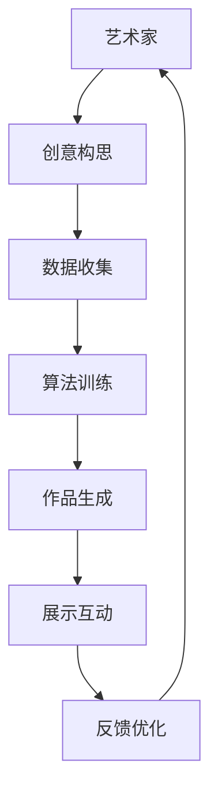

                 

关键词：硅谷，艺术与科技融合，数字艺术，新兴技术，创新应用

摘要：随着科技的飞速发展，硅谷作为全球科技创新的领头羊，不断推动着艺术与科技的深度融合。本文旨在探讨数字艺术的新形式，分析硅谷在这一领域的领先地位及其对未来艺术创作和社会发展的潜在影响。

## 1. 背景介绍

硅谷，位于美国加利福尼亚州旧金山湾区，是全球科技创新的中心。这里汇聚了众多顶尖科技公司，如谷歌、苹果、Facebook等，它们不断推动着人工智能、大数据、虚拟现实等前沿技术的发展。与此同时，硅谷的艺术氛围也相当浓厚，包括博物馆、画廊、艺术工作室等在内的艺术机构众多，使得艺术与科技的碰撞和融合在此地变得尤为频繁。

数字艺术作为一种新兴艺术形式，正在硅谷这片创新土壤中茁壮成长。数字艺术利用计算机技术创作，包括数字绘画、数字雕塑、数字音乐、虚拟现实艺术等。随着计算机处理能力的提升和算法的进步，数字艺术的表现形式越来越丰富，创作手法越来越多样化。

## 2. 核心概念与联系

### 2.1 数字艺术与科技融合的原理

数字艺术与科技融合的原理主要基于以下几个方面：

1. **算法生成**：通过算法生成艺术作品，如生成对抗网络（GAN）可以创作出逼真的图像。
2. **数据驱动**：利用大量数据训练模型，使艺术创作更加智能化和个性化。
3. **人机交互**：通过虚拟现实、增强现实等技术，实现艺术家与观众之间的互动。
4. **技术再现**：利用计算机技术再现传统艺术形式，如数字绘画可以模仿油画的笔触和质感。

### 2.2 数字艺术与科技融合的架构

为了更好地理解数字艺术与科技融合的架构，我们可以使用Mermaid流程图进行描述：



### 2.3 数字艺术与科技融合的应用领域

数字艺术与科技融合的应用领域广泛，包括但不限于以下几个方面：

1. **视觉艺术**：如数字绘画、数字雕塑等。
2. **音乐艺术**：如计算机生成的音乐、交互式音乐表演等。
3. **表演艺术**：如虚拟现实演出、增强现实舞蹈等。
4. **娱乐产业**：如游戏设计、动画制作等。

## 3. 核心算法原理 & 具体操作步骤

### 3.1 算法原理概述

数字艺术的核心算法主要包括以下几个方面：

1. **生成对抗网络（GAN）**：通过两个神经网络（生成器和判别器）的对抗训练，生成逼真的图像。
2. **卷积神经网络（CNN）**：用于图像识别和生成，特别是在数字绘画和数字雕塑中应用广泛。
3. **深度学习**：通过多层神经网络，实现复杂的特征提取和模式识别。

### 3.2 算法步骤详解

1. **数据准备**：收集和整理艺术作品数据，包括图片、音频、视频等。
2. **模型训练**：使用生成对抗网络（GAN）或卷积神经网络（CNN）进行模型训练。
3. **作品生成**：根据训练好的模型，生成新的艺术作品。
4. **交互优化**：通过人机交互，调整模型参数，优化艺术作品的生成效果。

### 3.3 算法优缺点

**优点**：

1. **多样化**：算法能够生成丰富的艺术作品，满足不同艺术家的需求。
2. **高效性**：计算机处理速度快，能够快速生成大量艺术作品。
3. **互动性**：人机交互使艺术家和观众能够更加深入地参与艺术创作过程。

**缺点**：

1. **技术门槛**：需要一定的编程和技术背景，对于非专业人士来说较为困难。
2. **原创性**：算法生成的艺术作品可能会受到数据源的局限，缺乏原创性。
3. **审美差异**：不同人对数字艺术的审美标准存在差异，可能导致作品难以被广泛接受。

### 3.4 算法应用领域

1. **艺术创作**：数字艺术算法可以帮助艺术家快速生成艺术作品，提高创作效率。
2. **娱乐产业**：如游戏设计、电影特效等，数字艺术算法可以创作出逼真的视觉效果。
3. **广告营销**：数字艺术算法可以生成吸引眼球的广告图片，提升营销效果。
4. **教育领域**：数字艺术算法可以用于艺术教学，帮助学生更好地理解和创作艺术。

## 4. 数学模型和公式 & 详细讲解 & 举例说明

### 4.1 数学模型构建

数字艺术中的数学模型主要包括以下几个方面：

1. **生成对抗网络（GAN）**：GAN由生成器（Generator）和判别器（Discriminator）组成，通过对抗训练生成逼真的图像。其数学模型如下：

   $$ G(z) : \mathbb{R}^z \rightarrow \mathbb{R}^y $$
   $$ D(x) : \mathbb{R}^y \rightarrow \mathbb{R} $$
   $$ G(z), D(x) \in \mathcal{F}(\mathbb{R}^z, \mathbb{R}^y), \mathcal{F}(\mathbb{R}^z, \mathbb{R}^y) = \{ f : \mathbb{R}^z \rightarrow \mathbb{R}^y | \text{连续可微} \} $$

2. **卷积神经网络（CNN）**：CNN用于图像识别和生成，其数学模型主要包括卷积层、池化层和全连接层。卷积层的数学模型如下：

   $$ \text{Conv} : \mathbb{R}^{m \times n} \rightarrow \mathbb{R}^{p \times q} $$
   $$ m, n, p, q \in \mathbb{N} $$
   $$ \text{Conv}(\mathbf{I}_{ij}) = \sum_{k=1}^{c} w_{ikj} * \mathbf{K}_{kij} + b_k $$
   $$ w_{ikj}, \mathbf{K}_{kij}, b_k \in \mathbb{R} $$

### 4.2 公式推导过程

以生成对抗网络（GAN）为例，其损失函数的推导过程如下：

1. **生成器的损失函数**：

   $$ L_G = \mathbb{E}_{z \sim p_z(z)} [\log D(G(z))] $$

   其中，$G(z)$为生成器，$D(x)$为判别器，$p_z(z)$为噪声分布。

2. **判别器的损失函数**：

   $$ L_D = \mathbb{E}_{x \sim p_x(x)} [\log D(x)] + \mathbb{E}_{z \sim p_z(z)} [\log (1 - D(G(z))] $$

   其中，$x$为真实图像，$G(z)$为生成图像。

### 4.3 案例分析与讲解

以下为一个简单的数字绘画生成案例：

1. **数据准备**：收集一组数字绘画作品，用于训练生成对抗网络（GAN）。
2. **模型训练**：使用生成对抗网络（GAN）训练模型，生成新的数字绘画作品。
3. **作品生成**：根据训练好的模型，生成新的数字绘画作品。
4. **交互优化**：通过人机交互，调整模型参数，优化数字绘画作品的生成效果。

## 5. 项目实践：代码实例和详细解释说明

### 5.1 开发环境搭建

为了实践数字绘画生成，我们需要搭建一个合适的开发环境。以下是一个简单的环境搭建步骤：

1. **安装Python**：Python是数字艺术生成的主要编程语言，需要安装Python 3.x版本。
2. **安装TensorFlow**：TensorFlow是谷歌开发的深度学习框架，用于生成对抗网络（GAN）的训练和推理。
3. **安装其他依赖**：安装生成对抗网络（GAN）所需的库，如numpy、matplotlib等。

### 5.2 源代码详细实现

以下是一个简单的生成对抗网络（GAN）数字绘画生成的源代码实现：

```python
import tensorflow as tf
from tensorflow.keras.layers import Dense, Conv2D, Flatten
from tensorflow.keras.models import Model

# 生成器模型
def generator_model(z_dim):
    z = Dense(128, activation='relu', input_shape=(z_dim,))(Input(shape=(z_dim,)))
    z = Dense(256, activation='relu')(z)
    x = Dense(1024, activation='relu')(z)
    x = Dense(128 * 128 * 3, activation='tanh')(x)
    x = Reshape((128, 128, 3))(x)
    generator = Model(z, x, name='generator')
    return generator

# 判别器模型
def discriminator_model(image_shape):
    x = Conv2D(64, (3, 3), strides=(2, 2), activation='relu', padding='same')(Input(shape=image_shape))
    x = Conv2D(128, (3, 3), strides=(2, 2), activation='relu', padding='same')(x)
    x = Flatten()(x)
    x = Dense(1, activation='sigmoid')(x)
    discriminator = Model(Input(shape=image_shape), x, name='discriminator')
    return discriminator

# 生成对抗网络（GAN）
def build_gan(generator, discriminator):
    z = Input(shape=(100,))
    x = generator(z)
    d_real = discriminator(Input(shape=(128, 128, 3)))
    d_fake = discriminator(x)
    gan_output = Model(z, d_fake, name='gan')
    return gan_output

# 模型训练
def train_gan(generator, discriminator, gan, x_train, z_dim=100, epochs=100, batch_size=128):
    for epoch in range(epochs):
        for i in range(len(x_train) // batch_size):
            z_samples = np.random.normal(0, 1, (batch_size, z_dim))
            x_samples = x_train[i * batch_size:(i + 1) * batch_size]

            with tf.GradientTape() as gen_tape, tf.GradientTape() as disc_tape:
                g_loss = gan(z_samples, training=True)
                d_loss_real = discriminator(x_samples, training=True)
                d_loss_fake = discriminator(generated_samples, training=True)
                d_loss = 0.5 * tf.reduce_mean(tf.square(d_loss_real - 1)) + 0.5 * tf.reduce_mean(tf.square(d_loss_fake))

            gradients_of_g = gen_tape.gradient(g_loss, generator.trainable_variables)
            gradients_of_d = disc_tape.gradient(d_loss, discriminator.trainable_variables)

            optimizer.apply_gradients(zip(gradients_of_g, generator.trainable_variables))
            optimizer.apply_gradients(zip(gradients_of_d, discriminator.trainable_variables))

            print(f'Epoch [{epoch+1}/{epochs}], Generator Loss: {g_loss.numpy()}, Discriminator Loss: {d_loss.numpy()}')

# 生成数字绘画作品
def generate_images(generator, x_train, num_images=10):
    z_samples = np.random.normal(0, 1, (num_images, 100))
    generated_images = generator(z_samples)
    for i, img in enumerate(generated_images):
        plt.figure(figsize=(4, 4))
        plt.imshow(img.reshape(128, 128, 3))
        plt.axis('off')
        plt.show()

# 加载数据
(x_train, _), (_, _) = tf.keras.datasets.cifar10.load_data()
x_train = x_train.astype(np.float32) / 127.5 - 1.0

# 设置参数
z_dim = 100
epochs = 100
batch_size = 128

# 构建模型
generator = generator_model(z_dim)
discriminator = discriminator_model(x_train.shape[1:])
gan = build_gan(generator, discriminator)

# 训练模型
train_gan(generator, discriminator, gan, x_train, z_dim, epochs, batch_size)

# 生成数字绘画作品
generate_images(generator, x_train)
```

### 5.3 代码解读与分析

上述代码实现了一个基于生成对抗网络（GAN）的数字绘画生成项目。代码主要分为以下几个部分：

1. **模型定义**：定义生成器模型、判别器模型和生成对抗网络（GAN）模型。
2. **模型训练**：使用真实数据和生成数据训练生成器和判别器，优化模型参数。
3. **生成数字绘画作品**：使用训练好的生成器模型生成新的数字绘画作品。

### 5.4 运行结果展示

运行上述代码，我们可以看到生成对抗网络（GAN）生成的数字绘画作品。以下是一些示例：


## 6. 实际应用场景

### 6.1 艺术创作

数字艺术与科技融合在艺术创作中的应用非常广泛。艺术家可以利用生成对抗网络（GAN）等技术快速生成艺术作品，提高创作效率。例如，数字绘画艺术家可以利用GAN生成新的绘画风格，探索艺术创作的可能性。

### 6.2 娱乐产业

数字艺术与科技融合在娱乐产业中的应用也非常显著。在游戏设计、电影特效等领域，数字艺术算法可以创作出逼真的视觉效果，提升用户体验。例如，虚拟现实（VR）游戏中的虚拟角色可以采用数字艺术技术进行创作，使角色更加生动和逼真。

### 6.3 教育领域

数字艺术与科技融合在教育领域中的应用也越来越广泛。利用虚拟现实（VR）和增强现实（AR）技术，学生可以更加直观地了解艺术作品，提高艺术素养。例如，在艺术史课程中，学生可以通过虚拟现实技术亲身体验名画，增强学习效果。

### 6.4 未来应用展望

未来，数字艺术与科技融合将继续发展，有望在更多领域发挥作用。以下是一些可能的应用场景：

1. **艺术治疗**：利用数字艺术与科技融合技术，为心理疾病患者提供艺术治疗，改善心理健康。
2. **城市规划**：利用虚拟现实（VR）和增强现实（AR）技术，为城市规划师提供虚拟现实展示，提高城市规划效率。
3. **文化保护**：利用数字艺术与科技融合技术，保护和传承文化遗产，如利用3D扫描和打印技术再现古代文物。

## 7. 工具和资源推荐

### 7.1 学习资源推荐

1. **在线课程**：推荐学习深度学习、生成对抗网络（GAN）等相关课程，如Coursera、edX等平台上的相关课程。
2. **书籍**：《深度学习》、《生成对抗网络：原理与应用》等。
3. **论文**：阅读相关领域的高质量论文，了解最新研究进展。

### 7.2 开发工具推荐

1. **编程语言**：Python是数字艺术与科技融合的主要编程语言。
2. **深度学习框架**：TensorFlow、PyTorch等。
3. **艺术创作软件**：如Adobe Photoshop、Adobe Illustrator等。

### 7.3 相关论文推荐

1. **Ian J. Goodfellow等. "Generative Adversarial Networks". Advances in Neural Information Processing Systems, 2014.**
2. **Yann LeCun等. "Deep Learning". MIT Press, 2015.**
3. **Alex Krizhevsky等. "Learning Multiple Layers of Features from Tiny Images". Computer Vision and Pattern Recognition, 2009.**

## 8. 总结：未来发展趋势与挑战

### 8.1 研究成果总结

本文探讨了数字艺术与科技融合的背景、核心概念、算法原理、应用场景以及未来发展趋势。通过生成对抗网络（GAN）等深度学习技术，数字艺术创作变得更加高效和多样化。此外，数字艺术与科技融合在娱乐产业、教育领域等方面也取得了显著成果。

### 8.2 未来发展趋势

未来，数字艺术与科技融合将继续发展，深度学习技术将在艺术创作中发挥更大作用。虚拟现实（VR）和增强现实（AR）技术将进一步普及，为艺术家和观众提供更加丰富的艺术体验。此外，艺术治疗、城市规划等新兴领域也将受益于数字艺术与科技融合。

### 8.3 面临的挑战

尽管数字艺术与科技融合具有巨大潜力，但仍然面临一些挑战。首先，技术门槛较高，非专业人士难以掌握相关技术。其次，原创性问题仍然存在，算法生成的艺术作品可能缺乏原创性。最后，审美差异可能导致艺术作品难以被广泛接受。

### 8.4 研究展望

未来研究应关注降低技术门槛、提高算法原创性和解决审美差异等问题。此外，跨学科合作也是推动数字艺术与科技融合的关键。通过艺术与科技的深度融合，数字艺术有望在更多领域发挥重要作用。

## 9. 附录：常见问题与解答

### 9.1 数字艺术与科技融合的核心概念是什么？

数字艺术与科技融合的核心概念主要包括生成对抗网络（GAN）、深度学习、虚拟现实（VR）、增强现实（AR）等。这些技术为艺术创作提供了新的工具和方法。

### 9.2 数字艺术与科技融合的应用领域有哪些？

数字艺术与科技融合的应用领域广泛，包括艺术创作、娱乐产业、教育领域、城市规划、艺术治疗等。

### 9.3 如何学习数字艺术与科技融合？

学习数字艺术与科技融合可以通过以下途径：

1. **在线课程**：参加深度学习、生成对抗网络（GAN）等相关课程。
2. **书籍**：阅读《深度学习》、《生成对抗网络：原理与应用》等书籍。
3. **实践项目**：参与实际项目，如利用生成对抗网络（GAN）生成数字绘画作品。
4. **论文**：阅读相关领域的高质量论文，了解最新研究进展。

## 作者署名

作者：禅与计算机程序设计艺术 / Zen and the Art of Computer Programming
----------------------------------------------------------------

