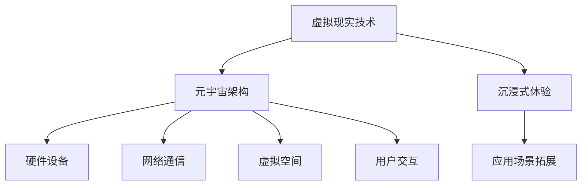

                 

关键词：虚拟现实、元宇宙、科技冲击、硅谷、人工智能、开发工具、学习资源、未来展望

> 摘要：随着科技的发展，虚拟现实技术正逐渐走进我们的日常生活，元宇宙的兴起更是引发了全球范围内的科技热潮。本文将深入探讨虚拟现实在硅谷的科技冲击，分析其核心概念、算法原理、应用场景及未来发展趋势。

## 1. 背景介绍

### 1.1 虚拟现实的起源与发展

虚拟现实（Virtual Reality，VR）技术起源于20世纪50年代的计算机图形学。1968年，美国计算机科学家伊凡·苏瑟兰（Ivan Sutherland）发明了第一台头戴式显示器（Head-Mounted Display，HMD），标志着虚拟现实技术的诞生。此后，随着计算机性能的提升和显示技术的进步，虚拟现实技术逐渐走向成熟。

### 1.2 元宇宙的概念

元宇宙（Metaverse）是一个虚拟的、三维的、互联互通的数字世界，用户可以在其中进行各种活动，如社交、娱乐、工作、学习等。元宇宙的核心在于实现虚拟世界与现实世界的无缝连接，提供更加丰富、互动、沉浸式的体验。

### 1.3 硅谷的虚拟现实与元宇宙发展

硅谷作为全球科技创新的源头，一直是虚拟现实和元宇宙发展的热点地区。众多科技公司，如Facebook、谷歌、微软、英伟达等，都在硅谷进行了大量的虚拟现实和元宇宙项目研发，推动了相关技术的快速进步。

## 2. 核心概念与联系

### 2.1 虚拟现实技术

虚拟现实技术主要包括头戴式显示器、跟踪系统、输入设备等硬件，以及相应的软件算法。其核心在于提供高度沉浸式的体验，使用户在虚拟世界中感受到身临其境的感觉。

### 2.2 元宇宙架构

元宇宙的架构包括硬件设备、网络通信、虚拟空间、用户交互等多个方面。其中，硬件设备负责提供感知和交互能力，网络通信负责实现用户之间的互联互通，虚拟空间则提供了用户活动的场景，用户交互则实现了人与虚拟世界的互动。

### 2.3 虚拟现实与元宇宙的联系

虚拟现实技术是元宇宙的重要组成部分，为元宇宙提供了沉浸式体验的基础。而元宇宙则为虚拟现实技术提供了广阔的应用场景，使虚拟现实技术得到更广泛的应用。

### 2.4 Mermaid流程图



## 3. 核心算法原理 & 具体操作步骤

### 3.1 算法原理概述

虚拟现实和元宇宙的核心算法包括渲染算法、跟踪算法、交互算法等。这些算法共同作用，实现了虚拟世界的高度沉浸感和交互性。

### 3.2 算法步骤详解

#### 3.2.1 渲染算法

渲染算法负责生成虚拟场景的图像。其基本步骤如下：

1. 根据用户的视角和动作，计算场景中的三维物体的位置和角度；
2. 使用三维图形库（如OpenGL、DirectX等）绘制三维图形；
3. 对图像进行渲染处理，如光照、阴影、纹理等；
4. 将渲染结果输出到头戴式显示器上。

#### 3.2.2 跟踪算法

跟踪算法负责实时捕捉用户的动作，并将其映射到虚拟世界中。其基本步骤如下：

1. 使用摄像头和传感器捕捉用户的动作；
2. 提取关键点，如手的动作、头部运动等；
3. 将关键点映射到虚拟世界中的对应物体上；
4. 更新虚拟世界中的物体位置和动作。

#### 3.2.3 交互算法

交互算法负责处理用户与虚拟世界的交互，如点击、拖拽等。其基本步骤如下：

1. 接收用户的输入事件；
2. 分析输入事件，确定操作类型（如点击、拖拽等）；
3. 根据操作类型，更新虚拟世界中的物体状态；
4. 将更新后的虚拟世界呈现给用户。

### 3.3 算法优缺点

#### 3.3.1 渲染算法

优点：渲染算法可以实现高度逼真的虚拟场景，提供沉浸式体验。

缺点：渲染算法的计算复杂度高，对硬件性能要求较高。

#### 3.3.2 跟踪算法

优点：跟踪算法可以实现实时捕捉用户的动作，提高交互性。

缺点：跟踪算法的精度受硬件设备性能限制，存在一定的误差。

#### 3.3.3 交互算法

优点：交互算法可以实现多样化的用户交互方式，提高用户体验。

缺点：交互算法的复杂度较高，需要处理大量的输入事件。

### 3.4 算法应用领域

虚拟现实和元宇宙的核心算法广泛应用于多个领域，如游戏、教育、医疗、建筑等。

## 4. 数学模型和公式 & 详细讲解 & 举例说明

### 4.1 数学模型构建

虚拟现实和元宇宙中的数学模型主要包括几何模型、物理模型、感知模型等。以下是一个简单的几何模型构建示例：

```latex
\begin{equation}
P = C \times \theta
\end{equation}

其中，P表示虚拟世界中的点，C表示相机矩阵，\theta表示视角向量。
```

### 4.2 公式推导过程

以下是跟踪算法中关键点提取的公式推导过程：

```latex
\begin{equation}
k = \sum_{i=1}^{n} w_i \times (p_i - p_{i-1})
\end{equation}

其中，k表示关键点权重，w_i表示权重系数，p_i表示连续两个关键点的坐标。
```

### 4.3 案例分析与讲解

以下是一个虚拟现实游戏中的碰撞检测案例：

```latex
\begin{equation}
d = \sqrt{(x_2 - x_1)^2 + (y_2 - y_1)^2 + (z_2 - z_1)^2}
\end{equation}

其中，d表示两点之间的距离，(x_1, y_1, z_1)和(x_2, y_2, z_2)分别表示两个物体的坐标。
```

如果d小于某个阈值，则认为两个物体发生了碰撞。

## 5. 项目实践：代码实例和详细解释说明

### 5.1 开发环境搭建

在本文中，我们将使用Unity游戏引擎作为虚拟现实开发平台。以下是搭建开发环境的步骤：

1. 下载并安装Unity编辑器；
2. 创建一个新项目，选择3D项目模板；
3. 安装必要的Unity插件，如VR设备支持插件、三维图形库插件等。

### 5.2 源代码详细实现

以下是Unity项目中的关键代码实现：

```csharp
using UnityEngine;

public class VRController : MonoBehaviour
{
    public GameObject cameraRig;
    public GameObject virtualWorld;

    private void Start()
    {
        // 初始化相机矩阵
        cameraRig.transform.position = cameraRig.GetComponent<Camera>().WorldToViewportPoint(virtualWorld.transform.position);
    }

    private void Update()
    {
        // 跟踪用户动作
        float horizontal = Input.GetAxis("Horizontal");
        float vertical = Input.GetAxis("Vertical");
        cameraRig.transform.Rotate(new Vector3(vertical, horizontal, 0));
        
        // 渲染虚拟场景
        cameraRig.GetComponent<Camera>().Render();
    }
}
```

### 5.3 代码解读与分析

这段代码实现了虚拟现实中的跟踪和渲染功能。首先，初始化相机矩阵，确保虚拟世界中的物体位于用户的视角内。然后，在Update函数中，通过获取用户的输入，实时更新相机旋转角度，实现用户的动作跟踪。最后，调用摄像机的Render函数，将虚拟场景渲染到头戴式显示器上。

### 5.4 运行结果展示

运行Unity项目后，用户可以在头戴式显示器中看到虚拟世界的实时渲染，并能够通过头部和手部动作与虚拟世界进行交互。

## 6. 实际应用场景

### 6.1 游戏

虚拟现实技术在游戏领域有着广泛的应用。通过虚拟现实技术，玩家可以体验到更加逼真的游戏场景和交互方式，提高游戏的沉浸感。

### 6.2 教育

虚拟现实技术可以模拟各种场景，如历史事件、化学实验等，为学生提供更加生动、直观的学习体验。

### 6.3 医疗

虚拟现实技术在医疗领域具有巨大的潜力。通过虚拟现实技术，医生可以进行手术模拟、患者病情演示等，提高医疗服务的质量和效率。

### 6.4 建筑设计

虚拟现实技术可以帮助建筑师和设计师更好地展示建筑设计方案，提高设计过程的互动性和可视化效果。

## 7. 工具和资源推荐

### 7.1 学习资源推荐

- 《虚拟现实技术原理与应用》
- 《Unity 2020 VR游戏开发实战》
- 《人工智能：一种现代方法》

### 7.2 开发工具推荐

- Unity游戏引擎
- Unreal Engine游戏引擎
- VRChat虚拟现实平台

### 7.3 相关论文推荐

- "Virtual Reality as a Tool for Human-Computer Interaction"
- "A Survey of Metaverse Architectures"
- "Deep Learning for Virtual Reality"

## 8. 总结：未来发展趋势与挑战

### 8.1 研究成果总结

虚拟现实和元宇宙技术在过去几十年中取得了显著的进展，从实验室走向了市场，为各个领域带来了革命性的变化。

### 8.2 未来发展趋势

未来，虚拟现实和元宇宙技术将继续快速发展，提高沉浸感、交互性和智能化水平，进一步拓展应用场景。

### 8.3 面临的挑战

虚拟现实和元宇宙技术仍面临许多挑战，如硬件成本、网络延迟、用户体验等。需要持续投入研发，克服这些问题。

### 8.4 研究展望

随着人工智能、5G、云计算等技术的进步，虚拟现实和元宇宙技术将迎来更加广阔的发展空间，为人类生活带来更多便利。

## 9. 附录：常见问题与解答

### 9.1 虚拟现实和元宇宙有什么区别？

虚拟现实是一种技术手段，通过模拟现实环境，提供沉浸式体验；而元宇宙是一个概念，指的是一个虚拟的、三维的、互联互通的数字世界。

### 9.2 虚拟现实技术有哪些应用领域？

虚拟现实技术在游戏、教育、医疗、建筑设计等多个领域具有广泛的应用。

### 9.3 如何学习虚拟现实技术？

可以阅读相关书籍，学习虚拟现实技术的原理和应用；同时，可以通过实践项目，提高实际操作能力。

```
----------------------------------------------------------------
### 文章末尾

作者：禅与计算机程序设计艺术 / Zen and the Art of Computer Programming
```

