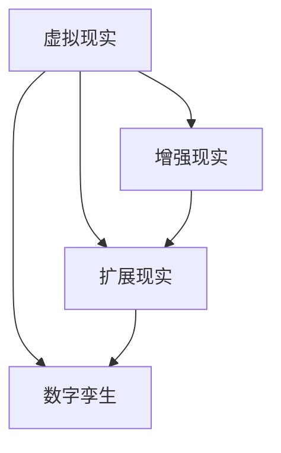
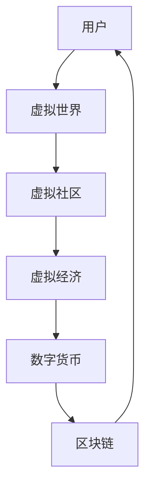

                 

在当今这个数字化的时代，虚拟现实（VR）技术正迅速崛起，成为硅谷科技领域的新宠。而元宇宙（Metaverse）作为一个集成了虚拟现实、增强现实（AR）和扩展现实（XR）的综合概念，更是将虚拟世界与现实世界无缝连接，成为了下一代互联网的蓝图。本文将探讨硅谷虚拟现实技术的发展现状、核心概念、算法原理、数学模型、实际应用以及未来展望。

## 文章关键词
- 虚拟现实
- 元宇宙
- 硅谷科技
- 算法原理
- 数学模型
- 实际应用

## 文章摘要
本文从虚拟现实技术出发，探讨了元宇宙的概念及其在硅谷科技领域的重要性。通过分析虚拟现实的核心概念、算法原理和数学模型，结合实际应用场景，本文为读者呈现了元宇宙发展的现状与未来展望，旨在为读者提供一个全面而深入的视角，了解这一科技革命的最新动态。

## 1. 背景介绍
### 1.1 虚拟现实技术的起源
虚拟现实技术可以追溯到20世纪60年代，最早的VR设备是沉浸式头戴显示器（HMD）。随着计算机图形学、传感器技术和网络技术的发展，VR技术逐渐成熟。到了21世纪，VR技术开始广泛应用于游戏、教育、医疗、军事等领域。
### 1.2 元宇宙的概念
元宇宙是一个虚拟的3D世界，通过VR/AR技术实现，用户可以在其中进行交互、社交、娱乐等活动。它不仅包含了虚拟现实，还包括了增强现实、扩展现实和数字孪生等技术。元宇宙的目标是实现现实世界与虚拟世界的无缝连接。

### 1.3 硅谷虚拟现实的发展
硅谷作为全球科技产业的中心，自然在虚拟现实和元宇宙领域有着重要的地位。Facebook（现Meta）的创始人马克·扎克伯格（Mark Zuckerberg）曾表示，元宇宙是下一个互联网，并将公司名称从Facebook改为Meta，以示对元宇宙的重视。其他硅谷巨头如谷歌、微软、苹果等也在虚拟现实领域进行了大量投资和研发。

## 2. 核心概念与联系

### 2.1 虚拟现实
虚拟现实是通过计算机生成的三维虚拟环境，用户可以通过头戴显示器、手柄等设备进行交互。关键概念包括：
- **沉浸感**：用户在虚拟环境中的感受应该尽可能地接近真实世界。
- **交互性**：用户可以通过动作、语音等方式与虚拟环境进行互动。

### 2.2 增强现实
增强现实（AR）是在现实世界中叠加虚拟信息。关键概念包括：
- **叠加**：虚拟信息与现实世界的物体叠加在一起。
- **透明性**：用户可以看到虚拟信息，同时仍然能感知到现实世界的物体。

### 2.3 扩展现实
扩展现实（XR）是虚拟现实、增强现实和混合现实的总称。关键概念包括：
- **混合**：虚拟世界与现实世界相互交织，用户可以同时感知到虚拟和现实。

### 2.4 数字孪生
数字孪生是一种通过虚拟模型模拟现实世界中物体或系统的技术。关键概念包括：
- **模拟**：通过数字孪生模型，可以模拟现实世界的物体或系统的行为。
- **优化**：数字孪生技术可以帮助优化现实世界中的物体或系统。

### 2.5 联系与融合
虚拟现实、增强现实、扩展现实和数字孪生并不是独立的技术，而是相互融合的。元宇宙正是通过这些技术的融合，实现了虚拟世界与现实世界的无缝连接。以下是一个简单的Mermaid流程图，展示了这些技术之间的联系：



### 2.6 元宇宙的概念模型
元宇宙是一个复杂的生态系统，包括多个虚拟世界、虚拟社区和虚拟经济体系。以下是一个简化的Mermaid流程图，展示了元宇宙的基本概念模型：



## 3. 核心算法原理 & 具体操作步骤

### 3.1 算法原理概述
虚拟现实和元宇宙的技术核心是算法，包括渲染算法、追踪算法、交互算法等。其中，渲染算法是最关键的一部分，它负责将计算机生成的三维模型转换为视觉上逼真的图像。

### 3.2 算法步骤详解
渲染算法的主要步骤包括：
1. **建模**：创建三维模型。
2. **贴图**：为模型添加纹理。
3. **光照计算**：模拟光线在虚拟环境中的传播。
4. **渲染**：将计算结果输出到屏幕。

### 3.3 算法优缺点
渲染算法的优点是能够生成高质量的图像，缺点是计算量巨大，对硬件性能要求较高。

### 3.4 算法应用领域
渲染算法广泛应用于游戏、电影、虚拟现实等领域。

### 3.5 跟踪与定位算法
在虚拟现实中，用户的跟踪与定位至关重要。常用的算法包括：
- **光学跟踪**：使用摄像头或激光器跟踪用户的位置。
- **惯性测量单元（IMU）**：通过加速度计和陀螺仪等传感器测量用户的运动。

### 3.6 交互算法
交互算法负责处理用户与虚拟环境的交互，包括手势识别、语音识别等。这些算法的应用使得用户能够更加自然地与虚拟世界互动。

## 4. 数学模型和公式 & 详细讲解 & 举例说明

### 4.1 数学模型构建
虚拟现实中的数学模型主要包括几何学、光学和信号处理等方面的知识。以下是一个简化的几何学模型：

$$
P = (x, y, z)
$$

其中，$P$ 表示三维空间中的点，$(x, y, z)$ 表示该点的坐标。

### 4.2 公式推导过程
在虚拟现实中，三维模型的渲染涉及到多个数学公式。以下是一个简单的透视投影公式：

$$
\begin{aligned}
x' &= \frac{x}{z} \\
y' &= \frac{y}{z} \\
\end{aligned}
$$

这里，$x'$ 和 $y'$ 是投影到屏幕上的坐标，$x$ 和 $y$ 是三维空间中的坐标，$z$ 是点到观察者的距离。

### 4.3 案例分析与讲解
假设一个用户在虚拟空间中与一个虚拟物体互动，我们需要计算用户与物体之间的距离。可以使用以下公式：

$$
d = \sqrt{(x_2 - x_1)^2 + (y_2 - y_1)^2 + (z_2 - z_1)^2}
$$

其中，$(x_1, y_1, z_1)$ 是用户的坐标，$(x_2, y_2, z_2)$ 是物体的坐标，$d$ 是用户与物体之间的距离。

### 4.4 举例说明
假设用户的位置为$(2, 3, 4)$，物体的位置为$(1, 2, 3)$，则用户与物体之间的距离为：

$$
d = \sqrt{(1 - 2)^2 + (2 - 3)^2 + (3 - 4)^2} = \sqrt{1 + 1 + 1} = \sqrt{3} \approx 1.732
$$

这意味着用户与物体之间的距离大约为1.732个单位。

## 5. 项目实践：代码实例和详细解释说明

### 5.1 开发环境搭建
为了实践虚拟现实技术，我们需要搭建一个开发环境。本文将使用Unity游戏引擎进行开发，因为Unity提供了丰富的VR功能。

1. **安装Unity**：从Unity官网下载并安装Unity Hub。
2. **创建项目**：打开Unity Hub，创建一个新的VR项目。
3. **安装插件**：在Unity编辑器中安装VR插件，如Oculus插件或Vuforia插件。

### 5.2 源代码详细实现
以下是一个简单的Unity VR项目示例，用于展示如何创建一个虚拟物体并在虚拟空间中移动。

```csharp
using UnityEngine;

public class VRController : MonoBehaviour
{
    public float speed = 5.0f;

    void Update()
    {
        float moveX = Input.GetAxis("Horizontal");
        float moveZ = Input.GetAxis("Vertical");

        transform.position += new Vector3(moveX, 0, moveZ) * speed * Time.deltaTime;
    }
}
```

### 5.3 代码解读与分析
这段代码定义了一个名为`VRController`的脚本，用于控制虚拟物体在虚拟空间中的移动。

- **速度控制**：通过`speed`变量控制移动速度。
- **输入获取**：使用`Input.GetAxis`方法获取用户的输入。
- **移动实现**：通过`transform.position`属性更新物体的位置。

### 5.4 运行结果展示
在Unity编辑器中，添加一个立方体作为虚拟物体，然后将`VRController`脚本附加到该物体。运行项目后，用户可以使用键盘上的左右箭头和上下箭头在虚拟空间中移动立方体。

## 6. 实际应用场景

### 6.1 游戏娱乐
虚拟现实技术为游戏行业带来了革命性的变化。用户可以在虚拟世界中体验更加真实的游戏，如虚拟现实射击游戏、角色扮演游戏等。

### 6.2 教育培训
虚拟现实技术可以模拟各种场景，如历史事件、科学实验等，提供更加生动和直观的教育体验。

### 6.3 医疗健康
虚拟现实技术可以用于医学培训、心理治疗、康复训练等领域，帮助医生和患者更好地理解疾病和治疗过程。

### 6.4 军事模拟
虚拟现实技术可以模拟战场环境，用于军事训练和战略规划。

## 7. 工具和资源推荐

### 7.1 学习资源推荐
- **《虚拟现实技术基础》**：一本关于虚拟现实技术的基础教材。
- **《Unity官方教程》**：Unity提供的官方教程，涵盖从基础到高级的VR开发知识。

### 7.2 开发工具推荐
- **Unity游戏引擎**：一款功能强大、易于上手的VR开发工具。
- **Oculus插件**：用于Unity的VR插件，提供丰富的VR功能。

### 7.3 相关论文推荐
- **"The Metaverse: A Vision for the Future of Social Computing"**：一篇关于元宇宙概念的论文。
- **"VR in Healthcare: Applications and Future Trends"**：一篇关于虚拟现实在医疗领域的应用和趋势的论文。

## 8. 总结：未来发展趋势与挑战

### 8.1 研究成果总结
虚拟现实和元宇宙技术已经取得了显著的进展，包括高性能渲染算法、精准的跟踪与定位技术、自然的交互方式等。

### 8.2 未来发展趋势
- **更高的沉浸感**：未来的虚拟现实技术将更加逼真，用户将难以区分虚拟世界与现实世界。
- **更广泛的应用**：虚拟现实技术将在教育、医疗、娱乐、军事等领域得到更广泛的应用。
- **更加自然的交互**：通过语音、手势等自然交互方式，用户将更加便捷地与虚拟世界互动。

### 8.3 面临的挑战
- **硬件性能**：随着虚拟现实技术的复杂度增加，对硬件性能的要求也会更高。
- **内容创作**：高质量的内容创作将是一个巨大的挑战，需要更多的人力和技术投入。
- **隐私与安全**：虚拟现实技术涉及到用户的隐私和数据安全，需要建立有效的保护措施。

### 8.4 研究展望
未来的研究将集中在如何提高虚拟现实的沉浸感、交互性和实用性，同时确保用户的安全和隐私。随着技术的不断进步，元宇宙有望成为现实世界与虚拟世界的桥梁，为人们的生活带来前所未有的改变。

### 8.5 附录：常见问题与解答
**Q：什么是元宇宙？**
A：元宇宙是一个集成了虚拟现实、增强现实、扩展现实和数字孪生等技术的虚拟世界，用户可以在其中进行各种活动。

**Q：虚拟现实技术有哪些应用领域？**
A：虚拟现实技术广泛应用于游戏、教育、医疗、军事、设计等领域。

**Q：如何开始学习虚拟现实技术？**
A：可以从学习Unity游戏引擎和相关VR插件开始，通过实践项目来提高技能。

---

作者：禅与计算机程序设计艺术 / Zen and the Art of Computer Programming


