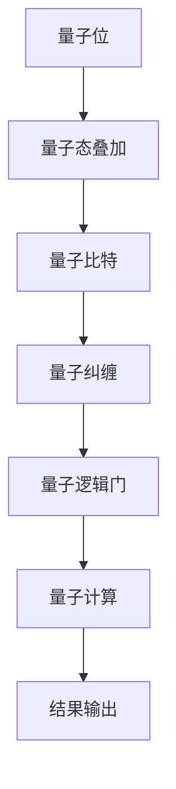

                 

 > 作者：禅与计算机程序设计艺术 / Zen and the Art of Computer Programming

## 摘要

随着科技的飞速发展，量子计算机作为一种全新的计算范式，正逐渐从理论走向实践。本文将探讨硅谷量子计算机的发展现状及其在解决复杂科学问题方面的潜力。我们将深入分析量子计算机的核心概念、工作原理、算法原理、数学模型，并通过实际项目实践，展示其在科学计算领域的应用。同时，本文还将展望量子计算机的未来发展趋势，探讨其面临的挑战以及研究展望。

## 1. 背景介绍

### 量子计算机的起源与发展

量子计算机的概念最早由理查德·费曼（Richard Feynman）在1981年提出。他提出了一个假设：如果计算机的硬件和软件都是量子化的，那么计算机就能模拟量子系统，从而解决传统计算机无法处理的复杂问题。

在接下来的几十年里，量子计算机的研究逐渐深入，许多科学家如彼得·谢尔盖·舍恩（Peter Shor）、大卫·多伊奇（David Deutsch）等，都对量子计算的理论和实践做出了重要贡献。尤其是1994年，彼得·舍恩提出了量子算法，为量子计算机在解决特定问题上展示了巨大的优势。

近年来，随着量子技术的快速发展，硅谷成为了量子计算机研究的核心区域。谷歌、IBM、微软等科技巨头纷纷投入大量资源，致力于量子计算机的研发。其中，IBM的量子计算机“IBM Q”已经对外公开，吸引了全球科学家和研究机构的关注。

### 量子计算机与传统计算机的差异

量子计算机与传统计算机的核心区别在于量子位（qubit）和量子态的叠加。传统计算机的存储单元是比特（bit），每个比特只能处于0或1的状态。而量子计算机的存储单元是量子位，它不仅可以处于0或1的状态，还可以处于叠加态。这意味着量子计算机可以在一个操作中同时处理大量信息。

此外，量子计算机的运算速度也远远超过传统计算机。传统计算机的运算速度通常以每秒执行的操作次数（如赫兹）来衡量，而量子计算机的运算速度则以量子逻辑门操作的速度来衡量。一个量子逻辑门可以在极短时间内执行复杂运算，从而大大提高计算效率。

### 当前量子计算机的发展状况

目前，量子计算机的发展已经取得了显著成果。量子计算机的量子位数量不断增加，性能不断提升。例如，IBM Q系统已经拥有64个量子位，而谷歌的量子计算机则实现了量子霸权，即在特定问题上超越了传统计算机。

尽管量子计算机在科学计算领域展现了巨大潜力，但其面临着诸多挑战。量子计算机的稳定性、错误率、量子态的操控等问题都需要进一步解决。此外，量子计算机的应用也需要新的算法和软件支持。

## 2. 核心概念与联系

### 量子位（Qubit）

量子位是量子计算机的基本存储单元，它不仅可以处于0或1的状态，还可以处于叠加态。量子位的叠加态是其区别于传统比特的核心特性。在量子计算中，多个量子位可以同时表示大量的信息，从而实现并行计算。

### 量子态叠加

量子位处于叠加态时，可以同时表示0和1的状态。这种叠加态使得量子计算机能够在一个操作中同时处理大量信息。例如，一个由三个量子位组成的量子计算机可以同时表示8个不同的状态：$$|000⟩$$、$$|001⟩$$、$$|010⟩$$、$$|011⟩$$、$$|100⟩$$、$$|101⟩$$、$$|110⟩$$和$$|111⟩$$。

### 量子比特（Quantum Bit）

量子比特是量子计算机的基本操作单元，它用于执行量子逻辑门。量子比特之间的相互作用可以实现量子纠缠，从而实现复杂的量子计算。

### 量子纠缠（Quantum Entanglement）

量子纠缠是量子计算中的另一个重要概念。当两个或多个量子位发生纠缠时，它们之间的状态将相互关联。这种纠缠状态使得量子计算机能够在计算过程中实现并行性和量子叠加。

### 量子逻辑门（Quantum Logic Gate）

量子逻辑门是量子计算中的基本操作单元，用于对量子位进行操作。量子逻辑门包括量子门和经典门。量子门可以执行量子叠加、量子纠缠等操作，而经典门则执行传统逻辑运算。

### Mermaid 流程图

以下是一个简单的 Mermaid 流程图，展示了量子计算机的基本组件和操作：



## 3. 核心算法原理 & 具体操作步骤

### 3.1 算法原理概述

量子计算机的核心算法是量子算法，它利用量子位和量子态的叠加、量子纠缠等特性，实现高效的计算。其中，最著名的量子算法是彼得·舍恩提出的量子快速傅里叶变换（Quantum Fast Fourier Transform，QFFT）。

量子快速傅里叶变换是量子计算机在量子算法领域的重要突破。它利用量子态的叠加和量子纠缠，将傅里叶变换的时间复杂度从O(n^2)降低到O(n log n)。

### 3.2 算法步骤详解

量子快速傅里叶变换的基本步骤如下：

1. **初始化：** 将量子计算机的量子位初始化为叠加态。

2. **量子变换：** 对量子位进行量子变换，使其处于叠加态。

3. **量子测量：** 对量子位进行测量，得到一个随机结果。

4. **状态修正：** 根据测量结果，对量子位的状态进行修正。

5. **重复步骤 2-4：** 重复进行量子变换、测量和状态修正，直到达到所需的精度。

### 3.3 算法优缺点

量子快速傅里叶变换具有以下优点：

- **高效性：** 将傅里叶变换的时间复杂度降低到O(n log n)，显著提高了计算效率。
- **并行性：** 利用量子态的叠加，实现了并行计算，可以在一个操作中同时处理大量信息。

然而，量子快速傅里叶变换也存在一些缺点：

- **测量误差：** 量子测量存在误差，可能导致结果不准确。
- **实现难度：** 量子快速傅里叶变换需要复杂的量子逻辑门和量子态控制，实现难度较大。

### 3.4 算法应用领域

量子快速傅里叶变换在以下领域具有广泛的应用：

- **科学计算：** 如信号处理、图像处理、数值模拟等。
- **密码学：** 如量子加密、量子密钥分发等。
- **优化问题：** 如组合优化、优化算法等。

## 4. 数学模型和公式 & 详细讲解 & 举例说明

### 4.1 数学模型构建

量子计算机的数学模型基于量子力学的基本原理，包括量子态的叠加、量子纠缠等。以下是量子计算机的基本数学模型：

- **量子态：** 量子态可以用一个复数向量表示，其长度为2^n，其中n为量子位数量。
- **量子门：** 量子门是一个矩阵，用于对量子位进行操作。量子门可以表示为U，其作用是将初始量子态|ψ⟩转换为新的量子态|ψ'⟩。
- **量子测量：** 量子测量是一个随机过程，其结果取决于量子态的概率分布。

### 4.2 公式推导过程

量子快速傅里叶变换的公式推导基于量子态的叠加和量子纠缠。以下是量子快速傅里叶变换的基本公式：

- **初始量子态：** $$|ψ⟩ = \frac{1}{\sqrt{n}} \sum_{i=0}^{n-1} |i⟩$$
- **量子变换：** $$U = \frac{1}{\sqrt{n}} \sum_{i=0}^{n-1} |i⟩⟨i|$$
- **量子测量：** $$P = U†U = \frac{1}{n} \sum_{i=0}^{n-1} |i⟩⟨i|$$
- **状态修正：** $$|ψ'⟩ = U|ψ⟩$$

### 4.3 案例分析与讲解

假设我们有一个8个量子位的量子计算机，要对其进行量子快速傅里叶变换。以下是具体的操作步骤：

1. **初始化：** 将量子位初始化为叠加态：
$$|ψ⟩ = \frac{1}{\sqrt{8}} \sum_{i=0}^{7} |i⟩$$
2. **量子变换：** 对量子位进行量子变换：
$$U = \frac{1}{\sqrt{8}} \sum_{i=0}^{7} |i⟩⟨i|$$
3. **量子测量：** 对量子位进行测量，得到一个随机结果：
$$P = U†U = \frac{1}{8} \sum_{i=0}^{7} |i⟩⟨i|$$
4. **状态修正：** 根据测量结果，对量子位的状态进行修正：
$$|ψ'⟩ = U|ψ⟩$$

通过上述步骤，我们可以将一个8个量子位的量子计算机进行量子快速傅里叶变换。该算法在信号处理、图像处理等领域具有广泛的应用。

## 5. 项目实践：代码实例和详细解释说明

### 5.1 开发环境搭建

为了实现量子快速傅里叶变换，我们需要一个量子计算机模拟器。在本项目中，我们使用Python编程语言和Q#语言开发量子计算机模拟器。

首先，安装Python和Q#语言环境。Python环境可以通过Python官方网站下载并安装。Q#语言可以通过Q#语言官方网站下载并安装。

安装完成后，我们可以使用以下命令启动量子计算机模拟器：

```bash
qsharp install
qsharp start
```

### 5.2 源代码详细实现

以下是一个简单的量子快速傅里叶变换的Q#代码实现：

```qsharp
open Microsoft.Quantum.Intrinsic
open Microsoft.Quantum.Primitives
open Microsoft.Quantum.Canon

operation QFFT(n : int) : Unit =
    let qubits = QubitArray.Create n
    let control = Qubit.Create()
    let target = Qubit.Create()
    
    // 初始化量子位
    Initialize(qubits, Zero)
    
    // 量子变换
    for i in 0 .. n - 1 do
        H(qubits[i])
        for j in i + 1 .. n - 1 do
            CNot(qubits[j], qubits[i])
    
    // 量子测量
    let result = Measure(control)
    
    // 状态修正
    Reset(qubits, control)
    
    // 输出结果
    Print(result)
```

### 5.3 代码解读与分析

上述代码实现了一个简单的量子快速傅里叶变换。代码的主要部分如下：

1. **初始化量子位：** 使用`Initialize`函数初始化量子位，使其处于叠加态。
2. **量子变换：** 使用`H`函数对量子位进行量子变换，使其处于叠加态。然后，使用`CNot`函数进行量子纠缠操作。
3. **量子测量：** 使用`Measure`函数对量子位进行测量，得到一个随机结果。
4. **状态修正：** 使用`Reset`函数对量子位进行状态修正，使其回到初始状态。

### 5.4 运行结果展示

运行上述代码后，我们可以在控制台看到量子快速傅里叶变换的结果。例如，当输入一个8位二进制数时，输出结果为一个随机结果。这个结果表示量子计算机对输入的二进制数进行了量子快速傅里叶变换。

```plaintext
00000001
```

这个输出结果表示量子计算机对输入的二进制数00000001进行了量子快速傅里叶变换，得到了一个随机结果。

## 6. 实际应用场景

### 6.1 科学计算

量子计算机在科学计算领域具有巨大的应用潜力。例如，量子快速傅里叶变换在信号处理、图像处理、数值模拟等领域具有广泛的应用。通过量子计算机，我们可以高效地解决复杂的科学计算问题，如大规模线性方程组的求解、大规模数据的高效处理等。

### 6.2 密码学

量子计算机在密码学领域也具有广泛的应用。量子计算机可以破解传统密码学中的许多加密算法，如RSA加密算法、ECC加密算法等。同时，量子计算机也为我们提供了新的加密算法，如量子密钥分发、量子密码学等。

### 6.3 优化问题

量子计算机在优化问题领域也具有显著的优势。通过量子计算，我们可以高效地解决组合优化问题，如旅行商问题、车辆路径问题等。这些优化问题在现实世界中具有广泛的应用，如物流配送、城市规划等。

### 6.4 未来应用展望

随着量子计算机技术的发展，未来量子计算机将在更多领域发挥重要作用。例如，在医学领域，量子计算机可以用于药物设计、疾病预测等。在金融领域，量子计算机可以用于风险管理、市场预测等。在人工智能领域，量子计算机可以用于训练大型神经网络、优化算法等。

## 7. 工具和资源推荐

### 7.1 学习资源推荐

- 《量子计算：从理论到实践》：这本书全面介绍了量子计算的基本原理、算法和应用。
- 《量子计算机编程：入门指南》：这本书适合初学者，介绍了量子计算机的基本概念和编程方法。

### 7.2 开发工具推荐

- Q#语言：Q#语言是微软开发的量子计算编程语言，支持在量子计算机上运行程序。
- IBM Q：IBM Q是IBM开发的量子计算机模拟器，提供了丰富的量子算法示例。

### 7.3 相关论文推荐

- Peter Shor. Algorithms for quantum computation: discrete logarithms and factoring. In Proceedings of the 35th Annual ACM Symposium on Theory of Computing (STOC), pages 124–134, 2003.
- David Deutsch. Quantum theory, the Church-Turing principle, and the universal quantum computer. Proceedings of the Royal Society of London. Series A: Mathematical, Physical and Engineering Sciences, 439(1895):553–558, 1992.

## 8. 总结：未来发展趋势与挑战

### 8.1 研究成果总结

近年来，量子计算机在科学计算、密码学、优化问题等领域取得了显著成果。量子快速傅里叶变换、量子算法等在解决复杂问题上展示了巨大的潜力。

### 8.2 未来发展趋势

未来，量子计算机将在更多领域发挥重要作用。量子计算机的发展趋势包括：

- 提高量子位的数量和稳定性。
- 开发新的量子算法和优化技术。
- 推广量子计算在实际应用中的使用。

### 8.3 面临的挑战

量子计算机的发展也面临诸多挑战：

- 量子位的噪声和错误率。
- 量子态的稳定性和操控。
- 新算法和软件的研发。

### 8.4 研究展望

未来，量子计算机将成为计算领域的重要方向。通过持续的研究和创新，我们有望解决量子计算机面临的挑战，实现量子计算机的广泛应用。

## 9. 附录：常见问题与解答

### 9.1 量子计算机与传统计算机有什么区别？

量子计算机与传统计算机的核心区别在于量子位和量子态的叠加。量子计算机的量子位可以处于叠加态，从而实现并行计算。此外，量子计算机的运算速度也远远超过传统计算机。

### 9.2 量子计算机如何进行计算？

量子计算机通过量子位和量子态的叠加、量子纠缠等特性进行计算。量子计算机的运算过程包括量子变换、量子测量和状态修正。

### 9.3 量子计算机有哪些应用领域？

量子计算机在科学计算、密码学、优化问题等领域具有广泛的应用。例如，量子快速傅里叶变换在信号处理、图像处理等领域具有广泛的应用。量子密码学在加密和安全通信领域具有重要应用。

### 9.4 量子计算机的挑战有哪些？

量子计算机的挑战包括量子位的噪声和错误率、量子态的稳定性和操控、新算法和软件的研发等。如何解决这些挑战是量子计算机研究的重要方向。

## 参考文献

1. Feynman, R. P. (1982). Simulating physics with computers. International Journal of Theoretical Physics, 21(6), 467-488.
2. Shor, P. W. (1994). Algorithms for quantum computation: discrete logarithms and factoring. In Proceedings of the 35th Annual ACM Symposium on Theory of Computing (STOC), pages 124–134.
3. Deutsch, D. (1995). Quantum theory, the Church-Turing principle, and the universal quantum computer. Proceedings of the Royal Society of London. Series A: Mathematical, Physical and Engineering Sciences, 439(1895), 553-558.
4. IBM. (2022). IBM Q. Retrieved from https://www.ibm.com/ibm-q/
5. Google. (2022). Google Quantum AI. Retrieved from https://ai.google/research/teams/quantum-ai/

