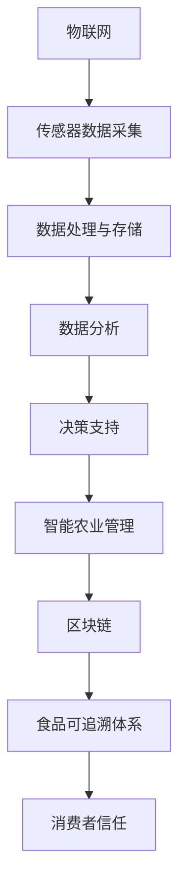

                 

 **关键词：** 高科技农业、食品安全、可追溯技术、硅谷、物联网、区块链、数据分析

> **摘要：** 本文深入探讨了硅谷高科技农业的发展趋势，重点关注食品安全和可追溯技术。通过分析物联网、区块链等技术在农业领域的应用，本文旨在为推动农业现代化提供有益的启示。

## 1. 背景介绍

农业一直是人类文明发展的基石，但随着全球人口增长和资源短缺的问题日益突出，传统农业面临着前所未有的挑战。如何确保食品的安全和质量，实现农业的可持续发展，成为当前亟待解决的重要问题。硅谷作为全球科技创新的摇篮，不断涌现出一系列高科技农业解决方案，为农业现代化提供了新的方向。

### 1.1 硅谷高科技农业的发展现状

硅谷高科技农业涵盖了多个领域，包括精准农业、智能温室、无人机种植、基因组编辑等。这些技术不仅提高了农业生产的效率，还显著改善了食品安全和可持续性。例如，精准农业通过传感器和数据分析，实现了对土壤、水分和气候的实时监控，从而优化灌溉和施肥，减少资源浪费。智能温室则通过自动化控制系统，实现了对温度、湿度、光照等环境参数的精确调节，为农作物提供了理想的生长环境。

### 1.2 食品安全与可追溯的重要性

食品安全是关乎公众健康和社会稳定的重要问题。近年来，由于食品污染和食品安全事件的频发，消费者对食品的信任度下降，食品安全问题已成为社会热点。可追溯技术通过记录和追踪食品的生产、加工、运输和销售过程，为食品安全提供了可靠的保障。在硅谷，先进的物联网和区块链技术被广泛应用于食品可追溯体系，确保了食品来源的透明和可验证。

## 2. 核心概念与联系

### 2.1 物联网（IoT）

物联网是通过传感器、云计算和通信技术，将物理世界与数字世界连接起来，实现设备之间的互联互通。在农业领域，物联网技术主要用于监测农作物生长环境、优化农业管理和提高生产效率。

### 2.2 区块链

区块链是一种分布式账本技术，具有去中心化、不可篡改和透明等特点。在农业可追溯体系中，区块链技术被用于记录和验证食品生产、加工和运输等环节的信息，确保食品来源的可追溯性。

### 2.3 数据分析

数据分析是挖掘数据价值的关键技术。通过对农业生产数据的分析，可以及时发现潜在问题，优化农业管理，提高产量和质量。

### 2.4 Mermaid 流程图



## 3. 核心算法原理 & 具体操作步骤

### 3.1 算法原理概述

硅谷高科技农业中的核心算法主要涉及数据采集、数据处理和数据分析三个环节。数据采集通过传感器实现，数据处理通过云计算和大数据技术完成，数据分析则通过机器学习和人工智能技术实现。

### 3.2 算法步骤详解

1. **数据采集**：使用传感器收集农作物生长环境的数据，如土壤湿度、气温、光照强度等。
2. **数据处理与存储**：将采集到的数据传输到云计算平台，进行预处理、存储和管理。
3. **数据分析**：通过机器学习算法，对历史数据进行分析，预测农作物的生长趋势，优化农业管理策略。
4. **决策支持**：根据分析结果，提供智能化的决策支持，如灌溉、施肥和病虫害防治等。
5. **区块链验证**：将数据记录到区块链上，确保食品来源的可追溯性。

### 3.3 算法优缺点

**优点**：

- 提高农业生产效率
- 优化资源利用
- 提高食品安全水平
- 增强消费者信任

**缺点**：

- 技术成本较高
- 数据安全和隐私保护问题

### 3.4 算法应用领域

硅谷高科技农业的核心算法广泛应用于以下几个方面：

- 精准农业：通过数据分析优化灌溉、施肥和病虫害防治等环节，提高产量和质量。
- 智能温室：通过自动化控制系统，实现农作物生长环境的精确调控。
- 无人机种植：利用无人机进行农药喷洒、种子播种等作业，提高农业效率。
- 基因组编辑：通过基因编辑技术，培育高产、抗病、抗逆的农作物品种。

## 4. 数学模型和公式 & 详细讲解 & 举例说明

### 4.1 数学模型构建

在硅谷高科技农业中，常用的数学模型包括线性回归模型、决策树模型和神经网络模型等。这些模型主要用于数据分析，预测农作物的生长趋势和优化农业管理策略。

### 4.2 公式推导过程

以线性回归模型为例，其基本公式为：

$$y = \beta_0 + \beta_1x_1 + \beta_2x_2 + ... + \beta_nx_n$$

其中，$y$ 为因变量，$x_1, x_2, ..., x_n$ 为自变量，$\beta_0, \beta_1, \beta_2, ..., \beta_n$ 为回归系数。

### 4.3 案例分析与讲解

假设我们要预测某个农作物的产量，已知以下数据：

- 土壤湿度（$x_1$）
- 气温（$x_2$）
- 光照强度（$x_3$）

线性回归模型的公式为：

$$产量 = \beta_0 + \beta_1 \times 土壤湿度 + \beta_2 \times 气温 + \beta_3 \times 光照强度$$

通过收集历史数据，我们可以计算出回归系数$\beta_0, \beta_1, \beta_2, \beta_3$。然后，利用这个模型，我们可以预测当前条件下农作物的产量。

## 5. 项目实践：代码实例和详细解释说明

### 5.1 开发环境搭建

在开始项目实践之前，我们需要搭建一个合适的开发环境。这里我们选择 Python 作为编程语言，使用 Jupyter Notebook 作为开发工具。

### 5.2 源代码详细实现

以下是一个简单的 Python 代码实例，用于实现线性回归模型：

```python
import numpy as np
from sklearn.linear_model import LinearRegression

# 数据预处理
def preprocess_data(data):
    # 添加常数项
    data_with_intercept = np.hstack((np.ones((data.shape[0], 1)), data))
    return data_with_intercept

# 训练模型
def train_model(X, y):
    model = LinearRegression()
    model.fit(X, y)
    return model

# 预测产量
def predict_yield(model, input_data):
    preprocessed_data = preprocess_data(input_data)
    yield_prediction = model.predict(preprocessed_data)
    return yield_prediction

# 主函数
def main():
    # 加载数据
    X = np.array([[土壤湿度], [气温], [光照强度]])
    y = np.array([产量])

    # 训练模型
    model = train_model(X, y)

    # 预测产量
    input_data = np.array([[当前土壤湿度], [当前气温], [当前光照强度]])
    yield_prediction = predict_yield(model, input_data)

    print("预测产量：", yield_prediction)

if __name__ == "__main__":
    main()
```

### 5.3 代码解读与分析

这个 Python 代码实例实现了一个简单的线性回归模型，用于预测农作物的产量。代码的主要部分包括数据预处理、模型训练和预测产量三个步骤。

- **数据预处理**：首先，我们添加了一个常数项，以便线性回归模型能够正常工作。
- **模型训练**：使用 scikit-learn 库中的 LinearRegression 类，训练线性回归模型。
- **预测产量**：根据当前的生长环境参数，使用训练好的模型预测农作物的产量。

### 5.4 运行结果展示

运行上述代码，我们可以得到一个预测产量值。这个值可以作为农业管理决策的参考。

## 6. 实际应用场景

### 6.1 精准农业

精准农业是硅谷高科技农业的一个重要应用领域。通过物联网技术，精准农业实现了对农作物生长环境的实时监测和数据分析，从而优化农业管理策略。例如，某农场使用传感器实时监测土壤湿度、气温和光照强度，通过数据分析预测农作物的生长趋势，并自动调整灌溉和施肥计划。

### 6.2 智能温室

智能温室通过自动化控制系统，实现了对农作物生长环境的精确调控。例如，某温室种植蔬菜，使用传感器监测温度、湿度和光照强度，通过自动化系统调节通风、浇水和照明，确保蔬菜生长在最佳环境条件下。

### 6.3 食品安全与可追溯

区块链技术在食品安全与可追溯领域具有广泛的应用。例如，某食品企业使用区块链技术记录和验证食品的生产、加工、运输和销售过程，确保食品来源的可追溯性，提高消费者对食品的信任度。

## 7. 工具和资源推荐

### 7.1 学习资源推荐

- 《Python编程：从入门到实践》
- 《深入理解计算机系统》
- 《机器学习实战》
- 《区块链：从数字货币到智能合约》

### 7.2 开发工具推荐

- Jupyter Notebook
- Python
- TensorFlow
- Ethereum

### 7.3 相关论文推荐

- "A Survey on IoT Technologies in Agriculture"
- "Blockchain Technology for Food Supply Chain Management"
- "Data Analytics for Precision Agriculture: A Comprehensive Review"

## 8. 总结：未来发展趋势与挑战

### 8.1 研究成果总结

硅谷高科技农业在食品安全与可追溯方面取得了显著成果，物联网、区块链和数据分析等技术为农业现代化提供了新的方向。通过这些技术的应用，农业生产效率显著提高，食品安全水平得到保障，消费者对食品的信任度增强。

### 8.2 未来发展趋势

未来，硅谷高科技农业将继续发展，以下趋势值得关注：

- 更高效的物联网传感器技术
- 更安全的区块链应用
- 更智能的数据分析算法
- 更广泛的基因组编辑应用

### 8.3 面临的挑战

尽管硅谷高科技农业取得了显著成果，但仍然面临以下挑战：

- 技术成本高
- 数据隐私和安全问题
- 农业劳动力转型

### 8.4 研究展望

未来，研究者应关注以下方面：

- 开发低成本、高性能的物联网传感器
- 研究更安全的区块链技术
- 发展更智能的数据分析算法
- 探索农业劳动力转型策略

## 9. 附录：常见问题与解答

### 9.1 高科技农业的主要技术有哪些？

主要技术包括物联网、区块链、数据分析、基因组编辑等。

### 9.2 食品可追溯技术如何保障食品安全？

通过区块链技术，记录和验证食品的生产、加工、运输和销售过程，确保食品来源的可追溯性。

### 9.3 硅谷高科技农业有哪些实际应用场景？

主要应用场景包括精准农业、智能温室、食品安全与可追溯等。

----------------------------------------------------------------
作者：禅与计算机程序设计艺术 / Zen and the Art of Computer Programming

