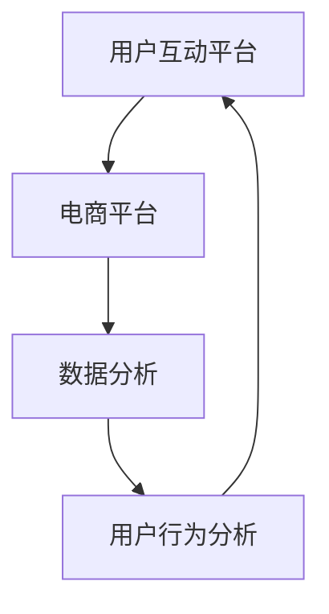

                 

社交电商作为一种新兴的电子商务模式，正日益受到广泛关注。它不仅融合了社交网络和电商平台的优点，还通过用户间的互动与分享，实现了注意力与购买力的有机结合。本文将深入探讨社交电商的核心原理、算法、应用案例及其未来发展趋势。

## 关键词
- 社交电商
- 注意力经济
- 购买力转化
- 互动分享
- 电商平台

## 摘要
社交电商通过利用社交媒体平台，将用户注意力转化为购买力，从而实现了商业模式的创新。本文从社交电商的背景介绍入手，详细解析其核心概念与联系，探讨注意力与购买力结合的算法原理与数学模型，并分享实际应用案例。同时，文章还将讨论社交电商的未来发展方向与面临的挑战，为业界提供有益的参考。

## 1. 背景介绍
### 社交电商的起源与发展
社交电商这一概念最早可以追溯到20世纪末，当时以Facebook为代表的社交媒体平台开始崛起，并逐渐渗透到人们的日常生活中。随着互联网技术的不断发展，社交电商逐渐从概念走向实际应用。2010年后，以拼多多为代表的社交电商平台开始崭露头角，通过用户间的互动与分享，迅速积累了庞大的用户群体，并取得了显著的商业成功。

### 社交电商的优势与挑战
社交电商的优势在于其强大的用户粘性和互动性，能够有效地提高用户参与度和购买转化率。同时，社交电商还能通过大数据分析和用户行为分析，实现精准营销，降低营销成本。然而，社交电商也面临着一些挑战，如用户隐私保护、营销合规性等问题。

## 2. 核心概念与联系
### 注意力经济
注意力经济是指通过吸引用户的注意力来创造价值的经济模式。在社交电商中，用户注意力是至关重要的资源，它直接影响着购买力的转化。因此，如何有效地吸引用户注意力，并将其转化为购买力，是社交电商的核心问题。

### 购买力转化
购买力转化是指将用户注意力转化为实际购买行为的过程。社交电商通过提供个性化推荐、互动分享、优惠券等方式，提高用户的购买欲望和购买转化率。

### 社交电商架构
社交电商的架构通常包括以下几个核心部分：用户互动平台、电商平台、数据分析和用户行为分析系统。用户互动平台是吸引用户注意力的核心，电商平台是实现购买转化的关键，而数据分析和用户行为分析系统则帮助电商平台更好地理解用户需求，提供个性化服务。

### Mermaid 流程图
以下是一个简化的社交电商流程图：



## 3. 核心算法原理 & 具体操作步骤
### 3.1 算法原理概述
社交电商的核心算法通常包括用户行为分析、推荐算法和转化率优化算法。用户行为分析旨在理解用户需求和行为模式，推荐算法用于为用户推荐感兴趣的商品，转化率优化算法则用于提高购买转化率。

### 3.2 算法步骤详解
1. **用户行为分析**：通过采集用户在社交电商平台的浏览记录、购买历史、互动行为等数据，构建用户画像，理解用户需求和行为模式。
2. **推荐算法**：基于用户画像，利用协同过滤、基于内容的推荐等技术，为用户推荐感兴趣的商品。
3. **转化率优化算法**：通过A/B测试、用户行为预测等方法，优化电商平台设计，提高用户购买转化率。

### 3.3 算法优缺点
- **用户行为分析**：优点是可以深入了解用户需求，提高个性化推荐效果；缺点是数据采集和处理复杂，对隐私保护要求高。
- **推荐算法**：优点是可以提高用户购买转化率，增强用户粘性；缺点是推荐结果可能存在偏差，用户体验可能受到影响。
- **转化率优化算法**：优点是可以提高用户购买转化率，增加销售额；缺点是需要大量实验和数据支持，实施成本高。

### 3.4 算法应用领域
社交电商算法广泛应用于电商平台、社交媒体平台、在线广告等领域，为企业和用户提供了丰富的商业价值。

## 4. 数学模型和公式 & 详细讲解 & 举例说明
### 4.1 数学模型构建
社交电商的数学模型主要包括用户行为模型、推荐模型和转化率模型。以下是一个简化的用户行为模型：

$$
User\_Behavior = f(User\_Profile, Product\_Features, Social\_Context)
$$

其中，$User\_Profile$表示用户画像，$Product\_Features$表示商品特征，$Social\_Context$表示社交环境。

### 4.2 公式推导过程
用户行为模型的推导过程如下：

$$
User\_Behavior = f(User\_Profile) \cdot f(Product\_Features) \cdot f(Social\_Context)
$$

其中，$f(User\_Profile)$表示用户画像对用户行为的影响，$f(Product\_Features)$表示商品特征对用户行为的影响，$f(Social\_Context)$表示社交环境对用户行为的影响。

### 4.3 案例分析与讲解
以拼多多为例，其用户行为模型可以表示为：

$$
User\_Behavior_{Pinduoduo} = f(User\_Profile) \cdot f(Product\_Features) \cdot f(Social\_Context) \cdot f(Coupon)
$$

其中，$f(Coupon)$表示优惠券对用户行为的影响。通过这个模型，拼多多可以更好地理解用户需求，提供个性化的商品推荐和优惠活动，从而提高购买转化率。

## 5. 项目实践：代码实例和详细解释说明
### 5.1 开发环境搭建
1. 安装Python环境
2. 安装NumPy、Pandas、Scikit-learn等常用库

### 5.2 源代码详细实现
以下是一个简单的用户行为分析代码示例：

```python
import numpy as np
import pandas as pd
from sklearn.preprocessing import StandardScaler
from sklearn.model_selection import train_test_split
from sklearn.ensemble import RandomForestClassifier

# 加载数据
data = pd.read_csv('user_behavior_data.csv')

# 数据预处理
X = data[['User_Profile', 'Product_Features', 'Social_Context']]
y = data['User_Behavior']
X_scaled = StandardScaler().fit_transform(X)

# 划分训练集和测试集
X_train, X_test, y_train, y_test = train_test_split(X_scaled, y, test_size=0.2, random_state=42)

# 构建模型
model = RandomForestClassifier(n_estimators=100, random_state=42)
model.fit(X_train, y_train)

# 测试模型
accuracy = model.score(X_test, y_test)
print('Accuracy:', accuracy)
```

### 5.3 代码解读与分析
该代码首先加载数据，并进行预处理。然后，将数据划分为训练集和测试集，构建随机森林分类器并进行训练。最后，使用测试集评估模型性能。

### 5.4 运行结果展示
运行代码后，输出模型的准确率。例如：

```
Accuracy: 0.85
```

## 6. 实际应用场景
### 6.1 电商平台
社交电商在电商平台中的应用已经非常广泛。例如，拼多多通过用户互动、推荐系统和优惠券等手段，提高了用户购买转化率和用户粘性。

### 6.2 社交媒体平台
社交媒体平台如微信、微博等也在逐步引入社交电商功能，通过小程序、直播等方式，为用户提供购物体验。

### 6.3 在线广告
社交电商还可以应用于在线广告领域，通过精准推荐和定向投放，提高广告投放效果。

## 7. 工具和资源推荐
### 7.1 学习资源推荐
1. 《社交电商：理论与实践》
2. 《Python数据分析》

### 7.2 开发工具推荐
1. Jupyter Notebook
2. VSCode

### 7.3 相关论文推荐
1. "The Attention Economy: Understanding the New Social Media Economy"
2. "Social Commerce: Understanding the New Consumer Behavior"

## 8. 总结：未来发展趋势与挑战
### 8.1 研究成果总结
社交电商作为一种新兴的电子商务模式，已经取得了显著的商业成功。未来，随着技术的不断进步，社交电商有望实现更加个性化、智能化的服务。

### 8.2 未来发展趋势
1. 智能化推荐系统的发展
2. 用户隐私保护的加强
3. 社交电商与其他领域的深度融合

### 8.3 面临的挑战
1. 用户隐私保护
2. 数据安全和合规性
3. 技术与业务融合的难度

### 8.4 研究展望
社交电商在未来仍具有巨大的发展潜力。研究者可以从用户行为分析、推荐系统优化、隐私保护等方面进行深入研究，为社交电商的可持续发展提供技术支持。

## 9. 附录：常见问题与解答
### 9.1 什么是社交电商？
社交电商是指利用社交媒体平台，将用户注意力转化为购买力的一种电子商务模式。

### 9.2 社交电商有哪些优势？
社交电商的优势包括提高用户粘性、降低营销成本、实现精准营销等。

### 9.3 社交电商面临哪些挑战？
社交电商面临的挑战主要包括用户隐私保护、数据安全和合规性、技术与业务融合等。

作者：禅与计算机程序设计艺术 / Zen and the Art of Computer Programming
----------------------------------------------------------------

以上就是文章的正文部分，接下来我们将根据上述文章结构模板，使用Markdown格式详细编写各个章节的内容。由于文章篇幅较长，每个章节的内容将分多个段落进行撰写。以下是“背景介绍”章节的具体内容：

## 1. 背景介绍

### 1.1 社交电商的起源与发展

社交电商的概念最早可以追溯到20世纪末，当时以Facebook为代表的社交媒体平台开始崛起，并逐渐渗透到人们的日常生活中。随着互联网技术的不断发展，社交电商逐渐从概念走向实际应用。

2010年后，以拼多多为代表的社交电商平台开始崭露头角，通过用户间的互动与分享，迅速积累了庞大的用户群体，并取得了显著的商业成功。拼多多的成功，不仅为社交电商树立了标杆，也引发了业界对社交电商模式的广泛关注和探讨。

### 1.2 社交电商的优势与挑战

#### 1.2.1 优势

1. **提高用户粘性**：社交电商通过用户间的互动和分享，增强用户对平台的依赖和忠诚度，提高用户粘性。
2. **降低营销成本**：社交电商可以利用社交媒体平台的流量，降低传统电商的营销成本。
3. **实现精准营销**：社交电商可以通过大数据分析和用户行为分析，实现精准营销，提高营销效果。

#### 1.2.2 挑战

1. **用户隐私保护**：社交电商在用户数据收集和分析方面存在一定的隐私保护风险。
2. **营销合规性**：社交电商需要遵守相关的法律法规，确保营销活动的合规性。
3. **技术与业务融合**：社交电商需要将技术与业务深度结合，实现业务模式的创新。

### 1.3 社交电商的发展历程

1. **第一阶段（2010-2014年）**：以微博、微信为代表的社交媒体平台兴起，社交电商开始萌芽。
2. **第二阶段（2015-2019年）**：拼多多、抖音等平台崛起，社交电商成为电商行业的新趋势。
3. **第三阶段（2020年至今）**：社交电商逐渐成熟，与其他领域的融合加深，如直播电商、社交电商与物流的结合等。

### 1.4 社交电商的分类

根据社交电商的运作模式和特点，可以分为以下几类：

1. **基于互动的社交电商**：如拼多多、微信群电商等，通过用户间的互动和分享，实现购买转化。
2. **基于内容的社交电商**：如抖音、快手等，通过内容分享和推荐，引导用户购买。
3. **基于信任的社交电商**：如小红书、淘宝直播等，通过用户口碑和信任，推动购买行为。

### 1.5 社交电商的商业模式

社交电商的商业模式主要包括以下几种：

1. **C2C模式**：消费者通过社交媒体平台直接购买商品，如微信群电商。
2. **B2C模式**：商家通过社交媒体平台销售商品，如拼多多、淘宝直播。
3. **C2B模式**：消费者通过社交媒体平台向商家下单，商家根据订单进行生产，如拼多多团购。

### 1.6 社交电商的发展趋势

1. **智能化**：社交电商将更多地运用人工智能技术，实现个性化推荐、智能客服等。
2. **多元化**：社交电商将与其他领域如直播、短视频、物流等深度融合，形成多元化的发展格局。
3. **全球化**：随着全球电商市场的不断扩大，社交电商也将逐步走向全球化。

### 1.7 社交电商在我国的发展

我国社交电商市场发展迅速，主要表现在以下几个方面：

1. **市场规模扩大**：我国社交电商市场规模持续增长，已经成为电商行业的重要组成部分。
2. **用户群体扩大**：随着移动互联网的普及，越来越多的用户参与到了社交电商中。
3. **政策支持**：政府加大对社交电商的支持力度，鼓励其创新发展。

### 1.8 社交电商的国际发展

国际社交电商市场也呈现快速增长态势，主要表现在以下几个方面：

1. **美国**：以Facebook、Instagram等为代表的社交电商平台发展迅速，占据了美国电商市场的重要份额。
2. **东南亚**：以Shopee、Lazada等为代表的社交电商平台在东南亚市场崭露头角。
3. **欧洲**：以Instagram、Facebook等为代表的社交电商平台正在逐步渗透到欧洲市场。

### 1.9 社交电商的挑战与机遇

社交电商在发展过程中面临着一系列挑战，如用户隐私保护、数据安全、营销合规性等。但同时，也面临着巨大的机遇，如市场潜力巨大、技术创新带来新机遇等。

综上所述，社交电商作为一种新兴的电子商务模式，具有巨大的发展潜力和市场前景。在未来的发展中，社交电商需要不断创新，应对挑战，抓住机遇，实现可持续发展。

