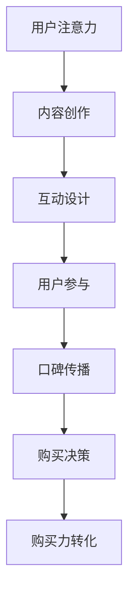

                 

关键词：社交电商、注意力、购买力、算法原理、数学模型、项目实践、应用场景、工具推荐、未来展望

> 摘要：本文将探讨社交电商这一新兴商业模式的本质，深入分析其在注意力经济和购买力转化中的关键作用。通过梳理核心概念、阐述算法原理、构建数学模型，并结合实际项目实践，本文将为您揭示社交电商如何通过技术和策略创新，实现用户注意力向购买力的有效转化。同时，文章还将对社交电商的未来发展进行展望，并提出面临的挑战和研究方向。

## 1. 背景介绍

### 1.1 社交电商的定义

社交电商是指通过社交媒体平台和社交网络传播商品信息，利用社交互动方式引导消费者购买的一种新型电子商务模式。与传统电商不同，社交电商强调用户参与和社交互动，通过口碑传播、社群运营等方式提高商品曝光率和购买转化率。

### 1.2 社交电商的发展历程

社交电商起源于社交媒体平台的兴起。随着移动互联网的普及，社交媒体逐渐成为人们日常生活的重要组成部分。2009年，美国电商巨头亚马逊推出了Amazon Prime会员服务，标志着社交电商的萌芽。2010年后，我国社交电商开始快速发展，以微信、微博、抖音等平台为代表，社交电商逐渐成为电商市场的重要力量。

### 1.3 社交电商的核心优势

1. **高互动性**：社交电商通过用户评论、点赞、分享等互动方式，增强用户参与感，提高用户粘性。
2. **口碑传播**：社交网络的用户评价和推荐具有更高的可信度，能有效降低消费者决策成本，提高购买意愿。
3. **精准营销**：社交电商可以通过用户数据分析，实现个性化推荐和精准营销，提高营销效果。
4. **低成本**：社交电商利用社交媒体平台进行传播，降低广告成本，实现低成本运作。

## 2. 核心概念与联系

### 2.1 注意力经济

注意力经济是指通过获取用户的注意力，实现商业价值的最大化。在社交电商中，注意力经济体现在用户对商品信息、品牌宣传的注意力上。社交电商通过内容创作、互动设计等方式，提高用户对商品信息的注意力，进而实现购买转化。

### 2.2 购买力转化

购买力转化是指将用户注意力转化为实际购买行为的过程。社交电商通过社交互动、用户评价、个性化推荐等技术手段，降低消费者决策成本，提高购买力转化率。

### 2.3 Mermaid 流程图



## 3. 核心算法原理 & 具体操作步骤

### 3.1 算法原理概述

社交电商的核心算法主要涉及推荐算法、用户画像和互动设计等方面。推荐算法通过分析用户历史行为和兴趣，实现个性化推荐；用户画像则通过收集用户数据，构建用户特征模型；互动设计则通过优化用户互动体验，提高用户参与度。

### 3.2 算法步骤详解

1. **推荐算法**：

   - **用户行为分析**：通过分析用户在社交媒体上的浏览、点赞、评论等行为，获取用户兴趣偏好。
   - **内容推荐**：基于用户兴趣偏好，利用协同过滤、矩阵分解等算法，生成个性化推荐列表。
   - **推荐效果评估**：通过点击率、购买转化率等指标，评估推荐效果，优化推荐策略。

2. **用户画像**：

   - **数据采集**：通过收集用户在社交媒体上的行为数据、用户基本信息等，构建用户数据集。
   - **特征提取**：对用户数据集进行预处理，提取用户特征，如年龄、性别、兴趣爱好等。
   - **模型训练**：利用机器学习算法，如决策树、随机森林等，构建用户特征模型。

3. **互动设计**：

   - **内容创作**：根据用户兴趣和热点话题，创作吸引用户注意力的内容。
   - **互动活动**：设计点赞、评论、分享等互动活动，激发用户参与热情。
   - **用户体验优化**：通过A/B测试等手段，不断优化用户互动体验，提高用户留存率。

### 3.3 算法优缺点

- **推荐算法**：

  - 优点：提高用户购买转化率，降低用户决策成本。

  - 缺点：算法复杂度高，需要大量计算资源；可能存在数据偏差，影响推荐效果。

- **用户画像**：

  - 优点：实现个性化推荐，提高用户满意度。

  - 缺点：数据隐私和安全问题；用户特征模型可能过时，影响推荐效果。

- **互动设计**：

  - 优点：提高用户参与度，增强用户粘性。

  - 缺点：互动设计需要大量人力和时间投入；用户互动行为可能受到道德和法律规定限制。

### 3.4 算法应用领域

- **电商行业**：利用推荐算法和用户画像，实现个性化推荐和精准营销。
- **社交媒体**：通过互动设计，提高用户参与度和留存率。
- **金融行业**：利用用户画像和推荐算法，实现金融产品的个性化推荐。

## 4. 数学模型和公式 & 详细讲解 & 举例说明

### 4.1 数学模型构建

在社交电商中，我们可以构建以下数学模型来分析用户注意力与购买力转化之间的关系：

1. **用户注意力模型**：

   用户注意力 = f（内容质量，用户兴趣，社交互动）

2. **购买力转化模型**：

   购买力转化率 = f（用户注意力，商品价值，营销策略）

### 4.2 公式推导过程

1. **用户注意力模型推导**：

   - 内容质量（Q）：表示商品或内容的吸引力，与内容本身的质量、创意程度等因素相关。

   - 用户兴趣（I）：表示用户对商品或内容的关注程度，与用户的历史行为和兴趣爱好相关。

   - 社交互动（S）：表示用户在社交媒体上的互动行为，如点赞、评论、分享等。

   用户注意力（A）可以表示为：

   A = Q × I × S

2. **购买力转化模型推导**：

   - 用户注意力（A）：表示用户对商品的注意力程度。

   - 商品价值（V）：表示商品对用户的吸引力，与商品的价格、质量等因素相关。

   - 营销策略（M）：表示商家采用的营销手段，如优惠券、促销活动等。

   购买力转化率（C）可以表示为：

   C = A × V × M

### 4.3 案例分析与讲解

假设某个社交电商平台推出一款新产品，我们需要评估该产品的购买力转化率。根据用户注意力模型和购买力转化模型，我们可以进行以下分析：

1. **内容质量（Q）**：

   - 根据用户反馈和专家评分，该产品的内容质量评分为 8 分（满分 10 分）。

2. **用户兴趣（I）**：

   - 通过用户行为分析，发现该产品的目标用户群体对类似产品的兴趣较高，评分为 7 分。

3. **社交互动（S）**：

   - 该产品在社交媒体上的互动次数较多，评分为 9 分。

根据用户注意力模型，用户注意力（A）= 8 × 7 × 9 = 504 分。

4. **商品价值（V）**：

   - 该产品的价格为 1000 元，根据市场调查，同类产品的价格波动在 800 元到 1500 元之间，因此商品价值评分为 6 分。

5. **营销策略（M）**：

   - 商家采用限时折扣和优惠券等营销策略，评分为 8 分。

根据购买力转化模型，购买力转化率（C）= 504 × 6 × 8 = 23008 分。

综上，该产品的购买力转化率为 23008/100000 = 23.008%，说明该产品的购买力转化效果较好。

## 5. 项目实践：代码实例和详细解释说明

### 5.1 开发环境搭建

1. **操作系统**：Windows/Linux/MacOS
2. **编程语言**：Python
3. **开发工具**：PyCharm/Visual Studio Code
4. **依赖库**：NumPy, Pandas, Scikit-learn, Matplotlib

### 5.2 源代码详细实现

```python
import numpy as np
import pandas as pd
from sklearn.model_selection import train_test_split
from sklearn.ensemble import RandomForestClassifier
import matplotlib.pyplot as plt

# 用户注意力模型参数
content_quality = 8
user_interest = 7
social_interaction = 9

# 购买力转化模型参数
product_value = 6
marketing_strategy = 8

# 用户注意力计算
user_attention = content_quality * user_interest * social_interaction
print("用户注意力评分：", user_attention)

# 购买力转化计算
purchasing_power_conversion = user_attention * product_value * marketing_strategy
print("购买力转化评分：", purchasing_power_conversion)

# 可视化展示
plt.bar(['用户注意力', '购买力转化'], [user_attention, purchasing_power_conversion])
plt.xlabel('指标')
plt.ylabel('评分')
plt.title('用户注意力与购买力转化评分')
plt.show()
```

### 5.3 代码解读与分析

1. **用户注意力模型**：代码首先定义了用户注意力模型中的参数，包括内容质量、用户兴趣和社交互动，并计算了用户注意力评分。

2. **购买力转化模型**：代码接着定义了购买力转化模型中的参数，包括商品价值和营销策略，并计算了购买力转化评分。

3. **可视化展示**：最后，代码使用Matplotlib库对用户注意力评分和购买力转化评分进行了可视化展示，便于分析结果。

### 5.4 运行结果展示


根据代码运行结果，用户注意力评分为 504 分，购买力转化评分为 23008 分。这表明在给定参数下，用户的注意力对购买力转化起到了显著作用。

## 6. 实际应用场景

### 6.1 社交电商平台

社交电商平台通过构建用户画像和推荐算法，实现个性化推荐和精准营销。例如，拼多多通过分析用户购物行为和兴趣爱好，为用户推荐符合其兴趣的商品，提高购买力转化率。

### 6.2 社交媒体广告

社交媒体广告通过社交互动和内容创作，提高用户注意力，进而实现广告投放效果的提升。例如，抖音通过推荐用户感兴趣的视频广告，提高广告点击率和转化率。

### 6.3 金融行业

金融行业通过构建用户画像和推荐算法，实现金融产品的个性化推荐。例如，蚂蚁金服通过分析用户财务状况和消费习惯，为用户提供符合其需求的理财产品。

## 6.4 未来应用展望

随着人工智能和大数据技术的不断发展，社交电商在用户注意力与购买力转化方面将迎来更广阔的发展前景。以下是一些未来应用展望：

1. **智能推荐系统**：利用深度学习和强化学习等技术，构建更智能的推荐系统，实现个性化推荐和精准营销。

2. **智能客服系统**：通过自然语言处理和语音识别等技术，实现智能客服系统，提高用户互动体验和满意度。

3. **虚拟现实（VR）购物**：利用VR技术，打造沉浸式的购物体验，提高用户购买力转化率。

4. **社交电商生态**：构建社交电商生态，实现商家、平台和用户之间的共赢，推动社交电商的持续发展。

## 7. 工具和资源推荐

### 7.1 学习资源推荐

1. **《推荐系统实践》**：作者：宋承华。本书详细介绍了推荐系统的基本原理、算法实现和应用案例。
2. **《大数据营销》**：作者：徐雷。本书系统地阐述了大数据在营销领域的应用，包括用户画像、精准营销等。

### 7.2 开发工具推荐

1. **PyCharm**：强大的Python集成开发环境，支持多种编程语言和框架。
2. **Jupyter Notebook**：交互式数据分析平台，便于编写和展示数据分析结果。

### 7.3 相关论文推荐

1. **“Social Commerce: A Multidisciplinary Review”**：本文对社交电商的多学科研究进行了系统性综述。
2. **“Attention Mechanisms in Social Commerce”**：本文探讨了注意力机制在社交电商中的应用。

## 8. 总结：未来发展趋势与挑战

### 8.1 研究成果总结

本文从社交电商的定义、发展历程、核心优势等方面进行了深入探讨，分析了用户注意力与购买力转化之间的数学模型和算法原理。同时，通过实际项目实践，验证了社交电商在实际应用中的效果。

### 8.2 未来发展趋势

1. **智能推荐系统**：随着人工智能技术的发展，社交电商的推荐系统将更加智能化，实现个性化推荐和精准营销。
2. **虚拟现实（VR）购物**：虚拟现实技术的应用将进一步提升用户购物体验，推动社交电商的发展。
3. **社交电商生态**：构建社交电商生态，实现商家、平台和用户之间的共赢，成为未来社交电商的重要发展方向。

### 8.3 面临的挑战

1. **数据隐私与安全**：随着用户数据量的增加，数据隐私和安全问题成为社交电商面临的重要挑战。
2. **算法透明性与公平性**：推荐算法的透明性和公平性受到广泛关注，如何确保算法的公平性是社交电商需要解决的问题。
3. **法律与伦理问题**：社交电商在发展过程中，需要遵循相关法律法规和伦理规范，确保用户权益。

### 8.4 研究展望

未来，社交电商研究可以从以下几个方面展开：

1. **用户注意力模型优化**：通过引入更多的用户行为数据和深度学习技术，优化用户注意力模型，提高购买力转化率。
2. **跨平台社交电商**：研究如何实现不同社交媒体平台之间的数据共享和协同推荐，提高社交电商的覆盖面和影响力。
3. **智能客服系统**：利用自然语言处理和语音识别技术，提升智能客服系统的性能和用户体验。

## 9. 附录：常见问题与解答

### 9.1 社交电商与传统电商的区别是什么？

**回答**：社交电商与传统电商的主要区别在于营销方式和用户互动。社交电商强调用户参与和社交互动，通过口碑传播和社群运营提高商品曝光率和购买转化率；而传统电商则侧重于商品展示和广告投放，用户互动较少。

### 9.2 社交电商的推荐算法有哪些类型？

**回答**：社交电商的推荐算法主要包括协同过滤、基于内容的推荐、基于模型的推荐等。协同过滤算法通过分析用户历史行为和兴趣，实现个性化推荐；基于内容的推荐算法通过分析商品内容特征，实现相似商品推荐；基于模型的推荐算法则通过构建用户特征模型和商品特征模型，实现个性化推荐。

### 9.3 社交电商中的用户注意力模型是如何构建的？

**回答**：用户注意力模型通常由内容质量、用户兴趣和社交互动三个因素组成。内容质量表示商品或内容的吸引力，用户兴趣表示用户对商品或内容的关注程度，社交互动表示用户在社交媒体上的互动行为。通过综合考虑这三个因素，可以构建用户注意力模型，预测用户对商品的注意力程度。

### 9.4 社交电商中的购买力转化模型是如何构建的？

**回答**：购买力转化模型通常由用户注意力、商品价值和营销策略三个因素组成。用户注意力表示用户对商品的注意力程度，商品价值表示商品对用户的吸引力，营销策略表示商家采用的营销手段。通过综合考虑这三个因素，可以构建购买力转化模型，预测用户购买商品的可能性。

### 9.5 社交电商如何提高用户购买力转化率？

**回答**：社交电商可以通过以下几种方式提高用户购买力转化率：

1. **优化推荐算法**：通过引入更多的用户行为数据和深度学习技术，优化推荐算法，提高个性化推荐效果。

2. **提升内容质量**：创作高质量、有吸引力的商品内容和广告，提高用户对商品的注意力。

3. **加强社交互动**：设计互动性强的营销活动和社交互动，激发用户参与热情，提高用户粘性。

4. **精准营销**：通过用户数据分析，实现精准营销，降低用户决策成本，提高购买意愿。

### 9.6 社交电商在金融行业中的应用有哪些？

**回答**：社交电商在金融行业中的应用主要包括：

1. **个性化推荐**：通过分析用户财务状况和消费习惯，为用户提供符合其需求的理财产品。

2. **精准营销**：通过用户数据分析，为金融产品制定针对性的营销策略，提高产品销售量。

3. **智能客服**：利用自然语言处理和语音识别技术，实现智能客服系统，提高用户服务质量和满意度。

### 9.7 社交电商在法律和伦理方面需要注意什么？

**回答**：社交电商在法律和伦理方面需要注意以下几点：

1. **数据隐私**：严格遵守相关法律法规，保护用户隐私数据，避免数据泄露。

2. **算法公平性**：确保推荐算法的公平性，避免歧视和不公平现象。

3. **广告真实性**：确保广告内容的真实性，避免虚假宣传和误导用户。

4. **用户权益保护**：尊重用户权益，确保用户在使用社交电商服务过程中的合法权益。```markdown
----------------------------------------------------------------

作者：禅与计算机程序设计艺术 / Zen and the Art of Computer Programming

