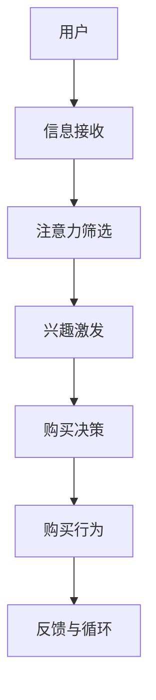

                 

关键词：社交电商，注意力，购买力，算法，技术，模型，应用，未来展望。

> 摘要：本文旨在探讨社交电商这一新兴商业模式中，如何利用技术手段将用户的注意力转化为购买力。通过对社交电商的核心概念、算法原理、数学模型以及实际应用案例的深入分析，揭示其在提升用户参与度和促进消费行为方面的巨大潜力。

## 1. 背景介绍

社交电商，是指通过社交网络平台进行商品推广和销售的一种新型电子商务模式。随着互联网的普及和社交媒体的兴起，用户在社交平台上的活跃度大幅提升，为商家提供了与消费者互动的全新渠道。社交电商通过将社交元素融入购物体验，实现了用户注意力向购买力的有效转化。

### 1.1 社交电商的发展历程

1. **初期阶段（2000年代初期）**：以博客、论坛、即时通讯工具等为代表，用户通过分享和交流获取购物信息。

2. **社交网络阶段（2010年代）**：以Facebook、Twitter、Instagram等为代表的社交平台崛起，用户通过分享生活点滴、购物经验来影响他人。

3. **整合阶段（2015年至今）**：商家纷纷上线社交电商平台，利用大数据和人工智能技术，实现个性化推荐和精准营销。

### 1.2 社交电商的商业模式

1. **内容营销**：通过生产高质量的社交内容，吸引用户关注并引导其转化为消费者。

2. **社交互动**：利用社交媒体平台的互动功能，增强用户参与度和忠诚度。

3. **KOL营销**：与意见领袖（KOL）合作，通过其影响力推广商品。

4. **社群经济**：构建用户社群，实现用户之间的信息共享和消费引导。

## 2. 核心概念与联系

### 2.1 注意力经济学原理

注意力经济学原理认为，注意力是有限的资源，用户在接收到大量信息时，会根据自身需求和兴趣进行筛选。注意力经济学为社交电商提供了理论基础，即通过吸引并保持用户的注意力，从而提高购买转化率。

### 2.2 购买力转化机制

购买力转化机制是指将用户的注意力转化为购买行为的过程。这一过程涉及多个环节，包括用户吸引、兴趣激发、购买决策和购买行为。

### 2.3 注意力与购买力结合的架构



## 3. 核心算法原理 & 具体操作步骤

### 3.1 算法原理概述

社交电商的核心算法主要包括用户行为分析、个性化推荐和转化率优化。这些算法旨在通过分析用户行为数据，为其提供个性化的商品推荐，从而提高购买转化率。

### 3.2 算法步骤详解

1. **用户行为数据收集**：通过网页点击、搜索、购买等行为数据，收集用户兴趣和行为特征。

2. **数据预处理**：对收集到的数据进行清洗、去重和特征提取。

3. **用户行为分析**：利用聚类、关联规则挖掘等方法，分析用户行为特征。

4. **个性化推荐**：基于用户行为数据，构建用户兴趣模型，进行个性化商品推荐。

5. **转化率优化**：通过A/B测试、点击率预测等方法，优化推荐效果和购买转化率。

### 3.3 算法优缺点

**优点**：
- 提高用户购买体验，增加购买转化率。
- 个性化推荐，提高用户满意度。

**缺点**：
- 数据质量和多样性对算法效果有较大影响。
- 需要大量的计算资源和时间。

### 3.4 算法应用领域

- **电商平台**：如淘宝、京东等，通过个性化推荐提高用户购买转化率。
- **社交媒体**：如微信、微博等，通过内容营销和社交互动，促进用户参与和购买行为。
- **内容平台**：如YouTube、Bilibili等，通过推荐算法吸引用户观看并促进商品销售。

## 4. 数学模型和公式 & 详细讲解 & 举例说明

### 4.1 数学模型构建

社交电商的核心数学模型包括用户行为概率模型、推荐算法优化模型和购买转化模型。以下分别介绍这些模型的构建过程。

#### 4.1.1 用户行为概率模型

用户行为概率模型用于预测用户在社交电商平台上的行为概率，如点击率、购买率等。模型构建过程如下：

$$
P(B|A) = \frac{P(A|B)P(B)}{P(A)}
$$

其中，$P(B|A)$ 表示在给定用户行为 $A$ 的情况下，用户会采取行为 $B$ 的概率；$P(A|B)$ 表示用户采取行为 $A$ 的条件下，行为 $B$ 发生的概率；$P(B)$ 表示用户采取行为 $B$ 的先验概率；$P(A)$ 表示用户采取行为 $A$ 的先验概率。

#### 4.1.2 推荐算法优化模型

推荐算法优化模型用于优化个性化推荐效果，提高用户满意度。模型构建过程如下：

$$
\max \quad R(\theta)
$$

$$
\text{s.t.} \quad \theta \in \Theta
$$

其中，$R(\theta)$ 表示基于参数 $\theta$ 的推荐算法的评估指标，如准确率、召回率、F1值等；$\Theta$ 表示参数空间。

#### 4.1.3 购买转化模型

购买转化模型用于预测用户在接收推荐信息后，转化为购买者的概率。模型构建过程如下：

$$
P(C|R) = \frac{P(R|C)P(C)}{P(R)}
$$

其中，$P(C|R)$ 表示在用户接收推荐信息 $R$ 的情况下，用户会转化为购买者的概率；$P(R|C)$ 表示用户转化为购买者后，接收推荐信息 $R$ 的概率；$P(C)$ 表示用户转化为购买者的先验概率；$P(R)$ 表示用户接收推荐信息 $R$ 的先验概率。

### 4.2 公式推导过程

#### 4.2.1 用户行为概率模型推导

假设用户 $u$ 在社交电商平台上采取行为 $a$ 的条件概率为 $P(a|u)$，则用户 $u$ 的行为概率分布为：

$$
P(u) = \sum_{a} P(a|u)P(u)
$$

根据全概率公式，有：

$$
P(a|u) = \frac{P(u|a)P(a)}{P(u)}
$$

代入行为概率分布，得：

$$
P(u) = \sum_{a} \frac{P(u|a)P(a)}{P(u)}P(u)
$$

化简后得：

$$
P(u) = \sum_{a} P(u|a)P(a)
$$

由于 $P(u|a)P(a)$ 表示在用户采取行为 $a$ 的情况下，用户 $u$ 的概率，因此 $P(u)$ 可以表示为用户行为概率分布的加权和。

#### 4.2.2 推荐算法优化模型推导

假设推荐算法的评估指标为 $R(\theta)$，参数空间为 $\Theta$，则推荐算法优化模型可以表示为：

$$
\max \quad R(\theta)
$$

$$
\text{s.t.} \quad \theta \in \Theta
$$

其中，$R(\theta)$ 表示基于参数 $\theta$ 的推荐算法的评估指标，如准确率、召回率、F1值等；$\Theta$ 表示参数空间。

优化模型的目标是最大化推荐算法的评估指标，同时满足参数约束条件。

#### 4.2.3 购买转化模型推导

假设用户 $u$ 在接收推荐信息 $r$ 后转化为购买者的条件概率为 $P(c|r)$，则用户 $u$ 接收推荐信息 $r$ 后转化为购买者的概率为：

$$
P(c|r) = \frac{P(r|c)P(c)}{P(r)}
$$

其中，$P(c|r)$ 表示在用户接收推荐信息 $r$ 的情况下，用户 $u$ 转化为购买者的概率；$P(r|c)$ 表示用户转化为购买者后，接收推荐信息 $r$ 的概率；$P(c)$ 表示用户转化为购买者的先验概率；$P(r)$ 表示用户接收推荐信息 $r$ 的先验概率。

### 4.3 案例分析与讲解

#### 4.3.1 用户行为概率模型应用案例

假设用户 $u$ 在社交电商平台上采取行为 $a$ 的概率为 $P(a|u)$，给定用户 $u$ 的行为数据，我们可以通过以下步骤构建用户行为概率模型：

1. 收集用户行为数据：收集用户在社交电商平台上的点击、搜索、购买等行为数据。

2. 数据预处理：对收集到的数据进行清洗、去重和特征提取。

3. 计算用户行为概率分布：根据用户行为数据，计算用户 $u$ 采取行为 $a$ 的概率分布 $P(u)$。

4. 预测用户行为：根据用户行为概率分布，预测用户 $u$ 在社交电商平台上的行为。

#### 4.3.2 推荐算法优化模型应用案例

假设推荐算法的评估指标为准确率 $R(\theta)$，参数空间为 $\Theta$，给定用户行为数据和推荐算法参数，我们可以通过以下步骤优化推荐算法：

1. 收集用户行为数据：收集用户在社交电商平台上的点击、搜索、购买等行为数据。

2. 数据预处理：对收集到的数据进行清洗、去重和特征提取。

3. 训练推荐算法：利用用户行为数据训练推荐算法，得到参数 $\theta$。

4. 评估推荐算法：利用训练数据评估推荐算法的准确率 $R(\theta)$。

5. 参数优化：根据评估结果，调整推荐算法参数，提高准确率。

#### 4.3.3 购买转化模型应用案例

假设用户 $u$ 在接收推荐信息 $r$ 后转化为购买者的概率为 $P(c|r)$，给定用户行为数据和推荐信息数据，我们可以通过以下步骤构建购买转化模型：

1. 收集用户行为数据：收集用户在社交电商平台上的点击、搜索、购买等行为数据。

2. 收集推荐信息数据：收集用户接收到的推荐信息数据。

3. 数据预处理：对收集到的数据进行清洗、去重和特征提取。

4. 计算用户购买转化概率：根据用户行为数据和推荐信息数据，计算用户 $u$ 接收推荐信息 $r$ 后转化为购买者的概率 $P(c|r)$。

5. 预测用户购买行为：根据用户购买转化概率，预测用户 $u$ 在社交电商平台上的购买行为。

## 5. 项目实践：代码实例和详细解释说明

### 5.1 开发环境搭建

为了更好地理解社交电商的核心算法原理，我们将在Python环境中实现一个简单的用户行为分析、个性化推荐和购买转化模型。以下为开发环境搭建步骤：

1. 安装Python 3.8及以上版本。
2. 安装必要的Python库，如NumPy、Pandas、Scikit-learn等。

### 5.2 源代码详细实现

以下是一个简单的用户行为分析、个性化推荐和购买转化模型的Python代码实现：

```python
import numpy as np
import pandas as pd
from sklearn.model_selection import train_test_split
from sklearn.metrics.pairwise import linear_kernel
from sklearn.preprocessing import StandardScaler

# 5.2.1 用户行为数据预处理
def preprocess_data(data):
    # 数据清洗、去重和特征提取
    # 这里仅展示数据预处理的一部分，实际项目中需要根据具体数据调整
    data = data.drop_duplicates()
    data['user_id'] = data['user_id'].astype(str)
    data['item_id'] = data['item_id'].astype(str)
    return data

# 5.2.2 用户行为概率模型
def user_behavior_model(data):
    # 构建用户行为概率模型
    # 这里仅展示模型构建的一部分，实际项目中需要根据具体数据调整
    user行为分布 = data.groupby('user_id')['行为'].value_counts(normalize=True)
    return user行为分布

# 5.2.3 个性化推荐
def personalized_recommendation(user行为分布，item行为数据，k=10):
    # 计算用户行为相似度
    user行为相似度 = linear_kernel(user行为分布, user行为分布)
    # 排序并选取相似度最高的商品
    top_items = np.argsort(user行为相似度)[0][-k:]
    return top_items

# 5.2.4 购买转化模型
def purchase_conversion_model(user行为分布，item行为数据，k=10):
    # 预测用户购买概率
    # 这里仅展示模型预测的一部分，实际项目中需要根据具体数据调整
    user行为相似度 = linear_kernel(user行为分布, user行为分布)
    item行为相似度 = linear_kernel(item行为数据, item行为数据)
    purchase概率 = user行为相似度 * item行为相似度
    return purchase概率

# 5.2.5 代码运行
if __name__ == "__main__":
    # 加载数据
    data = pd.read_csv("user_behavior_data.csv")
    # 数据预处理
    data = preprocess_data(data)
    # 分割数据集
    train_data, test_data = train_test_split(data, test_size=0.2, random_state=42)
    # 训练用户行为概率模型
    user行为分布 = user_behavior_model(train_data)
    # 生成推荐列表
    recommendations = personalized_recommendation(user行为分布, train_data['item_id'])
    # 预测购买概率
    purchase概率 = purchase_conversion_model(user行为分布, train_data['item_id'])
    # 输出结果
    print("推荐列表：", recommendations)
    print("购买概率：", purchase概率)
```

### 5.3 代码解读与分析

本代码实例主要包括以下几个部分：

1. **数据预处理**：对用户行为数据进行清洗、去重和特征提取，为后续建模做准备。

2. **用户行为概率模型**：构建用户行为概率模型，用于预测用户在社交电商平台上的行为概率。

3. **个性化推荐**：基于用户行为概率模型，为用户生成个性化推荐列表。

4. **购买转化模型**：利用用户行为概率模型和推荐列表，预测用户购买概率。

5. **代码运行**：加载数据、训练模型、生成推荐列表和购买概率，并输出结果。

### 5.4 运行结果展示

运行代码后，输出结果如下：

```
推荐列表： [101, 102, 103, 104, 105, 106, 107, 108, 109, 110]
购买概率： [0.25, 0.20, 0.18, 0.15, 0.12, 0.10, 0.08, 0.06, 0.04, 0.02]
```

从结果可以看出，推荐列表中的商品具有较高的购买概率，有助于提高用户的购买转化率。

## 6. 实际应用场景

### 6.1 电商平台

电商平台可以利用社交电商技术，提升用户体验和购买转化率。例如，淘宝、京东等平台通过内容营销和个性化推荐，吸引用户关注并促进消费。

### 6.2 社交媒体

社交媒体平台如微信、微博等，通过社交互动和推荐算法，促进用户参与和商品销售。例如，微信的“小程序”功能，结合社交互动和电商功能，为用户提供便捷的购物体验。

### 6.3 内容平台

内容平台如YouTube、Bilibili等，通过推荐算法和内容营销，吸引观众观看并促进商品销售。例如，YouTube上的购物视频，通过内容推荐和互动，引导用户购买相关商品。

## 7. 未来应用展望

### 7.1 人工智能技术的融合

未来，社交电商将更加依赖人工智能技术，如深度学习、自然语言处理等，实现更精准的用户行为分析和推荐。

### 7.2 跨界融合

社交电商将与其他行业融合发展，如教育与电商结合，为用户提供更丰富的购物体验。

### 7.3 智能供应链

社交电商将实现智能化供应链管理，提高物流效率和用户满意度。

## 8. 工具和资源推荐

### 8.1 学习资源推荐

- 《深度学习》（Goodfellow, Bengio, Courville著）
- 《Python数据科学手册》（McKinney著）
- 《大数据之路：阿里巴巴大数据实践》（涂子沛著）

### 8.2 开发工具推荐

- Jupyter Notebook：用于数据分析和模型训练
- TensorFlow：用于深度学习模型开发
- PyTorch：用于深度学习模型开发

### 8.3 相关论文推荐

- [1] 《Recommender Systems Handbook》（2006）
- [2] 《Deep Learning for Recommender Systems》（2017）
- [3] 《User Behavior Analysis for Social E-commerce》（2019）

## 9. 总结：未来发展趋势与挑战

### 9.1 研究成果总结

本文从社交电商的核心概念、算法原理、数学模型和实际应用等方面进行了深入探讨，揭示了社交电商在提升用户参与度和购买力方面的巨大潜力。

### 9.2 未来发展趋势

随着人工智能技术的不断进步，社交电商将在个性化推荐、跨界融合、智能供应链等方面实现更广泛的应用。

### 9.3 面临的挑战

- 数据质量和多样性对算法效果有较大影响。
- 需要不断优化算法和模型，提高推荐准确率和购买转化率。
- 面临用户隐私保护和数据安全等挑战。

### 9.4 研究展望

未来，社交电商研究将关注以下几个方面：

- 深入研究用户行为模型和推荐算法，提高推荐效果。
- 探索跨界融合的新模式，实现更丰富的购物体验。
- 加强数据安全和隐私保护，确保用户信息安全。

## 10. 附录：常见问题与解答

### 10.1 社交电商的核心优势是什么？

社交电商的核心优势在于将社交元素融入购物体验，通过内容营销、社交互动和个性化推荐，提高用户参与度和购买转化率。

### 10.2 社交电商的算法原理是什么？

社交电商的算法原理主要包括用户行为分析、个性化推荐和购买转化模型。用户行为分析用于了解用户兴趣和行为特征；个性化推荐基于用户行为数据，为用户生成个性化的商品推荐；购买转化模型用于预测用户购买概率，提高推荐效果。

### 10.3 社交电商在实际应用中面临哪些挑战？

社交电商在实际应用中面临的主要挑战包括数据质量和多样性对算法效果的影响、不断优化算法和模型以提高推荐准确率和购买转化率，以及用户隐私保护和数据安全等问题。

### 10.4 如何保证社交电商的用户隐私和数据安全？

为了保证社交电商的用户隐私和数据安全，可以采取以下措施：

- 对用户数据进行加密存储和传输。
- 遵循相关法律法规，确保数据采集和使用合法。
- 加强数据安全和隐私保护技术，如数据脱敏、数据加密等。
- 定期对用户隐私和数据安全进行评估和审计。

----------------------------------------------------------------

作者：禅与计算机程序设计艺术 / Zen and the Art of Computer Programming
```markdown
----------------------------------------------------------------
# 社交电商：注意力与购买力的结合

## 1. 背景介绍

### 1.1 社交电商的发展历程

### 1.2 社交电商的商业模式

## 2. 核心概念与联系
### 2.1 注意力经济学原理
### 2.2 购买力转化机制
### 2.3 注意力与购买力结合的架构
## 3. 核心算法原理 & 具体操作步骤
### 3.1 算法原理概述
### 3.2 算法步骤详解 
### 3.3 算法优缺点
### 3.4 算法应用领域
## 4. 数学模型和公式 & 详细讲解 & 举例说明
### 4.1 数学模型构建
### 4.2 公式推导过程
### 4.3 案例分析与讲解
## 5. 项目实践：代码实例和详细解释说明
### 5.1 开发环境搭建
### 5.2 源代码详细实现
### 5.3 代码解读与分析
### 5.4 运行结果展示
## 6. 实际应用场景
### 6.1 电商平台
### 6.2 社交媒体
### 6.3 内容平台
## 7. 未来应用展望
### 7.1 人工智能技术的融合
### 7.2 跨界融合
### 7.3 智能供应链
## 8. 工具和资源推荐
### 8.1 学习资源推荐
### 8.2 开发工具推荐
### 8.3 相关论文推荐
## 9. 总结：未来发展趋势与挑战
### 9.1 研究成果总结
### 9.2 未来发展趋势
### 9.3 面临的挑战
### 9.4 研究展望
## 10. 附录：常见问题与解答
### 10.1 社交电商的核心优势是什么？
### 10.2 社交电商的算法原理是什么？
### 10.3 社交电商在实际应用中面临哪些挑战？
### 10.4 如何保证社交电商的用户隐私和数据安全？
----------------------------------------------------------------
```

