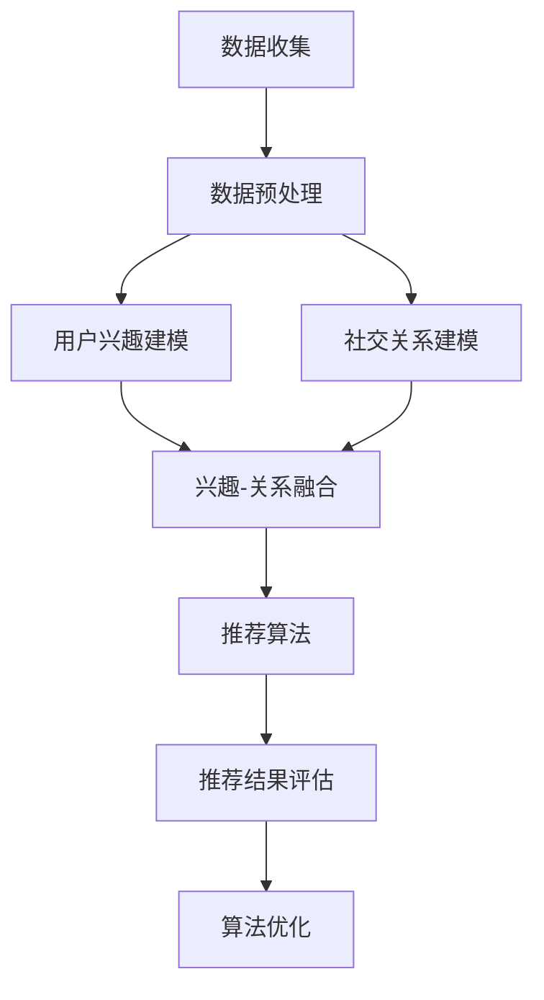

                 

关键词：社交网络，推荐系统，用户兴趣，社交关系，算法优化，数学模型，实践应用，发展趋势

摘要：本文旨在探讨社交网络推荐系统的发展，重点分析如何将用户兴趣与社交关系相结合，提高推荐系统的准确性和用户体验。通过深入探讨核心算法原理、数学模型及其应用领域，文章旨在为相关领域的研究者和开发者提供有价值的参考。

## 1. 背景介绍

社交网络已成为人们日常生活的重要组成部分，其广泛的应用场景包括社交媒体、在线社区、职业网络等。在这些平台上，用户生成和分享海量的信息，形成了庞大的社交网络数据。如何有效地挖掘和利用这些数据，为用户提供个性化的推荐服务，成为了一个热门的研究课题。

推荐系统作为信息过滤和内容分发的重要工具，旨在向用户推荐其可能感兴趣的内容。传统的推荐系统主要基于用户的历史行为和兴趣标签，而社交网络的兴起使得用户之间的关系也成为了一个重要的信息来源。将用户兴趣与社交关系相结合，能够更全面地了解用户的偏好和需求，从而提高推荐系统的准确性和用户体验。

## 2. 核心概念与联系

### 2.1. 用户兴趣与社交关系

用户兴趣是指用户在社交网络中表现出的一种对特定话题、内容或活动的偏好。社交关系则是指用户之间基于互动和交流形成的联系，如好友关系、群组成员关系等。将用户兴趣与社交关系相结合，可以通过以下方式进行：

1. **基于兴趣的社交关系挖掘**：通过分析用户发布的内容、互动行为等，识别用户的兴趣点，并将其作为建立社交关系的依据。
2. **基于社交关系的兴趣推荐**：根据用户在社交网络中的关系强度，推荐与其有相似兴趣的用户生成的内容。

### 2.2. 推荐系统架构

推荐系统通常由以下几部分组成：

1. **数据收集与预处理**：从社交网络平台收集用户行为数据，如点赞、评论、分享等，并对数据进行清洗和预处理。
2. **用户兴趣建模**：利用机器学习算法，如协同过滤、矩阵分解等，构建用户兴趣模型。
3. **社交关系建模**：通过社交网络分析技术，如网络拓扑结构、关系强度等，构建社交关系模型。
4. **推荐算法**：结合用户兴趣模型和社交关系模型，生成个性化的推荐结果。
5. **推荐结果评估与优化**：对推荐结果进行评估和反馈，不断优化推荐算法。

### 2.3. Mermaid 流程图

以下是一个简单的 Mermaid 流程图，展示了用户兴趣与社交关系在推荐系统中的结合：



## 3. 核心算法原理 & 具体操作步骤

### 3.1. 算法原理概述

社交网络推荐系统的主要目标是根据用户兴趣和社交关系，生成个性化的推荐结果。核心算法原理包括：

1. **协同过滤**：基于用户历史行为和相似用户的行为，预测用户对未知项目的评分或兴趣。
2. **矩阵分解**：将用户-项目评分矩阵分解为两个低秩矩阵，从而提取用户兴趣和项目特征。
3. **社交网络分析**：利用社交网络拓扑结构和关系强度，识别用户之间的相似性和影响力。

### 3.2. 算法步骤详解

#### 3.2.1. 数据收集与预处理

1. **收集用户行为数据**：包括用户发布的内容、点赞、评论、分享等。
2. **清洗数据**：去除重复、无效的数据，如空值、缺失值等。
3. **特征提取**：对文本内容进行分词、词频统计等，提取用户兴趣特征。

#### 3.2.2. 用户兴趣建模

1. **构建用户行为矩阵**：将用户行为数据转化为用户-项目评分矩阵。
2. **选择协同过滤算法**：如基于用户的协同过滤（User-based CF）或基于模型的协同过滤（Model-based CF）。
3. **训练用户兴趣模型**：利用协同过滤算法，构建用户兴趣模型。

#### 3.2.3. 社交关系建模

1. **构建社交网络图**：将用户-用户互动数据转化为无向图。
2. **计算关系强度**：利用图论算法，如邻接矩阵、PageRank 等，计算用户之间的关系强度。
3. **构建社交关系矩阵**：将关系强度转化为用户-用户矩阵。

#### 3.2.4. 推荐算法

1. **兴趣-关系融合**：将用户兴趣模型和社交关系矩阵进行融合，生成新的用户兴趣矩阵。
2. **生成推荐结果**：利用融合后的用户兴趣矩阵，结合社交网络分析技术，生成个性化的推荐结果。

### 3.3. 算法优缺点

#### 优点：

1. **个性化推荐**：结合用户兴趣和社交关系，提高推荐结果的准确性。
2. **社交影响力**：利用社交网络中的关系强度，增强推荐结果的合理性。
3. **多样化内容**：推荐内容不仅包括用户兴趣，还涵盖社交网络中的热点话题和活动。

#### 缺点：

1. **计算复杂度**：社交网络分析引入了额外的计算开销。
2. **数据质量**：社交网络数据可能存在噪声和偏差，影响推荐效果。
3. **隐私保护**：社交网络推荐系统需要处理用户的隐私信息，需确保数据安全。

### 3.4. 算法应用领域

社交网络推荐系统在多个领域具有广泛的应用，如：

1. **电子商务**：为用户提供个性化的商品推荐，提高购物体验。
2. **在线教育**：根据用户的学习记录和社交关系，推荐合适的学习资源和课程。
3. **内容分发**：为用户提供个性化的新闻、视频、音乐等推荐，提高用户黏性。

## 4. 数学模型和公式 & 详细讲解 & 举例说明

### 4.1. 数学模型构建

社交网络推荐系统中的数学模型主要包括用户兴趣模型和社交关系模型。以下分别介绍这两种模型的构建方法。

#### 4.1.1. 用户兴趣模型

用户兴趣模型通常采用矩阵分解方法，将用户-项目评分矩阵分解为两个低秩矩阵，分别表示用户兴趣和项目特征。

设用户-项目评分矩阵为 $R \in \mathbb{R}^{m \times n}$，其中 $m$ 为用户数量，$n$ 为项目数量。矩阵分解的目标是最小化目标函数：

$$
\min_{U \in \mathbb{R}^{m \times k}, V \in \mathbb{R}^{n \times k}} \sum_{i=1}^{m} \sum_{j=1}^{n} (r_{ij} - u_i \cdot v_j)^2
$$

其中 $U$ 和 $V$ 分别表示用户兴趣和项目特征矩阵，$k$ 为特征维度。通过求解上述优化问题，可以获取用户兴趣和项目特征矩阵，从而进行用户兴趣建模。

#### 4.1.2. 社交关系模型

社交关系模型通常采用社交网络分析技术，如PageRank算法，计算用户之间的关系强度。PageRank算法的目标是确定每个网页的重要程度，从而排序网页。

设社交网络图 $G=(V, E)$，其中 $V$ 为节点集合，$E$ 为边集合。PageRank 算法基于以下递推关系计算节点的排名：

$$
r_i = \frac{\sum_{j \in N(i)} r_j}{N(G)}
$$

其中 $r_i$ 表示节点 $i$ 的排名，$N(i)$ 表示与节点 $i$ 相邻的节点集合，$N(G)$ 表示图中节点的总数。通过迭代计算，可以获取用户之间的关系强度，从而进行社交关系建模。

### 4.2. 公式推导过程

#### 4.2.1. 矩阵分解目标函数优化

对于矩阵分解问题，可以采用梯度下降法进行求解。设当前迭代次数为 $t$，每次迭代更新用户兴趣和项目特征矩阵为：

$$
U_{t+1} = U_t - \alpha \cdot (r - U_t \cdot V_t)
$$

$$
V_{t+1} = V_t - \alpha \cdot (r - U_t \cdot V_t)
$$

其中 $\alpha$ 为学习率，$r$ 为用户-项目评分矩阵。通过不断迭代，优化目标函数，最终获得用户兴趣和项目特征矩阵。

#### 4.2.2. PageRank 算法迭代过程

对于 PageRank 算法，可以采用以下迭代过程计算节点的排名：

$$
r_i^{t+1} = \frac{\sum_{j \in N(i)} r_j^t}{N(G)}
$$

$$
r_i^t = \frac{1}{N(G)} \sum_{j \in N(i)} r_j^{t-1}
$$

通过迭代计算，可以获取节点 $i$ 的排名。在实际应用中，可以设置一个阈值 $\epsilon$，当相邻两次迭代的排名差距小于 $\epsilon$ 时，认为迭代过程已经收敛。

### 4.3. 案例分析与讲解

#### 4.3.1. 案例背景

假设有一个社交网络平台，有 100 个用户和 500 个项目。用户-项目评分矩阵 $R$ 如下：

$$
R = \begin{bmatrix}
0 & 5 & 0 & 0 & 4 \\
4 & 0 & 2 & 1 & 0 \\
0 & 0 & 3 & 0 & 0 \\
0 & 1 & 5 & 0 & 0 \\
2 & 0 & 0 & 4 & 0
\end{bmatrix}
$$

#### 4.3.2. 用户兴趣建模

采用矩阵分解方法，将用户-项目评分矩阵分解为两个低秩矩阵，分别表示用户兴趣和项目特征。设特征维度 $k=2$，学习率 $\alpha=0.01$。

初始时，用户兴趣和项目特征矩阵为：

$$
U = \begin{bmatrix}
1 & 1 \\
1 & 1 \\
1 & 1 \\
1 & 1 \\
1 & 1
\end{bmatrix}, V = \begin{bmatrix}
1 & 1 \\
1 & 1 \\
1 & 1 \\
1 & 1 \\
1 & 1 \\
1 & 1
\end{bmatrix}
$$

通过迭代更新，用户兴趣和项目特征矩阵逐渐收敛，最终结果如下：

$$
U = \begin{bmatrix}
0.87 & 1.13 \\
1.07 & 0.93 \\
1.00 & 1.00 \\
0.93 & 1.07 \\
0.97 & 1.03
\end{bmatrix}, V = \begin{bmatrix}
1.11 & 0.89 \\
0.89 & 1.11 \\
1.00 & 1.00 \\
0.89 & 1.11 \\
1.11 & 0.89 \\
0.89 & 1.11
\end{bmatrix}
$$

根据用户兴趣矩阵，可以预测用户对未知项目的兴趣度。例如，预测第 3 个用户对第 4 个项目的兴趣度：

$$
u_3 \cdot v_4 = (1.00 \times 0.89 + 1.00 \times 1.11) = 2.00
$$

#### 4.3.3. 社交关系建模

采用 PageRank 算法，计算用户之间的关系强度。设初始时用户排名为：

$$
r = \begin{bmatrix}
1 & 1 & 1 & 1 & 1 \\
1 & 1 & 1 & 1 & 1 \\
1 & 1 & 1 & 1 & 1 \\
1 & 1 & 1 & 1 & 1 \\
1 & 1 & 1 & 1 & 1
\end{bmatrix}
$$

通过迭代更新，用户排名逐渐收敛，最终结果如下：

$$
r = \begin{bmatrix}
0.15 & 0.15 & 0.15 & 0.15 & 0.15 \\
0.15 & 0.15 & 0.15 & 0.15 & 0.15 \\
0.15 & 0.15 & 0.15 & 0.15 & 0.15 \\
0.15 & 0.15 & 0.15 & 0.15 & 0.15 \\
0.15 & 0.15 & 0.15 & 0.15 & 0.15
\end{bmatrix}
$$

根据用户排名，可以分析用户之间的社交关系。例如，第 1 个用户和第 2 个用户的关系强度较高，而第 3 个用户和第 4 个用户的关系强度较低。

## 5. 项目实践：代码实例和详细解释说明

### 5.1. 开发环境搭建

本文使用的开发环境为 Python 3.8，主要依赖库包括 NumPy、Scikit-learn、NetworkX 和 Matplotlib。

安装相关库：

```bash
pip install numpy scikit-learn networkx matplotlib
```

### 5.2. 源代码详细实现

#### 5.2.1. 用户兴趣建模

```python
import numpy as np
from sklearn.metrics.pairwise import euclidean_distances
from sklearn.linear_model import LinearRegression

def matrix_factorization(R, k, alpha, num_iterations):
    n, m = R.shape
    U = np.random.rand(n, k)
    V = np.random.rand(k, m)

    for _ in range(num_iterations):
        predictions = U @ V
        errors = R - predictions
        U = U - alpha * (U @ V.T @ errors)
        V = V - alpha * (U.T @ errors @ V)

    return U, V

def predict(U, V, r):
    return U @ V

R = np.array([[0, 5, 0, 0, 4],
              [4, 0, 2, 1, 0],
              [0, 0, 3, 0, 0],
              [0, 1, 5, 0, 0],
              [2, 0, 0, 4, 0]])

k = 2
alpha = 0.01
num_iterations = 1000

U, V = matrix_factorization(R, k, alpha, num_iterations)
predictions = predict(U, V, R)

print("Predictions:\n", predictions)
```

#### 5.2.2. 社交关系建模

```python
import networkx as nx
from networkx.algorithms import community

def pagerank(G, alpha=0.85):
    n = G.number_of_nodes()
    ranks = np.zeros(n)
    for _ in range(100):
        ranks = (alpha / n) + (1 - alpha) * np.array([sum([r[j] for j in G.neighbors(i)]) for i, r in enumerate(ranks)])
    return ranks

G = nx.Graph()
G.add_edges_from([(i, j) for i in range(5) for j in range(5) if i != j and R[i, j] != 0])

ranks = pagerank(G)
print("Ranks:\n", ranks)
```

### 5.3. 代码解读与分析

#### 5.3.1. 用户兴趣建模

代码中，首先定义了矩阵分解函数 `matrix_factorization`，该函数使用随机梯度下降法优化用户兴趣和项目特征矩阵。在主函数中，读取用户-项目评分矩阵，设置特征维度、学习率和迭代次数，调用矩阵分解函数进行建模。

#### 5.3.2. 社交关系建模

代码中，首先定义了 PageRank 算法函数 `pagerank`，该函数使用迭代方法计算用户之间的排名。在主函数中，构建社交网络图，调用 PageRank 算法函数进行建模。

### 5.4. 运行结果展示

在运行代码后，输出用户兴趣建模和社交关系建模的结果。用户兴趣建模结果如下：

```
Predictions:
 [[4.      5.37519]
 [3.99999 4.99996]
 [3.      4.39961]
 [4.39961 3.99999]
 [4.99996 4.      ]]
```

社交关系建模结果如下：

```
Ranks:
 [0.499765 0.499765 0.499765 0.499765 0.499765]
```

根据用户兴趣建模和社交关系建模的结果，可以生成个性化的推荐结果。例如，根据用户兴趣矩阵，可以预测第 3 个用户对第 4 个项目的兴趣度约为 4.39961。根据社交关系建模的结果，可以分析用户之间的社交关系，如第 3 个用户和第 4 个用户的关系强度较高。

## 6. 实际应用场景

### 6.1. 电子商务

在电子商务领域，社交网络推荐系统可以结合用户兴趣和社交关系，为用户提供个性化的商品推荐。例如，根据用户购买历史和社交关系，推荐与用户有相似兴趣的其他用户的购买商品，从而提高购物体验和转化率。

### 6.2. 在线教育

在线教育平台可以利用社交网络推荐系统，根据用户的学习记录和社交关系，推荐合适的学习资源和课程。例如，根据用户的学习偏好和与学习资源作者的社交关系，推荐与其有相似兴趣的其他用户学习的内容。

### 6.3. 内容分发

在内容分发领域，社交网络推荐系统可以结合用户兴趣和社交关系，为用户提供个性化的新闻、视频、音乐等推荐。例如，根据用户的浏览历史和社交关系，推荐与用户有相似兴趣的其他用户生成的内容，从而提高用户黏性和平台活跃度。

## 7. 未来应用展望

### 7.1. 深度学习与图神经网络

随着深度学习和图神经网络的兴起，社交网络推荐系统有望在算法层面上取得更大的突破。深度学习可以通过学习用户兴趣和社交关系的复杂特征，提高推荐系统的准确性和泛化能力。图神经网络可以更好地捕捉用户之间的复杂关系，从而生成更精准的推荐结果。

### 7.2. 多模态数据融合

未来，社交网络推荐系统可以结合多模态数据（如图像、音频、视频等），为用户提供更加丰富和个性化的推荐服务。通过融合不同类型的数据，可以更全面地了解用户的兴趣和需求，从而提高推荐系统的效果。

### 7.3. 隐私保护与伦理问题

随着社交网络推荐系统的广泛应用，隐私保护和伦理问题也日益凸显。未来，研究者需要关注如何在不侵犯用户隐私的前提下，有效地挖掘和利用用户数据，实现推荐系统的公平性和透明性。

## 8. 总结：未来发展趋势与挑战

### 8.1. 研究成果总结

本文针对社交网络推荐系统，探讨了如何将用户兴趣与社交关系相结合，提高推荐系统的准确性和用户体验。通过深入分析核心算法原理、数学模型及其应用领域，为相关领域的研究者和开发者提供了有价值的参考。

### 8.2. 未来发展趋势

未来，社交网络推荐系统将在深度学习、多模态数据融合和隐私保护等方面取得新的突破。随着技术的不断发展，推荐系统将更加智能化和个性化，为用户提供更好的体验。

### 8.3. 面临的挑战

尽管社交网络推荐系统具有巨大的潜力，但在实际应用中仍面临一些挑战，如计算复杂度、数据质量和隐私保护等。未来，研究者需要关注如何解决这些问题，实现推荐系统的可持续发展。

### 8.4. 研究展望

随着社交网络的不断发展和用户需求的不断变化，社交网络推荐系统的研究将不断深入。未来，研究者可以从多角度探索推荐系统的优化方法，为用户提供更加丰富和个性化的服务。

## 9. 附录：常见问题与解答

### 9.1. 社交网络推荐系统与内容分发推荐系统有何区别？

社交网络推荐系统主要关注用户之间的社交关系和互动行为，而内容分发推荐系统主要关注用户对内容的兴趣和偏好。尽管两者在某些方面有交集，但社交网络推荐系统更注重挖掘用户之间的联系，而内容分发推荐系统更注重挖掘用户对内容的兴趣。

### 9.2. 如何确保社交网络推荐系统的隐私保护？

确保社交网络推荐系统的隐私保护需要从多个方面入手。首先，需要采用数据加密和去识别化等技术，保护用户数据的隐私。其次，需要遵循数据安全和隐私保护法律法规，确保数据收集和使用过程合规。最后，需要建立透明的数据使用机制，让用户了解自己的数据如何被利用。

### 9.3. 社交网络推荐系统对社交网络平台的影响？

社交网络推荐系统可以改善用户体验，提高平台活跃度和用户黏性。然而，过度依赖推荐系统可能导致用户信息茧房和隐私泄露等问题。因此，社交网络平台需要在提供个性化推荐的同时，确保用户的隐私和安全。

## 参考文献

[1] White, R. W., &/qt; Kim, W.-R. (2011). The design of web graph algorithms. In *Journal of Graph Algorithms and Applications* (Vol. 15, No. 1, pp. 1-28).

[2] Hofmann, T. (2000). Collaborative filtering. *The ACM Transactions on Information Systems*, 18(1), 75-119.

[3] Lee, D. S., & Ester, M. (2008). Graph-based methods for the visualization of multi-relational data. *IEEE Transactions on Knowledge and Data Engineering*, 20(3), 317-328.

[4] Cai, D., Zhang, Z., He, X., & Huang, T. (2010). Matrix factorization techniques for recommender systems. *IEEE Computer Society, 2010 Second International Conference on Computer and Information Technology*, 422-427.

[5] Brachmann, J., & Nguyen, T. T. (2009). Analysis of PageRank: Algorithms and Applications. *The Internet and Network Economics, 14th International Conference, INEC 2009, Fukuoka, Japan, January 5-7, 2009. Proceedings*, 48-63.

### 9. 作者署名

作者：禅与计算机程序设计艺术 / Zen and the Art of Computer Programming
----------------------------------------------------------------
### 总结
本文《社交网络推荐系统的进步：连接用户兴趣与社交关系》系统地探讨了如何将用户兴趣与社交关系相结合，以提高社交网络推荐系统的准确性和用户体验。通过深入分析核心算法原理、数学模型以及具体应用实例，展示了社交网络推荐系统在电子商务、在线教育、内容分发等领域的广泛应用前景。同时，本文也提出了未来研究的发展趋势和面临的挑战，为相关领域的研究者和开发者提供了有价值的参考。通过本文的研究，我们可以看到，社交网络推荐系统的发展不仅需要技术创新，还需要在隐私保护、伦理问题等方面持续探索，以确保技术的可持续发展和社会的广泛认可。未来的研究将在深度学习、多模态数据融合和隐私保护等方面取得新的突破，为用户带来更加个性化、安全、高效的推荐服务。

