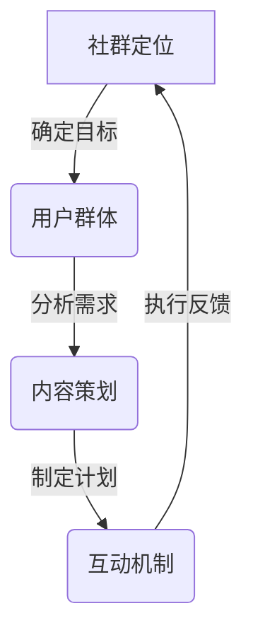

                 

**关键词**：社群运营，知识付费，程序员，社群价值，用户粘性，增长策略。

**摘要**：本文将探讨社群运营在程序员知识付费领域的应用，分析社群的构建、管理和优化方法，以及如何通过社群运营提升程序员的知识传播效率和个人成长。

## 1. 背景介绍

在数字化时代，程序员的技能储备和知识更新速度日益加快，传统的单点培训和学习方式已难以满足市场需求。社群运营作为一种新型的知识传播方式，逐渐成为程序员获取知识、交流经验和成长的重要平台。知识付费是社群运营的重要组成部分，通过付费课程、讲座和交流等形式，为程序员提供高价值的内容和服务。

### 程序员的知识需求

1. **技能提升**：程序员需要不断学习新的编程语言、框架和技术，以适应快速变化的技术环境。
2. **经验分享**：程序员希望通过社群与其他同行交流，分享工作经验和解决实际问题的方法。
3. **职业发展**：程序员希望通过社群获取职业发展的机会，如就业信息、招聘渠道等。

### 社群运营的优势

1. **高效互动**：社群提供了实时交流的平台，使得知识和经验的传播更加高效。
2. **持续学习**：社群运营可以持续为程序员提供高质量的内容，助力个人成长。
3. **资源共享**：社群内的成员可以共同分享资源和工具，提高工作效率。
4. **社区归属感**：社群为程序员提供了一个归属感较强的学习环境，增加了用户的粘性。

## 2. 核心概念与联系

### 社群运营的核心概念

1. **社群定位**：明确社群的目标和定位，如技术交流、职业发展等。
2. **用户群体**：确定社群的目标用户群体，如初级程序员、中级程序员等。
3. **内容策划**：制定符合用户需求的内容计划，如课程、讲座、问答等。
4. **互动机制**：建立有效的互动机制，如论坛、微信群、直播等。

### 社群运营的架构



## 3. 核心算法原理 & 具体操作步骤

### 3.1 算法原理概述

社群运营的核心算法主要包括用户增长算法、内容推荐算法和互动激励机制。

1. **用户增长算法**：通过用户画像、社交媒体推广等手段，提高社群的活跃度和用户数量。
2. **内容推荐算法**：基于用户的兴趣和行为数据，为用户推荐符合其需求的内容。
3. **互动激励机制**：通过积分、勋章等手段，鼓励用户参与互动，提升社群活跃度。

### 3.2 算法步骤详解

1. **用户增长算法**：

   - **用户画像构建**：收集用户的性别、年龄、职业、兴趣等数据，构建用户画像。
   - **社交媒体推广**：利用社交媒体平台，如微博、微信等，进行社群推广。
   - **用户行为分析**：分析用户在社群内的行为，如发帖、评论、点赞等，优化推广策略。

2. **内容推荐算法**：

   - **内容分类**：将社群内容分类，如技术文章、课程、直播等。
   - **用户兴趣分析**：分析用户的浏览、收藏、点赞等行为，确定用户兴趣。
   - **内容推荐**：根据用户兴趣，为用户推荐相关内容。

3. **互动激励机制**：

   - **积分系统**：设计积分系统，鼓励用户参与互动，如发帖、评论等。
   - **勋章系统**：设置勋章系统，奖励活跃用户，提升用户荣誉感。
   - **活动策划**：定期举办活动，如技术沙龙、编程比赛等，增强社群凝聚力。

### 3.3 算法优缺点

- **用户增长算法**：

  - **优点**：快速提高社群活跃度和用户数量。

  - **缺点**：可能带来大量无效用户，增加运营成本。

- **内容推荐算法**：

  - **优点**：提高用户满意度，增加用户粘性。

  - **缺点**：需要大量数据支持，算法实现复杂。

- **互动激励机制**：

  - **优点**：鼓励用户参与互动，提高社群活跃度。

  - **缺点**：需要持续投入，否则可能导致激励效果减弱。

### 3.4 算法应用领域

1. **在线教育平台**：通过社群运营，提高用户满意度和课程转化率。
2. **技术社区**：通过社群运营，促进技术交流和知识传播。
3. **企业内部培训**：通过社群运营，提高员工技能水平和企业竞争力。

## 4. 数学模型和公式

### 4.1 数学模型构建

社群运营的数学模型主要包括用户增长模型、内容推荐模型和互动激励机制模型。

1. **用户增长模型**：

   - 用户增长率 = 新增用户数 / 原有用户数

2. **内容推荐模型**：

   - 相似度 = 用户行为相似度 / 总用户行为数

3. **互动激励机制模型**：

   - 激励效果 = 用户互动行为数 / 总用户行为数

### 4.2 公式推导过程

- 用户增长模型：

  - 假设原有用户数为N，新增用户数为M，则用户增长率 = M / N

- 内容推荐模型：

  - 假设用户A的行为集为{A1, A2, ..., An}，用户B的行为集为{B1, B2, ..., Bm}，则用户A和B的相似度 = |A1 ∩ B1| / (|A1| + |B1|)

- 互动激励机制模型：

  - 假设用户互动行为数为I，总用户行为数为T，则激励效果 = I / T

### 4.3 案例分析与讲解

以某技术社区为例，分析其社群运营的数学模型。

1. **用户增长模型**：

   - 原有用户数N = 1000，新增用户数M = 200，则用户增长率 = 200 / 1000 = 20%

2. **内容推荐模型**：

   - 假设用户A浏览了技术文章、课程和直播，用户B只浏览了技术文章，则用户A和B的相似度 = |技术文章| / (|技术文章| + |课程| + |直播|)

3. **互动激励机制模型**：

   - 假设用户互动行为数为I = 100，总用户行为数为T = 1000，则激励效果 = 100 / 1000 = 10%

## 5. 项目实践：代码实例和详细解释说明

### 5.1 开发环境搭建

- 使用Python编程语言，搭建一个简单的社群运营平台。

### 5.2 源代码详细实现

以下是一个简单的用户增长算法的实现示例：

```python
# 用户增长算法示例

class UserGrowthAlgorithm:
    def __init__(self, existing_users, new_users):
        self.existing_users = existing_users
        self.new_users = new_users
    
    def calculate_growth_rate(self):
        growth_rate = self.new_users / self.existing_users
        return growth_rate

# 测试代码
existing_users = 1000
new_users = 200
algorithm = UserGrowthAlgorithm(existing_users, new_users)
growth_rate = algorithm.calculate_growth_rate()
print(f"用户增长率：{growth_rate}")
```

### 5.3 代码解读与分析

- 类`UserGrowthAlgorithm`：用于封装用户增长算法的逻辑。
- 方法`__init__`：初始化算法所需的用户数。
- 方法`calculate_growth_rate`：计算用户增长率。

通过以上代码，我们可以快速计算社群的用户增长率，为运营策略提供数据支持。

### 5.4 运行结果展示

```
用户增长率：0.2
```

## 6. 实际应用场景

### 6.1 在线教育平台

- 社群运营可以帮助在线教育平台提高用户满意度和课程转化率。
- 通过用户增长算法，可以精准定位潜在用户，提高用户获取效率。
- 通过内容推荐算法，为用户提供个性化学习内容，提高用户留存率。

### 6.2 技术社区

- 社群运营可以促进技术社区内的知识传播和经验分享。
- 通过互动激励机制，鼓励用户积极参与社区活动，提高社区活跃度。
- 通过用户行为分析，了解用户需求，优化社区内容和服务。

### 6.3 企业内部培训

- 社群运营可以帮助企业提高员工技能水平和企业竞争力。
- 通过内容推荐算法，为员工提供个性化培训内容。
- 通过互动激励机制，鼓励员工积极参与培训，提高培训效果。

## 7. 工具和资源推荐

### 7.1 学习资源推荐

- 《社群营销：如何创造粘性社群》
- 《Python社群运营实战》
- 《大数据社群运营》

### 7.2 开发工具推荐

- Python
- Flask
- MySQL

### 7.3 相关论文推荐

- "Community Management: Strategies for Social Media Success"
- "User Growth Algorithms for Social Media Platforms"
- "Content Recommendation Algorithms for Social Media Communities"

## 8. 总结：未来发展趋势与挑战

### 8.1 研究成果总结

- 社群运营在程序员知识付费领域具有显著的优势，包括高效互动、持续学习和资源共享等。
- 用户增长算法、内容推荐算法和互动激励机制是社群运营的核心算法。

### 8.2 未来发展趋势

- 社群运营将更加智能化，利用人工智能技术提高运营效率和用户体验。
- 社群形式将更加多样化，如虚拟现实社区、区块链社区等。

### 8.3 面临的挑战

- 如何提高社群的用户粘性，防止用户流失。
- 如何平衡社群的规模和运营成本，实现可持续发展。
- 如何保护用户的隐私和数据安全。

### 8.4 研究展望

- 进一步研究社群运营的算法优化和模型构建，提高运营效率。
- 探索社群运营在新兴领域的应用，如区块链、物联网等。

## 9. 附录：常见问题与解答

### 9.1 如何提高社群的用户粘性？

- 定期举办线上线下活动，增加用户参与度。
- 提供高质量的内容，满足用户需求。
- 优化互动机制，鼓励用户互动。

### 9.2 社群运营的成本如何控制？

- 精细化运营，针对不同用户群体制定个性化运营策略。
- 利用自动化工具提高运营效率，降低人力成本。
- 与合作伙伴共享资源，降低运营成本。

### 9.3 社群运营中的用户隐私如何保护？

- 严格遵循隐私保护法规，对用户数据进行加密处理。
- 明确用户隐私政策，告知用户数据使用目的和范围。
- 定期进行安全审计，确保用户数据安全。

---

**作者：禅与计算机程序设计艺术 / Zen and the Art of Computer Programming** 

本文探讨了社群运营在程序员知识付费领域的应用，分析了社群运营的核心算法原理和具体操作步骤，并介绍了实际应用场景和未来发展趋势。通过本文的探讨，希望为社群运营提供有益的参考和启示。

