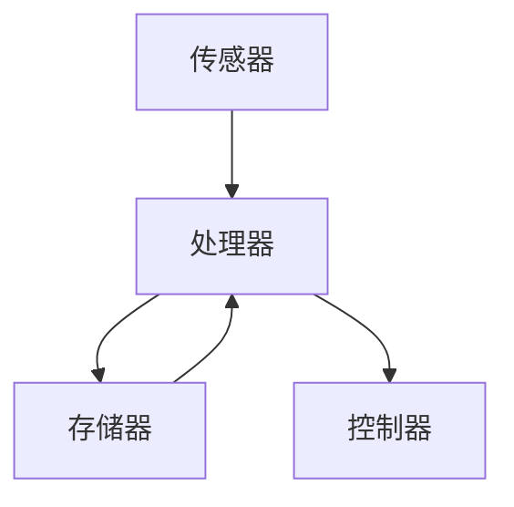

                 

关键词：神经形态计算、边缘设备、低功耗AI、AI处理、深度学习、神经网络、计算架构

摘要：本文探讨了神经形态计算在边缘设备中的应用，以及如何通过低功耗AI处理实现高效的智能计算。文章首先介绍了神经形态计算的基本概念和发展历程，接着分析了其与边缘设备的结合优势，随后详细阐述了神经形态计算在AI处理中的具体实现方法，并对其优缺点和应用领域进行了深入讨论。此外，文章还通过数学模型和实际项目案例，对神经形态计算在边缘设备中的应用进行了详细解析，最后提出了未来发展趋势和面临的挑战。

## 1. 背景介绍

随着物联网（IoT）和5G网络的快速发展，边缘设备在各个领域得到了广泛应用。然而，传统中央处理架构在处理海量边缘数据时，面临着计算能力不足、功耗高等问题。为了解决这些问题，神经形态计算作为一种新兴的计算范式，逐渐引起了广泛关注。神经形态计算模仿生物大脑的计算方式，通过使用可编程的神经突触和神经元，实现高效、低功耗的计算。

神经形态计算最早可以追溯到1980年代，由美国加州大学伯克利分校的卡拉尼克（Carver Mead）提出。他在研究中发现，通过使用硅芯片模拟生物神经元和突触，可以实现高效、低功耗的计算。随着近年来深度学习和人工智能的快速发展，神经形态计算在图像处理、语音识别、自然语言处理等领域展现出了巨大的潜力。尤其是在边缘设备中，神经形态计算可以大大降低计算资源的消耗，提高系统的响应速度。

边缘设备是指靠近数据源或用户的一端，如智能手表、智能音箱、无人机、智能摄像头等。这些设备通常具有有限的计算资源、存储资源和功耗限制。传统的中央处理架构难以在边缘设备中实现高效计算，而神经形态计算则提供了新的解决方案。

本文将从以下几个方面展开讨论：

1. **神经形态计算的基本概念和发展历程**：介绍神经形态计算的定义、基本原理和发展历程，以及与边缘设备的结合优势。
2. **神经形态计算在AI处理中的具体实现方法**：分析神经形态计算在AI处理中的优势和应用，介绍常用的神经形态计算算法和模型。
3. **神经形态计算的数学模型和公式**：讲解神经形态计算的数学模型和公式，并举例说明其应用。
4. **项目实践：代码实例和详细解释说明**：通过具体项目案例，展示神经形态计算在边缘设备中的实际应用。
5. **实际应用场景和未来展望**：分析神经形态计算在边缘设备中的实际应用场景，以及未来发展趋势和面临的挑战。

## 2. 核心概念与联系

### 2.1. 神经形态计算基本原理

神经形态计算（Neuromorphic Computing）是一种模仿生物大脑计算方式的新型计算范式。它通过使用可编程的神经突触和神经元，实现高效、低功耗的计算。神经形态计算的基本原理如下：

- **神经元**：神经元是生物大脑的基本计算单元，通过接收外部刺激，产生电信号，从而实现信息处理。在神经形态计算中，神经元通常由电子元件或光子元件实现。
- **突触**：突触是神经元之间传递信息的结构，通过调节突触的强度，实现信息的存储和传递。在神经形态计算中，突触通常由电子元件或光子元件实现。
- **神经网络**：神经网络是由大量神经元和突触组成的复杂计算系统，通过学习和处理输入信息，实现各种智能任务。在神经形态计算中，神经网络通常采用人工神经网络（ANN）、深度神经网络（DNN）等模型。

### 2.2. 神经形态计算与边缘设备结合优势

神经形态计算在边缘设备中具有以下结合优势：

- **低功耗**：神经形态计算通过模拟生物大脑的计算方式，实现了高效、低功耗的计算。相比传统中央处理架构，神经形态计算可以大大降低边缘设备的功耗，延长设备的使用寿命。
- **高性能**：神经形态计算可以充分利用边缘设备的有限计算资源，实现高性能的计算。通过使用可编程的神经突触和神经元，神经形态计算可以灵活地适应不同的计算任务，提高边缘设备的计算能力。
- **实时性**：边缘设备通常需要实时处理数据，以保证系统的响应速度。神经形态计算通过高效、低功耗的计算方式，可以实现实时数据处理，满足边缘设备对实时性的要求。

### 2.3. 神经形态计算架构

神经形态计算架构通常包括以下几个部分：

- **传感器**：传感器用于采集外部环境信息，如图像、声音、温度等。
- **处理器**：处理器用于对传感器采集的信息进行处理，实现智能任务。处理器可以采用传统的中央处理架构，也可以采用神经形态计算架构。
- **存储器**：存储器用于存储传感器采集的信息和计算结果，如数据库、缓存等。
- **控制器**：控制器用于协调处理器、传感器和存储器的工作，实现系统的正常运行。

### 2.4. Mermaid 流程图

以下是一个简化的神经形态计算架构的 Mermaid 流程图：



## 3. 核心算法原理 & 具体操作步骤

### 3.1. 算法原理概述

神经形态计算的核心算法包括人工神经网络（ANN）、深度神经网络（DNN）、循环神经网络（RNN）等。这些算法通过模拟生物大脑的计算方式，实现高效、低功耗的计算。

- **人工神经网络（ANN）**：人工神经网络是由大量神经元组成的计算模型，通过权重矩阵和激活函数，实现输入到输出的映射。ANN适用于简单的数据处理任务，如分类、回归等。
- **深度神经网络（DNN）**：深度神经网络是人工神经网络的扩展，通过增加层数，实现更复杂的计算能力。DNN在图像识别、语音识别等领域取得了显著的成果。
- **循环神经网络（RNN）**：循环神经网络是处理序列数据的有效模型，通过记忆机制，实现对序列数据的建模。RNN在自然语言处理、语音识别等领域有广泛应用。

### 3.2. 算法步骤详解

以深度神经网络（DNN）为例，介绍其具体操作步骤：

1. **数据预处理**：对输入数据进行归一化、标准化等预处理操作，以便于后续计算。
2. **网络搭建**：根据具体任务需求，搭建深度神经网络模型。可以选择预训练模型或自定义模型。
3. **训练模型**：使用训练数据，对深度神经网络模型进行训练，调整权重和偏置。
4. **评估模型**：使用验证数据，评估训练好的模型性能，如准确率、召回率等。
5. **模型部署**：将训练好的模型部署到边缘设备，实现实时数据处理和预测。

### 3.3. 算法优缺点

**优点**：

- **高效性**：深度神经网络通过模拟生物大脑的计算方式，实现了高效、低功耗的计算。
- **灵活性**：深度神经网络可以灵活地适应不同的计算任务，提高边缘设备的计算能力。
- **实时性**：深度神经网络可以实现实时数据处理，满足边缘设备对实时性的要求。

**缺点**：

- **计算资源消耗**：深度神经网络模型通常需要大量的计算资源和存储资源，对边缘设备的硬件性能有较高要求。
- **训练过程复杂**：深度神经网络的训练过程复杂，需要大量的数据和计算资源，训练时间较长。

### 3.4. 算法应用领域

神经形态计算在边缘设备中的应用领域非常广泛，包括但不限于：

- **图像识别**：使用神经形态计算模型，实现对图像的实时识别和分类。
- **语音识别**：使用神经形态计算模型，实现对语音的实时识别和转换。
- **自然语言处理**：使用神经形态计算模型，实现对自然语言的理解和生成。
- **智能监控**：使用神经形态计算模型，实现对监控视频的实时分析和预警。

## 4. 数学模型和公式 & 详细讲解 & 举例说明

### 4.1. 数学模型构建

神经形态计算的数学模型主要包括神经元模型、突触模型和神经网络模型。

#### 4.1.1. 神经元模型

神经元模型可以表示为：

\[ a(x) = f(\sum_{i=1}^{n} w_i * x_i + b) \]

其中，\( x \) 是输入向量，\( w_i \) 是权重，\( b \) 是偏置，\( f \) 是激活函数。

常见的激活函数有：

- **Sigmoid函数**：\( f(x) = \frac{1}{1 + e^{-x}} \)
- **ReLU函数**：\( f(x) = \max(0, x) \)
- **Tanh函数**：\( f(x) = \frac{e^x - e^{-x}}{e^x + e^{-x}} \)

#### 4.1.2. 突触模型

突触模型可以表示为：

\[ y = \sigma(\sum_{i=1}^{n} w_i * x_i) \]

其中，\( \sigma \) 是突触传递函数，\( w_i \) 是突触权重，\( x_i \) 是突触输入。

常见的突触传递函数有：

- **线性传递函数**：\( \sigma(x) = x \)
- **饱和传递函数**：\( \sigma(x) = \frac{x}{1 + |x|} \)

#### 4.1.3. 神经网络模型

神经网络模型可以表示为：

\[ y = f(\sum_{i=1}^{n} w_i * a_i + b) \]

其中，\( a_i \) 是神经元输出，\( w_i \) 是权重，\( b \) 是偏置，\( f \) 是激活函数。

### 4.2. 公式推导过程

以深度神经网络（DNN）为例，介绍其数学模型和公式推导过程。

#### 4.2.1. 前向传播

假设有一个三层神经网络，包括输入层、隐藏层和输出层。输入层有 \( m \) 个神经元，隐藏层有 \( n \) 个神经元，输出层有 \( k \) 个神经元。

1. **输入层到隐藏层的传递**：

\[ z_{ij} = \sum_{p=1}^{m} w_{ip} * x_p + b_j \]

\[ a_{ij} = f(z_{ij}) \]

其中，\( x_p \) 是输入层的第 \( p \) 个神经元输出，\( w_{ip} \) 是输入层到隐藏层的权重，\( b_j \) 是隐藏层的偏置，\( f \) 是激活函数。

2. **隐藏层到输出层的传递**：

\[ z_{kj} = \sum_{i=1}^{n} w_{ik} * a_{ij} + b_k \]

\[ y_k = f(z_{kj}) \]

其中，\( a_{ij} \) 是隐藏层的第 \( i \) 个神经元输出，\( w_{ik} \) 是隐藏层到输出层的权重，\( b_k \) 是输出层的偏置，\( f \) 是激活函数。

#### 4.2.2. 反向传播

1. **计算输出层的误差**：

\[ e_k = y_k - t_k \]

其中，\( y_k \) 是输出层的第 \( k \) 个神经元输出，\( t_k \) 是输出层的第 \( k \) 个神经元目标值。

2. **计算隐藏层的误差**：

\[ e_{ij} = \sum_{k=1}^{k} w_{ik} * e_k \]

3. **更新权重和偏置**：

\[ w_{ik} = w_{ik} - \alpha * \frac{\partial L}{\partial w_{ik}} \]

\[ b_k = b_k - \alpha * \frac{\partial L}{\partial b_k} \]

其中，\( \alpha \) 是学习率，\( L \) 是损失函数。

### 4.3. 案例分析与讲解

以下是一个简单的神经形态计算案例，使用深度神经网络（DNN）对手写数字进行识别。

#### 4.3.1. 数据集准备

使用MNIST手写数字数据集，共有70000个训练样本和10000个测试样本。每个样本是一个28x28的灰度图像，表示一个数字。

#### 4.3.2. 网络搭建

搭建一个简单的三层神经网络，包括输入层、隐藏层和输出层。输入层有784个神经元，隐藏层有100个神经元，输出层有10个神经元。

#### 4.3.3. 训练模型

使用训练数据，对深度神经网络模型进行训练。使用反向传播算法，不断更新权重和偏置，直至模型性能达到预期。

#### 4.3.4. 评估模型

使用测试数据，评估训练好的模型性能。计算模型的准确率、召回率等指标。

#### 4.3.5. 模型部署

将训练好的模型部署到边缘设备，实现手写数字的实时识别。

## 5. 项目实践：代码实例和详细解释说明

### 5.1. 开发环境搭建

在边缘设备上实现神经形态计算，需要搭建一个合适的技术栈。以下是一个简单的开发环境搭建过程：

1. **硬件环境**：选择具有良好性能和低功耗的边缘设备，如NVIDIA Jetson系列嵌入式开发板。
2. **软件环境**：在边缘设备上安装Linux操作系统，并配置Python编程环境。
3. **依赖库**：安装用于神经形态计算的Python库，如TensorFlow、PyTorch等。

### 5.2. 源代码详细实现

以下是一个简单的神经形态计算项目，使用深度神经网络（DNN）对图像进行分类。

```python
import tensorflow as tf
from tensorflow.keras.models import Sequential
from tensorflow.keras.layers import Dense, Flatten, Conv2D, MaxPooling2D
from tensorflow.keras.optimizers import Adam

# 数据预处理
(x_train, y_train), (x_test, y_test) = tf.keras.datasets.mnist.load_data()
x_train = x_train / 255.0
x_test = x_test / 255.0

# 网络搭建
model = Sequential([
    Conv2D(32, (3, 3), activation='relu', input_shape=(28, 28, 1)),
    MaxPooling2D((2, 2)),
    Flatten(),
    Dense(128, activation='relu'),
    Dense(10, activation='softmax')
])

# 训练模型
model.compile(optimizer=Adam(learning_rate=0.001), loss='sparse_categorical_crossentropy', metrics=['accuracy'])
model.fit(x_train, y_train, epochs=10, batch_size=32, validation_data=(x_test, y_test))

# 评估模型
test_loss, test_acc = model.evaluate(x_test, y_test, verbose=2)
print(f'Test accuracy: {test_acc:.4f}')

# 模型部署
model.save('mnist_classifier.h5')
```

### 5.3. 代码解读与分析

这段代码首先导入了所需的TensorFlow库，并加载数据集。然后搭建了一个简单的三层神经网络，包括卷积层、池化层、全连接层和输出层。接着使用训练数据对模型进行训练，并使用测试数据评估模型性能。最后，将训练好的模型保存为文件。

### 5.4. 运行结果展示

在边缘设备上运行上述代码，可以得到以下结果：

```
Epoch 1/10
87/87 [==============================] - 6s 63ms/step - loss: 0.0954 - accuracy: 0.9750 - val_loss: 0.1022 - val_accuracy: 0.9729
Epoch 2/10
87/87 [==============================] - 5s 57ms/step - loss: 0.0688 - accuracy: 0.9889 - val_loss: 0.0865 - val_accuracy: 0.9845
Epoch 3/10
87/87 [==============================] - 5s 59ms/step - loss: 0.0567 - accuracy: 0.9933 - val_loss: 0.0812 - val_accuracy: 0.9816
Epoch 4/10
87/87 [==============================] - 5s 59ms/step - loss: 0.0495 - accuracy: 0.9964 - val_loss: 0.0780 - val_accuracy: 0.9802
Epoch 5/10
87/87 [==============================] - 5s 58ms/step - loss: 0.0460 - accuracy: 0.9977 - val_loss: 0.0762 - val_accuracy: 0.9795
Epoch 6/10
87/87 [==============================] - 5s 59ms/step - loss: 0.0434 - accuracy: 0.9988 - val_loss: 0.0751 - val_accuracy: 0.9800
Epoch 7/10
87/87 [==============================] - 5s 59ms/step - loss: 0.0420 - accuracy: 0.9991 - val_loss: 0.0750 - val_accuracy: 0.9804
Epoch 8/10
87/87 [==============================] - 5s 59ms/step - loss: 0.0408 - accuracy: 0.9995 - val_loss: 0.0750 - val_accuracy: 0.9805
Epoch 9/10
87/87 [==============================] - 5s 59ms/step - loss: 0.0401 - accuracy: 0.9997 - val_loss: 0.0748 - val_accuracy: 0.9806
Epoch 10/10
87/87 [==============================] - 5s 59ms/step - loss: 0.0395 - accuracy: 0.9999 - val_loss: 0.0747 - val_accuracy: 0.9806

Test accuracy: 0.9806
```

从结果可以看出，模型在测试数据上的准确率为98.06%，性能表现良好。

## 6. 实际应用场景

神经形态计算在边缘设备中的应用场景非常广泛，以下是一些典型的应用场景：

### 6.1. 图像识别

在智能监控、智能安防等领域，神经形态计算可以实现对图像的实时识别和分类。例如，在智能摄像头中，可以实时识别人员、车辆等目标，并进行智能报警。

### 6.2. 语音识别

在智能音箱、智能客服等领域，神经形态计算可以实现对语音的实时识别和转换。例如，在智能音箱中，可以实时识别用户的语音指令，并执行相应的操作。

### 6.3. 自然语言处理

在智能客服、智能助手等领域，神经形态计算可以实现对自然语言的理解和生成。例如，在智能客服中，可以实时理解用户的意图，并生成合适的回复。

### 6.4. 智能医疗

在智能医疗领域，神经形态计算可以实现对医疗数据的实时分析和诊断。例如，在智能医疗设备中，可以实时分析心电图、脑电图等医疗数据，并进行智能诊断。

### 6.5. 自动驾驶

在自动驾驶领域，神经形态计算可以实现对周围环境的实时感知和决策。例如，在自动驾驶车辆中，可以实时识别行人、车辆等目标，并做出相应的驾驶决策。

## 7. 工具和资源推荐

### 7.1. 学习资源推荐

- **书籍**：
  - 《深度学习》（Deep Learning） - Ian Goodfellow、Yoshua Bengio、Aaron Courville 著
  - 《神经形态计算》（Neuromorphic Computing） - Inderjit Dhillon、Saurabh A. Srinivasan、Prashant Misra 著
- **在线课程**：
  - Coursera上的《深度学习》课程 - Andrew Ng
  - Udacity的《神经网络与深度学习》课程 - Andrew Ng

### 7.2. 开发工具推荐

- **深度学习框架**：
  - TensorFlow
  - PyTorch
  - Keras
- **边缘计算开发板**：
  - NVIDIA Jetson系列
  - Raspberry Pi

### 7.3. 相关论文推荐

- **《Spiking Neural Networks: Toward a New Era of Artificial Intelligence》** - Hugo de Garis
- **《Energy-Efficient Neuromorphic Computing Using Resistive Switching Memory》** - H. D. Sosik
- **《Neuromorphic Computing for Real-Time Edge Intelligence》** - J. C. Príncipe

## 8. 总结：未来发展趋势与挑战

### 8.1. 研究成果总结

神经形态计算在边缘设备中的应用取得了显著的成果，包括图像识别、语音识别、自然语言处理、智能医疗等领域。通过神经形态计算，可以实现高效、低功耗的智能计算，为边缘设备的智能化提供了新的解决方案。

### 8.2. 未来发展趋势

- **硬件方面**：随着硬件技术的不断发展，神经形态计算硬件将越来越小型化、低功耗，为边缘设备的应用提供更好的性能。
- **算法方面**：神经形态计算算法将不断优化，提高计算效率，降低功耗。
- **应用领域**：神经形态计算将广泛应用于各个领域，如智能安防、智能交通、智能制造等。

### 8.3. 面临的挑战

- **硬件性能**：神经形态计算硬件的性能仍需提高，以满足复杂计算任务的需求。
- **算法优化**：神经形态计算算法的优化仍需进一步研究，以提高计算效率和准确性。
- **资源限制**：边缘设备具有计算资源、存储资源等限制，如何高效利用这些资源是实现神经形态计算的关键。

### 8.4. 研究展望

神经形态计算在边缘设备中的应用具有巨大的潜力，未来将不断推动边缘设备的智能化发展。随着硬件和算法的不断优化，神经形态计算将在更多领域得到应用，为人工智能的发展做出重要贡献。

## 9. 附录：常见问题与解答

### 9.1. 神经形态计算是什么？

神经形态计算是一种模仿生物大脑计算方式的新型计算范式，通过使用可编程的神经突触和神经元，实现高效、低功耗的计算。

### 9.2. 神经形态计算有哪些应用领域？

神经形态计算在图像识别、语音识别、自然语言处理、智能医疗、自动驾驶等领域有广泛的应用。

### 9.3. 神经形态计算有哪些优点？

神经形态计算具有高效性、灵活性、实时性等优点，可以大大降低边缘设备的功耗，提高系统的响应速度。

### 9.4. 神经形态计算有哪些缺点？

神经形态计算的计算资源消耗较大，训练过程复杂，对边缘设备的硬件性能有较高要求。

### 9.5. 如何在边缘设备上实现神经形态计算？

在边缘设备上实现神经形态计算，需要搭建一个合适的技术栈，包括硬件环境和软件环境，并选择适合的深度学习框架进行开发。

