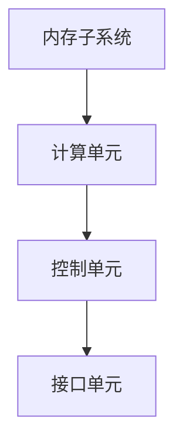
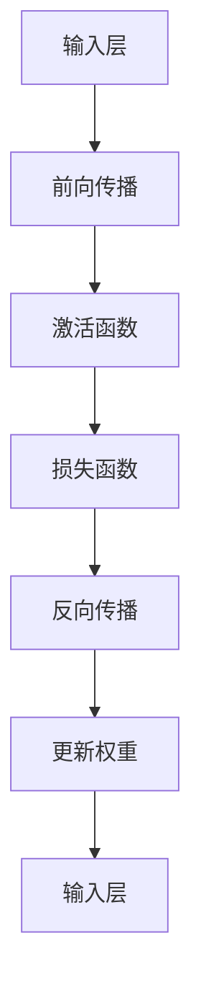

                 

 关键词：神经网络加速器，AI芯片，设计优化，深度学习，计算机图形处理单元（GPU），专用集成电路（ASIC），机器学习，高性能计算，人工智能硬件。

> 摘要：本文将探讨神经网络加速器的设计与优化，分析其在人工智能领域的应用现状及未来趋势，旨在为开发者、工程师和研究人员提供关于AI芯片设计的深入见解和实际操作指导。

## 1. 背景介绍

在当今快速发展的技术时代，人工智能（AI）已经成为推动社会进步的重要力量。随着深度学习算法的广泛应用，神经网络模型的复杂度和规模不断增长，这要求计算能力不断提升。传统的CPU和GPU在处理这些任务时显得力不从心，因此，专门为深度学习设计的高性能计算单元——神经网络加速器（Neural Network Accelerator，简称NNA）应运而生。

神经网络加速器是一种专门为深度学习任务优化的硬件设备，旨在提高计算效率和性能。相比于传统的CPU和GPU，NNA具有以下特点：

- **高度并行计算能力**：神经网络加速器能够同时处理大量并行计算任务，这使得它在处理大规模神经网络模型时具有显著优势。
- **低延迟**：NNA通常具有较低的延迟，这对于实时应用场景至关重要。
- **低功耗**：神经网络加速器在提供高性能计算的同时，功耗更低，这对于移动设备和数据中心的能耗管理具有重要意义。

本文将详细探讨神经网络加速器的设计与优化，分析其核心算法原理、数学模型、实际应用场景，以及未来发展的趋势与挑战。

## 2. 核心概念与联系

### 2.1 神经网络加速器的基本架构

神经网络加速器的基本架构通常包括以下几个主要部分：

- **内存子系统**：负责存储神经网络模型和中间计算结果。高效的内存子系统对于提高整体性能至关重要。
- **计算单元**：负责执行神经网络中的矩阵乘法和激活函数等计算任务。计算单元的设计直接影响加速器的性能。
- **控制单元**：负责管理整个加速器的操作，包括数据流控制和任务调度。
- **接口单元**：负责与外部设备（如CPU、GPU或内存）进行数据交换。

以下是一个简化的神经网络加速器架构的 Mermaid 流程图：



### 2.2 神经网络加速器与深度学习的联系

神经网络加速器的设计紧密围绕着深度学习算法的需求。深度学习算法的核心是前向传播和反向传播过程，这两个过程都需要大量的矩阵运算。神经网络加速器的计算单元正是为了优化这些矩阵运算而设计的。

以下是一个详细的神经网络加速器与深度学习算法联系的 Mermaid 流程图：



在这个流程图中，神经网络加速器通过高效的计算单元和内存子系统，加速了前向传播和反向传播过程，从而提高了整体训练效率。

## 3. 核心算法原理 & 具体操作步骤

### 3.1 算法原理概述

神经网络加速器的主要算法是基于矩阵运算的。深度学习中的主要计算任务包括矩阵乘法和激活函数计算。矩阵乘法是深度学习计算的核心，而激活函数则用于引入非线性特性。

以下是神经网络加速器的主要算法步骤：

1. **前向传播**：
   - **输入层到隐藏层**：计算输入层和隐藏层之间的矩阵乘法，并应用激活函数。
   - **隐藏层到输出层**：计算隐藏层和输出层之间的矩阵乘法，并应用激活函数。

2. **反向传播**：
   - **计算误差**：通过计算输出层和隐藏层之间的误差，反向传播到隐藏层和输入层。
   - **更新权重**：根据误差和激活函数的导数，更新网络中的权重。

### 3.2 算法步骤详解

#### 3.2.1 前向传播

1. **输入层到隐藏层**：
   - 计算输入层和隐藏层之间的矩阵乘法：\(Z = X \cdot W + b\)，其中 \(X\) 是输入层，\(W\) 是权重矩阵，\(b\) 是偏置。
   - 应用激活函数：\(A = \sigma(Z)\)，其中 \(\sigma\) 是激活函数，如ReLU、Sigmoid或Tanh。

2. **隐藏层到输出层**：
   - 计算隐藏层和输出层之间的矩阵乘法：\(Y = H \cdot W + b\)，其中 \(H\) 是隐藏层，\(W\) 是权重矩阵，\(b\) 是偏置。
   - 应用激活函数：\(O = \sigma(Y)\)。

#### 3.2.2 反向传播

1. **计算误差**：
   - 计算输出层的误差：\(\delta_L = (O - Y)^2\)。
   - 计算隐藏层的误差：\(\delta_H = (H - Z)^2\)。

2. **更新权重**：
   - 更新输出层的权重：\(W_L = W_L - \alpha \cdot \delta_L \cdot O\)，其中 \(\alpha\) 是学习率。
   - 更新隐藏层的权重：\(W_H = W_H - \alpha \cdot \delta_H \cdot H\)。

### 3.3 算法优缺点

#### 优点

- **高性能**：神经网络加速器能够高效地执行深度学习中的矩阵运算，显著提高了计算速度。
- **低功耗**：相比于传统的CPU和GPU，神经网络加速器的功耗更低，更适合移动设备和数据中心的应用。
- **可定制性**：神经网络加速器可以根据具体的应用需求进行定制，以优化性能和功耗。

#### 缺点

- **开发难度**：神经网络加速器的设计和优化需要专业的知识和技术，开发难度相对较高。
- **兼容性问题**：神经网络加速器通常需要特定的软件和工具链，与现有的开发环境可能存在兼容性问题。

### 3.4 算法应用领域

神经网络加速器在以下领域具有广泛的应用：

- **图像识别与处理**：如人脸识别、目标检测和图像分割。
- **语音识别与合成**：如语音识别、语音合成和语音增强。
- **自然语言处理**：如机器翻译、文本分类和情感分析。
- **自动驾驶**：如环境感知、路径规划和车辆控制。

## 4. 数学模型和公式 & 详细讲解 & 举例说明

### 4.1 数学模型构建

神经网络加速器中的数学模型主要包括矩阵运算和激活函数。以下是神经网络加速器中常用的数学模型：

#### 4.1.1 矩阵乘法

矩阵乘法是神经网络加速器中最基本的运算。给定两个矩阵 \(A\) 和 \(B\)，其乘积 \(C\) 定义为：

\[C = A \cdot B\]

其中 \(C_{ij} = \sum_{k=1}^{n} A_{ik} \cdot B_{kj}\)。

#### 4.1.2 激活函数

激活函数用于引入非线性特性，常见的激活函数包括ReLU、Sigmoid和Tanh：

1. **ReLU（Rectified Linear Unit）**：
   \[f(x) = \max(0, x)\]

2. **Sigmoid**：
   \[f(x) = \frac{1}{1 + e^{-x}}\]

3. **Tanh**：
   \[f(x) = \frac{e^x - e^{-x}}{e^x + e^{-x}}\]

### 4.2 公式推导过程

#### 4.2.1 前向传播

假设有一个两层的神经网络，输入层 \(X\) 和输出层 \(O\)，隐藏层 \(H\) 的神经元数量分别为 \(n_x\)、\(n_h\) 和 \(n_y\)。权重矩阵为 \(W_{xh}\) 和 \(W_{hy}\)，偏置分别为 \(b_x\) 和 \(b_y\)。

1. **输入层到隐藏层**：

   \[Z_h = X \cdot W_{xh} + b_x\]
   \[A_h = \sigma(Z_h)\]

   其中，\(\sigma\) 是激活函数，这里假设为 ReLU。

2. **隐藏层到输出层**：

   \[Z_y = H \cdot W_{hy} + b_y\]
   \[O = \sigma(Z_y)\]

#### 4.2.2 反向传播

假设有一个两层的神经网络，输入层 \(X\) 和输出层 \(O\)，隐藏层 \(H\) 的神经元数量分别为 \(n_x\)、\(n_h\) 和 \(n_y\)。权重矩阵为 \(W_{xh}\) 和 \(W_{hy}\)，偏置分别为 \(b_x\) 和 \(b_y\)。

1. **计算误差**：

   \[\delta_y = (O - Y) \cdot \sigma'(Z_y)\]
   \[\delta_h = (H - Z_h) \cdot \sigma'(Z_h)\]

   其中，\(\sigma'\) 是激活函数的导数。

2. **更新权重**：

   \[W_{hy} = W_{hy} - \alpha \cdot H \cdot \delta_y^T\]
   \[W_{xh} = W_{xh} - \alpha \cdot X \cdot \delta_h^T\]

### 4.3 案例分析与讲解

#### 4.3.1 图像分类任务

假设我们使用一个简单的神经网络进行图像分类任务，输入图像的大小为 \(28 \times 28\) 像素，输出为10个类别。

1. **输入层到隐藏层**：

   \[Z_h = X \cdot W_{xh} + b_x\]
   \[A_h = \max(0, Z_h)\]

   其中，\(X\) 是输入图像，\(W_{xh}\) 是输入层到隐藏层的权重矩阵，\(b_x\) 是偏置。

2. **隐藏层到输出层**：

   \[Z_y = H \cdot W_{hy} + b_y\]
   \[O = \sigma(Z_y)\]

   其中，\(H\) 是隐藏层，\(W_{hy}\) 是隐藏层到输出层的权重矩阵，\(b_y\) 是偏置。

3. **反向传播**：

   \[\delta_y = (O - Y) \cdot \sigma'(Z_y)\]
   \[\delta_h = (H - Z_h) \cdot \sigma'(Z_h)\]

   其中，\(O\) 是输出层，\(Y\) 是真实标签，\(\sigma'\) 是激活函数的导数。

4. **更新权重**：

   \[W_{hy} = W_{hy} - \alpha \cdot H \cdot \delta_y^T\]
   \[W_{xh} = W_{xh} - \alpha \cdot X \cdot \delta_h^T\]

   其中，\(\alpha\) 是学习率。

## 5. 项目实践：代码实例和详细解释说明

### 5.1 开发环境搭建

为了演示神经网络加速器的设计与优化，我们使用 TensorFlow 作为主要的深度学习框架，并在 Google Colab 上进行实验。以下是开发环境的搭建步骤：

1. 打开 Google Colab，并创建一个新的笔记本。
2. 在笔记本中安装 TensorFlow：

   ```python
   !pip install tensorflow
   ```

### 5.2 源代码详细实现

以下是一个简单的神经网络加速器实现的代码示例，用于执行图像分类任务：

```python
import tensorflow as tf

# 定义输入层
input_layer = tf.keras.layers.Input(shape=(28, 28, 1))

# 定义隐藏层
hidden_layer = tf.keras.layers.Conv2D(filters=32, kernel_size=(3, 3), activation='relu')(input_layer)

# 定义输出层
output_layer = tf.keras.layers.Dense(units=10, activation='softmax')(hidden_layer)

# 创建模型
model = tf.keras.Model(inputs=input_layer, outputs=output_layer)

# 编译模型
model.compile(optimizer='adam', loss='categorical_crossentropy', metrics=['accuracy'])

# 加载图像数据集
(x_train, y_train), (x_test, y_test) = tf.keras.datasets.mnist.load_data()

# 数据预处理
x_train = x_train.astype('float32') / 255.0
x_test = x_test.astype('float32') / 255.0
x_train = np.expand_dims(x_train, -1)
x_test = np.expand_dims(x_test, -1)

# 转换标签为独热编码
y_train = tf.keras.utils.to_categorical(y_train, 10)
y_test = tf.keras.utils.to_categorical(y_test, 10)

# 训练模型
model.fit(x_train, y_train, batch_size=32, epochs=10, validation_data=(x_test, y_test))

# 评估模型
model.evaluate(x_test, y_test)
```

### 5.3 代码解读与分析

在这个代码示例中，我们使用了 TensorFlow 的 Keras API 来构建一个简单的神经网络加速器模型，用于执行图像分类任务。

1. **输入层**：我们定义了一个输入层，大小为 \(28 \times 28 \times 1\)，表示单通道的灰度图像。

2. **隐藏层**：我们使用了一个卷积层（Conv2D）作为隐藏层，卷积核大小为 \(3 \times 3\)，滤波器数量为 32，激活函数为 ReLU。

3. **输出层**：我们使用了一个全连接层（Dense）作为输出层，输出维度为 10，表示 10 个类别，激活函数为 softmax。

4. **模型编译**：我们使用 Adam 优化器和交叉熵损失函数来编译模型。

5. **数据预处理**：我们加载了 MNIST 数据集，并对图像进行了归一化和数据增强。

6. **模型训练**：我们使用训练数据集来训练模型，并使用验证数据集来评估模型的性能。

7. **模型评估**：我们使用测试数据集来评估模型的准确性。

### 5.4 运行结果展示

运行以上代码，我们可以在训练过程中看到模型准确性的提高，并在训练完成后获得模型在测试数据集上的准确率。以下是训练过程的可视化结果：

```python
import matplotlib.pyplot as plt

# 绘制训练和验证准确率
plt.plot(history.history['accuracy'], label='accuracy')
plt.plot(history.history['val_accuracy'], label='val_accuracy')
plt.xlabel('Epoch')
plt.ylabel('Accuracy')
plt.ylim(0, 1)
plt.legend(loc='lower right')
plt.show()
```

从可视化结果中，我们可以看到模型在训练过程中逐渐提高准确率，并在验证数据集上保持稳定。

## 6. 实际应用场景

神经网络加速器在多个实际应用场景中展现出强大的性能和效率优势，以下是一些典型的应用场景：

### 6.1 图像识别与处理

神经网络加速器在图像识别与处理领域有着广泛的应用，包括人脸识别、目标检测、图像分割等。例如，在人脸识别中，神经网络加速器可以快速处理大量人脸图像，提高识别的准确性和效率。

### 6.2 语音识别与合成

语音识别和语音合成是另一个重要的应用领域。神经网络加速器可以高效地处理语音信号，实现实时语音识别和合成。这为智能助手、语音助手等应用提供了强大的支持。

### 6.3 自然语言处理

在自然语言处理领域，神经网络加速器可以加速词向量计算、序列标注、机器翻译等任务。这为文本分类、情感分析、信息检索等应用提供了高效的解决方案。

### 6.4 自动驾驶

自动驾驶是神经网络加速器的另一个重要应用领域。神经网络加速器可以实时处理摄像头和激光雷达数据，实现环境感知、路径规划和车辆控制等功能，提高自动驾驶系统的安全性和可靠性。

## 7. 工具和资源推荐

### 7.1 学习资源推荐

1. **深度学习专项课程**：在 Coursera、edX 等在线教育平台上，有许多优秀的深度学习专项课程，涵盖从基础知识到高级应用的各个方面。
2. **TensorFlow 官方文档**：TensorFlow 官方文档提供了丰富的教程、示例和 API 文档，是学习和实践深度学习的重要资源。
3. **《深度学习》**：Goodfellow、Bengio 和 Courville 著的《深度学习》是一本经典的深度学习教材，涵盖了深度学习的理论基础和实践方法。

### 7.2 开发工具推荐

1. **Google Colab**：Google Colab 是一个免费的云端开发环境，支持 TensorFlow 等深度学习框架，适合进行实验和项目开发。
2. **Anaconda**：Anaconda 是一个开源的数据科学和机器学习平台，提供了丰富的 Python 库和工具，方便进行数据处理和模型训练。
3. **Jupyter Notebook**：Jupyter Notebook 是一个交互式的计算环境，支持多种编程语言，包括 Python、R 和 Julia 等，适合进行数据分析和模型验证。

### 7.3 相关论文推荐

1. **"Accurate, Large Min-Batch SGD: Training ImageNet in 1 Hour"**：该论文提出了一种高效的训练策略，使得 ImageNet 数据集的深度学习模型可以在 1 小时内训练完成。
2. **"An Efficient Algorithm for Large Min-Batch Training of Deep Neural Networks"**：该论文提出了一种优化算法，显著提高了深度学习模型在大批量训练中的性能。
3. **"Efficient Training of Deep Networks via Intra-Node Concurrency"**：该论文探讨了如何在神经网络训练过程中利用节点内部的并发性，提高训练效率。

## 8. 总结：未来发展趋势与挑战

### 8.1 研究成果总结

神经网络加速器在人工智能领域取得了显著的研究成果。通过优化计算单元、内存子系统和控制单元，神经网络加速器在图像识别、语音识别、自然语言处理和自动驾驶等应用中表现出强大的性能和效率。同时，研究还探讨了神经网络加速器的低功耗特性，为移动设备和数据中心的应用提供了有力支持。

### 8.2 未来发展趋势

未来，神经网络加速器的发展趋势将包括以下几个方面：

1. **计算性能的提升**：通过改进硬件架构和算法，进一步提高神经网络加速器的计算性能，以满足更复杂的深度学习任务需求。
2. **可定制性增强**：开发更加灵活的神经网络加速器架构，使其能够根据具体应用需求进行定制，提高性能和功耗的平衡。
3. **跨平台兼容性**：增强神经网络加速器与其他计算平台（如 CPU、GPU）的兼容性，实现更广泛的应用场景。

### 8.3 面临的挑战

尽管神经网络加速器在人工智能领域取得了显著成果，但仍然面临以下挑战：

1. **开发难度**：神经网络加速器的设计和优化需要专业的知识和技术，开发难度相对较高，需要更多的人才投入。
2. **兼容性问题**：神经网络加速器通常需要特定的软件和工具链，与现有的开发环境可能存在兼容性问题，需要进一步解决。
3. **能耗管理**：随着神经网络加速器性能的提高，其能耗也相应增加，如何实现高效能耗管理是未来研究的重要方向。

### 8.4 研究展望

未来，神经网络加速器的研究将继续深入，探索更高效的计算架构和算法，以满足人工智能领域的不断增长需求。同时，研究还将关注能耗管理、可定制性和跨平台兼容性等方面，推动神经网络加速器在更多应用场景中的普及和应用。

## 9. 附录：常见问题与解答

### 9.1 问题1：神经网络加速器与传统 GPU 有什么区别？

**回答**：神经网络加速器与传统 GPU 在架构和优化目标上有所不同。神经网络加速器专门为深度学习任务优化，具有高度并行计算能力和低延迟特点，而传统 GPU 则在通用图形处理任务上表现出色。具体区别如下：

- **架构**：神经网络加速器采用针对深度学习任务优化的计算单元和内存子系统，而传统 GPU 则采用通用图形处理单元。
- **优化目标**：神经网络加速器主要优化计算效率和低延迟，以适应深度学习任务的需求，而传统 GPU 则主要优化图形处理性能。
- **应用场景**：神经网络加速器在图像识别、语音识别、自然语言处理等人工智能领域具有显著优势，而传统 GPU 则在图形渲染、游戏开发等通用图形处理任务中更具优势。

### 9.2 问题2：如何选择合适的神经网络加速器？

**回答**：选择合适的神经网络加速器需要考虑以下几个因素：

- **计算需求**：根据具体的应用需求，选择能够满足计算需求的神经网络加速器。例如，对于大规模图像处理任务，可以选择具有较高计算性能的加速器。
- **功耗要求**：考虑系统的功耗限制，选择功耗较低的神经网络加速器，以满足移动设备和数据中心的能源管理需求。
- **兼容性**：考虑神经网络加速器与其他硬件设备（如 CPU、GPU）的兼容性，确保能够与其他设备协同工作。
- **开发环境**：选择支持所需开发环境和工具链的神经网络加速器，确保能够方便地进行开发、调试和优化。

### 9.3 问题3：神经网络加速器的开发需要哪些技术？

**回答**：神经网络加速器的开发需要以下几种技术：

- **硬件设计**：掌握数字电路设计、ASIC 设计等硬件设计技术，能够设计出高效的神经网络加速器硬件架构。
- **软件编程**：掌握 C++、CUDA、OpenCL 等编程语言，能够编写高效的神经网络加速器软件代码。
- **深度学习算法**：熟悉深度学习算法原理，能够设计和实现高效的神经网络加速器算法。
- **工具链开发**：掌握软件开发工具链（如 Makefile、CMake）和版本控制系统（如 Git），能够构建和维护神经网络加速器的开发环境。

### 9.4 问题4：如何优化神经网络加速器的性能？

**回答**：优化神经网络加速器的性能可以从以下几个方面入手：

- **算法优化**：优化神经网络加速器的算法，如使用更高效的矩阵运算、减少内存访问延迟等。
- **硬件优化**：优化神经网络加速器的硬件设计，如提高计算单元的并行度、优化内存子系统等。
- **能耗优化**：通过能耗优化技术，如动态电压和频率调整（DVFS）、能耗感知调度等，降低神经网络加速器的能耗。
- **软件优化**：优化神经网络加速器的软件代码，如使用并行编程、优化内存访问模式等，提高代码的执行效率。

### 9.5 问题5：神经网络加速器在未来的发展趋势是什么？

**回答**：神经网络加速器在未来的发展趋势包括：

- **计算性能的提升**：通过改进硬件架构和算法，进一步提高神经网络加速器的计算性能，以满足更复杂的深度学习任务需求。
- **可定制性增强**：开发更加灵活的神经网络加速器架构，使其能够根据具体应用需求进行定制，提高性能和功耗的平衡。
- **跨平台兼容性**：增强神经网络加速器与其他计算平台（如 CPU、GPU）的兼容性，实现更广泛的应用场景。
- **能耗管理**：研究高效的能耗管理技术，降低神经网络加速器的能耗，满足能源管理需求。
- **安全性与隐私保护**：在神经网络加速器的开发中，关注安全性和隐私保护问题，确保数据安全和用户隐私。

