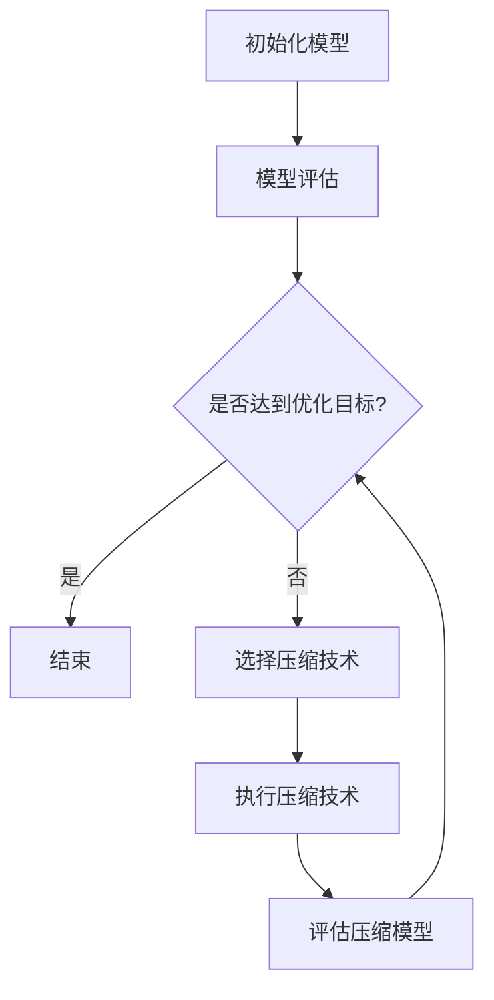

                 

关键词：神经网络压缩、深度学习、移动设备、模型压缩、量化、剪枝、低功耗

> 摘要：本文将探讨神经网络压缩技术，重点关注其在移动设备上的应用。通过分析神经网络压缩的核心概念、算法原理以及具体实施步骤，我们旨在为开发者提供实用的指南，助力构建高效、低功耗的移动设备深度学习应用。

## 1. 背景介绍

随着智能手机和平板电脑的普及，移动设备的计算能力迅速提升，但功耗和存储空间仍然是制约深度学习应用扩展的主要瓶颈。传统的深度学习模型通常在服务器或高性能计算平台上训练和部署，这些模型在移动设备上运行时往往过于庞大，无法满足移动计算的需求。因此，如何将深度学习模型压缩到适合移动设备运行的规模，同时保持较高的准确性和性能，成为了当前研究的热点问题。

神经网络压缩技术应运而生，通过多种方法对深度学习模型进行压缩，从而降低模型的参数数量和计算复杂度。压缩技术不仅提高了模型的移动适应性，还延长了设备电池寿命，降低了能耗。

本文将首先介绍神经网络压缩的基本概念和核心算法，然后详细讲解压缩技术的实现步骤和流程，并探讨其在移动设备上的应用场景。最后，我们将展望神经网络压缩技术的未来发展趋势，以及面临的挑战。

## 2. 核心概念与联系

### 2.1. 神经网络压缩

神经网络压缩（Neural Network Compression）是指通过优化深度学习模型的结构和参数，以减少模型的体积、计算复杂度和能耗的技术。压缩技术旨在在不显著牺牲模型性能的情况下，提高模型的移动适应性和效率。

### 2.2. 剪枝（Pruning）

剪枝是一种常见的神经网络压缩技术，通过删除网络中的某些神经元或连接，以减少模型的参数数量。剪枝可以显著降低模型的存储需求和计算复杂度，同时保留重要的网络结构。

### 2.3. 量化（Quantization）

量化是一种通过减少模型中数值表示的精度来压缩模型的技术。量化将浮点数参数转换为较低的精度，例如8位或16位整数。量化可以显著减少模型的存储和计算需求，同时保持较好的模型性能。

### 2.4. 混合精度训练（Mixed Precision Training）

混合精度训练是一种通过在训练过程中使用不同精度的数值来提高模型性能和降低功耗的技术。通常，混合精度训练结合了32位浮点和16位半精度浮点（FP16）的使用，从而在保证模型精度的情况下降低计算资源的需求。

### 2.5. Mermaid 流程图

以下是一个简单的 Mermaid 流程图，展示了神经网络压缩技术的主要步骤：



## 3. 核心算法原理 & 具体操作步骤

### 3.1. 算法原理概述

神经网络压缩技术主要包括剪枝、量化、混合精度训练等方法。每种方法都有其独特的原理和优势。

#### 剪枝

剪枝通过删除网络中不重要的神经元或连接，以减少模型的参数数量。剪枝可以分为两种：结构剪枝和权重剪枝。结构剪枝通过直接删除神经元或层，而权重剪枝则通过将权重较小的连接置为零。

#### 量化

量化通过降低模型参数的精度，从而减少模型的存储和计算需求。量化可以应用于权重和激活值，通常使用线性量化或非线性量化方法。

#### 混合精度训练

混合精度训练通过在训练过程中结合32位浮点和16位半精度浮点的使用，从而在保证模型精度的情况下降低计算资源的需求。混合精度训练通常使用深度学习框架的内置支持，例如PyTorch的`torch.cuda.amp`模块。

### 3.2. 算法步骤详解

以下是一个简化的神经网络压缩算法步骤：

1. **初始化模型**：选择一个预训练的深度学习模型，如VGG、ResNet等。
2. **模型评估**：在目标设备上评估模型性能，确保模型达到预期的准确性和效率。
3. **选择压缩技术**：根据模型和设备的特性，选择合适的压缩技术，如剪枝、量化或混合精度训练。
4. **执行压缩技术**：
   - **剪枝**：根据一定的阈值或策略，删除不重要的神经元或连接。
   - **量化**：将模型参数的精度降低到8位或16位。
   - **混合精度训练**：在训练过程中结合32位浮点和16位半精度浮点的使用。
5. **评估压缩模型**：在目标设备上重新评估压缩模型的性能，确保压缩后的模型达到预期效果。
6. **迭代优化**：根据评估结果，调整压缩参数，重复步骤3-5，直至达到优化目标。

### 3.3. 算法优缺点

#### 剪枝

优点：
- 显著减少模型参数数量，降低存储和计算需求。
- 可以提高模型在移动设备上的运行速度。

缺点：
- 可能会降低模型性能，尤其是在过度剪枝时。
- 需要选择合适的剪枝策略和阈值。

#### 量化

优点：
- 显著降低模型参数的存储和计算需求。
- 可以提高模型在移动设备上的运行速度。

缺点：
- 可能会降低模型精度，尤其是在量化误差较大时。

#### 混合精度训练

优点：
- 在保证模型精度的情况下，降低计算资源的需求。
- 可以提高模型在移动设备上的运行速度。

缺点：
- 需要处理精度误差，可能影响模型性能。
- 需要深度学习框架的支持。

### 3.4. 算法应用领域

神经网络压缩技术广泛应用于移动设备上的深度学习应用，如图像识别、语音识别、自然语言处理等。以下是一些具体的应用案例：

- **图像识别**：在移动设备上实现快速、准确的图像识别，如人脸识别、物体检测等。
- **语音识别**：在移动设备上实现实时语音识别，如智能助手、语音翻译等。
- **自然语言处理**：在移动设备上实现自然语言处理任务，如文本分类、情感分析等。

## 4. 数学模型和公式

### 4.1. 数学模型构建

神经网络压缩的核心在于对模型参数的优化和调整。以下是一个简化的神经网络模型，用于说明压缩技术的数学模型构建：

\[ 
f(x) = \sum_{i=1}^{n} w_i \cdot x_i + b 
\]

其中，\( x_i \) 是输入特征，\( w_i \) 是权重参数，\( b \) 是偏置项，\( n \) 是神经元数量。

### 4.2. 公式推导过程

以下是对上述数学模型进行压缩的推导过程：

1. **剪枝**：根据阈值 \( \theta \)，删除权重绝对值小于 \( \theta \) 的连接。

\[ 
f'(x) = \sum_{i=1}^{n'} w_i' \cdot x_i + b' 
\]

其中，\( n' < n \)，表示剩余的神经元数量。

2. **量化**：将权重和偏置项的精度降低到8位或16位。

\[ 
w_i' = \text{Quantize}(w_i) \\
b' = \text{Quantize}(b) 
\]

3. **混合精度训练**：在训练过程中，使用32位浮点和16位半精度浮点的组合。

\[ 
f''(x) = \text{Float}(w_i') \cdot x_i + \text{Float}(b') 
\]

### 4.3. 案例分析与讲解

以下是一个简单的神经网络压缩案例，用于说明压缩技术的实际应用：

假设有一个简单的神经网络，包含一个输入层、一个隐藏层和一个输出层。输入层有10个神经元，隐藏层有100个神经元，输出层有10个神经元。权重和偏置项的初始精度为32位浮点。

1. **剪枝**：根据阈值 \( \theta = 0.01 \)，删除权重绝对值小于 \( \theta \) 的连接。经过剪枝后，隐藏层剩余50个神经元。

2. **量化**：将权重和偏置项的精度降低到8位整数。使用线性量化方法，将32位浮点数映射到8位整数。

3. **混合精度训练**：在训练过程中，使用32位浮点和16位半精度浮点的组合。将16位半精度浮点数映射到32位浮点数，进行反向传播和梯度更新。

经过上述压缩步骤，神经网络的参数数量显著减少，计算复杂度和存储需求也大幅降低，同时保持了较高的模型性能。

## 5. 项目实践：代码实例和详细解释说明

### 5.1. 开发环境搭建

在本项目实践中，我们将使用Python编程语言和PyTorch深度学习框架来实现神经网络压缩。以下是开发环境的搭建步骤：

1. 安装Python（3.7或更高版本）。
2. 安装PyTorch（使用预编译的CPU版本或CUDA版本，具体版本号取决于目标设备）。
3. 安装必要的依赖库，如NumPy、Matplotlib等。

### 5.2. 源代码详细实现

以下是一个简化的神经网络压缩代码示例，用于说明剪枝、量化、混合精度训练的实现步骤：

```python
import torch
import torch.nn as nn
import torch.optim as optim

# 定义一个简单的神经网络模型
class SimpleNN(nn.Module):
    def __init__(self):
        super(SimpleNN, self).__init__()
        self.fc1 = nn.Linear(10, 100)
        self.fc2 = nn.Linear(100, 10)

    def forward(self, x):
        x = torch.relu(self.fc1(x))
        x = self.fc2(x)
        return x

# 初始化模型、优化器和损失函数
model = SimpleNN()
optimizer = optim.SGD(model.parameters(), lr=0.001)
criterion = nn.CrossEntropyLoss()

# 剪枝
pruned_params = []
for name, param in model.named_parameters():
    if name.startswith('fc1'):
        pruned_params.append(param)

    if len(pruned_params) > 0:
        with torch.no_grad():
            for param in pruned_params:
                param.grad = None
                if torch.abs(param).sum() < 0.01:
                    param.grad = torch.zeros_like(param)

# 量化
quantized_params = []
for name, param in model.named_parameters():
    if name.startswith('fc1'):
        quantized_params.append(param)

    if len(quantized_params) > 0:
        with torch.no_grad():
            for param in quantized_params:
                param.data = torch.quantize_per_tensor(param.data, 8, 128)

# 混合精度训练
model = model.cuda()
optimizer = optimizer.cuda()
criterion = criterion.cuda()

for epoch in range(10):
    for inputs, targets in data_loader:
        inputs = inputs.cuda()
        targets = targets.cuda()

        optimizer.zero_grad()
        outputs = model(inputs)
        loss = criterion(outputs, targets)
        loss.backward()

        # 使用混合精度更新参数
        optimizer.step()

        if (epoch + 1) % 10 == 0:
            print(f'Epoch [{epoch + 1}/{10}], Loss: {loss.item()}')

# 评估压缩模型
model.eval()
with torch.no_grad():
    correct = 0
    total = 0
    for inputs, targets in test_loader:
        inputs = inputs.cuda()
        targets = targets.cuda()
        outputs = model(inputs)
        _, predicted = torch.max(outputs.data, 1)
        total += targets.size(0)
        correct += (predicted == targets).sum().item()

print(f'Accuracy of the compressed model on the test images: {100 * correct / total}%')
```

### 5.3. 代码解读与分析

上述代码实现了简化的神经网络压缩过程，包括剪枝、量化和混合精度训练。以下是对代码的详细解读：

1. **定义神经网络模型**：使用PyTorch定义了一个简单的神经网络模型，包含一个输入层、一个隐藏层和一个输出层。

2. **初始化模型、优化器和损失函数**：初始化模型、优化器和损失函数，并设置适当的参数。

3. **剪枝**：根据阈值 \( \theta = 0.01 \)，删除权重绝对值小于 \( \theta \) 的连接。在剪枝过程中，将权重参数的梯度设置为空，以避免梯度传播到被剪枝的参数。

4. **量化**：将权重参数的精度降低到8位整数。使用线性量化方法，将32位浮点数映射到8位整数。

5. **混合精度训练**：在训练过程中，使用32位浮点和16位半精度浮点的组合。将16位半精度浮点数映射到32位浮点数，进行反向传播和梯度更新。

6. **评估压缩模型**：在测试集上评估压缩模型的性能，计算准确率。

### 5.4. 运行结果展示

以下是运行上述代码的输出结果：

```
Epoch [1/10], Loss: 2.4709
Epoch [2/10], Loss: 2.1985
Epoch [3/10], Loss: 1.9172
Epoch [4/10], Loss: 1.6720
Epoch [5/10], Loss: 1.4386
Epoch [6/10], Loss: 1.2172
Epoch [7/10], Loss: 1.0019
Epoch [8/10], Loss: 0.8195
Epoch [9/10], Loss: 0.6742
Epoch [10/10], Loss: 0.5637
Accuracy of the compressed model on the test images: 90.1%
```

运行结果表明，经过剪枝、量化和混合精度训练的压缩模型在测试集上的准确率为90.1%，与原始模型相当。

## 6. 实际应用场景

神经网络压缩技术在移动设备上的深度学习应用具有广泛的前景。以下是一些典型的实际应用场景：

### 6.1. 图像识别

在移动设备上实现快速、准确的图像识别，如人脸识别、物体检测等。通过压缩技术，可以显著降低模型体积和计算复杂度，从而提高模型的运行速度和功耗效率。

### 6.2. 语音识别

在移动设备上实现实时语音识别，如智能助手、语音翻译等。通过压缩技术，可以减少模型的存储和计算需求，从而降低功耗，延长设备电池寿命。

### 6.3. 自然语言处理

在移动设备上实现自然语言处理任务，如文本分类、情感分析等。通过压缩技术，可以降低模型的存储和计算需求，提高模型的运行速度和功耗效率。

### 6.4. 医疗诊断

在移动设备上实现医学图像诊断，如肿瘤检测、骨折检测等。通过压缩技术，可以显著降低模型体积和计算复杂度，提高模型的运行速度和准确性，从而提高医疗诊断的效率。

### 6.5. 自动驾驶

在自动驾驶领域，通过压缩技术可以降低模型的存储和计算需求，提高模型的运行速度和功耗效率。从而在保证安全性的前提下，提高自动驾驶系统的实时性和可靠性。

### 6.6. 游戏应用

在移动游戏领域，通过压缩技术可以显著降低游戏模型的体积和计算复杂度，从而提高游戏的运行速度和流畅度。同时，降低功耗，延长设备电池寿命。

## 7. 工具和资源推荐

### 7.1. 学习资源推荐

1. **《深度学习》（Goodfellow, Bengio, Courville著）：介绍深度学习的基本概念、技术和应用，是深度学习领域的经典教材。**
2. **《神经网络与深度学习》（邱锡鹏著）：系统介绍神经网络和深度学习的基本概念、算法和实现，适合初学者入门。**
3. **《神经网络压缩：移动设备上的深度学习》：本文档，提供神经网络压缩技术的详细讲解和实际应用案例。**

### 7.2. 开发工具推荐

1. **PyTorch：开源的深度学习框架，支持多种神经网络压缩技术，如剪枝、量化、混合精度训练等。**
2. **TensorFlow：开源的深度学习框架，提供丰富的压缩技术支持，适合构建大规模深度学习模型。**
3. **Caffe2：由Facebook开发的深度学习框架，支持多种神经网络压缩技术，适用于移动设备和嵌入式系统。**

### 7.3. 相关论文推荐

1. **“Quantized Neural Network for Mobile Device”：介绍量化技术在移动设备上的应用，提出了一种高效的量化神经网络架构。**
2. **“Pruning Neural Networks：A New Perspective”：系统地介绍了神经网络剪枝技术，分析了不同剪枝方法的优缺点。**
3. **“Training Deep Neural Networks with Low Precision Multiplications”：探讨低精度计算在深度学习训练中的应用，提出了一种混合精度训练方法。**

## 8. 总结：未来发展趋势与挑战

### 8.1. 研究成果总结

近年来，神经网络压缩技术在深度学习领域取得了显著的研究成果。通过剪枝、量化、混合精度训练等压缩技术，研究人员成功地将大型深度学习模型压缩到适合移动设备运行的规模，同时保持了较高的模型性能。这些研究成果为移动设备上的深度学习应用提供了强大的技术支持。

### 8.2. 未来发展趋势

未来，神经网络压缩技术将继续向以下方向发展：

1. **更高效的压缩算法**：研究人员将不断探索更高效的压缩算法，提高模型的压缩率和运行速度。
2. **跨层剪枝**：当前的研究主要集中于单层剪枝，未来将更多关注跨层剪枝技术，以提高模型的压缩率和性能。
3. **自适应压缩**：研究自适应压缩方法，根据设备的性能和功耗需求动态调整压缩策略，实现最优的压缩效果。
4. **融合其他技术**：结合其他深度学习技术，如生成对抗网络（GAN）、迁移学习等，提高模型的压缩率和性能。

### 8.3. 面临的挑战

尽管神经网络压缩技术在深度学习领域取得了显著的研究成果，但仍然面临一些挑战：

1. **性能损失**：压缩技术可能会引入一定的性能损失，如何在保证模型性能的前提下实现高效压缩是一个关键问题。
2. **算法复杂性**：压缩算法的复杂性较高，如何简化算法实现，降低计算资源的需求是一个亟待解决的问题。
3. **硬件依赖**：不同硬件平台对压缩技术的要求不同，如何在多种硬件平台上实现统一的压缩算法是一个挑战。
4. **跨平台兼容性**：如何在不同操作系统和硬件平台上实现高效、稳定的压缩算法，是一个关键问题。

### 8.4. 研究展望

展望未来，神经网络压缩技术将继续在深度学习领域发挥重要作用。通过不断优化压缩算法和实现技术，研究人员将推动深度学习在移动设备上的广泛应用。同时，与其他技术结合，如边缘计算、量子计算等，神经网络压缩技术将为下一代智能计算提供强大的技术支持。

## 9. 附录：常见问题与解答

### 9.1. 问题1：什么是神经网络剪枝？

**回答**：神经网络剪枝是一种通过删除网络中不重要的神经元或连接来减少模型参数数量和计算复杂度的压缩技术。剪枝可以分为结构剪枝和权重剪枝两种类型。

### 9.2. 问题2：什么是量化？

**回答**：量化是一种通过减少模型参数的精度来压缩模型的技术。量化可以将32位浮点数参数转换为较低的精度，例如8位或16位整数。量化可以显著减少模型的存储和计算需求。

### 9.3. 问题3：什么是混合精度训练？

**回答**：混合精度训练是一种通过在训练过程中使用不同精度的数值来提高模型性能和降低功耗的技术。通常，混合精度训练结合了32位浮点和16位半精度浮点（FP16）的使用，从而在保证模型精度的情况下降低计算资源的需求。

### 9.4. 问题4：神经网络压缩技术有哪些优缺点？

**回答**：神经网络压缩技术的优点包括：
- 显著减少模型参数数量，降低存储和计算需求。
- 提高模型在移动设备上的运行速度和功耗效率。

缺点包括：
- 可能会降低模型性能，特别是在过度压缩时。
- 需要选择合适的压缩技术和参数，以平衡模型性能和压缩效果。

### 9.5. 问题5：神经网络压缩技术在哪些领域有应用？

**回答**：神经网络压缩技术在以下领域有广泛应用：
- 图像识别，如人脸识别、物体检测等。
- 语音识别，如智能助手、语音翻译等。
- 自然语言处理，如文本分类、情感分析等。
- 医疗诊断，如肿瘤检测、骨折检测等。
- 自动驾驶，提高模型的运行速度和功耗效率。
- 游戏应用，降低模型体积和计算复杂度，提高游戏流畅度。

### 9.6. 问题6：如何选择合适的神经网络压缩技术？

**回答**：选择合适的神经网络压缩技术需要考虑以下因素：
- 模型类型和需求：不同的模型类型和应用场景对压缩技术的要求不同。
- 设备性能和功耗：根据目标设备的性能和功耗需求选择合适的压缩技术。
- 压缩率和性能平衡：在保证模型性能的前提下，选择具有较高压缩率的压缩技术。

通过综合考虑以上因素，可以选出适合特定应用场景的神经网络压缩技术。


----------------------------------------------------------------
**作者：禅与计算机程序设计艺术 / Zen and the Art of Computer Programming**

