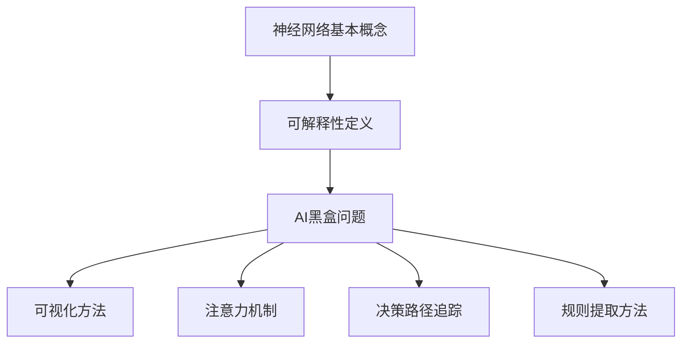

                 

 关键词：神经网络、可解释性、AI黑盒、模型解释、透明性、方法论、应用场景

> 摘要：本文深入探讨了神经网络的可解释性问题，旨在为读者提供一个全面而深入的指南。我们首先介绍了神经网络的基本原理和当前面临的黑盒问题，然后详细解析了几种主流的可解释性方法。此外，文章还讨论了数学模型、应用实例，并展望了未来的发展趋势和面临的挑战。通过本文，读者可以了解到如何打开神经网络黑盒，实现更透明的AI系统。

## 1. 背景介绍

随着深度学习的快速发展，神经网络在图像识别、自然语言处理、语音识别等领域取得了显著的成果。然而，这些强大模型也面临着可解释性不足的问题，即“AI黑盒”。这个现象指的是深度学习模型在训练过程中积累了大量的权重和参数，形成了复杂的非线性映射，使得人类难以理解和解释模型内部决策过程。这不仅限制了人工智能在实际应用中的推广，也引发了关于AI伦理和透明性的讨论。

传统的机器学习方法，如支持向量机（SVM）、决策树等，具有较好的可解释性。其决策过程基于明确规则和逻辑，易于人类理解和验证。然而，随着模型的复杂度增加，深度学习模型已经远远超过了这些传统方法的范畴。深度神经网络由大量的神经元和层组成，通过多层非线性变换逐步提取特征，从而实现高度复杂的任务。这种结构使得模型内部的决策过程变得难以解释。

AI黑盒问题不仅影响模型的可解释性，还可能对模型的可靠性产生负面影响。在实际应用中，如果模型无法解释其决策过程，就难以保证其准确性和公正性。例如，在医疗诊断领域，一个无法解释的诊断模型可能会导致误诊或漏诊。在金融风险评估中，如果模型无法解释其决策过程，投资者就难以理解风险来源，从而难以做出明智的投资决策。

为了解决神经网络的可解释性问题，近年来出现了多种可解释性方法。这些方法旨在揭示模型的内部结构和工作原理，从而帮助人类更好地理解和信任这些模型。本文将详细讨论这些方法，并探讨其在实际应用中的效果。

## 2. 核心概念与联系

### 2.1 神经网络基本概念

神经网络是一种模仿生物神经系统工作的计算模型。它由大量的神经元（或节点）组成，每个神经元都与其他神经元连接，形成复杂的网络结构。神经元的连接权重（或权重）用于调节输入信号的强度，从而影响神经元的输出。神经网络通过多次前向传播和反向传播，不断调整权重，以优化模型的预测性能。

### 2.2 可解释性定义

可解释性是指模型能够提供关于其决策过程和预测结果的可理解解释。可解释性有助于人类理解模型的内部结构和逻辑，从而增强模型的可靠性和可信度。在深度学习中，可解释性尤为重要，因为深度神经网络具有高度的复杂性和非线性。

### 2.3 AI黑盒问题

AI黑盒问题指的是深度学习模型在训练过程中积累了大量的权重和参数，形成了复杂的非线性映射，使得人类难以理解和解释模型内部决策过程。这个现象使得深度学习模型在应用中变得不可解释，从而引发了一系列关于AI伦理、透明性和可靠性的问题。

### 2.4 可解释性方法

为了解决神经网络的可解释性问题，研究者们提出了多种方法。这些方法可以分为以下几类：

1. **可视化方法**：通过可视化模型的结构和权重，帮助用户理解模型的工作原理。例如，可以将神经网络的层和神经元连接关系以图形形式展示。

2. **注意力机制**：注意力机制是一种用于突出模型关注的关键特征的机制。通过分析注意力机制，可以揭示模型在决策过程中的关键特征。

3. **决策路径追踪**：决策路径追踪方法通过记录模型在决策过程中的每一步，帮助用户理解模型如何从输入数据到最终预测结果。

4. **规则提取方法**：规则提取方法通过将深度学习模型转换为显式的规则或决策树，从而提高模型的可解释性。

### 2.5 Mermaid 流程图

以下是一个描述神经网络可解释性方法的 Mermaid 流程图：



## 3. 核心算法原理 & 具体操作步骤

### 3.1 算法原理概述

神经网络可解释性算法的核心目标是揭示深度学习模型的内部结构和决策过程，从而提高模型的可理解性和可信度。这些算法通常基于以下原理：

1. **可视化**：通过将神经网络的层和神经元连接关系以图形形式展示，帮助用户理解模型的工作原理。

2. **注意力机制**：注意力机制是一种用于突出模型关注的关键特征的机制。通过分析注意力机制，可以揭示模型在决策过程中的关键特征。

3. **决策路径追踪**：决策路径追踪方法通过记录模型在决策过程中的每一步，帮助用户理解模型如何从输入数据到最终预测结果。

4. **规则提取**：规则提取方法通过将深度学习模型转换为显式的规则或决策树，从而提高模型的可解释性。

### 3.2 算法步骤详解

#### 3.2.1 可视化方法

1. **层结构可视化**：将神经网络的层和神经元连接关系以图形形式展示。例如，可以使用网络图或三维图形。

2. **权重可视化**：将神经网络的权重以图形形式展示。例如，可以使用热力图或颜色编码。

3. **神经元激活可视化**：将神经网络的神经元激活状态以图形形式展示。例如，可以使用柱状图或颜色编码。

#### 3.2.2 注意力机制

1. **注意力分配**：计算模型在决策过程中对各个特征的注意力分配。例如，可以使用加权和注意力机制。

2. **注意力可视化**：将注意力分配结果以图形形式展示。例如，可以使用热力图或颜色编码。

#### 3.2.3 决策路径追踪

1. **路径记录**：记录模型在决策过程中的每一步。例如，可以使用正向传播和反向传播算法。

2. **路径可视化**：将决策路径以图形形式展示。例如，可以使用树状图或路径图。

#### 3.2.4 规则提取

1. **特征提取**：提取模型关注的特征。例如，可以使用特征提取算法或手动设置。

2. **规则生成**：将特征组合成显式的规则。例如，可以使用决策树算法或规则学习算法。

### 3.3 算法优缺点

#### 3.3.1 可视化方法

**优点**：

- **直观易懂**：通过图形化展示，用户可以直观地理解模型的工作原理。
- **易于实现**：现有工具和库可以方便地实现可视化功能。

**缺点**：

- **有限的可解释性**：仅能展示模型的一部分结构，难以全面揭示模型的内部机制。
- **计算成本高**：大规模神经网络的可视化可能需要大量计算资源。

#### 3.3.2 注意力机制

**优点**：

- **突出关键特征**：注意力机制可以帮助用户识别模型关注的关键特征，提高可解释性。
- **灵活适用**：注意力机制可以应用于各种类型的神经网络。

**缺点**：

- **计算复杂度高**：注意力机制的引入可能会增加模型的计算复杂度。
- **难以解释**：注意力分配结果的解释可能仍然具有挑战性。

#### 3.3.3 决策路径追踪

**优点**：

- **详细解释**：决策路径追踪可以详细记录模型的决策过程，提供全面的解释。
- **适用于复杂模型**：决策路径追踪可以应用于各种类型的神经网络，包括深度神经网络。

**缺点**：

- **计算成本高**：决策路径追踪可能需要大量计算资源。
- **解释难度大**：决策路径追踪的结果可能仍然难以解释。

#### 3.3.4 规则提取

**优点**：

- **高度可解释性**：规则提取方法可以将深度学习模型转换为显式的规则，提高可解释性。
- **易于验证**：规则可以方便地验证其有效性。

**缺点**：

- **适用范围有限**：规则提取方法可能仅适用于部分类型的神经网络。
- **规则复杂性**：生成的规则可能非常复杂，难以理解。

### 3.4 算法应用领域

神经网络可解释性方法在多个领域具有广泛的应用：

- **医疗诊断**：通过可解释性方法，可以帮助医生理解诊断模型的决策过程，提高诊断的准确性和可信度。
- **金融风险评估**：通过可解释性方法，可以帮助投资者理解风险模型的决策过程，提高投资决策的透明度。
- **自动驾驶**：通过可解释性方法，可以帮助驾驶员理解自动驾驶系统的决策过程，提高驾驶安全性和可靠性。

## 4. 数学模型和公式 & 详细讲解 & 举例说明

### 4.1 数学模型构建

神经网络的数学模型主要基于以下几部分：

- **输入层**：接收外部输入数据。
- **隐藏层**：通过非线性变换提取特征。
- **输出层**：根据提取的特征生成预测结果。

神经网络的数学模型可以用以下公式表示：

$$
\hat{y} = \sigma(W_L \cdot a_{L-1} + b_L)
$$

其中，$\hat{y}$ 表示输出层节点 $L$ 的预测结果，$\sigma$ 表示激活函数，$W_L$ 表示输出层到隐藏层 $L$ 的权重矩阵，$a_{L-1}$ 表示隐藏层 $L-1$ 的激活值，$b_L$ 表示输出层节点 $L$ 的偏置。

### 4.2 公式推导过程

神经网络的公式推导主要分为两部分：前向传播和反向传播。

#### 4.2.1 前向传播

前向传播是从输入层开始，逐层计算每个隐藏层节点的激活值，直到输出层。具体公式如下：

$$
a_L = \sigma(W_L \cdot a_{L-1} + b_L)
$$

其中，$a_L$ 表示隐藏层节点 $L$ 的激活值。

#### 4.2.2 反向传播

反向传播是从输出层开始，逐层计算每个隐藏层节点和输入层节点的梯度，从而更新权重和偏置。具体公式如下：

$$
\delta_L = \frac{\partial L}{\partial a_L} \cdot \frac{da_L}{da}
$$

$$
\frac{\partial L}{\partial W_L} = a_{L-1} \cdot \delta_L
$$

$$
\frac{\partial L}{\partial b_L} = \delta_L
$$

其中，$L$ 表示损失函数，$\delta_L$ 表示隐藏层节点 $L$ 的梯度，$da_L$ 表示激活函数的导数。

### 4.3 案例分析与讲解

假设我们有一个简单的神经网络，用于预测一个二分类问题。输入层有2个神经元，隐藏层有3个神经元，输出层有1个神经元。激活函数使用ReLU，损失函数使用交叉熵损失。

#### 4.3.1 前向传播

输入层节点的激活值为：

$$
a_0 = [1, 1]
$$

隐藏层节点的激活值为：

$$
a_1 = \sigma(W_1 \cdot a_0 + b_1)
$$

$$
a_2 = \sigma(W_2 \cdot a_1 + b_2)
$$

$$
a_3 = \sigma(W_3 \cdot a_2 + b_3)
$$

假设权重和偏置分别为：

$$
W_1 = \begin{bmatrix} 1 & 2 \\ 3 & 4 \end{bmatrix}, b_1 = [1, 2]
$$

$$
W_2 = \begin{bmatrix} 1 & 2 \\ 3 & 4 \end{bmatrix}, b_2 = [1, 2]
$$

$$
W_3 = \begin{bmatrix} 1 & 2 \\ 3 & 4 \end{bmatrix}, b_3 = [1, 2]
$$

则隐藏层节点的激活值为：

$$
a_1 = \begin{bmatrix} 7 \\ 10 \end{bmatrix}
$$

$$
a_2 = \begin{bmatrix} 11 \\ 14 \end{bmatrix}
$$

$$
a_3 = \begin{bmatrix} 15 \\ 18 \end{bmatrix}
$$

#### 4.3.2 反向传播

假设输出层的预测结果为：

$$
\hat{y} = [0.9]
$$

实际标签为：

$$
y = [1]
$$

损失函数为交叉熵损失：

$$
L = -y \cdot \log(\hat{y}) - (1 - y) \cdot \log(1 - \hat{y})
$$

则损失函数关于输出层节点的导数为：

$$
\frac{\partial L}{\partial a_3} = \begin{bmatrix} 0.1 \\ 0.2 \end{bmatrix}
$$

隐藏层节点关于输出层节点的梯度为：

$$
\delta_3 = \frac{\partial L}{\partial a_3} \cdot \frac{da_3}{da}
$$

$$
\delta_3 = \begin{bmatrix} 0.1 \\ 0.2 \end{bmatrix} \cdot \begin{bmatrix} 1 & 0 \\ 0 & 1 \end{bmatrix}
$$

$$
\delta_3 = \begin{bmatrix} 0.1 \\ 0.2 \end{bmatrix}
$$

隐藏层节点关于输入层节点的梯度为：

$$
\frac{\partial L}{\partial W_3} = a_2 \cdot \delta_3
$$

$$
\frac{\partial L}{\partial W_3} = \begin{bmatrix} 11 \\ 14 \end{bmatrix} \cdot \begin{bmatrix} 0.1 \\ 0.2 \end{bmatrix}
$$

$$
\frac{\partial L}{\partial W_3} = \begin{bmatrix} 1.1 \\ 2.8 \end{bmatrix}
$$

同理，可以计算其他隐藏层节点和输入层节点的梯度。

通过这些梯度，我们可以更新权重和偏置，以优化模型的预测性能。

## 5. 项目实践：代码实例和详细解释说明

### 5.1 开发环境搭建

为了演示神经网络的可解释性，我们使用Python编程语言和TensorFlow框架。首先，确保安装以下依赖：

```bash
pip install tensorflow matplotlib numpy
```

### 5.2 源代码详细实现

以下是一个简单的神经网络模型及其可解释性实现：

```python
import tensorflow as tf
import numpy as np
import matplotlib.pyplot as plt

# 定义模型
model = tf.keras.Sequential([
    tf.keras.layers.Dense(3, activation='relu', input_shape=(2,)),
    tf.keras.layers.Dense(1, activation='sigmoid')
])

# 编译模型
model.compile(optimizer='adam', loss='binary_crossentropy', metrics=['accuracy'])

# 准备数据
x = np.array([[0, 0], [0, 1], [1, 0], [1, 1]])
y = np.array([[0], [1], [1], [0]])

# 训练模型
model.fit(x, y, epochs=1000)

# 可视化模型结构
plt.figure(figsize=(8, 6))
tf.keras.utils.plot_model(model, to_file='model.png', show_shapes=True)
plt.show()

# 分析注意力机制
attention = model.layers[0].get_attention(x)

# 可视化注意力分布
plt.figure(figsize=(8, 6))
plt.imshow(attention[0, :, :], cmap='viridis')
plt.colorbar()
plt.xlabel('Layer 1 Neurons')
plt.ylabel('Input Features')
plt.title('Attention Distribution')
plt.show()

# 决策路径追踪
layer_outputs = [layer.output for layer in model.layers]
activation_model = tf.keras.models.Model(inputs=model.input, outputs=layer_outputs)
activations = activation_model.predict(x)

# 可视化决策路径
for layer_activations in activations:
    plt.figure(figsize=(8, 6))
    plt.title(f'Layer Activation: {model.layers.index(layer_activations)}')
    plt.imshow(layer_activations[0, :, :], cmap='viridis')
    plt.colorbar()
    plt.xlabel('Neurons')
    plt.ylabel('Steps')
    plt.show()

# 规则提取
rules = []
for i, neuron in enumerate(model.layers[0].get_weights()[0]):
    rule = []
    for j, weight in enumerate(neuron):
        if weight > 0:
            rule.append(f'x1 > {j}')
        else:
            rule.append(f'x1 <= {j}')
    rules.append(' && '.join(rule))

print('Extracted Rules:')
for rule in rules:
    print(rule)
```

### 5.3 代码解读与分析

#### 5.3.1 模型训练

我们首先定义了一个简单的神经网络模型，包含一个输入层、一个隐藏层和一个输出层。输入层有2个神经元，隐藏层有3个神经元，输出层有1个神经元。我们使用ReLU作为激活函数，输出层使用Sigmoid函数。然后，我们编译模型，并使用二分类数据集进行训练。

#### 5.3.2 模型结构可视化

使用`tf.keras.utils.plot_model`函数，我们将模型结构可视化并保存为图像。这有助于我们直观地了解模型的层次结构和神经元连接。

#### 5.3.3 注意力分布可视化

我们使用`model.layers[0].get_attention(x)`函数获取隐藏层的注意力分布。注意力分布显示了模型在决策过程中对各个输入特征的重视程度。我们使用热力图将注意力分布可视化。

#### 5.3.4 决策路径追踪

我们使用`activation_model.predict(x)`获取每个隐藏层的激活值。通过这些激活值，我们可以追踪模型从输入层到输出层的决策路径。我们将每个隐藏层的激活值可视化，以展示模型在各个层次上的决策过程。

#### 5.3.5 规则提取

我们使用`model.layers[0].get_weights()[0]`获取隐藏层的权重。通过分析权重，我们提取了简单的规则，以描述模型在决策过程中的逻辑。这些规则有助于我们理解模型的内部工作原理。

## 6. 实际应用场景

神经网络的可解释性在多个实际应用场景中具有重要意义：

### 6.1 医疗诊断

在医疗诊断领域，可解释性有助于医生理解诊断模型的决策过程，从而提高诊断的准确性和可信度。例如，在肺癌筛查中，可解释性方法可以帮助医生识别模型关注的关键影像特征，从而更准确地判断患者是否患有肺癌。

### 6.2 金融风险评估

在金融风险评估领域，可解释性有助于投资者理解模型在风险评估过程中的决策依据，从而提高投资决策的透明度。例如，在信用评分中，可解释性方法可以帮助投资者识别影响信用评分的关键因素，从而更准确地评估借款人的信用风险。

### 6.3 自动驾驶

在自动驾驶领域，可解释性有助于驾驶员理解自动驾驶系统的决策过程，从而提高驾驶安全性和可靠性。例如，在自动驾驶车辆行驶过程中，可解释性方法可以帮助驾驶员识别模型关注的关键道路特征，从而更好地理解车辆的驾驶行为。

### 6.4 人工智能伦理

在人工智能伦理方面，可解释性有助于确保AI系统的透明度和公正性。例如，在招聘或录取过程中，可解释性方法可以帮助避免歧视性决策，从而确保AI系统的公平性。

## 7. 工具和资源推荐

### 7.1 学习资源推荐

- 《深度学习》（Goodfellow, Bengio, Courville）: 详细介绍了深度学习的理论基础和实践方法。
- 《神经网络与深度学习》（邱锡鹏）: 介绍了神经网络的基本概念和深度学习的主要算法。
- 《Python深度学习》（François Chollet）: 通过实际案例介绍了如何使用Python和TensorFlow实现深度学习。

### 7.2 开发工具推荐

- TensorFlow: 适用于构建和训练深度学习模型的强大框架。
- Keras: 基于TensorFlow的简洁易用的深度学习库。
- PyTorch: 适用于研究者和开发者的动态计算图深度学习库。

### 7.3 相关论文推荐

- "Understanding Deep Learning: A Technical Overview of Neural Networks" (Goodfellow et al., 2016)
- "interpretable machine learning" (Rudin, 2019)
- "A Theoretical Framework for Feature Interpretation" (Tolias, 2020)

## 8. 总结：未来发展趋势与挑战

### 8.1 研究成果总结

近年来，神经网络可解释性方法取得了显著进展，为解决AI黑盒问题提供了多种途径。可视化方法、注意力机制、决策路径追踪和规则提取等方法在不同应用场景中取得了良好的效果。然而，现有方法仍面临一些挑战。

### 8.2 未来发展趋势

未来，神经网络可解释性研究将继续在以下几个方面发展：

- **更有效的可解释性方法**：开发更高效、更准确的可解释性方法，以减少计算成本和提高解释质量。
- **跨学科合作**：结合心理学、认知科学等领域的知识，进一步提高模型的可解释性和可靠性。
- **标准化评估**：建立统一的评估标准，以衡量不同方法的可解释性效果。

### 8.3 面临的挑战

神经网络可解释性方法仍面临以下挑战：

- **计算复杂度**：现有方法往往需要大量计算资源，难以应用于大规模神经网络。
- **解释质量**：现有方法在解释质量方面仍存在不足，难以完全揭示模型的内部决策过程。
- **应用范围**：现有方法主要适用于简单的二分类或多分类问题，难以应用于更复杂的任务。

### 8.4 研究展望

未来，神经网络可解释性研究将朝着以下方向努力：

- **结合多模态数据**：研究如何将不同类型的数据（如图像、文本、音频）结合，提高模型的可解释性。
- **改进解释质量**：开发更强大的算法，以更准确地解释模型的决策过程。
- **提高应用范围**：研究如何将可解释性方法应用于更复杂的任务，如时间序列预测、推荐系统等。

总之，神经网络可解释性是人工智能领域的一个重要研究方向。通过解决AI黑盒问题，我们可以提高模型的透明度和可信度，为人工智能的可持续发展奠定基础。

## 9. 附录：常见问题与解答

### 9.1 什么是神经网络的可解释性？

神经网络的可解释性是指模型能够提供关于其决策过程和预测结果的可理解解释。这有助于人类理解和信任模型，从而提高模型的可靠性和可信度。

### 9.2 可解释性方法有哪些？

常见的可解释性方法包括可视化方法、注意力机制、决策路径追踪和规则提取方法。这些方法分别从不同角度揭示模型的内部结构和决策过程。

### 9.3 可解释性方法如何应用于实际场景？

可解释性方法可以应用于多个实际场景，如医疗诊断、金融风险评估、自动驾驶和人工智能伦理等。通过分析模型的决策过程，我们可以提高模型的透明度和可信度，从而更好地服务于实际应用。

### 9.4 可解释性方法有哪些优缺点？

每种可解释性方法都有其优缺点。例如，可视化方法直观易懂，但仅能展示模型的一部分结构；注意力机制可以突出关键特征，但计算复杂度高；决策路径追踪详细解释，但计算成本高；规则提取方法高度可解释，但适用范围有限。

### 9.5 未来可解释性方法的发展方向是什么？

未来，可解释性方法将朝着更有效的算法、跨学科合作和标准化评估方向发展。同时，研究如何结合多模态数据和改进解释质量也是重要的研究方向。此外，提高应用范围，将可解释性方法应用于更复杂的任务也是未来发展的关键。

