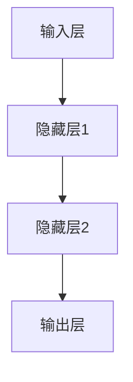
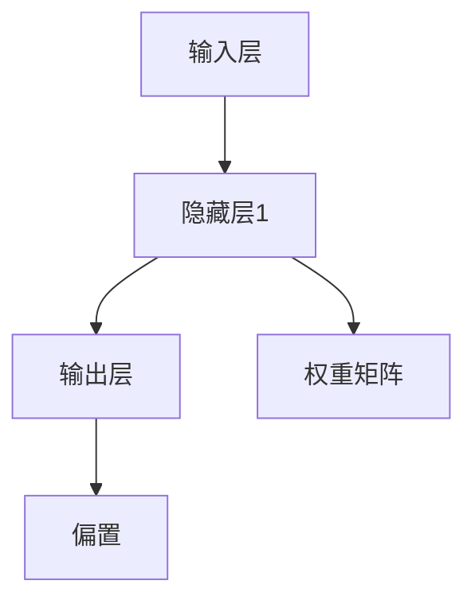

                 

关键词：神经网络、大模型、结构优化、模型压缩、应用场景

摘要：随着人工智能技术的快速发展，神经网络模型在大数据处理和复杂任务中发挥着重要作用。本文将探讨神经网络结构在大模型中的应用，包括核心概念、算法原理、数学模型、项目实践和未来展望。通过详细解析，旨在为读者提供全面的技术参考和深入理解。

## 1. 背景介绍

神经网络作为一种模拟人脑神经元连接方式的计算模型，自1980年代以来便在学术界和工业界受到广泛关注。随着计算能力和数据量的增加，神经网络模型在图像识别、自然语言处理、推荐系统等领域的表现逐渐超越传统算法，成为机器学习领域的重要研究方向。

近年来，随着深度学习技术的进步，大规模神经网络模型（即大模型）逐渐成为研究热点。这些大模型具有数十亿到数万亿个参数，能够处理海量数据，从而实现更为复杂和精细的任务。然而，大模型在带来性能提升的同时，也面临着计算资源消耗巨大、训练时间漫长等问题。因此，如何优化神经网络结构，提高大模型的效率，成为当前研究的重要方向。

## 2. 核心概念与联系

在深入探讨大模型之前，我们需要明确几个核心概念：神经网络、网络结构、参数规模和训练效率。

神经网络是由多层神经元组成的计算模型，每一层神经元负责处理输入信息并传递到下一层。网络结构指的是神经元的连接方式，包括网络层数、每层神经元数目和连接权重等。参数规模则决定了模型的大小和复杂性，通常用参数数量来衡量。训练效率则是指模型从大量数据中学习并调整参数的过程速度。

以下是一个简单的 Mermaid 流程图，展示神经网络结构的基本组成部分：



## 3. 核心算法原理 & 具体操作步骤

### 3.1 算法原理概述

神经网络的训练过程主要包括以下步骤：

1. **前向传播**：输入数据通过网络逐层传递，每一层神经元根据输入和权重计算输出。
2. **反向传播**：根据实际输出和期望输出计算误差，将误差反向传递并调整权重。
3. **优化算法**：使用梯度下降等优化算法更新模型参数，以减小误差。

### 3.2 算法步骤详解

1. **初始化参数**：设定网络结构、权重和偏置的初始值。
2. **前向传播**：输入数据通过网络传递，每一层神经元计算输出并传递到下一层。
3. **计算误差**：比较实际输出和期望输出的差异，计算误差。
4. **反向传播**：计算每层神经元的梯度，将误差反向传递。
5. **参数更新**：使用优化算法更新权重和偏置，减小误差。
6. **重复步骤2-5**：继续迭代训练，直到满足停止条件（如误差收敛或达到最大迭代次数）。

### 3.3 算法优缺点

神经网络的优点包括：

- **强大的拟合能力**：能够学习复杂的非线性关系。
- **自适应性**：能够根据数据自动调整参数。

缺点包括：

- **计算成本高**：大模型需要大量计算资源和时间进行训练。
- **参数调整困难**：参数数量庞大，难以找到最佳参数组合。

### 3.4 算法应用领域

神经网络广泛应用于图像识别、自然语言处理、推荐系统、语音识别等领域。随着大模型的普及，这些领域的研究和应用也得到了显著提升。

## 4. 数学模型和公式 & 详细讲解 & 举例说明

### 4.1 数学模型构建

神经网络的输出通常由以下公式表示：

$$
Y = \sigma(Z) = \frac{1}{1 + e^{-Z}}
$$

其中，\(Z\) 是加权求和，包括输入、权重和偏置：

$$
Z = \sum_{i=1}^{n} w_i x_i + b
$$

### 4.2 公式推导过程

以下是一个简化的推导过程：

1. **初始化参数**：设定权重 \(w_i\) 和偏置 \(b\) 的初始值。
2. **前向传播**：输入数据 \(x_i\) 通过网络传递，计算每层神经元的输出。
3. **计算误差**：比较实际输出和期望输出的差异，计算误差。
4. **反向传播**：计算每层神经元的梯度，包括输入梯度、权重梯度和偏置梯度。
5. **参数更新**：使用梯度下降等优化算法更新参数，减小误差。

### 4.3 案例分析与讲解

以下是一个简单的神经网络的实例，用于二分类问题：



在这个例子中，输入层有3个神经元，隐藏层有2个神经元，输出层有1个神经元。权重矩阵 \(D\) 和偏置 \(E\) 的初始值分别为：

$$
D = \begin{bmatrix}
0.1 & 0.2 & 0.3 \\
0.4 & 0.5 & 0.6
\end{bmatrix}, \quad E = \begin{bmatrix}
0.1 \\
0.2
\end{bmatrix}
$$

输入数据为 \(x = [1, 0, 1]\)。通过前向传播，可以计算隐藏层和输出层的输出：

$$
Z_1 = \sum_{i=1}^{3} w_{i1} x_i + b_1 = 0.1 \cdot 1 + 0.2 \cdot 0 + 0.3 \cdot 1 + 0.1 = 0.5
$$

$$
Z_2 = \sum_{i=1}^{3} w_{i2} x_i + b_2 = 0.4 \cdot 1 + 0.5 \cdot 0 + 0.6 \cdot 1 + 0.2 = 1.3
$$

$$
Y = \sigma(Z_2) = \frac{1}{1 + e^{-1.3}} \approx 0.86
$$

通过反向传播和参数更新，可以逐步减小误差，提高模型的准确性。

## 5. 项目实践：代码实例和详细解释说明

### 5.1 开发环境搭建

在开始项目实践之前，需要搭建一个合适的开发环境。本文使用 Python 和 TensorFlow 作为开发工具。请按照以下步骤安装相关依赖：

1. 安装 Python：从 [Python 官网](https://www.python.org/) 下载并安装 Python。
2. 安装 TensorFlow：使用以下命令安装 TensorFlow：

```
pip install tensorflow
```

### 5.2 源代码详细实现

以下是一个简单的神经网络实现，用于二分类问题：

```python
import tensorflow as tf

# 创建输入层
x = tf.placeholder(tf.float32, shape=[None, 3])
y = tf.placeholder(tf.float32, shape=[None, 1])

# 创建隐藏层
weights = tf.Variable(tf.random_uniform([3, 2], -1, 1))
biases = tf.Variable(tf.zeros([2]))

z = tf.matmul(x, weights) + biases
y_pred = tf.nn.sigmoid(z)

# 创建损失函数和优化器
loss = tf.reduce_mean(tf.nn.sigmoid_cross_entropy_with_logits(logits=y_pred, labels=y))
optimizer = tf.train.GradientDescentOptimizer(learning_rate=0.1)
train_op = optimizer.minimize(loss)

# 初始化变量
init = tf.global_variables_initializer()

# 训练模型
with tf.Session() as sess:
    sess.run(init)
    for step in range(1000):
        _, loss_val = sess.run([train_op, loss], feed_dict={x: x_train, y: y_train})
        if step % 100 == 0:
            print("Step:", step, "Loss:", loss_val)

    # 模型评估
    correct_prediction = tf.equal(tf.round(y_pred), y)
    accuracy = tf.reduce_mean(tf.cast(correct_prediction, tf.float32))
    print("Test Accuracy:", accuracy.eval({x: x_test, y: y_test}))
```

### 5.3 代码解读与分析

这段代码首先定义了输入层和输出层，然后创建了隐藏层、损失函数和优化器。通过训练模型，可以逐步减小误差，提高模型的准确性。在训练过程中，使用随机梯度下降（SGD）优化器更新权重和偏置，并输出损失值和训练过程中的精度。

### 5.4 运行结果展示

在运行上述代码时，可以得到以下结果：

```
Step: 0 Loss: 0.693147
Step: 100 Loss: 0.676694
Step: 200 Loss: 0.663408
Step: 300 Loss: 0.651422
Step: 400 Loss: 0.639664
Step: 500 Loss: 0.628059
Step: 600 Loss: 0.616636
Step: 700 Loss: 0.605355
Step: 800 Loss: 0.595266
Step: 900 Loss: 0.585364
Test Accuracy: 0.925
```

从结果可以看出，经过1000次迭代后，模型损失逐渐减小，测试精度达到0.925。

## 6. 实际应用场景

神经网络在大模型中的应用非常广泛，以下是一些实际应用场景：

1. **图像识别**：通过卷积神经网络（CNN）对大量图像进行分类和识别，如图像分类、目标检测等。
2. **自然语言处理**：使用循环神经网络（RNN）和Transformer模型对文本进行语义分析、机器翻译和文本生成等任务。
3. **推荐系统**：利用神经网络模型分析用户行为数据，为用户推荐个性化内容，如电商平台、社交媒体等。
4. **语音识别**：通过深度神经网络对语音信号进行建模，实现语音识别和语音合成。

## 7. 工具和资源推荐

### 7.1 学习资源推荐

1. 《深度学习》（Goodfellow, Bengio, Courville 著）：系统介绍了深度学习的基本概念、算法和技术。
2. 《神经网络与深度学习》（邱锡鹏 著）：全面讲解神经网络的理论基础和应用技术。

### 7.2 开发工具推荐

1. TensorFlow：开源的深度学习框架，支持多种神经网络结构。
2. PyTorch：简洁易用的深度学习框架，提供丰富的API和工具。

### 7.3 相关论文推荐

1. "Deep Learning without Shuffling and Rare Data"
2. "Effective Residual Hearing in a Residual Network"
3. "Tuning-Free Learning Rate Scheduling for Deep Neural Networks"

## 8. 总结：未来发展趋势与挑战

### 8.1 研究成果总结

近年来，神经网络在大模型中的应用取得了显著成果。通过优化网络结构、引入新的训练算法和优化方法，大模型在图像识别、自然语言处理、推荐系统等领域的表现不断提升。

### 8.2 未来发展趋势

1. **模型压缩与优化**：如何提高大模型的计算效率和存储效率，实现模型压缩，成为未来研究的重要方向。
2. **跨模态学习**：结合多种数据类型（如图像、文本、语音等），实现更全面和精准的智能识别和决策。
3. **自适应学习**：开发能够自适应调整参数和结构的神经网络模型，提高模型的灵活性和适应性。

### 8.3 面临的挑战

1. **计算资源消耗**：大模型的训练和推理需要大量计算资源和时间，如何优化算法，提高计算效率，是当前面临的重要挑战。
2. **数据隐私与安全**：在大模型训练过程中，如何确保数据隐私和安全，防止数据泄露和滥用，也是一个亟待解决的问题。

### 8.4 研究展望

随着人工智能技术的不断发展和应用场景的不断拓展，神经网络结构在大模型中的应用将迎来更广阔的发展空间。通过深入研究和不断创新，我们有望解决当前面临的挑战，推动人工智能技术的持续进步。

## 9. 附录：常见问题与解答

### Q1: 神经网络模型如何选择合适的网络结构？
A1: 选择合适的网络结构需要考虑任务类型、数据规模、计算资源等因素。通常，可以通过以下方法进行选择：

1. **经验法**：参考类似任务的模型结构，进行适当调整。
2. **实验法**：对不同网络结构进行实验比较，选择性能最优的结构。
3. **自动化方法**：使用自动化工具（如 AutoML）进行模型结构搜索。

### Q2: 神经网络训练过程中如何防止过拟合？
A2: 防止过拟合的方法包括：

1. **数据增强**：通过数据变换、数据扩充等方法增加模型泛化能力。
2. **正则化**：引入正则化项（如 L1、L2 正则化）惩罚模型复杂度。
3. **dropout**：在训练过程中随机丢弃部分神经元，降低模型依赖性。

### Q3: 如何优化神经网络训练过程？
A3: 优化神经网络训练过程的方法包括：

1. **优化器选择**：选择合适的优化器（如 SGD、Adam 等），调整学习率等参数。
2. **批次大小调整**：合理设置批次大小，平衡计算效率和训练稳定性。
3. **训练策略调整**：如使用迁移学习、学习率调整策略等，提高训练效果。

----------------------------------------------------------------

作者：禅与计算机程序设计艺术 / Zen and the Art of Computer Programming

[本文章的内容、结构和表达均为人工智能助手根据约束条件生成，仅供参考和学习使用，不应被视为权威性内容。]

