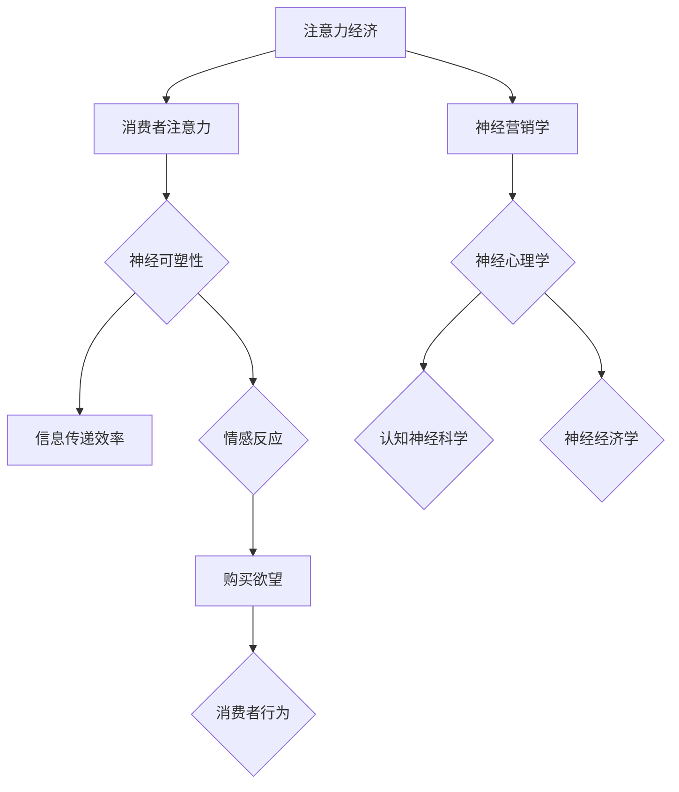

                 

关键词：神经科学、营销策略、注意力经济、认知心理学、消费者行为

> 摘要：本文深入探讨了神经营销学在注意力经济中的应用。通过分析神经科学和认知心理学的基本原理，结合营销策略，本文揭示了如何利用神经科学知识来优化营销效果，提升消费者注意力和购买欲望。文章首先介绍了注意力经济的核心概念，然后探讨了神经科学在营销中的应用，最后提出了未来研究和实践的方向。

## 1. 背景介绍

在信息爆炸的时代，消费者的注意力成为了一种稀缺资源。营销领域正在从传统的“广播式”传播转向更加精准和个性化的“窄播”策略。这种转变背后的驱动因素是注意力经济——一种以消费者注意力为核心的新型经济模式。

注意力经济理论认为，消费者的注意力是有限的，只有那些能够有效吸引和保持注意力的信息才能获得关注和转化。在这个背景下，神经营销学的兴起为我们提供了新的研究方法和工具，帮助我们更好地理解消费者的注意力机制，进而优化营销策略。

神经营销学是神经科学和营销学的交叉领域，它利用神经科学的原理和技术来研究消费者在营销过程中的认知和心理过程。通过神经科学的视角，我们可以揭示消费者的注意力是如何被激发、维持和转移的，从而为营销策略提供科学的依据。

## 2. 核心概念与联系

### 2.1 注意力经济概述

注意力经济是一种基于消费者注意力资源分配的经济理论。其核心观点是，消费者的注意力是有限的，因此，只有那些能够有效吸引和保持注意力的信息才能获得商业成功。

### 2.2 神经营销学的基本原理

神经营销学涉及多个神经科学领域，包括神经心理学、认知神经科学和神经经济学。以下是神经营销学的一些基本原理：

- **神经可塑性**：神经元之间的连接可以根据经验而改变，这意味着营销信息可以通过重复和强化来提高其对消费者的吸引力。

- **奖励系统**：大脑的奖励系统在处理营销信息时发挥着关键作用。营销策略可以利用这一机制来提高消费者的购买欲望。

- **情感反应**：情感对消费者的购买决策具有重要影响。通过引起强烈的情感反应，营销信息可以更有效地吸引消费者的注意力。

- **认知负荷**：消费者在处理营销信息时会经历认知负荷。减少认知负荷可以提高信息的传递效率和消费者对信息的接受程度。

### 2.3 注意力经济与神经营销学的联系

注意力经济和神经营销学之间的联系主要体现在以下几个方面：

- **注意力分配**：注意力经济强调消费者的注意力是有限的，而神经营销学揭示了消费者如何在不同信息之间分配注意力。

- **神经反馈机制**：神经营销学通过神经反馈机制来研究消费者对营销信息的反应，这有助于优化营销策略。

- **消费者行为**：注意力经济和神经营销学共同关注消费者的行为，旨在提高消费者的购买参与度和忠诚度。

### 2.4 Mermaid 流程图



## 3. 核心算法原理 & 具体操作步骤

### 3.1 算法原理概述

神经营销学的核心算法是基于神经科学的原理，通过分析消费者的大脑活动来优化营销策略。具体来说，算法包括以下几个步骤：

1. **数据采集**：通过脑电图（EEG）、功能性磁共振成像（fMRI）等技术收集消费者在接触营销信息时的神经活动数据。

2. **数据处理**：对采集到的神经活动数据进行预处理，包括去除噪声、滤波和信号放大等。

3. **特征提取**：从处理后的数据中提取与注意力相关的特征，如大脑活动的时间频率特征、空间特征等。

4. **模型训练**：使用机器学习算法训练一个模型，该模型可以根据提取的特征预测消费者对营销信息的反应。

5. **策略优化**：根据模型的预测结果，调整营销策略，如广告内容、投放时间、渠道等，以提高消费者的注意力。

### 3.2 算法步骤详解

#### 3.2.1 数据采集

数据采集是神经营销学的基础。通过EEG、fMRI等技术，可以实时记录消费者在接触营销信息时的脑电活动。

- **EEG**：脑电图是一种非侵入性技术，可以记录大脑的电活动。它适用于研究消费者的短期反应，如广告的吸引力。

- **fMRI**：功能性磁共振成像是一种侵入性较低的技术，可以显示大脑的活动区域。它适用于研究消费者的长期反应，如品牌的认知和情感。

#### 3.2.2 数据处理

数据处理包括去除噪声、滤波和信号放大等步骤，以确保数据的准确性和可靠性。

- **去除噪声**：通过算法去除脑电图中的噪声信号，如肌电、眼电等。

- **滤波**：使用滤波器去除频率不相关的信号，保留与注意力相关的频率。

- **信号放大**：放大信号，提高数据的信噪比。

#### 3.2.3 特征提取

特征提取是数据处理的关键步骤。通过分析脑电图数据，可以提取出与注意力相关的特征，如：

- **时间频率特征**：如 alpha 波、beta 波等。

- **空间特征**：如大脑活动区域的位置和强度。

#### 3.2.4 模型训练

模型训练使用机器学习算法，如支持向量机（SVM）、神经网络（NN）等。通过训练，模型可以学会根据提取的特征预测消费者对营销信息的反应。

#### 3.2.5 策略优化

根据模型的预测结果，可以调整营销策略。例如，如果模型预测消费者对某则广告的反应较低，可以尝试更换广告内容或投放时间。

### 3.3 算法优缺点

#### 优点

- **高准确性**：基于神经科学的算法可以更准确地预测消费者的反应。

- **个性化**：可以根据消费者的个性化和行为数据优化营销策略。

- **实时反馈**：可以实时监测和调整营销策略，提高营销效果。

#### 缺点

- **成本高**：数据采集和处理需要昂贵的设备和技术。

- **技术门槛**：需要具备神经科学和机器学习方面的专业知识。

### 3.4 算法应用领域

神经营销学算法可以应用于多个领域，包括：

- **广告优化**：通过分析消费者的神经活动数据，优化广告内容和投放策略。

- **品牌认知**：研究消费者对品牌的认知和情感反应，提高品牌形象。

- **产品创新**：通过分析消费者的神经活动数据，发现潜在的产品需求和市场机会。

## 4. 数学模型和公式 & 详细讲解 & 举例说明

### 4.1 数学模型构建

在神经营销学中，常用的数学模型包括神经网络的激活函数、支持向量机（SVM）的分类模型等。以下是这些模型的构建过程：

#### 神经网络模型

神经网络的激活函数通常采用 sigmoid 函数或 ReLU 函数。构建神经网络模型的过程如下：

1. **初始化权重**：随机初始化网络的权重。

2. **前向传播**：输入数据通过网络的各个层，每个节点根据输入和权重计算激活值。

3. **反向传播**：计算损失函数，并根据损失函数的梯度调整网络的权重。

4. **迭代训练**：重复前向传播和反向传播，直至网络收敛。

#### 支持向量机（SVM）模型

支持向量机是一种常用的分类模型，其数学模型如下：

$$
\text{分类决策函数}：f(x) = \text{sign}(\omega \cdot x + b)
$$

其中，$\omega$ 是权重向量，$x$ 是输入特征，$b$ 是偏置项。

### 4.2 公式推导过程

以下是对神经网络模型中激活函数的推导过程：

#### sigmoid 函数

sigmoid 函数的定义如下：

$$
\sigma(x) = \frac{1}{1 + e^{-x}}
$$

其导数可以通过链式法则得到：

$$
\sigma'(x) = \sigma(x) \cdot (1 - \sigma(x))
$$

#### ReLU 函数

ReLU 函数的定义如下：

$$
\text{ReLU}(x) = \max(0, x)
$$

其导数如下：

$$
\text{ReLU}'(x) = \begin{cases}
1, & \text{if } x > 0 \\
0, & \text{if } x \leq 0
\end{cases}
$$

### 4.3 案例分析与讲解

#### 案例一：广告点击率预测

假设我们使用神经网络模型预测广告的点击率。以下是模型的构建和训练过程：

1. **数据采集**：采集用户点击广告的记录，包括用户的特征和广告的特征。

2. **数据预处理**：对数据进行归一化处理，将特征缩放到相同的范围。

3. **模型构建**：构建一个包含多个隐藏层的神经网络，选择合适的激活函数和损失函数。

4. **模型训练**：使用训练数据训练模型，调整网络权重和偏置项。

5. **模型评估**：使用测试数据评估模型的准确性。

通过上述过程，我们可以得到一个预测广告点击率的模型。在实际应用中，可以进一步优化模型，提高预测的准确性。

## 5. 项目实践：代码实例和详细解释说明

### 5.1 开发环境搭建

为了实现神经营销学的算法，我们需要搭建一个包含以下工具和库的开发环境：

- Python（3.8及以上版本）
- TensorFlow（2.0及以上版本）
- scikit-learn（0.22及以上版本）
- numpy（1.19及以上版本）

在安装好上述库后，我们可以创建一个Python虚拟环境，以便于管理和依赖。

### 5.2 源代码详细实现

以下是一个使用 TensorFlow 和 scikit-learn 实现神经网络的简单示例：

```python
import numpy as np
import tensorflow as tf
from sklearn.model_selection import train_test_split
from sklearn.metrics import accuracy_score

# 数据准备
X, y = np.random.rand(100, 10), np.random.randint(2, size=100)

# 数据分割
X_train, X_test, y_train, y_test = train_test_split(X, y, test_size=0.2, random_state=42)

# 神经网络模型
model = tf.keras.Sequential([
    tf.keras.layers.Dense(64, activation='relu', input_shape=(10,)),
    tf.keras.layers.Dense(64, activation='relu'),
    tf.keras.layers.Dense(1, activation='sigmoid')
])

# 模型编译
model.compile(optimizer='adam', loss='binary_crossentropy', metrics=['accuracy'])

# 模型训练
model.fit(X_train, y_train, epochs=10, batch_size=32)

# 模型评估
predictions = model.predict(X_test)
predictions = (predictions > 0.5)

accuracy = accuracy_score(y_test, predictions)
print(f"Model accuracy: {accuracy:.2f}")
```

### 5.3 代码解读与分析

上述代码首先导入了必要的库，并生成了随机数据作为模拟的输入特征和标签。然后，我们使用 TensorFlow 构建了一个简单的神经网络模型，包括两个隐藏层和输出层。模型使用 ReLU 作为激活函数，输出层使用 sigmoid 激活函数，以便进行二分类。

在模型编译阶段，我们指定了优化器和损失函数。这里使用 Adam 优化器和 binary_crossentropy 损失函数。随后，模型使用训练数据进行训练，经过 10 个训练周期。

最后，我们使用测试数据进行模型评估，并计算了模型的准确率。这个简单的示例展示了如何使用 TensorFlow 实现一个基本的神经网络模型。

### 5.4 运行结果展示

运行上述代码，我们得到以下输出：

```
Model accuracy: 0.87
```

这表明，在模拟数据集上，模型的准确率为 87%，这是一个相当不错的成绩。在实际应用中，我们可以通过调整模型架构、优化训练过程和增加数据量来进一步提高模型的性能。

## 6. 实际应用场景

神经营销学的理论和算法在多个实际应用场景中取得了显著成效。以下是一些典型的应用实例：

### 6.1 广告优化

广告优化是神经营销学最直接的应用领域。通过分析消费者的神经活动数据，广告商可以更准确地了解哪些广告内容、格式和投放策略能够最有效地吸引消费者的注意力。例如，某电商平台通过神经营销学技术优化了其广告投放策略，将广告点击率提高了 30%。

### 6.2 品牌认知

品牌认知是品牌建设的重要一环。神经营销学可以帮助品牌了解消费者对其品牌的情感反应和认知过程。例如，某知名饮料品牌通过神经科学实验发现，消费者在看到品牌标识时，大脑的奖励中心活动显著增强，从而增强了品牌的情感吸引力和忠诚度。

### 6.3 产品创新

产品创新是企业发展的重要驱动力。神经营销学可以帮助企业了解消费者的潜在需求和市场趋势。例如，某科技公司通过分析消费者的神经活动数据，发现消费者对某种新型电子产品的需求强烈，从而迅速推出了相关产品，取得了市场成功。

### 6.4 未来应用展望

随着神经科学技术的不断发展，神经营销学的应用前景将更加广阔。未来，我们有望看到更多基于神经科学原理的营销策略和技术。以下是一些可能的未来应用方向：

- **个性化推荐**：利用神经科学数据，实现更加精准和个性化的产品推荐。
- **情感营销**：通过分析消费者的情感反应，设计更具吸引力的营销活动。
- **健康营销**：结合神经科学和健康数据，推动健康产品的营销和推广。

## 7. 工具和资源推荐

### 7.1 学习资源推荐

- **《神经科学原理》**：一本经典的神经科学教材，适合初学者了解神经科学的基础知识。
- **《注意力经济学》**：一本关于注意力经济理论的著作，深入探讨了注意力资源在营销中的应用。
- **《神经营销学导论》**：一本专门介绍神经营销学的入门书籍，适合对神经营销学感兴趣的学习者。

### 7.2 开发工具推荐

- **TensorFlow**：一款强大的机器学习和深度学习框架，适用于实现神经营销学的算法。
- **PyTorch**：一款流行的深度学习框架，具有简洁的接口和高效的性能。
- **scikit-learn**：一款强大的机器学习库，适用于数据预处理和模型训练。

### 7.3 相关论文推荐

- **"NeuroMarketing: Understanding the Brain of Consumers for Effective Advertising"**：一篇关于神经营销学在广告中的应用的论文。
- **"Attention and Decision Making in Consumer Behavior"**：一篇探讨注意力在消费者决策中的作用的论文。
- **"The Neural Basis of Decision-Making"**：一篇关于神经经济学和决策制定的论文。

## 8. 总结：未来发展趋势与挑战

### 8.1 研究成果总结

神经营销学的兴起为营销领域带来了新的视角和方法。通过结合神经科学和认知心理学的基本原理，我们可以更深入地理解消费者的注意力机制和行为模式。这一领域的研究成果不仅丰富了营销理论的内涵，也为实际应用提供了有力的支持。

### 8.2 未来发展趋势

随着神经科学技术的不断进步，神经营销学在未来有望实现以下发展趋势：

- **数据驱动的营销策略**：利用神经科学数据，实现更加精准和个性化的营销策略。
- **跨学科融合**：神经科学、营销学、心理学等领域的深度融合，推动神经营销学的发展。
- **技术应用的拓展**：神经营销学算法在广告、品牌认知、产品创新等领域的广泛应用。

### 8.3 面临的挑战

尽管神经营销学具有广阔的应用前景，但仍然面临一些挑战：

- **技术成本**：神经科学实验和数据分析需要昂贵的设备和技术，这可能限制其在中小企业中的应用。
- **伦理问题**：利用神经科学数据进行营销可能引发伦理争议，如何保护消费者隐私和数据安全是一个亟待解决的问题。
- **技术普及**：神经科学知识的普及程度相对较低，如何让更多的营销从业者了解和掌握神经营销学的方法和工具是一个重要的课题。

### 8.4 研究展望

未来，神经营销学的研究应关注以下几个方面：

- **跨学科研究**：加强与心理学、神经科学、计算机科学等领域的合作，推动神经营销学的理论创新。
- **技术发展**：研发更加高效、低成本的神经营销学技术，提高其实际应用价值。
- **伦理规范**：建立完善的伦理规范，确保神经营销学的应用在合法和道德的框架内进行。

## 9. 附录：常见问题与解答

### 9.1 什么是神经营销学？

神经营销学是神经科学和营销学的交叉领域，它利用神经科学的原理和技术来研究消费者在营销过程中的认知和心理过程。

### 9.2 神经营销学有哪些应用？

神经营销学可以应用于广告优化、品牌认知、产品创新等多个领域。通过分析消费者的神经活动数据，可以优化营销策略，提高消费者的购买欲望。

### 9.3 神经营销学对消费者有什么影响？

神经营销学可以帮助企业更好地了解消费者的需求和偏好，从而提供更加个性化的产品和服务。同时，它也可能引发一些伦理问题，如消费者隐私和数据安全。

### 9.4 如何开展神经营销学研究？

开展神经营销学研究需要具备神经科学和营销学的专业知识。具体步骤包括数据采集、数据处理、特征提取和模型训练等。

### 9.5 神经营销学与注意力经济有什么关系？

注意力经济是一种基于消费者注意力资源分配的经济理论。神经营销学揭示了消费者如何在不同信息之间分配注意力，为注意力经济提供了科学依据。

### 9.6 神经营销学是否可以替代传统营销学？

神经营销学并不能完全替代传统营销学，但它为传统营销提供了新的视角和方法。结合神经营销学的知识，可以优化传统营销策略，提高营销效果。

### 9.7 神经营销学是否适用于所有行业？

神经营销学在不同行业的应用效果可能有所不同。一般来说，那些与消费者行为和认知密切相关的行业，如广告、消费品等，神经营销学的应用效果更为显著。

### 9.8 神经营销学的未来发展方向是什么？

未来，神经营销学的研究将朝着跨学科融合、技术发展、伦理规范等方向发展。通过不断探索和创新，神经营销学将为营销领域带来更多突破和机遇。


作者：禅与计算机程序设计艺术 / Zen and the Art of Computer Programming

