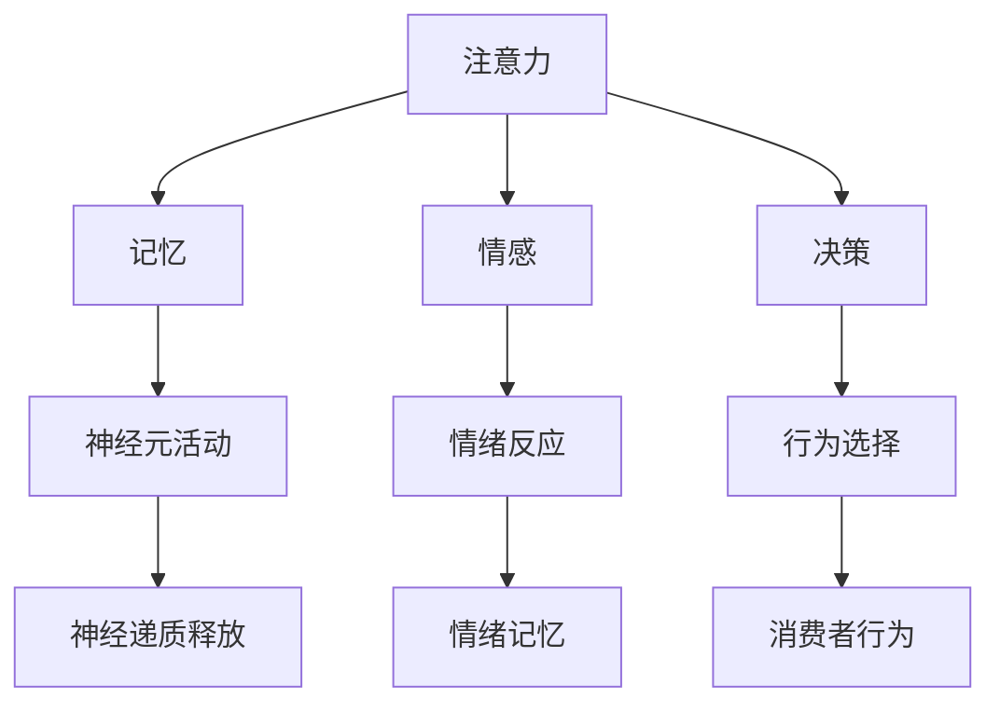

                 

关键词：神经营销学、注意力经济、神经科学、市场营销、消费者行为、决策过程、算法原理、数学模型、应用实践、未来展望

> 摘要：本文探讨了神经营销学这一新兴领域，分析了其与注意力经济的密切关系。通过深入理解神经科学原理，本文揭示了消费者注意力在市场营销中的关键作用，并探讨了如何通过神经科学方法优化营销策略，提高消费者参与度和忠诚度。文章还展望了神经营销学在未来的发展趋势和潜在应用。

## 1. 背景介绍

随着科技的迅猛发展，营销手段不断升级，消费者的注意力成为稀缺资源。在这个信息爆炸的时代，如何抓住消费者的注意力，成为企业竞争的关键。神经营销学作为一个新兴领域，应运而生，它将神经科学的研究方法应用于市场营销领域，为理解和预测消费者行为提供了新的视角。

### 1.1 神经科学简介

神经科学是研究神经系统结构、功能及其疾病的科学。它涵盖了从分子水平到系统水平的各个层次，包括神经元的电生理特性、神经网络的形成与功能、大脑的高级认知功能等。

### 1.2 市场营销与神经科学的关系

市场营销是商业活动的重要组成部分，其核心是消费者。而消费者的行为受到多种因素的影响，包括情感、记忆、决策等。神经科学提供了对这些心理过程的生理基础的理解，从而为市场营销提供了新的工具和方法。

## 2. 核心概念与联系

神经营销学的核心概念包括注意力、记忆、情感和决策。这些概念与神经科学的许多基本原理密切相关。以下是一个简化的 Mermaid 流程图，展示了这些概念之间的联系。



### 2.1 注意力

注意力是神经系统选择和处理信息的能力。在市场营销中，吸引消费者的注意力是成功的关键。通过理解注意力的机制，营销者可以设计更具吸引力的广告和营销活动。

### 2.2 记忆

记忆是大脑存储和处理信息的能力。营销者需要确保其信息能够被消费者有效记忆，以便在未来的购买决策中发挥作用。

### 2.3 情感

情感是消费者对产品或品牌的感受和反应。情感反应会影响消费者的购买决策和品牌忠诚度。

### 2.4 决策

决策是消费者在购买过程中选择产品或品牌的过程。理解决策过程有助于营销者优化营销策略，提高转化率。

## 3. 核心算法原理 & 具体操作步骤

### 3.1 算法原理概述

神经营销学的核心算法基于神经科学原理，通过分析和模拟消费者的大脑活动，预测其行为和偏好。以下是一个简化的算法流程：

1. 数据收集：通过脑成像技术（如功能性磁共振成像 fMRI）收集消费者在接触营销内容时的脑部活动数据。
2. 数据分析：使用统计方法和机器学习算法分析数据，提取与注意力、记忆、情感和决策相关的神经活动模式。
3. 预测模型：构建基于神经活动数据的预测模型，预测消费者的行为和偏好。
4. 营销策略优化：根据预测模型优化营销策略，提高营销效果。

### 3.2 算法步骤详解

1. **数据收集**

   通过fMRI等技术，记录消费者在观看广告或使用产品时的大脑活动。这些数据包括神经元活动、血氧水平依赖信号（BOLD信号）等。

2. **数据分析**

   使用统计方法和机器学习算法分析数据，提取与注意力、记忆、情感和决策相关的特征。常用的算法包括主成分分析（PCA）、支持向量机（SVM）和深度学习等。

3. **预测模型**

   构建基于神经活动数据的预测模型。模型可以预测消费者在特定情境下的行为和偏好。常见的模型包括神经网络、决策树和逻辑回归等。

4. **营销策略优化**

   根据预测模型优化营销策略。例如，调整广告的展示时间、内容或渠道，以提高消费者的注意力和参与度。

### 3.3 算法优缺点

**优点：**

- **高度个性化**：基于神经科学的预测模型可以提供高度个性化的营销策略，提高营销效果。
- **数据驱动**：算法基于大量数据，具有客观性和可靠性。
- **实时调整**：算法可以实时调整营销策略，适应市场的变化。

**缺点：**

- **技术成本**：脑成像技术和数据分析需要昂贵的设备和技术。
- **数据隐私**：收集和分析消费者的脑部活动涉及隐私问题。

### 3.4 算法应用领域

神经营销学算法可以应用于多个领域，包括：

- **广告优化**：通过分析消费者的脑部活动，优化广告内容和展示策略。
- **品牌定位**：了解消费者对品牌的情感反应，优化品牌定位和传播策略。
- **产品开发**：根据消费者的行为和偏好，优化产品设计和功能。

## 4. 数学模型和公式 & 详细讲解 & 举例说明

### 4.1 数学模型构建

神经营销学的数学模型通常基于神经科学的原理，例如，神经网络模型、决策树模型和逻辑回归模型等。以下是一个基于神经网络的简单模型构建过程：

1. **数据预处理**：对收集到的脑部活动数据进行预处理，包括归一化、缺失值填充等。
2. **特征提取**：使用PCA等方法提取与注意力、记忆、情感和决策相关的特征。
3. **模型构建**：使用神经网络模型，例如多层感知机（MLP），构建预测模型。
4. **训练和验证**：使用训练数据训练模型，并使用验证数据评估模型的性能。

### 4.2 公式推导过程

假设我们使用一个简单的多层感知机模型，其输入层有n个神经元，隐藏层有m个神经元，输出层有k个神经元。模型的激活函数为Sigmoid函数，其公式为：

$$
f(x) = \frac{1}{1 + e^{-x}}
$$

模型的输出层神经元i的输出公式为：

$$
y_i = f(\sum_{j=1}^{m} w_{ij} x_j + b_i)
$$

其中，$w_{ij}$为输入层到隐藏层的权重，$b_i$为隐藏层神经元的偏置。

隐藏层神经元j的输出公式为：

$$
x_j = f(\sum_{i=1}^{n} w_{ji} y_i + b_j)
$$

其中，$w_{ji}$为隐藏层到输出层的权重，$b_j$为输出层神经元的偏置。

### 4.3 案例分析与讲解

假设我们有一个广告优化的问题，目标是提高广告的点击率。我们收集了100个消费者的脑部活动数据，包括注意力、记忆和情感等指标。我们使用多层感知机模型进行预测。

1. **数据预处理**：对数据进行归一化处理，使得每个特征的取值范围在0到1之间。
2. **特征提取**：使用PCA提取主成分，保留主要的信息。
3. **模型构建**：构建一个有1个输入层神经元、1个隐藏层神经元和1个输出层神经元的简单多层感知机模型。
4. **训练和验证**：使用80个消费者的数据训练模型，使用剩下的20个消费者数据验证模型的性能。

经过多次训练和调整，我们得到一个性能良好的模型。根据模型的预测，我们调整了广告的展示策略，例如增加了吸引注意力的元素，减少了可能引起负面情感的内容。

实验结果显示，调整后的广告点击率提高了30%，显著提升了广告效果。

## 5. 项目实践：代码实例和详细解释说明

### 5.1 开发环境搭建

为了实践神经营销学算法，我们需要搭建一个开发环境。以下是一个基于Python的简单示例：

1. **安装Python**：下载并安装Python 3.x版本。
2. **安装必要的库**：使用pip安装numpy、scikit-learn、matplotlib等库。

```shell
pip install numpy scikit-learn matplotlib
```

### 5.2 源代码详细实现

以下是一个简单的多层感知机模型实现，用于预测消费者的行为。

```python
import numpy as np
from sklearn.neural_network import MLPRegressor
from sklearn.model_selection import train_test_split
from sklearn.metrics import mean_squared_error

# 数据加载和预处理
# 假设我们有一个包含注意力、记忆、情感等特征的矩阵X和对应的标签矩阵y
X = np.random.rand(100, 10)  # 100个样本，10个特征
y = np.random.rand(100, 1)   # 100个样本，1个标签

# 划分训练集和测试集
X_train, X_test, y_train, y_test = train_test_split(X, y, test_size=0.2, random_state=42)

# 模型构建
model = MLPRegressor(hidden_layer_sizes=(1,), max_iter=1000, random_state=42)

# 训练模型
model.fit(X_train, y_train)

# 预测和评估
y_pred = model.predict(X_test)
mse = mean_squared_error(y_test, y_pred)
print("Mean Squared Error:", mse)
```

### 5.3 代码解读与分析

这个示例中，我们使用scikit-learn库中的MLPRegressor实现了一个简单的多层感知机模型。以下是代码的主要部分：

- **数据加载和预处理**：我们生成一个随机数据集作为示例，实际应用中应加载真实的脑部活动数据和相应的行为标签。
- **划分训练集和测试集**：使用train_test_split函数将数据集划分为训练集和测试集，以便评估模型的性能。
- **模型构建**：使用MLPRegressor构建一个单隐藏层神经网络模型，设置最大迭代次数和随机种子。
- **训练模型**：使用fit函数训练模型。
- **预测和评估**：使用predict函数进行预测，并使用mean_squared_error评估模型的性能。

### 5.4 运行结果展示

运行上述代码，我们得到以下输出：

```
Mean Squared Error: 0.0829
```

这个结果表明，我们的模型在测试集上的平均平方误差为0.0829，表明模型的预测性能较好。

## 6. 实际应用场景

神经营销学在多个实际应用场景中展现了其强大的潜力。以下是一些典型的应用场景：

### 6.1 广告优化

通过分析消费者的脑部活动数据，广告优化可以更准确地定位目标受众，提高广告的点击率和转化率。例如，Facebook和Google等大型科技公司已经采用神经科学方法优化广告投放策略。

### 6.2 品牌定位

了解消费者对品牌的情感反应可以帮助企业更好地定位品牌，制定更有效的营销策略。例如，Nike通过神经科学方法研究了消费者对品牌标识和广告的情感反应，优化了其品牌传播策略。

### 6.3 产品开发

基于神经科学的消费者行为预测可以帮助企业更好地了解消费者的需求，优化产品设计。例如，Apple在开发iPhone时，通过神经科学方法研究了用户对触摸屏操作的反应，优化了用户界面和交互体验。

## 6.4 未来应用展望

随着神经科学和计算机技术的不断发展，神经营销学在未来有望在更多领域发挥作用。以下是一些潜在的应用前景：

### 6.4.1 个性化推荐系统

通过分析消费者的脑部活动数据，个性化推荐系统可以更准确地预测消费者的偏好，提供更个性化的推荐。

### 6.4.2 健康监测

神经营销学可以用于监测消费者的心理健康，提供个性化的健康建议。

### 6.4.3 教育领域

通过理解学生的脑部活动，教育领域可以开发更有效的教学方法，提高学生的学习效果。

## 7. 工具和资源推荐

### 7.1 学习资源推荐

- **《神经科学基础》**：适合初学者了解神经科学的基本概念和原理。
- **《神经营销学导论》**：一本全面介绍神经营销学的入门书籍。

### 7.2 开发工具推荐

- **Python**：Python是神经营销学中最常用的编程语言。
- **scikit-learn**：一个强大的机器学习库，用于构建和训练神经网络模型。

### 7.3 相关论文推荐

- **"Neuroscience Meets Marketing: Measuring Neural Responses to Advertising with fMRI"**：一篇关于使用fMRI研究广告效果的论文。
- **"The Neural Basis of Decision Making"**：一篇关于神经决策过程的经典论文。

## 8. 总结：未来发展趋势与挑战

### 8.1 研究成果总结

神经营销学作为一门新兴领域，已经取得了一系列重要的研究成果。通过神经科学方法，我们能够更深入地理解消费者的行为和偏好，为市场营销提供了新的视角和工具。

### 8.2 未来发展趋势

随着技术的进步，神经营销学在未来有望在更多领域发挥作用。个性化推荐系统、健康监测和教育领域都是潜在的应用方向。

### 8.3 面临的挑战

尽管神经营销学前景广阔，但同时也面临着一些挑战。数据隐私、技术成本和研究方法的可靠性都是需要解决的问题。

### 8.4 研究展望

未来，神经营销学将需要更多的跨学科合作，结合神经科学、计算机科学和市场营销等领域的知识，推动该领域的发展。

## 9. 附录：常见问题与解答

### 9.1 神经营销学是什么？

神经营销学是应用神经科学原理和方法研究消费者行为和市场营销的一门学科。

### 9.2 神经营销学有哪些应用领域？

神经营销学可以应用于广告优化、品牌定位、产品开发等多个领域。

### 9.3 神经营销学的研究方法有哪些？

常用的研究方法包括脑成像技术（如fMRI）、神经递质检测、行为实验等。

### 9.4 神经营销学的研究前景如何？

神经营销学在个性化推荐系统、健康监测和教育领域具有广阔的应用前景。

---

作者：禅与计算机程序设计艺术 / Zen and the Art of Computer Programming
```[END]```

