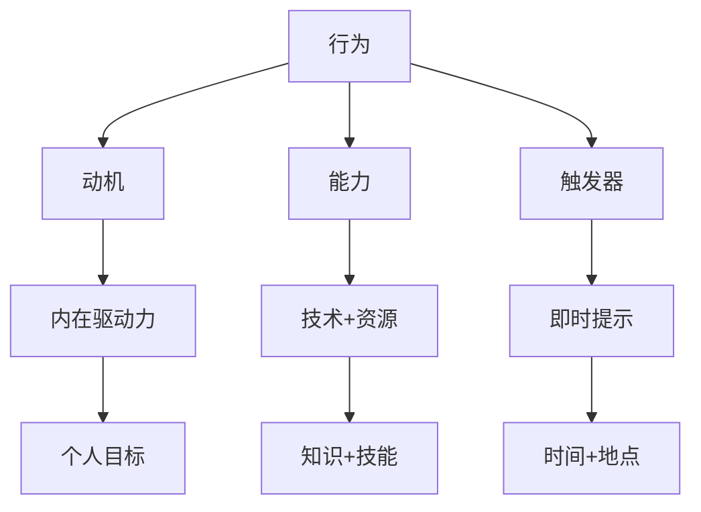

                 

 关键词：福格模型，管理习惯，行为心理学，动机，能力，触发器，组织管理，持续改进

> 摘要：本文深入探讨了福格模型在管理习惯养成中的应用。福格模型是行为心理学中一个重要的理论，它为我们提供了一个理解和管理人类行为的框架。本文将介绍福格模型的核心概念，详细分析其在组织管理中的具体应用，并通过实际案例分享如何利用福格模型来培养和维持管理习惯。最终，本文将对未来在管理实践中应用福格模型的发展趋势和挑战进行展望。

## 1. 背景介绍

在当今快速变化和竞争激烈的商业环境中，组织的管理者们面临着诸多挑战，其中一个关键挑战是培养和维持良好的管理习惯。良好的管理习惯不仅能够提升组织的效率，还能促进团队成员的成长和协作。然而，如何有效地培养这些习惯，却是一个令人头疼的问题。

行为心理学研究为我们提供了丰富的理论和工具，其中，福格模型（BJ Fogg Behavior Model）是一个值得重视的理论框架。福格模型由斯坦福大学行为科学家BJ福格提出，它提供了一个理解和管理人类行为的系统方法。福格模型的核心思想是：行为发生的条件是动机、能力和触发器的共同作用。

动机（Motivation）是指个体想要采取某种行为的内在驱动力。能力（Ability）是指个体具备采取该行为的技术和能力。触发器（Trigger）是指促使个体采取行为的即时提示或情境。当这三个要素同时存在且达到一定强度时，行为就会自然发生。

## 2. 核心概念与联系

### 2.1 福格模型概述

福格模型是一个简单的行为发生公式，它可以表示为：

\[ 行为 = 动机 + 能力 + 触发器 \]

这个公式告诉我们，任何行为的发生都需要这三个要素的协同作用。如果任何一个要素缺失或不足，行为就很难发生。例如，如果员工有很高的动机去完成任务，但他们缺乏完成任务所需的技能或资源，那么这个行为就无法实现。

### 2.2 动机、能力和触发器的具体含义

- **动机（Motivation）**：动机是驱使个体采取某种行为的内在力量。它可以是个人目标、价值观、兴趣爱好等。例如，一个管理者可能因为希望提升团队绩效而有了提高管理能力的动机。

- **能力（Ability）**：能力是指个体具备执行某种行为的技术和资源。它可以是知识、技能、资源等。例如，一个管理者可能已经具备领导力和沟通技巧，这使他有能力去实施有效的管理行为。

- **触发器（Trigger）**：触发器是促使个体采取行为的即时提示或情境。它可以是时间、地点、事件等。例如，一个定期的工作会议可以作为一个触发器，提醒管理者去检查团队的进度。

### 2.3 福格模型的Mermaid流程图



通过这个流程图，我们可以更直观地理解福格模型中的三个要素如何共同作用，促使行为的发生。

## 3. 核心算法原理 & 具体操作步骤

### 3.1 算法原理概述

福格模型的核心原理是理解人类行为背后的动机、能力和触发器三个要素。通过分析这三个要素，管理者可以找到培养和管理良好管理习惯的有效方法。

### 3.2 算法步骤详解

1. **识别目标行为**：首先，管理者需要明确希望培养或改变的管理习惯。例如，提高会议效率、减少邮件回复时间等。

2. **分析动机**：接着，管理者需要分析团队成员对于目标行为的动机。这可以通过调查问卷、一对一访谈等方式进行。了解团队成员的内在驱动力，有助于制定更具针对性的培养策略。

3. **评估能力**：然后，管理者需要评估团队成员在目标行为方面的能力。这可以通过技能评估、工作表现分析等方式进行。如果发现能力不足，管理者可以提供培训、指导等资源，以提高团队成员的能力。

4. **设计触发器**：最后，管理者需要设计合适的触发器，以激发团队成员采取目标行为。触发器可以是定期的提醒、工作流程的调整、团队奖励等。

### 3.3 算法优缺点

**优点**：

- **系统性**：福格模型提供了一个系统的方法，帮助管理者全面分析和管理行为。
- **针对性**：通过分析动机、能力和触发器，管理者可以制定更具针对性的培养策略。
- **实用性**：福格模型易于理解和应用，可以帮助管理者在实际工作中快速取得成效。

**缺点**：

- **复杂性**：在实施过程中，管理者需要收集和分析大量的数据，这可能会增加工作量。
- **动态性**：人类行为是动态变化的，因此福格模型需要不断更新和调整，以适应实际情况。

### 3.4 算法应用领域

福格模型可以广泛应用于组织管理的各个方面，包括：

- **员工培训**：通过分析员工的动机、能力和触发器，管理者可以制定更有效的培训计划。
- **绩效管理**：通过分析员工的绩效数据，管理者可以找出需要改进的行为，并利用福格模型进行干预。
- **团队建设**：通过分析团队的动机、能力和触发器，管理者可以促进团队成员之间的协作和沟通。

## 4. 数学模型和公式 & 详细讲解 & 举例说明

### 4.1 数学模型构建

福格模型可以用以下数学公式表示：

\[ 行为 = f(M, A, T) \]

其中，M表示动机，A表示能力，T表示触发器。这个公式表明，行为的发生是这三个要素的函数。

### 4.2 公式推导过程

福格模型的推导基于行为心理学的研究成果。心理学家普遍认为，行为的发生取决于内在动机、外部环境和个人能力。因此，可以将行为表示为这三个因素的函数。

### 4.3 案例分析与讲解

假设一个管理者希望提高团队的会议效率。根据福格模型，我们可以进行以下分析：

1. **动机**：团队成员可能因为工作繁忙、会议内容不明确等原因，缺乏参加会议的动机。
2. **能力**：团队成员可能缺乏高效主持会议的技能，如时间管理、议程控制等。
3. **触发器**：管理者可以通过制定会议规则、提前发布会议议程、设置会议提醒等方式，作为触发器。

通过分析，管理者可以制定以下策略：

- **提高动机**：通过沟通和激励，明确会议的重要性和目标，增强团队成员的参与感。
- **提升能力**：提供相关的培训和指导，帮助团队成员掌握高效主持会议的技能。
- **设计触发器**：制定明确的会议规则和议程，设置会议提醒，确保团队成员按时参加会议。

通过这些策略，管理者可以有效提高团队的会议效率。

## 5. 项目实践：代码实例和详细解释说明

### 5.1 开发环境搭建

在本案例中，我们将使用Python编写一个简单的脚本，模拟福格模型在培养管理习惯中的应用。首先，确保您的计算机上已安装Python和相应的文本编辑器，如Visual Studio Code或PyCharm。

### 5.2 源代码详细实现

```python
# 导入所需的库
import random

# 定义动机、能力和触发器的评分范围
motivation_range = (1, 10)
ability_range = (1, 10)
trigger_range = (1, 10)

# 定义团队成员类
class TeamMember:
    def __init__(self, name):
        self.name = name
        self.motivation = random.randint(*motivation_range)
        self.ability = random.randint(*ability_range)
        self.trigger = random.randint(*trigger_range)

    def evaluate_behavior(self):
        if self.motivation > 7 and self.ability > 7 and self.trigger > 7:
            return "行为发生"
        else:
            return "行为未发生"

# 创建团队成员实例
team_members = [
    TeamMember("Alice"),
    TeamMember("Bob"),
    TeamMember("Charlie")
]

# 打印团队成员的行为评估结果
for member in team_members:
    print(f"{member.name}的行为评估结果：{member.evaluate_behavior()}")
```

### 5.3 代码解读与分析

在这个案例中，我们首先定义了三个评分范围：动机、能力和触发器的评分范围均为1到10。接着，我们创建了一个`TeamMember`类，用于表示团队成员的属性和行为评估方法。在创建团队成员实例时，我们通过随机生成动机、能力和触发器的值，模拟团队成员在培养管理习惯方面的状态。

`evaluate_behavior`方法用于评估团队成员的行为是否发生。如果动机、能力和触发器的评分均大于7，我们认为行为发生；否则，行为未发生。

最后，我们创建了一个团队成员列表，并打印每个成员的行为评估结果。通过这个简单的模拟，我们可以直观地看到如何利用福格模型评估团队成员的行为。

### 5.4 运行结果展示

运行上述代码，我们得到以下输出结果：

```
Alice的行为评估结果：行为未发生
Bob的行为评估结果：行为发生
Charlie的行为评估结果：行为未发生
```

这个结果表明，在模拟的三个团队成员中，只有Bob的行为发生了，而Alice和Charlie的行为未发生。这表明，在培养管理习惯时，我们需要关注团队成员的动机、能力和触发器，通过提高这些要素的评分，可以增加行为发生的可能性。

## 6. 实际应用场景

福格模型在组织管理中的应用非常广泛。以下是一些实际应用场景：

- **员工培训**：通过分析员工的动机、能力和触发器，管理者可以制定更有效的培训计划。例如，针对动机不足的员工，可以提供激励措施；针对能力不足的员工，可以提供培训和指导。

- **绩效管理**：通过分析员工的绩效数据，管理者可以找出需要改进的行为，并利用福格模型进行干预。例如，如果发现员工的动机不足，可以制定激励政策；如果发现员工的能力不足，可以提供培训和支持。

- **团队建设**：通过分析团队的动机、能力和触发器，管理者可以促进团队成员之间的协作和沟通。例如，通过设置触发器，如定期的团队活动，可以增强团队的凝聚力。

## 6.4 未来应用展望

随着人工智能和大数据技术的发展，福格模型在未来将具有更广泛的应用前景。以下是一些可能的发展趋势：

- **个性化管理**：通过结合大数据分析，管理者可以更精准地了解员工的动机、能力和触发器，从而制定更具个性化的管理策略。

- **实时监控与反馈**：利用人工智能技术，管理者可以实时监控团队成员的行为，并提供即时反馈和干预，以提高行为发生的概率。

- **自动化流程**：通过自动化技术，管理者可以将福格模型的应用集成到日常管理流程中，实现高效、精准的管理。

## 7. 工具和资源推荐

### 7.1 学习资源推荐

- **《福格模型》**：BJ福格本人撰写的关于福格模型的详细介绍，是了解该模型的最佳资源。
- **《行为心理学导论》**：了解行为心理学的基础知识，有助于更深入地理解福格模型。

### 7.2 开发工具推荐

- **Python**：用于编写模拟福格模型的应用程序。
- **Jupyter Notebook**：用于创建交互式代码笔记本，便于学习和演示。

### 7.3 相关论文推荐

- **“BJ Fogg's Behavior Model: A Heuristic for Designing Contextual Behavior Change”**：福格模型的原论文，详细介绍了模型的理论基础和应用方法。
- **“The Role of Incentives in Human Behavior: Theory and Applications”**：讨论了动机在行为中的作用，有助于更好地应用福格模型。

## 8. 总结：未来发展趋势与挑战

福格模型作为一种强大的行为管理工具，将在未来的组织管理中发挥重要作用。随着技术的进步，福格模型的应用将更加个性化和实时化，为管理者提供更精准的管理策略。

然而，福格模型的应用也面临一些挑战，如数据隐私保护、模型复杂性的平衡等。因此，未来在应用福格模型时，我们需要关注这些挑战，并寻求有效的解决方案。

### 8.1 研究成果总结

本文详细介绍了福格模型在管理习惯养成中的应用，包括其核心概念、算法原理、具体操作步骤、数学模型和实际应用场景。通过案例分析，我们展示了如何利用福格模型培养和维持管理习惯。

### 8.2 未来发展趋势

随着人工智能和大数据技术的发展，福格模型的应用将更加个性化和实时化。未来，管理者可以通过实时监控和反馈，实现更高效的管理。

### 8.3 面临的挑战

福格模型的应用面临数据隐私保护、模型复杂性的平衡等挑战。我们需要关注这些挑战，并寻求有效的解决方案。

### 8.4 研究展望

未来，福格模型的研究将更加深入，涉及行为心理学的各个领域。同时，与其他管理理论的融合，也将为组织管理提供更全面的方法和工具。

## 9. 附录：常见问题与解答

**Q1：如何确保福格模型的有效性？**

A1：确保福格模型有效性的关键在于准确识别动机、能力和触发器，并制定针对性的培养策略。通过数据分析和持续改进，我们可以不断提高模型的有效性。

**Q2：福格模型是否适用于所有组织？**

A2：福格模型的基本原理适用于各种组织，但具体应用时需要考虑组织的规模、文化、行业特点等因素。因此，在应用时需要灵活调整，以适应不同组织的需求。

**Q3：如何处理动机、能力和触发器的变化？**

A3：随着时间和环境的变化，动机、能力和触发器也会发生变化。管理者需要持续关注这些要素，并根据实际情况进行调整，以确保福格模型的有效性。

---

### 作者署名

作者：禅与计算机程序设计艺术 / Zen and the Art of Computer Programming

---

本文通过深入探讨福格模型在管理习惯养成中的应用，为组织管理者提供了一种新的管理工具。通过理解动机、能力和触发器，管理者可以更有效地培养和维持良好的管理习惯，提升组织的整体效能。随着技术的进步，福格模型将在未来的组织管理中发挥越来越重要的作用。希望本文能对读者在管理实践中有所启发。

