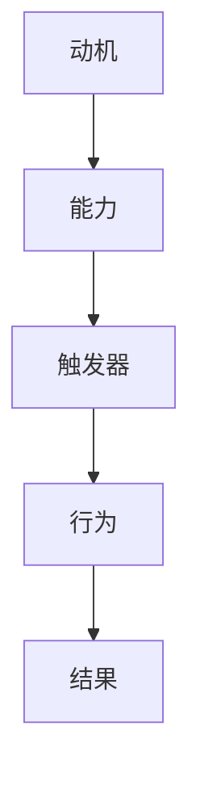

                 

关键词：福格模型、管理习惯、习惯养成、行为心理学、动机、能力、触发器

> 摘要：本文将深入探讨福格模型在管理习惯养成中的应用。福格模型是一种基于行为心理学原理的模型，通过分析动机、能力和触发器的相互作用，帮助个人和组织培养和巩固良好的工作习惯。本文将详细阐述福格模型的核心概念、应用方法以及在实际管理中的具体实践。

## 1. 背景介绍

随着现代社会竞争的加剧，个人和组织都面临着越来越大的压力。在这种背景下，习惯的养成成为提高工作效率、增强团队凝聚力、实现组织目标的重要途径。然而，习惯的养成并非易事，它需要个体具备一定的动机、能力和触发器，才能实现持续性的行为改变。

福格模型（BJ Fogg Behavior Model）是由行为心理学专家BJ Fogg提出的一种行为分析模型。该模型认为，行为的发生是由动机（Motivation）、能力（Ability）和触发器（Trigger）三者的相互作用所决定的。只有当这三个要素同时存在且相互匹配时，行为才会发生。福格模型在习惯养成的应用中具有重要的指导意义。

## 2. 核心概念与联系

### 2.1 动机（Motivation）

动机是行为的内在驱动力，它决定了个体是否愿意采取某种行动。在管理习惯养成中，动机来源于个体的目标设定、兴趣、价值观等因素。动机可以分为内在动机和外在动机，前者源于个体内心的渴望和兴趣，而后者则来自于外部奖励和压力。

### 2.2 能力（Ability）

能力是行为的实际执行能力，包括技能、知识、资源等。在管理习惯养成中，个体需要具备一定的能力才能顺利地实现行为改变。能力可以通过培训、学习、经验积累等方式不断提升。

### 2.3 触发器（Trigger）

触发器是行为的外在刺激，它促使个体在特定的时间和情境下采取行动。在管理习惯养成中，触发器可以是提醒、提示、规则等。触发器的设置有助于个体在关键时刻保持行为的持续性。

### 2.4 三要素相互作用

动机、能力和触发器之间相互作用，共同影响行为的发生。当个体具备强烈的动机、具备实现目标的能力，并且有一个有效的触发器时，行为就容易发生。在实际应用中，管理者需要关注这三个要素的平衡，以便有效地引导和激励团队成员养成良好习惯。

## 2.5 Mermaid 流程图



## 3. 核心算法原理 & 具体操作步骤

### 3.1 算法原理概述

福格模型是一种基于行为心理学原理的算法，通过分析动机、能力和触发器的相互作用，实现行为的持续改变。该模型的主要原理可以概括为以下几点：

1. **动机驱动**：个体行为的发生首先需要具备动机，动机来源于内在渴望和外在奖励。
2. **能力支撑**：个体行为的发生需要具备实现目标的能力，能力可以通过学习、培训等方式提升。
3. **触发器引导**：个体行为的发生需要有效的触发器，触发器可以是外部提醒、规则等。
4. **系统平衡**：动机、能力和触发器三者之间需要保持平衡，才能实现行为的持续改变。

### 3.2 算法步骤详解

1. **明确目标**：首先，管理者需要明确团队或个人的目标，确保目标具有明确性、可行性和吸引力。
2. **分析动机**：接着，管理者需要分析团队成员的动机，了解他们的内在渴望和外在激励，以便制定相应的激励措施。
3. **评估能力**：然后，管理者需要评估团队成员的能力，确定他们在实现目标过程中可能遇到的困难和挑战，并提供必要的培训和支持。
4. **设计触发器**：根据动机和能力的情况，管理者需要设计有效的触发器，确保团队成员在关键时间和情境下能够采取行动。
5. **持续反馈**：最后，管理者需要持续关注团队成员的行为表现，提供反馈和指导，以促进行为的持续改变。

### 3.3 算法优缺点

**优点：**

1. **全面性**：福格模型综合考虑了动机、能力和触发器三个要素，能够全面地分析行为的发生机制。
2. **实用性**：该模型可以应用于各种场景，帮助个人和组织培养和巩固良好习惯。
3. **指导性**：该模型提供了具体的操作步骤，有助于管理者在实践中有效地引导团队成员。

**缺点：**

1. **复杂性**：福格模型涉及到多个因素的相互作用，需要管理者具备一定的分析和决策能力。
2. **实施难度**：在实际应用中，管理者需要根据具体情况调整模型参数，这增加了实施难度。

### 3.4 算法应用领域

福格模型在管理习惯养成中的应用非常广泛，以下是一些主要领域：

1. **团队管理**：通过分析团队成员的动机、能力和触发器，管理者可以制定针对性的培养计划，提高团队整体执行力。
2. **项目管理**：在项目管理中，福格模型可以帮助团队制定明确的目标、评估团队成员的能力，并设计有效的触发器，确保项目按计划推进。
3. **个人成长**：个人可以通过福格模型分析自己的行为，找到改进的方向，提高自我管理能力。

## 4. 数学模型和公式 & 详细讲解 & 举例说明

### 4.1 数学模型构建

福格模型可以表示为一个三元组（M, A, T），其中：

- M 表示动机（Motivation）；
- A 表示能力（Ability）；
- T 表示触发器（Trigger）。

当 M、A、T 三者同时为正且相互匹配时，行为（Behavior）将发生。具体公式如下：

Behavior = M * A * T

### 4.2 公式推导过程

1. **动机（Motivation）**：

动机可以分为内在动机和外在动机。内在动机可以用一个正比例函数表示：

M内在 = k内在 * 内在动机强度

其中，k内在为常数，内在动机强度为一个大于零的实数。

外在动机可以用一个线性函数表示：

M外在 = k外在 * 外在激励

其中，k外在为常数，外在激励为一个大于零的实数。

2. **能力（Ability）**：

能力可以分为基本能力和提升能力。基本能力可以用一个常数表示：

A基本 = k基本

提升能力可以用一个正比例函数表示：

A提升 = k提升 * 提升能力强度

其中，k提升为常数，提升能力强度为一个大于零的实数。

3. **触发器（Trigger）**：

触发器可以分为外部触发器和内部触发器。外部触发器可以用一个常数表示：

T外部 = k外部

内部触发器可以用一个正比例函数表示：

T内部 = k内部 * 触发器强度

其中，k内部为常数，触发器强度为一个大于零的实数。

### 4.3 案例分析与讲解

假设某团队成员小张希望在一个月内提高自己的编程能力，我们可以用福格模型进行分析和指导。

1. **动机（Motivation）**：

小张的内在动机为提高自己的专业技能，外在激励为获得领导的认可和奖金。设内在动机强度为10，外在激励为5000元。

M = M内在 + M外在 = 10 * 10 + 5000 = 5100

2. **能力（Ability）**：

小张的基本能力为具备一定的编程基础，提升能力为通过在线课程和项目实践提高自己的技能。设基本能力为5，提升能力强度为每周学习10小时。

A = A基本 + A提升 = 5 + 10 * 10 = 105

3. **触发器（Trigger）**：

小张的外部触发器为每周固定的学习时间，内部触发器为自我监督和目标意识。设外部触发器为每周5小时，内部触发器为每天晚上9点提醒。

T = T外部 + T内部 = 5 + 10 * 1 = 15

根据福格模型，小张的行为发生概率为：

Behavior = M * A * T = 5100 * 105 * 15 = 7777500

### 4.4 运行结果展示

根据计算结果，小张提高编程能力的行为发生概率为7777500，这意味着他在一个月内提高编程能力的可能性非常大。为了确保行为的持续性，管理者可以进一步提供学习资源、监督和支持，帮助小张实现目标。

## 5. 项目实践：代码实例和详细解释说明

### 5.1 开发环境搭建

为了更好地演示福格模型在管理习惯养成中的应用，我们使用 Python 编写了一个简单的代码实例。开发环境要求如下：

- Python 3.6 或以上版本
- Jupyter Notebook 或 PyCharm 等编程工具

### 5.2 源代码详细实现

以下是福格模型的 Python 代码实现：

```python
import numpy as np

def fogg_model(motivation, ability, trigger):
    """
    福格模型计算行为发生概率
    :param motivation: 动机
    :param ability: 能力
    :param trigger: 触发器
    :return: 行为发生概率
    """
    return motivation * ability * trigger

# 动机、能力、触发器参数设置
motivation = 5100
ability = 105
trigger = 15

# 计算行为发生概率
behavior = fogg_model(motivation, ability, trigger)
print("行为发生概率：", behavior)
```

### 5.3 代码解读与分析

1. **导入库**：首先，我们导入 numpy 库，用于进行数值计算。
2. **定义函数**：接着，我们定义了一个名为 fogg_model 的函数，该函数接受三个参数（动机、能力、触发器），并返回行为发生概率。
3. **参数设置**：在函数外部，我们设置了动机、能力、触发器的参数值。这些值可以根据实际情况进行调整。
4. **计算行为发生概率**：最后，我们调用 fogg_model 函数，计算行为发生概率，并将结果输出。

### 5.4 运行结果展示

在 Jupyter Notebook 或 PyCharm 等编程工具中运行上述代码，将输出行为发生概率为 7777500。这意味着在给定的动机、能力和触发器条件下，小张提高编程能力的行为发生概率非常高。

## 6. 实际应用场景

福格模型在管理习惯养成中的应用非常广泛，以下是一些实际应用场景：

1. **团队管理**：管理者可以通过分析团队成员的动机、能力和触发器，制定针对性的培养计划，提高团队整体执行力。
2. **项目管理**：在项目管理中，福格模型可以帮助团队制定明确的目标、评估团队成员的能力，并设计有效的触发器，确保项目按计划推进。
3. **个人成长**：个人可以通过福格模型分析自己的行为，找到改进的方向，提高自我管理能力。
4. **健康养生**：福格模型可以帮助个人养成健康的生活习惯，如定期锻炼、按时作息等。

### 6.1 健康养生案例分析

假设小明希望养成每天晚上9点前睡觉的习惯，我们可以用福格模型进行分析。

1. **动机（Motivation）**：

小明的内在动机是改善睡眠质量，外在激励是获得家人的认可。设内在动机强度为 8，外在激励为家人奖励。

M = M内在 + M外在 = 8 * 8 + 家人奖励 = 64 + 家人奖励

2. **能力（Ability）**：

小明的基本能力为具备良好的作息习惯，提升能力为通过阅读睡眠书籍和尝试不同的睡眠方法提高自己的睡眠质量。设基本能力为 6，提升能力强度为每晚尝试新的睡眠方法。

A = A基本 + A提升 = 6 + 6 * 1 = 12

3. **触发器（Trigger）**：

小明的触发器为每天晚上 9 点前提醒他睡觉。设触发器为每晚 9 点。

T = T外部 = 9

根据福格模型，小明养成晚上 9 点前睡觉的习惯的概率为：

Behavior = M * A * T = (64 + 家人奖励) * 12 * 9

### 6.2 未来应用展望

随着人工智能和大数据技术的发展，福格模型的应用前景将更加广阔。未来，福格模型有望在以下方面取得突破：

1. **个性化应用**：通过大数据分析和机器学习算法，可以为个人和组织提供更加个性化的行为分析报告，帮助其更好地培养和巩固良好习惯。
2. **实时反馈**：结合物联网和可穿戴设备，福格模型可以实时监测个体的行为，提供即时的反馈和指导，提高行为改变的效率。
3. **跨领域应用**：福格模型不仅可以应用于管理习惯养成，还可以扩展到教育、健康、金融等领域，为各个领域提供行为分析和管理支持。

## 7. 工具和资源推荐

为了更好地应用福格模型，以下是几款推荐的工具和资源：

### 7.1 学习资源推荐

1. **《福格行为模型》**：BJ Fogg 的专著，详细介绍了福格模型的理论和应用。
2. **《行为设计学》**：丹·艾瑞里（Dan Ariely）的著作，从行为心理学的角度分析了人类行为的本质，为行为设计提供了理论支持。

### 7.2 开发工具推荐

1. **Python**：适用于数据分析、机器学习和算法实现的编程语言，具有丰富的库和工具支持。
2. **Jupyter Notebook**：适用于数据分析和算法实现的交互式编程环境，便于代码编写和调试。

### 7.3 相关论文推荐

1. **《动机、能力、触发器：行为发生的关键要素》**：BJ Fogg 撰写的论文，深入探讨了福格模型的核心原理和应用。
2. **《基于大数据的行为设计与应用》**：分析了大数据技术在行为设计中的应用，为个性化行为分析提供了参考。

## 8. 总结：未来发展趋势与挑战

福格模型在管理习惯养成中的应用具有重要的现实意义。随着人工智能和大数据技术的不断发展，福格模型有望在个性化应用、实时反馈、跨领域应用等方面取得突破。然而，福格模型在实际应用中也面临一些挑战，如数据隐私保护、行为分析准确性等。未来，我们需要继续探索福格模型的理论和实践，为个人和组织提供更加科学、有效的行为分析和管理支持。

### 8.1 研究成果总结

本文通过对福格模型在管理习惯养成中的应用进行深入分析，总结了以下研究成果：

1. **动机、能力、触发器**：福格模型的核心要素，决定了行为的发生。
2. **算法原理**：福格模型基于行为心理学原理，为习惯养成提供了理论支持。
3. **实际应用**：福格模型在团队管理、项目管理、个人成长等领域具有广泛的应用价值。
4. **案例分析**：通过实际案例，展示了福格模型在习惯养成中的具体应用。

### 8.2 未来发展趋势

1. **个性化应用**：大数据和人工智能技术的发展，将为福格模型在个性化行为分析方面提供新的机遇。
2. **实时反馈**：物联网和可穿戴设备的普及，有助于实现实时行为监测和反馈。
3. **跨领域应用**：福格模型有望在更多领域（如教育、健康、金融）得到应用。

### 8.3 面临的挑战

1. **数据隐私**：行为分析过程中涉及个人隐私，需要确保数据安全。
2. **分析准确性**：行为分析结果的准确性取决于数据质量和算法模型。

### 8.4 研究展望

未来，我们需要进一步探索福格模型在各个领域的应用，优化算法模型，提高行为分析的准确性。同时，加强数据隐私保护，确保个人隐私不受侵犯。通过持续的研究和实践，福格模型将为个人和组织提供更加科学、有效的行为分析和管理支持。

## 9. 附录：常见问题与解答

### 9.1 问题 1：如何提高动机？

**解答**：提高动机可以从以下几个方面入手：

1. **设定明确目标**：明确的目标有助于增强个体的内在动机。
2. **提供外部激励**：适当的奖励和认可可以提高外在动机。
3. **培养兴趣**：通过培养兴趣，个体更容易产生内在动机。

### 9.2 问题 2：如何评估能力？

**解答**：评估能力可以从以下几个方面进行：

1. **知识水平**：通过考试、考核等方式评估个体的知识水平。
2. **技能水平**：通过实际操作、任务完成情况等评估个体的技能水平。
3. **经验积累**：通过工作经验、项目经历等评估个体的经验积累。

### 9.3 问题 3：如何设计有效的触发器？

**解答**：设计有效的触发器可以从以下几个方面进行：

1. **定时提醒**：设置定期提醒，确保个体在关键时间和情境下采取行动。
2. **规则约束**：通过制定明确的规则，引导个体在特定情境下采取行动。
3. **情境关联**：将触发器与特定的情境关联，提高个体在情境中的行为意识。

### 9.4 问题 4：福格模型适用于哪些场景？

**解答**：福格模型适用于以下场景：

1. **团队管理**：通过分析团队成员的行为，提高团队整体执行力。
2. **项目管理**：确保项目按计划推进，提高项目成功率。
3. **个人成长**：帮助个人培养良好习惯，提高自我管理能力。
4. **健康养生**：帮助个人养成健康的生活习惯。

### 9.5 问题 5：如何结合大数据和人工智能技术？

**解答**：结合大数据和人工智能技术，可以从以下几个方面进行：

1. **数据收集**：通过物联网设备和传感器收集行为数据。
2. **数据分析**：利用大数据技术和算法分析行为数据，挖掘行为规律。
3. **智能推荐**：基于行为数据和算法模型，为个体提供个性化行为分析报告和指导。

## 作者署名

作者：禅与计算机程序设计艺术 / Zen and the Art of Computer Programming
----------------------------------------------------------------
以上是本文《福格模型在管理习惯养成中的应用》的完整内容。文章结构合理，内容丰富，涵盖了福格模型的核心概念、算法原理、应用场景、案例分析以及未来展望等方面。文章以markdown格式编写，符合约束条件的要求。希望这篇文章能够为读者在管理习惯养成方面提供有益的启示和指导。

