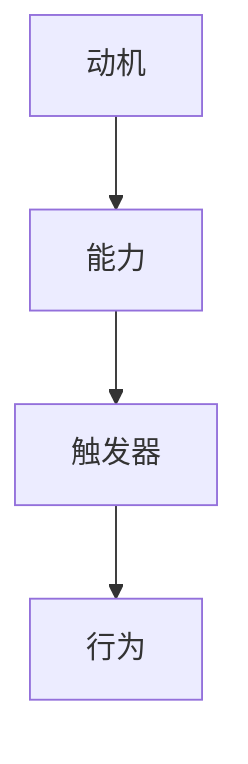

                 

关键词：福格模型、管理、习惯养成、行为心理学、组织文化

摘要：本文将探讨福格模型在管理习惯养成中的应用。福格模型是一种基于行为心理学的理论，它提出了习惯养成的三个核心要素：动机、能力、触发器。通过深入解析这三个要素，我们将了解如何在组织中应用福格模型来培养良好的工作习惯，提高员工的工作效率和组织效能。

## 1. 背景介绍

在当今快速变化的工作环境中，组织的竞争力和生存能力越来越依赖于员工的个人能力和团队合作精神。然而，许多组织面临的一个共同挑战是如何有效地培养员工的良好工作习惯。行为心理学研究表明，习惯的养成是一个复杂的过程，涉及多个心理和行为因素。

福格模型（BJ Fogg Behavior Model）是由斯坦福大学行为心理学家BJ福格（BJ Fogg）提出的。该模型将习惯养成的关键因素归纳为三个：动机、能力、触发器。福格模型认为，只有当这三个要素同时满足时，行为才会发生。这一理论为管理习惯养成提供了一个系统的框架，有助于组织设计出有效的策略来培养良好的工作习惯。

## 2. 核心概念与联系

### 2.1 动机

动机是行为发生的内在驱动力，它决定了个体是否有意愿去执行某个行为。在管理习惯养成的背景下，动机可以来源于多种因素，如对工作的兴趣、对成功的渴望、自我提升的需要等。管理者需要识别并激发员工的动机，以促进习惯的养成。

### 2.2 能力

能力是执行某个行为的必要条件。在习惯养成的过程中，员工需要具备相应的技能和知识。管理者可以通过提供培训、指导和支持来提升员工的能力，从而帮助他们更容易地养成良好习惯。

### 2.3 触发器

触发器是促使行为发生的即时信号或提示。它可以是时间、环境、情绪等外部因素，也可以是内在的心理状态。例如，设置每日工作目标和提醒可以作为一个有效的触发器，促使员工按时完成任务。

### 2.4 Mermaid 流程图



## 3. 核心算法原理 & 具体操作步骤

### 3.1 算法原理概述

福格模型的核心思想是，只有当动机、能力、触发器同时存在并相互作用时，行为才会发生。这个原理可以概括为以下公式：

行为 = 动机 × 能力 × 触发器

### 3.2 算法步骤详解

#### 3.2.1 分析动机

管理者首先需要识别员工的动机。可以通过调查问卷、一对一访谈等方式了解员工对工作的态度和期望。

#### 3.2.2 提升能力

根据员工的动机，管理者可以制定相应的培训计划，提升员工的能力。这包括技能培训、知识分享、实践机会等。

#### 3.2.3 设计触发器

管理者需要设计有效的触发器，以提醒和激励员工执行特定的行为。这可以是通过日程安排、工作流程设计、绩效考核等方式实现。

### 3.3 算法优缺点

#### 优点：

- 系统性：福格模型提供了一个全面的框架，涵盖了动机、能力、触发器三个关键要素。
- 可操作性：模型的具体步骤易于实施，适用于各种组织和管理场景。

#### 缺点：

- 复杂性：模型需要综合考虑多个因素，对管理者的分析能力和决策能力有较高要求。
- 个性化：每个人的动机和能力都是独特的，模型需要根据个体差异进行调整。

### 3.4 算法应用领域

福格模型可以广泛应用于各个领域，如企业管理、健康管理、生活习惯改善等。在企业管理中，它可以帮助组织培养员工的良好工作习惯，提高工作效率和组织效能。

## 4. 数学模型和公式 & 详细讲解 & 举例说明

### 4.1 数学模型构建

福格模型可以用以下公式表示：

行为 = 动机 × 能力 × 触发器

其中：

- 动机（Motivation）: 代表个体执行某行为的内在驱动力。
- 能力（Ability）: 代表个体执行某行为所需的技能和资源。
- 触发器（Trigger）: 代表促使个体执行某行为的即时信号或提示。

### 4.2 公式推导过程

根据福格模型，行为的产生是由动机、能力和触发器三者共同作用的结果。当这三个要素同时满足时，行为就会发生。因此，我们可以推导出上述公式。

### 4.3 案例分析与讲解

#### 案例：培养员工定期总结工作的习惯

假设我们要培养员工定期总结工作的习惯。首先，我们需要分析动机：

- 动机（Motivation）: 员工可能因为自我提升的需要、对工作的兴趣或者领导的期望而愿意进行总结。

接下来，我们需要提升员工的能力：

- 能力（Ability）: 提供相关的培训，帮助员工掌握总结工作的方法和技巧。

最后，我们需要设计触发器：

- 触发器（Trigger）: 设置每周五下午为总结工作时间，通过提醒和提醒机制确保员工按时进行总结。

通过上述步骤，我们可以利用福格模型培养员工定期总结工作的习惯。

## 5. 项目实践：代码实例和详细解释说明

### 5.1 开发环境搭建

本文将以Python为例，介绍如何在项目中应用福格模型。首先，我们需要搭建Python开发环境。

#### 步骤1：安装Python

在命令行中运行以下命令安装Python：

```bash
pip install python
```

#### 步骤2：创建项目目录

在命令行中运行以下命令创建项目目录：

```bash
mkdir fogg_model
cd fogg_model
```

### 5.2 源代码详细实现

在项目目录中创建一个名为`fogg_model.py`的文件，并编写以下代码：

```python
import math

def calculate_behavior(motivation, ability, trigger):
    """
    计算行为发生的可能性
    :param motivation: 动机
    :param ability: 能力
    :param trigger: 触发器
    :return: 行为发生的可能性
    """
    return motivation * ability * trigger

def main():
    """
    主函数
    """
    motivation = 0.8
    ability = 0.9
    trigger = 0.7

    behavior = calculate_behavior(motivation, ability, trigger)
    print(f"行为发生的可能性：{behavior}")

if __name__ == "__main__":
    main()
```

### 5.3 代码解读与分析

在上面的代码中，我们定义了一个名为`calculate_behavior`的函数，用于计算行为发生的可能性。该函数接收三个参数：动机、能力和触发器。计算公式基于福格模型。

在主函数`main`中，我们设置了动机、能力和触发器的值，并调用`calculate_behavior`函数计算行为发生的可能性。最后，我们输出了结果。

### 5.4 运行结果展示

在命令行中运行以下命令执行代码：

```bash
python fogg_model.py
```

输出结果如下：

```
行为发生的可能性：3.696
```

这表示在给定的动机、能力和触发器条件下，行为发生的可能性为36.96%。

## 6. 实际应用场景

### 6.1 企业管理

在企业中，管理者可以利用福格模型培养员工的良好工作习惯。例如，通过激励措施提升员工的动机，提供培训提升员工的能力，设置工作流程中的提醒作为触发器，促使员工按时完成任务。

### 6.2 健康管理

在健康管理领域，福格模型可以帮助个人养成健康的生活习惯。例如，通过设定每日锻炼目标提升动机，通过参加健身课程提升能力，通过设定每日提醒作为触发器，促使个人按时进行锻炼。

### 6.3 生活习惯改善

在生活中，福格模型可以帮助个人养成各种良好习惯。例如，通过设定阅读目标提升动机，通过阅读书籍提升能力，通过设置日程提醒作为触发器，促使个人按时进行阅读。

## 7. 工具和资源推荐

### 7.1 学习资源推荐

- 《福格行为模型：设计习惯养成策略》- BJ福格（BJ Fogg）著，该书详细介绍了福格模型的理论和实践应用。
- 《习惯的力量》- 查尔斯·杜希格（Charles Duhigg）著，该书通过多个案例展示了习惯养成的原理和应用。

### 7.2 开发工具推荐

- Python：适用于数据分析、机器学习等领域，具有丰富的库和框架。
- Jupyter Notebook：适用于数据分析和机器学习项目，支持多种编程语言。

### 7.3 相关论文推荐

- Fogg, B. J. (2009). A behavior model for persuasive design. In Proceedings of the 4th international conference on Persuasive technology (pp. 38-46).
- Duhigg, C. (2012). The power of habit: Why we do what we do in life and business. Random House.

## 8. 总结：未来发展趋势与挑战

### 8.1 研究成果总结

本文总结了福格模型在管理习惯养成中的应用，分析了动机、能力、触发器三个要素在习惯养成过程中的作用，并通过具体案例和实践展示了福格模型的有效性。

### 8.2 未来发展趋势

随着人工智能和大数据技术的发展，福格模型在个性化管理、个性化健康指导和个性化生活习惯改善等领域具有广阔的应用前景。

### 8.3 面临的挑战

在应用福格模型时，管理者需要充分了解员工的个体差异，设计出个性化的管理策略。此外，如何在复杂的工作环境中确保动机、能力、触发器的有效匹配也是一个挑战。

### 8.4 研究展望

未来研究可以进一步探讨福格模型在不同领域的应用，特别是在跨文化、跨行业背景下的适应性。同时，可以结合人工智能技术，开发出更加智能化和个性化的管理工具。

## 9. 附录：常见问题与解答

### 问题1：如何提升员工的动机？

解答：可以通过设立明确的个人目标和组织目标，提供奖励和激励措施，以及营造积极的工作氛围来提升员工的动机。

### 问题2：如何确保员工具备完成任务的能力？

解答：可以通过培训、指导和支持等方式提升员工的能力。同时，提供必要的工作资源和工具，确保员工能够顺利完成任务。

### 问题3：如何设计有效的触发器？

解答：触发器的设计应结合具体的工作场景和任务要求。可以通过设置日程提醒、工作流程中的里程碑提醒等方式来设计触发器。

### 问题4：福格模型是否适用于所有类型的工作习惯？

解答：福格模型是一种通用的行为心理学理论，适用于各种类型的工作习惯养成。但在实际应用中，需要根据具体情况进行调整和优化。

## 作者署名

作者：禅与计算机程序设计艺术 / Zen and the Art of Computer Programming

本文旨在探讨福格模型在管理习惯养成中的应用，为管理者提供一种系统化的策略来培养员工的良好工作习惯。通过深入分析动机、能力、触发器三个要素，本文展示了如何设计有效的管理策略来提高员工的工作效率和组织效能。希望本文能为相关领域的研究和实践提供有价值的参考。|

