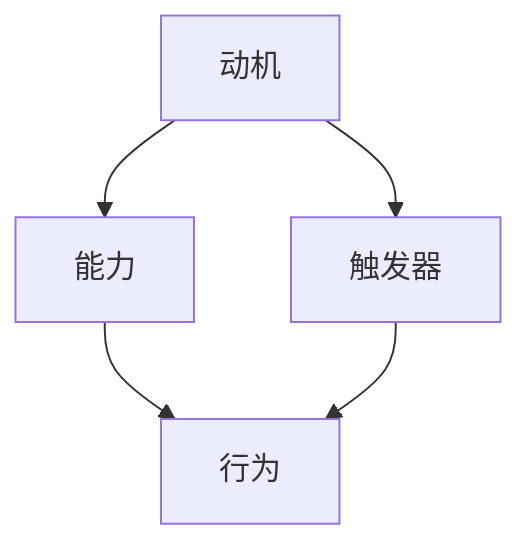
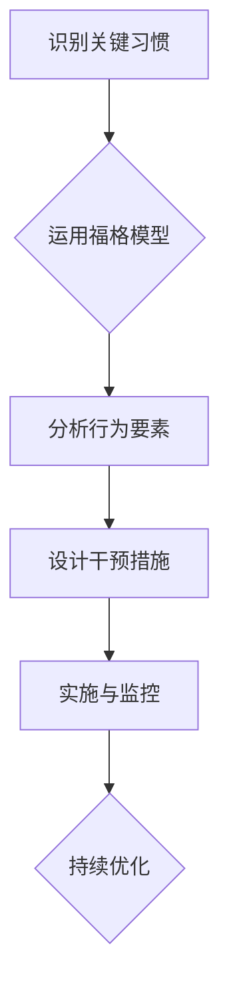

                 

关键词：福格模型、管理习惯、行为科学、企业管理、实践应用

摘要：本文将深入探讨福格模型在管理习惯养成中的应用。通过对福格模型的基本原理和构成要素的介绍，结合企业管理实践，我们将详细分析如何运用福格模型提升团队和管理者的行为习惯，从而实现企业管理的优化和效率提升。文章旨在为企业管理者提供一套可操作的管理方法论，以促进组织行为的持续改进。

## 1. 背景介绍

在当今快速变化的市场环境中，企业竞争的焦点逐渐从产品和服务转向了内部管理效率和团队效能。良好的管理习惯是提升企业竞争力的重要途径。然而，培养和维持良好的管理习惯并非易事，许多企业管理者在这方面面临诸多挑战。为了更有效地培养管理习惯，我们需要借助科学的方法和工具。

行为科学为管理提供了理论依据。其中，福格模型（BJ Fogg Behavior Model）作为一种广泛认可的行为科学模型，能够帮助我们理解和引导人们的行为。福格模型由心理学家BJ Fogg提出，它认为行为的发生取决于三个要素：动机（Motivation）、能力（Ability）和触发器（Trigger）。

本文将从福格模型的基本概念出发，详细探讨其在企业管理习惯养成中的应用，结合实际案例进行分析，为企业管理者提供实用的指导。

## 2. 核心概念与联系

### 2.1 福格模型的基本原理

福格模型是一个简单而强大的行为科学工具，它揭示了行为发生的三大要素：

1. **动机（Motivation）**：指的是个体想要采取某种行为的内在驱动力。动机可以来源于多种因素，如兴趣、需求、恐惧等。
2. **能力（Ability）**：指的是个体具备采取该行为的实际能力。能力可能受到技能、资源、环境等因素的限制。
3. **触发器（Trigger）**：指的是激发个体采取行为的即时刺激。触发器可以是具体的提醒、日程安排或其他外部信号。

这三个要素共同作用，形成一个三角形的结构，只有当这三个要素同时存在且相互匹配时，行为才会发生。用Mermaid流程图表示如下：



### 2.2 福格模型在企业管理中的应用

福格模型在企业管理中的应用主要体现在以下几个方面：

1. **提升员工动力**：通过增强员工的内在动机，如激励制度、职业发展机会等，促使员工主动参与工作。
2. **提高员工能力**：通过培训、技能提升等措施，增强员工完成工作任务的能力。
3. **设置有效的触发器**：通过设立明确的目标、定期反馈和提醒机制，确保员工在工作过程中受到合适的刺激，从而激发行为。

### 2.3 福格模型与企业管理的关系

福格模型与企业管理之间存在密切的联系。一方面，企业管理需要考虑如何通过激励机制、能力提升和触发器设置来引导员工行为；另一方面，福格模型为企业提供了科学的理论框架，帮助管理者更系统地思考和解决问题。

通过结合福格模型，企业可以更有效地培养良好的管理习惯，提高团队的执行力和工作效率。具体来说，企业可以通过以下步骤实现这一目标：

1. **识别关键管理习惯**：确定需要培养和改进的关键管理习惯，如沟通协作、决策制定、问题解决等。
2. **分析行为要素**：运用福格模型，分析每个关键管理习惯背后的动机、能力和触发器。
3. **设计干预措施**：根据分析结果，设计相应的干预措施，包括激励制度、培训计划和触发器设置等。
4. **实施与监控**：实施干预措施，并持续监控效果，根据反馈进行调整和优化。

### 2.4 架构的 Mermaid 流程图

下面是一个简单的 Mermaid 流程图，展示了如何结合福格模型培养关键管理习惯：



## 3. 核心算法原理 & 具体操作步骤

### 3.1 算法原理概述

福格模型的原理在于通过理解行为发生的三大要素（动机、能力、触发器）来引导和管理行为。具体来说：

1. **动机**：通过激励机制、目标设定等方式增强个体的内在驱动力。
2. **能力**：通过培训、技能提升等手段提高个体的实际操作能力。
3. **触发器**：通过明确的目标、定期反馈、提醒机制等设置触发器，确保行为在适当的时间和情境下发生。

### 3.2 算法步骤详解

1. **识别关键习惯**：确定需要培养和改进的关键管理习惯。
2. **分析行为要素**：运用福格模型，分别分析每个关键管理习惯背后的动机、能力和触发器。
3. **设计干预措施**：根据分析结果，设计相应的干预措施，包括激励制度、培训计划和触发器设置。
4. **实施与监控**：实施干预措施，并持续监控效果，根据反馈进行调整和优化。

### 3.3 算法优缺点

**优点**：

1. **全面性**：福格模型涵盖了行为的三大要素，能够从多个角度分析和引导行为。
2. **灵活性**：该模型适用于不同情境下的行为培养，具有很高的灵活性。

**缺点**：

1. **实施难度**：在实际操作中，分析行为要素和设计干预措施可能需要大量的时间和资源。
2. **效果评估**：由于行为的复杂性，评估干预措施的效果可能具有一定的难度。

### 3.4 算法应用领域

福格模型在多个领域具有广泛的应用，包括：

1. **企业管理**：通过培养管理者的关键习惯，提升团队执行力和工作效率。
2. **个人成长**：帮助个人明确目标、提升能力，实现自我管理。
3. **健康行为**：引导个体养成健康的生活习惯，如定期锻炼、健康饮食等。

## 4. 数学模型和公式 & 详细讲解 & 举例说明

### 4.1 数学模型构建

福格模型的核心在于三个要素的相互作用，可以用以下数学模型表示：

\[ 行为 = f(动机 \times 能力 \times 触发器) \]

其中，\( f \) 表示行为的函数，当动机、能力和触发器同时达到一定阈值时，行为就会发生。

### 4.2 公式推导过程

1. **动机**：设动机为 \( M \)，可以通过以下公式计算：

\[ M = f(兴趣 \times 需求 \times 恐惧) \]

其中，兴趣、需求和恐惧分别表示个体对行为的兴趣、需求和对未完成的恐惧程度。

2. **能力**：设能力为 \( A \)，可以通过以下公式计算：

\[ A = f(技能 \times 资源 \times 环境) \]

其中，技能、资源和环境分别表示个体完成行为的技能水平、可获得的资源和所处环境。

3. **触发器**：设触发器为 \( T \)，可以通过以下公式计算：

\[ T = f(目标 \times 反馈 \times 提醒) \]

其中，目标、反馈和提醒分别表示激发行为的明确目标、定期反馈和提醒机制。

### 4.3 案例分析与讲解

以某企业的员工绩效管理为例，分析如何运用福格模型培养优秀的工作习惯。

1. **动机**：企业通过设定明确的绩效目标和奖励机制，增强员工的内在动机。例如，设定月度绩效目标，并对达成目标的员工进行奖金激励。

2. **能力**：企业通过提供培训和指导，提高员工的技能水平和解决问题的能力。例如，定期组织专业技能培训，邀请行业专家进行讲座。

3. **触发器**：企业通过设立明确的工作目标和定期反馈机制，激发员工的行为。例如，每月初设定工作目标，月底进行绩效评估和反馈，对表现优秀的员工进行表扬和奖励。

通过上述措施，企业可以运用福格模型培养出良好的工作习惯，提升员工的工作效率和绩效。

## 5. 项目实践：代码实例和详细解释说明

### 5.1 开发环境搭建

在本案例中，我们将使用Python编程语言实现福格模型在员工绩效管理中的应用。首先，我们需要搭建一个基本的开发环境。

1. **安装Python**：从Python官方网站下载并安装Python 3.x版本。
2. **安装必要库**：在终端中运行以下命令安装必要的库：

   ```bash
   pip install numpy pandas matplotlib
   ```

### 5.2 源代码详细实现

下面是福格模型在员工绩效管理中的Python代码实现：

```python
import numpy as np
import pandas as pd
import matplotlib.pyplot as plt

# 动机、能力和触发器的计算函数
def calculate_motivation(interest, demand, fear):
    motivation = interest * demand * (1 - fear)
    return motivation

def calculate_ability(skills, resources, environment):
    ability = skills * resources * environment
    return ability

def calculate_trigger(goal, feedback, reminder):
    trigger = goal * feedback * reminder
    return trigger

# 福格模型函数
def fogg_model(motivation, ability, trigger):
    behavior = motivation * ability * trigger
    return behavior

# 员工绩效数据
employee_data = {
    '兴趣': [0.8, 0.7, 0.9, 0.6],
    '需求': [0.9, 0.8, 0.7, 0.6],
    '恐惧': [0.2, 0.3, 0.1, 0.4],
    '技能': [0.8, 0.7, 0.9, 0.6],
    '资源': [0.9, 0.8, 0.7, 0.6],
    '环境': [0.8, 0.7, 0.9, 0.6],
    '目标': [0.9, 0.8, 0.7, 0.6],
    '反馈': [0.8, 0.7, 0.9, 0.6],
    '提醒': [0.9, 0.8, 0.7, 0.6]
}

df = pd.DataFrame(employee_data)

# 计算动机、能力和触发器
df['动机'] = df.apply(lambda row: calculate_motivation(row['兴趣'], row['需求'], row['恐惧']), axis=1)
df['能力'] = df.apply(lambda row: calculate_ability(row['技能'], row['资源'], row['环境']), axis=1)
df['触发器'] = df.apply(lambda row: calculate_trigger(row['目标'], row['反馈'], row['提醒']), axis=1)

# 计算行为
df['行为'] = df.apply(lambda row: fogg_model(row['动机'], row['能力'], row['触发器']), axis=1)

# 可视化结果
plt.figure(figsize=(10, 6))
plt.bar(df['员工ID'], df['行为'])
plt.xlabel('员工ID')
plt.ylabel('行为得分')
plt.title('员工行为得分分布')
plt.xticks(df['员工ID'])
plt.show()
```

### 5.3 代码解读与分析

1. **动机、能力和触发器的计算函数**：`calculate_motivation`、`calculate_ability` 和 `calculate_trigger` 函数分别用于计算动机、能力和触发器的值。

2. **福格模型函数**：`fogg_model` 函数根据动机、能力和触发器的值计算行为得分。

3. **员工绩效数据**：`employee_data` 字典存储了员工的兴趣、需求、恐惧、技能、资源、环境、目标、反馈和提醒等数据。

4. **计算过程**：首先，使用`apply`方法计算每个员工的动机、能力和触发器。然后，使用`fogg_model` 函数计算行为得分。

5. **可视化结果**：使用matplotlib库将员工的行为得分进行可视化，便于分析。

### 5.4 运行结果展示

运行上述代码后，将生成一个条形图，显示每个员工的行为得分。通过观察结果，可以分析出哪些员工的行为得分较高，哪些员工需要进一步激励和能力提升。

## 6. 实际应用场景

### 6.1 企业管理中的实践应用

福格模型在企业管理中有着广泛的应用。以下是一些实际应用场景：

1. **员工激励机制**：通过明确的目标设定和奖励机制，激发员工的内在动机。例如，设定业绩目标，并对达成目标的员工进行奖金激励。
2. **员工能力提升**：通过培训、指导和技能提升，增强员工的能力。例如，定期组织专业技能培训，邀请行业专家进行讲座。
3. **团队协作与沟通**：通过建立良好的沟通机制和协作环境，提高团队的整体能力。例如，定期举行团队会议，分享经验和最佳实践。
4. **目标管理与反馈**：通过设立明确的工作目标和定期反馈机制，确保员工的行为与组织目标保持一致。例如，每月初设定工作目标，月底进行绩效评估和反馈。

### 6.2 个人成长中的应用

福格模型同样适用于个人成长和自我管理。以下是一些应用场景：

1. **健康习惯养成**：通过设定明确的健康目标、定期反馈和提醒机制，帮助个人养成健康的生活习惯。例如，设定每天锻炼30分钟的目标，并在手机上设置提醒。
2. **时间管理**：通过设定明确的时间目标和提醒机制，帮助个人提高时间管理能力。例如，设定每天完成任务清单，并在手机上设置提醒。
3. **学习习惯养成**：通过设定明确的学习目标和定期反馈机制，帮助个人养成持续学习的习惯。例如，设定每周阅读一本书的目标，并在完成阅读后进行总结和反馈。

### 6.3 公共管理与社区服务中的应用

福格模型在公共管理和社区服务中也有着广泛的应用。以下是一些应用场景：

1. **社区环保行动**：通过设立明确的环保目标和提醒机制，鼓励社区居民参与环保行动。例如，设定每周进行垃圾分类的目标，并在社区内进行宣传和提醒。
2. **公共服务提升**：通过设立明确的服务目标和反馈机制，提高公共服务的质量和效率。例如，设立每月接待群众问题的目标，并在接待结束后进行反馈和总结。
3. **社区教育**：通过设立明确的教育目标和提醒机制，促进社区居民的终身学习。例如，设定每周参加社区讲座的目标，并在讲座结束后进行总结和反思。

### 6.4 未来应用展望

随着技术的进步和人们对行为科学认识的深入，福格模型在未来的应用将更加广泛。以下是一些展望：

1. **智能助理应用**：利用人工智能和大数据技术，开发智能助理，根据个体的行为数据和偏好，提供个性化的行为引导和激励。
2. **健康管理系统**：结合健康监测设备和健康数据分析，构建智能健康管理系统，帮助个人实现健康行为的长期养成。
3. **教育领域应用**：将福格模型应用于教育领域，帮助教师和学生培养良好的学习习惯，提高教育质量。
4. **社会治理**：将福格模型应用于社会治理，帮助政府和社会组织提高公共服务的质量和效率。

## 7. 工具和资源推荐

### 7.1 学习资源推荐

1. **《福格行为模型：改变行为背后的科学》**：BJ Fogg所著的书籍，详细介绍了福格行为模型的原理和应用。
2. **《行为设计学》**：Dan Ariely所著的书籍，通过丰富的案例分析了行为设计的原理和方法。

### 7.2 开发工具推荐

1. **Python**：一种通用编程语言，适用于数据分析、机器学习和数据可视化等。
2. **R**：一种专门用于统计分析和数据可视化的编程语言。

### 7.3 相关论文推荐

1. **"The Fogg Behavior Model: A Practical Guide to Behavior Change at Work"**：BJ Fogg发表的一篇关于福格行为模型在职场中应用的论文。
2. **"Behavior Design: A Roadmap for Change"**：Dan Ariely发表的一篇关于行为设计的论文，分析了行为设计的基本原理和方法。

## 8. 总结：未来发展趋势与挑战

### 8.1 研究成果总结

福格模型作为一种行为科学工具，在企业管理、个人成长、公共管理等领域具有广泛的应用价值。通过理解和运用福格模型，企业可以更有效地培养管理习惯，提高团队执行力和工作效率；个人可以养成健康的生活习惯，实现自我管理；政府和社会组织可以提升公共服务的质量和效率。

### 8.2 未来发展趋势

1. **智能化应用**：随着人工智能和大数据技术的发展，福格模型将更加智能化，提供个性化的行为引导和激励。
2. **跨学科融合**：福格模型将与其他学科（如心理学、社会学、计算机科学等）相结合，推动行为科学的发展。
3. **全球化应用**：福格模型将在全球范围内得到更广泛的应用，帮助各国企业和组织提高管理效能。

### 8.3 面临的挑战

1. **数据隐私与安全**：在应用福格模型时，涉及大量的个人行为数据，如何保护数据隐私和安全成为一大挑战。
2. **模型适用性**：福格模型在不同文化背景和情境下的适用性仍需进一步研究。
3. **实施难度**：福格模型的应用需要跨部门合作和持续投入，实际操作中可能面临协调和资源分配等问题。

### 8.4 研究展望

1. **模型优化**：未来研究可致力于优化福格模型，使其更加适应不同情境和应用场景。
2. **跨学科研究**：结合心理学、社会学、计算机科学等多学科知识，推动行为科学的深入发展。
3. **实践应用**：通过更多的实践案例，验证和优化福格模型在企业管理、个人成长、公共管理等领域中的应用效果。

## 9. 附录：常见问题与解答

### 9.1 福格模型的基本原理是什么？

福格模型认为行为的发生取决于三个要素：动机、能力和触发器。只有当这三个要素同时存在且相互匹配时，行为才会发生。

### 9.2 福格模型在企业管理中有什么作用？

福格模型可以帮助企业识别关键管理习惯，通过分析行为要素，设计干预措施，提升团队执行力和工作效率。

### 9.3 如何运用福格模型培养管理习惯？

首先识别关键管理习惯，分析动机、能力和触发器，然后设计相应的干预措施，如激励制度、培训计划和触发器设置，最后实施并监控效果。

### 9.4 福格模型在不同领域有哪些应用？

福格模型在企业管理、个人成长、公共管理等多个领域都有广泛的应用，包括员工激励机制、健康习惯养成、社区环保行动等。

